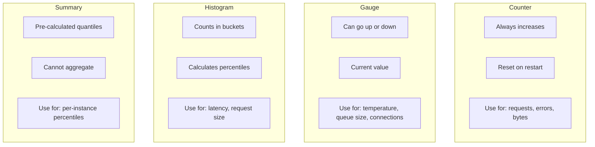

# How to Implement Custom Metrics in Prometheus

Author: [nawazdhandala](https://www.github.com/nawazdhandala)

Tags: Prometheus, Custom Metrics, Instrumentation, Monitoring, Observability, Application Performance

Description: A practical guide to implementing custom application metrics in Prometheus, covering metric types, naming conventions, and instrumentation patterns in multiple programming languages.

---

Built-in infrastructure metrics only tell part of the story. Custom application metrics reveal business logic performance, user behavior, and domain-specific health indicators. This guide shows you how to implement custom metrics effectively.

## Metric Types Overview

Prometheus supports four metric types:



| Type | When to Use | Example |
|------|-------------|---------|
| Counter | Cumulative values that only increase | Requests, errors, bytes sent |
| Gauge | Values that can go up or down | Temperature, queue depth, connections |
| Histogram | Distribution of values | Request latency, response sizes |
| Summary | Pre-calculated percentiles | Per-instance latency percentiles |

## Python Implementation

### Setup

```bash
pip install prometheus-client
```

### Basic Metrics

```python
from prometheus_client import Counter, Gauge, Histogram, Summary, start_http_server
import time
import random

# Counter - tracks cumulative values
requests_total = Counter(
    'http_requests_total',
    'Total HTTP requests',
    ['method', 'endpoint', 'status']
)

# Gauge - tracks current values
active_connections = Gauge(
    'active_connections',
    'Number of active connections',
    ['service']
)

queue_depth = Gauge(
    'queue_depth',
    'Current queue depth',
    ['queue_name']
)

# Histogram - tracks distributions with buckets
request_latency = Histogram(
    'http_request_duration_seconds',
    'HTTP request latency',
    ['method', 'endpoint'],
    buckets=[0.01, 0.025, 0.05, 0.1, 0.25, 0.5, 1.0, 2.5, 5.0, 10.0]
)

# Summary - tracks percentiles
response_size = Summary(
    'http_response_size_bytes',
    'HTTP response size',
    ['endpoint']
)
```

### Using Metrics

```python
from flask import Flask, request, g
import time

app = Flask(__name__)

@app.before_request
def before_request():
    g.start_time = time.time()

@app.after_request
def after_request(response):
    # Record request count
    requests_total.labels(
        method=request.method,
        endpoint=request.endpoint or 'unknown',
        status=response.status_code
    ).inc()

    # Record latency
    latency = time.time() - g.start_time
    request_latency.labels(
        method=request.method,
        endpoint=request.endpoint or 'unknown'
    ).observe(latency)

    # Record response size
    response_size.labels(
        endpoint=request.endpoint or 'unknown'
    ).observe(len(response.data))

    return response

@app.route('/api/orders', methods=['POST'])
def create_order():
    # Business logic
    order = process_order(request.json)

    # Track business metric
    orders_created_total.labels(
        product_type=order.product_type,
        region=order.region
    ).inc()

    return {'order_id': order.id}

@app.route('/metrics')
def metrics():
    from prometheus_client import generate_latest, CONTENT_TYPE_LATEST
    return generate_latest(), 200, {'Content-Type': CONTENT_TYPE_LATEST}
```

### Decorators for Timing

```python
from prometheus_client import Histogram
from functools import wraps
import time

function_duration = Histogram(
    'function_duration_seconds',
    'Time spent in function',
    ['function_name']
)

def track_time(func):
    """Decorator to track function execution time."""
    @wraps(func)
    def wrapper(*args, **kwargs):
        start = time.time()
        try:
            return func(*args, **kwargs)
        finally:
            duration = time.time() - start
            function_duration.labels(function_name=func.__name__).observe(duration)
    return wrapper

@track_time
def process_payment(payment_data):
    # Payment processing logic
    time.sleep(random.uniform(0.1, 0.5))
    return {'status': 'completed'}
```

## Go Implementation

### Setup

```go
import (
    "github.com/prometheus/client_golang/prometheus"
    "github.com/prometheus/client_golang/prometheus/promauto"
    "github.com/prometheus/client_golang/prometheus/promhttp"
)
```

### Defining Metrics

```go
package metrics

import (
    "github.com/prometheus/client_golang/prometheus"
    "github.com/prometheus/client_golang/prometheus/promauto"
)

var (
    // Counter
    RequestsTotal = promauto.NewCounterVec(
        prometheus.CounterOpts{
            Name: "http_requests_total",
            Help: "Total HTTP requests",
        },
        []string{"method", "endpoint", "status"},
    )

    // Gauge
    ActiveConnections = promauto.NewGaugeVec(
        prometheus.GaugeOpts{
            Name: "active_connections",
            Help: "Number of active connections",
        },
        []string{"service"},
    )

    QueueDepth = promauto.NewGauge(
        prometheus.GaugeOpts{
            Name: "queue_depth",
            Help: "Current queue depth",
        },
    )

    // Histogram
    RequestDuration = promauto.NewHistogramVec(
        prometheus.HistogramOpts{
            Name:    "http_request_duration_seconds",
            Help:    "HTTP request latency",
            Buckets: []float64{0.01, 0.025, 0.05, 0.1, 0.25, 0.5, 1.0, 2.5, 5.0},
        },
        []string{"method", "endpoint"},
    )

    // Summary
    ResponseSize = promauto.NewSummaryVec(
        prometheus.SummaryOpts{
            Name:       "http_response_size_bytes",
            Help:       "HTTP response size",
            Objectives: map[float64]float64{0.5: 0.05, 0.9: 0.01, 0.99: 0.001},
        },
        []string{"endpoint"},
    )
)
```

### HTTP Middleware

```go
package middleware

import (
    "net/http"
    "strconv"
    "time"

    "myapp/metrics"
)

// MetricsMiddleware records HTTP metrics
func MetricsMiddleware(next http.Handler) http.Handler {
    return http.HandlerFunc(func(w http.ResponseWriter, r *http.Request) {
        start := time.Now()

        // Wrap response writer to capture status code
        wrapped := &responseWriter{ResponseWriter: w, statusCode: http.StatusOK}

        next.ServeHTTP(wrapped, r)

        duration := time.Since(start).Seconds()
        endpoint := r.URL.Path

        // Record metrics
        metrics.RequestsTotal.WithLabelValues(
            r.Method,
            endpoint,
            strconv.Itoa(wrapped.statusCode),
        ).Inc()

        metrics.RequestDuration.WithLabelValues(
            r.Method,
            endpoint,
        ).Observe(duration)
    })
}

type responseWriter struct {
    http.ResponseWriter
    statusCode int
}

func (rw *responseWriter) WriteHeader(code int) {
    rw.statusCode = code
    rw.ResponseWriter.WriteHeader(code)
}
```

### Using Metrics in Handlers

```go
package handlers

import (
    "encoding/json"
    "net/http"
    "time"

    "myapp/metrics"
)

func CreateOrderHandler(w http.ResponseWriter, r *http.Request) {
    start := time.Now()

    // Parse request
    var order Order
    if err := json.NewDecoder(r.Body).Decode(&order); err != nil {
        metrics.RequestsTotal.WithLabelValues("POST", "/orders", "400").Inc()
        http.Error(w, err.Error(), http.StatusBadRequest)
        return
    }

    // Process order
    result, err := processOrder(order)
    if err != nil {
        metrics.OrderProcessingErrors.WithLabelValues(order.Type, err.Error()).Inc()
        http.Error(w, err.Error(), http.StatusInternalServerError)
        return
    }

    // Track business metrics
    metrics.OrdersCreated.WithLabelValues(order.Type, order.Region).Inc()
    metrics.OrderValue.WithLabelValues(order.Type).Observe(order.Value)
    metrics.OrderProcessingDuration.WithLabelValues(order.Type).Observe(time.Since(start).Seconds())

    // Respond
    w.Header().Set("Content-Type", "application/json")
    json.NewEncoder(w).Encode(result)
}
```

## Node.js Implementation

### Setup

```bash
npm install prom-client
```

### Basic Metrics

```javascript
const client = require('prom-client');

// Create a Registry
const register = new client.Registry();

// Add default metrics (process, nodejs)
client.collectDefaultMetrics({ register });

// Counter
const requestsTotal = new client.Counter({
    name: 'http_requests_total',
    help: 'Total HTTP requests',
    labelNames: ['method', 'endpoint', 'status'],
    registers: [register]
});

// Gauge
const activeConnections = new client.Gauge({
    name: 'active_connections',
    help: 'Number of active connections',
    labelNames: ['service'],
    registers: [register]
});

// Histogram
const requestDuration = new client.Histogram({
    name: 'http_request_duration_seconds',
    help: 'HTTP request latency',
    labelNames: ['method', 'endpoint'],
    buckets: [0.01, 0.025, 0.05, 0.1, 0.25, 0.5, 1.0, 2.5, 5.0],
    registers: [register]
});

// Summary
const responseSize = new client.Summary({
    name: 'http_response_size_bytes',
    help: 'HTTP response size',
    labelNames: ['endpoint'],
    percentiles: [0.5, 0.9, 0.99],
    registers: [register]
});

module.exports = {
    register,
    requestsTotal,
    activeConnections,
    requestDuration,
    responseSize
};
```

### Express Middleware

```javascript
const express = require('express');
const { register, requestsTotal, requestDuration } = require('./metrics');

const app = express();

// Metrics middleware
app.use((req, res, next) => {
    const start = Date.now();

    res.on('finish', () => {
        const duration = (Date.now() - start) / 1000;
        const endpoint = req.route ? req.route.path : req.path;

        requestsTotal.labels(req.method, endpoint, res.statusCode).inc();
        requestDuration.labels(req.method, endpoint).observe(duration);
    });

    next();
});

// Metrics endpoint
app.get('/metrics', async (req, res) => {
    res.set('Content-Type', register.contentType);
    res.end(await register.metrics());
});

// Application routes
app.post('/api/orders', async (req, res) => {
    // Track business metrics
    ordersCreated.labels(req.body.type, req.body.region).inc();

    // Process order...
    res.json({ orderId: '12345' });
});

app.listen(8080);
```

## Business Metrics Examples

### E-commerce Metrics

```python
# Order metrics
orders_total = Counter(
    'orders_total',
    'Total orders placed',
    ['product_category', 'payment_method', 'region']
)

order_value = Histogram(
    'order_value_dollars',
    'Order value in dollars',
    ['product_category'],
    buckets=[10, 25, 50, 100, 250, 500, 1000, 2500, 5000]
)

cart_abandonment_total = Counter(
    'cart_abandonment_total',
    'Cart abandonments',
    ['stage']  # 'cart', 'checkout', 'payment'
)

# Inventory metrics
inventory_level = Gauge(
    'inventory_level',
    'Current inventory level',
    ['product_id', 'warehouse']
)

# User metrics
active_users = Gauge(
    'active_users',
    'Currently active users',
    ['platform']  # 'web', 'ios', 'android'
)

user_signups_total = Counter(
    'user_signups_total',
    'Total user signups',
    ['source', 'plan']
)
```

### SaaS Application Metrics

```python
# API usage
api_calls_total = Counter(
    'api_calls_total',
    'Total API calls',
    ['tenant_id', 'endpoint', 'status']
)

api_rate_limit_hits = Counter(
    'api_rate_limit_hits_total',
    'Rate limit hits',
    ['tenant_id']
)

# Feature usage
feature_usage_total = Counter(
    'feature_usage_total',
    'Feature usage count',
    ['feature_name', 'tier']
)

# Subscription metrics
active_subscriptions = Gauge(
    'active_subscriptions',
    'Active subscriptions',
    ['plan', 'billing_period']
)

mrr_dollars = Gauge(
    'mrr_dollars',
    'Monthly recurring revenue',
    ['plan']
)

churn_total = Counter(
    'churn_total',
    'Customer churn',
    ['reason', 'plan']
)
```

### Background Job Metrics

```python
# Job execution
jobs_total = Counter(
    'background_jobs_total',
    'Total background jobs',
    ['job_type', 'status']  # status: 'success', 'failure', 'retry'
)

job_duration_seconds = Histogram(
    'background_job_duration_seconds',
    'Job execution time',
    ['job_type'],
    buckets=[1, 5, 10, 30, 60, 120, 300, 600]
)

# Queue metrics
job_queue_depth = Gauge(
    'job_queue_depth',
    'Jobs waiting in queue',
    ['queue_name', 'priority']
)

job_queue_latency_seconds = Histogram(
    'job_queue_latency_seconds',
    'Time from enqueue to processing start',
    ['queue_name'],
    buckets=[1, 5, 10, 30, 60, 300]
)
```

## Naming Conventions

Follow these patterns for consistent metric names:

```python
# Pattern: <namespace>_<name>_<unit>_<suffix>

# Good examples
http_requests_total              # Counter with _total suffix
http_request_duration_seconds    # Histogram with unit in name
process_memory_bytes             # Gauge with unit
queue_messages_total             # Counter

# Avoid
requestCount                     # Use snake_case
httpRequestLatency              # Include unit
requests                        # Too generic
```

### Labels

```python
# Good label practices
requests_total.labels(
    method='POST',           # Lowercase values
    endpoint='/api/orders',  # Meaningful grouping
    status='200'             # String, not int
).inc()

# Avoid high cardinality
requests_total.labels(
    user_id='123',          # Bad: unbounded cardinality
    request_id='abc-123',   # Bad: unique per request
    timestamp='2024-01-01'  # Bad: changes constantly
).inc()
```

## Best Practices

1. **Choose the right metric type** - Counters for totals, gauges for current state
2. **Use meaningful names** - Include unit, follow conventions
3. **Control cardinality** - Limit label values to bounded sets
4. **Add helpful descriptions** - Document what the metric measures
5. **Include units in names** - Seconds, bytes, not milliseconds, megabytes
6. **Use labels for dimensions** - Not separate metrics per dimension

---

Custom metrics bridge the gap between infrastructure monitoring and business observability. Instrument the operations that matter to your business, follow naming conventions, and keep cardinality under control.
