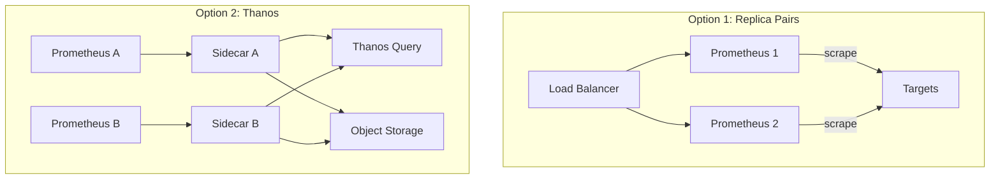
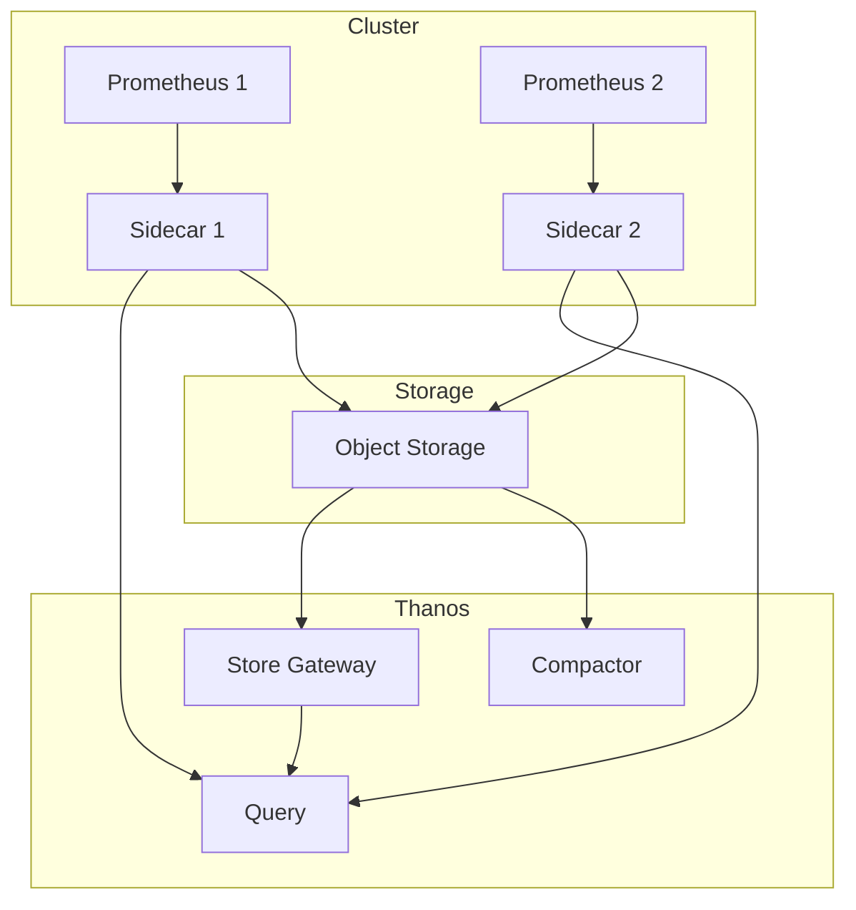

# How to Configure High Availability for Prometheus

Author: [nawazdhandala](https://www.github.com/nawazdhandala)

Tags: Prometheus, High Availability, Redundancy, Thanos, Monitoring, Reliability, SRE

Description: Learn how to set up highly available Prometheus deployments using replica pairs, Thanos, and proper deduplication strategies for reliable monitoring infrastructure.

---

A single Prometheus instance is a single point of failure. When it goes down, you lose visibility into your systems at the worst possible time. This guide covers strategies for running Prometheus with high availability.

## HA Architecture Options



## Basic HA: Replica Pairs

The simplest HA setup runs two identical Prometheus instances:

### Configuration

Both instances use the same configuration:

```yaml
# prometheus.yml (identical on both replicas)
global:
  scrape_interval: 15s
  evaluation_interval: 15s
  external_labels:
    # Differentiate replicas
    replica: prometheus-0  # Change to prometheus-1 on second instance

scrape_configs:
  - job_name: 'kubernetes-pods'
    kubernetes_sd_configs:
      - role: pod
    relabel_configs:
      # Standard Kubernetes relabeling
      - source_labels: [__meta_kubernetes_pod_annotation_prometheus_io_scrape]
        action: keep
        regex: true

rule_files:
  - /etc/prometheus/rules/*.yml

alerting:
  alertmanagers:
    - static_configs:
        - targets:
            - alertmanager:9093
```

### Kubernetes Deployment

```yaml
apiVersion: apps/v1
kind: StatefulSet
metadata:
  name: prometheus
  namespace: monitoring
spec:
  serviceName: prometheus
  replicas: 2
  selector:
    matchLabels:
      app: prometheus
  template:
    metadata:
      labels:
        app: prometheus
    spec:
      containers:
        - name: prometheus
          image: prom/prometheus:v2.50.0
          args:
            - '--config.file=/etc/prometheus/prometheus.yml'
            - '--storage.tsdb.path=/prometheus'
            - '--storage.tsdb.retention.time=15d'
            - '--web.enable-lifecycle'
          ports:
            - containerPort: 9090
          volumeMounts:
            - name: config
              mountPath: /etc/prometheus
            - name: data
              mountPath: /prometheus
          resources:
            requests:
              memory: 2Gi
              cpu: 500m
            limits:
              memory: 4Gi
              cpu: 1000m
      volumes:
        - name: config
          configMap:
            name: prometheus-config
  volumeClaimTemplates:
    - metadata:
        name: data
      spec:
        accessModes: ["ReadWriteOnce"]
        resources:
          requests:
            storage: 100Gi
```

### Load Balancing Queries

Create a service that load balances across replicas:

```yaml
apiVersion: v1
kind: Service
metadata:
  name: prometheus
  namespace: monitoring
spec:
  type: ClusterIP
  selector:
    app: prometheus
  ports:
    - port: 9090
      targetPort: 9090
```

### Handling Duplicate Alerts

Both replicas send alerts, causing duplicates. Configure Alertmanager to deduplicate:

```yaml
# alertmanager.yml
global:
  resolve_timeout: 5m

route:
  group_by: ['alertname', 'job']
  group_wait: 30s
  group_interval: 5m
  repeat_interval: 4h
  receiver: 'default'

receivers:
  - name: 'default'
    slack_configs:
      - channel: '#alerts'
        send_resolved: true

# Alerts from different replicas with same labels are deduplicated
```

## Thanos for HA and Long-Term Storage

Thanos extends Prometheus with global querying, unlimited retention, and proper deduplication.

### Architecture



### Prometheus with Thanos Sidecar

```yaml
apiVersion: apps/v1
kind: StatefulSet
metadata:
  name: prometheus
  namespace: monitoring
spec:
  serviceName: prometheus
  replicas: 2
  selector:
    matchLabels:
      app: prometheus
  template:
    metadata:
      labels:
        app: prometheus
    spec:
      containers:
        # Prometheus container
        - name: prometheus
          image: prom/prometheus:v2.50.0
          args:
            - '--config.file=/etc/prometheus/prometheus.yml'
            - '--storage.tsdb.path=/prometheus'
            - '--storage.tsdb.retention.time=2h'  # Short retention, Thanos handles long-term
            - '--storage.tsdb.min-block-duration=2h'
            - '--storage.tsdb.max-block-duration=2h'
            - '--web.enable-lifecycle'
          ports:
            - containerPort: 9090
          volumeMounts:
            - name: config
              mountPath: /etc/prometheus
            - name: data
              mountPath: /prometheus

        # Thanos sidecar
        - name: thanos-sidecar
          image: quay.io/thanos/thanos:v0.34.0
          args:
            - sidecar
            - '--tsdb.path=/prometheus'
            - '--prometheus.url=http://localhost:9090'
            - '--objstore.config-file=/etc/thanos/objstore.yml'
            - '--grpc-address=0.0.0.0:10901'
            - '--http-address=0.0.0.0:10902'
          ports:
            - containerPort: 10901
              name: grpc
            - containerPort: 10902
              name: http
          volumeMounts:
            - name: data
              mountPath: /prometheus
            - name: thanos-config
              mountPath: /etc/thanos

      volumes:
        - name: config
          configMap:
            name: prometheus-config
        - name: thanos-config
          secret:
            secretName: thanos-objstore

  volumeClaimTemplates:
    - metadata:
        name: data
      spec:
        accessModes: ["ReadWriteOnce"]
        resources:
          requests:
            storage: 50Gi
```

### Object Storage Configuration

```yaml
# thanos-objstore.yml
type: S3
config:
  bucket: thanos-metrics
  endpoint: s3.amazonaws.com
  region: us-east-1
  access_key: ${AWS_ACCESS_KEY_ID}
  secret_key: ${AWS_SECRET_ACCESS_KEY}
```

Create the secret:

```bash
kubectl create secret generic thanos-objstore \
  --from-file=objstore.yml=thanos-objstore.yml \
  -n monitoring
```

### Thanos Query

```yaml
apiVersion: apps/v1
kind: Deployment
metadata:
  name: thanos-query
  namespace: monitoring
spec:
  replicas: 2
  selector:
    matchLabels:
      app: thanos-query
  template:
    metadata:
      labels:
        app: thanos-query
    spec:
      containers:
        - name: thanos-query
          image: quay.io/thanos/thanos:v0.34.0
          args:
            - query
            - '--grpc-address=0.0.0.0:10901'
            - '--http-address=0.0.0.0:9090'
            # Connect to sidecars
            - '--store=dnssrv+_grpc._tcp.prometheus.monitoring.svc.cluster.local'
            # Connect to store gateway
            - '--store=dnssrv+_grpc._tcp.thanos-store.monitoring.svc.cluster.local'
            # Deduplication
            - '--query.replica-label=replica'
            - '--query.auto-downsampling'
          ports:
            - containerPort: 10901
              name: grpc
            - containerPort: 9090
              name: http
          resources:
            requests:
              memory: 512Mi
              cpu: 250m
---
apiVersion: v1
kind: Service
metadata:
  name: thanos-query
  namespace: monitoring
spec:
  type: ClusterIP
  selector:
    app: thanos-query
  ports:
    - port: 9090
      targetPort: 9090
      name: http
```

### Thanos Store Gateway

For querying historical data from object storage:

```yaml
apiVersion: apps/v1
kind: StatefulSet
metadata:
  name: thanos-store
  namespace: monitoring
spec:
  serviceName: thanos-store
  replicas: 1
  selector:
    matchLabels:
      app: thanos-store
  template:
    metadata:
      labels:
        app: thanos-store
    spec:
      containers:
        - name: thanos-store
          image: quay.io/thanos/thanos:v0.34.0
          args:
            - store
            - '--grpc-address=0.0.0.0:10901'
            - '--http-address=0.0.0.0:10902'
            - '--data-dir=/var/thanos/store'
            - '--objstore.config-file=/etc/thanos/objstore.yml'
          ports:
            - containerPort: 10901
              name: grpc
            - containerPort: 10902
              name: http
          volumeMounts:
            - name: data
              mountPath: /var/thanos/store
            - name: thanos-config
              mountPath: /etc/thanos
      volumes:
        - name: thanos-config
          secret:
            secretName: thanos-objstore
  volumeClaimTemplates:
    - metadata:
        name: data
      spec:
        accessModes: ["ReadWriteOnce"]
        resources:
          requests:
            storage: 20Gi
```

### Thanos Compactor

Downsamples and compacts blocks in object storage:

```yaml
apiVersion: apps/v1
kind: StatefulSet
metadata:
  name: thanos-compactor
  namespace: monitoring
spec:
  serviceName: thanos-compactor
  replicas: 1
  selector:
    matchLabels:
      app: thanos-compactor
  template:
    metadata:
      labels:
        app: thanos-compactor
    spec:
      containers:
        - name: thanos-compactor
          image: quay.io/thanos/thanos:v0.34.0
          args:
            - compact
            - '--http-address=0.0.0.0:10902'
            - '--data-dir=/var/thanos/compact'
            - '--objstore.config-file=/etc/thanos/objstore.yml'
            - '--retention.resolution-raw=30d'
            - '--retention.resolution-5m=90d'
            - '--retention.resolution-1h=1y'
            - '--wait'
          volumeMounts:
            - name: data
              mountPath: /var/thanos/compact
            - name: thanos-config
              mountPath: /etc/thanos
      volumes:
        - name: thanos-config
          secret:
            secretName: thanos-objstore
  volumeClaimTemplates:
    - metadata:
        name: data
      spec:
        accessModes: ["ReadWriteOnce"]
        resources:
          requests:
            storage: 100Gi
```

## Prometheus Operator HA Setup

Using the Prometheus Operator simplifies HA configuration:

```yaml
apiVersion: monitoring.coreos.com/v1
kind: Prometheus
metadata:
  name: prometheus
  namespace: monitoring
spec:
  # Run two replicas
  replicas: 2

  # Thanos sidecar configuration
  thanos:
    image: quay.io/thanos/thanos:v0.34.0
    objectStorageConfig:
      name: thanos-objstore
      key: objstore.yml

  # External labels for deduplication
  externalLabels:
    cluster: production

  # Replica label for Thanos deduplication
  replicaExternalLabelName: replica

  # Storage
  retention: 2h
  storage:
    volumeClaimTemplate:
      spec:
        resources:
          requests:
            storage: 50Gi

  # Resources
  resources:
    requests:
      memory: 2Gi
      cpu: 500m

  # Service monitors to scrape
  serviceMonitorSelector:
    matchLabels:
      team: platform

  # Alert rules
  ruleSelector:
    matchLabels:
      team: platform
```

## Deduplication Strategies

### Using External Labels

Configure each replica with a unique external label:

```yaml
# prometheus-0
global:
  external_labels:
    cluster: production
    replica: prometheus-0

# prometheus-1
global:
  external_labels:
    cluster: production
    replica: prometheus-1
```

### Thanos Query Deduplication

Thanos Query removes duplicate series:

```bash
thanos query \
  --query.replica-label=replica \
  --query.replica-label=prometheus_replica
```

When querying, only one copy of each metric is returned.

## Monitoring the HA Setup

```promql
# Check both replicas are scraping
count(up{job="prometheus"}) == 2

# Compare scrape targets between replicas
count by (replica) (up)

# Check Thanos sidecar status
thanos_sidecar_prometheus_up

# Check Thanos store gateway status
thanos_bucket_store_series_fetched_total

# Query latency through Thanos
histogram_quantile(0.99, rate(http_request_duration_seconds_bucket{handler="query"}[5m]))
```

## Best Practices

1. **Use identical configurations** - Both replicas should scrape the same targets
2. **Configure external labels** - Enable proper deduplication
3. **Use persistent storage** - Prevent data loss during restarts
4. **Monitor both replicas** - Alert if one goes down
5. **Test failover** - Regularly verify HA works as expected
6. **Size storage appropriately** - Plan for growth

### Alerting on HA Health

```yaml
groups:
  - name: prometheus-ha
    rules:
      - alert: PrometheusReplicaDown
        expr: |
          count(up{job="prometheus"}) < 2
        for: 5m
        labels:
          severity: warning
        annotations:
          summary: "Prometheus HA replica down"

      - alert: ThanosSidecarDown
        expr: |
          thanos_sidecar_prometheus_up == 0
        for: 5m
        labels:
          severity: critical
        annotations:
          summary: "Thanos sidecar cannot reach Prometheus"
```

---

High availability keeps your monitoring running when individual components fail. Start with replica pairs for basic HA, add Thanos for global querying and long-term storage, and always monitor your monitoring infrastructure.
