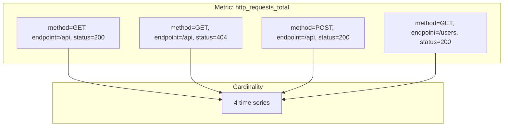

# How to Follow Label Best Practices in Prometheus

Author: [nawazdhandala](https://www.github.com/nawazdhandala)

Tags: Prometheus, Labels, Cardinality, Best Practices, Monitoring, Metrics, Observability

Description: Learn Prometheus label best practices to avoid cardinality explosions, improve query performance, and maintain a scalable monitoring infrastructure with practical examples and patterns.

---

Labels are the key to Prometheus's dimensional data model. They enable flexible querying and aggregation but can also cause performance problems when misused. This guide covers label best practices to keep your Prometheus deployment healthy.

## Understanding Labels and Cardinality

Every unique combination of metric name and label values creates a new time series:



Cardinality = methods x endpoints x status codes

With 3 methods, 100 endpoints, and 10 status codes: 3 x 100 x 10 = **3,000 time series**

## Label Anti-Patterns

### High Cardinality Labels

Avoid labels with unbounded or very high cardinality:

```python
# BAD: User ID creates millions of series
requests_total.labels(user_id=user.id).inc()

# BAD: Request ID is unique per request
requests_total.labels(request_id=uuid4()).inc()

# BAD: Timestamps change constantly
requests_total.labels(timestamp=datetime.now().isoformat()).inc()

# BAD: Email addresses are unbounded
errors_total.labels(email=user.email).inc()

# BAD: IP addresses can be numerous
requests_total.labels(client_ip=request.remote_addr).inc()
```

### Better Alternatives

```python
# GOOD: Use bounded categories instead of IDs
requests_total.labels(user_tier='premium').inc()

# GOOD: Group IPs by subnet or region
requests_total.labels(region='us-east').inc()

# GOOD: Use error types, not full messages
errors_total.labels(error_type='validation').inc()

# GOOD: Bucket continuous values
latency_bucket.labels(latency_range='100-500ms').inc()
```

## Label Design Principles

### 1. Labels Should Be Bounded

Every label should have a finite, predictable set of values:

```python
# Good bounded labels
http_requests_total.labels(
    method='POST',           # ~5-10 values
    endpoint='/api/orders',  # 10-100 values
    status='200',            # ~20 values
    service='order-api'      # 5-20 values
)

# Cardinality: 10 x 100 x 20 x 20 = 400,000 (manageable)
```

### 2. Labels Should Be Low Cardinality

Aim for labels with fewer than 100 unique values:

| Label | Values | Assessment |
|-------|--------|------------|
| method | 5-10 | Good |
| status_code | 20-30 | Good |
| endpoint | 10-100 | Acceptable |
| user_id | millions | Bad |
| request_id | infinite | Terrible |

### 3. Labels Should Be Useful for Aggregation

Include labels you'll actually query by:

```promql
# If you never query by datacenter, don't include it
sum by (service) (rate(requests_total[5m]))

# Only include labels you'll use for grouping or filtering
sum by (service, method) (rate(requests_total[5m]))
```

### 4. Use Consistent Naming

Follow naming conventions across all metrics:

```python
# Consistent label names
http_requests_total{service="api", environment="prod"}
http_errors_total{service="api", environment="prod"}
http_duration_seconds{service="api", environment="prod"}

# Not this (inconsistent)
http_requests_total{svc="api", env="production"}
http_errors_total{service_name="api", environment="prod"}
```

## Recommended Label Patterns

### Service Identification

```python
# Standard service labels
metrics.labels(
    service='order-api',      # Service name
    instance='order-api-1',   # Instance identifier
    namespace='production',   # Kubernetes namespace
    cluster='us-east-1',      # Cluster identifier
)
```

### Request Metrics

```python
# HTTP request labels
http_requests_total.labels(
    method='POST',            # HTTP method
    endpoint='/api/orders',   # Normalized endpoint path
    status='201',             # Status code (string)
)

# Avoid
http_requests_total.labels(
    path='/api/orders/12345', # Contains ID - high cardinality
    user='john@example.com',  # User identifier - very high cardinality
)
```

### Normalize Dynamic Paths

Convert dynamic paths to patterns:

```python
import re

def normalize_endpoint(path):
    """Convert /users/123 to /users/:id"""
    patterns = [
        (r'/users/\d+', '/users/:id'),
        (r'/orders/[a-f0-9-]+', '/orders/:id'),
        (r'/products/\d+', '/products/:id'),
    ]
    for pattern, replacement in patterns:
        path = re.sub(pattern, replacement, path)
    return path

# Usage
endpoint = normalize_endpoint('/users/12345/orders/abc-123')
# Result: /users/:id/orders/:id
http_requests_total.labels(endpoint=endpoint).inc()
```

### Error Handling

```python
# Good: Error categories
errors_total.labels(
    error_type='validation',   # Category
    error_code='E001',         # Bounded error codes
)

# Bad: Full error messages
errors_total.labels(
    error_message='User john@example.com not found'  # Unbounded
)
```

### Environment and Deployment

```python
# Common deployment labels
metrics.labels(
    environment='production',  # prod, staging, dev
    region='us-east-1',        # Cloud region
    version='1.2.3',           # Application version
    deployment='blue',         # Blue/green deployment
)
```

## Monitoring Cardinality

### Cardinality Metrics

Track series count to detect cardinality issues:

```promql
# Total active time series
prometheus_tsdb_head_series

# Series created in the last hour
increase(prometheus_tsdb_head_series_created_total[1h])

# Top metrics by series count
topk(10, count by (__name__) ({__name__!=""}))

# Series per job
count by (job) ({__name__!=""})
```

### Cardinality Alerts

```yaml
groups:
  - name: cardinality
    rules:
      - alert: HighCardinalityMetric
        expr: |
          count by (__name__) ({__name__!=""}) > 10000
        for: 10m
        labels:
          severity: warning
        annotations:
          summary: "Metric {{ $labels.__name__ }} has high cardinality"
          description: "{{ $value }} series for metric {{ $labels.__name__ }}"

      - alert: CardinalityGrowth
        expr: |
          rate(prometheus_tsdb_head_series_created_total[1h]) > 1000
        for: 30m
        labels:
          severity: warning
        annotations:
          summary: "Rapid series growth detected"
          description: "Creating {{ $value }} new series per second"
```

### Finding High Cardinality Labels

Query to identify problematic labels:

```promql
# Count unique label values
count(count by (endpoint) (http_requests_total))

# If this returns thousands, endpoint label has high cardinality
```

## Relabeling to Fix Cardinality

Use relabeling to normalize or drop high-cardinality labels:

```yaml
scrape_configs:
  - job_name: 'application'
    static_configs:
      - targets: ['app:8080']

    metric_relabel_configs:
      # Drop high-cardinality labels
      - action: labeldrop
        regex: 'request_id|trace_id|user_id'

      # Normalize paths with IDs
      - source_labels: [path]
        regex: '/users/[0-9]+'
        replacement: '/users/:id'
        target_label: path

      # Aggregate similar status codes
      - source_labels: [status]
        regex: '4..'
        replacement: '4xx'
        target_label: status_class
```

## Label Best Practices Summary

### Do

1. **Use bounded, low-cardinality values** - Keep under 100 unique values per label
2. **Normalize dynamic content** - Replace IDs with patterns
3. **Use consistent naming** - Same labels across related metrics
4. **Include useful aggregation dimensions** - Service, environment, region
5. **Monitor cardinality** - Track series count and growth

### Don't

1. **Use unbounded identifiers** - User IDs, request IDs, email addresses
2. **Include timestamps in labels** - They change constantly
3. **Use full error messages** - Categorize errors instead
4. **Add labels you won't query** - They increase cardinality without benefit
5. **Mix naming conventions** - Be consistent

### Label Checklist

Before adding a label, ask:

- [ ] Is the value set bounded and small (< 100 values)?
- [ ] Will I query by this label?
- [ ] Does this label already exist with a different name?
- [ ] Could I use a category instead of an ID?
- [ ] Have I tested the cardinality impact?

## Emergency Cardinality Reduction

If cardinality is already out of control:

### 1. Identify the Problem

```promql
# Find metrics with most series
topk(10, count by (__name__) ({__name__!=""}))

# For a specific metric, find high-cardinality labels
count by (label_name) (http_requests_total)
```

### 2. Add Drop Rules

```yaml
metric_relabel_configs:
  # Drop the problematic metric entirely
  - source_labels: [__name__]
    regex: 'problematic_metric'
    action: drop

  # Or drop specific label
  - action: labeldrop
    regex: 'high_cardinality_label'
```

### 3. Delete Historical Data

```bash
# Delete series matching a selector (requires admin API)
curl -X POST 'http://localhost:9090/api/v1/admin/tsdb/delete_series?match[]=problematic_metric'

# Clean up
curl -X POST http://localhost:9090/api/v1/admin/tsdb/clean_tombstones
```

---

Labels enable powerful querying but require careful management. Design labels with bounded cardinality from the start, monitor series growth, and use relabeling to fix problems before they impact performance. When in doubt, fewer labels with lower cardinality is better than more granular data you cannot query.
