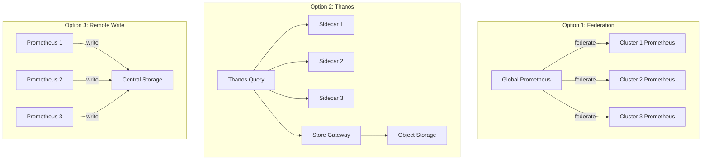
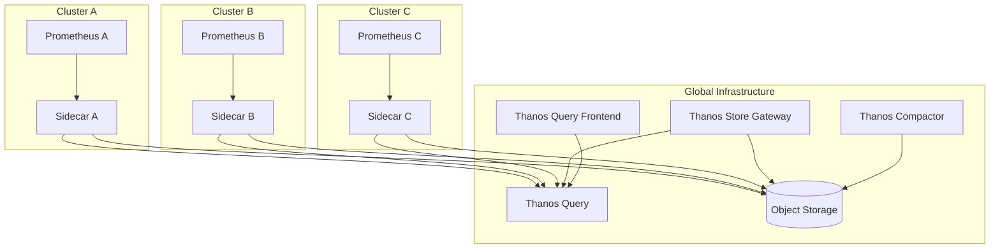

# How to Configure Multi-Cluster Prometheus

Author: [nawazdhandala](https://www.github.com/nawazdhandala)

Tags: Prometheus, Multi-cluster, Kubernetes, Federation, Thanos, Global Monitoring, SRE

Description: A comprehensive guide to monitoring multiple Kubernetes clusters with Prometheus, covering architecture patterns, federation, Thanos integration, and global alerting strategies.

---

Organizations running multiple Kubernetes clusters need a unified view of metrics across all environments. This guide covers strategies for multi-cluster Prometheus deployments, from simple federation to full Thanos architectures.

## Multi-Cluster Architecture Options



| Approach | Pros | Cons | Best For |
|----------|------|------|----------|
| Federation | Simple setup | Single point of failure | Small deployments |
| Thanos | HA, long-term storage | More complex | Large deployments |
| Remote Write | Simple, real-time | Requires central storage | Managed services |

## Per-Cluster Prometheus Setup

Each cluster runs its own Prometheus with cluster-identifying labels:

```yaml
# prometheus-values.yaml for Cluster A
prometheus:
  prometheusSpec:
    externalLabels:
      cluster: cluster-a
      region: us-east-1
      environment: production

    # Replica label for deduplication
    replicaExternalLabelName: prometheus_replica

    retention: 24h

    storageSpec:
      volumeClaimTemplate:
        spec:
          resources:
            requests:
              storage: 50Gi
```

Install in each cluster:

```bash
# Cluster A
kubectl config use-context cluster-a
helm install prometheus prometheus-community/kube-prometheus-stack \
  -f prometheus-values-cluster-a.yaml \
  -n monitoring

# Cluster B
kubectl config use-context cluster-b
helm install prometheus prometheus-community/kube-prometheus-stack \
  -f prometheus-values-cluster-b.yaml \
  -n monitoring
```

## Option 1: Federation

### Global Prometheus Configuration

Deploy a global Prometheus that federates from cluster-level instances:

```yaml
# global-prometheus.yml
global:
  scrape_interval: 60s
  evaluation_interval: 60s
  external_labels:
    role: global

scrape_configs:
  # Federate from Cluster A
  - job_name: 'federate-cluster-a'
    honor_labels: true
    metrics_path: '/federate'
    params:
      'match[]':
        # Only pull aggregated metrics
        - '{__name__=~"cluster:.*"}'
        - '{__name__=~"namespace:.*"}'
        - 'up{job=~".*"}'
    static_configs:
      - targets:
          - 'prometheus-cluster-a.example.com:9090'
        labels:
          cluster: cluster-a

  # Federate from Cluster B
  - job_name: 'federate-cluster-b'
    honor_labels: true
    metrics_path: '/federate'
    params:
      'match[]':
        - '{__name__=~"cluster:.*"}'
        - '{__name__=~"namespace:.*"}'
        - 'up{job=~".*"}'
    static_configs:
      - targets:
          - 'prometheus-cluster-b.example.com:9090'
        labels:
          cluster: cluster-b

  # Federate from Cluster C
  - job_name: 'federate-cluster-c'
    honor_labels: true
    metrics_path: '/federate'
    params:
      'match[]':
        - '{__name__=~"cluster:.*"}'
        - '{__name__=~"namespace:.*"}'
        - 'up{job=~".*"}'
    static_configs:
      - targets:
          - 'prometheus-cluster-c.example.com:9090'
        labels:
          cluster: cluster-c

rule_files:
  - /etc/prometheus/rules/*.yml

alerting:
  alertmanagers:
    - static_configs:
        - targets:
            - 'alertmanager:9093'
```

### Recording Rules for Federation

Create pre-aggregated metrics on each cluster:

```yaml
# recording-rules.yaml (deploy to each cluster)
groups:
  - name: cluster-aggregations
    interval: 60s
    rules:
      # CPU usage per namespace
      - record: namespace:container_cpu_usage_seconds:sum_rate5m
        expr: |
          sum by (namespace) (
            rate(container_cpu_usage_seconds_total{container!=""}[5m])
          )

      # Memory usage per namespace
      - record: namespace:container_memory_usage_bytes:sum
        expr: |
          sum by (namespace) (
            container_memory_usage_bytes{container!=""}
          )

      # Request rate per namespace
      - record: namespace:http_requests:rate5m
        expr: |
          sum by (namespace) (
            rate(http_requests_total[5m])
          )

      # Cluster-level aggregations
      - record: cluster:node_cpu:sum_rate5m
        expr: |
          sum(rate(node_cpu_seconds_total{mode!="idle"}[5m]))

      - record: cluster:node_memory_usage_bytes:sum
        expr: |
          sum(node_memory_MemTotal_bytes - node_memory_MemAvailable_bytes)
```

## Option 2: Thanos Multi-Cluster

### Architecture



### Per-Cluster Setup with Thanos Sidecar

```yaml
# prometheus-thanos-values.yaml
prometheus:
  prometheusSpec:
    externalLabels:
      cluster: cluster-a
      region: us-east-1

    replicaExternalLabelName: prometheus_replica

    # Short retention - Thanos handles long-term
    retention: 6h

    # Disable compaction - Thanos handles it
    disableCompaction: true

    storageSpec:
      volumeClaimTemplate:
        spec:
          resources:
            requests:
              storage: 50Gi

    # Thanos sidecar
    thanos:
      image: quay.io/thanos/thanos:v0.34.0
      objectStorageConfig:
        name: thanos-objstore
        key: objstore.yml
```

### Thanos Query Deployment (Global)

```yaml
apiVersion: apps/v1
kind: Deployment
metadata:
  name: thanos-query
  namespace: monitoring
spec:
  replicas: 2
  selector:
    matchLabels:
      app: thanos-query
  template:
    metadata:
      labels:
        app: thanos-query
    spec:
      containers:
        - name: thanos-query
          image: quay.io/thanos/thanos:v0.34.0
          args:
            - query
            - '--grpc-address=0.0.0.0:10901'
            - '--http-address=0.0.0.0:9090'
            # Connect to all cluster sidecars
            - '--store=prometheus-cluster-a.example.com:10901'
            - '--store=prometheus-cluster-b.example.com:10901'
            - '--store=prometheus-cluster-c.example.com:10901'
            # Connect to store gateway for historical data
            - '--store=thanos-store:10901'
            # Deduplication settings
            - '--query.replica-label=prometheus_replica'
            - '--query.auto-downsampling'
          ports:
            - containerPort: 9090
              name: http
            - containerPort: 10901
              name: grpc
```

### Store Gateway for Historical Queries

```yaml
apiVersion: apps/v1
kind: StatefulSet
metadata:
  name: thanos-store
  namespace: monitoring
spec:
  serviceName: thanos-store
  replicas: 2
  selector:
    matchLabels:
      app: thanos-store
  template:
    metadata:
      labels:
        app: thanos-store
    spec:
      containers:
        - name: thanos-store
          image: quay.io/thanos/thanos:v0.34.0
          args:
            - store
            - '--grpc-address=0.0.0.0:10901'
            - '--http-address=0.0.0.0:10902'
            - '--data-dir=/var/thanos/store'
            - '--objstore.config-file=/etc/thanos/objstore.yml'
            # Limit memory usage
            - '--index-cache-size=500MB'
            - '--chunk-pool-size=2GB'
          volumeMounts:
            - name: data
              mountPath: /var/thanos/store
            - name: config
              mountPath: /etc/thanos
      volumes:
        - name: config
          secret:
            secretName: thanos-objstore
  volumeClaimTemplates:
    - metadata:
        name: data
      spec:
        accessModes: ["ReadWriteOnce"]
        resources:
          requests:
            storage: 20Gi
```

## Option 3: Remote Write to Central Storage

### Per-Cluster Configuration

```yaml
# prometheus-remote-write.yaml
prometheus:
  prometheusSpec:
    externalLabels:
      cluster: cluster-a
      region: us-east-1

    remoteWrite:
      - url: "https://central-prometheus.example.com/api/v1/write"
        headers:
          X-Cluster-ID: cluster-a
        basicAuth:
          username:
            name: remote-write-credentials
            key: username
          password:
            name: remote-write-credentials
            key: password
        queueConfig:
          capacity: 10000
          maxShards: 200
          maxSamplesPerSend: 2000
        writeRelabelConfigs:
          # Only send important metrics
          - sourceLabels: [__name__]
            regex: '(up|http_requests_total|container_.*|node_.*)'
            action: keep
```

### Central Prometheus/Mimir Configuration

```yaml
# Using Grafana Mimir as central storage
apiVersion: apps/v1
kind: Deployment
metadata:
  name: mimir-distributor
spec:
  replicas: 3
  template:
    spec:
      containers:
        - name: mimir
          image: grafana/mimir:2.10.0
          args:
            - '-target=distributor'
            - '-config.file=/etc/mimir/mimir.yaml'
```

## Global Alerting

### Centralized Alertmanager

Configure all clusters to send alerts to a central Alertmanager:

```yaml
# Per-cluster Prometheus config
alerting:
  alertmanagers:
    - static_configs:
        - targets:
            - 'alertmanager.global.example.com:9093'
      # Add cluster label to alerts
      alert_relabel_configs:
        - source_labels: [cluster]
          target_label: cluster
          action: replace
```

### Cross-Cluster Alert Rules

```yaml
# global-alerts.yaml (on global Prometheus or Thanos Ruler)
groups:
  - name: cross-cluster
    rules:
      - alert: ClusterDown
        expr: |
          count(up{job="prometheus"}) by (cluster) == 0
        for: 5m
        labels:
          severity: critical
        annotations:
          summary: "Cluster {{ $labels.cluster }} is not reporting metrics"

      - alert: CrossClusterLatencyHigh
        expr: |
          histogram_quantile(0.95,
            sum by (cluster, le) (
              rate(http_request_duration_seconds_bucket[5m])
            )
          ) > 1
        for: 10m
        labels:
          severity: warning
        annotations:
          summary: "High latency in cluster {{ $labels.cluster }}"

      - alert: ClusterResourceImbalance
        expr: |
          (
            max by (cluster) (cluster:node_cpu:sum_rate5m)
            /
            avg(cluster:node_cpu:sum_rate5m)
          ) > 2
        for: 30m
        labels:
          severity: warning
        annotations:
          summary: "Cluster {{ $labels.cluster }} has significantly higher load"
```

## Querying Across Clusters

### PromQL for Multi-Cluster

```promql
# Total requests across all clusters
sum(rate(http_requests_total[5m]))

# Requests per cluster
sum by (cluster) (rate(http_requests_total[5m]))

# Compare latency across clusters
histogram_quantile(0.95,
  sum by (cluster, le) (rate(http_request_duration_seconds_bucket[5m]))
)

# Find clusters with high error rates
(
  sum by (cluster) (rate(http_requests_total{status=~"5.."}[5m]))
  /
  sum by (cluster) (rate(http_requests_total[5m]))
) > 0.05
```

### Grafana Dashboard Variables

Create cluster-aware dashboards:

```json
{
  "templating": {
    "list": [
      {
        "name": "cluster",
        "type": "query",
        "query": "label_values(up, cluster)",
        "multi": true,
        "includeAll": true
      },
      {
        "name": "namespace",
        "type": "query",
        "query": "label_values(kube_namespace_created{cluster=~\"$cluster\"}, namespace)"
      }
    ]
  }
}
```

## Network Connectivity

### Exposing Prometheus for Federation

```yaml
# Ingress for federation endpoint
apiVersion: networking.k8s.io/v1
kind: Ingress
metadata:
  name: prometheus-federation
  namespace: monitoring
  annotations:
    nginx.ingress.kubernetes.io/auth-type: basic
    nginx.ingress.kubernetes.io/auth-secret: prometheus-basic-auth
spec:
  rules:
    - host: prometheus-cluster-a.example.com
      http:
        paths:
          - path: /federate
            pathType: Prefix
            backend:
              service:
                name: prometheus
                port:
                  number: 9090
```

### Service Mesh Integration

Using Istio for cross-cluster communication:

```yaml
apiVersion: networking.istio.io/v1beta1
kind: ServiceEntry
metadata:
  name: prometheus-cluster-b
spec:
  hosts:
    - prometheus.cluster-b.global
  ports:
    - number: 9090
      name: http
      protocol: HTTP
  resolution: DNS
  endpoints:
    - address: prometheus.cluster-b.example.com
```

## Best Practices

1. **Use consistent external labels** - Ensure cluster identification across all instances
2. **Pre-aggregate before federation** - Use recording rules to reduce data transfer
3. **Plan for network partitions** - Design for resilience when clusters disconnect
4. **Monitor the monitoring** - Track federation lag and remote write queues
5. **Secure cross-cluster communication** - Use TLS and authentication
6. **Test failover scenarios** - Verify behavior when clusters are unavailable

---

Multi-cluster Prometheus requires careful architecture choices based on scale, retention needs, and operational complexity. Start with federation for simple setups, graduate to Thanos for global querying and long-term storage, and always ensure consistent labeling across all clusters for meaningful cross-cluster analysis.
