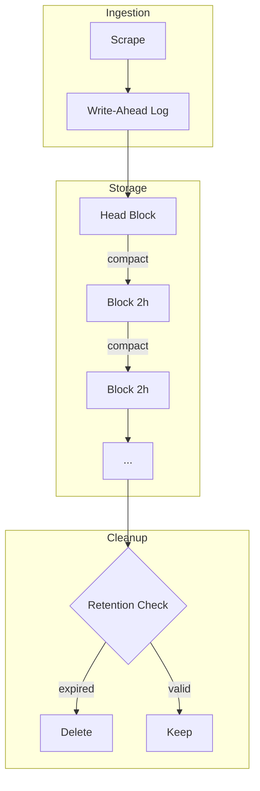
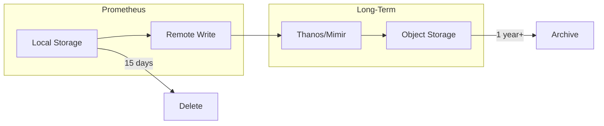

# How to Configure Retention Policies in Prometheus

Author: [nawazdhandala](https://www.github.com/nawazdhandala)

Tags: Prometheus, Retention, Storage, Data Management, Monitoring, Configuration

Description: Learn how to configure Prometheus retention policies to balance storage costs, query performance, and data availability, including time-based and size-based retention options.

---

Prometheus stores time series data locally on disk. Without proper retention configuration, storage can grow unbounded until disk fills up. This guide covers retention options and strategies for managing metric lifecycle.

## Understanding Prometheus Storage



Key concepts:
- **WAL (Write-Ahead Log)** - Buffers incoming samples before compaction
- **Head Block** - Most recent data, not yet persisted
- **Blocks** - Immutable chunks of time series data (typically 2 hours)
- **Retention** - Policy for deleting old blocks

## Retention Configuration Options

Prometheus supports two retention modes:

### Time-Based Retention

Delete data older than a specified duration:

```yaml
# Command line flag
--storage.tsdb.retention.time=15d
```

Or in prometheus.yml (deprecated, use flags):

```yaml
# This method is deprecated
global:
  # Use command line flags instead
```

### Size-Based Retention

Delete oldest data when storage exceeds a size limit:

```yaml
# Command line flag
--storage.tsdb.retention.size=100GB
```

### Combined Retention

When both are set, whichever limit is reached first triggers deletion:

```bash
prometheus \
  --storage.tsdb.retention.time=30d \
  --storage.tsdb.retention.size=50GB \
  --storage.tsdb.path=/prometheus
```

## Common Retention Configurations

### Development Environment

Short retention, minimal storage:

```bash
prometheus \
  --storage.tsdb.retention.time=2d \
  --storage.tsdb.retention.size=5GB \
  --storage.tsdb.path=/prometheus
```

### Production Environment

Balanced retention for operational needs:

```bash
prometheus \
  --storage.tsdb.retention.time=15d \
  --storage.tsdb.retention.size=100GB \
  --storage.tsdb.path=/prometheus \
  --storage.tsdb.wal-compression
```

### Long-Term Storage Focus

Extended retention with remote write backup:

```bash
prometheus \
  --storage.tsdb.retention.time=90d \
  --storage.tsdb.retention.size=500GB \
  --storage.tsdb.path=/prometheus \
  --storage.tsdb.wal-compression
```

## Kubernetes Configuration

### Using Prometheus Operator

```yaml
apiVersion: monitoring.coreos.com/v1
kind: Prometheus
metadata:
  name: prometheus
  namespace: monitoring
spec:
  replicas: 2

  # Time-based retention
  retention: 15d

  # Size-based retention
  retentionSize: 100GB

  # Storage configuration
  storage:
    volumeClaimTemplate:
      spec:
        storageClassName: fast-ssd
        accessModes: ["ReadWriteOnce"]
        resources:
          requests:
            storage: 150GB  # Larger than retentionSize for headroom

  # Enable WAL compression
  walCompression: true
```

### Using Helm Chart

```yaml
# prometheus-values.yaml
prometheus:
  prometheusSpec:
    retention: 15d
    retentionSize: 100GB
    walCompression: true

    storageSpec:
      volumeClaimTemplate:
        spec:
          storageClassName: fast-ssd
          resources:
            requests:
              storage: 150GB
```

Install with:

```bash
helm install prometheus prometheus-community/kube-prometheus-stack \
  -f prometheus-values.yaml \
  -n monitoring
```

## Storage Planning

### Estimating Storage Requirements

Calculate expected storage based on your metrics:

```
Storage = samples_per_second * bytes_per_sample * retention_seconds
```

Typical values:
- **Bytes per sample**: ~1-2 bytes (compressed)
- **Scrape interval**: 15-30 seconds
- **Targets**: Number of scraped endpoints

Example calculation:

```python
# 1000 targets, 500 metrics each, 15s scrape interval, 15 days retention
targets = 1000
metrics_per_target = 500
scrape_interval_seconds = 15
retention_days = 15
bytes_per_sample = 1.5  # With compression

samples_per_second = (targets * metrics_per_target) / scrape_interval_seconds
total_samples = samples_per_second * (retention_days * 24 * 3600)
storage_bytes = total_samples * bytes_per_sample

storage_gb = storage_bytes / (1024**3)
print(f"Estimated storage: {storage_gb:.1f} GB")
# Output: Estimated storage: ~65 GB
```

### Monitoring Storage Usage

Track Prometheus storage metrics:

```promql
# Total TSDB size
prometheus_tsdb_storage_blocks_bytes

# Number of time series
prometheus_tsdb_head_series

# Samples ingested per second
rate(prometheus_tsdb_head_samples_appended_total[5m])

# Chunk bytes in head block
prometheus_tsdb_head_chunks_storage_size_bytes

# WAL size
prometheus_tsdb_wal_storage_size_bytes

# Oldest data timestamp
prometheus_tsdb_lowest_timestamp_seconds
```

Create alerts for storage issues:

```yaml
groups:
  - name: prometheus-storage
    rules:
      - alert: PrometheusStorageFilling
        expr: |
          (
            prometheus_tsdb_storage_blocks_bytes
            /
            (prometheus_tsdb_retention_limit_bytes > 0 or 100e9)
          ) > 0.8
        for: 15m
        labels:
          severity: warning
        annotations:
          summary: "Prometheus storage over 80% capacity"

      - alert: PrometheusWALTooLarge
        expr: prometheus_tsdb_wal_storage_size_bytes > 5e9
        for: 15m
        labels:
          severity: warning
        annotations:
          summary: "Prometheus WAL exceeds 5GB"

      - alert: PrometheusTSDBCompactionsFailing
        expr: increase(prometheus_tsdb_compactions_failed_total[1h]) > 0
        for: 5m
        labels:
          severity: critical
        annotations:
          summary: "TSDB compactions are failing"
```

## Tiered Retention with Remote Write

For long-term storage, combine local retention with remote write:



### Configuration

```yaml
global:
  scrape_interval: 15s
  external_labels:
    cluster: production

# Short local retention
# (set via command line: --storage.tsdb.retention.time=24h)

remote_write:
  - url: "http://thanos-receive:19291/api/v1/receive"
    queue_config:
      capacity: 10000
      max_shards: 200
```

### Thanos Compactor Retention

Configure different retention per resolution:

```bash
thanos compact \
  --data-dir=/var/thanos/compact \
  --objstore.config-file=/etc/thanos/objstore.yml \
  --retention.resolution-raw=30d \
  --retention.resolution-5m=180d \
  --retention.resolution-1h=365d
```

## Downsampling

Thanos supports downsampling for efficient long-term storage:

| Resolution | Retention | Use Case |
|------------|-----------|----------|
| Raw (all samples) | 30 days | Recent debugging |
| 5-minute | 180 days | Week/month views |
| 1-hour | 1+ years | Historical trends |

## Administrative Operations

### Checking Current Retention

```bash
# Check TSDB status
curl http://localhost:9090/api/v1/status/tsdb | jq

# Check retention configuration
curl http://localhost:9090/api/v1/status/flags | jq '.data | with_entries(select(.key | contains("retention")))'
```

### Forcing Block Cleanup

Prometheus automatically cleans up old blocks, but you can trigger compaction:

```bash
# Trigger compaction via admin API (must enable --web.enable-admin-api)
curl -X POST http://localhost:9090/api/v1/admin/tsdb/compact
```

### Taking TSDB Snapshots

Before maintenance, snapshot the TSDB:

```bash
# Create snapshot (requires --web.enable-admin-api)
curl -X POST http://localhost:9090/api/v1/admin/tsdb/snapshot

# Snapshots are created in: <storage.tsdb.path>/snapshots/
```

### Deleting Specific Series

Remove unwanted series (requires `--web.enable-admin-api`):

```bash
# Delete series matching a selector
curl -X POST 'http://localhost:9090/api/v1/admin/tsdb/delete_series?match[]=up{job="deprecated-job"}'

# Clean up tombstones
curl -X POST http://localhost:9090/api/v1/admin/tsdb/clean_tombstones
```

## Performance Considerations

### WAL Compression

Enable WAL compression to reduce disk I/O:

```bash
--storage.tsdb.wal-compression
```

Tradeoffs:
- **Pros**: Reduces WAL size by ~50%, less disk usage
- **Cons**: Slightly higher CPU usage

### Block Duration

Default block duration is 2 hours. Changing is rarely needed:

```bash
# Not recommended to change unless you know what you're doing
--storage.tsdb.min-block-duration=2h
--storage.tsdb.max-block-duration=36h
```

### Memory Considerations

Prometheus memory usage correlates with:
- Number of active time series
- Query complexity
- Scrape frequency

Rule of thumb: ~2-3KB per active time series for baseline memory.

## Best Practices

1. **Set both time and size retention** - Protect against runaway storage
2. **Add 20-30% headroom** - Storage should exceed retention size limit
3. **Use fast storage** - SSDs significantly improve performance
4. **Enable WAL compression** - Reduces I/O with minimal CPU overhead
5. **Monitor storage metrics** - Alert before hitting limits
6. **Use remote write for long-term** - Local Prometheus for recent data only
7. **Plan for growth** - Review and adjust retention as metrics grow

### Retention Decision Matrix

| Requirement | Recommended Retention |
|-------------|----------------------|
| Debugging recent issues | 2-7 days |
| Operational monitoring | 15-30 days |
| Capacity planning | 90+ days |
| Compliance/audit | Use remote storage |

---

Retention policies balance storage costs against data availability. Start with time-based retention matching your operational needs, add size-based limits as a safety net, and use remote write for anything requiring longer storage. Monitor TSDB metrics to catch issues before they impact availability.
