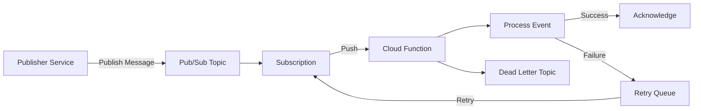
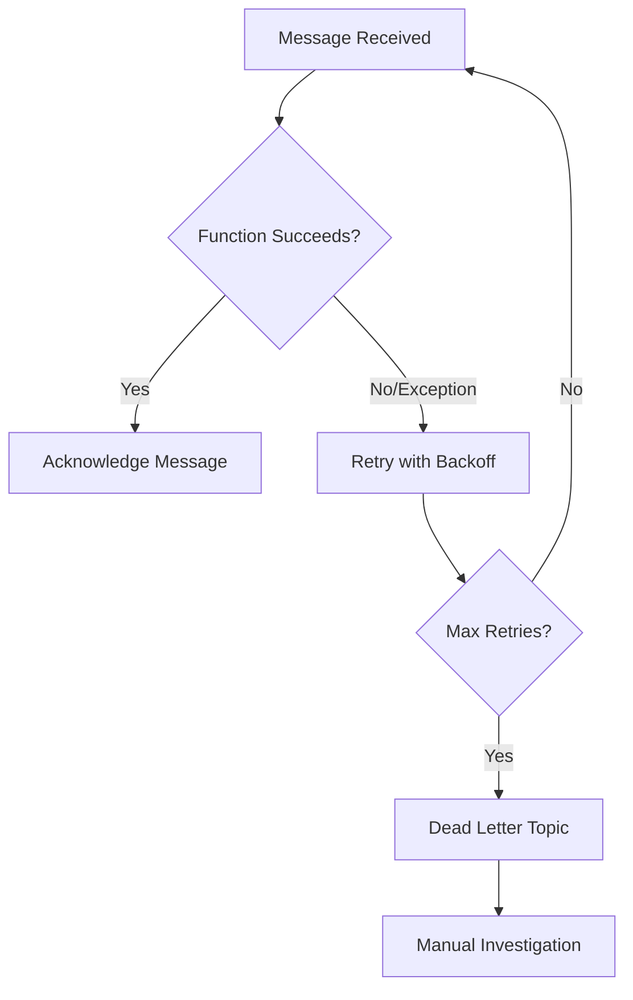
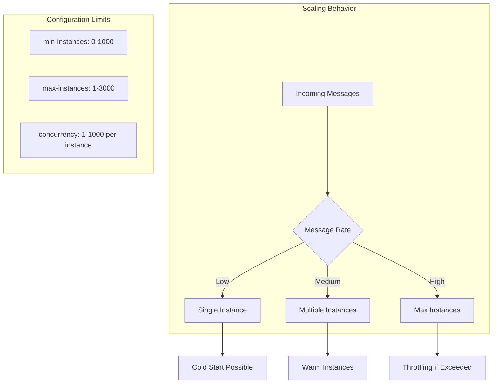
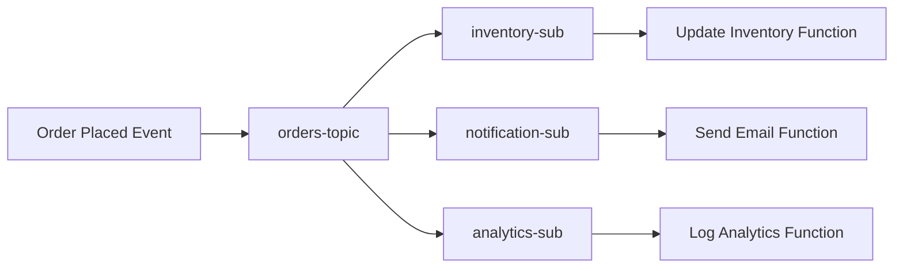
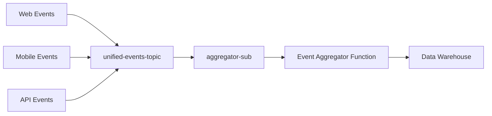

# How to Use Pub/Sub with Cloud Functions

Author: [nawazdhandala](https://www.github.com/nawazdhandala)

Tags: Google Cloud, Pub/Sub, Cloud Functions, Serverless, Event-Driven Architecture, Node.js, Python, DevOps

Description: A comprehensive guide to building event-driven serverless applications using Google Cloud Pub/Sub with Cloud Functions, covering triggers, event parsing, error handling, retries, scaling, and local testing strategies.

---

> **Key Insight:** Pub/Sub with Cloud Functions creates a powerful decoupled architecture where publishers and subscribers operate independently. The function scales automatically with message volume, and built-in retry mechanisms ensure reliable message processing even when downstream services fail.

## Why Pub/Sub with Cloud Functions?

Google Cloud Pub/Sub provides asynchronous messaging that decouples services. When combined with Cloud Functions, you get:

- **Automatic scaling:** Functions spin up instances as message volume increases
- **At-least-once delivery:** Messages are retried until acknowledged
- **Cost efficiency:** Pay only for execution time, not idle infrastructure
- **Loose coupling:** Publishers do not need to know about subscribers

This pattern excels for event-driven workflows like order processing, log ingestion, IoT data pipelines, and webhook handling.

## Architecture Overview



The flow is straightforward: publishers send messages to a topic, subscriptions deliver them to Cloud Functions, and the function processes each event. Failed messages retry automatically, and persistent failures route to a dead letter topic for manual inspection.

## Setting Up a Pub/Sub Triggered Function

### Node.js Implementation

```javascript
// index.js
// Cloud Function triggered by Pub/Sub messages
// Exports a function that receives CloudEvent format messages

const functions = require('@google-cloud/functions-framework');

// Register a CloudEvent function for Pub/Sub trigger
// The function name 'processPubSubMessage' matches the --entry-point flag during deployment
functions.cloudEvent('processPubSubMessage', async (cloudEvent) => {
  // Extract the Pub/Sub message from the CloudEvent data
  // The message is wrapped in a 'message' property
  const pubsubMessage = cloudEvent.data.message;

  // Decode the base64-encoded data payload
  // Pub/Sub always base64 encodes message data for safe transport
  const messageData = pubsubMessage.data
    ? Buffer.from(pubsubMessage.data, 'base64').toString('utf-8')
    : null;

  // Access message attributes (key-value metadata)
  // Useful for routing, filtering, or adding context without parsing the body
  const attributes = pubsubMessage.attributes || {};

  // Log for observability - these appear in Cloud Logging
  console.log('Message ID:', pubsubMessage.messageId);
  console.log('Publish Time:', pubsubMessage.publishTime);
  console.log('Attributes:', JSON.stringify(attributes));

  // Parse JSON payload if the message contains structured data
  let parsedData;
  try {
    parsedData = JSON.parse(messageData);
    console.log('Parsed message data:', parsedData);
  } catch (parseError) {
    // Handle non-JSON messages (plain text, binary, etc.)
    console.log('Raw message data:', messageData);
    parsedData = messageData;
  }

  // Process the message based on your business logic
  await processEvent(parsedData, attributes);

  // Implicit acknowledgment: if the function returns without throwing,
  // Pub/Sub marks the message as acknowledged
  console.log('Message processed successfully');
});

// Business logic handler - separate from the trigger for testability
async function processEvent(data, attributes) {
  // Example: Route based on event type attribute
  const eventType = attributes.eventType || 'unknown';

  switch (eventType) {
    case 'user.created':
      await handleUserCreated(data);
      break;
    case 'order.placed':
      await handleOrderPlaced(data);
      break;
    default:
      console.log(`Unhandled event type: ${eventType}`);
  }
}

async function handleUserCreated(data) {
  // Send welcome email, create profile, etc.
  console.log('Processing user creation:', data.userId);
}

async function handleOrderPlaced(data) {
  // Update inventory, notify warehouse, etc.
  console.log('Processing order:', data.orderId);
}
```

### Python Implementation

```python
# main.py
# Cloud Function triggered by Pub/Sub messages
# Uses the functions-framework library for CloudEvent handling

import base64
import json
import functions_framework
from cloudevents.http import CloudEvent

@functions_framework.cloud_event
def process_pubsub_message(cloud_event: CloudEvent) -> None:
    """
    Process incoming Pub/Sub messages.

    Args:
        cloud_event: CloudEvent containing the Pub/Sub message

    The function automatically acknowledges the message if it returns
    without raising an exception. Raising an exception triggers a retry.
    """
    # Extract message data from CloudEvent
    # The structure follows the Pub/Sub CloudEvent schema
    pubsub_message = cloud_event.data.get("message", {})

    # Decode base64-encoded message data
    # Pub/Sub encodes all message payloads as base64
    message_data = None
    if pubsub_message.get("data"):
        message_data = base64.b64decode(pubsub_message["data"]).decode("utf-8")

    # Access message metadata
    message_id = pubsub_message.get("messageId")
    publish_time = pubsub_message.get("publishTime")
    attributes = pubsub_message.get("attributes", {})

    # Log for debugging and monitoring
    print(f"Message ID: {message_id}")
    print(f"Publish Time: {publish_time}")
    print(f"Attributes: {attributes}")

    # Parse JSON payload if applicable
    try:
        parsed_data = json.loads(message_data) if message_data else {}
        print(f"Parsed data: {parsed_data}")
    except json.JSONDecodeError:
        # Handle non-JSON messages
        print(f"Raw data: {message_data}")
        parsed_data = message_data

    # Delegate to business logic handler
    process_event(parsed_data, attributes)

    print("Message processed successfully")


def process_event(data: dict, attributes: dict) -> None:
    """
    Route and process events based on type.

    Separating business logic from the trigger handler
    improves testability and maintainability.
    """
    event_type = attributes.get("eventType", "unknown")

    handlers = {
        "user.created": handle_user_created,
        "order.placed": handle_order_placed,
    }

    handler = handlers.get(event_type)
    if handler:
        handler(data)
    else:
        print(f"Unhandled event type: {event_type}")


def handle_user_created(data: dict) -> None:
    """Process user creation events."""
    user_id = data.get("userId")
    print(f"Processing user creation: {user_id}")
    # Add your logic: send welcome email, create profile, etc.


def handle_order_placed(data: dict) -> None:
    """Process order placement events."""
    order_id = data.get("orderId")
    print(f"Processing order: {order_id}")
    # Add your logic: update inventory, notify warehouse, etc.
```

## Deployment Commands

```bash
# Create the Pub/Sub topic
gcloud pubsub topics create my-events-topic

# Deploy Node.js function (2nd gen)
# --trigger-topic connects the function to the Pub/Sub topic
# --entry-point specifies which exported function to invoke
gcloud functions deploy processPubSubMessage \
  --gen2 \
  --runtime=nodejs20 \
  --region=us-central1 \
  --source=. \
  --entry-point=processPubSubMessage \
  --trigger-topic=my-events-topic \
  --memory=256MB \
  --timeout=60s

# Deploy Python function (2nd gen)
gcloud functions deploy process_pubsub_message \
  --gen2 \
  --runtime=python312 \
  --region=us-central1 \
  --source=. \
  --entry-point=process_pubsub_message \
  --trigger-topic=my-events-topic \
  --memory=256MB \
  --timeout=60s

# Publish a test message
gcloud pubsub topics publish my-events-topic \
  --message='{"userId": "12345", "email": "user@example.com"}' \
  --attribute=eventType=user.created
```

## Error Handling and Retries

Pub/Sub provides automatic retries for failed message processing. Understanding retry behavior is critical for building reliable systems.



### Implementing Robust Error Handling

```javascript
// error-handling.js
// Demonstrates idempotent processing and smart retry strategies

const functions = require('@google-cloud/functions-framework');
const { PubSub } = require('@google-cloud/pubsub');

// Initialize Pub/Sub client for dead letter handling
const pubsub = new PubSub();
const deadLetterTopic = pubsub.topic('my-events-dead-letter');

functions.cloudEvent('robustHandler', async (cloudEvent) => {
  const pubsubMessage = cloudEvent.data.message;
  const messageId = pubsubMessage.messageId;
  const attributes = pubsubMessage.attributes || {};

  // Track retry count via attributes
  // Pub/Sub automatically includes delivery attempt count in 2nd gen functions
  const deliveryAttempt = cloudEvent.data.deliveryAttempt || 1;

  console.log(`Processing message ${messageId}, attempt ${deliveryAttempt}`);

  try {
    // Decode and parse message
    const messageData = Buffer.from(pubsubMessage.data, 'base64').toString('utf-8');
    const data = JSON.parse(messageData);

    // Idempotency check: Use messageId to prevent duplicate processing
    // In production, check against a database or cache
    const alreadyProcessed = await checkIfProcessed(messageId);
    if (alreadyProcessed) {
      console.log(`Message ${messageId} already processed, skipping`);
      return; // Acknowledge without reprocessing
    }

    // Process the message
    await processWithTimeout(data, 50000); // 50s timeout (function has 60s)

    // Mark as processed for idempotency
    await markAsProcessed(messageId);

    console.log(`Message ${messageId} processed successfully`);

  } catch (error) {
    // Categorize errors to decide retry strategy
    if (isTransientError(error)) {
      // Transient errors (network issues, rate limits): allow retry
      console.error(`Transient error processing ${messageId}:`, error.message);
      throw error; // Throwing triggers Pub/Sub retry

    } else if (isPermanentError(error)) {
      // Permanent errors (invalid data, business rule violations): don't retry
      console.error(`Permanent error processing ${messageId}:`, error.message);

      // Send to dead letter topic for manual investigation
      await sendToDeadLetter(pubsubMessage, error);

      // Return without throwing to acknowledge and stop retries
      return;

    } else if (deliveryAttempt >= 5) {
      // Max retries exceeded: send to dead letter
      console.error(`Max retries exceeded for ${messageId}`);
      await sendToDeadLetter(pubsubMessage, error);
      return;

    } else {
      // Unknown error: allow retry
      console.error(`Unknown error processing ${messageId}:`, error.message);
      throw error;
    }
  }
});

// Helper: Execute with timeout to prevent function timeout without cleanup
async function processWithTimeout(data, timeoutMs) {
  return Promise.race([
    processBusinessLogic(data),
    new Promise((_, reject) =>
      setTimeout(() => reject(new Error('Processing timeout')), timeoutMs)
    )
  ]);
}

// Helper: Classify transient errors that should trigger retries
function isTransientError(error) {
  const transientPatterns = [
    'ECONNRESET',
    'ETIMEDOUT',
    'ENOTFOUND',
    'rate limit',
    '503',
    '429',
    'temporarily unavailable'
  ];

  const errorString = error.message.toLowerCase();
  return transientPatterns.some(pattern =>
    errorString.includes(pattern.toLowerCase())
  );
}

// Helper: Classify permanent errors that should not retry
function isPermanentError(error) {
  const permanentPatterns = [
    'invalid',
    'malformed',
    'unauthorized',
    '400',
    '401',
    '403',
    '404'
  ];

  const errorString = error.message.toLowerCase();
  return permanentPatterns.some(pattern =>
    errorString.includes(pattern.toLowerCase())
  );
}

// Helper: Send failed messages to dead letter topic
async function sendToDeadLetter(originalMessage, error) {
  const deadLetterPayload = {
    originalMessageId: originalMessage.messageId,
    originalData: originalMessage.data,
    originalAttributes: originalMessage.attributes,
    errorMessage: error.message,
    errorStack: error.stack,
    failedAt: new Date().toISOString()
  };

  await deadLetterTopic.publishMessage({
    data: Buffer.from(JSON.stringify(deadLetterPayload)),
    attributes: {
      originalTopic: 'my-events-topic',
      errorType: error.name || 'UnknownError'
    }
  });

  console.log(`Message sent to dead letter topic`);
}

// Stub functions - implement based on your storage choice
async function checkIfProcessed(messageId) {
  // Check Redis, Firestore, or database
  return false;
}

async function markAsProcessed(messageId) {
  // Store in Redis with TTL, Firestore, or database
}

async function processBusinessLogic(data) {
  // Your actual processing logic
}
```

## Scaling Behavior

Cloud Functions automatically scales based on incoming message volume. Understanding scaling dynamics helps you design for high throughput.



### Configuring Scaling Parameters

```bash
# Deploy with scaling configuration
# --min-instances keeps instances warm to avoid cold starts
# --max-instances caps scaling to control costs and downstream load
# --concurrency sets how many requests one instance handles simultaneously

gcloud functions deploy processPubSubMessage \
  --gen2 \
  --runtime=nodejs20 \
  --region=us-central1 \
  --source=. \
  --entry-point=processPubSubMessage \
  --trigger-topic=my-events-topic \
  --memory=512MB \
  --timeout=120s \
  --min-instances=1 \
  --max-instances=100 \
  --concurrency=10
```

### Understanding Concurrency

```javascript
// concurrency-aware.js
// When concurrency > 1, multiple messages execute in the same instance
// Use this pattern for I/O-bound workloads, not CPU-bound

const functions = require('@google-cloud/functions-framework');

// Shared state across concurrent requests in the same instance
// Use for connection pools, caches, or expensive initializations
let dbPool = null;
let initialized = false;

// Lazy initialization - runs once per instance, not per request
async function initializeOnce() {
  if (!initialized) {
    console.log('Initializing shared resources...');
    // Create database connection pool
    // dbPool = await createPool({ max: 10 });
    initialized = true;
  }
}

functions.cloudEvent('concurrentHandler', async (cloudEvent) => {
  // Initialize shared resources on first request
  await initializeOnce();

  const startTime = Date.now();
  const pubsubMessage = cloudEvent.data.message;
  const messageData = Buffer.from(pubsubMessage.data, 'base64').toString('utf-8');

  console.log(`Processing message ${pubsubMessage.messageId}`);

  // When concurrency > 1, multiple messages process simultaneously
  // Ensure your code is thread-safe and doesn't have race conditions
  const result = await processMessage(JSON.parse(messageData));

  const duration = Date.now() - startTime;
  console.log(`Message processed in ${duration}ms`);

  return result;
});

async function processMessage(data) {
  // Use shared dbPool for efficient connection reuse
  // Avoid creating new connections per request
  return { processed: true };
}
```

## Testing Locally

Testing Pub/Sub triggered functions locally requires simulating the CloudEvent format that Pub/Sub sends.

### Using the Functions Framework

```javascript
// test/local-test.js
// Test your function locally before deploying

const { spawn } = require('child_process');
const http = require('http');

// Start the functions framework server
async function startLocalServer() {
  const server = spawn('npx', [
    'functions-framework',
    '--target=processPubSubMessage',
    '--signature-type=cloudevent',
    '--port=8080'
  ], {
    stdio: 'inherit',
    shell: true
  });

  // Wait for server to start
  await new Promise(resolve => setTimeout(resolve, 3000));
  return server;
}

// Send a test CloudEvent to the local server
async function sendTestEvent(data, attributes = {}) {
  // Construct CloudEvent in the format Pub/Sub uses
  const cloudEvent = {
    specversion: '1.0',
    id: `test-${Date.now()}`,
    source: '//pubsub.googleapis.com/projects/test-project/topics/test-topic',
    type: 'google.cloud.pubsub.topic.v1.messagePublished',
    datacontenttype: 'application/json',
    time: new Date().toISOString(),
    data: {
      message: {
        messageId: `msg-${Date.now()}`,
        publishTime: new Date().toISOString(),
        data: Buffer.from(JSON.stringify(data)).toString('base64'),
        attributes: attributes
      }
    }
  };

  return new Promise((resolve, reject) => {
    const req = http.request({
      hostname: 'localhost',
      port: 8080,
      path: '/',
      method: 'POST',
      headers: {
        'Content-Type': 'application/cloudevents+json',
        'ce-id': cloudEvent.id,
        'ce-specversion': cloudEvent.specversion,
        'ce-source': cloudEvent.source,
        'ce-type': cloudEvent.type,
        'ce-time': cloudEvent.time
      }
    }, (res) => {
      let body = '';
      res.on('data', chunk => body += chunk);
      res.on('end', () => resolve({ status: res.statusCode, body }));
    });

    req.on('error', reject);
    req.write(JSON.stringify(cloudEvent));
    req.end();
  });
}

// Run tests
async function runTests() {
  const server = await startLocalServer();

  try {
    // Test user creation event
    console.log('Testing user.created event...');
    const result1 = await sendTestEvent(
      { userId: '12345', email: 'test@example.com' },
      { eventType: 'user.created' }
    );
    console.log('Response:', result1);

    // Test order placed event
    console.log('Testing order.placed event...');
    const result2 = await sendTestEvent(
      { orderId: 'ORD-789', amount: 99.99 },
      { eventType: 'order.placed' }
    );
    console.log('Response:', result2);

    // Test unknown event type
    console.log('Testing unknown event type...');
    const result3 = await sendTestEvent(
      { data: 'test' },
      { eventType: 'unknown.type' }
    );
    console.log('Response:', result3);

  } finally {
    server.kill();
  }
}

runTests().catch(console.error);
```

### Unit Testing with Jest

```javascript
// test/unit.test.js
// Unit tests for the message processing logic

const { processEvent, handleUserCreated, handleOrderPlaced } = require('../handlers');

describe('Event Processing', () => {
  beforeEach(() => {
    // Clear mocks and reset state
    jest.clearAllMocks();
  });

  describe('processEvent', () => {
    it('should route user.created events to handleUserCreated', async () => {
      const mockData = { userId: '123', email: 'test@example.com' };
      const mockAttributes = { eventType: 'user.created' };

      // Mock the handler
      const spy = jest.spyOn(require('../handlers'), 'handleUserCreated');

      await processEvent(mockData, mockAttributes);

      expect(spy).toHaveBeenCalledWith(mockData);
    });

    it('should route order.placed events to handleOrderPlaced', async () => {
      const mockData = { orderId: 'ORD-456', amount: 150.00 };
      const mockAttributes = { eventType: 'order.placed' };

      const spy = jest.spyOn(require('../handlers'), 'handleOrderPlaced');

      await processEvent(mockData, mockAttributes);

      expect(spy).toHaveBeenCalledWith(mockData);
    });

    it('should handle unknown event types gracefully', async () => {
      const consoleSpy = jest.spyOn(console, 'log');

      await processEvent({}, { eventType: 'unknown' });

      expect(consoleSpy).toHaveBeenCalledWith(
        expect.stringContaining('Unhandled event type')
      );
    });
  });

  describe('Error Handling', () => {
    it('should classify network errors as transient', () => {
      const { isTransientError } = require('../error-handling');

      expect(isTransientError(new Error('ECONNRESET'))).toBe(true);
      expect(isTransientError(new Error('rate limit exceeded'))).toBe(true);
      expect(isTransientError(new Error('invalid data'))).toBe(false);
    });

    it('should classify validation errors as permanent', () => {
      const { isPermanentError } = require('../error-handling');

      expect(isPermanentError(new Error('invalid JSON'))).toBe(true);
      expect(isPermanentError(new Error('401 unauthorized'))).toBe(true);
      expect(isPermanentError(new Error('connection timeout'))).toBe(false);
    });
  });
});
```

### Python Testing with pytest

```python
# test_main.py
# Unit tests for Python Pub/Sub function

import base64
import json
import pytest
from unittest.mock import Mock, patch
from cloudevents.http import CloudEvent

from main import process_pubsub_message, process_event


def create_mock_cloud_event(data: dict, attributes: dict = None) -> CloudEvent:
    """Helper to create mock CloudEvents for testing."""
    message_data = base64.b64encode(json.dumps(data).encode()).decode()

    return CloudEvent({
        "specversion": "1.0",
        "id": "test-event-123",
        "source": "//pubsub.googleapis.com/projects/test/topics/test-topic",
        "type": "google.cloud.pubsub.topic.v1.messagePublished",
        "time": "2024-01-15T12:00:00Z",
    }, {
        "message": {
            "messageId": "msg-123",
            "publishTime": "2024-01-15T12:00:00Z",
            "data": message_data,
            "attributes": attributes or {}
        }
    })


class TestProcessPubSubMessage:
    """Tests for the main Pub/Sub handler."""

    def test_processes_valid_user_created_event(self, capsys):
        """Should successfully process user.created events."""
        event = create_mock_cloud_event(
            {"userId": "12345", "email": "user@example.com"},
            {"eventType": "user.created"}
        )

        # Should not raise
        process_pubsub_message(event)

        captured = capsys.readouterr()
        assert "Processing user creation: 12345" in captured.out
        assert "Message processed successfully" in captured.out

    def test_processes_valid_order_placed_event(self, capsys):
        """Should successfully process order.placed events."""
        event = create_mock_cloud_event(
            {"orderId": "ORD-789", "amount": 99.99},
            {"eventType": "order.placed"}
        )

        process_pubsub_message(event)

        captured = capsys.readouterr()
        assert "Processing order: ORD-789" in captured.out

    def test_handles_unknown_event_type(self, capsys):
        """Should log warning for unknown event types."""
        event = create_mock_cloud_event(
            {"data": "test"},
            {"eventType": "unknown.type"}
        )

        process_pubsub_message(event)

        captured = capsys.readouterr()
        assert "Unhandled event type: unknown.type" in captured.out

    def test_handles_malformed_json(self, capsys):
        """Should handle non-JSON message data gracefully."""
        # Create event with non-JSON data
        event = CloudEvent({
            "specversion": "1.0",
            "id": "test-event-123",
            "source": "//pubsub.googleapis.com/projects/test/topics/test-topic",
            "type": "google.cloud.pubsub.topic.v1.messagePublished",
        }, {
            "message": {
                "messageId": "msg-123",
                "publishTime": "2024-01-15T12:00:00Z",
                "data": base64.b64encode(b"not json").decode(),
                "attributes": {}
            }
        })

        process_pubsub_message(event)

        captured = capsys.readouterr()
        assert "Raw data: not json" in captured.out


class TestProcessEvent:
    """Tests for the event routing logic."""

    def test_routes_to_correct_handler(self):
        """Should call the appropriate handler based on event type."""
        with patch('main.handle_user_created') as mock_handler:
            process_event({"userId": "123"}, {"eventType": "user.created"})
            mock_handler.assert_called_once_with({"userId": "123"})

    def test_handles_missing_event_type(self, capsys):
        """Should handle missing eventType attribute."""
        process_event({}, {})

        captured = capsys.readouterr()
        assert "Unhandled event type: unknown" in captured.out
```

## Message Flow Patterns

### Fan-Out Pattern

Use multiple subscriptions to process the same message differently.



### Fan-In Pattern

Aggregate messages from multiple sources.



## Best Practices Summary

1. **Design for idempotency:** Messages may be delivered more than once. Use message IDs to deduplicate and ensure processing the same message twice has no side effects.

2. **Set appropriate timeouts:** Function timeout should exceed expected processing time plus buffer. Pub/Sub acknowledgment deadline should exceed function timeout.

3. **Implement dead letter topics:** Route persistently failing messages to a dead letter topic for manual investigation rather than infinite retries.

4. **Classify errors appropriately:** Transient errors (network, rate limits) should retry. Permanent errors (invalid data, authorization) should not.

5. **Use message attributes for routing:** Include event type, version, and source in attributes to enable filtering and routing without parsing the payload.

6. **Configure scaling limits:** Set max-instances to protect downstream services and control costs. Use min-instances to reduce cold starts for latency-sensitive workloads.

7. **Monitor and alert:** Track message age, delivery latency, error rates, and dead letter queue depth. Set up alerts for anomalies.

8. **Test locally first:** Use the functions framework to test with realistic CloudEvent payloads before deploying.

9. **Keep functions focused:** Each function should do one thing well. Use fan-out patterns for multi-step workflows.

10. **Version your message schemas:** Include a version attribute and handle schema evolution gracefully to enable rolling deployments.

## Monitor Your Pub/Sub Functions with OneUptime

Building reliable event-driven systems requires comprehensive observability. [OneUptime](https://oneuptime.com) provides:

- **Real-time function monitoring:** Track invocation counts, error rates, and latency distributions
- **Log aggregation:** Centralize logs from all your Cloud Functions with full-text search
- **Custom dashboards:** Visualize Pub/Sub metrics alongside application metrics
- **Intelligent alerting:** Get notified when error rates spike or dead letter queues grow
- **Incident management:** Coordinate response when event processing fails

Start monitoring your serverless workloads today with OneUptime's open-source observability platform.
