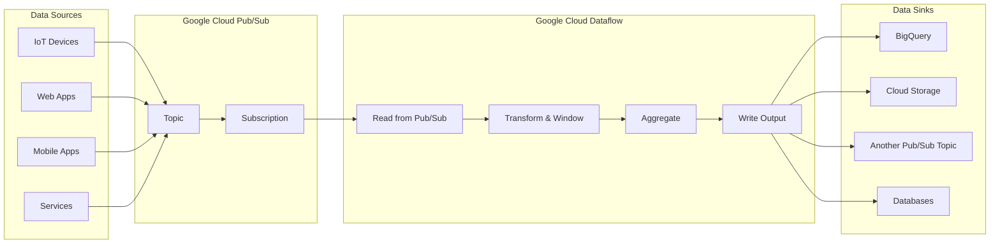
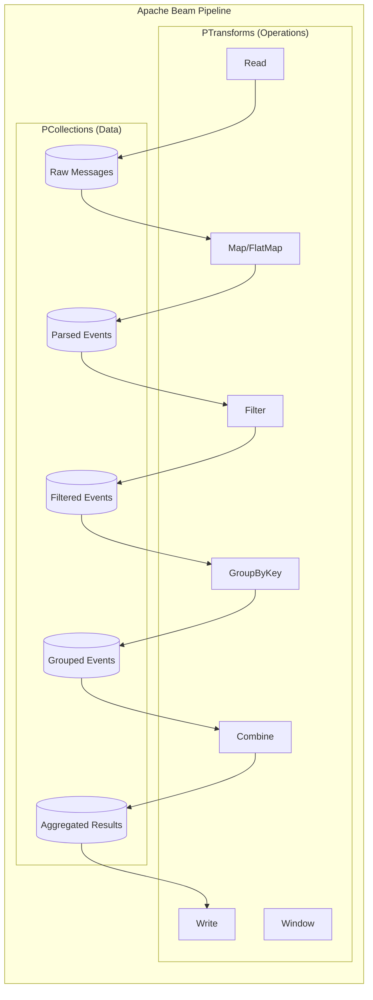
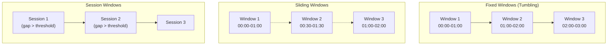
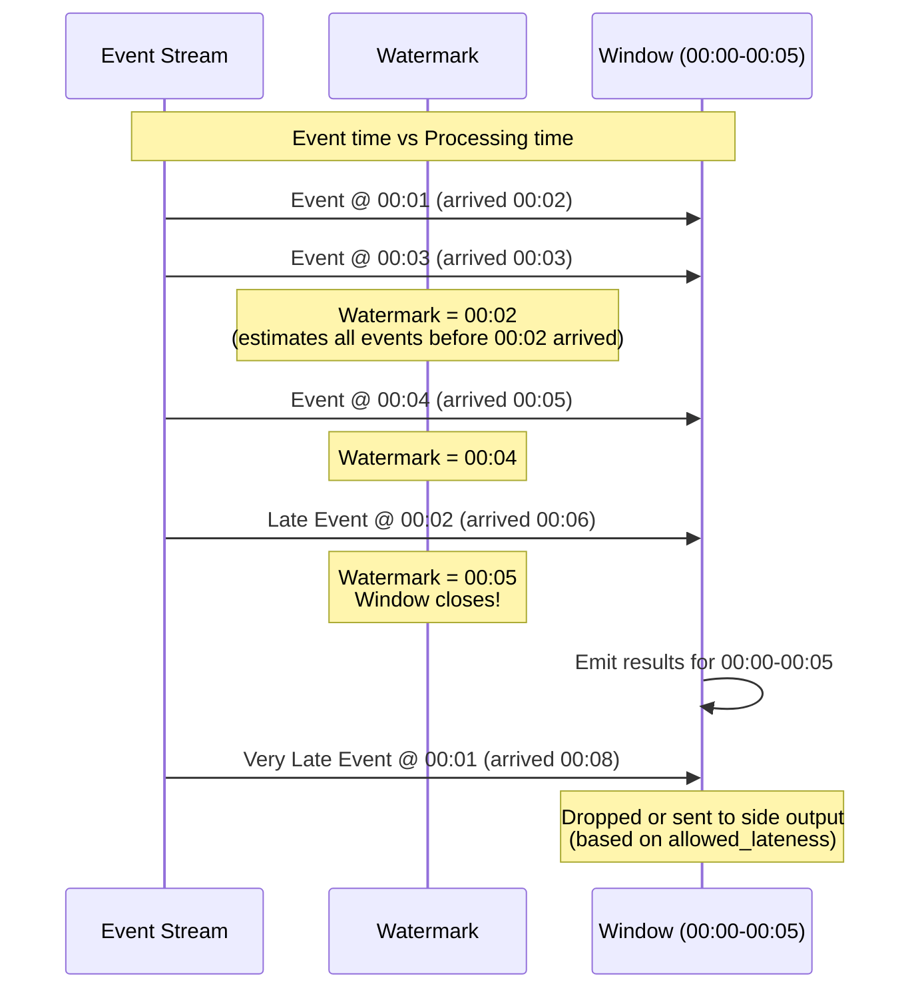
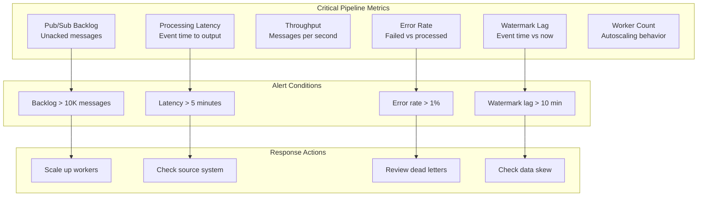

# How to Use Pub/Sub with Dataflow

Author: [nawazdhandala](https://www.github.com/nawazdhandala)

Tags: Google Cloud, Pub/Sub, Dataflow, Apache Beam, Streaming, Windowing, Watermarks, Real-Time Processing

Description: A comprehensive guide to building real-time streaming pipelines with Google Cloud Pub/Sub and Dataflow, covering Apache Beam integration, windowing strategies, triggers, watermarks, and production best practices.

---

> "The best time to process data was when it happened. The second best time is in a streaming pipeline." - Anonymous Data Engineer

## Introduction

Google Cloud Pub/Sub and Dataflow form a powerful combination for building real-time data processing pipelines. Pub/Sub provides reliable, scalable message delivery while Dataflow (powered by Apache Beam) handles the complex processing, windowing, and aggregation logic.

This guide walks through building production-ready streaming pipelines that can handle millions of events per second with exactly-once processing guarantees.



## Setting Up Pub/Sub

Before building the pipeline, set up your Pub/Sub topic and subscription.

### Create a Topic and Subscription

```bash
# Set your project ID for all subsequent commands
export PROJECT_ID="your-project-id"

# Create a topic for incoming events
# Topics are the central point where publishers send messages
gcloud pubsub topics create events-topic --project=$PROJECT_ID

# Create a subscription for Dataflow to consume from
# Use "pull" subscription - Dataflow manages the pulling automatically
# ack-deadline of 600 seconds gives Dataflow enough time to process messages
gcloud pubsub subscriptions create events-subscription \
    --topic=events-topic \
    --ack-deadline=600 \
    --project=$PROJECT_ID

# Verify the setup by listing topics and subscriptions
gcloud pubsub topics list --project=$PROJECT_ID
gcloud pubsub subscriptions list --project=$PROJECT_ID
```

### Message Schema (Optional but Recommended)

```bash
# Create a schema for structured messages
# Avro schemas enforce data types and required fields
gcloud pubsub schemas create events-schema \
    --type=avro \
    --definition='{
        "type": "record",
        "name": "Event",
        "fields": [
            {"name": "event_id", "type": "string"},
            {"name": "timestamp", "type": "long"},
            {"name": "user_id", "type": "string"},
            {"name": "event_type", "type": "string"},
            {"name": "payload", "type": "string"}
        ]
    }' \
    --project=$PROJECT_ID

# Attach schema to topic to validate all incoming messages
gcloud pubsub topics update events-topic \
    --schema=events-schema \
    --message-encoding=json \
    --project=$PROJECT_ID
```

## Apache Beam Integration

Dataflow runs Apache Beam pipelines. Understanding the core concepts is essential for building effective streaming applications.

### Pipeline Structure

```python
# pipeline_basics.py
# A minimal Apache Beam pipeline structure demonstrating core concepts

import apache_beam as beam
from apache_beam.options.pipeline_options import PipelineOptions

# Define pipeline options that configure how and where the pipeline runs
# These can also be passed via command line arguments
options = PipelineOptions([
    '--project=your-project-id',           # GCP project for billing and resources
    '--region=us-central1',                 # Dataflow region for job execution
    '--runner=DataflowRunner',              # Use 'DirectRunner' for local testing
    '--temp_location=gs://your-bucket/temp',      # Temporary files location
    '--staging_location=gs://your-bucket/staging', # Staged pipeline files
    '--streaming',                          # Enable streaming mode for Pub/Sub
])

# Create the pipeline using a context manager
# This ensures proper cleanup and job submission
with beam.Pipeline(options=options) as pipeline:
    # Pipelines follow the Read -> Transform -> Write pattern
    # Each step is a PTransform that creates a PCollection (parallel collection)
    (
        pipeline
        # Read from Pub/Sub subscription - this is an unbounded source
        | 'Read' >> beam.io.ReadFromPubSub(
            subscription='projects/your-project-id/subscriptions/events-subscription'
        )
        # Transform: decode bytes to UTF-8 strings
        | 'Process' >> beam.Map(lambda x: x.decode('utf-8'))
        # Write results to text files (for demonstration)
        | 'Write' >> beam.io.WriteToText('output')
    )
```

### Core Concepts Diagram



## Streaming Pipelines

Here is a complete streaming pipeline that reads from Pub/Sub, processes events, and writes to BigQuery.

### Project Dependencies

```python
# requirements.txt
# Install these packages before running the pipeline
apache-beam[gcp]==2.52.0    # Apache Beam with GCP connectors
google-cloud-pubsub==2.19.0  # Pub/Sub client library
google-cloud-bigquery==3.14.0 # BigQuery client library
```

### Complete Pipeline Implementation

```python
# streaming_pipeline.py
# A production-ready streaming pipeline with Pub/Sub and Dataflow

import json
import logging
import apache_beam as beam
from apache_beam.options.pipeline_options import PipelineOptions, StandardOptions
from apache_beam.transforms.window import FixedWindows, SlidingWindows, Sessions
from apache_beam.transforms.trigger import AfterWatermark, AfterProcessingTime, AccumulationMode
from datetime import datetime

# Configure logging for debugging and monitoring
# In Dataflow, logs appear in Cloud Logging
logging.basicConfig(level=logging.INFO)
logger = logging.getLogger(__name__)


class ParseEventFn(beam.DoFn):
    """Parse JSON messages from Pub/Sub into structured events.

    DoFn (Do Function) is the fundamental unit of processing in Beam.
    Each element in the PCollection passes through the process() method.
    """

    def process(self, element, timestamp=beam.DoFn.TimestampParam):
        """Process a single Pub/Sub message.

        Args:
            element: Raw bytes from Pub/Sub message
            timestamp: Event timestamp from Pub/Sub message attributes

        Yields:
            Parsed event dictionary with added processing metadata
        """
        try:
            # Decode bytes to string, then parse JSON
            # Pub/Sub messages are always bytes
            message = element.decode('utf-8')
            event = json.loads(message)

            # Add processing metadata for debugging and auditing
            event['processing_time'] = datetime.utcnow().isoformat()
            event['pubsub_timestamp'] = timestamp.to_utc_datetime().isoformat()

            # Yield the parsed event
            # Using yield allows emitting multiple elements per input if needed
            yield event

        except json.JSONDecodeError as e:
            # Log errors but don't fail the pipeline
            # Consider sending to dead letter queue (shown later)
            logger.error(f"Failed to parse message: {element[:100]}... Error: {e}")

        except Exception as e:
            logger.error(f"Unexpected error processing message: {e}")


class EnrichEventFn(beam.DoFn):
    """Enrich events with additional data from side inputs.

    Demonstrates using side inputs for lookup data that changes less frequently.
    """

    def __init__(self, project_id):
        self.project_id = project_id

    def setup(self):
        """Called once per worker before processing begins.

        Use for expensive initialization like database connections,
        loading ML models, or initializing API clients.
        """
        # Initialize any clients or connections here
        # These are shared across all elements processed by this worker
        pass

    def process(self, event, user_metadata):
        """Enrich event with user metadata from side input.

        Args:
            event: The main input event to enrich
            user_metadata: Side input dictionary containing user lookup data
        """
        user_id = event.get('user_id')

        # Look up user metadata from side input
        # Side inputs are broadcast to all workers efficiently
        if user_id in user_metadata:
            event['user_segment'] = user_metadata[user_id].get('segment', 'unknown')
            event['user_country'] = user_metadata[user_id].get('country', 'unknown')
        else:
            event['user_segment'] = 'unknown'
            event['user_country'] = 'unknown'

        yield event


def run_pipeline():
    """Main entry point for the streaming pipeline."""

    # Configure pipeline options for production deployment
    options = PipelineOptions([
        '--project=your-project-id',
        '--region=us-central1',
        '--runner=DataflowRunner',
        '--temp_location=gs://your-bucket/dataflow/temp',
        '--staging_location=gs://your-bucket/dataflow/staging',
        '--job_name=pubsub-to-bigquery-streaming',
        # Streaming-specific options
        '--streaming',
        '--enable_streaming_engine',  # Use Streaming Engine for better performance and cost
        # Autoscaling options
        '--autoscaling_algorithm=THROUGHPUT_BASED',  # Scale based on backlog
        '--max_num_workers=10',                       # Maximum workers for cost control
        '--num_workers=2',                            # Initial worker count
        # Performance tuning
        '--experiments=use_runner_v2',                # Use newer Dataflow runner
        '--sdk_container_image=gcr.io/your-project/beam-python:latest',
    ])

    # Enable streaming mode explicitly
    options.view_as(StandardOptions).streaming = True

    # Build and run the pipeline
    with beam.Pipeline(options=options) as p:

        # Step 1: Read from Pub/Sub subscription
        # The subscription ensures exactly-once delivery semantics with Dataflow
        raw_messages = (
            p
            | 'ReadFromPubSub' >> beam.io.ReadFromPubSub(
                subscription='projects/your-project-id/subscriptions/events-subscription',
                with_attributes=True,              # Include message attributes
                timestamp_attribute='event_timestamp'  # Use custom timestamp if available
            )
        )

        # Step 2: Parse and validate messages
        parsed_events = (
            raw_messages
            | 'ExtractPayload' >> beam.Map(lambda msg: msg.data)  # Get message body
            | 'ParseJSON' >> beam.ParDo(ParseEventFn())           # Parse JSON
        )

        # Step 3: Filter valid events
        valid_events = (
            parsed_events
            | 'FilterValid' >> beam.Filter(
                lambda event: event.get('event_type') is not None
            )
        )

        # Step 4: Apply windowing for aggregation (detailed in next section)
        windowed_events = (
            valid_events
            | 'ApplyWindow' >> beam.WindowInto(
                FixedWindows(60),  # 60-second fixed windows
                trigger=AfterWatermark(
                    early=AfterProcessingTime(30),  # Emit early results every 30s
                    late=AfterProcessingTime(60)    # Handle late data for 60s more
                ),
                accumulation_mode=AccumulationMode.ACCUMULATING,
                allowed_lateness=beam.transforms.window.Duration(seconds=300)
            )
        )

        # Step 5: Aggregate by event type within each window
        aggregated = (
            windowed_events
            | 'KeyByEventType' >> beam.Map(lambda e: (e['event_type'], e))
            | 'GroupByType' >> beam.GroupByKey()
            | 'CountEvents' >> beam.Map(
                lambda kv: {
                    'event_type': kv[0],
                    'count': len(list(kv[1])),
                    'window_end': datetime.utcnow().isoformat()
                }
            )
        )

        # Step 6: Write aggregated results to BigQuery
        aggregated | 'WriteToBigQuery' >> beam.io.WriteToBigQuery(
            table='your-project-id:dataset.events_aggregated',
            schema={
                'fields': [
                    {'name': 'event_type', 'type': 'STRING'},
                    {'name': 'count', 'type': 'INTEGER'},
                    {'name': 'window_end', 'type': 'TIMESTAMP'}
                ]
            },
            write_disposition=beam.io.BigQueryDisposition.WRITE_APPEND,
            create_disposition=beam.io.BigQueryDisposition.CREATE_IF_NEEDED,
            # Use streaming inserts for real-time data
            method=beam.io.WriteToBigQuery.Method.STREAMING_INSERTS
        )


if __name__ == '__main__':
    run_pipeline()
```

## Windowing and Triggers

Windowing is crucial for aggregating unbounded streaming data into finite chunks for processing.

### Types of Windows



### Window Implementation Examples

```python
# windowing_examples.py
# Different windowing strategies for various use cases

import apache_beam as beam
from apache_beam.transforms.window import (
    FixedWindows,
    SlidingWindows,
    Sessions,
    GlobalWindows
)
from apache_beam.transforms.trigger import (
    AfterWatermark,
    AfterProcessingTime,
    AfterCount,
    Repeatedly,
    AfterFirst,
    AfterAll,
    AccumulationMode
)


def fixed_window_example(events):
    """Fixed (Tumbling) Windows - Non-overlapping, fixed duration.

    Use case: Hourly/daily aggregations, batch-like processing on streams.
    Each event belongs to exactly one window.
    """
    return (
        events
        | 'FixedWindow' >> beam.WindowInto(
            # 5-minute windows that don't overlap
            FixedWindows(5 * 60),  # Duration in seconds

            # Trigger: When to emit results from this window
            trigger=AfterWatermark(
                # Early speculative results: emit every 30 seconds before watermark
                early=AfterProcessingTime(30),
                # Late data handling: emit when late data arrives, up to 2 minutes
                late=AfterProcessingTime(120)
            ),

            # Accumulation mode determines how multiple firings combine
            # ACCUMULATING: Include all data seen so far (for running totals)
            # DISCARDING: Only include data since last firing (for deltas)
            accumulation_mode=AccumulationMode.ACCUMULATING,

            # How long to keep state for late data after watermark passes
            allowed_lateness=beam.transforms.window.Duration(seconds=600)
        )
    )


def sliding_window_example(events):
    """Sliding Windows - Overlapping windows for smoothed aggregations.

    Use case: Moving averages, trend detection, anomaly detection.
    Each event can appear in multiple windows.
    """
    return (
        events
        | 'SlidingWindow' >> beam.WindowInto(
            # 10-minute windows, sliding every 1 minute
            # This creates 10 overlapping windows for each event
            SlidingWindows(
                size=10 * 60,    # Window size: 10 minutes
                period=1 * 60   # Slide period: 1 minute
            ),
            trigger=AfterWatermark(),
            accumulation_mode=AccumulationMode.DISCARDING
        )
    )


def session_window_example(events):
    """Session Windows - Dynamic windows based on activity gaps.

    Use case: User sessions, clickstream analysis, IoT device activity.
    Window closes after gap_size of inactivity.
    """
    return (
        events
        # First, key by user to create per-user sessions
        | 'KeyByUser' >> beam.Map(lambda e: (e['user_id'], e))
        | 'SessionWindow' >> beam.WindowInto(
            # Session ends after 30 minutes of inactivity
            Sessions(gap_size=30 * 60),
            trigger=AfterWatermark(
                # Emit partial sessions every 5 minutes while active
                early=AfterProcessingTime(5 * 60)
            ),
            accumulation_mode=AccumulationMode.ACCUMULATING
        )
    )


def global_window_with_triggers(events):
    """Global Window with custom triggers - Single window for all time.

    Use case: When you need custom firing logic, like count-based batching.
    Useful for micro-batching patterns.
    """
    return (
        events
        | 'GlobalWindow' >> beam.WindowInto(
            GlobalWindows(),
            # Fire every 1000 elements OR every 60 seconds, repeatedly
            trigger=Repeatedly(
                AfterFirst(
                    AfterCount(1000),
                    AfterProcessingTime(60)
                )
            ),
            accumulation_mode=AccumulationMode.DISCARDING
        )
    )


def composite_trigger_example(events):
    """AfterAll - Fire when ALL conditions are met (AND logic).

    Use case: Ensuring minimum batch size with time bound.
    "Fire when we have at least 100 events AND 30 seconds have passed"
    """
    return (
        events
        | 'CompositeWindow' >> beam.WindowInto(
            FixedWindows(300),  # 5-minute windows
            trigger=AfterAll(
                AfterCount(100),          # At least 100 events
                AfterProcessingTime(30)   # And at least 30 seconds
            ),
            accumulation_mode=AccumulationMode.DISCARDING
        )
    )
```

## Watermarks

Watermarks are the mechanism for handling event-time processing in streaming systems. They represent the system's notion of completeness.

### Watermark Concepts



### Handling Late Data

```python
# late_data_handling.py
# Strategies for handling late-arriving data in streaming pipelines

import apache_beam as beam
from apache_beam.transforms.window import FixedWindows
from apache_beam.transforms.trigger import AfterWatermark, AfterProcessingTime, AccumulationMode


class ProcessWithTimestamp(beam.DoFn):
    """Extract and assign event timestamp for proper windowing.

    In streaming systems, we need to distinguish between:
    - Event time: when the event actually occurred
    - Processing time: when we process the event
    """

    def process(self, element, timestamp=beam.DoFn.TimestampParam):
        """Process element and output with its event timestamp."""
        import json
        from apache_beam.transforms.window import TimestampedValue
        from datetime import datetime

        event = json.loads(element.decode('utf-8'))

        # Parse event timestamp from the data itself
        # This is the "event time" - when the event actually occurred
        event_time = datetime.fromisoformat(event['timestamp'])

        # Yield with explicit timestamp for proper windowing
        # This ensures the event goes into the correct window
        yield TimestampedValue(event, event_time.timestamp())


def late_data_pipeline(p):
    """Pipeline demonstrating late data handling strategies."""

    # Read from Pub/Sub subscription
    raw = p | 'Read' >> beam.io.ReadFromPubSub(
        subscription='projects/proj/subscriptions/sub'
    )

    # Parse messages and assign event timestamps
    timestamped = raw | 'AssignTimestamps' >> beam.ParDo(ProcessWithTimestamp())

    # Apply windowing with comprehensive late data handling
    windowed = (
        timestamped
        | 'Window' >> beam.WindowInto(
            FixedWindows(60),  # 1-minute windows

            trigger=AfterWatermark(
                # Early firings: Emit speculative results every 10 seconds
                # Useful for real-time dashboards that need quick updates
                early=AfterProcessingTime(10),

                # Late firings: Re-emit when late data arrives
                # Handles data that arrives after the watermark passed
                late=AfterProcessingTime(30)
            ),

            # ACCUMULATING: Each firing includes ALL data seen so far
            # Good for: Running totals, final counts
            # DISCARDING: Each firing only includes NEW data since last firing
            # Good for: Incremental updates, avoiding duplicates in downstream
            accumulation_mode=AccumulationMode.ACCUMULATING,

            # How long to keep window state for late data
            # After this duration, late data is dropped
            allowed_lateness=beam.transforms.window.Duration(seconds=3600)
        )
    )

    # Process windowed data
    on_time_results = (
        windowed
        | 'CountPerWindow' >> beam.combiners.Count.Globally()
        | 'WriteResults' >> beam.io.WriteToBigQuery(
            table='project:dataset.event_counts',
            schema='count:INTEGER,window_start:TIMESTAMP,window_end:TIMESTAMP'
        )
    )

    return on_time_results


def dead_letter_pattern(p):
    """Dead letter queue pattern for handling problematic messages.

    Messages that fail parsing or validation go to a separate topic
    for investigation and potential reprocessing.
    """

    class ParseWithDeadLetter(beam.DoFn):
        """Parse messages, routing failures to dead letter output."""

        # Define output tags for branching the pipeline
        MAIN_OUTPUT = 'main'
        DEAD_LETTER = 'dead_letter'

        def process(self, element):
            import json
            from apache_beam import pvalue

            try:
                event = json.loads(element.decode('utf-8'))

                # Validate required fields exist
                if not event.get('event_id'):
                    raise ValueError("Missing event_id")
                if not event.get('timestamp'):
                    raise ValueError("Missing timestamp")

                # Success: yield to main output (default)
                yield event

            except Exception as e:
                # Failure: yield to dead letter output with error context
                yield pvalue.TaggedOutput(
                    self.DEAD_LETTER,
                    {
                        'original_message': element.decode('utf-8', errors='replace'),
                        'error': str(e),
                        'error_type': type(e).__name__
                    }
                )

    # Read messages from input subscription
    raw = p | 'Read' >> beam.io.ReadFromPubSub(
        subscription='projects/proj/subscriptions/sub'
    )

    # Parse with branching outputs for success and failure
    parsed = raw | 'ParseWithDLQ' >> beam.ParDo(
        ParseWithDeadLetter()
    ).with_outputs(
        ParseWithDeadLetter.DEAD_LETTER,
        main=ParseWithDeadLetter.MAIN_OUTPUT
    )

    # Process valid messages through normal pipeline
    parsed.main | 'ProcessValid' >> beam.Map(lambda x: x)

    # Send failures to dead letter topic for investigation
    (
        parsed.dead_letter
        | 'FormatDLQ' >> beam.Map(lambda x: json.dumps(x).encode('utf-8'))
        | 'WriteDLQ' >> beam.io.WriteToPubSub(
            topic='projects/proj/topics/dead-letter-topic'
        )
    )
```

## Triggers Deep Dive

Triggers control when windowed results are emitted. Understanding triggers is essential for balancing latency and completeness.

### Trigger Types and Combinations

```python
# triggers_examples.py
# Comprehensive trigger examples for different streaming use cases

import apache_beam as beam
from apache_beam.transforms.window import FixedWindows, GlobalWindows
from apache_beam.transforms.trigger import (
    AfterWatermark,
    AfterProcessingTime,
    AfterCount,
    Repeatedly,
    AfterEach,
    AfterFirst,
    AfterAll,
    AccumulationMode
)


def event_time_trigger(events):
    """AfterWatermark - Fire when the watermark passes window end.

    Most common trigger for event-time processing.
    Guarantees all on-time data is included before firing.
    """
    return events | beam.WindowInto(
        FixedWindows(60),
        trigger=AfterWatermark(),  # Fire once when watermark passes
        accumulation_mode=AccumulationMode.DISCARDING
    )


def processing_time_trigger(events):
    """AfterProcessingTime - Fire after wall-clock time delay.

    Good for: Real-time dashboards where you need frequent updates
    regardless of event time completeness.
    """
    return events | beam.WindowInto(
        FixedWindows(60),
        # Fire every 10 seconds of wall-clock time, repeatedly
        trigger=Repeatedly(AfterProcessingTime(10)),
        accumulation_mode=AccumulationMode.ACCUMULATING
    )


def count_trigger(events):
    """AfterCount - Fire after N elements arrive in the window.

    Good for: Batch-size based processing, micro-batching to downstream
    systems with rate limits.
    """
    return events | beam.WindowInto(
        GlobalWindows(),  # Often used with count triggers
        # Fire after every 100 elements arrive
        trigger=Repeatedly(AfterCount(100)),
        accumulation_mode=AccumulationMode.DISCARDING
    )


def composite_trigger_or(events):
    """AfterFirst - Fire when ANY condition is met (OR logic).

    Good for: Bounded latency with batch efficiency.
    "Fire when we have 1000 events OR 60 seconds pass, whichever first"
    """
    return events | beam.WindowInto(
        GlobalWindows(),
        trigger=Repeatedly(
            AfterFirst(
                AfterCount(1000),      # Fire at 1000 elements
                AfterProcessingTime(60) # Or after 60 seconds
            )
        ),
        accumulation_mode=AccumulationMode.DISCARDING
    )


def composite_trigger_and(events):
    """AfterAll - Fire when ALL conditions are met (AND logic).

    Good for: Ensuring minimum batch size with time bound.
    "Fire when we have at least 100 events AND 30 seconds have passed"
    """
    return events | beam.WindowInto(
        FixedWindows(300),  # 5-minute windows
        trigger=AfterAll(
            AfterCount(100),           # Must have 100 elements
            AfterProcessingTime(30)    # AND 30 seconds must pass
        ),
        accumulation_mode=AccumulationMode.DISCARDING
    )


def early_late_on_time_trigger(events):
    """Complete trigger pattern with early, on-time, and late firings.

    Best practice for production streaming pipelines that need both
    low latency and eventual completeness.
    """
    return events | beam.WindowInto(
        FixedWindows(60),
        trigger=AfterWatermark(
            # Early speculative results (before watermark passes)
            # Useful for low-latency approximate results
            early=AfterProcessingTime(10),

            # Late data handling (after watermark passes)
            # Useful for correcting results when late data arrives
            late=AfterCount(1)  # Fire for each late element
        ),
        # ACCUMULATING means each firing has all data seen so far
        # Downstream systems must handle updates/replacements
        accumulation_mode=AccumulationMode.ACCUMULATING,

        # Keep state for late data up to 1 hour after watermark
        allowed_lateness=beam.transforms.window.Duration(seconds=3600)
    )


def sequence_trigger(events):
    """AfterEach - Fire triggers in sequence (one after another).

    Good for: Different behavior in different phases of a window's lifecycle.
    """
    return events | beam.WindowInto(
        FixedWindows(300),  # 5-minute windows
        trigger=AfterEach(
            # Phase 1: Fire quickly after 10 elements for fast initial result
            AfterCount(10),
            # Phase 2: Fire when watermark passes for complete result
            AfterWatermark()
        ),
        accumulation_mode=AccumulationMode.ACCUMULATING
    )
```

## Production Best Practices

### Pipeline Monitoring and Alerting

```python
# monitoring.py
# Adding observability to your Dataflow pipelines

import apache_beam as beam
from apache_beam.metrics import Metrics
import logging

logger = logging.getLogger(__name__)


class MonitoredParseEventFn(beam.DoFn):
    """DoFn with custom metrics for monitoring pipeline health.

    Custom metrics appear in:
    - Dataflow monitoring UI
    - Cloud Monitoring (formerly Stackdriver)
    - Can be used for alerting
    """

    def __init__(self):
        # Define custom metrics
        # Counters track cumulative totals
        self.events_processed = Metrics.counter(self.__class__, 'events_processed')
        self.events_failed = Metrics.counter(self.__class__, 'events_failed')

        # Distributions track statistical distributions
        self.parse_latency = Metrics.distribution(self.__class__, 'parse_latency_ms')
        self.message_size = Metrics.distribution(self.__class__, 'message_size_bytes')

    def process(self, element, timestamp=beam.DoFn.TimestampParam):
        import json
        import time

        start_time = time.time()

        # Track message size for capacity planning
        self.message_size.update(len(element))

        try:
            event = json.loads(element.decode('utf-8'))

            # Track successful processing
            self.events_processed.inc()

            # Track parse latency for performance monitoring
            latency_ms = (time.time() - start_time) * 1000
            self.parse_latency.update(int(latency_ms))

            yield event

        except Exception as e:
            # Track failures for alerting
            self.events_failed.inc()
            logger.error(f"Parse failed: {e}")


class HealthCheckFn(beam.DoFn):
    """Emit health check metrics for pipeline monitoring.

    Track watermark lag to detect when pipeline falls behind.
    """

    def __init__(self):
        self.watermark_lag = Metrics.distribution(self.__class__, 'watermark_lag_seconds')

    def process(self, element, timestamp=beam.DoFn.TimestampParam,
                window=beam.DoFn.WindowParam):
        import time
        from datetime import datetime

        # Calculate lag between event time and current wall clock time
        event_time = timestamp.to_utc_datetime()
        processing_time = datetime.utcnow()
        lag_seconds = (processing_time - event_time).total_seconds()

        # Track the lag distribution
        self.watermark_lag.update(int(lag_seconds))

        # Alert if lag is too high
        # These logs integrate with Cloud Logging for alerting
        if lag_seconds > 300:  # 5 minutes
            logger.warning(f"High watermark lag detected: {lag_seconds}s")

        yield element
```

### Autoscaling Configuration

```python
# autoscaling_options.py
# Production-ready pipeline options with autoscaling

from apache_beam.options.pipeline_options import PipelineOptions

def get_production_options():
    """Production-ready pipeline options with autoscaling configuration."""

    return PipelineOptions([
        # Project configuration
        '--project=your-project-id',
        '--region=us-central1',
        '--runner=DataflowRunner',
        '--streaming',

        # Storage locations for pipeline artifacts
        '--temp_location=gs://your-bucket/dataflow/temp',
        '--staging_location=gs://your-bucket/dataflow/staging',

        # Job identification
        '--job_name=events-pipeline-prod',

        # Streaming Engine (recommended for most streaming jobs)
        # Offloads shuffle to Google-managed infrastructure
        '--enable_streaming_engine',

        # Autoscaling configuration
        '--autoscaling_algorithm=THROUGHPUT_BASED',  # Scale based on backlog
        '--min_num_workers=2',    # Minimum workers during low traffic
        '--max_num_workers=50',   # Maximum workers during traffic spikes

        # Worker configuration
        '--worker_machine_type=n2-standard-4',  # 4 vCPUs, 16GB RAM
        '--disk_size_gb=50',                    # Boot disk size
        '--number_of_worker_harness_threads=4', # Threads per worker

        # Network configuration for security
        '--network=your-vpc',
        '--subnetwork=regions/us-central1/subnetworks/your-subnet',
        '--use_public_ips=false',  # Private IPs for security

        # Performance optimizations
        '--experiments=use_runner_v2',           # Newer, faster runner
        '--experiments=enable_streaming_engine', # Ensure streaming engine

        # Custom container for faster startup and dependency management
        '--sdk_container_image=gcr.io/your-project/beam-python:latest',

        # Enable in-place updates without job restart
        '--update',
    ])
```

### Error Handling and Retries

```python
# error_handling.py
# Robust error handling patterns for production pipelines

import apache_beam as beam
from apache_beam import pvalue
import json
import logging
import traceback
import random

logger = logging.getLogger(__name__)


class ResilientProcessFn(beam.DoFn):
    """DoFn with retry logic and dead letter handling.

    Implements the retry pattern with exponential backoff and
    dead letter queue for permanent failures.
    """

    MAIN_OUTPUT = 'main'
    DEAD_LETTER = 'dead_letter'
    RETRY_OUTPUT = 'retry'

    def __init__(self, max_retries=3):
        self.max_retries = max_retries

    def process(self, element):
        """Process with automatic retry on transient failures."""

        # Track retry count from previous attempts
        retry_count = element.get('_retry_count', 0) if isinstance(element, dict) else 0

        try:
            # Attempt to process the element
            result = self._process_element(element)

            # Success - yield to main output
            yield pvalue.TaggedOutput(self.MAIN_OUTPUT, result)

        except RecoverableError as e:
            # Transient error - eligible for retry
            if retry_count < self.max_retries:
                # Prepare for retry with incremented count
                if isinstance(element, dict):
                    element['_retry_count'] = retry_count + 1
                    element['_last_error'] = str(e)
                yield pvalue.TaggedOutput(self.RETRY_OUTPUT, element)
            else:
                # Max retries exceeded - send to dead letter
                yield pvalue.TaggedOutput(self.DEAD_LETTER, {
                    'event': element,
                    'error': str(e),
                    'retries': retry_count
                })

        except PermanentError as e:
            # Non-recoverable error - dead letter immediately
            yield pvalue.TaggedOutput(self.DEAD_LETTER, {
                'event': element,
                'error': str(e),
                'error_type': 'permanent'
            })

    def _process_element(self, element):
        """Override with your actual processing logic."""
        # Your processing implementation here
        return element


class RecoverableError(Exception):
    """Errors that might succeed on retry (network, throttling, timeouts)."""
    pass


class PermanentError(Exception):
    """Errors that will never succeed (validation, schema, bad data)."""
    pass


def build_resilient_pipeline(p):
    """Pipeline with comprehensive error handling and retries."""

    # Read from Pub/Sub
    raw = p | 'Read' >> beam.io.ReadFromPubSub(
        subscription='projects/proj/subscriptions/sub'
    )

    # Parse with multi-output error handling
    parsed = raw | 'Parse' >> beam.ParDo(
        ResilientProcessFn()
    ).with_outputs(
        ResilientProcessFn.DEAD_LETTER,
        ResilientProcessFn.RETRY_OUTPUT,
        main=ResilientProcessFn.MAIN_OUTPUT
    )

    # Process successful events through normal pipeline
    (
        parsed.main
        | 'WriteSuccess' >> beam.io.WriteToBigQuery(table='project:dataset.events')
    )

    # Handle dead letters - send to separate topic for investigation
    (
        parsed.dead_letter
        | 'FormatDeadLetter' >> beam.Map(lambda x: json.dumps(x).encode())
        | 'WriteDeadLetter' >> beam.io.WriteToPubSub(
            topic='projects/proj/topics/dead-letter'
        )
    )

    # Handle retries - send back to input with delay
    # In practice, use a separate retry topic with exponential backoff
    (
        parsed.retry
        | 'FormatRetry' >> beam.Map(lambda x: json.dumps(x).encode())
        | 'WriteRetry' >> beam.io.WriteToPubSub(
            topic='projects/proj/topics/events-retry'
        )
    )
```

## Deploying and Managing Pipelines

### Deployment Commands

```bash
#!/bin/bash
# deploy_pipeline.sh
# Script to deploy and manage Dataflow streaming pipelines

set -e  # Exit on any error

PROJECT_ID="your-project-id"
REGION="us-central1"
BUCKET="your-dataflow-bucket"
JOB_NAME="events-pipeline-prod"

# Build custom container for faster startup and consistent dependencies
build_container() {
    echo "Building custom container..."
    docker build -t gcr.io/$PROJECT_ID/beam-python:latest .
    docker push gcr.io/$PROJECT_ID/beam-python:latest
}

# Deploy a new streaming pipeline
deploy() {
    echo "Deploying pipeline..."
    python streaming_pipeline.py \
        --project=$PROJECT_ID \
        --region=$REGION \
        --runner=DataflowRunner \
        --streaming \
        --job_name=$JOB_NAME \
        --temp_location=gs://$BUCKET/temp \
        --staging_location=gs://$BUCKET/staging \
        --enable_streaming_engine \
        --max_num_workers=20
}

# Update a running pipeline in-place (no data loss)
update() {
    echo "Updating pipeline..."
    python streaming_pipeline.py \
        --project=$PROJECT_ID \
        --region=$REGION \
        --runner=DataflowRunner \
        --streaming \
        --job_name=$JOB_NAME \
        --temp_location=gs://$BUCKET/temp \
        --staging_location=gs://$BUCKET/staging \
        --update \
        --transform_name_mapping='{"OldTransform":"NewTransform"}'
}

# Drain pipeline gracefully (finish processing, then stop)
drain() {
    echo "Draining pipeline..."
    JOB_ID=$(gcloud dataflow jobs list \
        --project=$PROJECT_ID \
        --region=$REGION \
        --filter="name=$JOB_NAME AND state=Running" \
        --format="value(id)" | head -1)

    if [ -n "$JOB_ID" ]; then
        gcloud dataflow jobs drain $JOB_ID \
            --project=$PROJECT_ID \
            --region=$REGION
        echo "Draining job: $JOB_ID"
    else
        echo "No running job found"
    fi
}

# Cancel pipeline immediately (may lose in-flight data)
cancel() {
    echo "Cancelling pipeline..."
    JOB_ID=$(gcloud dataflow jobs list \
        --project=$PROJECT_ID \
        --region=$REGION \
        --filter="name=$JOB_NAME AND state=Running" \
        --format="value(id)" | head -1)

    if [ -n "$JOB_ID" ]; then
        gcloud dataflow jobs cancel $JOB_ID \
            --project=$PROJECT_ID \
            --region=$REGION
        echo "Cancelled job: $JOB_ID"
    else
        echo "No running job found"
    fi
}

# Check pipeline status
status() {
    echo "Pipeline status..."
    gcloud dataflow jobs list \
        --project=$PROJECT_ID \
        --region=$REGION \
        --filter="name:$JOB_NAME" \
        --limit=5
}

# Parse command line argument
case "$1" in
    build)  build_container ;;
    deploy) deploy ;;
    update) update ;;
    drain)  drain ;;
    cancel) cancel ;;
    status) status ;;
    *)
        echo "Usage: $0 {build|deploy|update|drain|cancel|status}"
        exit 1
        ;;
esac
```

### Local Testing

```python
# test_pipeline.py
# Unit tests for pipeline transforms using DirectRunner

import unittest
import apache_beam as beam
from apache_beam.testing.test_pipeline import TestPipeline
from apache_beam.testing.util import assert_that, equal_to
import json


class TestParseEventFn(unittest.TestCase):
    """Test the ParseEventFn DoFn with various inputs."""

    def test_valid_json_parsing(self):
        """Test that valid JSON messages are parsed correctly."""

        with TestPipeline() as p:
            # Create test input matching production message format
            test_input = [
                json.dumps({
                    'event_id': '123',
                    'timestamp': '2024-01-15T10:00:00Z',
                    'user_id': 'user_1',
                    'event_type': 'click'
                }).encode('utf-8')
            ]

            # Run through the transform being tested
            result = (
                p
                | beam.Create(test_input)
                | beam.ParDo(ParseEventFn())
            )

            # Verify output matches expectations
            def check_result(events):
                assert len(events) == 1
                assert events[0]['event_id'] == '123'
                assert events[0]['event_type'] == 'click'

            assert_that(result, check_result)

    def test_invalid_json_handling(self):
        """Test that invalid JSON doesn't crash the pipeline."""

        with TestPipeline() as p:
            # Invalid JSON input that should be handled gracefully
            test_input = [b'not valid json']

            result = (
                p
                | beam.Create(test_input)
                | beam.ParDo(ParseEventFn())
            )

            # Should produce no output (error is logged, not raised)
            assert_that(result, equal_to([]))


class TestWindowingBehavior(unittest.TestCase):
    """Test windowing and aggregation logic using TestStream."""

    def test_fixed_window_aggregation(self):
        """Test that events are correctly grouped into fixed windows."""

        from apache_beam.transforms.window import FixedWindows, TimestampedValue
        from apache_beam.testing.test_stream import TestStream

        with TestPipeline() as p:
            # Create a test stream with precisely timestamped events
            test_stream = (
                TestStream()
                # Add events at specific event times
                .add_elements([
                    TimestampedValue({'type': 'click'}, 0),   # t=0
                    TimestampedValue({'type': 'click'}, 30),  # t=30
                    TimestampedValue({'type': 'click'}, 59),  # t=59
                ])
                # Advance watermark past first window
                .advance_watermark_to(60)
                # Add event in second window
                .add_elements([
                    TimestampedValue({'type': 'click'}, 90),  # t=90
                ])
                # Complete the stream
                .advance_watermark_to_infinity()
            )

            result = (
                p
                | test_stream
                | beam.WindowInto(FixedWindows(60))  # 60-second windows
                | beam.combiners.Count.Globally()
            )

            # First window [0,60) should have 3 events
            # Second window [60,120) should have 1 event
            assert_that(result, equal_to([3, 1]))


if __name__ == '__main__':
    unittest.main()
```

## Monitoring with OneUptime

Once your Pub/Sub and Dataflow pipeline is running, monitoring becomes critical for maintaining reliability. [OneUptime](https://oneuptime.com) provides comprehensive observability for your streaming infrastructure.

### Key Metrics to Monitor



Set up alerts in OneUptime for:

- **Pub/Sub subscription backlog** growing beyond acceptable threshold
- **Dataflow job failures** or unexpected restarts
- **Processing latency** exceeding your SLO targets
- **Dead letter queue** accumulating messages
- **Worker count** at maximum indicating capacity issues

With OneUptime's unified observability platform, you can correlate Dataflow metrics with your application metrics, set up intelligent alerting, and visualize your entire streaming pipeline health in one dashboard.

## Conclusion

Building production-ready streaming pipelines with Pub/Sub and Dataflow requires understanding several key concepts:

1. **Streaming Pipelines** - Design for unbounded data with proper checkpointing and exactly-once semantics
2. **Windowing** - Choose the right window type (fixed, sliding, session) for your aggregation needs
3. **Triggers** - Control when results are emitted with early, on-time, and late firings
4. **Watermarks** - Handle event-time processing and late data correctly
5. **Error Handling** - Implement dead letter queues and retry logic for resilience

The combination of Pub/Sub's reliable message delivery and Dataflow's powerful processing capabilities enables you to build scalable, fault-tolerant real-time data pipelines that can handle millions of events per second.

Start with simple fixed windows and basic triggers, then add complexity as your requirements evolve. Always test with realistic data volumes and failure scenarios before deploying to production.
