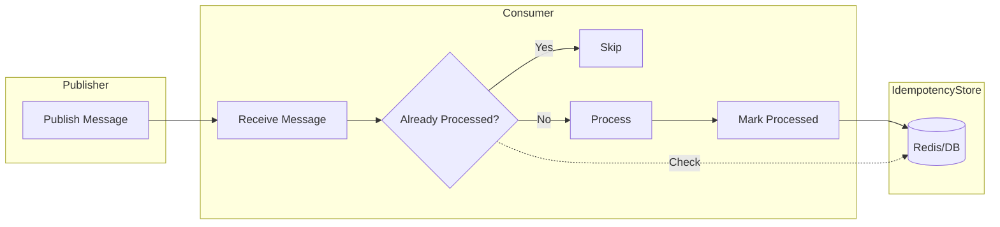
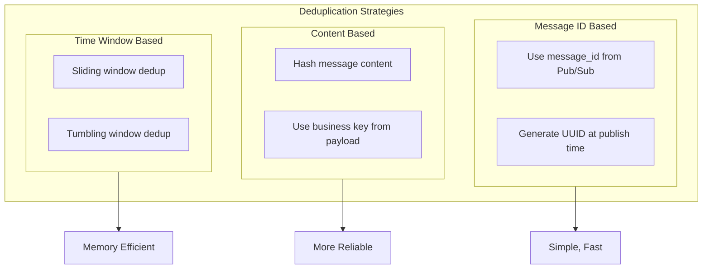

# How to Implement Exactly-Once Processing with Pub/Sub

By [Nawaz Dhandala](https://github.com/nawazdhandala)

Tags: Pub/Sub, Exactly-Once Processing, Message Queues, Idempotency, Deduplication, Google Cloud, Distributed Systems

Description: Learn how to implement exactly-once processing in Pub/Sub systems using idempotency patterns, deduplication strategies, and proper configuration to ensure reliable message delivery without duplicates.

---

> "In distributed systems, exactly-once is often considered impossible. But with the right patterns, we can make it practical." - Werner Vogels

Exactly-once processing is one of the hardest problems in distributed systems. Messages can be lost, duplicated, or processed out of order. While true exactly-once delivery is theoretically impossible in the presence of network partitions, we can achieve exactly-once semantics through careful design. This guide shows you how.

## Understanding Delivery Semantics

Before diving into implementation, let's clarify what we're dealing with.


### The Three Delivery Guarantees

- **At-most-once**: Messages may be lost but never duplicated. Fire and forget.
- **At-least-once**: Messages are never lost but may be duplicated. Retry until acknowledged.
- **Exactly-once**: Messages are delivered exactly one time. The holy grail.

Most Pub/Sub systems provide at-least-once delivery by default. Achieving exactly-once requires additional patterns on top of this foundation.

## Google Cloud Pub/Sub Exactly-Once Delivery

Google Cloud Pub/Sub offers a native exactly-once delivery feature that handles deduplication at the subscription level.

### Enabling Exactly-Once Delivery

```python
# enable_exactly_once.py
# Enable exactly-once delivery on a Pub/Sub subscription

from google.cloud import pubsub_v1

def create_subscription_with_exactly_once(
    project_id: str,
    topic_id: str,
    subscription_id: str
) -> None:
    """
    Creates a subscription with exactly-once delivery enabled.

    Exactly-once delivery ensures that Pub/Sub will not redeliver
    a message that has been successfully acknowledged.
    """
    subscriber = pubsub_v1.SubscriberClient()

    topic_path = subscriber.topic_path(project_id, topic_id)
    subscription_path = subscriber.subscription_path(project_id, subscription_id)

    # Create subscription with exactly-once delivery
    subscription = subscriber.create_subscription(
        request={
            "name": subscription_path,
            "topic": topic_path,
            # Enable exactly-once delivery
            "enable_exactly_once_delivery": True,
            # Ack deadline should be sufficient for processing
            "ack_deadline_seconds": 60,
            # Enable message ordering if needed
            "enable_message_ordering": True,
        }
    )

    print(f"Created subscription: {subscription.name}")
    print(f"Exactly-once delivery: {subscription.enable_exactly_once_delivery}")
```

### Handling Acknowledgments with Exactly-Once

```python
# exactly_once_subscriber.py
# Subscriber that properly handles exactly-once acknowledgments

from google.cloud import pubsub_v1
from google.cloud.pubsub_v1.subscriber import exceptions as subscriber_exceptions
from concurrent.futures import TimeoutError
import logging

logging.basicConfig(level=logging.INFO)
logger = logging.getLogger(__name__)

def subscribe_with_exactly_once(
    project_id: str,
    subscription_id: str,
    timeout: float = None
) -> None:
    """
    Subscribe to messages with exactly-once delivery handling.

    With exactly-once enabled, acknowledgment failures must be
    handled carefully to avoid reprocessing.
    """
    subscriber = pubsub_v1.SubscriberClient()
    subscription_path = subscriber.subscription_path(project_id, subscription_id)

    def callback(message: pubsub_v1.subscriber.message.Message) -> None:
        """
        Process message and handle acknowledgment.

        With exactly-once delivery, failed acks mean the message
        will be redelivered. We must handle this gracefully.
        """
        logger.info(f"Received message: {message.message_id}")
        logger.info(f"Data: {message.data.decode('utf-8')}")
        logger.info(f"Attributes: {message.attributes}")

        try:
            # Process the message
            process_message(message)

            # Acknowledge the message
            # With exactly-once, this may fail if another worker acked first
            message.ack()
            logger.info(f"Successfully acknowledged: {message.message_id}")

        except subscriber_exceptions.AcknowledgeError as e:
            # Handle acknowledgment failures
            # This happens when exactly-once detects a duplicate ack attempt
            logger.warning(
                f"Ack failed for {message.message_id}: {e}. "
                "Message may have been processed by another worker."
            )

        except Exception as e:
            # Processing failed - nack to retry later
            logger.error(f"Processing failed: {e}")
            message.nack()

    def process_message(message):
        """Your message processing logic here."""
        # Simulate processing
        data = message.data.decode('utf-8')
        logger.info(f"Processing: {data}")

    # Subscribe with flow control to manage load
    flow_control = pubsub_v1.types.FlowControl(
        max_messages=100,  # Max outstanding messages
        max_bytes=10 * 1024 * 1024,  # 10 MB
    )

    streaming_pull_future = subscriber.subscribe(
        subscription_path,
        callback=callback,
        flow_control=flow_control,
    )

    logger.info(f"Listening for messages on {subscription_path}")

    try:
        streaming_pull_future.result(timeout=timeout)
    except TimeoutError:
        streaming_pull_future.cancel()
        streaming_pull_future.result()
```

## Idempotency Patterns

Even with exactly-once delivery, your consumers should be idempotent. Network issues can cause duplicate processing despite best efforts.



### Idempotency Key Pattern

```python
# idempotency_handler.py
# Implement idempotent message processing with Redis

import redis
import hashlib
import json
from typing import Callable, Any, Optional
from dataclasses import dataclass
from datetime import timedelta
import logging

logger = logging.getLogger(__name__)

@dataclass
class IdempotencyConfig:
    """Configuration for idempotency handling."""
    # How long to remember processed messages
    ttl: timedelta = timedelta(hours=24)
    # Redis key prefix
    key_prefix: str = "idempotency"
    # Whether to store the result
    store_result: bool = True


class IdempotencyHandler:
    """
    Ensures messages are processed exactly once using Redis.

    Uses a combination of message ID and content hash to detect
    duplicates, with configurable TTL for cleanup.
    """

    def __init__(
        self,
        redis_client: redis.Redis,
        config: Optional[IdempotencyConfig] = None
    ):
        self.redis = redis_client
        self.config = config or IdempotencyConfig()

    def generate_idempotency_key(
        self,
        message_id: str,
        message_data: bytes
    ) -> str:
        """
        Generate a unique idempotency key from message ID and content.

        Using both ensures we catch duplicates even if message IDs
        are reused or if the same content is sent with different IDs.
        """
        content_hash = hashlib.sha256(message_data).hexdigest()[:16]
        return f"{self.config.key_prefix}:{message_id}:{content_hash}"

    def is_duplicate(self, idempotency_key: str) -> bool:
        """Check if this message was already processed."""
        return self.redis.exists(idempotency_key) > 0

    def mark_processed(
        self,
        idempotency_key: str,
        result: Any = None
    ) -> None:
        """Mark a message as processed with optional result storage."""
        value = json.dumps({
            "processed": True,
            "result": result if self.config.store_result else None
        })

        self.redis.setex(
            idempotency_key,
            self.config.ttl,
            value
        )

    def get_previous_result(self, idempotency_key: str) -> Optional[Any]:
        """Retrieve the result of a previously processed message."""
        data = self.redis.get(idempotency_key)
        if data:
            parsed = json.loads(data)
            return parsed.get("result")
        return None

    def process_idempotently(
        self,
        message_id: str,
        message_data: bytes,
        processor: Callable[[], Any]
    ) -> tuple[bool, Any]:
        """
        Process a message idempotently.

        Returns:
            Tuple of (was_processed, result)
            - was_processed: True if we processed it, False if duplicate
            - result: The processing result (new or cached)
        """
        idempotency_key = self.generate_idempotency_key(message_id, message_data)

        # Check for duplicate
        if self.is_duplicate(idempotency_key):
            logger.info(f"Duplicate detected: {idempotency_key}")
            cached_result = self.get_previous_result(idempotency_key)
            return (False, cached_result)

        # Use Redis transaction to prevent race conditions
        # SETNX ensures only one worker processes the message
        acquired = self.redis.setnx(
            f"{idempotency_key}:lock",
            "processing"
        )

        if not acquired:
            # Another worker is processing this message
            logger.info(f"Message being processed by another worker: {idempotency_key}")
            return (False, None)

        try:
            # Set lock expiry to prevent deadlocks
            self.redis.expire(f"{idempotency_key}:lock", 300)  # 5 minute timeout

            # Process the message
            result = processor()

            # Mark as processed
            self.mark_processed(idempotency_key, result)

            return (True, result)

        finally:
            # Release the lock
            self.redis.delete(f"{idempotency_key}:lock")


# Example usage with Pub/Sub
def create_idempotent_callback(handler: IdempotencyHandler):
    """Create an idempotent message callback."""

    def callback(message):
        def process():
            # Your actual processing logic
            data = json.loads(message.data.decode('utf-8'))
            # Process the data...
            return {"status": "processed", "data": data}

        was_processed, result = handler.process_idempotently(
            message.message_id,
            message.data,
            process
        )

        if was_processed:
            logger.info(f"Processed new message: {message.message_id}")
        else:
            logger.info(f"Skipped duplicate: {message.message_id}")

        # Always ack - we've handled the duplicate case
        message.ack()

    return callback
```

### Database-Level Idempotency

```python
# db_idempotency.py
# Implement idempotency using database constraints

from sqlalchemy import create_engine, Column, String, DateTime, JSON, UniqueConstraint
from sqlalchemy.ext.declarative import declarative_base
from sqlalchemy.orm import sessionmaker
from sqlalchemy.exc import IntegrityError
from datetime import datetime
from typing import Callable, Any, Optional
import logging

logger = logging.getLogger(__name__)
Base = declarative_base()


class ProcessedMessage(Base):
    """
    Track processed messages in the database.

    Using a database table with unique constraints ensures
    exactly-once semantics even across service restarts.
    """
    __tablename__ = 'processed_messages'

    # Unique message identifier
    message_id = Column(String(255), primary_key=True)
    # Content hash for additional deduplication
    content_hash = Column(String(64), nullable=False)
    # When the message was processed
    processed_at = Column(DateTime, default=datetime.utcnow)
    # Store the result for idempotent responses
    result = Column(JSON, nullable=True)
    # The topic/queue the message came from
    source = Column(String(255), nullable=True)

    __table_args__ = (
        # Ensure uniqueness on message_id + content_hash
        UniqueConstraint('message_id', 'content_hash', name='uq_message_content'),
    )


class DatabaseIdempotencyHandler:
    """
    Database-backed idempotency handler.

    Advantages over Redis:
    - Durable across restarts
    - Can join with business data in transactions
    - Easier audit trail

    Disadvantages:
    - Slower than Redis
    - More database load
    """

    def __init__(self, database_url: str):
        self.engine = create_engine(database_url)
        Base.metadata.create_all(self.engine)
        self.Session = sessionmaker(bind=self.engine)

    def process_with_transaction(
        self,
        message_id: str,
        content_hash: str,
        processor: Callable[[Any], Any],
        session: Any
    ) -> tuple[bool, Any]:
        """
        Process message within an existing database transaction.

        This allows you to commit the idempotency record and
        business data atomically.
        """
        # Check if already processed
        existing = session.query(ProcessedMessage).filter_by(
            message_id=message_id,
            content_hash=content_hash
        ).first()

        if existing:
            logger.info(f"Duplicate message: {message_id}")
            return (False, existing.result)

        # Process the message
        result = processor(session)

        # Record the processing
        record = ProcessedMessage(
            message_id=message_id,
            content_hash=content_hash,
            result=result
        )
        session.add(record)

        return (True, result)

    def process_idempotently(
        self,
        message_id: str,
        content_hash: str,
        processor: Callable[[], Any],
        source: Optional[str] = None
    ) -> tuple[bool, Any]:
        """
        Process a message idempotently with automatic transaction management.

        Uses INSERT with ON CONFLICT to handle race conditions.
        """
        session = self.Session()

        try:
            # Try to insert the record first (optimistic approach)
            record = ProcessedMessage(
                message_id=message_id,
                content_hash=content_hash,
                source=source
            )
            session.add(record)
            session.flush()  # This will fail if duplicate

            # Process the message
            result = processor()

            # Update with result
            record.result = result
            session.commit()

            return (True, result)

        except IntegrityError:
            # Duplicate detected
            session.rollback()

            # Fetch the existing result
            existing = session.query(ProcessedMessage).filter_by(
                message_id=message_id,
                content_hash=content_hash
            ).first()

            return (False, existing.result if existing else None)

        except Exception as e:
            session.rollback()
            raise

        finally:
            session.close()
```

## Deduplication Strategies

Different scenarios require different deduplication approaches.



### Content-Based Deduplication

```python
# content_deduplication.py
# Deduplicate based on message content

import hashlib
import json
from typing import Any, Dict, List, Optional
from dataclasses import dataclass
from collections import OrderedDict
import threading
import time


@dataclass
class DeduplicationWindow:
    """Configuration for time-windowed deduplication."""
    window_seconds: int = 3600  # 1 hour default
    max_entries: int = 100000  # Max entries to track


class ContentDeduplicator:
    """
    Deduplicate messages based on content hash.

    Uses a time-windowed LRU cache to balance memory usage
    with deduplication effectiveness.
    """

    def __init__(self, config: Optional[DeduplicationWindow] = None):
        self.config = config or DeduplicationWindow()
        self._cache: OrderedDict[str, float] = OrderedDict()
        self._lock = threading.Lock()

    def compute_content_hash(
        self,
        data: Dict[str, Any],
        exclude_fields: Optional[List[str]] = None
    ) -> str:
        """
        Compute a hash of the message content.

        Optionally exclude fields that vary between duplicates
        (like timestamps or retry counts).
        """
        # Create a copy to avoid modifying the original
        data_copy = dict(data)

        # Remove fields that shouldn't affect deduplication
        exclude_fields = exclude_fields or ['timestamp', 'retry_count', 'trace_id']
        for field in exclude_fields:
            data_copy.pop(field, None)

        # Sort keys for consistent hashing
        canonical = json.dumps(data_copy, sort_keys=True)
        return hashlib.sha256(canonical.encode()).hexdigest()

    def is_duplicate(self, content_hash: str) -> bool:
        """
        Check if we've seen this content recently.

        Thread-safe with automatic cleanup of expired entries.
        """
        current_time = time.time()

        with self._lock:
            # Clean up expired entries
            self._cleanup_expired(current_time)

            # Check if hash exists and is not expired
            if content_hash in self._cache:
                seen_at = self._cache[content_hash]
                if current_time - seen_at < self.config.window_seconds:
                    return True
                else:
                    # Expired, remove it
                    del self._cache[content_hash]

            return False

    def mark_seen(self, content_hash: str) -> None:
        """Mark a content hash as seen."""
        current_time = time.time()

        with self._lock:
            # Remove if exists (to update position in OrderedDict)
            self._cache.pop(content_hash, None)
            self._cache[content_hash] = current_time

            # Enforce max entries limit
            while len(self._cache) > self.config.max_entries:
                self._cache.popitem(last=False)

    def _cleanup_expired(self, current_time: float) -> None:
        """Remove expired entries from the cache."""
        cutoff = current_time - self.config.window_seconds

        # Remove from the front (oldest entries)
        while self._cache:
            oldest_hash, oldest_time = next(iter(self._cache.items()))
            if oldest_time < cutoff:
                del self._cache[oldest_hash]
            else:
                break  # Rest are newer


class BusinessKeyDeduplicator:
    """
    Deduplicate based on business-specific keys.

    More reliable than content hashing when you have
    natural unique identifiers in your data.
    """

    def __init__(self, redis_client, ttl_seconds: int = 86400):
        self.redis = redis_client
        self.ttl_seconds = ttl_seconds

    def extract_business_key(
        self,
        data: Dict[str, Any],
        key_fields: List[str]
    ) -> str:
        """
        Extract a business key from message data.

        Examples:
        - Order processing: ['order_id']
        - Payment processing: ['transaction_id', 'payment_method']
        - User events: ['user_id', 'event_type', 'event_id']
        """
        key_parts = []
        for field in key_fields:
            value = data.get(field)
            if value is None:
                raise ValueError(f"Missing required field for deduplication: {field}")
            key_parts.append(str(value))

        return ":".join(key_parts)

    def check_and_mark(
        self,
        business_key: str,
        namespace: str = "dedup"
    ) -> bool:
        """
        Atomically check if key exists and mark it if not.

        Returns:
            True if this is a new message (not duplicate)
            False if this is a duplicate
        """
        redis_key = f"{namespace}:{business_key}"

        # SETNX returns True if key was set (new message)
        # Returns False if key already existed (duplicate)
        is_new = self.redis.setnx(redis_key, "1")

        if is_new:
            # Set expiry for cleanup
            self.redis.expire(redis_key, self.ttl_seconds)

        return is_new
```

## Configuration Best Practices

### Publisher Configuration

```python
# publisher_config.py
# Optimal publisher configuration for exactly-once semantics

from google.cloud import pubsub_v1
from google.cloud.pubsub_v1 import types
import uuid
from typing import Optional


def create_exactly_once_publisher(
    project_id: str
) -> pubsub_v1.PublisherClient:
    """
    Create a publisher configured for exactly-once semantics.

    Key settings:
    - Enable message ordering for deterministic delivery
    - Configure retry settings for transient failures
    - Set appropriate timeouts
    """
    # Batch settings - balance throughput with latency
    batch_settings = types.BatchSettings(
        max_messages=100,        # Max messages per batch
        max_bytes=1024 * 1024,   # 1 MB max batch size
        max_latency=0.01,        # 10ms max wait time
    )

    # Retry settings for transient failures
    retry_settings = {
        'initial': 0.1,          # Initial retry delay (100ms)
        'maximum': 60.0,         # Max retry delay (60s)
        'multiplier': 2.0,       # Exponential backoff multiplier
        'deadline': 300.0,       # Total retry deadline (5 min)
    }

    publisher = pubsub_v1.PublisherClient(
        batch_settings=batch_settings,
    )

    return publisher


def publish_with_deduplication(
    publisher: pubsub_v1.PublisherClient,
    project_id: str,
    topic_id: str,
    data: bytes,
    ordering_key: Optional[str] = None,
    deduplication_id: Optional[str] = None
) -> str:
    """
    Publish a message with deduplication support.

    The deduplication_id allows the subscriber to detect
    duplicates even if Pub/Sub redelivers the message.
    """
    topic_path = publisher.topic_path(project_id, topic_id)

    # Generate deduplication ID if not provided
    if deduplication_id is None:
        deduplication_id = str(uuid.uuid4())

    # Add deduplication ID as message attribute
    attributes = {
        'deduplication_id': deduplication_id,
    }

    # Publish with ordering key if provided
    if ordering_key:
        future = publisher.publish(
            topic_path,
            data,
            ordering_key=ordering_key,
            **attributes
        )
    else:
        future = publisher.publish(
            topic_path,
            data,
            **attributes
        )

    message_id = future.result()
    return message_id
```

### Subscriber Configuration

```python
# subscriber_config.py
# Optimal subscriber configuration for exactly-once processing

from google.cloud import pubsub_v1
from google.cloud.pubsub_v1 import types


def create_exactly_once_subscriber_config() -> types.FlowControl:
    """
    Configure flow control for exactly-once processing.

    Key considerations:
    - Limit outstanding messages to prevent overwhelm
    - Allow enough concurrency for throughput
    - Account for processing time in ack deadline
    """
    return types.FlowControl(
        # Maximum number of outstanding messages
        # Lower = more ordering guarantees, less throughput
        max_messages=100,

        # Maximum total size of outstanding messages
        max_bytes=100 * 1024 * 1024,  # 100 MB

        # Maximum number of outstanding lease extensions
        max_lease_duration=3600,  # 1 hour max
    )


def create_subscription_config(
    ack_deadline_seconds: int = 60,
    message_retention_seconds: int = 604800,  # 7 days
    enable_exactly_once: bool = True,
    enable_ordering: bool = True,
    dead_letter_topic: Optional[str] = None,
    max_delivery_attempts: int = 5
) -> dict:
    """
    Create a subscription configuration dictionary.

    This can be used when creating subscriptions via the API
    or Terraform/Pulumi.
    """
    config = {
        # Exactly-once delivery
        "enable_exactly_once_delivery": enable_exactly_once,

        # Message ordering (required for exactly-once in many cases)
        "enable_message_ordering": enable_ordering,

        # How long subscriber has to ack before redelivery
        "ack_deadline_seconds": ack_deadline_seconds,

        # How long to retain unacked messages
        "message_retention_duration": f"{message_retention_seconds}s",

        # Retry policy
        "retry_policy": {
            "minimum_backoff": "10s",
            "maximum_backoff": "600s",  # 10 minutes max
        },
    }

    # Add dead letter queue if specified
    if dead_letter_topic:
        config["dead_letter_policy"] = {
            "dead_letter_topic": dead_letter_topic,
            "max_delivery_attempts": max_delivery_attempts,
        }

    return config
```

## Complete Implementation Example

Here's a complete example bringing all the patterns together.

```python
# exactly_once_processor.py
# Complete exactly-once message processing implementation

import json
import logging
import redis
from google.cloud import pubsub_v1
from google.cloud.pubsub_v1.subscriber import exceptions as sub_exceptions
from dataclasses import dataclass
from typing import Callable, Any, Optional
from concurrent.futures import TimeoutError
import hashlib

logging.basicConfig(
    level=logging.INFO,
    format='%(asctime)s - %(name)s - %(levelname)s - %(message)s'
)
logger = logging.getLogger(__name__)


@dataclass
class ProcessorConfig:
    """Configuration for the exactly-once processor."""
    project_id: str
    subscription_id: str
    redis_url: str = "redis://localhost:6379"
    idempotency_ttl_hours: int = 24
    max_concurrent_messages: int = 100
    ack_deadline_seconds: int = 60


class ExactlyOnceProcessor:
    """
    Production-ready exactly-once message processor.

    Combines Pub/Sub exactly-once delivery with application-level
    idempotency for maximum reliability.
    """

    def __init__(self, config: ProcessorConfig):
        self.config = config
        self.subscriber = pubsub_v1.SubscriberClient()
        self.redis = redis.from_url(config.redis_url)
        self.subscription_path = self.subscriber.subscription_path(
            config.project_id,
            config.subscription_id
        )

    def _get_idempotency_key(self, message) -> str:
        """Generate idempotency key from message."""
        # Combine message ID with content hash
        content_hash = hashlib.sha256(message.data).hexdigest()[:16]
        return f"processed:{message.message_id}:{content_hash}"

    def _is_processed(self, idempotency_key: str) -> bool:
        """Check if message was already processed."""
        return self.redis.exists(idempotency_key) > 0

    def _mark_processed(self, idempotency_key: str, result: Any) -> None:
        """Mark message as processed with result."""
        ttl_seconds = self.config.idempotency_ttl_hours * 3600
        self.redis.setex(
            idempotency_key,
            ttl_seconds,
            json.dumps({"processed": True, "result": result})
        )

    def _acquire_lock(self, idempotency_key: str) -> bool:
        """Try to acquire processing lock."""
        lock_key = f"{idempotency_key}:lock"
        # Lock expires after ack deadline to prevent deadlocks
        return self.redis.set(
            lock_key,
            "1",
            nx=True,
            ex=self.config.ack_deadline_seconds
        )

    def _release_lock(self, idempotency_key: str) -> None:
        """Release processing lock."""
        lock_key = f"{idempotency_key}:lock"
        self.redis.delete(lock_key)

    def process_messages(
        self,
        handler: Callable[[dict], Any],
        timeout: Optional[float] = None
    ) -> None:
        """
        Start processing messages with exactly-once guarantees.

        Args:
            handler: Function to process each message's data
            timeout: How long to run (None = forever)
        """

        def callback(message):
            """Process a single message."""
            idempotency_key = self._get_idempotency_key(message)

            logger.info(f"Received message: {message.message_id}")

            # Check if already processed
            if self._is_processed(idempotency_key):
                logger.info(f"Duplicate detected, skipping: {message.message_id}")
                message.ack()
                return

            # Try to acquire lock
            if not self._acquire_lock(idempotency_key):
                logger.info(f"Message locked by another worker: {message.message_id}")
                # Nack to retry later
                message.nack()
                return

            try:
                # Parse and process
                data = json.loads(message.data.decode('utf-8'))
                result = handler(data)

                # Mark as processed
                self._mark_processed(idempotency_key, result)

                # Acknowledge
                message.ack()
                logger.info(f"Successfully processed: {message.message_id}")

            except sub_exceptions.AcknowledgeError as e:
                logger.warning(f"Ack failed (may be duplicate): {e}")
                # Don't nack - might have been processed

            except json.JSONDecodeError as e:
                logger.error(f"Invalid JSON in message: {e}")
                # Ack to prevent infinite retries of bad data
                message.ack()

            except Exception as e:
                logger.error(f"Processing error: {e}")
                message.nack()

            finally:
                self._release_lock(idempotency_key)

        # Configure flow control
        flow_control = pubsub_v1.types.FlowControl(
            max_messages=self.config.max_concurrent_messages,
        )

        # Start streaming pull
        streaming_pull_future = self.subscriber.subscribe(
            self.subscription_path,
            callback=callback,
            flow_control=flow_control,
        )

        logger.info(f"Starting exactly-once processor on {self.subscription_path}")

        try:
            streaming_pull_future.result(timeout=timeout)
        except TimeoutError:
            streaming_pull_future.cancel()
            streaming_pull_future.result()
        except Exception as e:
            logger.error(f"Subscriber error: {e}")
            streaming_pull_future.cancel()
            raise


# Example usage
if __name__ == "__main__":
    config = ProcessorConfig(
        project_id="my-project",
        subscription_id="my-subscription",
        redis_url="redis://localhost:6379",
    )

    processor = ExactlyOnceProcessor(config)

    def handle_order(data: dict) -> dict:
        """Example handler for order messages."""
        order_id = data.get("order_id")
        logger.info(f"Processing order: {order_id}")
        # Your business logic here
        return {"status": "completed", "order_id": order_id}

    # Start processing
    processor.process_messages(handle_order)
```

## Monitoring and Observability

Exactly-once processing requires careful monitoring to detect issues.

```python
# monitoring.py
# Add observability to exactly-once processing

from prometheus_client import Counter, Histogram, Gauge
import time
from functools import wraps

# Define metrics
MESSAGES_RECEIVED = Counter(
    'pubsub_messages_received_total',
    'Total messages received',
    ['subscription', 'status']
)

MESSAGES_PROCESSED = Counter(
    'pubsub_messages_processed_total',
    'Total messages processed',
    ['subscription', 'result']
)

DUPLICATES_DETECTED = Counter(
    'pubsub_duplicates_detected_total',
    'Total duplicate messages detected',
    ['subscription', 'detection_method']
)

PROCESSING_DURATION = Histogram(
    'pubsub_message_processing_seconds',
    'Time spent processing messages',
    ['subscription'],
    buckets=[.001, .005, .01, .025, .05, .1, .25, .5, 1, 2.5, 5, 10]
)

OUTSTANDING_MESSAGES = Gauge(
    'pubsub_outstanding_messages',
    'Number of messages being processed',
    ['subscription']
)


def track_processing(subscription: str):
    """Decorator to track message processing metrics."""
    def decorator(func):
        @wraps(func)
        def wrapper(*args, **kwargs):
            OUTSTANDING_MESSAGES.labels(subscription=subscription).inc()
            start_time = time.time()

            try:
                result = func(*args, **kwargs)
                MESSAGES_PROCESSED.labels(
                    subscription=subscription,
                    result='success'
                ).inc()
                return result

            except Exception as e:
                MESSAGES_PROCESSED.labels(
                    subscription=subscription,
                    result='error'
                ).inc()
                raise

            finally:
                duration = time.time() - start_time
                PROCESSING_DURATION.labels(
                    subscription=subscription
                ).observe(duration)
                OUTSTANDING_MESSAGES.labels(subscription=subscription).dec()

        return wrapper
    return decorator
```

## Conclusion

Implementing exactly-once processing requires a defense-in-depth approach:

1. **Enable exactly-once delivery** at the Pub/Sub subscription level
2. **Implement idempotent consumers** using Redis or database-backed deduplication
3. **Use business keys** when possible for more reliable deduplication
4. **Configure appropriate timeouts** and retry policies
5. **Monitor for duplicates** to detect issues early

Remember: even with all these safeguards, design your system to handle the occasional duplicate gracefully. The goal isn't perfect exactly-once (which is impossible), but practical exactly-once that meets your business requirements.

For comprehensive monitoring of your Pub/Sub infrastructure and exactly-once processing pipelines, check out [OneUptime](https://oneuptime.com). Track message delivery rates, duplicate detection, processing latency, and get alerted when your exactly-once guarantees are at risk.
