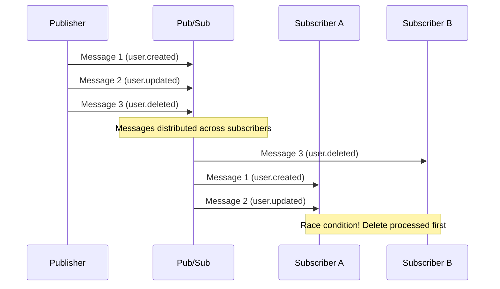
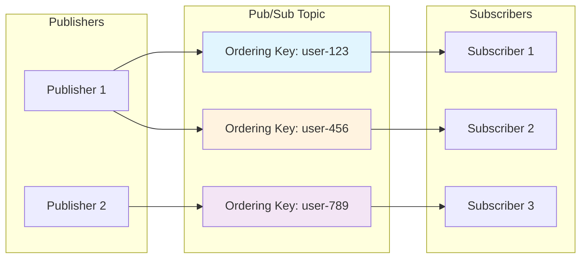
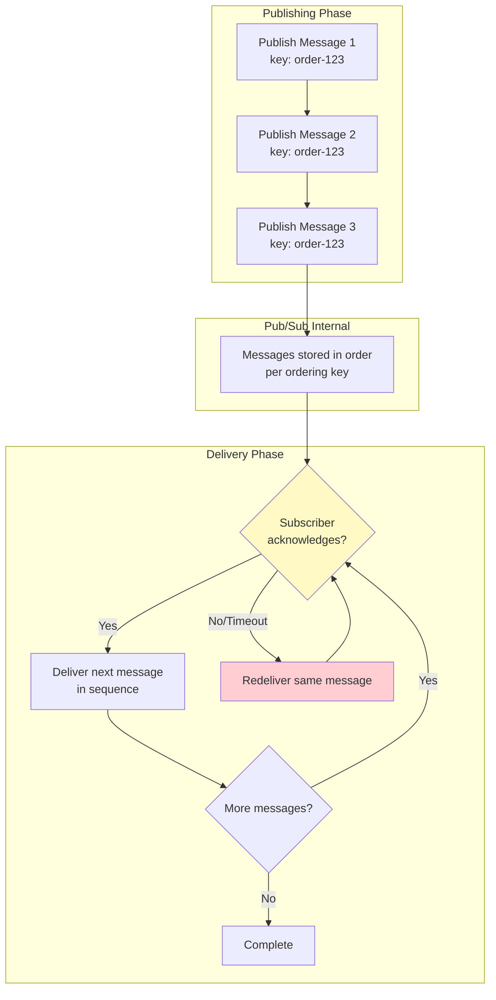
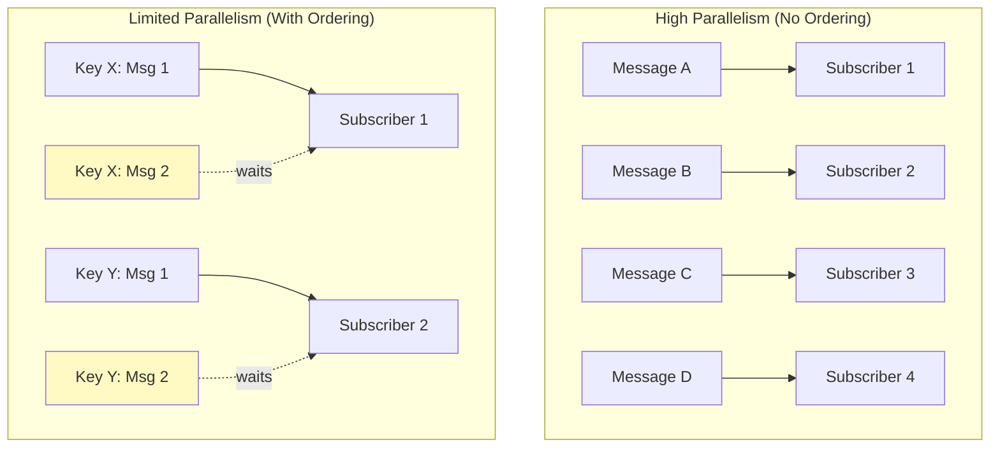
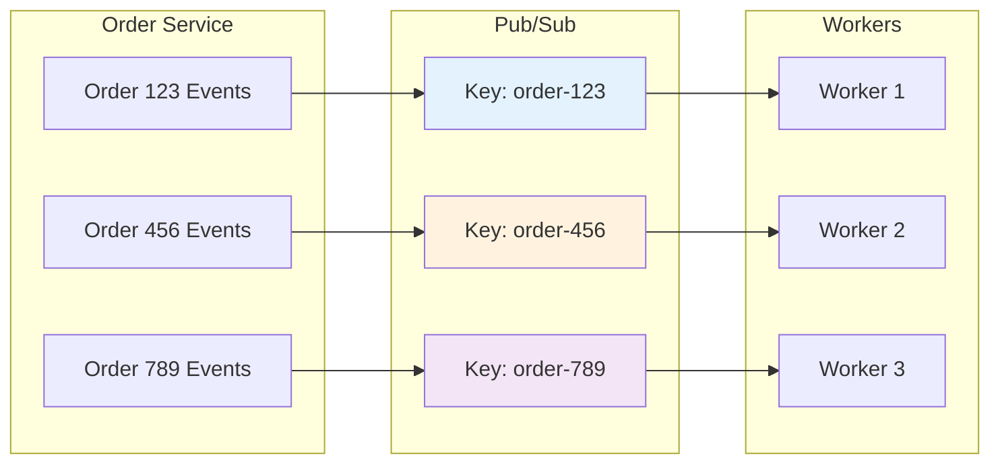
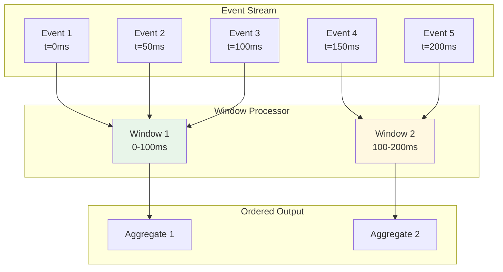
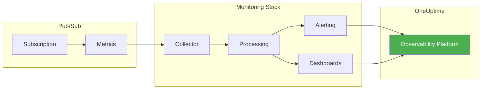

# How to Handle Pub/Sub Message Ordering

Author: [nawazdhandala](https://www.github.com/nawazdhandala)

Tags: Pub/Sub, Message Ordering, Distributed Systems, Google Cloud, Event-Driven Architecture, Ordering Keys, Parallelism, Messaging

Description: A practical guide to handling message ordering in Pub/Sub systems. Learn how ordering keys work, understand ordering guarantees and their trade-offs with parallelism, and implement reliable ordered message processing in your applications.

---

> "Order matters. In distributed systems, the difference between 'deposit then withdraw' and 'withdraw then deposit' can be the difference between a happy customer and an overdraft fee."

Message ordering in Pub/Sub systems is one of the most misunderstood topics in distributed systems design. By default, Pub/Sub prioritizes throughput and availability over strict ordering. This guide shows you how to achieve reliable message ordering when your application requires it, while understanding the trade-offs involved.

---

## Why Message Ordering Matters

Consider these scenarios where out-of-order processing causes real problems:

- **Financial transactions**: A withdrawal processed before a deposit causes an overdraft
- **User state changes**: "Account deleted" arrives before "Account created"
- **Inventory updates**: Stock decrements processed before increments cause negative inventory
- **Event sourcing**: Events replayed out of order corrupt aggregate state

Without ordering guarantees, your subscribers might process messages like this:



---

## Understanding Ordering Keys

Ordering keys are the primary mechanism for achieving message ordering in Pub/Sub. When you publish messages with the same ordering key, Pub/Sub guarantees they will be delivered to subscribers in the order they were published.

### How Ordering Keys Work



Key principles:

1. **Same ordering key = same order**: Messages with identical ordering keys are delivered in publish order
2. **Different ordering keys = no ordering relationship**: Messages with different keys can be delivered in any order relative to each other
3. **One subscriber per key**: At any moment, only one subscriber processes messages for a given ordering key

---

## Ordering Guarantees Explained

### What Pub/Sub Guarantees

When using ordering keys with ordered delivery enabled:

1. **Per-key ordering**: Messages with the same ordering key are delivered in the order published
2. **At-least-once delivery**: Messages may be delivered more than once (your code must be idempotent)
3. **Regional ordering**: Ordering is guaranteed within a single region

### What Pub/Sub Does NOT Guarantee

1. **Global ordering across keys**: No ordering relationship between different ordering keys
2. **Cross-region ordering**: Ordering guarantees don't extend across regions
3. **Exactly-once processing**: You must handle duplicates yourself

### Ordering Flow Diagram



---

## Trade-offs with Parallelism

This is where it gets interesting. Ordering and parallelism are fundamentally at odds:

### The Core Trade-off

| Aspect | Without Ordering Keys | With Ordering Keys |
|--------|----------------------|-------------------|
| Throughput | High (unlimited parallelism) | Limited (one message per key at a time) |
| Latency | Low (immediate delivery) | Higher (must wait for acks) |
| Scaling | Horizontal (add subscribers) | Vertical (limited by key cardinality) |
| Complexity | Simple | More complex error handling |

### Parallelism Model



### Optimizing the Trade-off

The key insight: **Choose ordering keys that maximize parallelism while maintaining required ordering**.

```python
# Bad: Single ordering key = no parallelism
# All messages processed sequentially
ordering_key = "all-orders"

# Better: Order key per entity = parallelism across entities
# Messages for different users processed in parallel
ordering_key = f"user-{user_id}"

# Best: Fine-grained keys where ordering matters
# Only order-related messages need sequencing
ordering_key = f"order-{order_id}"
```

---

## Implementation Examples

### Python: Publishing with Ordering Keys

```python
"""
Pub/Sub Publisher with Ordering Keys

This module demonstrates how to publish messages with ordering keys
to ensure ordered delivery for related messages.
"""

from google.cloud import pubsub_v1
from google.cloud.pubsub_v1 import types
from concurrent import futures
import json
import logging

# Configure logging for visibility into publish operations
logging.basicConfig(level=logging.INFO)
logger = logging.getLogger(__name__)


def create_publisher_with_ordering():
    """
    Create a publisher client configured for ordered message delivery.

    The enable_message_ordering setting is critical - without it,
    ordering keys are ignored and messages may arrive out of order.
    """
    # Publisher options for ordered delivery
    publisher_options = types.PublisherOptions(
        # This MUST be True to use ordering keys
        enable_message_ordering=True,
    )

    # Batch settings tuned for ordered publishing
    # Smaller batches = lower latency but more requests
    batch_settings = types.BatchSettings(
        max_messages=100,           # Batch up to 100 messages
        max_bytes=1024 * 1024,      # Or 1MB, whichever comes first
        max_latency=0.01,           # Flush after 10ms max
    )

    return pubsub_v1.PublisherClient(
        publisher_options=publisher_options,
        batch_settings=batch_settings,
    )


def publish_ordered_messages(
    project_id: str,
    topic_id: str,
    entity_id: str,
    messages: list[dict]
) -> list[str]:
    """
    Publish a sequence of messages that must be processed in order.

    Args:
        project_id: GCP project ID
        topic_id: Pub/Sub topic ID
        entity_id: Entity ID used as ordering key (e.g., user_id, order_id)
        messages: List of message payloads to publish in order

    Returns:
        List of published message IDs

    Example:
        >>> messages = [
        ...     {"event": "order.created", "order_id": "123"},
        ...     {"event": "order.paid", "order_id": "123"},
        ...     {"event": "order.shipped", "order_id": "123"},
        ... ]
        >>> publish_ordered_messages("my-project", "orders", "order-123", messages)
    """
    publisher = create_publisher_with_ordering()
    topic_path = publisher.topic_path(project_id, topic_id)

    # Use entity ID as ordering key
    # All messages for this entity will be delivered in order
    ordering_key = f"entity-{entity_id}"

    publish_futures = []
    message_ids = []

    for index, message in enumerate(messages):
        # Add sequence number for debugging and idempotency
        message["_sequence"] = index
        message["_entity_id"] = entity_id

        # Encode message as JSON bytes
        data = json.dumps(message).encode("utf-8")

        # Publish with ordering key
        # Messages with same ordering_key delivered in publish order
        future = publisher.publish(
            topic_path,
            data=data,
            ordering_key=ordering_key,  # Critical for ordering!
            # Add attributes for filtering and debugging
            entity_id=entity_id,
            sequence=str(index),
        )
        publish_futures.append(future)

        logger.info(f"Queued message {index} for {ordering_key}")

    # Wait for all publishes to complete
    # Important: If one fails, subsequent messages may not publish
    for i, future in enumerate(publish_futures):
        try:
            message_id = future.result(timeout=30)
            message_ids.append(message_id)
            logger.info(f"Published message {i}: {message_id}")
        except Exception as e:
            # On failure, the ordering key becomes "paused"
            # Must resume before publishing more to this key
            logger.error(f"Failed to publish message {i}: {e}")

            # Resume publishing for this ordering key
            publisher.resume_publish(topic_path, ordering_key)
            raise

    return message_ids


def handle_publish_failure(publisher, topic_path: str, ordering_key: str):
    """
    Handle publish failures for ordered messages.

    When a publish fails, the ordering key enters a "paused" state.
    No more messages can be published to that key until resumed.
    This prevents out-of-order delivery.
    """
    logger.warning(f"Resuming publish for ordering key: {ordering_key}")

    # Resume allows new publishes to this ordering key
    # Previously failed messages are NOT retried automatically
    publisher.resume_publish(topic_path, ordering_key)


# Example usage demonstrating ordered event publishing
if __name__ == "__main__":
    # Simulate order lifecycle events that MUST be processed in order
    order_events = [
        {"event": "order.created", "status": "pending", "amount": 99.99},
        {"event": "order.payment_received", "status": "paid", "payment_id": "pay_123"},
        {"event": "order.fulfilled", "status": "shipped", "tracking": "1Z999AA10123"},
        {"event": "order.delivered", "status": "complete", "signature": "John Doe"},
    ]

    message_ids = publish_ordered_messages(
        project_id="my-project",
        topic_id="order-events",
        entity_id="order-98765",
        messages=order_events,
    )

    print(f"Published {len(message_ids)} ordered messages")
```

### Python: Subscribing with Ordered Delivery

```python
"""
Pub/Sub Subscriber with Ordered Delivery

This module demonstrates how to consume messages with ordering guarantees,
including proper acknowledgment handling and idempotency.
"""

from google.cloud import pubsub_v1
from google.cloud.pubsub_v1 import types
import json
import logging
from typing import Callable
from dataclasses import dataclass
from datetime import datetime
import hashlib

logging.basicConfig(level=logging.INFO)
logger = logging.getLogger(__name__)


@dataclass
class ProcessedMessage:
    """Track processed messages for idempotency."""
    message_id: str
    ordering_key: str
    processed_at: datetime
    checksum: str


class OrderedMessageProcessor:
    """
    Process Pub/Sub messages with ordering guarantees.

    Key concepts:
    1. Messages with same ordering key arrive in order
    2. Must ACK promptly or message redelivered (blocking the key)
    3. Must handle duplicates (at-least-once delivery)
    4. NACK causes redelivery and blocks subsequent messages
    """

    def __init__(self, project_id: str, subscription_id: str):
        self.project_id = project_id
        self.subscription_id = subscription_id

        # Track processed messages for idempotency
        # In production, use Redis or database
        self.processed_messages: dict[str, ProcessedMessage] = {}

        # Create subscriber with flow control
        self.subscriber = self._create_subscriber()

    def _create_subscriber(self) -> pubsub_v1.SubscriberClient:
        """Create subscriber configured for ordered delivery."""
        return pubsub_v1.SubscriberClient()

    def _get_flow_control(self) -> types.FlowControl:
        """
        Configure flow control for ordered message processing.

        For ordered delivery, you typically want lower concurrency
        to reduce memory pressure from buffered messages.
        """
        return types.FlowControl(
            # Limit outstanding messages per subscriber
            # Lower = less memory, higher = more throughput
            max_messages=100,

            # Limit outstanding bytes
            max_bytes=10 * 1024 * 1024,  # 10MB
        )

    def _compute_checksum(self, data: bytes) -> str:
        """Compute message checksum for deduplication."""
        return hashlib.sha256(data).hexdigest()[:16]

    def _is_duplicate(self, message) -> bool:
        """
        Check if message was already processed.

        Pub/Sub guarantees at-least-once delivery, so duplicates
        are possible and expected. Your processing must be idempotent.
        """
        checksum = self._compute_checksum(message.data)

        # Check by message ID (exact duplicate)
        if message.message_id in self.processed_messages:
            logger.info(f"Duplicate detected by message_id: {message.message_id}")
            return True

        # Check by content checksum (same content, different delivery)
        for processed in self.processed_messages.values():
            if processed.checksum == checksum:
                logger.info(f"Duplicate detected by checksum: {checksum}")
                return True

        return False

    def _record_processed(self, message) -> None:
        """Record message as processed for future deduplication."""
        self.processed_messages[message.message_id] = ProcessedMessage(
            message_id=message.message_id,
            ordering_key=message.ordering_key,
            processed_at=datetime.utcnow(),
            checksum=self._compute_checksum(message.data),
        )

        # Clean old entries (keep last 10000)
        if len(self.processed_messages) > 10000:
            oldest_keys = sorted(
                self.processed_messages.keys(),
                key=lambda k: self.processed_messages[k].processed_at
            )[:1000]
            for key in oldest_keys:
                del self.processed_messages[key]

    def process_message(
        self,
        message,
        handler: Callable[[dict], None]
    ) -> None:
        """
        Process a single message with ordering guarantees.

        Critical: ACK timing affects ordering!
        - ACK immediately after successful processing
        - NACK on failure (blocks subsequent messages for this key)
        - Never ACK before processing completes
        """
        ordering_key = message.ordering_key

        logger.info(
            f"Received message {message.message_id} "
            f"for ordering key: {ordering_key}"
        )

        try:
            # Check for duplicates BEFORE processing
            if self._is_duplicate(message):
                logger.info(f"Skipping duplicate message: {message.message_id}")
                message.ack()  # ACK to prevent redelivery
                return

            # Decode message payload
            payload = json.loads(message.data.decode("utf-8"))

            # Log sequence for debugging ordering issues
            sequence = payload.get("_sequence", "unknown")
            logger.info(
                f"Processing message sequence {sequence} "
                f"for {ordering_key}"
            )

            # Process the message with user-provided handler
            # This should be idempotent!
            handler(payload)

            # Record as processed BEFORE acknowledging
            self._record_processed(message)

            # ACK only after successful processing
            # This allows the next message in sequence to be delivered
            message.ack()

            logger.info(
                f"Successfully processed and ACKed message "
                f"{message.message_id} (sequence {sequence})"
            )

        except json.JSONDecodeError as e:
            # Bad message format - ACK to skip (can't be fixed by retry)
            logger.error(f"Invalid JSON in message: {e}")
            message.ack()

        except Exception as e:
            # Processing failed - NACK to retry
            # WARNING: This blocks all subsequent messages for this ordering key
            # until this message is successfully processed or dead-lettered
            logger.error(f"Failed to process message: {e}")
            message.nack()

    def start(self, handler: Callable[[dict], None]) -> None:
        """
        Start consuming messages with ordered delivery.

        The subscription must have message ordering enabled.
        Enable it in the console or via:
        gcloud pubsub subscriptions create SUBSCRIPTION_ID \
            --topic=TOPIC_ID \
            --enable-message-ordering
        """
        subscription_path = self.subscriber.subscription_path(
            self.project_id,
            self.subscription_id
        )

        def callback(message):
            self.process_message(message, handler)

        # Start streaming pull with flow control
        streaming_pull_future = self.subscriber.subscribe(
            subscription_path,
            callback=callback,
            flow_control=self._get_flow_control(),
        )

        logger.info(f"Listening for messages on {subscription_path}")

        # Block until cancelled
        try:
            streaming_pull_future.result()
        except KeyboardInterrupt:
            streaming_pull_future.cancel()
            streaming_pull_future.result()


# Example usage
def handle_order_event(payload: dict) -> None:
    """
    Example handler for order events.

    This handler MUST be idempotent - calling it multiple times
    with the same payload should have the same effect as calling once.
    """
    event_type = payload.get("event")
    order_id = payload.get("_entity_id")
    sequence = payload.get("_sequence")

    logger.info(f"Handling {event_type} for order {order_id} (seq: {sequence})")

    # Process based on event type
    # In production, use database transactions for idempotency
    if event_type == "order.created":
        # Create order record (use INSERT ON CONFLICT DO NOTHING)
        pass
    elif event_type == "order.payment_received":
        # Update order status (use optimistic locking)
        pass
    elif event_type == "order.fulfilled":
        # Update with shipping info
        pass
    elif event_type == "order.delivered":
        # Mark complete
        pass


if __name__ == "__main__":
    processor = OrderedMessageProcessor(
        project_id="my-project",
        subscription_id="order-events-sub"
    )
    processor.start(handler=handle_order_event)
```

### Node.js/TypeScript: Publisher with Ordering

```typescript
/**
 * Pub/Sub Publisher with Ordering Keys - TypeScript Implementation
 *
 * This module provides a type-safe way to publish ordered messages
 * with proper error handling and retry logic.
 */

import { PubSub, Topic, PublishOptions } from '@google-cloud/pubsub';

// Type definitions for our message structure
interface OrderedMessage {
  event: string;
  entityId: string;
  payload: Record<string, unknown>;
  _sequence?: number;
  _timestamp?: string;
}

interface PublishResult {
  messageId: string;
  sequence: number;
  orderingKey: string;
}

/**
 * Publisher configured for ordered message delivery.
 *
 * Key configuration:
 * - enableMessageOrdering: MUST be true for ordering keys to work
 * - batching: Tune based on latency vs throughput requirements
 */
class OrderedPublisher {
  private pubsub: PubSub;
  private topic: Topic;

  constructor(projectId: string, topicId: string) {
    this.pubsub = new PubSub({ projectId });

    // Configure topic with ordering enabled
    this.topic = this.pubsub.topic(topicId, {
      // Critical: Enable message ordering
      enableMessageOrdering: true,

      // Batching configuration for ordered publishing
      batching: {
        maxMessages: 100,
        maxMilliseconds: 10, // Low latency for ordered messages
      },
    });
  }

  /**
   * Publish a sequence of messages that must be processed in order.
   *
   * All messages are published with the same ordering key, ensuring
   * they are delivered to subscribers in the exact order published.
   */
  async publishOrderedSequence(
    entityId: string,
    messages: OrderedMessage[]
  ): Promise<PublishResult[]> {
    // Use entity ID as ordering key
    // All messages for this entity will maintain order
    const orderingKey = `entity-${entityId}`;

    const results: PublishResult[] = [];

    for (let sequence = 0; sequence < messages.length; sequence++) {
      const message = messages[sequence];

      // Enrich message with metadata
      const enrichedMessage: OrderedMessage = {
        ...message,
        entityId,
        _sequence: sequence,
        _timestamp: new Date().toISOString(),
      };

      try {
        // Publish with ordering key
        const messageId = await this.topic.publishMessage({
          // Message data as Buffer
          data: Buffer.from(JSON.stringify(enrichedMessage)),

          // Ordering key ensures sequential delivery
          orderingKey,

          // Attributes for filtering and debugging
          attributes: {
            entityId,
            sequence: sequence.toString(),
            event: message.event,
          },
        });

        results.push({
          messageId,
          sequence,
          orderingKey,
        });

        console.log(
          `Published message ${sequence}/${messages.length}: ${messageId}`
        );

      } catch (error) {
        // Handle publish failure
        // When publishing fails, the ordering key is "paused"
        console.error(`Failed to publish message ${sequence}:`, error);

        // Resume the ordering key to allow future publishes
        this.topic.resumePublishing(orderingKey);

        // Re-throw to let caller handle
        throw new Error(
          `Failed to publish message ${sequence} for ${orderingKey}: ${error}`
        );
      }
    }

    return results;
  }

  /**
   * Publish a single ordered message.
   * Useful for streaming scenarios where messages arrive one at a time.
   */
  async publishSingleMessage(
    entityId: string,
    message: OrderedMessage,
    sequence: number
  ): Promise<string> {
    const orderingKey = `entity-${entityId}`;

    const enrichedMessage = {
      ...message,
      _sequence: sequence,
      _timestamp: new Date().toISOString(),
    };

    try {
      const messageId = await this.topic.publishMessage({
        data: Buffer.from(JSON.stringify(enrichedMessage)),
        orderingKey,
        attributes: {
          entityId,
          sequence: sequence.toString(),
        },
      });

      return messageId;

    } catch (error) {
      // Resume and re-throw
      this.topic.resumePublishing(orderingKey);
      throw error;
    }
  }

  /**
   * Close the publisher and flush pending messages.
   */
  async close(): Promise<void> {
    await this.topic.flush();
  }
}

// Example usage
async function main() {
  const publisher = new OrderedPublisher('my-project', 'order-events');

  // Simulate order lifecycle events
  const orderEvents: OrderedMessage[] = [
    {
      event: 'order.created',
      entityId: 'order-12345',
      payload: { customerId: 'cust-789', items: ['item-1', 'item-2'] },
    },
    {
      event: 'order.paid',
      entityId: 'order-12345',
      payload: { paymentId: 'pay-456', amount: 99.99 },
    },
    {
      event: 'order.shipped',
      entityId: 'order-12345',
      payload: { carrier: 'UPS', tracking: '1Z999AA10123' },
    },
    {
      event: 'order.delivered',
      entityId: 'order-12345',
      payload: { deliveredAt: new Date().toISOString() },
    },
  ];

  try {
    const results = await publisher.publishOrderedSequence(
      'order-12345',
      orderEvents
    );

    console.log(`Published ${results.length} ordered messages`);
    results.forEach(r => {
      console.log(`  Sequence ${r.sequence}: ${r.messageId}`);
    });

  } finally {
    await publisher.close();
  }
}

main().catch(console.error);
```

### Node.js/TypeScript: Subscriber with Ordering

```typescript
/**
 * Pub/Sub Subscriber with Ordered Delivery - TypeScript Implementation
 *
 * Handles ordered message consumption with proper acknowledgment,
 * idempotency checking, and error handling.
 */

import { PubSub, Subscription, Message } from '@google-cloud/pubsub';
import { createHash } from 'crypto';

// Message payload type
interface OrderedMessage {
  event: string;
  entityId: string;
  payload: Record<string, unknown>;
  _sequence?: number;
  _timestamp?: string;
}

// Handler function type
type MessageHandler = (message: OrderedMessage) => Promise<void>;

// Processed message tracking
interface ProcessedRecord {
  messageId: string;
  checksum: string;
  processedAt: Date;
}

/**
 * Subscriber that processes messages with ordering guarantees.
 *
 * Important: The subscription must have message ordering enabled!
 * Create with: gcloud pubsub subscriptions create SUB_ID --topic=TOPIC --enable-message-ordering
 */
class OrderedSubscriber {
  private pubsub: PubSub;
  private subscription: Subscription;

  // Idempotency tracking (use Redis in production)
  private processedMessages: Map<string, ProcessedRecord> = new Map();
  private readonly maxProcessedCache = 10000;

  constructor(projectId: string, subscriptionId: string) {
    this.pubsub = new PubSub({ projectId });

    // Configure subscription with flow control
    this.subscription = this.pubsub.subscription(subscriptionId, {
      // Flow control limits concurrent processing
      flowControl: {
        maxMessages: 100,        // Outstanding messages limit
        allowExcessMessages: false,
      },

      // Ack deadline extension for long-running handlers
      ackDeadline: 30,
    });
  }

  /**
   * Compute content checksum for deduplication.
   */
  private computeChecksum(data: Buffer): string {
    return createHash('sha256').update(data).digest('hex').slice(0, 16);
  }

  /**
   * Check if message was already processed.
   *
   * Pub/Sub provides at-least-once delivery, so duplicates are expected.
   * Your message handling MUST be idempotent.
   */
  private isDuplicate(message: Message): boolean {
    // Check by message ID (exact redelivery)
    if (this.processedMessages.has(message.id)) {
      console.log(`Duplicate detected by ID: ${message.id}`);
      return true;
    }

    // Check by content checksum (same content, different delivery)
    const checksum = this.computeChecksum(message.data);
    for (const record of this.processedMessages.values()) {
      if (record.checksum === checksum) {
        console.log(`Duplicate detected by checksum: ${checksum}`);
        return true;
      }
    }

    return false;
  }

  /**
   * Record message as processed.
   */
  private recordProcessed(message: Message): void {
    // Add to cache
    this.processedMessages.set(message.id, {
      messageId: message.id,
      checksum: this.computeChecksum(message.data),
      processedAt: new Date(),
    });

    // Evict oldest entries if cache is full
    if (this.processedMessages.size > this.maxProcessedCache) {
      const entriesToDelete = this.processedMessages.size - this.maxProcessedCache + 100;
      const iterator = this.processedMessages.keys();

      for (let i = 0; i < entriesToDelete; i++) {
        const key = iterator.next().value;
        if (key) this.processedMessages.delete(key);
      }
    }
  }

  /**
   * Process a single message with ordering guarantees.
   *
   * Critical flow:
   * 1. Check for duplicates
   * 2. Process message (must be idempotent)
   * 3. Record as processed
   * 4. ACK message (allows next in sequence)
   *
   * On failure: NACK blocks subsequent messages for this ordering key
   */
  private async processMessage(
    message: Message,
    handler: MessageHandler
  ): Promise<void> {
    const orderingKey = message.orderingKey || 'none';

    console.log(
      `Received message ${message.id} ` +
      `for ordering key: ${orderingKey}`
    );

    try {
      // Skip duplicates but ACK to clear them
      if (this.isDuplicate(message)) {
        console.log(`Skipping duplicate: ${message.id}`);
        message.ack();
        return;
      }

      // Parse message payload
      const payload: OrderedMessage = JSON.parse(message.data.toString());

      console.log(
        `Processing ${payload.event} ` +
        `(sequence: ${payload._sequence}) ` +
        `for ${orderingKey}`
      );

      // Process with user handler (MUST be idempotent)
      await handler(payload);

      // Record BEFORE acknowledging
      this.recordProcessed(message);

      // ACK releases the ordering key for next message
      message.ack();

      console.log(
        `Successfully processed message ${message.id} ` +
        `(sequence: ${payload._sequence})`
      );

    } catch (error) {
      // Check if error is recoverable
      if (this.isRecoverableError(error)) {
        // NACK for retry - blocks subsequent messages!
        console.error(`Recoverable error, NACKing: ${error}`);
        message.nack();
      } else {
        // Unrecoverable - ACK to skip (log for manual review)
        console.error(`Unrecoverable error, ACKing to skip: ${error}`);
        message.ack();
      }
    }
  }

  /**
   * Determine if an error is recoverable (should retry).
   */
  private isRecoverableError(error: unknown): boolean {
    if (error instanceof SyntaxError) {
      // JSON parse error - not recoverable
      return false;
    }

    // Network errors, timeouts, etc. are recoverable
    return true;
  }

  /**
   * Start listening for ordered messages.
   */
  start(handler: MessageHandler): void {
    console.log(`Starting ordered subscriber...`);

    // Register message handler
    this.subscription.on('message', (message: Message) => {
      this.processMessage(message, handler).catch(err => {
        console.error('Unexpected error in message processing:', err);
      });
    });

    // Handle subscription errors
    this.subscription.on('error', (error) => {
      console.error('Subscription error:', error);
    });

    console.log('Listening for ordered messages...');
  }

  /**
   * Stop the subscriber gracefully.
   */
  async stop(): Promise<void> {
    await this.subscription.close();
  }
}

// Example message handler
async function handleOrderEvent(message: OrderedMessage): Promise<void> {
  const { event, entityId, payload, _sequence } = message;

  console.log(`Handling ${event} for ${entityId} (sequence: ${_sequence})`);

  // Simulate processing based on event type
  switch (event) {
    case 'order.created':
      // Insert order (use INSERT ... ON CONFLICT DO NOTHING)
      console.log('  Creating order record...');
      break;

    case 'order.paid':
      // Update payment status (use optimistic locking)
      console.log('  Recording payment...');
      break;

    case 'order.shipped':
      // Add shipping info
      console.log('  Adding shipping details...');
      break;

    case 'order.delivered':
      // Mark complete
      console.log('  Marking order complete...');
      break;

    default:
      console.log(`  Unknown event type: ${event}`);
  }

  // Simulate async work
  await new Promise(resolve => setTimeout(resolve, 100));
}

// Main entry point
async function main() {
  const subscriber = new OrderedSubscriber('my-project', 'order-events-sub');

  subscriber.start(handleOrderEvent);

  // Handle shutdown
  process.on('SIGINT', async () => {
    console.log('Shutting down...');
    await subscriber.stop();
    process.exit(0);
  });
}

main().catch(console.error);
```

---

## Architecture Patterns for Ordered Messaging

### Pattern 1: Partition by Entity

The most common pattern - use entity ID as ordering key.



### Pattern 2: Hierarchical Ordering Keys

For complex ordering requirements, use hierarchical keys.

```typescript
/**
 * Hierarchical ordering key strategies.
 *
 * Choose based on your ordering requirements:
 * - Broader key = stricter ordering, less parallelism
 * - Narrower key = looser ordering, more parallelism
 */

// Level 1: Organization-wide ordering (least parallel)
const orgKey = `org-${organizationId}`;

// Level 2: Project-level ordering within org
const projectKey = `org-${organizationId}-project-${projectId}`;

// Level 3: Entity-level ordering (most parallel)
const entityKey = `org-${organizationId}-project-${projectId}-entity-${entityId}`;

// Choose based on what actually needs ordering
function selectOrderingKey(event: Event): string {
  // Billing events need org-wide ordering
  if (event.type.startsWith('billing.')) {
    return `org-${event.organizationId}`;
  }

  // Project settings need project-level ordering
  if (event.type.startsWith('project.settings.')) {
    return `project-${event.projectId}`;
  }

  // Most events only need entity-level ordering
  return `entity-${event.entityId}`;
}
```

### Pattern 3: Ordered Aggregation with Windowing

For analytics use cases where you need ordering within time windows.



---

## Best Practices and Common Pitfalls

### Do: Design for Idempotency

```python
# Bad: Non-idempotent - creates duplicate records on replay
def handle_order_created(event):
    db.insert("orders", event["order_id"], event["data"])

# Good: Idempotent - safe to replay
def handle_order_created(event):
    db.upsert(
        "orders",
        key=event["order_id"],
        data=event["data"],
        if_not_exists=True  # Only insert if not present
    )
```

### Do: Handle Acknowledgment Correctly

```python
# Bad: ACK before processing - lose message if crash occurs
def handle_message(message):
    message.ack()  # ACK first - WRONG!
    process(message)  # If this crashes, message is lost

# Good: ACK after successful processing
def handle_message(message):
    try:
        process(message)
        message.ack()  # ACK only on success
    except RecoverableError:
        message.nack()  # Retry
    except UnrecoverableError:
        message.ack()  # Skip bad message
```

### Do: Monitor Ordering Key Health

Track these metrics to detect ordering issues:

- **Messages per ordering key**: Detect hot keys
- **Ack latency per key**: Identify slow consumers
- **Redelivery rate**: High rate indicates processing issues
- **Oldest unacked message age**: Detect stuck keys

### Don't: Use Too Few Ordering Keys

```python
# Bad: Single ordering key = zero parallelism
ordering_key = "all-events"  # Everything is sequential!

# Good: Granular keys enable parallelism
ordering_key = f"user-{user_id}"  # Parallel across users
```

### Don't: Block on External Services Without Timeout

```python
# Bad: External call can block forever, stalling the ordering key
def process_payment(message):
    result = payment_gateway.charge(message.amount)  # No timeout!
    message.ack()

# Good: Timeout and retry logic
def process_payment(message):
    try:
        result = payment_gateway.charge(
            message.amount,
            timeout=5.0  # Timeout after 5 seconds
        )
        message.ack()
    except TimeoutError:
        # Decide: retry or dead-letter
        message.nack()
```

---

## Monitoring Ordered Message Processing

Effective monitoring is critical for ordered message systems. When ordering keys get stuck or messages pile up, you need to know immediately.

### Key Metrics to Track

| Metric | What It Tells You | Alert Threshold |
|--------|------------------|-----------------|
| Oldest unacked message age | Stuck ordering keys | > 5 minutes |
| Messages per ordering key | Hot key detection | > 1000 |
| Ack latency p99 | Processing slowdown | > 10 seconds |
| Redelivery rate | Processing failures | > 5% |
| Subscription backlog | Overall health | > 10000 |

### Monitoring Architecture



For comprehensive monitoring of your Pub/Sub message ordering, consider using [OneUptime](https://oneuptime.com) to track subscription health, alert on stuck ordering keys, and visualize message flow patterns. OneUptime's observability platform can help you detect ordering issues before they impact your users.

---

## Summary

Message ordering in Pub/Sub requires careful design:

1. **Use ordering keys** to guarantee per-entity message order
2. **Choose key granularity** that balances ordering needs with parallelism
3. **Implement idempotent handlers** since at-least-once delivery means duplicates
4. **ACK after processing** to maintain ordering guarantees
5. **Monitor ordering key health** to catch stuck keys early
6. **Accept the trade-off**: ordering reduces parallelism - design accordingly

The key insight: you rarely need global ordering. Identify what actually needs ordering (usually per-entity) and design your ordering keys accordingly. This gives you the ordering guarantees you need while maintaining horizontal scalability.

---

## Further Reading

- [Google Cloud Pub/Sub Ordering Documentation](https://cloud.google.com/pubsub/docs/ordering)
- [Exactly-Once Processing Patterns](https://cloud.google.com/pubsub/docs/exactly-once-delivery)
- [Monitor Your Message Queues with OneUptime](https://oneuptime.com)
