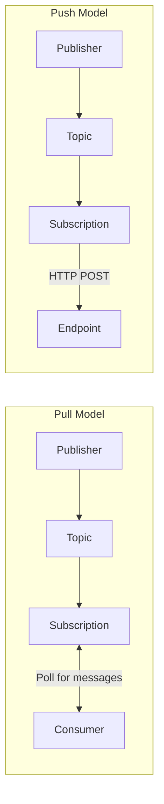
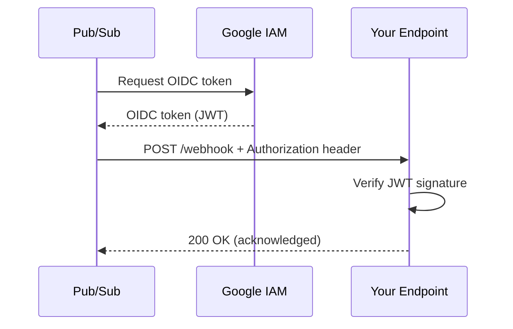
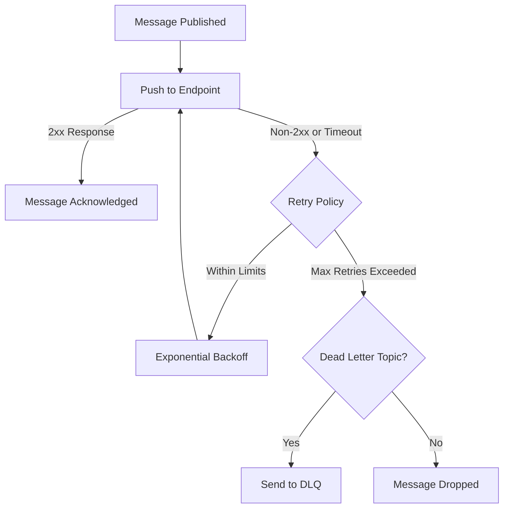
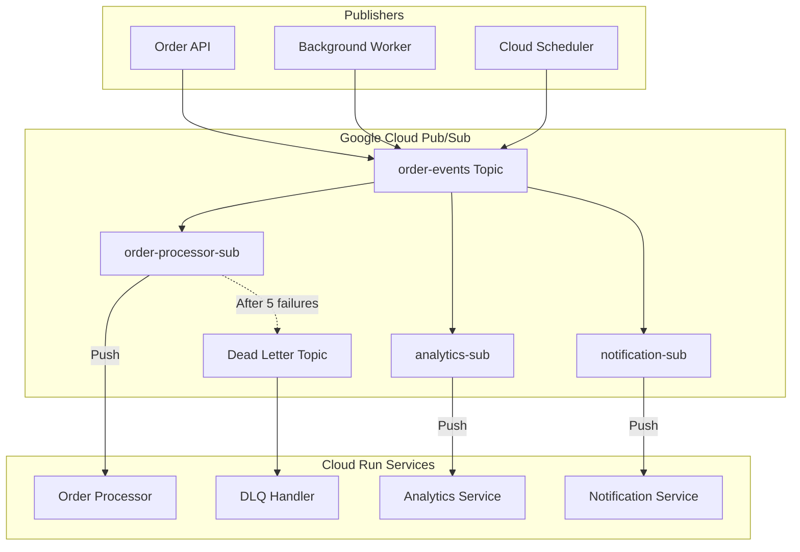
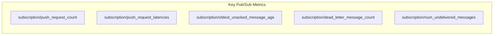

# How to Configure Pub/Sub Push Subscriptions

Author: [nawazdhandala](https://www.github.com/nawazdhandala)

Tags: Google Cloud, Pub/Sub, Push Subscriptions, Cloud Run, Serverless, Webhooks, Event-Driven Architecture, Messaging

Description: A comprehensive guide to configuring Google Cloud Pub/Sub push subscriptions, covering endpoint setup, authentication, retry policies, dead-letter queues, and integration with Cloud Run services.

---

> "The best architectures emerge from an understanding that messages should flow like water - finding the path of least resistance to their destination." - Werner Vogels

Google Cloud Pub/Sub push subscriptions deliver messages directly to your HTTP endpoints, eliminating the need for polling. This makes them ideal for serverless architectures where you want Pub/Sub to invoke your services automatically when messages arrive.

## Understanding Push vs Pull Subscriptions

Before diving into configuration, let's understand when to use push subscriptions.



**Use Push When:**
- Running on serverless platforms (Cloud Run, Cloud Functions)
- You want automatic scaling based on message volume
- Your endpoint can handle HTTP webhooks
- You prefer not to manage message polling

**Use Pull When:**
- Processing large batches of messages
- Need fine-grained control over message acknowledgment
- Running on VMs or GKE with persistent connections

## Creating a Basic Push Subscription

### Using gcloud CLI

```bash
# Create a topic first
gcloud pubsub topics create order-events

# Create a push subscription pointing to your endpoint
gcloud pubsub subscriptions create order-processor \
    --topic=order-events \
    --push-endpoint=https://orders.example.com/webhook/pubsub \
    --ack-deadline=60
```

### Using Terraform

```hcl
# Define the Pub/Sub topic for order events
resource "google_pubsub_topic" "order_events" {
  name = "order-events"

  # Optional: Configure message retention
  message_retention_duration = "86400s"  # 24 hours
}

# Create push subscription with endpoint configuration
resource "google_pubsub_subscription" "order_processor" {
  name  = "order-processor"
  topic = google_pubsub_topic.order_events.name

  # Push configuration block
  push_config {
    push_endpoint = "https://orders.example.com/webhook/pubsub"

    # Custom attributes sent with each push request
    attributes = {
      x-custom-header = "order-service"
    }
  }

  # Time to wait for acknowledgment before retry
  ack_deadline_seconds = 60

  # Retain acknowledged messages for replay capability
  retain_acked_messages = true
  message_retention_duration = "604800s"  # 7 days
}
```

## Configuring Authentication

Push subscriptions should always use authentication to ensure only Pub/Sub can invoke your endpoint.

### OIDC Token Authentication



### Setting Up OIDC Authentication

```bash
# Create a service account for Pub/Sub to use
gcloud iam service-accounts create pubsub-invoker \
    --display-name="Pub/Sub Push Invoker"

# Grant the service account permission to invoke Cloud Run
gcloud run services add-iam-policy-binding order-processor \
    --member="serviceAccount:pubsub-invoker@PROJECT_ID.iam.gserviceaccount.com" \
    --role="roles/run.invoker" \
    --region=us-central1

# Create subscription with OIDC authentication
gcloud pubsub subscriptions create order-processor \
    --topic=order-events \
    --push-endpoint=https://order-processor-xyz.run.app/pubsub \
    --push-auth-service-account=pubsub-invoker@PROJECT_ID.iam.gserviceaccount.com \
    --push-auth-token-audience=https://order-processor-xyz.run.app
```

### Terraform Configuration with Authentication

```hcl
# Service account that Pub/Sub will use to authenticate
resource "google_service_account" "pubsub_invoker" {
  account_id   = "pubsub-invoker"
  display_name = "Pub/Sub Push Invoker"
}

# Grant the service account permission to invoke Cloud Run
resource "google_cloud_run_service_iam_member" "invoker" {
  service  = google_cloud_run_service.order_processor.name
  location = google_cloud_run_service.order_processor.location
  role     = "roles/run.invoker"
  member   = "serviceAccount:${google_service_account.pubsub_invoker.email}"
}

# Push subscription with OIDC token configuration
resource "google_pubsub_subscription" "order_processor" {
  name  = "order-processor"
  topic = google_pubsub_topic.order_events.name

  push_config {
    push_endpoint = google_cloud_run_service.order_processor.status[0].url

    # OIDC token configuration for secure authentication
    oidc_token {
      service_account_email = google_service_account.pubsub_invoker.email

      # Audience should match your endpoint URL
      audience = google_cloud_run_service.order_processor.status[0].url
    }
  }

  ack_deadline_seconds = 60
}
```

### Verifying OIDC Tokens in Your Application

```javascript
// Node.js/Express endpoint for receiving Pub/Sub push messages
const express = require('express');
const { OAuth2Client } = require('google-auth-library');

const app = express();
app.use(express.json());

// Initialize OAuth2 client for token verification
const authClient = new OAuth2Client();

// Middleware to verify Pub/Sub OIDC token
async function verifyPubSubToken(req, res, next) {
  try {
    // Extract the Bearer token from Authorization header
    const authHeader = req.headers.authorization || '';
    const token = authHeader.replace('Bearer ', '');

    if (!token) {
      return res.status(401).json({ error: 'Missing authorization token' });
    }

    // Verify the token with Google's public keys
    const ticket = await authClient.verifyIdToken({
      idToken: token,
      audience: process.env.EXPECTED_AUDIENCE, // Your endpoint URL
    });

    // Get the payload and verify the email matches your service account
    const payload = ticket.getPayload();
    const expectedEmail = process.env.PUBSUB_SERVICE_ACCOUNT;

    if (payload.email !== expectedEmail) {
      return res.status(403).json({ error: 'Invalid service account' });
    }

    // Token is valid, proceed to handler
    req.pubsubPayload = payload;
    next();
  } catch (error) {
    console.error('Token verification failed:', error);
    return res.status(401).json({ error: 'Invalid token' });
  }
}

// Pub/Sub push endpoint with authentication
app.post('/pubsub', verifyPubSubToken, (req, res) => {
  // Pub/Sub sends base64-encoded message data
  const message = req.body.message;
  const data = Buffer.from(message.data, 'base64').toString('utf-8');
  const attributes = message.attributes || {};

  console.log('Received message:', {
    messageId: message.messageId,
    publishTime: message.publishTime,
    data: JSON.parse(data),
    attributes,
  });

  // Process your message here
  // ...

  // Return 2xx to acknowledge the message
  // Any other status code will cause Pub/Sub to retry
  res.status(200).send('OK');
});

const PORT = process.env.PORT || 8080;
app.listen(PORT, () => {
  console.log(`Server listening on port ${PORT}`);
});
```

## Configuring Retry Policies

Push subscriptions automatically retry failed deliveries. Configure the retry policy to match your application's needs.



### Retry Policy Configuration

```hcl
resource "google_pubsub_subscription" "order_processor" {
  name  = "order-processor"
  topic = google_pubsub_topic.order_events.name

  push_config {
    push_endpoint = "https://orders.example.com/webhook/pubsub"

    oidc_token {
      service_account_email = google_service_account.pubsub_invoker.email
    }
  }

  # Retry policy configuration
  retry_policy {
    # Minimum delay between retry attempts
    minimum_backoff = "10s"

    # Maximum delay between retry attempts
    maximum_backoff = "600s"  # 10 minutes
  }

  # Time Pub/Sub waits for acknowledgment
  # If exceeded, message is redelivered
  ack_deadline_seconds = 60

  # Maximum number of delivery attempts before dead-lettering
  # Requires dead_letter_policy to be configured
  dead_letter_policy {
    dead_letter_topic     = google_pubsub_topic.dead_letter.id
    max_delivery_attempts = 5
  }
}

# Dead letter topic for failed messages
resource "google_pubsub_topic" "dead_letter" {
  name = "order-events-dlq"
}

# Subscription to process dead letter messages
resource "google_pubsub_subscription" "dead_letter_processor" {
  name  = "order-events-dlq-sub"
  topic = google_pubsub_topic.dead_letter.name

  # Use pull subscription for manual investigation
  expiration_policy {
    ttl = ""  # Never expire
  }
}

# Grant Pub/Sub permission to publish to dead letter topic
resource "google_pubsub_topic_iam_member" "dead_letter_publisher" {
  topic  = google_pubsub_topic.dead_letter.name
  role   = "roles/pubsub.publisher"
  member = "serviceAccount:service-${data.google_project.current.number}@gcp-sa-pubsub.iam.gserviceaccount.com"
}
```

### Understanding Exponential Backoff

```javascript
// Example of how Pub/Sub calculates retry delays
function calculateRetryDelay(attemptNumber, minBackoff, maxBackoff) {
  // Base delay doubles with each attempt
  const baseDelay = minBackoff * Math.pow(2, attemptNumber - 1);

  // Add jitter to prevent thundering herd
  const jitter = Math.random() * baseDelay * 0.1;

  // Cap at maximum backoff
  return Math.min(baseDelay + jitter, maxBackoff);
}

// Retry timeline example with 10s min, 600s max:
// Attempt 1: immediate
// Attempt 2: ~10s delay
// Attempt 3: ~20s delay
// Attempt 4: ~40s delay
// Attempt 5: ~80s delay
// ... continues doubling until max 600s
```

## Cloud Run Integration

Cloud Run is the most common target for push subscriptions due to its automatic scaling and managed infrastructure.

### Complete Cloud Run + Pub/Sub Setup

```hcl
# Cloud Run service that processes Pub/Sub messages
resource "google_cloud_run_service" "order_processor" {
  name     = "order-processor"
  location = "us-central1"

  template {
    spec {
      # Service account for the Cloud Run service itself
      service_account_name = google_service_account.order_processor.email

      containers {
        image = "gcr.io/my-project/order-processor:latest"

        # Resource allocation
        resources {
          limits = {
            cpu    = "1000m"
            memory = "512Mi"
          }
        }

        # Environment variables
        env {
          name  = "EXPECTED_AUDIENCE"
          value = "https://order-processor-xyz.run.app"
        }
        env {
          name  = "PUBSUB_SERVICE_ACCOUNT"
          value = google_service_account.pubsub_invoker.email
        }
      }

      # Concurrency: how many requests per container instance
      container_concurrency = 80

      # Timeout must be less than ack_deadline
      timeout_seconds = 55
    }

    metadata {
      annotations = {
        # Minimum instances to keep warm
        "autoscaling.knative.dev/minScale" = "0"

        # Maximum instances to scale to
        "autoscaling.knative.dev/maxScale" = "100"

        # CPU allocation during request processing only
        "run.googleapis.com/cpu-throttling" = "true"
      }
    }
  }

  traffic {
    percent         = 100
    latest_revision = true
  }
}

# Service account for the Cloud Run service
resource "google_service_account" "order_processor" {
  account_id   = "order-processor-sa"
  display_name = "Order Processor Service Account"
}

# Service account for Pub/Sub authentication
resource "google_service_account" "pubsub_invoker" {
  account_id   = "pubsub-invoker"
  display_name = "Pub/Sub Push Invoker"
}

# Allow Pub/Sub to invoke Cloud Run
resource "google_cloud_run_service_iam_member" "pubsub_invoker" {
  service  = google_cloud_run_service.order_processor.name
  location = google_cloud_run_service.order_processor.location
  role     = "roles/run.invoker"
  member   = "serviceAccount:${google_service_account.pubsub_invoker.email}"
}

# Pub/Sub topic and subscription
resource "google_pubsub_topic" "order_events" {
  name = "order-events"
}

resource "google_pubsub_subscription" "order_processor" {
  name  = "order-processor-sub"
  topic = google_pubsub_topic.order_events.name

  push_config {
    push_endpoint = "${google_cloud_run_service.order_processor.status[0].url}/pubsub"

    oidc_token {
      service_account_email = google_service_account.pubsub_invoker.email
      audience              = google_cloud_run_service.order_processor.status[0].url
    }

    attributes = {
      x-goog-version = "v1"
    }
  }

  ack_deadline_seconds = 60

  retry_policy {
    minimum_backoff = "10s"
    maximum_backoff = "600s"
  }

  dead_letter_policy {
    dead_letter_topic     = google_pubsub_topic.order_events_dlq.id
    max_delivery_attempts = 5
  }
}

resource "google_pubsub_topic" "order_events_dlq" {
  name = "order-events-dlq"
}
```

### Cloud Run Handler Best Practices

```python
# Python/Flask handler with proper error handling
from flask import Flask, request, jsonify
from google.auth.transport import requests
from google.oauth2 import id_token
import base64
import json
import os
import logging

app = Flask(__name__)
logging.basicConfig(level=logging.INFO)

def verify_pubsub_token():
    """Verify the OIDC token from Pub/Sub."""
    auth_header = request.headers.get('Authorization', '')

    if not auth_header.startswith('Bearer '):
        return None

    token = auth_header.split('Bearer ')[1]

    try:
        # Verify token with expected audience
        claim = id_token.verify_oauth2_token(
            token,
            requests.Request(),
            audience=os.environ.get('EXPECTED_AUDIENCE')
        )

        # Verify the service account email
        expected_email = os.environ.get('PUBSUB_SERVICE_ACCOUNT')
        if claim.get('email') != expected_email:
            logging.warning(f"Unexpected service account: {claim.get('email')}")
            return None

        return claim
    except Exception as e:
        logging.error(f"Token verification failed: {e}")
        return None


@app.route('/pubsub', methods=['POST'])
def handle_pubsub():
    """Handle incoming Pub/Sub push messages."""

    # Verify authentication
    claim = verify_pubsub_token()
    if not claim:
        return jsonify({'error': 'Unauthorized'}), 401

    # Parse the Pub/Sub message envelope
    envelope = request.get_json()

    if not envelope:
        return jsonify({'error': 'No message received'}), 400

    if 'message' not in envelope:
        return jsonify({'error': 'Invalid message format'}), 400

    # Extract message data
    message = envelope['message']
    message_id = message.get('messageId', 'unknown')
    publish_time = message.get('publishTime', '')
    attributes = message.get('attributes', {})

    # Decode base64 data
    try:
        data = base64.b64decode(message.get('data', '')).decode('utf-8')
        payload = json.loads(data) if data else {}
    except Exception as e:
        logging.error(f"Failed to decode message {message_id}: {e}")
        # Return 400 to prevent retries for malformed messages
        return jsonify({'error': 'Invalid message data'}), 400

    logging.info(f"Processing message {message_id}: {payload}")

    try:
        # Process your message here
        process_order(payload, attributes)

        # Return 200-299 to acknowledge
        return jsonify({'status': 'processed', 'messageId': message_id}), 200

    except RetryableError as e:
        # Return 5xx for transient errors (Pub/Sub will retry)
        logging.warning(f"Retryable error for {message_id}: {e}")
        return jsonify({'error': str(e)}), 500

    except PermanentError as e:
        # Return 4xx for permanent errors (no retry)
        logging.error(f"Permanent error for {message_id}: {e}")
        return jsonify({'error': str(e)}), 400


class RetryableError(Exception):
    """Error that should trigger a retry."""
    pass


class PermanentError(Exception):
    """Error that should not trigger a retry."""
    pass


def process_order(payload, attributes):
    """Process the order payload."""
    order_id = payload.get('order_id')

    if not order_id:
        raise PermanentError("Missing order_id")

    # Your business logic here
    logging.info(f"Successfully processed order {order_id}")


if __name__ == '__main__':
    app.run(host='0.0.0.0', port=int(os.environ.get('PORT', 8080)))
```

## Message Flow Architecture



## Filtering Messages

Push subscriptions support filters to route only matching messages to your endpoint.

```hcl
# Subscription that only receives high-priority orders
resource "google_pubsub_subscription" "high_priority_orders" {
  name  = "high-priority-orders"
  topic = google_pubsub_topic.order_events.name

  push_config {
    push_endpoint = "${google_cloud_run_service.priority_processor.status[0].url}/pubsub"

    oidc_token {
      service_account_email = google_service_account.pubsub_invoker.email
    }
  }

  # Filter expression - only messages with priority="high" attribute
  filter = "attributes.priority = \"high\""

  ack_deadline_seconds = 30
}

# Subscription for regular orders
resource "google_pubsub_subscription" "regular_orders" {
  name  = "regular-orders"
  topic = google_pubsub_topic.order_events.name

  push_config {
    push_endpoint = "${google_cloud_run_service.order_processor.status[0].url}/pubsub"

    oidc_token {
      service_account_email = google_service_account.pubsub_invoker.email
    }
  }

  # Filter for non-high priority messages
  filter = "NOT attributes:priority OR attributes.priority != \"high\""

  ack_deadline_seconds = 60
}
```

### Publishing Messages with Attributes

```javascript
// Publishing messages with attributes for filtering
const { PubSub } = require('@google-cloud/pubsub');
const pubsub = new PubSub();

async function publishOrder(order) {
  const topic = pubsub.topic('order-events');

  // Determine message attributes based on order properties
  const attributes = {
    orderId: order.id,
    priority: order.total > 1000 ? 'high' : 'normal',
    region: order.shippingAddress.country,
    orderType: order.isSubscription ? 'subscription' : 'one-time',
  };

  // Publish with attributes
  const messageId = await topic.publishMessage({
    data: Buffer.from(JSON.stringify(order)),
    attributes,
  });

  console.log(`Published order ${order.id} with messageId: ${messageId}`);
  return messageId;
}
```

## Monitoring and Observability

Monitor your push subscriptions to catch issues early.

### Key Metrics to Track



### Setting Up Alerts

```hcl
# Alert when push latency is too high
resource "google_monitoring_alert_policy" "push_latency" {
  display_name = "Pub/Sub Push Latency Alert"
  combiner     = "OR"

  conditions {
    display_name = "Push latency > 30s"

    condition_threshold {
      filter = <<-EOT
        resource.type = "pubsub_subscription"
        AND resource.labels.subscription_id = "order-processor-sub"
        AND metric.type = "pubsub.googleapis.com/subscription/push_request_latencies"
      EOT

      duration        = "300s"
      comparison      = "COMPARISON_GT"
      threshold_value = 30000  # 30 seconds in milliseconds

      aggregations {
        alignment_period   = "60s"
        per_series_aligner = "ALIGN_PERCENTILE_99"
      }
    }
  }

  notification_channels = [google_monitoring_notification_channel.email.id]
}

# Alert when dead letter queue has messages
resource "google_monitoring_alert_policy" "dlq_messages" {
  display_name = "Pub/Sub Dead Letter Queue Alert"
  combiner     = "OR"

  conditions {
    display_name = "Messages in DLQ"

    condition_threshold {
      filter = <<-EOT
        resource.type = "pubsub_subscription"
        AND resource.labels.subscription_id = "order-events-dlq-sub"
        AND metric.type = "pubsub.googleapis.com/subscription/num_undelivered_messages"
      EOT

      duration        = "60s"
      comparison      = "COMPARISON_GT"
      threshold_value = 0

      aggregations {
        alignment_period   = "60s"
        per_series_aligner = "ALIGN_MAX"
      }
    }
  }

  notification_channels = [google_monitoring_notification_channel.pagerduty.id]
}
```

### Integrating with OneUptime

For comprehensive monitoring of your Pub/Sub push subscriptions, integrate with [OneUptime](https://oneuptime.com) to track endpoint availability and response times.

```javascript
// Add custom metrics for OneUptime monitoring
const { trace, metrics } = require('@opentelemetry/api');

const meter = metrics.getMeter('pubsub-processor');

// Create custom metrics
const messagesProcessed = meter.createCounter('pubsub.messages.processed', {
  description: 'Number of Pub/Sub messages processed',
});

const processingDuration = meter.createHistogram('pubsub.message.duration', {
  description: 'Time to process a Pub/Sub message',
  unit: 'ms',
});

const processingErrors = meter.createCounter('pubsub.messages.errors', {
  description: 'Number of Pub/Sub message processing errors',
});

app.post('/pubsub', verifyPubSubToken, async (req, res) => {
  const startTime = Date.now();
  const message = req.body.message;

  try {
    await processMessage(message);

    // Record success metrics
    messagesProcessed.add(1, { status: 'success' });
    processingDuration.record(Date.now() - startTime);

    res.status(200).send('OK');
  } catch (error) {
    // Record error metrics
    processingErrors.add(1, {
      errorType: error.name,
      retryable: error instanceof RetryableError,
    });

    throw error;
  }
});
```

## Troubleshooting Common Issues

### Push Endpoint Not Receiving Messages

1. **Check endpoint accessibility:**
```bash
# Test if your endpoint is reachable from the internet
curl -X POST https://your-endpoint.com/pubsub \
  -H "Content-Type: application/json" \
  -d '{"message": {"data": "dGVzdA=="}}'
```

2. **Verify subscription status:**
```bash
# Check subscription details
gcloud pubsub subscriptions describe order-processor-sub

# Look for push configuration and any errors
```

3. **Check Cloud Run logs:**
```bash
# View recent logs
gcloud logging read "resource.type=cloud_run_revision AND resource.labels.service_name=order-processor" --limit=50
```

### Authentication Failures

```bash
# Verify service account has correct permissions
gcloud projects get-iam-policy YOUR_PROJECT_ID \
  --flatten="bindings[].members" \
  --format="table(bindings.role)" \
  --filter="bindings.members:pubsub-invoker@"

# Test token generation manually
gcloud auth print-identity-token \
  --impersonate-service-account=pubsub-invoker@PROJECT_ID.iam.gserviceaccount.com \
  --audiences=https://your-endpoint.com
```

### High Latency or Backlog

```bash
# Check unacknowledged message count
gcloud pubsub subscriptions describe order-processor-sub \
  --format="value(ackDeadlineSeconds,messageRetentionDuration)"

# Monitor oldest unacked message age
gcloud monitoring metrics list \
  --filter="metric.type=pubsub.googleapis.com/subscription/oldest_unacked_message_age"
```

---

Push subscriptions simplify event-driven architectures by letting Pub/Sub handle message delivery to your HTTP endpoints. Combined with Cloud Run, you get automatic scaling, built-in authentication, and reliable message delivery without managing any infrastructure.

For production deployments, always configure authentication, set appropriate retry policies, and use dead letter queues to handle persistent failures. Monitor your subscriptions with [OneUptime](https://oneuptime.com) to ensure your message processing stays healthy and responsive.
