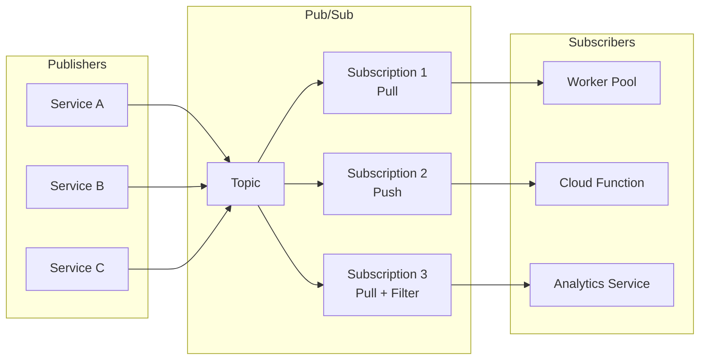
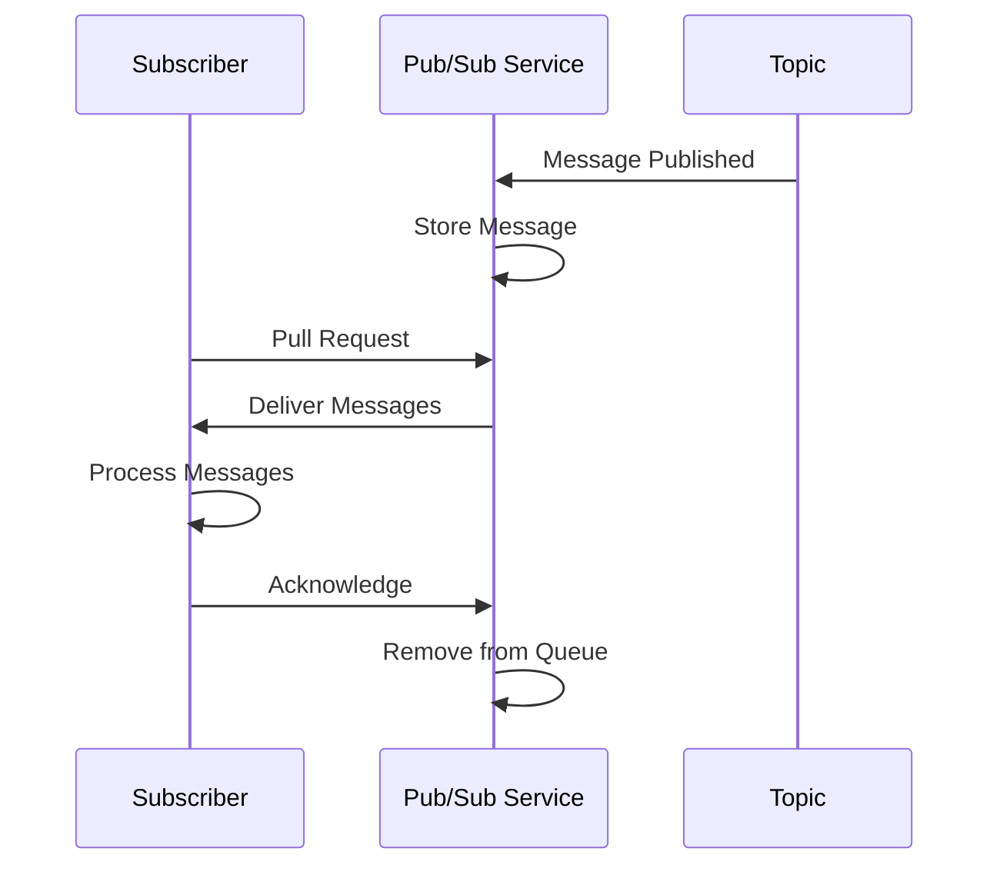
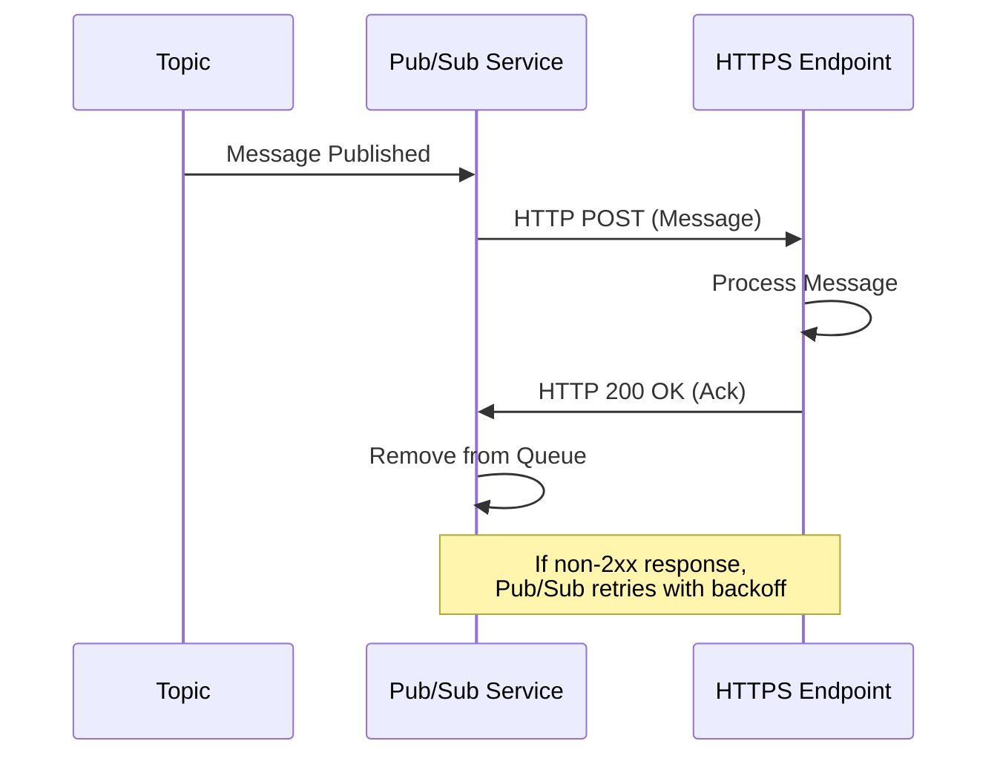
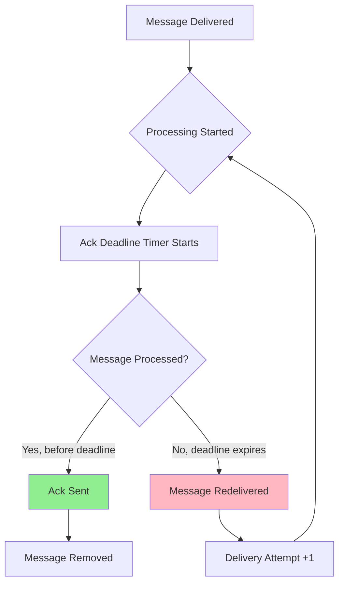
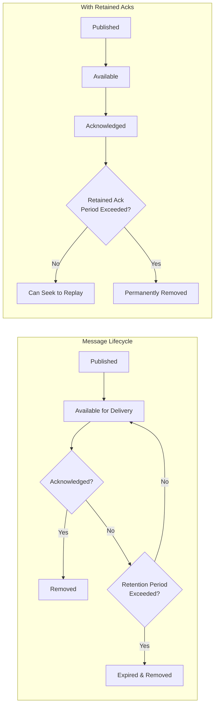
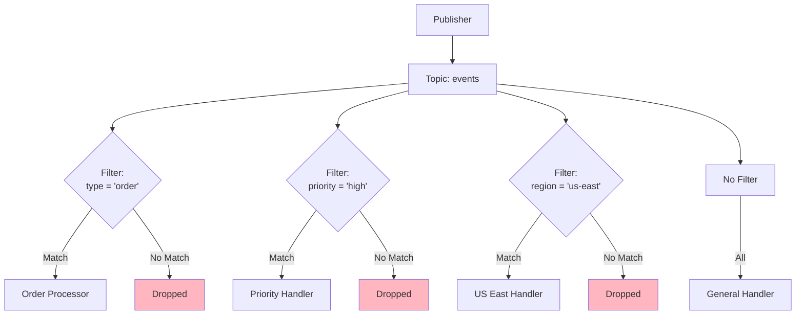
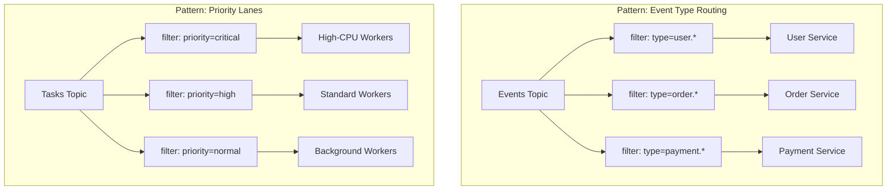
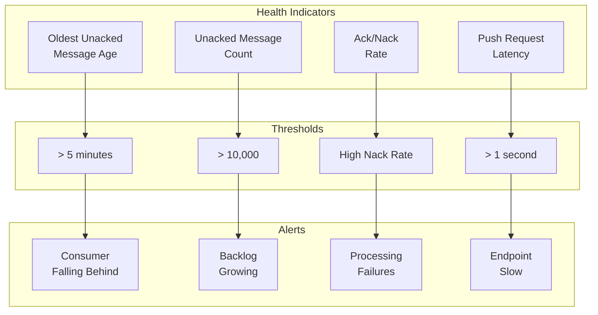

# How to Configure Pub/Sub Subscriptions

Author: [nawazdhandala](https://github.com/nawazdhandala)

Tags: Pub/Sub, Google Cloud, Messaging, Event-Driven Architecture, Subscriptions, Cloud Infrastructure, Distributed Systems

Description: A comprehensive guide to configuring Pub/Sub subscriptions including pull vs push delivery, acknowledgment deadlines, message retention, and filtering for building reliable event-driven systems.

---

> "The art of programming is the art of organizing complexity." - Edsger Dijkstra

Pub/Sub (Publish/Subscribe) is a messaging pattern that decouples services by allowing publishers to send messages without knowing who will receive them, and subscribers to receive messages without knowing who sent them. Google Cloud Pub/Sub is one of the most widely-used implementations, but the concepts apply across platforms like AWS SNS/SQS, Azure Service Bus, and Apache Kafka.

This guide walks through configuring Pub/Sub subscriptions effectively, covering delivery modes, acknowledgment strategies, retention policies, and filtering to build reliable, scalable event-driven architectures.

---

## Understanding Pub/Sub Architecture

Before diving into configuration, let's understand the core components:



**Key Components:**
- **Topic**: A named resource to which messages are sent by publishers
- **Subscription**: A named resource representing the stream of messages from a topic
- **Message**: The data (plus attributes) that moves through the system
- **Publisher**: An application that creates and sends messages to a topic
- **Subscriber**: An application that receives messages from a subscription

---

## Pull vs Push Subscriptions

The delivery mechanism fundamentally affects how your subscriber processes messages. Choose based on your architecture needs.

### Pull Subscriptions

With pull subscriptions, your subscriber explicitly requests messages from the Pub/Sub service. This gives you complete control over message flow and processing rate.



**When to use Pull:**
- You need precise control over processing rate
- Your subscribers have variable capacity
- You want to batch process messages
- Running on-premises or in non-HTTP environments

#### Pull Subscription Configuration (gcloud CLI)

```bash
# Create a pull subscription with recommended settings
gcloud pubsub subscriptions create order-processing-sub \
    --topic=orders \
    --ack-deadline=60 \
    --message-retention-duration=7d \
    --expiration-period=never \
    --enable-message-ordering \
    --dead-letter-topic=orders-dlq \
    --max-delivery-attempts=5

# Parameters explained:
# --ack-deadline: Time (in seconds) Pub/Sub waits for acknowledgment
# --message-retention-duration: How long unacknowledged messages are retained
# --expiration-period: Subscription deletion after inactivity (never = don't delete)
# --enable-message-ordering: Deliver messages in order (requires ordering key)
# --dead-letter-topic: Topic for messages that fail delivery
# --max-delivery-attempts: Attempts before sending to dead letter topic
```

#### Pull Subscriber (Node.js)

```javascript
// pull-subscriber.js
// A robust pull subscriber with error handling and graceful shutdown

const { PubSub } = require('@google-cloud/pubsub');

// Initialize the Pub/Sub client
// Credentials are automatically loaded from GOOGLE_APPLICATION_CREDENTIALS
const pubsub = new PubSub({
  projectId: process.env.GCP_PROJECT_ID,
});

const subscriptionName = 'order-processing-sub';
const subscription = pubsub.subscription(subscriptionName, {
  // Flow control settings prevent overwhelming your subscriber
  flowControl: {
    maxMessages: 100,        // Max messages to process concurrently
    allowExcessMessages: false, // Don't exceed maxMessages
  },
  // Stream settings for connection management
  streamingOptions: {
    maxStreams: 4, // Number of streaming pull connections
  },
});

// Track in-flight messages for graceful shutdown
let messageCount = 0;
let isShuttingDown = false;

// Message handler function
const messageHandler = async (message) => {
  if (isShuttingDown) {
    // During shutdown, nack messages so they're redelivered
    message.nack();
    return;
  }

  messageCount++;

  try {
    // Parse message data (assumes JSON payload)
    const data = JSON.parse(message.data.toString());

    console.log(`Processing message ${message.id}:`, {
      orderId: data.orderId,
      publishTime: message.publishTime,
      attributes: message.attributes,
      deliveryAttempt: message.deliveryAttempt,
    });

    // Your business logic here
    await processOrder(data);

    // Acknowledge successful processing
    // This removes the message from the subscription
    message.ack();
    console.log(`Message ${message.id} acknowledged`);

  } catch (error) {
    console.error(`Error processing message ${message.id}:`, error);

    // Nack the message to trigger redelivery
    // Consider the delivery attempt count for dead-lettering
    if (message.deliveryAttempt >= 3) {
      console.log(`Message ${message.id} exceeded retry threshold, will be dead-lettered`);
    }
    message.nack();
  } finally {
    messageCount--;
  }
};

// Error handler for subscription-level errors
const errorHandler = (error) => {
  console.error('Subscription error:', error);
  // Implement alerting/monitoring here
  // The client library will automatically reconnect
};

// Start listening for messages
subscription.on('message', messageHandler);
subscription.on('error', errorHandler);

console.log(`Listening for messages on ${subscriptionName}...`);

// Graceful shutdown handler
const shutdown = async () => {
  console.log('Shutdown signal received...');
  isShuttingDown = true;

  // Stop receiving new messages
  subscription.removeListener('message', messageHandler);

  // Wait for in-flight messages to complete (with timeout)
  const shutdownTimeout = 30000; // 30 seconds
  const startTime = Date.now();

  while (messageCount > 0 && Date.now() - startTime < shutdownTimeout) {
    console.log(`Waiting for ${messageCount} messages to complete...`);
    await new Promise(resolve => setTimeout(resolve, 1000));
  }

  // Close the subscription
  await subscription.close();
  console.log('Subscriber shut down gracefully');
  process.exit(0);
};

process.on('SIGTERM', shutdown);
process.on('SIGINT', shutdown);

// Placeholder for your business logic
async function processOrder(data) {
  // Simulate processing time
  await new Promise(resolve => setTimeout(resolve, 100));
  // Actual order processing logic would go here
}
```

### Push Subscriptions

With push subscriptions, Pub/Sub delivers messages to your HTTP endpoint. This is ideal for serverless architectures and when you want Pub/Sub to manage delivery.



**When to use Push:**
- Serverless functions (Cloud Functions, Cloud Run)
- You have a public HTTPS endpoint
- You want automatic scaling based on message volume
- Simpler subscriber implementation is preferred

#### Push Subscription Configuration (gcloud CLI)

```bash
# Create a push subscription with authentication
gcloud pubsub subscriptions create order-webhook-sub \
    --topic=orders \
    --push-endpoint=https://api.example.com/webhooks/orders \
    --push-auth-service-account=pubsub-invoker@project-id.iam.gserviceaccount.com \
    --ack-deadline=30 \
    --message-retention-duration=1d \
    --min-retry-delay=10s \
    --max-retry-delay=600s

# Parameters explained:
# --push-endpoint: Your HTTPS endpoint that receives messages
# --push-auth-service-account: Service account for JWT authentication
# --min-retry-delay: Minimum backoff for retries (default 10s)
# --max-retry-delay: Maximum backoff cap (default 600s)
```

#### Push Endpoint Handler (Express.js)

```javascript
// push-endpoint.js
// Express.js handler for Pub/Sub push subscriptions with authentication

const express = require('express');
const { OAuth2Client } = require('google-auth-library');

const app = express();

// Parse JSON bodies with raw body access for signature verification
app.use(express.json({
  verify: (req, res, buf) => {
    req.rawBody = buf;
  }
}));

// Initialize OAuth2 client for token verification
const authClient = new OAuth2Client();

// Expected audience (your endpoint URL)
const EXPECTED_AUDIENCE = process.env.PUSH_ENDPOINT_URL;

// Service account email that should be signing the tokens
const EXPECTED_SERVICE_ACCOUNT = process.env.PUBSUB_SERVICE_ACCOUNT;

// Middleware to verify Pub/Sub push authentication
const verifyPubSubToken = async (req, res, next) => {
  try {
    // Extract the bearer token from Authorization header
    const authHeader = req.headers.authorization;
    if (!authHeader || !authHeader.startsWith('Bearer ')) {
      console.error('Missing or invalid Authorization header');
      return res.status(401).send('Unauthorized');
    }

    const token = authHeader.split(' ')[1];

    // Verify the token with Google's OAuth2 client
    const ticket = await authClient.verifyIdToken({
      idToken: token,
      audience: EXPECTED_AUDIENCE,
    });

    const payload = ticket.getPayload();

    // Verify the token was issued for our service account
    if (payload.email !== EXPECTED_SERVICE_ACCOUNT) {
      console.error(`Unexpected service account: ${payload.email}`);
      return res.status(403).send('Forbidden');
    }

    // Token is valid, continue processing
    req.pubsubAuth = payload;
    next();

  } catch (error) {
    console.error('Token verification failed:', error.message);
    return res.status(401).send('Unauthorized');
  }
};

// Pub/Sub push endpoint
app.post('/webhooks/orders', verifyPubSubToken, async (req, res) => {
  // Extract message from Pub/Sub wrapper format
  const pubsubMessage = req.body.message;

  if (!pubsubMessage) {
    console.error('Invalid Pub/Sub message format');
    // Return 400 to indicate bad request (won't be retried)
    return res.status(400).send('Bad Request: No message');
  }

  try {
    // Decode the base64-encoded message data
    const messageData = Buffer.from(pubsubMessage.data, 'base64').toString();
    const data = JSON.parse(messageData);

    console.log('Received order:', {
      messageId: pubsubMessage.messageId,
      publishTime: pubsubMessage.publishTime,
      orderId: data.orderId,
      attributes: pubsubMessage.attributes,
    });

    // Process the order
    await processOrder(data);

    // Return 200-299 to acknowledge the message
    // This tells Pub/Sub to remove it from the subscription
    res.status(200).send('OK');

  } catch (error) {
    console.error('Error processing message:', error);

    // Return 500 to trigger retry with exponential backoff
    // Pub/Sub will retry based on subscription retry policy
    res.status(500).send('Processing failed');
  }
});

// Health check endpoint (don't apply auth middleware)
app.get('/health', (req, res) => {
  res.status(200).send('Healthy');
});

const PORT = process.env.PORT || 8080;
app.listen(PORT, () => {
  console.log(`Push endpoint listening on port ${PORT}`);
});

async function processOrder(data) {
  // Your order processing logic here
  console.log(`Processing order ${data.orderId}...`);
}
```

### Comparison Summary

| Feature | Pull | Push |
|---------|------|------|
| Control over throughput | Full control | Pub/Sub controlled |
| Scaling | Manual | Automatic |
| Network requirements | Outbound only | Inbound HTTPS |
| Best for | Batch processing, variable load | Serverless, real-time |
| Complexity | More code | Less code |
| Long-running processing | Well-suited | Limited by ack deadline |

---

## Acknowledgment Deadlines

The acknowledgment deadline is critical for reliable message processing. It determines how long Pub/Sub waits before redelivering a message.



### Configuring Ack Deadlines

```bash
# Set acknowledgment deadline when creating subscription
gcloud pubsub subscriptions create batch-processor-sub \
    --topic=events \
    --ack-deadline=120  # 120 seconds (range: 10-600)

# Update existing subscription's ack deadline
gcloud pubsub subscriptions update batch-processor-sub \
    --ack-deadline=300  # Increase to 5 minutes
```

### Dynamic Deadline Extension (Node.js)

For long-running processing, extend the deadline dynamically to prevent redelivery:

```javascript
// deadline-extension.js
// Demonstrates extending ack deadline for long-running operations

const { PubSub } = require('@google-cloud/pubsub');

const pubsub = new PubSub();
const subscription = pubsub.subscription('batch-processor-sub');

const messageHandler = async (message) => {
  console.log(`Starting processing for message ${message.id}`);

  // Track the deadline extension interval
  let extensionInterval;

  try {
    // Start extending the deadline periodically
    // Extend every 30 seconds to stay well within the 120-second deadline
    extensionInterval = setInterval(() => {
      // modifyAckDeadline extends the deadline from now
      // Setting to 120 gives another 120 seconds from this moment
      message.modifyAckDeadline(120);
      console.log(`Extended deadline for message ${message.id}`);
    }, 30000); // Every 30 seconds

    // Simulate long-running processing (e.g., video transcoding, ML inference)
    await longRunningOperation(message);

    // Processing complete, acknowledge
    message.ack();
    console.log(`Successfully processed message ${message.id}`);

  } catch (error) {
    console.error(`Failed to process message ${message.id}:`, error);
    // Nack to trigger redelivery
    message.nack();

  } finally {
    // Always clean up the interval
    if (extensionInterval) {
      clearInterval(extensionInterval);
    }
  }
};

subscription.on('message', messageHandler);

async function longRunningOperation(message) {
  // Simulate 3-minute processing time
  const processingTime = 180000; // 3 minutes
  const data = JSON.parse(message.data.toString());

  console.log(`Processing ${data.type} - estimated time: ${processingTime / 1000}s`);

  // In reality, this would be your actual processing logic
  await new Promise(resolve => setTimeout(resolve, processingTime));
}
```

### Best Practices for Ack Deadlines

1. **Set deadline based on p99 processing time** - Account for worst-case scenarios
2. **Use deadline extension for variable workloads** - Don't set excessively long static deadlines
3. **Monitor ack deadline exceeded metrics** - High rates indicate deadline is too short
4. **Consider exactly-once delivery** - When duplicate processing is costly

```javascript
// exactly-once-processing.js
// Enable exactly-once delivery for critical operations

const subscription = pubsub.subscription('critical-payments-sub', {
  // Enable exactly-once delivery semantics
  enableExactlyOnceDelivery: true,
});

const messageHandler = async (message) => {
  try {
    await processPayment(message);

    // With exactly-once enabled, ack is guaranteed to succeed
    // or return an error if the ack fails
    const ackResponse = await message.ackWithResponse();

    if (ackResponse === 'SUCCESS') {
      console.log(`Message ${message.id} acknowledged successfully`);
    }
  } catch (error) {
    if (error.code === 'FAILED_PRECONDITION') {
      // Another subscriber already acknowledged this message
      console.log(`Message ${message.id} was already processed`);
    } else {
      message.nack();
    }
  }
};
```

---

## Message Retention

Message retention determines how long unacknowledged messages are kept and whether you can replay historical messages.



### Configuring Retention

```bash
# Create subscription with extended retention
gcloud pubsub subscriptions create audit-log-sub \
    --topic=audit-events \
    --message-retention-duration=7d \
    --retain-acked-messages \
    --expiration-period=never

# Parameters explained:
# --message-retention-duration: Keep unacked messages (min 10m, max 7d)
# --retain-acked-messages: Also retain messages after acknowledgment
# --expiration-period: Subscription lifetime (never = permanent)
```

### Seeking to Replay Messages

One of the most powerful features of retained messages is the ability to replay them:

```bash
# Seek to a specific timestamp to replay messages
gcloud pubsub subscriptions seek audit-log-sub \
    --time="2024-01-15T10:00:00Z"

# Seek to a snapshot (point-in-time backup of ack state)
gcloud pubsub subscriptions seek audit-log-sub \
    --snapshot=audit-log-snapshot-20240115
```

```javascript
// snapshot-management.js
// Create and manage subscription snapshots for replay capability

const { PubSub } = require('@google-cloud/pubsub');

const pubsub = new PubSub();

async function createSnapshot(subscriptionName, snapshotName) {
  // Create a snapshot of the current ack state
  // This allows seeking back to this point later
  const [snapshot] = await pubsub
    .subscription(subscriptionName)
    .createSnapshot(snapshotName);

  console.log(`Snapshot ${snapshotName} created at ${new Date().toISOString()}`);
  return snapshot;
}

async function seekToSnapshot(subscriptionName, snapshotName) {
  // Seek subscription to a previous snapshot
  // All messages after the snapshot will be redelivered
  await pubsub
    .subscription(subscriptionName)
    .seek(snapshotName);

  console.log(`Subscription ${subscriptionName} seeked to snapshot ${snapshotName}`);
}

async function seekToTimestamp(subscriptionName, timestamp) {
  // Seek to a specific point in time
  // Messages published after this time will be redelivered
  await pubsub
    .subscription(subscriptionName)
    .seek(timestamp);

  console.log(`Subscription ${subscriptionName} seeked to ${timestamp.toISOString()}`);
}

// Example: Daily snapshot for disaster recovery
async function dailySnapshotJob() {
  const subscriptions = ['orders-sub', 'payments-sub', 'inventory-sub'];
  const dateStr = new Date().toISOString().split('T')[0]; // YYYY-MM-DD

  for (const sub of subscriptions) {
    const snapshotName = `${sub}-snapshot-${dateStr}`;
    await createSnapshot(sub, snapshotName);
  }

  // Clean up snapshots older than 7 days
  const [snapshots] = await pubsub.getSnapshots();
  const sevenDaysAgo = new Date(Date.now() - 7 * 24 * 60 * 60 * 1000);

  for (const snapshot of snapshots) {
    const snapshotDate = snapshot.metadata?.createTime;
    if (snapshotDate && new Date(snapshotDate) < sevenDaysAgo) {
      await snapshot.delete();
      console.log(`Deleted old snapshot: ${snapshot.name}`);
    }
  }
}
```

### Retention Best Practices

| Use Case | Message Retention | Retain Acked | Snapshot Frequency |
|----------|------------------|--------------|-------------------|
| Real-time processing | 1 hour | No | None |
| Order processing | 24 hours | No | None |
| Audit logs | 7 days | Yes | Daily |
| Compliance/replay | 7 days | Yes | Hourly |

---

## Filtering Subscriptions

Subscription filters allow you to receive only messages that match specific criteria, reducing processing overhead and costs.



### Creating Filtered Subscriptions

```bash
# Filter by message attribute - exact match
gcloud pubsub subscriptions create high-priority-orders-sub \
    --topic=orders \
    --message-filter='attributes.priority = "high"'

# Filter with multiple conditions (AND)
gcloud pubsub subscriptions create us-premium-orders-sub \
    --topic=orders \
    --message-filter='attributes.region = "us-east" AND attributes.tier = "premium"'

# Filter with OR conditions
gcloud pubsub subscriptions create urgent-orders-sub \
    --topic=orders \
    --message-filter='attributes.priority = "high" OR attributes.priority = "critical"'

# Filter using hasPrefix for pattern matching
gcloud pubsub subscriptions create api-events-sub \
    --topic=events \
    --message-filter='hasPrefix(attributes.source, "api-")'

# Negation filter
gcloud pubsub subscriptions create non-test-orders-sub \
    --topic=orders \
    --message-filter='NOT attributes.environment = "test"'
```

### Publishing Messages with Filter Attributes

```javascript
// publisher-with-attributes.js
// Publish messages with attributes for subscription filtering

const { PubSub } = require('@google-cloud/pubsub');

const pubsub = new PubSub();
const topic = pubsub.topic('orders');

async function publishOrder(order) {
  // Define attributes that subscriptions can filter on
  // Attributes must be strings (not numbers or booleans)
  const attributes = {
    priority: order.expedited ? 'high' : 'normal',
    region: order.shippingAddress.region,
    tier: order.customer.tier,
    orderType: order.type,
    source: 'api-checkout',
  };

  // Prepare the message
  const messageData = JSON.stringify(order);

  // Publish with attributes
  const messageId = await topic.publishMessage({
    data: Buffer.from(messageData),
    attributes: attributes,
  });

  console.log(`Published order ${order.id} with messageId: ${messageId}`);
  console.log('Attributes:', attributes);

  return messageId;
}

// Example orders that will route to different subscriptions
async function publishTestOrders() {
  // This will match: high-priority-orders-sub, us-premium-orders-sub
  await publishOrder({
    id: 'ORD-001',
    expedited: true,
    type: 'standard',
    customer: { tier: 'premium', id: 'CUST-123' },
    shippingAddress: { region: 'us-east' },
    items: [{ sku: 'ITEM-1', qty: 2 }],
  });

  // This will match: non-test-orders-sub only (normal priority, no region match)
  await publishOrder({
    id: 'ORD-002',
    expedited: false,
    type: 'subscription',
    customer: { tier: 'basic', id: 'CUST-456' },
    shippingAddress: { region: 'eu-west' },
    items: [{ sku: 'ITEM-2', qty: 1 }],
  });
}
```

### Filter Syntax Reference

```javascript
// filter-examples.js
// Comprehensive filter syntax examples for reference

const filterExamples = {
  // Exact attribute match
  exactMatch: 'attributes.eventType = "user.created"',

  // Not equal
  notEqual: 'attributes.environment != "production"',

  // Check if attribute exists
  hasAttribute: 'attributes:priority',

  // Check if attribute doesn't exist
  noAttribute: 'NOT attributes:debugMode',

  // Prefix matching
  prefixMatch: 'hasPrefix(attributes.userId, "premium-")',

  // AND combination (both must be true)
  andCombination: 'attributes.type = "order" AND attributes.status = "pending"',

  // OR combination (either can be true)
  orCombination: 'attributes.priority = "high" OR attributes.priority = "urgent"',

  // Complex nested conditions
  complexFilter: `
    (attributes.type = "payment" AND attributes.amount > "1000")
    OR
    (attributes.type = "refund" AND attributes:manualReview)
  `.replace(/\s+/g, ' ').trim(),

  // Note: Numeric comparisons treat values as strings
  // "100" > "1000" evaluates to true (lexicographic)
  // For numeric filtering, use padded strings: "00100", "01000"
};

// Filter limitations to be aware of:
// 1. Filters only work on attributes, not message body
// 2. Maximum filter length: 4096 characters
// 3. Attribute values must be strings
// 4. Numeric comparisons are lexicographic (string-based)
// 5. Filters cannot be updated - must recreate subscription
```

### Filter Design Patterns



---

## Dead Letter Topics

Configure dead letter topics to handle messages that repeatedly fail processing:

```bash
# Create the dead letter topic first
gcloud pubsub topics create orders-dlq

# Create subscription for the dead letter topic
gcloud pubsub subscriptions create orders-dlq-sub \
    --topic=orders-dlq \
    --message-retention-duration=7d

# Create main subscription with dead letter policy
gcloud pubsub subscriptions create orders-sub \
    --topic=orders \
    --dead-letter-topic=orders-dlq \
    --max-delivery-attempts=5
```

```javascript
// dead-letter-processor.js
// Process messages from dead letter queue for investigation/retry

const { PubSub } = require('@google-cloud/pubsub');
const { BigQuery } = require('@google-cloud/bigquery');

const pubsub = new PubSub();
const bigquery = new BigQuery();

const dlqSubscription = pubsub.subscription('orders-dlq-sub');

const dlqMessageHandler = async (message) => {
  try {
    const data = JSON.parse(message.data.toString());

    // Extract delivery metadata
    const dlqInfo = {
      originalMessageId: message.attributes.CloudPubSubDeadLetterSourceMessageId,
      originalSubscription: message.attributes.CloudPubSubDeadLetterSourceSubscription,
      deliveryAttempts: message.attributes.CloudPubSubDeadLetterSourceDeliveryCount,
      deadLetteredAt: new Date().toISOString(),
      messageData: data,
    };

    console.log('Dead letter message received:', dlqInfo);

    // Store in BigQuery for analysis
    await bigquery
      .dataset('pubsub_dlq')
      .table('failed_messages')
      .insert([{
        message_id: dlqInfo.originalMessageId,
        subscription: dlqInfo.originalSubscription,
        delivery_attempts: parseInt(dlqInfo.deliveryAttempts),
        dead_lettered_at: dlqInfo.deadLetteredAt,
        payload: JSON.stringify(data),
      }]);

    // Attempt to diagnose the failure
    const diagnosis = await diagnoseFailure(data);

    if (diagnosis.canRetry) {
      // Republish to original topic with fix applied
      console.log(`Republishing message with fix: ${diagnosis.fix}`);
      await pubsub.topic('orders').publishMessage({
        data: Buffer.from(JSON.stringify(diagnosis.fixedData)),
        attributes: {
          ...message.attributes,
          retryFromDlq: 'true',
          dlqFix: diagnosis.fix,
        },
      });
    } else {
      // Log for manual intervention
      console.error(`Message requires manual intervention: ${diagnosis.reason}`);
      // Send alert to operations team
      await sendAlert(dlqInfo, diagnosis);
    }

    message.ack();

  } catch (error) {
    console.error('Error processing DLQ message:', error);
    // Nack to retry DLQ processing
    message.nack();
  }
};

dlqSubscription.on('message', dlqMessageHandler);

async function diagnoseFailure(data) {
  // Common failure patterns and fixes
  if (!data.customerId) {
    return {
      canRetry: false,
      reason: 'Missing customerId - data integrity issue',
    };
  }

  if (data.amount && typeof data.amount === 'string') {
    return {
      canRetry: true,
      fix: 'Converted amount from string to number',
      fixedData: { ...data, amount: parseFloat(data.amount) },
    };
  }

  return {
    canRetry: false,
    reason: 'Unknown failure cause',
  };
}

async function sendAlert(dlqInfo, diagnosis) {
  // Integration with your alerting system (PagerDuty, Slack, etc.)
  console.log('ALERT: DLQ message requires attention', { dlqInfo, diagnosis });
}
```

---

## Infrastructure as Code (Terraform)

Define your Pub/Sub infrastructure declaratively:

```hcl
# pubsub.tf
# Terraform configuration for Pub/Sub topics and subscriptions

terraform {
  required_providers {
    google = {
      source  = "hashicorp/google"
      version = "~> 5.0"
    }
  }
}

# Variables for configuration
variable "project_id" {
  description = "GCP project ID"
  type        = string
}

variable "environment" {
  description = "Environment name (dev, staging, prod)"
  type        = string
  default     = "dev"
}

# Main orders topic
resource "google_pubsub_topic" "orders" {
  name    = "orders-${var.environment}"
  project = var.project_id

  # Message retention at topic level (for replay)
  message_retention_duration = "604800s"  # 7 days

  labels = {
    environment = var.environment
    team        = "platform"
  }
}

# Dead letter topic
resource "google_pubsub_topic" "orders_dlq" {
  name    = "orders-dlq-${var.environment}"
  project = var.project_id

  labels = {
    environment = var.environment
    type        = "dead-letter"
  }
}

# Main pull subscription
resource "google_pubsub_subscription" "orders_processor" {
  name    = "orders-processor-${var.environment}"
  topic   = google_pubsub_topic.orders.name
  project = var.project_id

  # Acknowledgment deadline: 60 seconds
  ack_deadline_seconds = 60

  # Retain unacked messages for 24 hours
  message_retention_duration = "86400s"

  # Keep acknowledged messages for replay
  retain_acked_messages = true

  # Never auto-delete this subscription
  expiration_policy {
    ttl = ""  # Empty string means never expire
  }

  # Enable exactly-once delivery for critical processing
  enable_exactly_once_delivery = var.environment == "prod" ? true : false

  # Dead letter policy
  dead_letter_policy {
    dead_letter_topic     = google_pubsub_topic.orders_dlq.id
    max_delivery_attempts = 5
  }

  # Retry policy for failed deliveries
  retry_policy {
    minimum_backoff = "10s"
    maximum_backoff = "600s"
  }

  labels = {
    environment = var.environment
    type        = "pull"
  }
}

# Push subscription for webhooks
resource "google_pubsub_subscription" "orders_webhook" {
  name    = "orders-webhook-${var.environment}"
  topic   = google_pubsub_topic.orders.name
  project = var.project_id

  ack_deadline_seconds       = 30
  message_retention_duration = "3600s"  # 1 hour

  push_config {
    push_endpoint = "https://api.${var.environment}.example.com/webhooks/orders"

    # OIDC token for authentication
    oidc_token {
      service_account_email = google_service_account.pubsub_invoker.email
      audience              = "https://api.${var.environment}.example.com"
    }

    # Custom attributes to add to each request
    attributes = {
      x-custom-header = "pubsub-push"
    }
  }

  retry_policy {
    minimum_backoff = "10s"
    maximum_backoff = "300s"
  }

  labels = {
    environment = var.environment
    type        = "push"
  }
}

# Filtered subscription for high-priority orders
resource "google_pubsub_subscription" "orders_priority" {
  name    = "orders-priority-${var.environment}"
  topic   = google_pubsub_topic.orders.name
  project = var.project_id

  ack_deadline_seconds = 30

  # Filter for high-priority orders only
  filter = "attributes.priority = \"high\" OR attributes.priority = \"critical\""

  labels = {
    environment = var.environment
    type        = "filtered"
  }
}

# DLQ subscription
resource "google_pubsub_subscription" "orders_dlq" {
  name    = "orders-dlq-processor-${var.environment}"
  topic   = google_pubsub_topic.orders_dlq.name
  project = var.project_id

  ack_deadline_seconds       = 120
  message_retention_duration = "604800s"  # 7 days
  retain_acked_messages      = true

  labels = {
    environment = var.environment
    type        = "dead-letter"
  }
}

# Service account for push subscriptions
resource "google_service_account" "pubsub_invoker" {
  account_id   = "pubsub-invoker-${var.environment}"
  display_name = "Pub/Sub Push Invoker"
  project      = var.project_id
}

# Output the subscription names
output "subscriptions" {
  value = {
    processor = google_pubsub_subscription.orders_processor.name
    webhook   = google_pubsub_subscription.orders_webhook.name
    priority  = google_pubsub_subscription.orders_priority.name
    dlq       = google_pubsub_subscription.orders_dlq.name
  }
}
```

---

## Monitoring Pub/Sub Subscriptions

Effective monitoring is essential for maintaining healthy Pub/Sub systems. Track these key metrics:



For comprehensive monitoring of your Pub/Sub infrastructure, consider using [OneUptime](https://oneuptime.com). OneUptime provides real-time alerting, detailed metrics dashboards, and incident management specifically designed for cloud-native architectures. With OneUptime, you can:

- Set up custom alerts for subscription backlog growth
- Monitor message processing latency across all subscriptions
- Track dead letter queue activity
- Correlate Pub/Sub issues with application performance
- Create status pages for your event-driven services

### Key Metrics to Monitor

```bash
# View subscription metrics using gcloud
gcloud monitoring metrics list --filter="metric.type:pubsub"

# Key metrics to track:
# - pubsub.googleapis.com/subscription/oldest_unacked_message_age
# - pubsub.googleapis.com/subscription/num_undelivered_messages
# - pubsub.googleapis.com/subscription/ack_message_count
# - pubsub.googleapis.com/subscription/nack_message_count
# - pubsub.googleapis.com/subscription/dead_letter_message_count
```

---

## Summary

Configuring Pub/Sub subscriptions effectively requires understanding:

1. **Pull vs Push**: Choose pull for control and batch processing; push for serverless and simplicity
2. **Acknowledgment Deadlines**: Set based on p99 processing time; use deadline extension for long operations
3. **Message Retention**: Enable for replay capability and disaster recovery; create snapshots for point-in-time recovery
4. **Filtering**: Route messages efficiently to specialized subscribers; design attributes for filterability
5. **Dead Letter Topics**: Always configure for production subscriptions to capture failed messages

By applying these patterns, you'll build resilient event-driven systems that can handle failures gracefully while maintaining visibility into message flow.

---

**Related Reading:**
- [Traces and Spans in OpenTelemetry](https://oneuptime.com/blog/post/2025-08-27-traces-and-spans-in-opentelemetry/view)
- [How to Reduce Noise in OpenTelemetry](https://oneuptime.com/blog/post/2025-08-25-how-to-reduce-noise-in-opentelemetry/view)
- [Three Pillars of Observability](https://oneuptime.com/blog/post/2025-08-20-three-pillars-of-observability-logs-metrics-traces/view)
