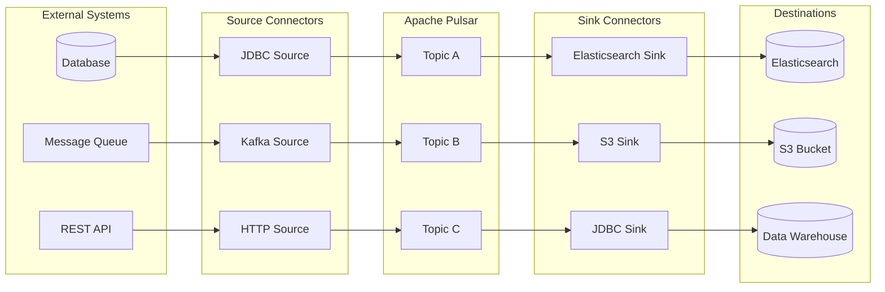
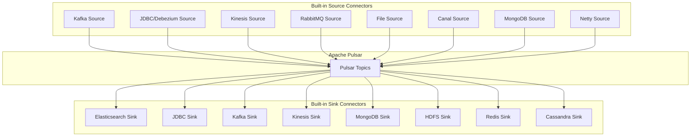
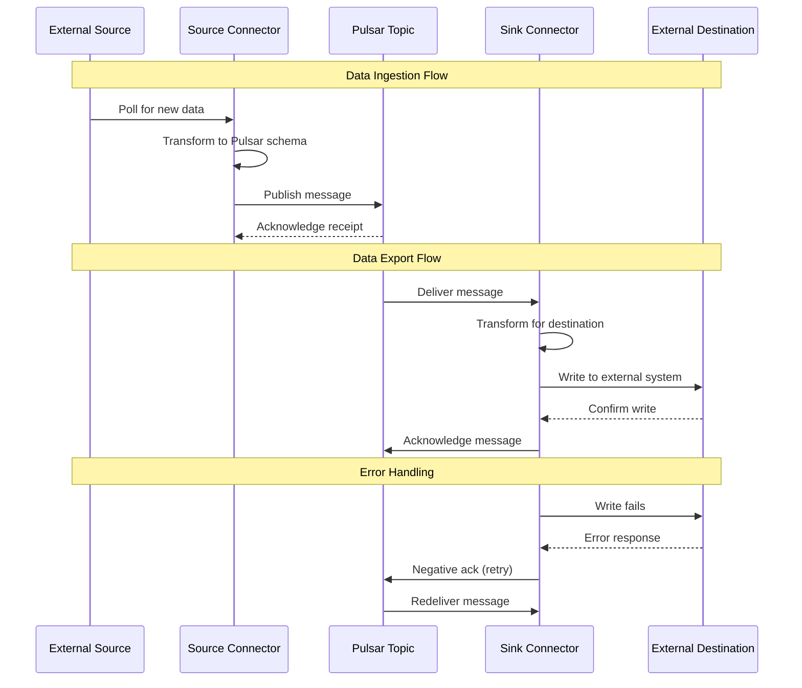

# How to Use Pulsar IO Connectors

By [Nawaz Dhandala](https://github.com/nawazdhandala)

Tags: Apache Pulsar, Messaging, Connectors, Data Integration, Event Streaming, Source Connectors, Sink Connectors, Real-Time Data

Description: A comprehensive guide to Apache Pulsar IO Connectors - learn how to use built-in connectors, configure source and sink connectors, build custom connectors, and integrate Pulsar with external systems for seamless data flow.

---

> "Data is only as valuable as its ability to flow freely between systems. Pulsar IO Connectors are the bridges that make this possible." - Apache Pulsar Community

Apache Pulsar IO Connectors provide a framework for moving data in and out of Pulsar. Whether you need to ingest data from databases, message queues, or cloud services into Pulsar topics, or export Pulsar messages to external storage systems, IO Connectors make it simple and scalable.

This guide covers everything you need to know about Pulsar IO Connectors - from understanding the architecture to building your own custom connectors.

---

## Understanding Source vs Sink Connectors

Pulsar IO Connectors come in two flavors: **Source Connectors** and **Sink Connectors**. Understanding the difference is crucial for designing your data pipelines.



### Source Connectors

Source connectors **pull data from external systems** and publish it to Pulsar topics. They act as producers that continuously ingest data into your Pulsar cluster.

```java
// Source connector data flow conceptually
// External System -> Source Connector -> Pulsar Topic

// Example: A JDBC source connector reads database changes
// and publishes them to a Pulsar topic
public class JdbcSourceConnector implements Source<byte[]> {

    private Connection connection;
    private String tableName;
    private String lastOffset;

    @Override
    public void open(Map<String, Object> config, SourceContext sourceContext) {
        // Initialize database connection from config
        String jdbcUrl = (String) config.get("jdbcUrl");
        String username = (String) config.get("username");
        String password = (String) config.get("password");
        this.tableName = (String) config.get("tableName");

        // Establish connection to the source database
        this.connection = DriverManager.getConnection(jdbcUrl, username, password);
    }

    @Override
    public Record<byte[]> read() throws Exception {
        // Query for new records since last offset
        // Each record read becomes a Pulsar message
        PreparedStatement stmt = connection.prepareStatement(
            "SELECT * FROM " + tableName + " WHERE id > ? ORDER BY id LIMIT 100"
        );
        stmt.setString(1, lastOffset);

        ResultSet rs = stmt.executeQuery();
        if (rs.next()) {
            // Convert row to bytes and return as Record
            byte[] data = convertRowToBytes(rs);
            lastOffset = rs.getString("id");
            return new SourceRecord<>(data, lastOffset);
        }
        return null; // No new data available
    }

    @Override
    public void close() {
        // Clean up database connection
        if (connection != null) {
            connection.close();
        }
    }
}
```

### Sink Connectors

Sink connectors **consume messages from Pulsar topics** and write them to external systems. They act as consumers that continuously export data from your Pulsar cluster.

```java
// Sink connector data flow conceptually
// Pulsar Topic -> Sink Connector -> External System

// Example: An Elasticsearch sink connector reads from a Pulsar topic
// and indexes documents into Elasticsearch
public class ElasticsearchSinkConnector implements Sink<byte[]> {

    private RestHighLevelClient elasticClient;
    private String indexName;

    @Override
    public void open(Map<String, Object> config, SinkContext sinkContext) {
        // Initialize Elasticsearch client from config
        String elasticUrl = (String) config.get("elasticSearchUrl");
        this.indexName = (String) config.get("indexName");

        // Create Elasticsearch REST client
        this.elasticClient = new RestHighLevelClient(
            RestClient.builder(HttpHost.create(elasticUrl))
        );
    }

    @Override
    public void write(Record<byte[]> record) throws Exception {
        // Each Pulsar message is written to Elasticsearch
        byte[] data = record.getValue();

        // Create index request with the message data
        IndexRequest request = new IndexRequest(indexName)
            .source(data, XContentType.JSON);

        // Index the document
        elasticClient.index(request, RequestOptions.DEFAULT);

        // Acknowledge the message after successful write
        record.ack();
    }

    @Override
    public void close() {
        // Clean up Elasticsearch client
        if (elasticClient != null) {
            elasticClient.close();
        }
    }
}
```

---

## Built-in Connectors

Apache Pulsar ships with a rich set of built-in connectors for common use cases. Here's an overview of the most popular ones:



### Popular Source Connectors

| Connector | Use Case | Key Features |
|-----------|----------|--------------|
| **Kafka** | Migrate from Kafka or bridge Kafka clusters | Topic mapping, consumer group support |
| **JDBC/Debezium** | Database CDC (Change Data Capture) | Real-time database replication, schema support |
| **Kinesis** | AWS data stream ingestion | Shard management, checkpointing |
| **RabbitMQ** | AMQP message ingestion | Queue binding, exchange support |
| **MongoDB** | NoSQL change streams | Replica set support, resume tokens |
| **File** | Batch file ingestion | Directory watching, file patterns |

### Popular Sink Connectors

| Connector | Use Case | Key Features |
|-----------|----------|--------------|
| **Elasticsearch** | Search and analytics | Bulk indexing, index templates |
| **JDBC** | Relational database writes | Batch inserts, upsert support |
| **Kafka** | Bridge to Kafka consumers | Topic routing, partitioning |
| **HDFS/S3** | Data lake storage | Parquet/Avro formats, partitioning |
| **Redis** | Caching layer | Key mapping, TTL support |
| **Cassandra** | Wide-column store writes | Batch writes, consistency levels |

---

## Connector Configuration

Connectors are configured using YAML files or command-line arguments. Here's how to configure and deploy connectors:

### Deploying a JDBC Source Connector

```yaml
# jdbc-source-config.yaml
# Configuration for ingesting data from PostgreSQL into Pulsar

# Connector metadata
tenant: "public"
namespace: "default"
name: "postgres-users-source"

# Topic where data will be published
topicName: "persistent://public/default/user-changes"

# Archive containing the connector code
archive: "connectors/pulsar-io-jdbc-postgres-3.0.0.nar"

# Parallelism - number of connector instances
parallelism: 1

# Connector-specific configuration
configs:
  # JDBC connection settings
  jdbcUrl: "jdbc:postgresql://postgres-host:5432/mydb"
  userName: "pulsar_connector"
  password: "${secrets:jdbc-password}"  # Reference to Pulsar secret

  # Table and query configuration
  tableName: "users"

  # Polling configuration
  # How often to check for new records (in milliseconds)
  batchSize: 100
  mode: "incrementing"
  incrementingColumnName: "id"

  # Timestamp mode for CDC-like behavior
  timestampColumnName: "updated_at"

  # Schema configuration
  outputFormat: "json"
```

### Deploying an Elasticsearch Sink Connector

```yaml
# elasticsearch-sink-config.yaml
# Configuration for indexing Pulsar messages into Elasticsearch

# Connector metadata
tenant: "public"
namespace: "default"
name: "user-events-elasticsearch-sink"

# Input topics to consume from
inputs:
  - "persistent://public/default/user-events"
  - "persistent://public/default/user-activity"

# Archive containing the connector code
archive: "connectors/pulsar-io-elastic-search-3.0.0.nar"

# Parallelism - scale out for higher throughput
parallelism: 3

# Processing guarantees
processingGuarantees: "ATLEAST_ONCE"

# Connector-specific configuration
configs:
  # Elasticsearch connection
  elasticSearchUrl: "https://elasticsearch-host:9200"
  username: "elastic"
  password: "${secrets:elastic-password}"

  # Index configuration
  indexName: "user-events"

  # Use message key as document ID for idempotency
  keyIgnore: false

  # Bulk indexing settings for performance
  bulkEnabled: true
  bulkActions: 1000
  bulkSizeInMb: 5
  bulkConcurrentRequests: 2

  # Retry configuration
  maxRetries: 3
  retryBackoffInMs: 1000

  # Schema handling
  schemaEnable: true

  # SSL configuration (if using HTTPS)
  ssl:
    enabled: true
    hostnameVerification: true
```

### Deploying Connectors via CLI

```bash
# Deploy a source connector from a configuration file
# This creates the connector and starts ingesting data
pulsar-admin sources create \
  --source-config-file jdbc-source-config.yaml

# Deploy a sink connector from a configuration file
# This creates the connector and starts exporting data
pulsar-admin sinks create \
  --sink-config-file elasticsearch-sink-config.yaml

# Alternatively, deploy with inline configuration
# Useful for quick testing and automation
pulsar-admin sinks create \
  --tenant public \
  --namespace default \
  --name quick-elasticsearch-sink \
  --sink-type elastic_search \
  --inputs persistent://public/default/events \
  --sink-config '{
    "elasticSearchUrl": "http://localhost:9200",
    "indexName": "events",
    "bulkEnabled": true
  }'

# Check connector status
# Shows running instances, errors, and metrics
pulsar-admin sources status --name postgres-users-source
pulsar-admin sinks status --name user-events-elasticsearch-sink

# Update connector configuration
# Changes take effect after restart
pulsar-admin sinks update \
  --name user-events-elasticsearch-sink \
  --parallelism 5

# Stop and delete connectors
pulsar-admin sources stop --name postgres-users-source
pulsar-admin sinks delete --name user-events-elasticsearch-sink
```

---

## Custom Connector Development

When built-in connectors don't meet your needs, you can build custom connectors. Here's a complete example of building a custom HTTP webhook sink connector:

### Project Structure

```
pulsar-io-webhook/
├── pom.xml
├── src/
│   └── main/
│       └── java/
│           └── com/
│               └── example/
│                   └── pulsar/
│                       └── io/
│                           ├── WebhookSink.java
│                           └── WebhookSinkConfig.java
└── resources/
    └── META-INF/
        └── services/
            └── pulsar-io.yaml
```

### Maven Dependencies (pom.xml)

```xml
<?xml version="1.0" encoding="UTF-8"?>
<project xmlns="http://maven.apache.org/POM/4.0.0"
         xmlns:xsi="http://www.w3.org/2001/XMLSchema-instance"
         xsi:schemaLocation="http://maven.apache.org/POM/4.0.0
                             http://maven.apache.org/xsd/maven-4.0.0.xsd">
    <modelVersion>4.0.0</modelVersion>

    <groupId>com.example</groupId>
    <artifactId>pulsar-io-webhook</artifactId>
    <version>1.0.0</version>
    <packaging>nar</packaging>

    <properties>
        <pulsar.version>3.0.0</pulsar.version>
        <java.version>17</java.version>
    </properties>

    <dependencies>
        <!-- Pulsar IO Core - provides Source and Sink interfaces -->
        <dependency>
            <groupId>org.apache.pulsar</groupId>
            <artifactId>pulsar-io-core</artifactId>
            <version>${pulsar.version}</version>
            <scope>provided</scope>
        </dependency>

        <!-- HTTP client for webhook calls -->
        <dependency>
            <groupId>org.apache.httpcomponents.client5</groupId>
            <artifactId>httpclient5</artifactId>
            <version>5.2.1</version>
        </dependency>

        <!-- JSON processing -->
        <dependency>
            <groupId>com.fasterxml.jackson.core</groupId>
            <artifactId>jackson-databind</artifactId>
            <version>2.15.2</version>
        </dependency>

        <!-- Lombok for boilerplate reduction -->
        <dependency>
            <groupId>org.projectlombok</groupId>
            <artifactId>lombok</artifactId>
            <version>1.18.28</version>
            <scope>provided</scope>
        </dependency>
    </dependencies>

    <build>
        <plugins>
            <!-- NAR plugin for Pulsar connector packaging -->
            <plugin>
                <groupId>org.apache.nifi</groupId>
                <artifactId>nifi-nar-maven-plugin</artifactId>
                <version>1.5.0</version>
                <extensions>true</extensions>
            </plugin>
        </plugins>
    </build>
</project>
```

### Configuration Class

```java
package com.example.pulsar.io;

import lombok.Data;
import lombok.experimental.Accessors;
import org.apache.pulsar.io.core.annotations.FieldDoc;

import java.io.Serializable;
import java.util.Map;

/**
 * Configuration class for the Webhook Sink Connector.
 *
 * This class defines all configurable parameters that users can set
 * when deploying the connector. Lombok @Data generates getters/setters.
 */
@Data
@Accessors(chain = true)
public class WebhookSinkConfig implements Serializable {

    private static final long serialVersionUID = 1L;

    @FieldDoc(
        required = true,
        defaultValue = "",
        help = "The HTTP endpoint URL where messages will be posted"
    )
    private String webhookUrl;

    @FieldDoc(
        required = false,
        defaultValue = "5000",
        help = "Connection timeout in milliseconds"
    )
    private int connectionTimeoutMs = 5000;

    @FieldDoc(
        required = false,
        defaultValue = "30000",
        help = "Request timeout in milliseconds"
    )
    private int requestTimeoutMs = 30000;

    @FieldDoc(
        required = false,
        defaultValue = "3",
        help = "Maximum number of retry attempts on failure"
    )
    private int maxRetries = 3;

    @FieldDoc(
        required = false,
        defaultValue = "1000",
        help = "Initial backoff delay in milliseconds between retries"
    )
    private int retryBackoffMs = 1000;

    @FieldDoc(
        required = false,
        defaultValue = "",
        help = "Optional authorization header value (e.g., 'Bearer token123')"
    )
    private String authorizationHeader;

    @FieldDoc(
        required = false,
        defaultValue = "application/json",
        help = "Content-Type header for webhook requests"
    )
    private String contentType = "application/json";

    @FieldDoc(
        required = false,
        defaultValue = "",
        help = "Additional HTTP headers as key=value pairs, comma-separated"
    )
    private Map<String, String> additionalHeaders;

    /**
     * Factory method to create config from Pulsar's config map.
     * This is called during connector initialization.
     */
    public static WebhookSinkConfig load(Map<String, Object> config) {
        WebhookSinkConfig sinkConfig = new WebhookSinkConfig();

        // Required field
        sinkConfig.setWebhookUrl((String) config.get("webhookUrl"));

        // Optional fields with defaults
        if (config.containsKey("connectionTimeoutMs")) {
            sinkConfig.setConnectionTimeoutMs(
                ((Number) config.get("connectionTimeoutMs")).intValue()
            );
        }

        if (config.containsKey("requestTimeoutMs")) {
            sinkConfig.setRequestTimeoutMs(
                ((Number) config.get("requestTimeoutMs")).intValue()
            );
        }

        if (config.containsKey("maxRetries")) {
            sinkConfig.setMaxRetries(
                ((Number) config.get("maxRetries")).intValue()
            );
        }

        if (config.containsKey("authorizationHeader")) {
            sinkConfig.setAuthorizationHeader(
                (String) config.get("authorizationHeader")
            );
        }

        if (config.containsKey("contentType")) {
            sinkConfig.setContentType((String) config.get("contentType"));
        }

        if (config.containsKey("additionalHeaders")) {
            @SuppressWarnings("unchecked")
            Map<String, String> headers =
                (Map<String, String>) config.get("additionalHeaders");
            sinkConfig.setAdditionalHeaders(headers);
        }

        return sinkConfig;
    }

    /**
     * Validate configuration before connector starts.
     */
    public void validate() {
        if (webhookUrl == null || webhookUrl.isBlank()) {
            throw new IllegalArgumentException(
                "webhookUrl is required and cannot be empty"
            );
        }

        if (!webhookUrl.startsWith("http://") &&
            !webhookUrl.startsWith("https://")) {
            throw new IllegalArgumentException(
                "webhookUrl must start with http:// or https://"
            );
        }

        if (connectionTimeoutMs <= 0) {
            throw new IllegalArgumentException(
                "connectionTimeoutMs must be positive"
            );
        }

        if (maxRetries < 0) {
            throw new IllegalArgumentException(
                "maxRetries cannot be negative"
            );
        }
    }
}
```

### Sink Connector Implementation

```java
package com.example.pulsar.io;

import org.apache.hc.client5.http.classic.methods.HttpPost;
import org.apache.hc.client5.http.config.RequestConfig;
import org.apache.hc.client5.http.impl.classic.CloseableHttpClient;
import org.apache.hc.client5.http.impl.classic.CloseableHttpResponse;
import org.apache.hc.client5.http.impl.classic.HttpClients;
import org.apache.hc.core5.http.ContentType;
import org.apache.hc.core5.http.io.entity.StringEntity;
import org.apache.hc.core5.util.Timeout;
import org.apache.pulsar.functions.api.Record;
import org.apache.pulsar.io.core.Sink;
import org.apache.pulsar.io.core.SinkContext;
import org.slf4j.Logger;
import org.slf4j.LoggerFactory;

import java.nio.charset.StandardCharsets;
import java.util.Map;
import java.util.concurrent.TimeUnit;

/**
 * Webhook Sink Connector for Apache Pulsar.
 *
 * This connector consumes messages from Pulsar topics and posts them
 * to an HTTP webhook endpoint. It supports:
 * - Configurable timeouts and retries
 * - Custom headers and authentication
 * - Exponential backoff on failures
 *
 * Usage:
 * pulsar-admin sinks create \
 *   --sink-type webhook \
 *   --inputs persistent://public/default/events \
 *   --sink-config '{"webhookUrl": "https://api.example.com/webhook"}'
 */
public class WebhookSink implements Sink<byte[]> {

    private static final Logger LOG = LoggerFactory.getLogger(WebhookSink.class);

    // Configuration loaded from YAML or CLI
    private WebhookSinkConfig config;

    // HTTP client for making webhook calls
    private CloseableHttpClient httpClient;

    // Pulsar context for accessing metrics, secrets, etc.
    private SinkContext sinkContext;

    /**
     * Initialize the connector with configuration.
     * Called once when the connector starts.
     *
     * @param config Map of configuration key-value pairs
     * @param sinkContext Pulsar sink context for metrics and logging
     */
    @Override
    public void open(Map<String, Object> config, SinkContext sinkContext)
            throws Exception {

        this.sinkContext = sinkContext;

        // Load and validate configuration
        this.config = WebhookSinkConfig.load(config);
        this.config.validate();

        LOG.info("Initializing Webhook Sink with URL: {}",
                 this.config.getWebhookUrl());

        // Configure HTTP client with timeouts
        RequestConfig requestConfig = RequestConfig.custom()
            .setConnectionRequestTimeout(
                Timeout.of(this.config.getConnectionTimeoutMs(),
                          TimeUnit.MILLISECONDS)
            )
            .setResponseTimeout(
                Timeout.of(this.config.getRequestTimeoutMs(),
                          TimeUnit.MILLISECONDS)
            )
            .build();

        // Build HTTP client with connection pooling
        this.httpClient = HttpClients.custom()
            .setDefaultRequestConfig(requestConfig)
            .build();

        LOG.info("Webhook Sink initialized successfully");
    }

    /**
     * Process a single message from Pulsar.
     * Called for each message consumed from the input topic(s).
     *
     * @param record The Pulsar message record to process
     */
    @Override
    public void write(Record<byte[]> record) throws Exception {
        // Extract message payload
        byte[] value = record.getValue();
        if (value == null || value.length == 0) {
            LOG.warn("Received empty message, acknowledging and skipping");
            record.ack();
            return;
        }

        String payload = new String(value, StandardCharsets.UTF_8);

        // Log message metadata for debugging
        LOG.debug("Processing message: topic={}, key={}, size={} bytes",
                  record.getTopicName().orElse("unknown"),
                  record.getKey().orElse("none"),
                  value.length);

        // Attempt to send with retries
        Exception lastException = null;
        int attempt = 0;

        while (attempt <= config.getMaxRetries()) {
            try {
                sendWebhook(payload, record);

                // Success - acknowledge the message
                record.ack();

                // Record success metric
                sinkContext.recordMetric("webhook_success", 1);

                LOG.debug("Successfully sent message to webhook");
                return;

            } catch (Exception e) {
                lastException = e;
                attempt++;

                if (attempt <= config.getMaxRetries()) {
                    // Calculate exponential backoff delay
                    long backoffMs = config.getRetryBackoffMs() *
                                     (long) Math.pow(2, attempt - 1);

                    LOG.warn("Webhook call failed (attempt {}/{}), " +
                             "retrying in {} ms: {}",
                             attempt, config.getMaxRetries() + 1,
                             backoffMs, e.getMessage());

                    Thread.sleep(backoffMs);
                }
            }
        }

        // All retries exhausted - fail the message
        LOG.error("Failed to send message after {} attempts",
                  config.getMaxRetries() + 1, lastException);

        // Record failure metric
        sinkContext.recordMetric("webhook_failures", 1);

        // Negative ack triggers redelivery based on topic policy
        record.fail();
    }

    /**
     * Send the payload to the webhook endpoint.
     */
    private void sendWebhook(String payload, Record<byte[]> record)
            throws Exception {

        // Build HTTP POST request
        HttpPost httpPost = new HttpPost(config.getWebhookUrl());

        // Set content type
        httpPost.setHeader("Content-Type", config.getContentType());

        // Add authorization header if configured
        if (config.getAuthorizationHeader() != null &&
            !config.getAuthorizationHeader().isBlank()) {
            httpPost.setHeader("Authorization",
                              config.getAuthorizationHeader());
        }

        // Add custom headers
        if (config.getAdditionalHeaders() != null) {
            config.getAdditionalHeaders().forEach(httpPost::setHeader);
        }

        // Add Pulsar metadata as headers for traceability
        record.getKey().ifPresent(key ->
            httpPost.setHeader("X-Pulsar-Message-Key", key)
        );
        record.getTopicName().ifPresent(topic ->
            httpPost.setHeader("X-Pulsar-Topic", topic)
        );
        record.getEventTime().ifPresent(time ->
            httpPost.setHeader("X-Pulsar-Event-Time", String.valueOf(time))
        );

        // Set request body
        httpPost.setEntity(new StringEntity(
            payload,
            ContentType.parse(config.getContentType())
        ));

        // Execute request
        try (CloseableHttpResponse response = httpClient.execute(httpPost)) {
            int statusCode = response.getCode();

            // Check for successful response (2xx)
            if (statusCode >= 200 && statusCode < 300) {
                return; // Success
            }

            // Non-2xx response is treated as an error
            throw new RuntimeException(
                "Webhook returned non-success status: " + statusCode
            );
        }
    }

    /**
     * Clean up resources when connector stops.
     */
    @Override
    public void close() throws Exception {
        LOG.info("Closing Webhook Sink");

        if (httpClient != null) {
            httpClient.close();
        }
    }
}
```

### Connector Descriptor (pulsar-io.yaml)

```yaml
# META-INF/services/pulsar-io.yaml
# This file tells Pulsar how to load the connector

name: webhook
description: HTTP Webhook Sink Connector for Apache Pulsar
sinkClass: com.example.pulsar.io.WebhookSink

# No source class - this is a sink-only connector
# sourceClass: com.example.pulsar.io.WebhookSource
```

### Building and Deploying

```bash
# Build the connector NAR (NiFi Archive) file
# This packages all dependencies into a single deployable archive
mvn clean package

# The NAR file will be created at:
# target/pulsar-io-webhook-1.0.0.nar

# Copy to Pulsar connectors directory
cp target/pulsar-io-webhook-1.0.0.nar \
   /path/to/pulsar/connectors/

# Deploy the custom connector
pulsar-admin sinks create \
  --tenant public \
  --namespace default \
  --name my-webhook-sink \
  --archive /path/to/pulsar/connectors/pulsar-io-webhook-1.0.0.nar \
  --inputs persistent://public/default/events \
  --sink-config '{
    "webhookUrl": "https://api.example.com/events",
    "authorizationHeader": "Bearer secret-token",
    "maxRetries": 5,
    "additionalHeaders": {
      "X-Custom-Header": "custom-value"
    }
  }'

# Verify connector is running
pulsar-admin sinks status --name my-webhook-sink
```

---

## Connector Data Flow Architecture

Here's how data flows through Pulsar IO Connectors in a complete pipeline:



---

## Monitoring Pulsar IO Connectors

Monitoring your connectors is essential for production reliability. Pulsar exposes metrics that you should track:

### Key Metrics to Monitor

| Metric | Description | Alert Threshold |
|--------|-------------|-----------------|
| `pulsar_sink_received_total` | Total messages received | - |
| `pulsar_sink_written_total` | Messages successfully written | - |
| `pulsar_sink_write_latency_ms` | Write latency distribution | P99 > 1000ms |
| `pulsar_source_received_total` | Records read from source | - |
| `pulsar_source_written_total` | Messages published to Pulsar | - |
| `pulsar_connector_exceptions_total` | Total exceptions | > 0 |
| `pulsar_connector_last_invocation` | Timestamp of last activity | Stale > 5min |

### Connector Health Checks

```bash
# Check overall connector status
pulsar-admin sinks status --name my-connector

# Example output:
# {
#   "numInstances": 3,
#   "numRunning": 3,
#   "instances": [
#     {
#       "instanceId": 0,
#       "status": {
#         "running": true,
#         "numReceivedFromSource": 15234,
#         "numWrittenToSink": 15230,
#         "lastReceivedTime": 1706345678000
#       }
#     }
#   ]
# }

# Get detailed metrics
pulsar-admin sinks stats --name my-connector

# Restart a specific instance
pulsar-admin sinks restart \
  --name my-connector \
  --instance-id 0
```

### Integrating with OneUptime

For comprehensive monitoring of your Pulsar IO Connectors, integrate with [OneUptime](https://oneuptime.com). OneUptime provides:

- **Real-time dashboards** for connector throughput and latency
- **Intelligent alerting** when connectors fail or lag behind
- **Distributed tracing** to track messages across systems
- **Log aggregation** for debugging connector issues

```yaml
# Example: Export connector metrics to OneUptime via OpenTelemetry
# Add to your Pulsar configuration

# Enable OpenTelemetry metrics exporter
PULSAR_EXTRA_OPTS: >
  -Dotel.exporter.otlp.endpoint=https://otlp.oneuptime.com
  -Dotel.exporter.otlp.headers=x-oneuptime-token=${ONEUPTIME_TOKEN}
  -Dotel.metrics.exporter=otlp
  -Dotel.service.name=pulsar-connectors
```

---

## Best Practices

### 1. Schema Management

Always use schemas with your connectors to ensure data compatibility:

```java
// Define a schema for your connector data
@Builder
@Data
public class UserEvent {
    private String userId;
    private String eventType;
    private long timestamp;
    private Map<String, String> properties;
}

// Use Avro schema in connector configuration
configs:
  schemaType: AVRO
  schemaDefinition: |
    {
      "type": "record",
      "name": "UserEvent",
      "fields": [
        {"name": "userId", "type": "string"},
        {"name": "eventType", "type": "string"},
        {"name": "timestamp", "type": "long"},
        {"name": "properties", "type": {"type": "map", "values": "string"}}
      ]
    }
```

### 2. Error Handling Strategy

Implement dead letter queues for failed messages:

```yaml
# Sink configuration with dead letter topic
configs:
  # ... other configs ...

  # Dead letter configuration
  deadLetterTopic: "persistent://public/default/connector-dlq"
  maxRedeliveryCount: 3

  # Negative ack redelivery delay
  negativeAckRedeliveryDelayMs: 60000
```

### 3. Scaling Connectors

Scale connectors based on your throughput needs:

```bash
# Scale connector to 5 parallel instances
pulsar-admin sinks update \
  --name high-throughput-sink \
  --parallelism 5

# Monitor lag to determine if scaling is needed
pulsar-admin sinks stats --name high-throughput-sink | \
  jq '.instances[].status.numReceivedFromSource -
      .instances[].status.numWrittenToSink'
```

---

## Conclusion

Pulsar IO Connectors provide a powerful, scalable framework for integrating Apache Pulsar with external systems. Whether you're using built-in connectors for common integrations or building custom connectors for specific needs, the consistent API and robust configuration options make it straightforward to build reliable data pipelines.

Key takeaways:

- **Source connectors** ingest data into Pulsar; **sink connectors** export data out
- Use **built-in connectors** when available for production-tested reliability
- **Custom connectors** follow a simple interface - implement `open()`, `read()`/`write()`, and `close()`
- Always implement **proper error handling** with retries and dead letter queues
- **Monitor your connectors** with tools like [OneUptime](https://oneuptime.com) to catch issues early

For monitoring your Pulsar infrastructure and connectors, check out [OneUptime](https://oneuptime.com) - a comprehensive observability platform that helps you track the health and performance of your entire data pipeline.

---

## Related Resources

- [Apache Pulsar Documentation - IO Connectors](https://pulsar.apache.org/docs/io-overview/)
- [OpenTelemetry Collector: What It Is and When You Need It](https://oneuptime.com/blog/post/2025-09-18-what-is-opentelemetry-collector-and-why-use-one/view)
- [Traces and Spans in OpenTelemetry](https://oneuptime.com/blog/post/2025-08-27-traces-and-spans-in-opentelemetry/view)
