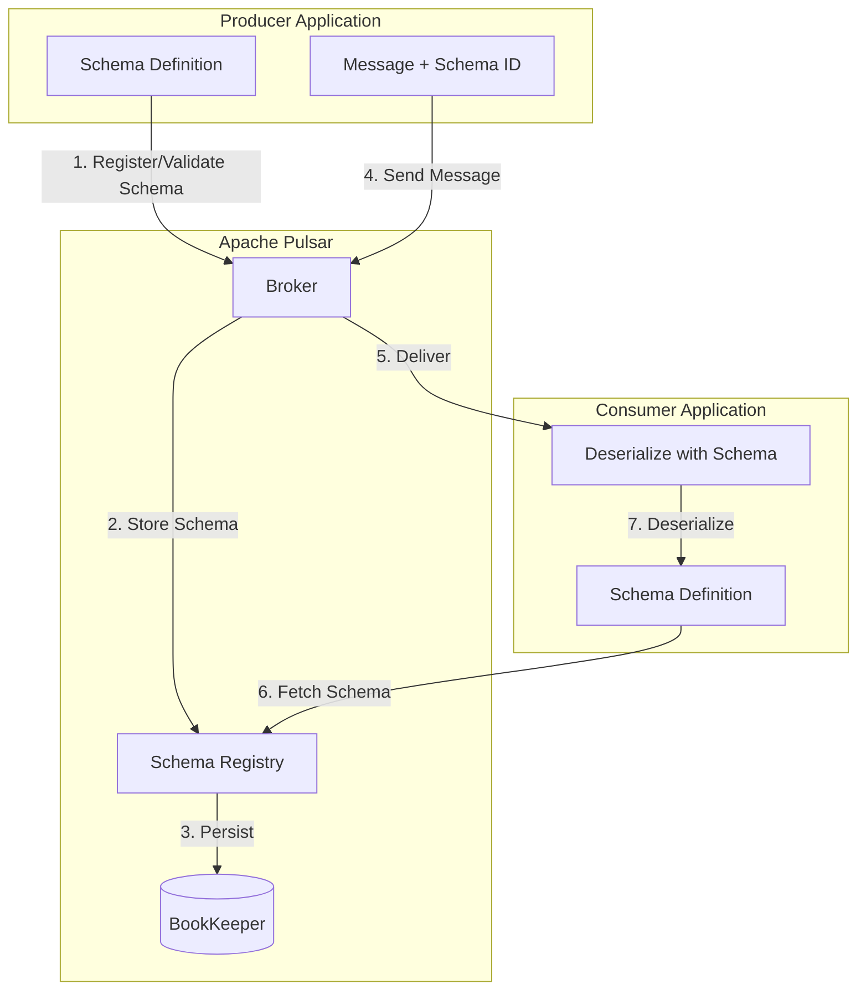
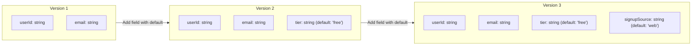
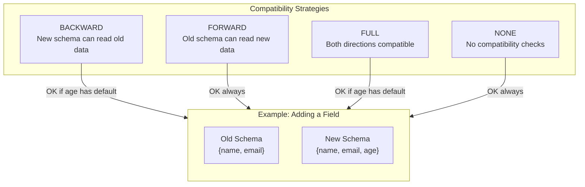
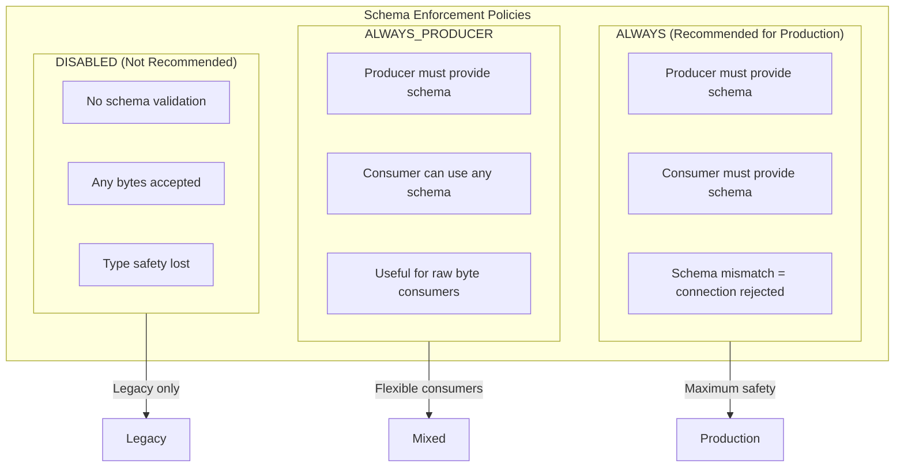

# How to Use Pulsar Schema Registry

Author: [nawazdhandala](https://www.github.com/nawazdhandala)

Tags: Apache Pulsar, Schema Registry, Avro, JSON Schema, Protobuf, Data Serialization, Streaming, Messaging, Event-Driven

Description: A comprehensive guide to using Apache Pulsar's built-in Schema Registry for data serialization, schema evolution, compatibility checking, and type-safe messaging. Learn how to implement Avro, JSON, and Protobuf schemas with practical examples.

---

> **Schema is your contract. Without it, producers and consumers speak different languages. With Pulsar Schema Registry, your data stays consistent, evolution becomes safe, and breaking changes get caught before they break production.**

Apache Pulsar's built-in Schema Registry solves one of the hardest problems in event-driven architectures: ensuring that producers and consumers agree on data format throughout the entire lifecycle of your messages. Unlike Kafka, which requires a separate Confluent Schema Registry, Pulsar includes schema management natively, making it simpler to enforce type safety across your streaming platform.

This guide walks through schema types, versioning, compatibility modes, auto-discovery, and enforcement policies with production-ready code examples.

---

## Table of Contents

1. Why Schema Registry Matters
2. Pulsar Schema Architecture
3. Schema Types (Avro, JSON, Protobuf)
4. Schema Versioning and Evolution
5. Compatibility Checking
6. Auto-Schema Discovery
7. Schema Enforcement Policies
8. Best Practices Summary
9. Conclusion

---

## 1. Why Schema Registry Matters

Without schema enforcement, your event-driven system becomes fragile:

| Problem | Without Schema Registry | With Schema Registry |
|---------|------------------------|---------------------|
| Producer adds new field | Consumers crash on unknown field | Consumers ignore or handle gracefully |
| Producer removes field | Consumers get null pointer exceptions | Compatibility check blocks breaking change |
| Type mismatch | Runtime deserialization failures | Compile-time type safety |
| Documentation | No single source of truth | Schema IS the documentation |
| Debugging | "What format is this message?" | Schema auto-discovered from topic |

Pulsar Schema Registry provides:
- **Type safety**: Compile-time validation of message structure
- **Evolution**: Safe schema changes with compatibility rules
- **Discovery**: Auto-detection of schema from topic metadata
- **Enforcement**: Block incompatible producers at connection time

---

## 2. Pulsar Schema Architecture

Pulsar stores schemas in BookKeeper alongside topic metadata. When a producer or consumer connects, Pulsar validates the schema against what's already registered.



The schema flow:
1. Producer connects with a schema definition
2. Broker checks if schema exists or is compatible with existing versions
3. Schema stored in BookKeeper (persisted durably)
4. Messages sent with schema version ID (not the full schema)
5. Consumer fetches schema from registry on connect
6. Messages deserialized using the correct schema version

---

## 3. Schema Types (Avro, JSON, Protobuf)

Pulsar supports multiple serialization formats. Choose based on your requirements:

| Format | Size | Speed | Evolution | Cross-Language | Use Case |
|--------|------|-------|-----------|----------------|----------|
| Avro | Compact | Fast | Excellent | Good | High-throughput streaming |
| JSON | Large | Slow | Limited | Excellent | Debugging, external APIs |
| Protobuf | Compact | Fastest | Excellent | Excellent | gRPC ecosystems, mobile |

### 3.1 Avro Schema

Avro is the most popular choice for Pulsar due to compact binary encoding and rich evolution support.

```java
// User.java - Define your data class
// The @AvroGenerated annotation indicates this class was generated from .avsc
// You can also write POJOs directly and let Pulsar infer the schema

import org.apache.avro.specific.SpecificRecordBase;
import org.apache.avro.Schema;

public class User extends SpecificRecordBase {
    // Fields that will be serialized
    private String userId;
    private String email;
    private long createdAt;
    private String tier;  // e.g., "free", "premium", "enterprise"

    // Avro requires a no-arg constructor
    public User() {}

    public User(String userId, String email, long createdAt, String tier) {
        this.userId = userId;
        this.email = email;
        this.createdAt = createdAt;
        this.tier = tier;
    }

    // Schema definition - this is what gets registered in Schema Registry
    // Note: In production, generate this from a .avsc file using avro-maven-plugin
    public static final Schema SCHEMA$ = new Schema.Parser().parse(
        "{\"type\":\"record\"," +
        "\"name\":\"User\"," +
        "\"namespace\":\"com.example.events\"," +
        "\"fields\":[" +
        "  {\"name\":\"userId\",\"type\":\"string\"}," +
        "  {\"name\":\"email\",\"type\":\"string\"}," +
        "  {\"name\":\"createdAt\",\"type\":\"long\"}," +
        "  {\"name\":\"tier\",\"type\":\"string\",\"default\":\"free\"}" +
        "]}"
    );

    @Override
    public Schema getSchema() { return SCHEMA$; }

    // Avro requires implementing get/put by field index
    @Override
    public Object get(int field) {
        switch (field) {
            case 0: return userId;
            case 1: return email;
            case 2: return createdAt;
            case 3: return tier;
            default: throw new IndexOutOfBoundsException();
        }
    }

    @Override
    public void put(int field, Object value) {
        switch (field) {
            case 0: userId = (String) value; break;
            case 1: email = (String) value; break;
            case 2: createdAt = (Long) value; break;
            case 3: tier = (String) value; break;
            default: throw new IndexOutOfBoundsException();
        }
    }

    // Standard getters/setters for application code
    public String getUserId() { return userId; }
    public String getEmail() { return email; }
    public long getCreatedAt() { return createdAt; }
    public String getTier() { return tier; }
}
```

```java
// AvroProducer.java - Producer with Avro schema
// This example shows how to create a type-safe producer

import org.apache.pulsar.client.api.*;
import org.apache.pulsar.client.api.schema.SchemaDefinition;

public class AvroProducerExample {

    public static void main(String[] args) throws Exception {
        // Create Pulsar client - in production, use connection pooling
        PulsarClient client = PulsarClient.builder()
            .serviceUrl("pulsar://localhost:6650")
            .build();

        // Create producer with AVRO schema
        // Pulsar automatically registers the schema on first connect
        // Subsequent connections validate compatibility
        Producer<User> producer = client.newProducer(Schema.AVRO(User.class))
            .topic("persistent://public/default/users")
            .producerName("user-service-producer")
            // Enable batching for better throughput
            .batchingMaxMessages(1000)
            .batchingMaxPublishDelay(10, java.util.concurrent.TimeUnit.MILLISECONDS)
            .create();

        // Send a strongly-typed message
        // No manual serialization needed - Pulsar handles it
        User user = new User(
            "user-12345",
            "alice@example.com",
            System.currentTimeMillis(),
            "premium"
        );

        // Synchronous send with message ID returned
        MessageId messageId = producer.send(user);
        System.out.println("Sent message with ID: " + messageId);

        // Async send for better performance
        producer.sendAsync(user)
            .thenAccept(msgId -> System.out.println("Async sent: " + msgId))
            .exceptionally(ex -> {
                System.err.println("Send failed: " + ex.getMessage());
                return null;
            });

        // Always close resources
        producer.close();
        client.close();
    }
}
```

```java
// AvroConsumer.java - Consumer with Avro schema
// Demonstrates type-safe consumption with automatic deserialization

import org.apache.pulsar.client.api.*;

public class AvroConsumerExample {

    public static void main(String[] args) throws Exception {
        PulsarClient client = PulsarClient.builder()
            .serviceUrl("pulsar://localhost:6650")
            .build();

        // Create consumer with AVRO schema
        // Pulsar fetches the schema from the registry automatically
        // If producer schema has evolved, Pulsar handles the mapping
        Consumer<User> consumer = client.newConsumer(Schema.AVRO(User.class))
            .topic("persistent://public/default/users")
            .subscriptionName("user-processor")
            .subscriptionType(SubscriptionType.Shared)
            // Start from earliest message if no checkpoint exists
            .subscriptionInitialPosition(SubscriptionInitialPosition.Earliest)
            .subscribe();

        // Consume messages in a loop
        while (true) {
            // Wait up to 10 seconds for a message
            Message<User> message = consumer.receive(10, java.util.concurrent.TimeUnit.SECONDS);

            if (message == null) {
                System.out.println("No messages received, continuing...");
                continue;
            }

            try {
                // getValue() returns the deserialized User object
                // Type-safe: compiler ensures you're working with User
                User user = message.getValue();

                System.out.printf("Received user: id=%s, email=%s, tier=%s%n",
                    user.getUserId(),
                    user.getEmail(),
                    user.getTier()
                );

                // Process the user (your business logic here)
                processUser(user);

                // Acknowledge after successful processing
                // This marks the message as consumed
                consumer.acknowledge(message);

            } catch (Exception e) {
                // Negative acknowledge on failure
                // Message will be redelivered after ackTimeout
                System.err.println("Processing failed: " + e.getMessage());
                consumer.negativeAcknowledge(message);
            }
        }
    }

    private static void processUser(User user) {
        // Your business logic here
        System.out.println("Processing user: " + user.getUserId());
    }
}
```

### 3.2 JSON Schema

JSON Schema is ideal when you need human-readable messages or integration with systems that don't support binary formats.

```java
// Order.java - POJO for JSON Schema
// Pulsar infers the JSON schema from the class structure

public class Order {
    // All fields will be included in the JSON schema
    private String orderId;
    private String customerId;
    private List<LineItem> items;
    private BigDecimal totalAmount;
    private String currency;
    private Instant createdAt;
    private OrderStatus status;

    // Nested class - will be included as nested schema
    public static class LineItem {
        private String productId;
        private String productName;
        private int quantity;
        private BigDecimal unitPrice;

        // Getters and setters required for JSON serialization
        public String getProductId() { return productId; }
        public void setProductId(String productId) { this.productId = productId; }
        public String getProductName() { return productName; }
        public void setProductName(String productName) { this.productName = productName; }
        public int getQuantity() { return quantity; }
        public void setQuantity(int quantity) { this.quantity = quantity; }
        public BigDecimal getUnitPrice() { return unitPrice; }
        public void setUnitPrice(BigDecimal unitPrice) { this.unitPrice = unitPrice; }
    }

    // Enum - will be serialized as string
    public enum OrderStatus {
        PENDING, CONFIRMED, SHIPPED, DELIVERED, CANCELLED
    }

    // Default constructor required for deserialization
    public Order() {}

    // Getters and setters
    public String getOrderId() { return orderId; }
    public void setOrderId(String orderId) { this.orderId = orderId; }
    public String getCustomerId() { return customerId; }
    public void setCustomerId(String customerId) { this.customerId = customerId; }
    public List<LineItem> getItems() { return items; }
    public void setItems(List<LineItem> items) { this.items = items; }
    public BigDecimal getTotalAmount() { return totalAmount; }
    public void setTotalAmount(BigDecimal totalAmount) { this.totalAmount = totalAmount; }
    public String getCurrency() { return currency; }
    public void setCurrency(String currency) { this.currency = currency; }
    public Instant getCreatedAt() { return createdAt; }
    public void setCreatedAt(Instant createdAt) { this.createdAt = createdAt; }
    public OrderStatus getStatus() { return status; }
    public void setStatus(OrderStatus status) { this.status = status; }
}
```

```java
// JsonSchemaExample.java - Producer and Consumer with JSON Schema

import org.apache.pulsar.client.api.*;
import org.apache.pulsar.client.api.schema.SchemaDefinition;

public class JsonSchemaExample {

    public static void runProducer() throws Exception {
        PulsarClient client = PulsarClient.builder()
            .serviceUrl("pulsar://localhost:6650")
            .build();

        // Create JSON schema producer
        // Schema.JSON infers the schema from the Order class
        // The generated schema includes all fields and nested types
        Producer<Order> producer = client.newProducer(Schema.JSON(Order.class))
            .topic("persistent://public/default/orders")
            .create();

        // Build an order object
        Order order = new Order();
        order.setOrderId("ORD-" + System.currentTimeMillis());
        order.setCustomerId("CUST-12345");
        order.setCurrency("USD");
        order.setStatus(Order.OrderStatus.PENDING);
        order.setCreatedAt(Instant.now());

        // Add line items
        Order.LineItem item = new Order.LineItem();
        item.setProductId("PROD-001");
        item.setProductName("Wireless Mouse");
        item.setQuantity(2);
        item.setUnitPrice(new BigDecimal("29.99"));
        order.setItems(List.of(item));
        order.setTotalAmount(new BigDecimal("59.98"));

        // Send the order
        producer.send(order);
        System.out.println("Sent order: " + order.getOrderId());

        producer.close();
        client.close();
    }

    public static void runConsumer() throws Exception {
        PulsarClient client = PulsarClient.builder()
            .serviceUrl("pulsar://localhost:6650")
            .build();

        Consumer<Order> consumer = client.newConsumer(Schema.JSON(Order.class))
            .topic("persistent://public/default/orders")
            .subscriptionName("order-fulfillment")
            .subscribe();

        Message<Order> message = consumer.receive();
        Order order = message.getValue();

        System.out.printf("Received order %s with %d items, total: %s %s%n",
            order.getOrderId(),
            order.getItems().size(),
            order.getCurrency(),
            order.getTotalAmount()
        );

        consumer.acknowledge(message);
        consumer.close();
        client.close();
    }
}
```

### 3.3 Protobuf Schema

Protobuf offers the best performance and is ideal for gRPC-heavy environments.

```protobuf
// event.proto - Define your Protobuf message
// Compile with: protoc --java_out=src/main/java event.proto

syntax = "proto3";

package com.example.events;

option java_package = "com.example.events";
option java_outer_classname = "EventProtos";

// PaymentEvent message definition
// Protobuf uses field numbers for wire format (more compact than field names)
message PaymentEvent {
    // Field 1: unique transaction identifier
    string transaction_id = 1;

    // Field 2: customer making the payment
    string customer_id = 2;

    // Field 3: amount in smallest currency unit (cents)
    int64 amount_cents = 3;

    // Field 4: ISO 4217 currency code
    string currency = 4;

    // Field 5: payment method used
    PaymentMethod method = 5;

    // Field 6: current status of the payment
    PaymentStatus status = 6;

    // Field 7: Unix timestamp in milliseconds
    int64 timestamp_ms = 7;

    // Field 8: optional metadata (added in v2 - backwards compatible)
    map<string, string> metadata = 8;
}

// Enum for payment methods
enum PaymentMethod {
    PAYMENT_METHOD_UNSPECIFIED = 0;
    CREDIT_CARD = 1;
    DEBIT_CARD = 2;
    BANK_TRANSFER = 3;
    DIGITAL_WALLET = 4;
    CRYPTO = 5;
}

// Enum for payment status
enum PaymentStatus {
    PAYMENT_STATUS_UNSPECIFIED = 0;
    PENDING = 1;
    PROCESSING = 2;
    COMPLETED = 3;
    FAILED = 4;
    REFUNDED = 5;
}
```

```java
// ProtobufExample.java - Producer and Consumer with Protobuf

import org.apache.pulsar.client.api.*;
import com.example.events.EventProtos.PaymentEvent;
import com.example.events.EventProtos.PaymentMethod;
import com.example.events.EventProtos.PaymentStatus;

public class ProtobufExample {

    public static void runProducer() throws Exception {
        PulsarClient client = PulsarClient.builder()
            .serviceUrl("pulsar://localhost:6650")
            .build();

        // Create Protobuf schema producer
        // Pulsar handles Protobuf serialization automatically
        Producer<PaymentEvent> producer = client.newProducer(
                Schema.PROTOBUF(PaymentEvent.class))
            .topic("persistent://public/default/payments")
            .create();

        // Build a Protobuf message using the builder pattern
        PaymentEvent payment = PaymentEvent.newBuilder()
            .setTransactionId("TXN-" + System.currentTimeMillis())
            .setCustomerId("CUST-67890")
            .setAmountCents(9999)  // $99.99
            .setCurrency("USD")
            .setMethod(PaymentMethod.CREDIT_CARD)
            .setStatus(PaymentStatus.COMPLETED)
            .setTimestampMs(System.currentTimeMillis())
            .putMetadata("processor", "stripe")
            .putMetadata("region", "us-west-2")
            .build();

        producer.send(payment);
        System.out.println("Sent payment: " + payment.getTransactionId());

        producer.close();
        client.close();
    }

    public static void runConsumer() throws Exception {
        PulsarClient client = PulsarClient.builder()
            .serviceUrl("pulsar://localhost:6650")
            .build();

        Consumer<PaymentEvent> consumer = client.newConsumer(
                Schema.PROTOBUF(PaymentEvent.class))
            .topic("persistent://public/default/payments")
            .subscriptionName("payment-analytics")
            .subscribe();

        Message<PaymentEvent> message = consumer.receive();
        PaymentEvent payment = message.getValue();

        // Access strongly-typed fields
        System.out.printf("Payment %s: %d cents via %s, status: %s%n",
            payment.getTransactionId(),
            payment.getAmountCents(),
            payment.getMethod(),
            payment.getStatus()
        );

        // Access metadata map
        payment.getMetadataMap().forEach((key, value) ->
            System.out.printf("  %s: %s%n", key, value)
        );

        consumer.acknowledge(message);
        consumer.close();
        client.close();
    }
}
```

---

## 4. Schema Versioning and Evolution

Schemas evolve as your application grows. Pulsar tracks schema versions automatically and supports multiple evolution strategies.



### Schema Evolution Rules

| Change Type | Backward Compatible | Forward Compatible | Full Compatible |
|-------------|--------------------|--------------------|-----------------|
| Add field with default | Yes | No | No |
| Add field without default | No | Yes | No |
| Remove field with default | No | Yes | No |
| Remove field without default | Yes | No | No |
| Change field type | No | No | No |
| Rename field | No | No | No |

```java
// SchemaEvolutionExample.java
// Demonstrates how to handle schema evolution

import org.apache.pulsar.client.api.*;
import org.apache.pulsar.client.api.schema.SchemaDefinition;
import org.apache.pulsar.common.schema.SchemaInfo;

public class SchemaEvolutionExample {

    // Version 1: Original schema
    public static class UserV1 {
        private String userId;
        private String email;

        // getters/setters...
    }

    // Version 2: Added 'tier' field with default value
    // This is BACKWARD compatible - old consumers can read new messages
    public static class UserV2 {
        private String userId;
        private String email;
        private String tier = "free";  // default value for backward compat

        // getters/setters...
    }

    // Version 3: Added 'signupSource' with default
    // Still backward compatible with V1 and V2 consumers
    public static class UserV3 {
        private String userId;
        private String email;
        private String tier = "free";
        private String signupSource = "web";  // default for older readers

        // getters/setters...
    }

    public static void demonstrateEvolution() throws Exception {
        PulsarClient client = PulsarClient.builder()
            .serviceUrl("pulsar://localhost:6650")
            .build();

        String topic = "persistent://public/default/users-evolution";

        // Step 1: Create producer with V1 schema
        // This registers the initial schema version
        Producer<UserV1> producerV1 = client.newProducer(Schema.AVRO(UserV1.class))
            .topic(topic)
            .create();

        UserV1 userV1 = new UserV1();
        userV1.setUserId("user-001");
        userV1.setEmail("original@example.com");
        producerV1.send(userV1);
        producerV1.close();

        // Step 2: Create producer with V2 schema
        // Pulsar checks compatibility before allowing the new schema
        // With BACKWARD_TRANSITIVE (default), new schema must be readable by old consumers
        Producer<UserV2> producerV2 = client.newProducer(Schema.AVRO(UserV2.class))
            .topic(topic)
            .create();

        UserV2 userV2 = new UserV2();
        userV2.setUserId("user-002");
        userV2.setEmail("upgraded@example.com");
        userV2.setTier("premium");
        producerV2.send(userV2);
        producerV2.close();

        // Step 3: V1 consumer can still read V2 messages
        // New 'tier' field is simply ignored
        Consumer<UserV1> consumerV1 = client.newConsumer(Schema.AVRO(UserV1.class))
            .topic(topic)
            .subscriptionName("v1-consumer")
            .subscriptionInitialPosition(SubscriptionInitialPosition.Earliest)
            .subscribe();

        // This works! V1 consumer reads V2 message, ignoring unknown fields
        Message<UserV1> msg = consumerV1.receive();
        System.out.println("V1 consumer read: " + msg.getValue().getEmail());
        consumerV1.acknowledge(msg);
        consumerV1.close();

        // Step 4: V2 consumer can read both V1 and V2 messages
        // For V1 messages, 'tier' gets the default value "free"
        Consumer<UserV2> consumerV2 = client.newConsumer(Schema.AVRO(UserV2.class))
            .topic(topic)
            .subscriptionName("v2-consumer")
            .subscriptionInitialPosition(SubscriptionInitialPosition.Earliest)
            .subscribe();

        // Read V1 message - tier will be "free" (default)
        Message<UserV2> msgFromV1 = consumerV2.receive();
        System.out.println("V2 reading V1: tier=" + msgFromV1.getValue().getTier()); // "free"
        consumerV2.acknowledge(msgFromV1);

        // Read V2 message - tier is "premium"
        Message<UserV2> msgFromV2 = consumerV2.receive();
        System.out.println("V2 reading V2: tier=" + msgFromV2.getValue().getTier()); // "premium"
        consumerV2.acknowledge(msgFromV2);

        consumerV2.close();
        client.close();
    }
}
```

---

## 5. Compatibility Checking

Pulsar supports multiple compatibility strategies. Configure at the namespace level:



### Compatibility Modes

| Mode | Description | Use Case |
|------|-------------|----------|
| `BACKWARD` | New schema can read data written by old schema | Rolling upgrades (consumers update first) |
| `BACKWARD_TRANSITIVE` | New schema can read ALL previous versions | Long-lived topics with many versions |
| `FORWARD` | Old schema can read data written by new schema | Rolling upgrades (producers update first) |
| `FORWARD_TRANSITIVE` | All previous schemas can read new data | Strict backward reader compatibility |
| `FULL` | Both backward and forward compatible | Maximum safety |
| `FULL_TRANSITIVE` | Full compatibility with all versions | Critical production topics |
| `NONE` | No compatibility checking | Development/testing only |

```bash
# Set compatibility strategy for a namespace using pulsar-admin CLI
# This affects all topics in the namespace

# Set to BACKWARD (recommended for most cases)
bin/pulsar-admin namespaces set-schema-compatibility-strategy \
    public/default \
    --compatibility BACKWARD

# Set to FULL_TRANSITIVE for critical topics
bin/pulsar-admin namespaces set-schema-compatibility-strategy \
    public/production \
    --compatibility FULL_TRANSITIVE

# Check current compatibility strategy
bin/pulsar-admin namespaces get-schema-compatibility-strategy public/default

# List all schema versions for a topic
bin/pulsar-admin schemas get persistent://public/default/users --all-version
```

```java
// CompatibilityCheckExample.java
// Demonstrates compatibility checking behavior

import org.apache.pulsar.client.api.*;
import org.apache.pulsar.client.api.schema.SchemaDefinition;
import org.apache.pulsar.common.policies.data.SchemaCompatibilityStrategy;

public class CompatibilityCheckExample {

    // Original schema
    public static class Product {
        private String productId;
        private String name;
        private double price;
        // getters/setters...
    }

    // Incompatible change: removed 'name' field without default
    // This will FAIL compatibility check in BACKWARD mode
    public static class ProductBreaking {
        private String productId;
        private double price;
        // 'name' removed - breaks backward compatibility!
    }

    // Compatible change: added field with default
    public static class ProductCompatible {
        private String productId;
        private String name;
        private double price;
        private String category = "uncategorized";  // has default - OK!
        // getters/setters...
    }

    public static void demonstrateCompatibilityCheck() throws Exception {
        PulsarClient client = PulsarClient.builder()
            .serviceUrl("pulsar://localhost:6650")
            .build();

        String topic = "persistent://public/default/products";

        // Register initial schema
        Producer<Product> producer = client.newProducer(Schema.AVRO(Product.class))
            .topic(topic)
            .create();
        producer.close();

        // Attempt incompatible schema change
        // This will throw SchemaCompatibilityException if namespace uses BACKWARD
        try {
            Producer<ProductBreaking> badProducer = client.newProducer(
                    Schema.AVRO(ProductBreaking.class))
                .topic(topic)
                .create();
            // Won't reach here if compatibility check is enabled
            badProducer.close();
        } catch (PulsarClientException.IncompatibleSchemaException e) {
            // Expected! The schema change is incompatible
            System.err.println("Schema rejected: " + e.getMessage());
            // Output: "Schema rejected: Incompatible schema:
            //          reader field 'name' is missing default value"
        }

        // Compatible schema change succeeds
        Producer<ProductCompatible> goodProducer = client.newProducer(
                Schema.AVRO(ProductCompatible.class))
            .topic(topic)
            .create();
        System.out.println("Compatible schema accepted!");
        goodProducer.close();

        client.close();
    }
}
```

---

## 6. Auto-Schema Discovery

Pulsar can automatically discover and use schemas from topics, enabling dynamic consumers and admin tools.

```java
// AutoSchemaDiscovery.java
// Shows how to consume messages without knowing the schema at compile time

import org.apache.pulsar.client.api.*;
import org.apache.pulsar.client.api.schema.GenericRecord;
import org.apache.pulsar.common.schema.SchemaInfo;
import org.apache.pulsar.common.schema.SchemaType;

public class AutoSchemaDiscovery {

    public static void consumeWithAutoSchema() throws Exception {
        PulsarClient client = PulsarClient.builder()
            .serviceUrl("pulsar://localhost:6650")
            .build();

        // Use AUTO_CONSUME to let Pulsar fetch the schema automatically
        // This is useful for:
        // - Generic message processors
        // - Admin/debugging tools
        // - Schema-agnostic pipelines (e.g., forwarding to another system)
        Consumer<GenericRecord> consumer = client.newConsumer(Schema.AUTO_CONSUME())
            .topic("persistent://public/default/users")
            .subscriptionName("schema-discovery-consumer")
            .subscribe();

        Message<GenericRecord> message = consumer.receive();
        GenericRecord record = message.getValue();

        // Access schema metadata
        SchemaInfo schemaInfo = message.getSchemaInfo();
        System.out.println("Schema type: " + schemaInfo.getType()); // AVRO, JSON, etc.
        System.out.println("Schema definition: " + schemaInfo.getSchemaDefinition());

        // Access fields dynamically by name
        // GenericRecord provides field access without compile-time type info
        System.out.println("Fields in message:");
        for (org.apache.pulsar.client.api.schema.Field field : record.getFields()) {
            String fieldName = field.getName();
            Object fieldValue = record.getField(fieldName);
            System.out.printf("  %s: %s%n", fieldName, fieldValue);
        }

        // Access specific field (returns Object, needs casting)
        String userId = (String) record.getField("userId");
        System.out.println("User ID: " + userId);

        consumer.acknowledge(message);
        consumer.close();
        client.close();
    }

    public static void inspectTopicSchema() throws Exception {
        // Use PulsarAdmin to inspect schemas without consuming messages
        PulsarAdmin admin = PulsarAdmin.builder()
            .serviceHttpUrl("http://localhost:8080")
            .build();

        String topic = "persistent://public/default/users";

        // Get the latest schema
        SchemaInfo latestSchema = admin.schemas().getSchemaInfo(topic);
        System.out.println("Latest schema:");
        System.out.println("  Type: " + latestSchema.getType());
        System.out.println("  Definition: " + latestSchema.getSchemaDefinition());

        // Get all schema versions
        List<SchemaInfo> allVersions = admin.schemas().getAllSchemas(topic);
        System.out.println("\nAll schema versions:");
        for (int i = 0; i < allVersions.size(); i++) {
            SchemaInfo version = allVersions.get(i);
            System.out.printf("  Version %d: %s%n", i, version.getSchemaDefinition());
        }

        admin.close();
    }

    public static void produceWithAutoSchema() throws Exception {
        PulsarClient client = PulsarClient.builder()
            .serviceUrl("pulsar://localhost:6650")
            .build();

        // AUTO_PRODUCE_BYTES lets you send raw bytes
        // Pulsar validates against the topic's current schema
        // Useful for proxies/gateways that receive already-serialized data
        Producer<byte[]> producer = client.newProducer(Schema.AUTO_PRODUCE_BYTES())
            .topic("persistent://public/default/users")
            .create();

        // The bytes must match the topic's registered schema format
        // Typically you'd receive these from another system
        byte[] serializedMessage = getSerializedMessageFromExternalSystem();

        producer.send(serializedMessage);
        producer.close();
        client.close();
    }
}
```

---

## 7. Schema Enforcement Policies

Control how strictly Pulsar enforces schema usage at the namespace or topic level.



### Enforcement Policy Options

| Policy | Producer Schema Required | Consumer Schema Required | Use Case |
|--------|-------------------------|-------------------------|----------|
| `ALWAYS` | Yes | Yes | Production - full type safety |
| `ALWAYS_PRODUCER` | Yes | No | When consumers need raw bytes |
| `DISABLED` | No | No | Legacy topics, migration |

```bash
# Set schema enforcement policy using pulsar-admin

# Enable strict enforcement (recommended)
bin/pulsar-admin namespaces set-schema-validation-enforce \
    public/production \
    --enable

# Set the policy type
bin/pulsar-admin namespaces set-schema-autoupdate-strategy \
    public/production \
    --compatibility FULL_TRANSITIVE \
    --schema-validation-enforced

# Check current policy
bin/pulsar-admin namespaces get-schema-validation-enforce public/production
```

```java
// SchemaEnforcementExample.java
// Demonstrates schema enforcement behavior

import org.apache.pulsar.client.api.*;

public class SchemaEnforcementExample {

    public static void demonstrateEnforcement() throws Exception {
        PulsarClient client = PulsarClient.builder()
            .serviceUrl("pulsar://localhost:6650")
            .build();

        String enforcedTopic = "persistent://public/production/strict-users";

        // First, register a schema by producing with it
        Producer<User> schemaProducer = client.newProducer(Schema.AVRO(User.class))
            .topic(enforcedTopic)
            .create();
        schemaProducer.close();

        // Attempt to produce without schema (raw bytes)
        // This will FAIL if schema enforcement is ALWAYS
        try {
            Producer<byte[]> rawProducer = client.newProducer(Schema.BYTES)
                .topic(enforcedTopic)
                .create();
            rawProducer.send("raw bytes".getBytes());
            rawProducer.close();
        } catch (PulsarClientException e) {
            // Expected with ALWAYS enforcement
            System.err.println("Raw producer rejected: " + e.getMessage());
        }

        // Attempt to produce with wrong schema
        // This will FAIL - type mismatch
        try {
            Producer<Order> wrongProducer = client.newProducer(Schema.AVRO(Order.class))
                .topic(enforcedTopic)
                .create();
            wrongProducer.close();
        } catch (PulsarClientException.IncompatibleSchemaException e) {
            System.err.println("Wrong schema rejected: " + e.getMessage());
        }

        // Correct schema succeeds
        Producer<User> correctProducer = client.newProducer(Schema.AVRO(User.class))
            .topic(enforcedTopic)
            .create();

        User user = new User("user-123", "valid@example.com", System.currentTimeMillis(), "premium");
        correctProducer.send(user);
        System.out.println("Message sent with correct schema");

        correctProducer.close();
        client.close();
    }

    // Configure enforcement programmatically via PulsarAdmin
    public static void configureEnforcement() throws Exception {
        PulsarAdmin admin = PulsarAdmin.builder()
            .serviceHttpUrl("http://localhost:8080")
            .build();

        String namespace = "public/production";

        // Enable schema validation enforcement
        admin.namespaces().setSchemaValidationEnforced(namespace, true);

        // Set compatibility strategy
        admin.namespaces().setSchemaCompatibilityStrategy(
            namespace,
            SchemaCompatibilityStrategy.FULL_TRANSITIVE
        );

        // Verify settings
        boolean enforced = admin.namespaces().getSchemaValidationEnforced(namespace);
        SchemaCompatibilityStrategy strategy =
            admin.namespaces().getSchemaCompatibilityStrategy(namespace);

        System.out.printf("Namespace %s: enforced=%s, strategy=%s%n",
            namespace, enforced, strategy);

        admin.close();
    }
}
```

---

## 8. Best Practices Summary

### Schema Design

| Do | Don't |
|----|-------|
| Use specific field types (int64, string) | Use generic `Object` or `Any` types |
| Add documentation comments in schema | Leave fields undocumented |
| Use enums for fixed value sets | Use magic strings/numbers |
| Define clear namespaces | Use default namespace for everything |
| Version your .avsc/.proto files in git | Generate schemas only at runtime |

### Evolution Strategy

| Do | Don't |
|----|-------|
| Add fields with default values | Add required fields to existing schemas |
| Use FULL_TRANSITIVE for production | Use NONE compatibility |
| Test schema changes in staging first | Deploy schema changes directly to prod |
| Keep old consumers running during rollout | Force all consumers to upgrade simultaneously |
| Use semantic versioning for schemas | Increment versions randomly |

### Operational Best Practices

| Do | Don't |
|----|-------|
| Enable schema enforcement (ALWAYS) | Allow unschema'd production topics |
| Monitor schema registry metrics | Ignore schema-related errors |
| Document schema ownership | Let anyone modify any schema |
| Automate compatibility checks in CI/CD | Rely on manual schema review |
| Back up schema registry data | Assume BookKeeper is invincible |

### Code Example: CI/CD Schema Validation

```bash
#!/bin/bash
# validate-schema.sh - Run in CI/CD pipeline before deployment

# Exit on error
set -e

PULSAR_ADMIN="bin/pulsar-admin"
TOPIC="persistent://public/default/users"
NEW_SCHEMA_FILE="schemas/user-v2.avsc"

# Test compatibility before deployment
echo "Testing schema compatibility..."
$PULSAR_ADMIN schemas compatibility \
    --schema-file "$NEW_SCHEMA_FILE" \
    "$TOPIC"

# If we reach here, schema is compatible
echo "Schema is compatible! Proceeding with deployment..."

# Upload the new schema (optional - producer will register on connect)
$PULSAR_ADMIN schemas upload \
    --schema-file "$NEW_SCHEMA_FILE" \
    "$TOPIC"

echo "Schema uploaded successfully"
```

### Performance Tips

```java
// PerformanceTips.java - Schema-related performance optimizations

import org.apache.pulsar.client.api.*;

public class PerformanceTips {

    public static Producer<User> createOptimizedProducer(PulsarClient client)
            throws Exception {

        return client.newProducer(Schema.AVRO(User.class))
            .topic("persistent://public/default/users")

            // Cache the schema info to avoid repeated lookups
            // Pulsar does this by default, but be aware of it

            // Enable batching for better throughput
            // Batching amortizes the per-message overhead
            .batchingMaxMessages(1000)
            .batchingMaxPublishDelay(10, java.util.concurrent.TimeUnit.MILLISECONDS)

            // Use async send with callbacks for non-blocking operation
            // The schema serialization happens synchronously,
            // but network I/O is async

            // Consider message compression if payloads are large
            // Compression happens after serialization
            .compressionType(CompressionType.LZ4)

            .create();
    }

    public static Consumer<User> createOptimizedConsumer(PulsarClient client)
            throws Exception {

        return client.newConsumer(Schema.AVRO(User.class))
            .topic("persistent://public/default/users")
            .subscriptionName("optimized-consumer")

            // Prefetch more messages for higher throughput
            // Each message is deserialized on receive()
            .receiverQueueSize(1000)

            // Use batch receive for bulk processing
            // Reduces per-message overhead
            .batchReceivePolicy(BatchReceivePolicy.builder()
                .maxNumMessages(100)
                .maxNumBytes(10 * 1024 * 1024) // 10MB
                .timeout(100, java.util.concurrent.TimeUnit.MILLISECONDS)
                .build())

            .subscribe();
    }
}
```

---

## 9. Conclusion

Apache Pulsar's built-in Schema Registry transforms event-driven architectures from fragile string-passing to robust, type-safe systems. By leveraging Avro, JSON, or Protobuf schemas with proper compatibility strategies, you can:

- **Prevent production incidents** from schema mismatches
- **Evolve schemas safely** without breaking consumers
- **Document data contracts** in a machine-readable format
- **Enable type safety** across producer and consumer codebases

Start with `BACKWARD` compatibility for most use cases, graduate to `FULL_TRANSITIVE` for critical production topics, and always enable schema enforcement in production namespaces.

---

*Need to monitor your Pulsar cluster's health, track schema evolution, and alert on compatibility failures? [OneUptime](https://oneuptime.com) provides comprehensive observability for your entire streaming infrastructure, from broker metrics to consumer lag to schema registry events.*

---

### Related Reading

- [Apache Pulsar Documentation - Schema Registry](https://pulsar.apache.org/docs/schema-get-started/)
- [Schema Evolution in Event Streaming](https://oneuptime.com/blog)
- [OpenTelemetry for Pulsar Monitoring](https://oneuptime.com/blog)
