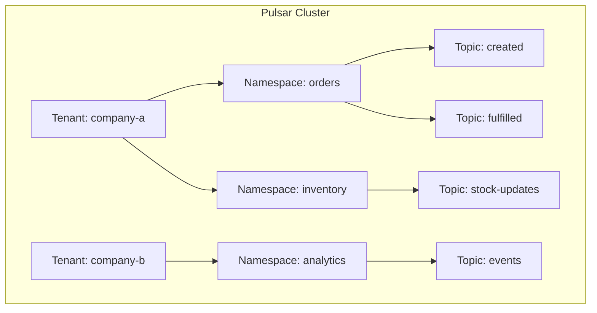
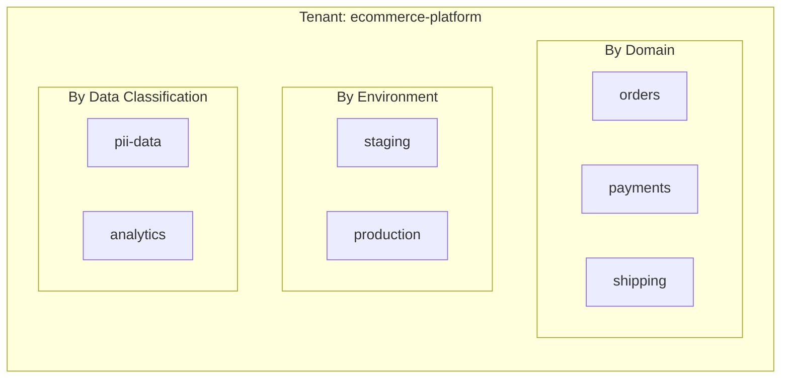
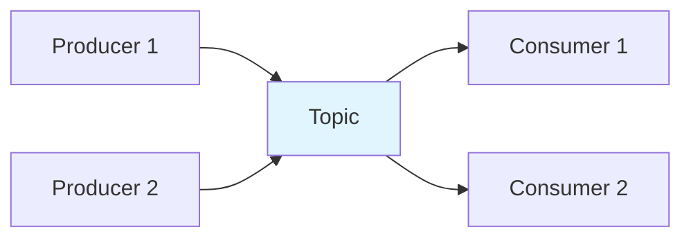
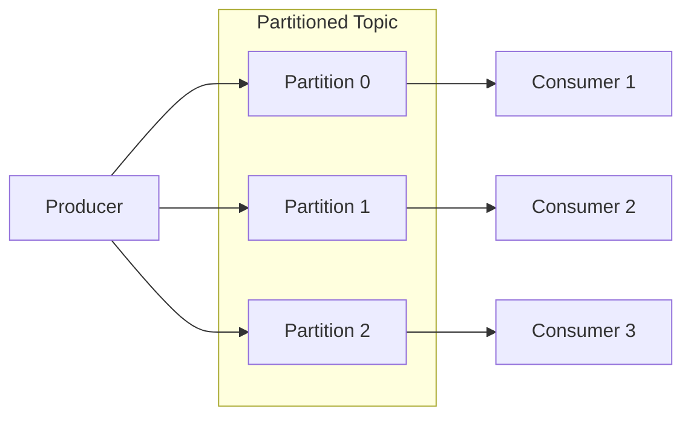
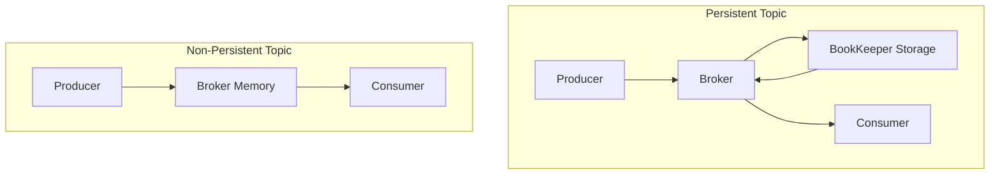
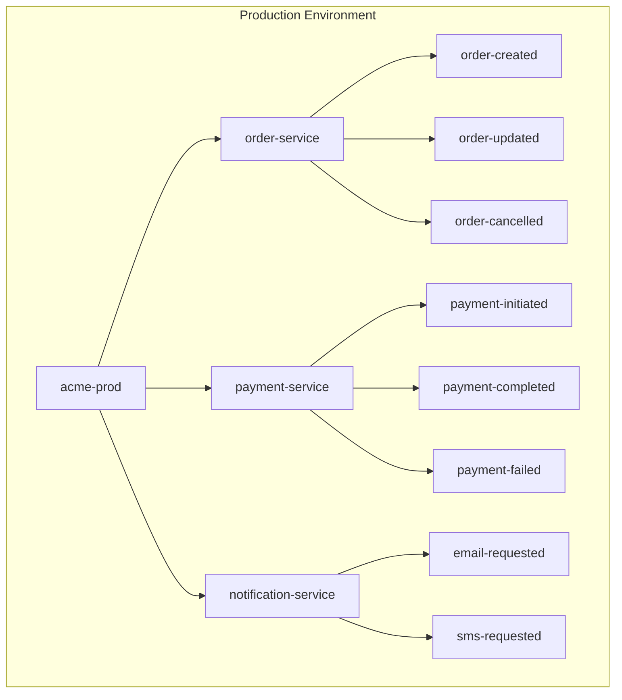
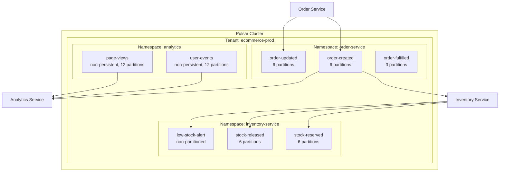

# How to Design Pulsar Topics and Namespaces

Author: [nawazdhandala](https://www.github.com/nawazdhandala)

Tags: Apache Pulsar, Messaging, Event Streaming, Distributed Systems, DevOps, Architecture

Description: A comprehensive guide to designing Apache Pulsar topics and namespaces for scalable, maintainable event-driven architectures.

---

> "A well-designed messaging topology is like a well-organized filing system: everything has its place, access is controlled, and scaling happens naturally."

Apache Pulsar's hierarchical organization of tenants, namespaces, and topics provides a powerful foundation for building scalable, multi-tenant messaging systems. Unlike simpler message brokers, Pulsar's architecture allows you to enforce isolation, apply policies, and manage resources at multiple levels.

This guide walks you through the complete process of designing Pulsar topics and namespaces, from understanding the hierarchy to implementing production-ready configurations.

---

## Table of Contents

1. Understanding the Hierarchy
2. Tenants: The Top-Level Container
3. Namespaces: Policy and Isolation Boundaries
4. Topics: The Message Channels
5. Partitioned vs Non-Partitioned Topics
6. Persistent vs Non-Persistent Topics
7. Namespace Policies
8. Naming Conventions and Best Practices
9. Complete Architecture Example
10. Monitoring Your Pulsar Setup

---

## 1. Understanding the Hierarchy

Pulsar organizes resources in a three-level hierarchy: **Tenants > Namespaces > Topics**. This structure enables multi-tenancy, policy isolation, and logical grouping of related data streams.



The full topic name follows this format:

```
{persistent|non-persistent}://tenant/namespace/topic
```

For example:
- `persistent://company-a/orders/created`
- `non-persistent://company-b/analytics/events`

---

## 2. Tenants: The Top-Level Container

Tenants represent the highest level of isolation in Pulsar. They are typically used to separate different organizations, teams, or major application domains.

### Creating a Tenant

```bash
# Create a tenant with admin CLI
# The --admin-roles flag specifies which roles can administer this tenant
# The --allowed-clusters flag limits which clusters this tenant can use
bin/pulsar-admin tenants create company-a \
    --admin-roles admin-role \
    --allowed-clusters us-west,us-east

# List all tenants in the cluster
bin/pulsar-admin tenants list

# Get detailed information about a specific tenant
bin/pulsar-admin tenants get company-a
```

### Tenant Configuration in Java

```java
// TenantManager.java
// This class demonstrates programmatic tenant management using Pulsar Admin API

import org.apache.pulsar.client.admin.PulsarAdmin;
import org.apache.pulsar.common.policies.data.TenantInfo;
import java.util.Set;

public class TenantManager {

    private final PulsarAdmin admin;

    public TenantManager(String serviceUrl) throws Exception {
        // Initialize the admin client with the Pulsar service URL
        // This connects to the Pulsar cluster's admin REST API
        this.admin = PulsarAdmin.builder()
            .serviceHttpUrl(serviceUrl)
            .build();
    }

    public void createTenant(String tenantName,
                            Set<String> adminRoles,
                            Set<String> allowedClusters) throws Exception {

        // TenantInfo defines the tenant's configuration
        // - adminRoles: users/roles that can manage this tenant
        // - allowedClusters: which Pulsar clusters this tenant can use
        TenantInfo tenantInfo = TenantInfo.builder()
            .adminRoles(adminRoles)
            .allowedClusters(allowedClusters)
            .build();

        // Create the tenant in the cluster
        // This is idempotent - calling twice with same config is safe
        admin.tenants().createTenant(tenantName, tenantInfo);

        System.out.println("Created tenant: " + tenantName);
    }

    public void listTenants() throws Exception {
        // Retrieve and display all tenants in the cluster
        for (String tenant : admin.tenants().getTenants()) {
            TenantInfo info = admin.tenants().getTenantInfo(tenant);
            System.out.printf("Tenant: %s, Clusters: %s%n",
                tenant, info.getAllowedClusters());
        }
    }
}
```

---

## 3. Namespaces: Policy and Isolation Boundaries

Namespaces are logical groupings within a tenant. They serve as the primary unit for applying policies like retention, TTL, replication, and access control.

### Creating Namespaces

```bash
# Create a namespace under the company-a tenant
# Namespace names should reflect their purpose (orders, inventory, etc.)
bin/pulsar-admin namespaces create company-a/orders

# Create multiple namespaces for different domains
bin/pulsar-admin namespaces create company-a/inventory
bin/pulsar-admin namespaces create company-a/notifications

# List all namespaces for a tenant
bin/pulsar-admin namespaces list company-a
```

### Namespace Organization Strategy



Choose your namespace organization based on:
- **By Domain**: When different domains have different retention/replication needs
- **By Environment**: When you need strict isolation between staging and production
- **By Data Classification**: When compliance requires different handling for sensitive data

---

## 4. Topics: The Message Channels

Topics are the actual channels where messages flow. They can be created explicitly or automatically when a producer/consumer connects.

### Creating Topics

```bash
# Create a non-partitioned topic explicitly
# Use this when you don't need parallel processing
bin/pulsar-admin topics create persistent://company-a/orders/order-created

# Create a partitioned topic with 6 partitions
# Partitions enable parallel consumption and higher throughput
bin/pulsar-admin topics create-partitioned-topic \
    persistent://company-a/orders/order-events \
    --partitions 6

# List topics in a namespace
bin/pulsar-admin topics list company-a/orders

# Get topic statistics including message rates and storage
bin/pulsar-admin topics stats persistent://company-a/orders/order-created
```

### Topic Producer Example

```java
// OrderEventProducer.java
// Demonstrates publishing messages to a Pulsar topic

import org.apache.pulsar.client.api.*;
import java.util.concurrent.TimeUnit;

public class OrderEventProducer {

    public static void main(String[] args) throws Exception {
        // Create a Pulsar client connected to the cluster
        // The service URL can be a single broker or a load balancer
        PulsarClient client = PulsarClient.builder()
            .serviceUrl("pulsar://localhost:6650")
            .build();

        // Build a producer for the order-created topic
        // Configuration options control batching, compression, and routing
        Producer<String> producer = client.newProducer(Schema.STRING)
            // Full topic name: persistent://tenant/namespace/topic
            .topic("persistent://company-a/orders/order-created")
            // Batching improves throughput by grouping messages
            .batchingMaxPublishDelay(10, TimeUnit.MILLISECONDS)
            .batchingMaxMessages(100)
            // Compression reduces network and storage costs
            .compressionType(CompressionType.LZ4)
            // Block if the pending queue is full (backpressure)
            .blockIfQueueFull(true)
            .create();

        // Send a message with a key for ordering guarantees
        // Messages with the same key go to the same partition
        MessageId messageId = producer.newMessage()
            .key("order-12345")  // Routing key for partitioned topics
            .value("{\"orderId\": \"12345\", \"status\": \"created\"}")
            .property("event-type", "ORDER_CREATED")  // Custom metadata
            .send();

        System.out.println("Published message: " + messageId);

        // Always close resources to flush pending messages
        producer.close();
        client.close();
    }
}
```

---

## 5. Partitioned vs Non-Partitioned Topics

Understanding when to use partitioned topics is crucial for scaling your messaging system.

### Non-Partitioned Topics



**Use non-partitioned topics when:**
- Message ordering across all messages is required
- Low throughput (< 10k messages/second)
- Simple pub/sub without parallel processing needs

### Partitioned Topics



**Use partitioned topics when:**
- High throughput is required (parallel processing)
- Multiple consumers need to share the load
- Per-key ordering is sufficient (vs global ordering)

### Creating and Managing Partitioned Topics

```java
// PartitionedTopicManager.java
// Demonstrates partitioned topic creation and producer configuration

import org.apache.pulsar.client.api.*;
import org.apache.pulsar.client.admin.PulsarAdmin;

public class PartitionedTopicManager {

    public void createPartitionedTopic(PulsarAdmin admin,
                                       String topic,
                                       int partitions) throws Exception {
        // Create a partitioned topic
        // The number of partitions should be based on:
        // - Expected throughput (more partitions = more parallelism)
        // - Number of consumers (ideally partitions >= consumers)
        // - Cannot be decreased later, only increased
        admin.topics().createPartitionedTopic(topic, partitions);

        System.out.printf("Created partitioned topic %s with %d partitions%n",
            topic, partitions);
    }

    public void produceWithRouting(PulsarClient client) throws Exception {
        // Producer for a partitioned topic with custom routing
        Producer<byte[]> producer = client.newProducer()
            .topic("persistent://company-a/orders/order-events")
            // MessageRouter determines which partition receives each message
            // RoundRobinPartitionMessageRouter: distributes evenly (default for keyless)
            // SinglePartitionMessageRouter: all messages to one partition
            // Custom: implement MessageRouter interface
            .messageRoutingMode(MessageRoutingMode.CustomPartition)
            .messageRouter(new MessageRouter() {
                @Override
                public int choosePartition(Message<?> msg, TopicMetadata metadata) {
                    // Route based on message key hash
                    // This ensures messages with same key go to same partition
                    String key = msg.getKey();
                    if (key != null) {
                        return Math.abs(key.hashCode()) % metadata.numPartitions();
                    }
                    // Round-robin for keyless messages
                    return (int) (System.nanoTime() % metadata.numPartitions());
                }
            })
            .create();

        // Messages with same orderId always go to same partition
        // This guarantees ordering per order
        producer.newMessage()
            .key("order-789")
            .value("Order 789 update".getBytes())
            .send();

        producer.close();
    }

    public void updatePartitionCount(PulsarAdmin admin,
                                     String topic,
                                     int newPartitions) throws Exception {
        // Increase partition count for existing topic
        // WARNING: Cannot decrease partitions
        // WARNING: May affect message ordering during transition
        admin.topics().updatePartitionedTopic(topic, newPartitions);

        System.out.printf("Updated %s to %d partitions%n", topic, newPartitions);
    }
}
```

---

## 6. Persistent vs Non-Persistent Topics

Pulsar supports two persistence modes, each suited for different use cases.

### Persistent Topics

Messages are durably stored in Apache BookKeeper before being acknowledged to producers.

```bash
# Persistent topic URL format
persistent://tenant/namespace/topic

# Create persistent topic
bin/pulsar-admin topics create persistent://company-a/orders/critical-events
```

```java
// PersistentTopicExample.java
// Demonstrates persistent topic usage for critical data

import org.apache.pulsar.client.api.*;

public class PersistentTopicExample {

    public void produceToPeristent(PulsarClient client) throws Exception {
        // Persistent topics guarantee message durability
        // Messages are written to BookKeeper before ack is sent
        Producer<String> producer = client.newProducer(Schema.STRING)
            .topic("persistent://company-a/orders/payment-events")
            // Send timeout ensures we don't wait forever
            .sendTimeout(30, java.util.concurrent.TimeUnit.SECONDS)
            .create();

        // Synchronous send - blocks until message is persisted
        // Use this for critical messages where you need confirmation
        MessageId msgId = producer.send("Payment processed: $100");
        System.out.println("Message persisted with ID: " + msgId);

        // Asynchronous send with callback
        // Use this for higher throughput when you can handle failures async
        producer.sendAsync("Payment refunded: $50")
            .thenAccept(id -> System.out.println("Persisted: " + id))
            .exceptionally(ex -> {
                System.err.println("Failed to persist: " + ex.getMessage());
                return null;
            });

        producer.close();
    }
}
```

**Use persistent topics for:**
- Financial transactions
- Order processing
- Audit logs
- Any data that cannot be lost

### Non-Persistent Topics

Messages are delivered directly from broker memory without storage. Faster but no durability guarantees.

```bash
# Non-persistent topic URL format
non-persistent://tenant/namespace/topic

# Create non-persistent topic
bin/pulsar-admin topics create non-persistent://company-a/analytics/metrics
```

```java
// NonPersistentTopicExample.java
// Demonstrates non-persistent topic usage for ephemeral data

import org.apache.pulsar.client.api.*;

public class NonPersistentTopicExample {

    public void produceToNonPersistent(PulsarClient client) throws Exception {
        // Non-persistent topics skip BookKeeper storage
        // Pros: Lower latency, no storage costs
        // Cons: Messages lost if broker fails or no consumers connected
        Producer<String> producer = client.newProducer(Schema.STRING)
            .topic("non-persistent://company-a/analytics/real-time-metrics")
            // Smaller batches for lower latency
            .batchingMaxPublishDelay(1, java.util.concurrent.TimeUnit.MILLISECONDS)
            .create();

        // Fire-and-forget metrics
        // Lost messages are acceptable for real-time metrics
        producer.sendAsync("cpu_usage:45.2");
        producer.sendAsync("memory_usage:72.8");
        producer.sendAsync("request_latency_p99:120ms");

        producer.close();
    }
}
```

**Use non-persistent topics for:**
- Real-time metrics and monitoring
- Live location updates
- Gaming state updates
- Any ephemeral data where occasional loss is acceptable

### Comparison Diagram



---

## 7. Namespace Policies

Namespace policies are the primary mechanism for controlling behavior of all topics within a namespace.

### Retention Policy

Controls how long messages are kept after acknowledgment.

```bash
# Set retention: keep messages for 7 days or up to 10GB
# Messages are retained even after all subscriptions acknowledge them
bin/pulsar-admin namespaces set-retention company-a/orders \
    --time 7d \
    --size 10G

# Get current retention settings
bin/pulsar-admin namespaces get-retention company-a/orders

# Remove retention (messages deleted after ack)
bin/pulsar-admin namespaces remove-retention company-a/orders
```

### Message TTL (Time-To-Live)

Automatically acknowledges unprocessed messages after a timeout.

```bash
# Set TTL: unacknowledged messages expire after 1 hour
# Useful for time-sensitive data that becomes stale
bin/pulsar-admin namespaces set-message-ttl company-a/notifications \
    --messageTTL 3600

# Get current TTL
bin/pulsar-admin namespaces get-message-ttl company-a/notifications
```

### Backlog Quota

Limits the amount of unacknowledged messages to prevent unbounded growth.

```bash
# Set backlog quota: max 5GB of unacknowledged messages
# When exceeded, either block producers or drop oldest messages
bin/pulsar-admin namespaces set-backlog-quota company-a/orders \
    --limit 5G \
    --limitTime -1 \
    --policy producer_request_hold

# Policy options:
# - producer_request_hold: block producers until backlog decreases
# - producer_exception: throw exception to producers
# - consumer_backlog_eviction: drop oldest unacked messages
```

### Replication Policy

Configure geo-replication for disaster recovery.

```bash
# Enable replication to multiple clusters
bin/pulsar-admin namespaces set-clusters company-a/orders \
    --clusters us-west,us-east,eu-central

# Get replication clusters
bin/pulsar-admin namespaces get-clusters company-a/orders
```

### Complete Namespace Configuration in Java

```java
// NamespacePolicyManager.java
// Comprehensive namespace policy configuration

import org.apache.pulsar.client.admin.PulsarAdmin;
import org.apache.pulsar.common.policies.data.*;
import java.util.Set;
import java.util.concurrent.TimeUnit;

public class NamespacePolicyManager {

    private final PulsarAdmin admin;

    public NamespacePolicyManager(String serviceUrl) throws Exception {
        this.admin = PulsarAdmin.builder()
            .serviceHttpUrl(serviceUrl)
            .build();
    }

    public void configureProductionNamespace(String namespace) throws Exception {
        // Create the namespace first
        admin.namespaces().createNamespace(namespace);

        // 1. RETENTION POLICY
        // Keep messages for 14 days or 50GB, whichever comes first
        // Essential for replay capability and debugging
        RetentionPolicies retention = new RetentionPolicies(
            14 * 24 * 60,  // 14 days in minutes
            50 * 1024      // 50GB in MB
        );
        admin.namespaces().setRetention(namespace, retention);

        // 2. BACKLOG QUOTA
        // Limit unacknowledged messages to 10GB
        // Block producers when limit is reached (safest option)
        BacklogQuota backlogQuota = BacklogQuota.builder()
            .limitSize(10L * 1024 * 1024 * 1024)  // 10GB
            .retentionPolicy(BacklogQuota.RetentionPolicy.producer_request_hold)
            .build();
        admin.namespaces().setBacklogQuota(namespace, backlogQuota);

        // 3. MESSAGE TTL
        // Auto-expire messages after 24 hours if not consumed
        // Prevents infinite backlog from dead consumers
        admin.namespaces().setNamespaceMessageTTL(namespace,
            (int) TimeUnit.HOURS.toSeconds(24));

        // 4. DEDUPLICATION
        // Enable producer deduplication to prevent duplicate messages
        // Requires producers to set sequence IDs
        admin.namespaces().setDeduplicationStatus(namespace, true);

        // 5. REPLICATION
        // Replicate to multiple clusters for disaster recovery
        admin.namespaces().setNamespaceReplicationClusters(namespace,
            Set.of("us-west", "us-east"));

        // 6. SCHEMA POLICY
        // Enforce schema compatibility for all topics
        admin.namespaces().setSchemaCompatibilityStrategy(namespace,
            SchemaCompatibilityStrategy.BACKWARD);

        // 7. DISPATCH RATE
        // Limit message dispatch to prevent consumer overload
        DispatchRate dispatchRate = DispatchRate.builder()
            .dispatchThrottlingRateInMsg(10000)   // 10k msg/sec
            .dispatchThrottlingRateInByte(100 * 1024 * 1024)  // 100MB/sec
            .ratePeriodInSecond(1)
            .build();
        admin.namespaces().setDispatchRate(namespace, dispatchRate);

        System.out.println("Configured production policies for: " + namespace);
    }

    public void displayNamespacePolicies(String namespace) throws Exception {
        Policies policies = admin.namespaces().getPolicies(namespace);

        System.out.println("=== Namespace Policies: " + namespace + " ===");
        System.out.println("Retention: " + policies.retention_policies);
        System.out.println("Backlog Quota: " + policies.backlog_quota_map);
        System.out.println("Message TTL: " + policies.message_ttl_in_seconds + "s");
        System.out.println("Deduplication: " + policies.deduplicationEnabled);
        System.out.println("Replication Clusters: " + policies.replication_clusters);
        System.out.println("Schema Compatibility: " + policies.schema_compatibility_strategy);
    }
}
```

---

## 8. Naming Conventions and Best Practices

Consistent naming makes your Pulsar deployment easier to manage and monitor.

### Recommended Naming Patterns

```
Tenants:     {organization}-{environment}
             company-prod, company-staging, partner-a-prod

Namespaces:  {domain} or {service-name}
             orders, payments, user-service, notification-service

Topics:      {entity}-{event-type} or {action}-{resource}
             order-created, payment-processed, user-registered
             send-email, process-refund
```

### Complete Naming Example



### Naming Anti-Patterns to Avoid

```java
// NamingExamples.java
// Examples of good and bad naming practices

public class NamingExamples {

    // BAD: Unclear, inconsistent naming
    String badTopic1 = "persistent://t1/ns/data";        // Non-descriptive
    String badTopic2 = "persistent://MyTenant/NS1/Topic"; // Inconsistent case
    String badTopic3 = "persistent://prod/default/stuff"; // Vague names

    // GOOD: Clear, consistent, descriptive naming
    String goodTopic1 = "persistent://acme-prod/order-service/order-created";
    String goodTopic2 = "persistent://acme-prod/payment-service/payment-completed";
    String goodTopic3 = "persistent://acme-staging/order-service/order-created";

    // Naming rules:
    // 1. Use lowercase with hyphens (kebab-case)
    // 2. Include environment in tenant name
    // 3. Use service or domain name for namespace
    // 4. Use entity-action pattern for topics
    // 5. Be consistent across all resources
}
```

---

## 9. Complete Architecture Example

Here is a complete example of a well-designed Pulsar topology for an e-commerce platform.



### Implementation Setup Script

```bash
#!/bin/bash
# setup-ecommerce-pulsar.sh
# Complete setup script for e-commerce Pulsar topology

PULSAR_ADMIN="bin/pulsar-admin"
TENANT="ecommerce-prod"

echo "=== Creating Tenant ==="
$PULSAR_ADMIN tenants create $TENANT \
    --admin-roles admin \
    --allowed-clusters production-cluster

echo "=== Creating Namespaces ==="
# Order service namespace - critical data, high retention
$PULSAR_ADMIN namespaces create $TENANT/order-service
$PULSAR_ADMIN namespaces set-retention $TENANT/order-service --time 30d --size 100G
$PULSAR_ADMIN namespaces set-backlog-quota $TENANT/order-service \
    --limit 20G --policy producer_request_hold
$PULSAR_ADMIN namespaces set-deduplication $TENANT/order-service --enable

# Inventory service namespace
$PULSAR_ADMIN namespaces create $TENANT/inventory-service
$PULSAR_ADMIN namespaces set-retention $TENANT/inventory-service --time 14d --size 50G
$PULSAR_ADMIN namespaces set-backlog-quota $TENANT/inventory-service \
    --limit 10G --policy producer_request_hold

# Analytics namespace - high throughput, lower durability needs
$PULSAR_ADMIN namespaces create $TENANT/analytics
$PULSAR_ADMIN namespaces set-retention $TENANT/analytics --time 1d --size 20G
$PULSAR_ADMIN namespaces set-message-ttl $TENANT/analytics --messageTTL 3600

echo "=== Creating Topics ==="
# Order topics - partitioned for scale
$PULSAR_ADMIN topics create-partitioned-topic \
    persistent://$TENANT/order-service/order-created --partitions 6
$PULSAR_ADMIN topics create-partitioned-topic \
    persistent://$TENANT/order-service/order-updated --partitions 6
$PULSAR_ADMIN topics create-partitioned-topic \
    persistent://$TENANT/order-service/order-fulfilled --partitions 3

# Inventory topics
$PULSAR_ADMIN topics create-partitioned-topic \
    persistent://$TENANT/inventory-service/stock-reserved --partitions 6
$PULSAR_ADMIN topics create-partitioned-topic \
    persistent://$TENANT/inventory-service/stock-released --partitions 6
$PULSAR_ADMIN topics create \
    persistent://$TENANT/inventory-service/low-stock-alert

# Analytics topics - non-persistent for real-time data
$PULSAR_ADMIN topics create-partitioned-topic \
    non-persistent://$TENANT/analytics/page-views --partitions 12
$PULSAR_ADMIN topics create-partitioned-topic \
    non-persistent://$TENANT/analytics/user-events --partitions 12

echo "=== Setup Complete ==="
$PULSAR_ADMIN topics list $TENANT/order-service
$PULSAR_ADMIN topics list $TENANT/inventory-service
$PULSAR_ADMIN topics list $TENANT/analytics
```

---

## 10. Monitoring Your Pulsar Setup

Once your topics and namespaces are configured, monitoring becomes essential for production reliability.

### Key Metrics to Track

```bash
# Topic statistics - message rates, storage, backlog
bin/pulsar-admin topics stats persistent://ecommerce-prod/order-service/order-created

# Namespace statistics - aggregate view
bin/pulsar-admin namespaces stats ecommerce-prod/order-service

# Subscription backlog - critical for consumer health
bin/pulsar-admin topics stats persistent://ecommerce-prod/order-service/order-created \
    | jq '.subscriptions[].msgBacklog'
```

### Metrics to Alert On

| Metric | Warning Threshold | Critical Threshold |
|--------|------------------|-------------------|
| Subscription Backlog | > 10,000 messages | > 100,000 messages |
| Publish Latency P99 | > 100ms | > 500ms |
| Storage Size | > 70% quota | > 90% quota |
| Consumer Lag | > 5 minutes | > 30 minutes |

For comprehensive monitoring of your Pulsar deployment, including automated alerting on these metrics, topic health visualization, and incident management, check out [OneUptime](https://oneuptime.com). OneUptime provides deep integration with Apache Pulsar, allowing you to:

- Monitor message throughput and latency across all topics
- Alert on consumer lag and backlog growth
- Track namespace storage and quota usage
- Correlate Pulsar metrics with your application traces and logs

---

## Summary

| Component | Purpose | Key Considerations |
|-----------|---------|-------------------|
| Tenant | Organization/team isolation | Security boundaries, cluster access |
| Namespace | Policy and resource boundaries | Retention, TTL, quotas, replication |
| Topic | Message channel | Partitioning, persistence, naming |
| Partitioned Topic | Parallel processing | Partition count, routing strategy |
| Non-Persistent Topic | Low-latency ephemeral data | No durability, memory-only |

Designing Pulsar topics and namespaces well from the start saves significant operational overhead later. Use tenants for hard isolation, namespaces for policy boundaries, and choose partitioning and persistence based on your throughput and durability requirements.

---

### See Also

- [What are Traces and Spans in OpenTelemetry](/blog/post/2025-08-27-traces-and-spans-in-opentelemetry) - Understand distributed tracing for debugging message flows
- [The Three Pillars of Observability](/blog/post/2025-08-20-three-pillars-of-observability-logs-metrics-traces) - Complete observability strategy for messaging systems

**Related Reading:**

- [Apache Pulsar Documentation](https://pulsar.apache.org/docs/)
- [Pulsar vs Kafka: Choosing the Right Message Broker](https://oneuptime.com)
