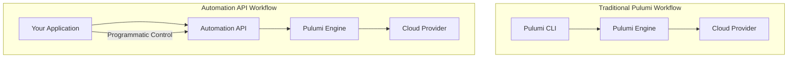
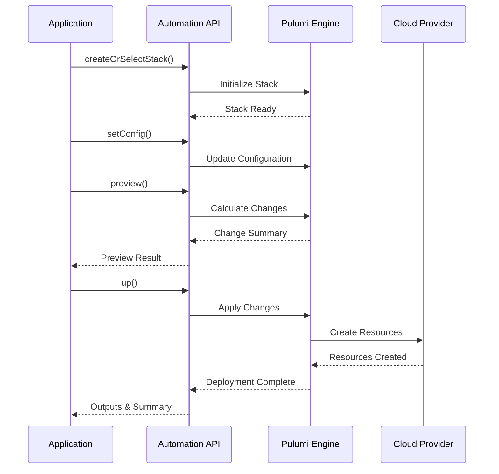
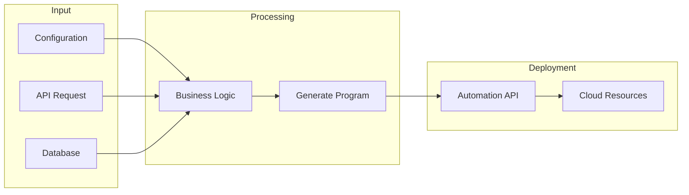
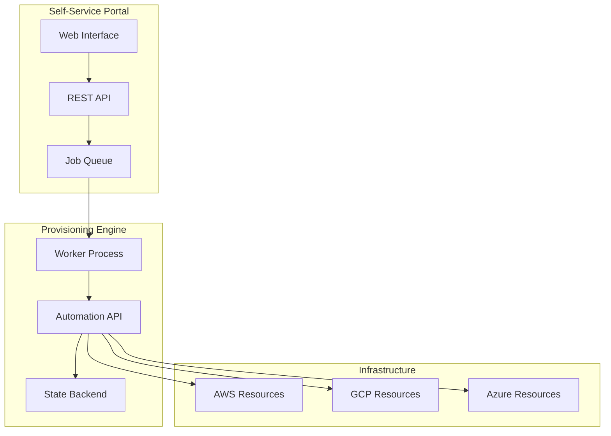
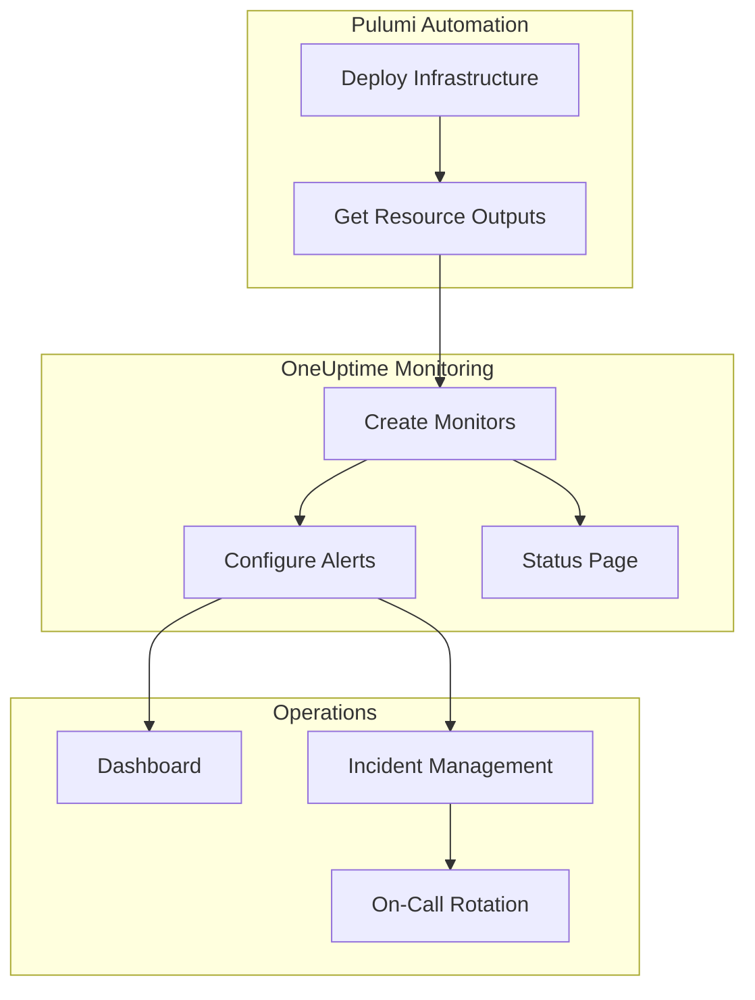

# How to Use Pulumi Automation API

Author: [nawazdhandala](https://www.github.com/nawazdhandala)

Tags: Pulumi, Infrastructure as Code, Automation API, DevOps, Dynamic Infrastructure, Self-Service, Platform Engineering

Description: Learn how to use the Pulumi Automation API to build programmatic infrastructure deployments, self-service platforms, and dynamic infrastructure provisioning systems using familiar programming languages.

---

> "Infrastructure as Code is powerful, but Infrastructure as Software is transformative. The Automation API lets you treat infrastructure provisioning as just another function call in your application."
> -- Joe Duffy, CEO of Pulumi

The Pulumi Automation API takes Infrastructure as Code to the next level by allowing you to embed Pulumi programs directly into your applications. Instead of running CLI commands, you can programmatically create, update, and destroy infrastructure using the same languages you use for application development.

## What is the Pulumi Automation API?

The Automation API is a programmatic interface for running Pulumi programs. It exposes the full power of the Pulumi engine as a library, enabling you to build custom infrastructure automation tools, self-service platforms, and dynamic provisioning systems.



### Key Capabilities

| Feature | Description |
|---------|-------------|
| Inline Programs | Define infrastructure in your application code |
| Local Programs | Reference existing Pulumi projects |
| Stack Management | Create, select, and destroy stacks programmatically |
| Configuration | Set and manage stack configuration dynamically |
| Secrets | Handle sensitive values securely |
| State Management | Use local or remote backends |

## Getting Started with Automation API

### Installation

```bash
# TypeScript/JavaScript
npm install @pulumi/pulumi @pulumi/aws

# Python
pip install pulumi pulumi-aws

# Go
go get github.com/pulumi/pulumi/sdk/v3/go/auto
```

### Your First Inline Program (TypeScript)

```typescript
// infrastructure-automation.ts
// This example demonstrates creating AWS S3 infrastructure programmatically
// using the Pulumi Automation API with an inline program definition

import * as pulumi from "@pulumi/pulumi";
import * as aws from "@pulumi/aws";
import {
    LocalWorkspace,
    InlineProgramArgs,
    Stack,
} from "@pulumi/pulumi/automation";

// Define the inline Pulumi program
// This function contains the infrastructure definition that would
// normally be in a separate Pulumi project
const pulumiProgram = async () => {
    // Create an S3 bucket with versioning enabled
    const bucket = new aws.s3.Bucket("automation-bucket", {
        versioning: {
            enabled: true,
        },
        tags: {
            Environment: "automation-demo",
            ManagedBy: "pulumi-automation-api",
        },
    });

    // Export the bucket name and ARN for use in the calling application
    return {
        bucketName: bucket.id,
        bucketArn: bucket.arn,
    };
};

async function main() {
    // Define the inline program arguments
    // projectName: identifies the project (like package.json name)
    // stackName: identifies the environment (dev, staging, prod)
    // program: the async function containing infrastructure code
    const args: InlineProgramArgs = {
        projectName: "automation-demo",
        stackName: "dev",
        program: pulumiProgram,
    };

    // Create or select the stack using LocalWorkspace
    // createOrSelectStack will create the stack if it doesn't exist
    // or select it if it already exists
    const stack = await LocalWorkspace.createOrSelectStack(args);

    console.log("Successfully initialized stack");

    // Set AWS region configuration
    // This is equivalent to running: pulumi config set aws:region us-west-2
    await stack.setConfig("aws:region", { value: "us-west-2" });

    // Run pulumi up to deploy the infrastructure
    // onOutput callback streams the deployment logs to console
    console.log("Deploying infrastructure...");
    const upResult = await stack.up({ onOutput: console.log });

    // Access the outputs from the deployment
    console.log(`Bucket Name: ${upResult.outputs.bucketName.value}`);
    console.log(`Bucket ARN: ${upResult.outputs.bucketArn.value}`);
    console.log(`Update Summary: ${JSON.stringify(upResult.summary)}`);
}

main().catch(console.error);
```

### Inline Program (Python)

```python
# infrastructure_automation.py
# Python implementation of Pulumi Automation API
# Demonstrates programmatic infrastructure deployment

import pulumi
import pulumi_aws as aws
from pulumi import automation as auto


def pulumi_program():
    """
    Define the infrastructure resources.
    This function is called by the Automation API during deployment.
    All Pulumi resources should be created within this function.
    """
    # Create an S3 bucket with server-side encryption
    bucket = aws.s3.Bucket(
        "automation-bucket",
        versioning=aws.s3.BucketVersioningArgs(
            enabled=True,
        ),
        server_side_encryption_configuration=aws.s3.BucketServerSideEncryptionConfigurationArgs(
            rule=aws.s3.BucketServerSideEncryptionConfigurationRuleArgs(
                apply_server_side_encryption_by_default=aws.s3.BucketServerSideEncryptionConfigurationRuleApplyServerSideEncryptionByDefaultArgs(
                    sse_algorithm="AES256",
                ),
            ),
        ),
        tags={
            "Environment": "automation-demo",
            "ManagedBy": "pulumi-automation-api",
        },
    )

    # Export outputs that can be retrieved after deployment
    pulumi.export("bucket_name", bucket.id)
    pulumi.export("bucket_arn", bucket.arn)


def main():
    # Define project and stack names
    project_name = "automation-demo"
    stack_name = "dev"

    # Create or select the stack
    # work_dir=None uses an in-memory workspace for inline programs
    stack = auto.create_or_select_stack(
        stack_name=stack_name,
        project_name=project_name,
        program=pulumi_program,
    )

    print("Successfully initialized stack")

    # Configure the AWS region
    stack.set_config("aws:region", auto.ConfigValue(value="us-west-2"))

    # Preview the deployment (equivalent to pulumi preview)
    print("Previewing changes...")
    preview_result = stack.preview(on_output=print)
    print(f"Preview complete: {preview_result.change_summary}")

    # Deploy the infrastructure (equivalent to pulumi up)
    print("Deploying infrastructure...")
    up_result = stack.up(on_output=print)

    # Retrieve and display outputs
    print(f"Bucket Name: {up_result.outputs['bucket_name'].value}")
    print(f"Bucket ARN: {up_result.outputs['bucket_arn'].value}")


if __name__ == "__main__":
    main()
```

## Programmatic Deployments

The Automation API enables sophisticated deployment workflows that go beyond simple CLI commands.



### Handling Deployment Lifecycle

```typescript
// deployment-lifecycle.ts
// Comprehensive example showing full deployment lifecycle management
// including preview, deploy, refresh, and destroy operations

import {
    LocalWorkspace,
    Stack,
    UpResult,
    PreviewResult,
    DestroyResult,
    OutputMap,
} from "@pulumi/pulumi/automation";
import * as pulumi from "@pulumi/pulumi";
import * as aws from "@pulumi/aws";

// Infrastructure definition for a web application stack
const webAppProgram = async () => {
    // Create a VPC for the application
    const vpc = new aws.ec2.Vpc("app-vpc", {
        cidrBlock: "10.0.0.0/16",
        enableDnsHostnames: true,
        enableDnsSupport: true,
        tags: { Name: "app-vpc" },
    });

    // Create public subnet
    const publicSubnet = new aws.ec2.Subnet("public-subnet", {
        vpcId: vpc.id,
        cidrBlock: "10.0.1.0/24",
        availabilityZone: "us-west-2a",
        mapPublicIpOnLaunch: true,
        tags: { Name: "public-subnet" },
    });

    // Create security group for web traffic
    const webSg = new aws.ec2.SecurityGroup("web-sg", {
        vpcId: vpc.id,
        description: "Allow HTTP and HTTPS traffic",
        ingress: [
            { protocol: "tcp", fromPort: 80, toPort: 80, cidrBlocks: ["0.0.0.0/0"] },
            { protocol: "tcp", fromPort: 443, toPort: 443, cidrBlocks: ["0.0.0.0/0"] },
        ],
        egress: [
            { protocol: "-1", fromPort: 0, toPort: 0, cidrBlocks: ["0.0.0.0/0"] },
        ],
        tags: { Name: "web-sg" },
    });

    return {
        vpcId: vpc.id,
        subnetId: publicSubnet.id,
        securityGroupId: webSg.id,
    };
};

// Deployment manager class encapsulating all stack operations
class DeploymentManager {
    private stack: Stack | null = null;
    private projectName: string;
    private stackName: string;

    constructor(projectName: string, stackName: string) {
        this.projectName = projectName;
        this.stackName = stackName;
    }

    // Initialize the stack - must be called before other operations
    async initialize(): Promise<void> {
        this.stack = await LocalWorkspace.createOrSelectStack({
            projectName: this.projectName,
            stackName: this.stackName,
            program: webAppProgram,
        });

        // Set required configuration
        await this.stack.setConfig("aws:region", { value: "us-west-2" });
        console.log(`Stack ${this.stackName} initialized`);
    }

    // Preview changes without applying them
    async preview(): Promise<PreviewResult> {
        if (!this.stack) throw new Error("Stack not initialized");

        console.log("Running preview...");
        const result = await this.stack.preview({
            onOutput: console.log,
            // Optionally show detailed diff
            diff: true,
        });

        console.log(`Preview complete. Changes: ${JSON.stringify(result.changeSummary)}`);
        return result;
    }

    // Deploy the infrastructure
    async deploy(): Promise<UpResult> {
        if (!this.stack) throw new Error("Stack not initialized");

        console.log("Deploying infrastructure...");
        const result = await this.stack.up({
            onOutput: console.log,
            // Automatically approve changes (use with caution in production)
            // In production, you might want to require manual approval
        });

        console.log(`Deployment complete.`);
        console.log(`Resources created: ${result.summary.resourceChanges?.create || 0}`);
        console.log(`Resources updated: ${result.summary.resourceChanges?.update || 0}`);

        return result;
    }

    // Refresh state to detect drift
    async refresh(): Promise<void> {
        if (!this.stack) throw new Error("Stack not initialized");

        console.log("Refreshing stack state...");
        await this.stack.refresh({ onOutput: console.log });
        console.log("Refresh complete");
    }

    // Get current outputs without deploying
    async getOutputs(): Promise<OutputMap> {
        if (!this.stack) throw new Error("Stack not initialized");
        return await this.stack.outputs();
    }

    // Destroy all resources
    async destroy(): Promise<DestroyResult> {
        if (!this.stack) throw new Error("Stack not initialized");

        console.log("Destroying infrastructure...");
        const result = await this.stack.destroy({ onOutput: console.log });

        console.log(`Destroy complete.`);
        console.log(`Resources deleted: ${result.summary.resourceChanges?.delete || 0}`);

        return result;
    }

    // Remove the stack entirely (after destroy)
    async removeStack(): Promise<void> {
        if (!this.stack) throw new Error("Stack not initialized");

        const workspace = this.stack.workspace;
        await workspace.removeStack(this.stackName);
        console.log(`Stack ${this.stackName} removed`);
    }
}

// Usage example
async function main() {
    const manager = new DeploymentManager("web-application", "dev");

    try {
        await manager.initialize();

        // Preview changes first
        await manager.preview();

        // Deploy if preview looks good
        const deployResult = await manager.deploy();
        console.log("Outputs:", deployResult.outputs);

        // Later: refresh to check for drift
        await manager.refresh();

        // Get outputs at any time
        const outputs = await manager.getOutputs();
        console.log("Current outputs:", outputs);

    } catch (error) {
        console.error("Deployment failed:", error);
        throw error;
    }
}

main();
```

## Dynamic Infrastructure

One of the most powerful features of the Automation API is the ability to generate infrastructure dynamically based on runtime conditions.



### Dynamic Resource Generation

```typescript
// dynamic-infrastructure.ts
// This example demonstrates generating infrastructure dynamically
// based on configuration input - useful for multi-tenant platforms

import * as pulumi from "@pulumi/pulumi";
import * as aws from "@pulumi/aws";
import { LocalWorkspace } from "@pulumi/pulumi/automation";

// Define the structure for tenant configuration
interface TenantConfig {
    name: string;
    tier: "basic" | "standard" | "premium";
    features: {
        database: boolean;
        cache: boolean;
        cdn: boolean;
    };
    region: string;
}

// Map tiers to resource configurations
const tierConfigs = {
    basic: {
        instanceType: "t3.micro",
        dbInstanceClass: "db.t3.micro",
        cacheNodeType: "cache.t3.micro",
    },
    standard: {
        instanceType: "t3.small",
        dbInstanceClass: "db.t3.small",
        cacheNodeType: "cache.t3.small",
    },
    premium: {
        instanceType: "t3.medium",
        dbInstanceClass: "db.t3.medium",
        cacheNodeType: "cache.t3.medium",
    },
};

// Factory function that creates a Pulumi program based on tenant config
function createTenantProgram(tenant: TenantConfig) {
    // Return an async function that defines the infrastructure
    return async () => {
        const config = tierConfigs[tenant.tier];
        const outputs: Record<string, pulumi.Output<string>> = {};

        // Create VPC for tenant isolation
        const vpc = new aws.ec2.Vpc(`${tenant.name}-vpc`, {
            cidrBlock: "10.0.0.0/16",
            enableDnsHostnames: true,
            tags: {
                Name: `${tenant.name}-vpc`,
                Tenant: tenant.name,
                Tier: tenant.tier,
            },
        });
        outputs.vpcId = vpc.id;

        // Create subnets
        const publicSubnet = new aws.ec2.Subnet(`${tenant.name}-public`, {
            vpcId: vpc.id,
            cidrBlock: "10.0.1.0/24",
            mapPublicIpOnLaunch: true,
            tags: { Name: `${tenant.name}-public`, Tenant: tenant.name },
        });

        const privateSubnet = new aws.ec2.Subnet(`${tenant.name}-private`, {
            vpcId: vpc.id,
            cidrBlock: "10.0.2.0/24",
            tags: { Name: `${tenant.name}-private`, Tenant: tenant.name },
        });

        // Conditionally create database if enabled
        if (tenant.features.database) {
            const dbSubnetGroup = new aws.rds.SubnetGroup(`${tenant.name}-db-subnet`, {
                subnetIds: [privateSubnet.id],
                tags: { Tenant: tenant.name },
            });

            const database = new aws.rds.Instance(`${tenant.name}-db`, {
                instanceClass: config.dbInstanceClass,
                allocatedStorage: tenant.tier === "premium" ? 100 : 20,
                engine: "postgres",
                engineVersion: "15",
                dbName: tenant.name.replace(/-/g, "_"),
                username: "admin",
                password: pulumi.secret("change-me-in-production"),
                dbSubnetGroupName: dbSubnetGroup.name,
                skipFinalSnapshot: true,
                tags: { Tenant: tenant.name, Tier: tenant.tier },
            });

            outputs.dbEndpoint = database.endpoint;
        }

        // Conditionally create cache if enabled
        if (tenant.features.cache) {
            const cacheSubnetGroup = new aws.elasticache.SubnetGroup(
                `${tenant.name}-cache-subnet`,
                {
                    subnetIds: [privateSubnet.id],
                    tags: { Tenant: tenant.name },
                }
            );

            const cache = new aws.elasticache.Cluster(`${tenant.name}-cache`, {
                engine: "redis",
                nodeType: config.cacheNodeType,
                numCacheNodes: 1,
                subnetGroupName: cacheSubnetGroup.name,
                tags: { Tenant: tenant.name, Tier: tenant.tier },
            });

            outputs.cacheEndpoint = cache.cacheNodes.apply(
                (nodes) => nodes[0]?.address || ""
            );
        }

        // Conditionally create CDN if enabled
        if (tenant.features.cdn) {
            const bucket = new aws.s3.Bucket(`${tenant.name}-static`, {
                tags: { Tenant: tenant.name },
            });

            const cdn = new aws.cloudfront.Distribution(`${tenant.name}-cdn`, {
                enabled: true,
                origins: [
                    {
                        domainName: bucket.bucketRegionalDomainName,
                        originId: "s3Origin",
                    },
                ],
                defaultCacheBehavior: {
                    allowedMethods: ["GET", "HEAD"],
                    cachedMethods: ["GET", "HEAD"],
                    targetOriginId: "s3Origin",
                    viewerProtocolPolicy: "redirect-to-https",
                    forwardedValues: {
                        queryString: false,
                        cookies: { forward: "none" },
                    },
                },
                restrictions: {
                    geoRestriction: {
                        restrictionType: "none",
                    },
                },
                viewerCertificate: {
                    cloudfrontDefaultCertificate: true,
                },
                tags: { Tenant: tenant.name },
            });

            outputs.cdnDomain = cdn.domainName;
        }

        return outputs;
    };
}

// Deploy infrastructure for a tenant
async function deployTenant(tenant: TenantConfig): Promise<void> {
    console.log(`Deploying infrastructure for tenant: ${tenant.name}`);

    // Create the dynamic program based on tenant configuration
    const program = createTenantProgram(tenant);

    // Create or select the stack for this tenant
    const stack = await LocalWorkspace.createOrSelectStack({
        projectName: "multi-tenant-platform",
        stackName: `tenant-${tenant.name}`,
        program: program,
    });

    // Configure the region based on tenant preference
    await stack.setConfig("aws:region", { value: tenant.region });

    // Deploy the infrastructure
    const result = await stack.up({ onOutput: console.log });

    console.log(`Tenant ${tenant.name} deployment complete`);
    console.log("Outputs:", result.outputs);
}

// Example: Deploy multiple tenants with different configurations
async function main() {
    const tenants: TenantConfig[] = [
        {
            name: "acme-corp",
            tier: "premium",
            features: { database: true, cache: true, cdn: true },
            region: "us-west-2",
        },
        {
            name: "startup-inc",
            tier: "basic",
            features: { database: true, cache: false, cdn: false },
            region: "us-east-1",
        },
        {
            name: "enterprise-llc",
            tier: "standard",
            features: { database: true, cache: true, cdn: false },
            region: "eu-west-1",
        },
    ];

    // Deploy tenants sequentially (or parallelize with Promise.all for speed)
    for (const tenant of tenants) {
        await deployTenant(tenant);
    }
}

main();
```

## Building Self-Service Platforms

The Automation API is ideal for building internal developer platforms and self-service portals.



### REST API for Self-Service Infrastructure

```typescript
// self-service-api.ts
// Express.js API that exposes infrastructure provisioning as a service
// Enables developers to request infrastructure through a simple REST API

import express, { Request, Response } from "express";
import { LocalWorkspace, Stack } from "@pulumi/pulumi/automation";
import * as pulumi from "@pulumi/pulumi";
import * as aws from "@pulumi/aws";

const app = express();
app.use(express.json());

// In-memory store for tracking deployments (use a database in production)
const deployments = new Map<string, {
    status: string;
    outputs?: Record<string, any>;
    error?: string;
}>();

// Environment template definitions
interface EnvironmentTemplate {
    name: string;
    description: string;
    program: () => Promise<Record<string, pulumi.Output<any>>>;
}

// Define available environment templates
const templates: Record<string, EnvironmentTemplate> = {
    "web-app": {
        name: "Web Application",
        description: "EC2 instance with ALB and S3 bucket for static assets",
        program: async () => {
            const bucket = new aws.s3.Bucket("static-assets", {
                website: {
                    indexDocument: "index.html",
                },
            });

            const sg = new aws.ec2.SecurityGroup("web-sg", {
                ingress: [
                    { protocol: "tcp", fromPort: 80, toPort: 80, cidrBlocks: ["0.0.0.0/0"] },
                ],
                egress: [
                    { protocol: "-1", fromPort: 0, toPort: 0, cidrBlocks: ["0.0.0.0/0"] },
                ],
            });

            const instance = new aws.ec2.Instance("web-server", {
                ami: "ami-0c55b159cbfafe1f0", // Amazon Linux 2
                instanceType: "t3.micro",
                vpcSecurityGroupIds: [sg.id],
                tags: { Name: "web-server" },
            });

            return {
                instanceId: instance.id,
                publicIp: instance.publicIp,
                bucketName: bucket.id,
                websiteUrl: bucket.websiteEndpoint,
            };
        },
    },
    "data-pipeline": {
        name: "Data Pipeline",
        description: "S3 bucket, Lambda function, and SQS queue for data processing",
        program: async () => {
            const inputBucket = new aws.s3.Bucket("input-bucket");
            const outputBucket = new aws.s3.Bucket("output-bucket");

            const queue = new aws.sqs.Queue("processing-queue", {
                visibilityTimeoutSeconds: 300,
            });

            const lambdaRole = new aws.iam.Role("lambda-role", {
                assumeRolePolicy: JSON.stringify({
                    Version: "2012-10-17",
                    Statement: [{
                        Action: "sts:AssumeRole",
                        Principal: { Service: "lambda.amazonaws.com" },
                        Effect: "Allow",
                    }],
                }),
            });

            return {
                inputBucketName: inputBucket.id,
                outputBucketName: outputBucket.id,
                queueUrl: queue.url,
                lambdaRoleArn: lambdaRole.arn,
            };
        },
    },
};

// List available templates
app.get("/api/templates", (req: Request, res: Response) => {
    const templateList = Object.entries(templates).map(([id, template]) => ({
        id,
        name: template.name,
        description: template.description,
    }));
    res.json(templateList);
});

// Request a new environment
app.post("/api/environments", async (req: Request, res: Response) => {
    const { templateId, name, region = "us-west-2" } = req.body;

    // Validate input
    if (!templateId || !name) {
        return res.status(400).json({ error: "templateId and name are required" });
    }

    const template = templates[templateId];
    if (!template) {
        return res.status(404).json({ error: `Template ${templateId} not found` });
    }

    // Generate unique deployment ID
    const deploymentId = `${name}-${Date.now()}`;

    // Initialize deployment status
    deployments.set(deploymentId, { status: "pending" });

    // Start deployment asynchronously
    // In production, use a proper job queue (Bull, RabbitMQ, etc.)
    deployInBackground(deploymentId, templateId, name, region);

    res.status(202).json({
        deploymentId,
        status: "pending",
        message: "Deployment started",
    });
});

// Check deployment status
app.get("/api/environments/:deploymentId", (req: Request, res: Response) => {
    const { deploymentId } = req.params;
    const deployment = deployments.get(deploymentId);

    if (!deployment) {
        return res.status(404).json({ error: "Deployment not found" });
    }

    res.json({
        deploymentId,
        ...deployment,
    });
});

// Destroy an environment
app.delete("/api/environments/:deploymentId", async (req: Request, res: Response) => {
    const { deploymentId } = req.params;
    const deployment = deployments.get(deploymentId);

    if (!deployment) {
        return res.status(404).json({ error: "Deployment not found" });
    }

    // Update status and start destruction
    deployments.set(deploymentId, { status: "destroying" });
    destroyInBackground(deploymentId);

    res.json({
        deploymentId,
        status: "destroying",
        message: "Destruction started",
    });
});

// Background deployment function
async function deployInBackground(
    deploymentId: string,
    templateId: string,
    name: string,
    region: string
): Promise<void> {
    try {
        deployments.set(deploymentId, { status: "deploying" });

        const template = templates[templateId];
        const stack = await LocalWorkspace.createOrSelectStack({
            projectName: "self-service-platform",
            stackName: deploymentId,
            program: template.program,
        });

        await stack.setConfig("aws:region", { value: region });

        const result = await stack.up({ onOutput: console.log });

        // Extract output values
        const outputs: Record<string, any> = {};
        for (const [key, output] of Object.entries(result.outputs)) {
            outputs[key] = output.value;
        }

        deployments.set(deploymentId, {
            status: "complete",
            outputs,
        });

        console.log(`Deployment ${deploymentId} complete`);
    } catch (error) {
        const errorMessage = error instanceof Error ? error.message : "Unknown error";
        deployments.set(deploymentId, {
            status: "failed",
            error: errorMessage,
        });
        console.error(`Deployment ${deploymentId} failed:`, error);
    }
}

// Background destruction function
async function destroyInBackground(deploymentId: string): Promise<void> {
    try {
        const stack = await LocalWorkspace.selectStack({
            projectName: "self-service-platform",
            stackName: deploymentId,
            // Program is required but not used for destroy
            program: async () => ({}),
        });

        await stack.destroy({ onOutput: console.log });

        // Remove the stack after destruction
        await stack.workspace.removeStack(deploymentId);

        deployments.set(deploymentId, { status: "destroyed" });
        console.log(`Deployment ${deploymentId} destroyed`);
    } catch (error) {
        const errorMessage = error instanceof Error ? error.message : "Unknown error";
        deployments.set(deploymentId, {
            status: "destroy-failed",
            error: errorMessage,
        });
        console.error(`Destruction of ${deploymentId} failed:`, error);
    }
}

// Start the server
const PORT = process.env.PORT || 3000;
app.listen(PORT, () => {
    console.log(`Self-service platform API running on port ${PORT}`);
});
```

### Using the Self-Service API

```bash
# List available templates
curl http://localhost:3000/api/templates

# Request a new web application environment
curl -X POST http://localhost:3000/api/environments \
  -H "Content-Type: application/json" \
  -d '{
    "templateId": "web-app",
    "name": "my-dev-env",
    "region": "us-west-2"
  }'

# Check deployment status
curl http://localhost:3000/api/environments/my-dev-env-1706300000000

# Destroy the environment when done
curl -X DELETE http://localhost:3000/api/environments/my-dev-env-1706300000000
```

## Working with Stack References

For complex architectures, you can reference outputs from other stacks.

```typescript
// stack-references.ts
// Demonstrates how to reference outputs from other stacks
// Useful for layered infrastructure architectures

import { LocalWorkspace, StackReference } from "@pulumi/pulumi/automation";
import * as pulumi from "@pulumi/pulumi";
import * as aws from "@pulumi/aws";

// Base infrastructure stack program
const networkStackProgram = async () => {
    const vpc = new aws.ec2.Vpc("main-vpc", {
        cidrBlock: "10.0.0.0/16",
        enableDnsHostnames: true,
    });

    const publicSubnet = new aws.ec2.Subnet("public-subnet", {
        vpcId: vpc.id,
        cidrBlock: "10.0.1.0/24",
        mapPublicIpOnLaunch: true,
    });

    const privateSubnet = new aws.ec2.Subnet("private-subnet", {
        vpcId: vpc.id,
        cidrBlock: "10.0.2.0/24",
    });

    // Export values that other stacks will reference
    return {
        vpcId: vpc.id,
        publicSubnetId: publicSubnet.id,
        privateSubnetId: privateSubnet.id,
    };
};

// Application stack that references the network stack
const createAppStackProgram = (networkStackRef: StackReference) => {
    return async () => {
        // Get outputs from the network stack
        const vpcId = networkStackRef.getOutput("vpcId");
        const publicSubnetId = networkStackRef.getOutput("publicSubnetId");

        // Create security group in the referenced VPC
        const appSg = new aws.ec2.SecurityGroup("app-sg", {
            vpcId: vpcId,
            ingress: [
                { protocol: "tcp", fromPort: 80, toPort: 80, cidrBlocks: ["0.0.0.0/0"] },
            ],
            egress: [
                { protocol: "-1", fromPort: 0, toPort: 0, cidrBlocks: ["0.0.0.0/0"] },
            ],
        });

        // Create instance in the referenced subnet
        const instance = new aws.ec2.Instance("app-server", {
            ami: "ami-0c55b159cbfafe1f0",
            instanceType: "t3.micro",
            subnetId: publicSubnetId,
            vpcSecurityGroupIds: [appSg.id],
            tags: { Name: "app-server" },
        });

        return {
            instanceId: instance.id,
            publicIp: instance.publicIp,
        };
    };
};

async function deployLayeredArchitecture() {
    // First, deploy the network stack
    console.log("Deploying network stack...");
    const networkStack = await LocalWorkspace.createOrSelectStack({
        projectName: "layered-infra",
        stackName: "network",
        program: networkStackProgram,
    });

    await networkStack.setConfig("aws:region", { value: "us-west-2" });
    await networkStack.up({ onOutput: console.log });

    // Create a stack reference to the network stack
    // This allows the app stack to access network stack outputs
    const networkRef = new StackReference("network-ref", {
        name: "layered-infra/network",
    });

    // Deploy the application stack using network stack outputs
    console.log("Deploying application stack...");
    const appStack = await LocalWorkspace.createOrSelectStack({
        projectName: "layered-infra",
        stackName: "application",
        program: createAppStackProgram(networkRef),
    });

    await appStack.setConfig("aws:region", { value: "us-west-2" });
    const appResult = await appStack.up({ onOutput: console.log });

    console.log("Application deployed:", appResult.outputs);
}

deployLayeredArchitecture();
```

## Error Handling and Retries

Production systems need robust error handling.

```typescript
// error-handling.ts
// Demonstrates robust error handling patterns for production use

import {
    LocalWorkspace,
    Stack,
    ConcurrentUpdateError,
    StackNotFoundError,
    StackAlreadyExistsError,
} from "@pulumi/pulumi/automation";

// Retry configuration
interface RetryConfig {
    maxAttempts: number;
    baseDelayMs: number;
    maxDelayMs: number;
}

const defaultRetryConfig: RetryConfig = {
    maxAttempts: 3,
    baseDelayMs: 1000,
    maxDelayMs: 30000,
};

// Sleep helper with exponential backoff
async function sleep(ms: number): Promise<void> {
    return new Promise((resolve) => setTimeout(resolve, ms));
}

// Calculate exponential backoff delay
function calculateDelay(attempt: number, config: RetryConfig): number {
    const delay = config.baseDelayMs * Math.pow(2, attempt);
    return Math.min(delay, config.maxDelayMs);
}

// Retry wrapper for Pulumi operations
async function withRetry<T>(
    operation: () => Promise<T>,
    operationName: string,
    config: RetryConfig = defaultRetryConfig
): Promise<T> {
    let lastError: Error | undefined;

    for (let attempt = 0; attempt < config.maxAttempts; attempt++) {
        try {
            return await operation();
        } catch (error) {
            lastError = error as Error;

            // Handle specific Pulumi errors
            if (error instanceof ConcurrentUpdateError) {
                // Another update is in progress, wait and retry
                console.log(
                    `Concurrent update detected for ${operationName}, ` +
                    `retrying in ${calculateDelay(attempt, config)}ms...`
                );
                await sleep(calculateDelay(attempt, config));
                continue;
            }

            if (error instanceof StackNotFoundError) {
                // Stack doesn't exist, don't retry
                throw error;
            }

            if (error instanceof StackAlreadyExistsError) {
                // Stack already exists, don't retry
                throw error;
            }

            // For other errors, check if retryable
            const errorMessage = (error as Error).message || "";
            if (
                errorMessage.includes("rate limit") ||
                errorMessage.includes("throttl") ||
                errorMessage.includes("timeout")
            ) {
                console.log(
                    `Retryable error for ${operationName}: ${errorMessage}, ` +
                    `retrying in ${calculateDelay(attempt, config)}ms...`
                );
                await sleep(calculateDelay(attempt, config));
                continue;
            }

            // Non-retryable error
            throw error;
        }
    }

    throw new Error(
        `${operationName} failed after ${config.maxAttempts} attempts: ${lastError?.message}`
    );
}

// Safe deployment function with comprehensive error handling
async function safeDeployment(
    projectName: string,
    stackName: string,
    program: () => Promise<any>,
    config: Record<string, string> = {}
): Promise<{ success: boolean; outputs?: Record<string, any>; error?: string }> {
    let stack: Stack | undefined;

    try {
        // Initialize stack with retry
        stack = await withRetry(
            () =>
                LocalWorkspace.createOrSelectStack({
                    projectName,
                    stackName,
                    program,
                }),
            "stack initialization"
        );

        // Set configuration
        for (const [key, value] of Object.entries(config)) {
            await stack.setConfig(key, { value });
        }

        // Attempt deployment with retry
        const result = await withRetry(
            () => stack!.up({ onOutput: console.log }),
            "deployment"
        );

        // Extract outputs
        const outputs: Record<string, any> = {};
        for (const [key, output] of Object.entries(result.outputs)) {
            outputs[key] = output.value;
        }

        return { success: true, outputs };
    } catch (error) {
        const errorMessage = error instanceof Error ? error.message : "Unknown error";
        console.error(`Deployment failed: ${errorMessage}`);

        // Attempt to get stack state for debugging
        if (stack) {
            try {
                const info = await stack.info();
                console.log("Stack state at failure:", info);
            } catch {
                // Ignore errors getting stack info
            }
        }

        return { success: false, error: errorMessage };
    }
}

// Usage example
async function main() {
    const result = await safeDeployment(
        "my-project",
        "production",
        async () => {
            // Your infrastructure code here
            return { message: "deployed" };
        },
        { "aws:region": "us-west-2" }
    );

    if (result.success) {
        console.log("Deployment successful:", result.outputs);
    } else {
        console.error("Deployment failed:", result.error);
        process.exit(1);
    }
}

main();
```

## Monitoring Your Infrastructure

After deploying infrastructure with Pulumi Automation API, monitoring becomes crucial. [OneUptime](https://oneuptime.com) provides comprehensive monitoring for your dynamically provisioned resources.



### Integrating Monitoring into Deployments

```typescript
// monitoring-integration.ts
// Automatically configure OneUptime monitoring after infrastructure deployment

import { LocalWorkspace } from "@pulumi/pulumi/automation";
import * as pulumi from "@pulumi/pulumi";
import * as aws from "@pulumi/aws";

// OneUptime API client (simplified)
class OneUptimeClient {
    private apiKey: string;
    private baseUrl: string;

    constructor(apiKey: string, baseUrl = "https://oneuptime.com/api") {
        this.apiKey = apiKey;
        this.baseUrl = baseUrl;
    }

    async createMonitor(config: {
        name: string;
        url: string;
        type: "website" | "api" | "ping";
        interval: number;
    }): Promise<string> {
        // In production, make actual API calls to OneUptime
        console.log(`Creating OneUptime monitor: ${config.name} for ${config.url}`);

        const response = await fetch(`${this.baseUrl}/monitors`, {
            method: "POST",
            headers: {
                "Content-Type": "application/json",
                Authorization: `Bearer ${this.apiKey}`,
            },
            body: JSON.stringify(config),
        });

        const data = await response.json();
        return data.id;
    }
}

// Infrastructure program that exports endpoints for monitoring
const webServiceProgram = async () => {
    // Create ALB for the service
    const alb = new aws.lb.LoadBalancer("web-alb", {
        loadBalancerType: "application",
        securityGroups: [], // Add your security groups
        subnets: [], // Add your subnets
    });

    // Create target group
    const targetGroup = new aws.lb.TargetGroup("web-tg", {
        port: 80,
        protocol: "HTTP",
        vpcId: "", // Add your VPC ID
        healthCheck: {
            path: "/health",
            healthyThreshold: 2,
            unhealthyThreshold: 3,
        },
    });

    // Create listener
    const listener = new aws.lb.Listener("web-listener", {
        loadBalancerArn: alb.arn,
        port: 443,
        protocol: "HTTPS",
        defaultActions: [
            {
                type: "forward",
                targetGroupArn: targetGroup.arn,
            },
        ],
    });

    // Return endpoints that need monitoring
    return {
        loadBalancerDns: alb.dnsName,
        healthCheckPath: pulumi.output("/health"),
        apiEndpoint: pulumi.interpolate`https://${alb.dnsName}/api`,
    };
};

// Deploy and configure monitoring
async function deployWithMonitoring() {
    const oneuptime = new OneUptimeClient(process.env.ONEUPTIME_API_KEY || "");

    // Deploy infrastructure
    const stack = await LocalWorkspace.createOrSelectStack({
        projectName: "monitored-service",
        stackName: "production",
        program: webServiceProgram,
    });

    await stack.setConfig("aws:region", { value: "us-west-2" });

    console.log("Deploying infrastructure...");
    const result = await stack.up({ onOutput: console.log });

    // Extract deployment outputs
    const loadBalancerDns = result.outputs.loadBalancerDns?.value;
    const healthCheckPath = result.outputs.healthCheckPath?.value;
    const apiEndpoint = result.outputs.apiEndpoint?.value;

    // Configure OneUptime monitors for deployed resources
    console.log("Configuring monitoring...");

    // Monitor the main endpoint
    if (loadBalancerDns) {
        await oneuptime.createMonitor({
            name: "Production - Main Service",
            url: `https://${loadBalancerDns}`,
            type: "website",
            interval: 60, // Check every minute
        });
    }

    // Monitor the health endpoint
    if (loadBalancerDns && healthCheckPath) {
        await oneuptime.createMonitor({
            name: "Production - Health Check",
            url: `https://${loadBalancerDns}${healthCheckPath}`,
            type: "api",
            interval: 30, // Check every 30 seconds
        });
    }

    // Monitor the API endpoint
    if (apiEndpoint) {
        await oneuptime.createMonitor({
            name: "Production - API",
            url: apiEndpoint,
            type: "api",
            interval: 60,
        });
    }

    console.log("Infrastructure deployed and monitoring configured!");
    console.log("View your monitors at: https://oneuptime.com/dashboard/monitors");
}

deployWithMonitoring();
```

## Best Practices

### 1. Use Environment Variables for Secrets

```typescript
// Never hardcode secrets in your programs
const program = async () => {
    const dbPassword = process.env.DB_PASSWORD;
    if (!dbPassword) {
        throw new Error("DB_PASSWORD environment variable is required");
    }

    // Use pulumi.secret() to mark values as sensitive
    const database = new aws.rds.Instance("db", {
        password: pulumi.secret(dbPassword),
        // ...
    });
};
```

### 2. Implement Proper State Management

```typescript
// Use remote backends for team collaboration
const stack = await LocalWorkspace.createOrSelectStack(
    {
        projectName: "my-project",
        stackName: "production",
        program: myProgram,
    },
    {
        // Configure S3 backend
        projectSettings: {
            name: "my-project",
            runtime: "nodejs",
            backend: {
                url: "s3://my-pulumi-state-bucket",
            },
        },
    }
);
```

### 3. Add Comprehensive Logging

```typescript
// Create a logger for tracking deployment progress
const deployWithLogging = async (stack: Stack) => {
    const startTime = Date.now();

    const result = await stack.up({
        onOutput: (output) => {
            // Parse and structure the output
            const timestamp = new Date().toISOString();
            console.log(`[${timestamp}] ${output}`);

            // Send to your logging system
            // logger.info(output, { stack: stack.name });
        },
        onEvent: (event) => {
            // Handle specific events
            if (event.resourcePreEvent) {
                console.log(`Creating: ${event.resourcePreEvent.metadata.urn}`);
            }
            if (event.diagnosticEvent) {
                console.log(`Diagnostic: ${event.diagnosticEvent.message}`);
            }
        },
    });

    const duration = Date.now() - startTime;
    console.log(`Deployment completed in ${duration}ms`);

    return result;
};
```

### 4. Implement Drift Detection

```typescript
// Regular drift detection
async function checkForDrift(stack: Stack): Promise<boolean> {
    console.log("Checking for drift...");

    const refreshResult = await stack.refresh({ onOutput: console.log });

    const hasChanges =
        refreshResult.summary.resourceChanges &&
        Object.values(refreshResult.summary.resourceChanges).some((count) => count > 0);

    if (hasChanges) {
        console.log("Drift detected! Resources have changed outside of Pulumi.");
        console.log("Changes:", refreshResult.summary.resourceChanges);
    } else {
        console.log("No drift detected.");
    }

    return hasChanges;
}
```

## Conclusion

The Pulumi Automation API transforms how you think about infrastructure. Instead of separate CLI workflows, infrastructure becomes an integral part of your applications. This enables powerful patterns like self-service platforms, dynamic multi-tenant systems, and automated provisioning pipelines.

Key takeaways:

- **Inline programs** let you define infrastructure alongside application code
- **Programmatic control** enables sophisticated deployment workflows
- **Dynamic generation** allows infrastructure to adapt to runtime conditions
- **Self-service APIs** empower developers to provision their own environments
- **Stack references** enable layered, composable architectures
- **Proper error handling** makes your automation production-ready

Combine the Automation API with [OneUptime](https://oneuptime.com) for comprehensive monitoring, and you have a complete platform for building and operating modern infrastructure.

---

*Want to monitor the infrastructure you deploy with Pulumi Automation API? [OneUptime](https://oneuptime.com) provides comprehensive monitoring, alerting, and incident management for your dynamically provisioned resources. Start monitoring today.*

**Related Reading:**

- [Introducing the OneUptime Terraform Provider](https://oneuptime.com/blog/post/2025-07-01-introducing-terraform-provider-for-oneuptime/view)
- [Kubernetes and Ceph: Break the Cloud Cartel](https://oneuptime.com/blog/post/2025-11-03-kubernetes-and-ceph-break-the-cloud-cartel/view)
- [GitOps with ArgoCD](https://oneuptime.com/blog/post/2026-01-06-kubernetes-gitops-argocd/view)
