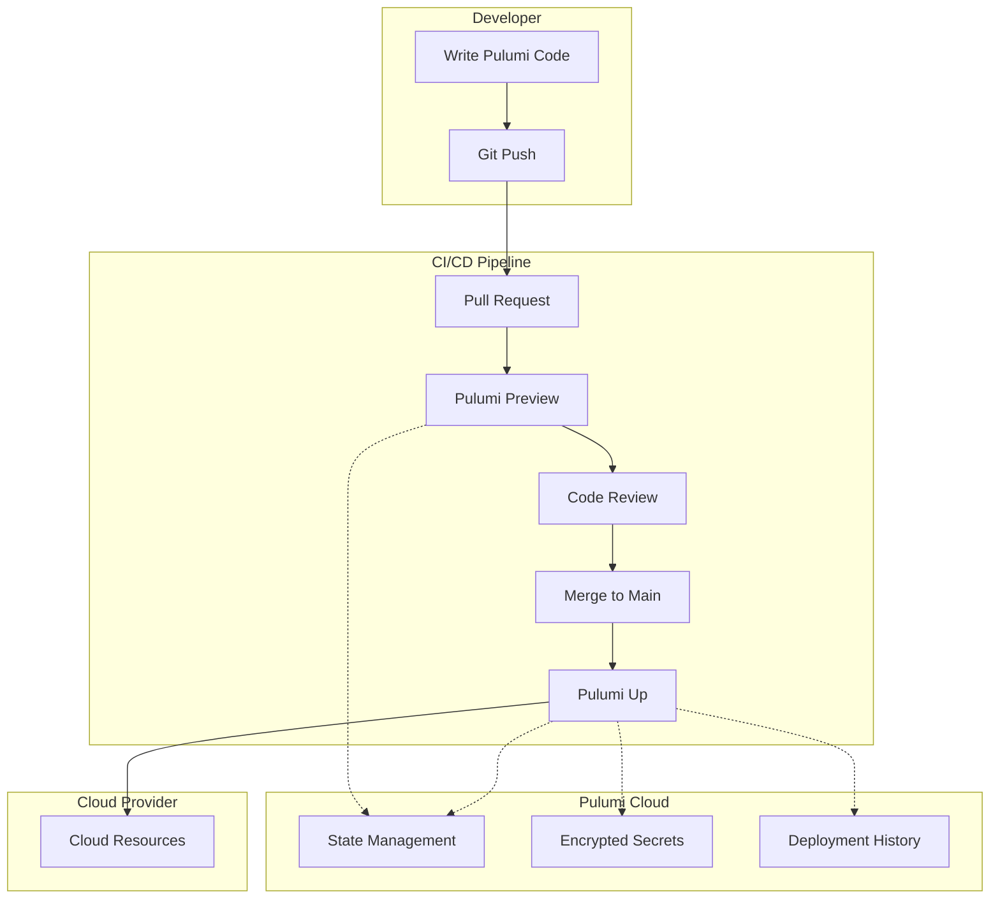
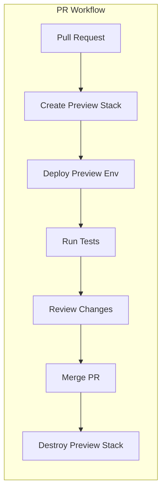
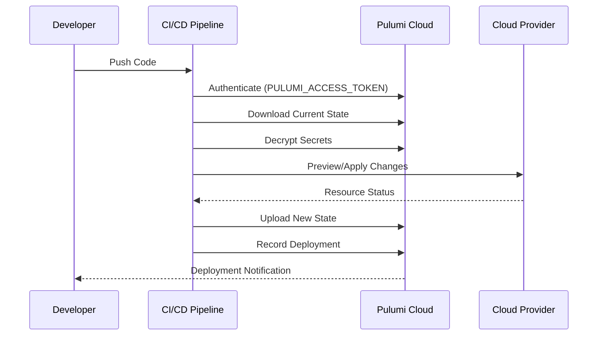

# How to Implement Pulumi CI/CD Pipelines

By [Nawaz Dhandala](https://github.com/nawazdhandala)

Tags: Pulumi, CI/CD, Infrastructure as Code, DevOps, GitHub Actions, GitLab CI, Automation, Cloud Infrastructure

Description: A comprehensive guide to implementing Pulumi CI/CD pipelines, covering GitHub Actions, GitLab CI, preview environments, Pulumi Cloud integration, and secret management for automated infrastructure deployments.

---

> **Key Insight:** Infrastructure as Code without CI/CD is just scripts in a repository. True IaC power comes from automated pipelines that preview, test, and deploy infrastructure changes with the same rigor as application code.

## Why Pulumi CI/CD?

Pulumi lets you define infrastructure using real programming languages like TypeScript, Python, Go, and C#. But running `pulumi up` from your laptop is not a sustainable workflow. CI/CD pipelines bring:

- **Consistency** - Same deployment process every time
- **Auditability** - Git history shows who changed what and when
- **Safety** - Preview changes before applying them
- **Collaboration** - PR-based workflows for infrastructure changes
- **Automation** - No manual intervention required

## Pulumi CI/CD Architecture



## GitHub Actions Integration

GitHub Actions is the most popular CI/CD platform for Pulumi. Here is a complete workflow setup.

### Basic Pulumi GitHub Actions Workflow

```yaml
# .github/workflows/pulumi.yml
# This workflow runs Pulumi preview on PRs and deploys on merge to main

name: Pulumi Infrastructure

on:
  push:
    branches:
      - main
  pull_request:
    branches:
      - main

# Ensure only one deployment runs at a time to prevent state conflicts
concurrency:
  group: pulumi-${{ github.ref }}
  cancel-in-progress: false

env:
  # Pulumi access token for state management and deployments
  PULUMI_ACCESS_TOKEN: ${{ secrets.PULUMI_ACCESS_TOKEN }}

  # Cloud provider credentials - AWS example
  AWS_ACCESS_KEY_ID: ${{ secrets.AWS_ACCESS_KEY_ID }}
  AWS_SECRET_ACCESS_KEY: ${{ secrets.AWS_SECRET_ACCESS_KEY }}
  AWS_REGION: us-east-1

jobs:
  preview:
    name: Preview Infrastructure Changes
    runs-on: ubuntu-latest
    # Only run preview on pull requests
    if: github.event_name == 'pull_request'

    steps:
      # Checkout the repository code
      - name: Checkout Code
        uses: actions/checkout@v4

      # Set up the programming language runtime
      # Using Node.js for TypeScript Pulumi programs
      - name: Setup Node.js
        uses: actions/setup-node@v4
        with:
          node-version: '20'
          cache: 'npm'

      # Install project dependencies
      - name: Install Dependencies
        run: npm ci

      # Run Pulumi preview to show planned changes
      # This adds a comment to the PR with the diff
      - name: Pulumi Preview
        uses: pulumi/actions@v5
        with:
          command: preview
          stack-name: dev
          comment-on-pr: true
          github-token: ${{ secrets.GITHUB_TOKEN }}

  deploy:
    name: Deploy Infrastructure
    runs-on: ubuntu-latest
    # Only deploy on push to main branch
    if: github.event_name == 'push' && github.ref == 'refs/heads/main'

    steps:
      - name: Checkout Code
        uses: actions/checkout@v4

      - name: Setup Node.js
        uses: actions/setup-node@v4
        with:
          node-version: '20'
          cache: 'npm'

      - name: Install Dependencies
        run: npm ci

      # Deploy the infrastructure changes
      - name: Pulumi Up
        uses: pulumi/actions@v5
        with:
          command: up
          stack-name: dev
```

### Multi-Stack Deployment Workflow

For real-world projects, you typically have multiple environments. Here is a workflow that handles staging and production deployments.

```yaml
# .github/workflows/pulumi-multi-env.yml
# Deploys to staging on main push, production on release tags

name: Pulumi Multi-Environment

on:
  push:
    branches:
      - main
    tags:
      - 'v*'
  pull_request:
    branches:
      - main

env:
  PULUMI_ACCESS_TOKEN: ${{ secrets.PULUMI_ACCESS_TOKEN }}

jobs:
  # Matrix job to preview all affected stacks
  preview:
    name: Preview ${{ matrix.stack }}
    runs-on: ubuntu-latest
    if: github.event_name == 'pull_request'

    strategy:
      # Run all previews even if one fails
      fail-fast: false
      matrix:
        stack: [staging, production]

    steps:
      - uses: actions/checkout@v4

      - name: Setup Node.js
        uses: actions/setup-node@v4
        with:
          node-version: '20'
          cache: 'npm'

      - name: Install Dependencies
        run: npm ci

      # Load environment-specific secrets
      - name: Configure AWS Credentials
        uses: aws-actions/configure-aws-credentials@v4
        with:
          aws-access-key-id: ${{ secrets[format('AWS_ACCESS_KEY_ID_{0}', matrix.stack)] }}
          aws-secret-access-key: ${{ secrets[format('AWS_SECRET_ACCESS_KEY_{0}', matrix.stack)] }}
          aws-region: us-east-1

      - name: Pulumi Preview
        uses: pulumi/actions@v5
        with:
          command: preview
          stack-name: ${{ matrix.stack }}
          comment-on-pr: true
          github-token: ${{ secrets.GITHUB_TOKEN }}

  # Deploy to staging on merge to main
  deploy-staging:
    name: Deploy to Staging
    runs-on: ubuntu-latest
    if: github.event_name == 'push' && github.ref == 'refs/heads/main'
    environment: staging

    steps:
      - uses: actions/checkout@v4

      - name: Setup Node.js
        uses: actions/setup-node@v4
        with:
          node-version: '20'
          cache: 'npm'

      - name: Install Dependencies
        run: npm ci

      - name: Configure AWS Credentials
        uses: aws-actions/configure-aws-credentials@v4
        with:
          aws-access-key-id: ${{ secrets.AWS_ACCESS_KEY_ID_STAGING }}
          aws-secret-access-key: ${{ secrets.AWS_SECRET_ACCESS_KEY_STAGING }}
          aws-region: us-east-1

      - name: Pulumi Up
        uses: pulumi/actions@v5
        with:
          command: up
          stack-name: staging

  # Deploy to production on release tags
  deploy-production:
    name: Deploy to Production
    runs-on: ubuntu-latest
    if: github.event_name == 'push' && startsWith(github.ref, 'refs/tags/v')
    environment: production

    steps:
      - uses: actions/checkout@v4

      - name: Setup Node.js
        uses: actions/setup-node@v4
        with:
          node-version: '20'
          cache: 'npm'

      - name: Install Dependencies
        run: npm ci

      - name: Configure AWS Credentials
        uses: aws-actions/configure-aws-credentials@v4
        with:
          aws-access-key-id: ${{ secrets.AWS_ACCESS_KEY_ID_PRODUCTION }}
          aws-secret-access-key: ${{ secrets.AWS_SECRET_ACCESS_KEY_PRODUCTION }}
          aws-region: us-east-1

      - name: Pulumi Up
        uses: pulumi/actions@v5
        with:
          command: up
          stack-name: production
```

## GitLab CI Integration

GitLab CI provides excellent support for Pulumi deployments with built-in environments and approval workflows.

### Basic GitLab CI Pipeline

```yaml
# .gitlab-ci.yml
# Pulumi CI/CD pipeline for GitLab

# Use a Node.js image with Pulumi pre-installed
image: pulumi/pulumi-nodejs:latest

# Define pipeline stages
stages:
  - validate
  - preview
  - deploy

# Global variables available to all jobs
variables:
  # Pulumi configuration
  PULUMI_ACCESS_TOKEN: $PULUMI_ACCESS_TOKEN

  # Disable interactive prompts
  PULUMI_SKIP_CONFIRMATIONS: "true"

# Cache node_modules between jobs for faster builds
cache:
  key: ${CI_COMMIT_REF_SLUG}
  paths:
    - node_modules/

# Install dependencies before each job
before_script:
  - npm ci

# Validate Pulumi configuration syntax
validate:
  stage: validate
  script:
    # Check that the Pulumi program compiles
    - npm run build
    # Validate stack configuration
    - pulumi stack select dev --create
    - pulumi config
  rules:
    - if: $CI_PIPELINE_SOURCE == "merge_request_event"
    - if: $CI_COMMIT_BRANCH == $CI_DEFAULT_BRANCH

# Preview changes on merge requests
preview:
  stage: preview
  script:
    - pulumi stack select dev
    # Generate preview and save as artifact
    - pulumi preview --diff --json > preview.json
    # Display human-readable summary
    - pulumi preview --diff
  artifacts:
    paths:
      - preview.json
    expire_in: 1 week
  rules:
    - if: $CI_PIPELINE_SOURCE == "merge_request_event"

# Deploy to development environment
deploy-dev:
  stage: deploy
  script:
    - pulumi stack select dev
    - pulumi up --yes
  environment:
    name: development
    url: https://dev.example.com
  rules:
    - if: $CI_COMMIT_BRANCH == $CI_DEFAULT_BRANCH
```

### GitLab CI with Multiple Environments

```yaml
# .gitlab-ci.yml
# Multi-environment Pulumi deployment pipeline

image: pulumi/pulumi-nodejs:latest

stages:
  - validate
  - preview
  - deploy-staging
  - deploy-production

variables:
  PULUMI_ACCESS_TOKEN: $PULUMI_ACCESS_TOKEN
  PULUMI_SKIP_CONFIRMATIONS: "true"

cache:
  key: ${CI_COMMIT_REF_SLUG}
  paths:
    - node_modules/

before_script:
  - npm ci

# Template for preview jobs to reduce duplication
.preview-template: &preview-template
  stage: preview
  script:
    - pulumi stack select $STACK_NAME
    - pulumi preview --diff
  rules:
    - if: $CI_PIPELINE_SOURCE == "merge_request_event"

# Template for deploy jobs
.deploy-template: &deploy-template
  script:
    - pulumi stack select $STACK_NAME
    - pulumi up --yes
    # Export stack outputs for downstream jobs
    - pulumi stack output --json > outputs.json
  artifacts:
    paths:
      - outputs.json
    expire_in: 1 day

validate:
  stage: validate
  script:
    - npm run build
    - npm run lint
    - npm test
  rules:
    - if: $CI_PIPELINE_SOURCE == "merge_request_event"
    - if: $CI_COMMIT_BRANCH == $CI_DEFAULT_BRANCH

preview-staging:
  <<: *preview-template
  variables:
    STACK_NAME: staging

preview-production:
  <<: *preview-template
  variables:
    STACK_NAME: production

deploy-staging:
  <<: *deploy-template
  stage: deploy-staging
  variables:
    STACK_NAME: staging
    # Environment-specific AWS credentials
    AWS_ACCESS_KEY_ID: $AWS_ACCESS_KEY_ID_STAGING
    AWS_SECRET_ACCESS_KEY: $AWS_SECRET_ACCESS_KEY_STAGING
  environment:
    name: staging
    url: https://staging.example.com
  rules:
    - if: $CI_COMMIT_BRANCH == $CI_DEFAULT_BRANCH

deploy-production:
  <<: *deploy-template
  stage: deploy-production
  variables:
    STACK_NAME: production
    AWS_ACCESS_KEY_ID: $AWS_ACCESS_KEY_ID_PRODUCTION
    AWS_SECRET_ACCESS_KEY: $AWS_SECRET_ACCESS_KEY_PRODUCTION
  environment:
    name: production
    url: https://example.com
  # Require manual approval for production deployments
  when: manual
  rules:
    - if: $CI_COMMIT_TAG =~ /^v\d+\.\d+\.\d+$/
```

## Preview Environments

Preview environments (also called ephemeral environments) create temporary infrastructure for each pull request. This lets you test infrastructure changes in isolation before merging.



### GitHub Actions Preview Environment

```yaml
# .github/workflows/preview-env.yml
# Creates and destroys preview environments for each PR

name: Preview Environment

on:
  pull_request:
    types: [opened, synchronize, reopened, closed]

env:
  PULUMI_ACCESS_TOKEN: ${{ secrets.PULUMI_ACCESS_TOKEN }}
  AWS_ACCESS_KEY_ID: ${{ secrets.AWS_ACCESS_KEY_ID }}
  AWS_SECRET_ACCESS_KEY: ${{ secrets.AWS_SECRET_ACCESS_KEY }}

jobs:
  # Create or update preview environment
  preview:
    name: Deploy Preview
    runs-on: ubuntu-latest
    # Only run when PR is not closed
    if: github.event.action != 'closed'

    outputs:
      # Export the preview URL for use in other jobs
      preview_url: ${{ steps.deploy.outputs.url }}

    steps:
      - uses: actions/checkout@v4

      - name: Setup Node.js
        uses: actions/setup-node@v4
        with:
          node-version: '20'
          cache: 'npm'

      - name: Install Dependencies
        run: npm ci

      # Create a unique stack name based on PR number
      - name: Create Preview Stack
        id: deploy
        run: |
          # Stack name format: preview-pr-{number}
          STACK_NAME="preview-pr-${{ github.event.pull_request.number }}"

          # Initialize stack if it does not exist
          pulumi stack select $STACK_NAME --create || true

          # Set PR-specific configuration
          pulumi config set environment preview
          pulumi config set prNumber ${{ github.event.pull_request.number }}

          # Deploy the preview environment
          pulumi up --yes

          # Get the deployed URL
          URL=$(pulumi stack output url)
          echo "url=$URL" >> $GITHUB_OUTPUT

      # Comment on PR with preview URL
      - name: Comment Preview URL
        uses: actions/github-script@v7
        with:
          script: |
            const url = '${{ steps.deploy.outputs.url }}';
            const body = `## Preview Environment Ready

            Your preview environment has been deployed:

            **URL:** ${url}

            This environment will be automatically destroyed when the PR is closed.`;

            // Find existing comment
            const { data: comments } = await github.rest.issues.listComments({
              owner: context.repo.owner,
              repo: context.repo.repo,
              issue_number: context.issue.number,
            });

            const botComment = comments.find(c =>
              c.user.type === 'Bot' && c.body.includes('Preview Environment Ready')
            );

            if (botComment) {
              // Update existing comment
              await github.rest.issues.updateComment({
                owner: context.repo.owner,
                repo: context.repo.repo,
                comment_id: botComment.id,
                body: body
              });
            } else {
              // Create new comment
              await github.rest.issues.createComment({
                owner: context.repo.owner,
                repo: context.repo.repo,
                issue_number: context.issue.number,
                body: body
              });
            }

  # Run integration tests against preview environment
  test:
    name: Test Preview
    runs-on: ubuntu-latest
    needs: preview
    if: github.event.action != 'closed'

    steps:
      - uses: actions/checkout@v4

      - name: Run Integration Tests
        run: |
          # Run tests against the preview environment
          PREVIEW_URL="${{ needs.preview.outputs.preview_url }}"
          npm run test:integration -- --base-url=$PREVIEW_URL

  # Destroy preview environment when PR is closed
  cleanup:
    name: Cleanup Preview
    runs-on: ubuntu-latest
    # Only run when PR is closed
    if: github.event.action == 'closed'

    steps:
      - uses: actions/checkout@v4

      - name: Setup Node.js
        uses: actions/setup-node@v4
        with:
          node-version: '20'
          cache: 'npm'

      - name: Install Dependencies
        run: npm ci

      - name: Destroy Preview Stack
        run: |
          STACK_NAME="preview-pr-${{ github.event.pull_request.number }}"

          # Select the preview stack
          pulumi stack select $STACK_NAME

          # Destroy all resources
          pulumi destroy --yes

          # Remove the stack
          pulumi stack rm $STACK_NAME --yes
```

## Pulumi Cloud Integration

Pulumi Cloud (formerly Pulumi Service) provides state management, secrets encryption, and deployment history. It is the recommended backend for production use.

### Deployment Flow with Pulumi Cloud



### Pulumi Cloud Configuration

```yaml
# .github/workflows/pulumi-cloud.yml
# Workflow optimized for Pulumi Cloud features

name: Pulumi Cloud Deployment

on:
  push:
    branches: [main]
  pull_request:
    branches: [main]

env:
  # Pulumi Cloud authentication
  PULUMI_ACCESS_TOKEN: ${{ secrets.PULUMI_ACCESS_TOKEN }}

jobs:
  deploy:
    name: Deploy
    runs-on: ubuntu-latest

    steps:
      - uses: actions/checkout@v4

      - name: Setup Node.js
        uses: actions/setup-node@v4
        with:
          node-version: '20'
          cache: 'npm'

      - name: Install Dependencies
        run: npm ci

      # Pulumi Cloud handles state automatically
      # No need to configure S3/GCS backends
      - name: Deploy with Pulumi Cloud
        uses: pulumi/actions@v5
        with:
          command: ${{ github.event_name == 'pull_request' && 'preview' || 'up' }}
          stack-name: org-name/project-name/dev
          # Enable Pulumi Cloud features
          cloud-url: https://api.pulumi.com
          # Add PR comments with preview results
          comment-on-pr: true
          github-token: ${{ secrets.GITHUB_TOKEN }}
```

### Using Pulumi Deployments

Pulumi Deployments runs your infrastructure deployments directly in Pulumi Cloud, eliminating the need for CI/CD runners.

```yaml
# Pulumi.yaml
# Configure Pulumi Deployments

name: my-infrastructure
runtime: nodejs

# Pulumi Deployments configuration
deployment:
  # Trigger deployments on git push
  gitHub:
    repository: myorg/my-infrastructure
    previewPullRequests: true
    deployCommits: true
    paths:
      - "**/*.ts"
      - "package.json"

  # Environment configuration
  environments:
    dev:
      branch: main
      environmentVariables:
        NODE_ENV: development
    production:
      branch: release
      environmentVariables:
        NODE_ENV: production
```

### Stack References for Multi-Stack Deployments

```typescript
// infrastructure/index.ts
// Example showing stack references for dependent stacks

import * as pulumi from "@pulumi/pulumi";
import * as aws from "@pulumi/aws";

// Reference outputs from another stack
// This creates a dependency chain for CI/CD
const networkStack = new pulumi.StackReference("org/network/dev");

// Get VPC ID from network stack
const vpcId = networkStack.getOutput("vpcId");
const privateSubnetIds = networkStack.getOutput("privateSubnetIds");

// Create resources in the referenced VPC
const cluster = new aws.ecs.Cluster("app-cluster", {
  // ECS cluster configuration
});

const service = new aws.ecs.Service("app-service", {
  cluster: cluster.arn,
  networkConfiguration: {
    // Use subnets from the network stack
    subnets: privateSubnetIds,
    securityGroups: [securityGroup.id],
  },
  // Additional configuration
});

// Export outputs for other stacks to reference
export const clusterArn = cluster.arn;
export const serviceArn = service.arn;
```

## Secret Management

Proper secret management is critical for CI/CD pipelines. Never commit secrets to Git.

### Pulumi Secrets Provider

```typescript
// index.ts
// Using Pulumi's built-in secrets encryption

import * as pulumi from "@pulumi/pulumi";
import * as aws from "@pulumi/aws";

// Get configuration values
const config = new pulumi.Config();

// Regular config value - stored in plaintext
const environment = config.require("environment");

// Secret config value - encrypted at rest
// Set with: pulumi config set --secret dbPassword "mypassword"
const dbPassword = config.requireSecret("dbPassword");

// Create a database with the secret password
const database = new aws.rds.Instance("app-db", {
  engine: "postgres",
  instanceClass: "db.t3.micro",
  allocatedStorage: 20,

  dbName: "appdb",
  username: "admin",
  // Password is automatically encrypted in state
  password: dbPassword,

  skipFinalSnapshot: true,
});

// Export the connection string (secret values are masked in outputs)
export const connectionString = pulumi.interpolate`postgresql://admin:${dbPassword}@${database.endpoint}/appdb`;
```

### CI/CD Secret Configuration

```yaml
# .github/workflows/secrets.yml
# Secure secret handling in CI/CD

name: Secure Deployment

on:
  push:
    branches: [main]

jobs:
  deploy:
    runs-on: ubuntu-latest

    # Use GitHub OIDC for cloud authentication (no long-lived credentials)
    permissions:
      id-token: write
      contents: read

    steps:
      - uses: actions/checkout@v4

      - name: Setup Node.js
        uses: actions/setup-node@v4
        with:
          node-version: '20'
          cache: 'npm'

      - name: Install Dependencies
        run: npm ci

      # Use OIDC to assume AWS role - no access keys needed
      - name: Configure AWS Credentials
        uses: aws-actions/configure-aws-credentials@v4
        with:
          role-to-assume: arn:aws:iam::123456789012:role/GitHubActionsRole
          aws-region: us-east-1

      # Pulumi secrets are decrypted at runtime
      - name: Deploy
        uses: pulumi/actions@v5
        with:
          command: up
          stack-name: production
        env:
          # Only PULUMI_ACCESS_TOKEN is needed
          # All other secrets are stored in Pulumi config
          PULUMI_ACCESS_TOKEN: ${{ secrets.PULUMI_ACCESS_TOKEN }}
```

### Using External Secret Providers

```typescript
// index.ts
// Integrate with external secret managers

import * as pulumi from "@pulumi/pulumi";
import * as aws from "@pulumi/aws";

// Fetch secrets from AWS Secrets Manager at deployment time
const dbCredentials = aws.secretsmanager.getSecretVersionOutput({
  secretId: "prod/database/credentials",
});

// Parse the secret JSON
const credentials = dbCredentials.secretString.apply(s => JSON.parse(s));

// Use secrets in resources
const database = new aws.rds.Instance("app-db", {
  engine: "postgres",
  instanceClass: "db.t3.micro",
  allocatedStorage: 20,

  dbName: "appdb",
  username: credentials.apply(c => c.username),
  password: credentials.apply(c => c.password),

  skipFinalSnapshot: true,
});
```

### Environment-Specific Secrets

```bash
# Set secrets for each stack
# Development environment
pulumi stack select dev
pulumi config set --secret dbPassword "dev-password-123"
pulumi config set --secret apiKey "dev-api-key"

# Production environment
pulumi stack select production
pulumi config set --secret dbPassword "prod-secure-password-456"
pulumi config set --secret apiKey "prod-api-key"

# Secrets are encrypted per-stack with unique keys
# Safe to commit Pulumi.dev.yaml and Pulumi.production.yaml
```

## Policy as Code with Pulumi CrossGuard

Enforce compliance rules in your CI/CD pipeline using Pulumi CrossGuard.

```typescript
// policy/index.ts
// Define policy rules for infrastructure compliance

import * as policy from "@pulumi/policy";

// Create a policy pack
new policy.PolicyPack("compliance", {
  policies: [
    // Require tags on all resources
    {
      name: "require-tags",
      description: "All resources must have required tags",
      enforcementLevel: "mandatory",
      validateResource: (args, reportViolation) => {
        if (args.props.tags === undefined) {
          reportViolation("Resource must have tags");
        } else {
          const required = ["Environment", "Owner", "Project"];
          for (const tag of required) {
            if (!(tag in args.props.tags)) {
              reportViolation(`Missing required tag: ${tag}`);
            }
          }
        }
      },
    },

    // Prevent public S3 buckets
    {
      name: "no-public-s3",
      description: "S3 buckets must not be publicly accessible",
      enforcementLevel: "mandatory",
      validateResource: policy.validateResourceOfType(
        aws.s3.Bucket,
        (bucket, args, reportViolation) => {
          if (bucket.acl === "public-read" || bucket.acl === "public-read-write") {
            reportViolation("S3 buckets must not have public ACLs");
          }
        }
      ),
    },

    // Enforce minimum instance size
    {
      name: "minimum-instance-size",
      description: "EC2 instances must be at least t3.small",
      enforcementLevel: "advisory",
      validateResource: policy.validateResourceOfType(
        aws.ec2.Instance,
        (instance, args, reportViolation) => {
          const tooSmall = ["t2.micro", "t2.nano", "t3.micro", "t3.nano"];
          if (tooSmall.includes(instance.instanceType)) {
            reportViolation(
              `Instance type ${instance.instanceType} is too small for production`
            );
          }
        }
      ),
    },
  ],
});
```

### Running Policies in CI/CD

```yaml
# .github/workflows/policy.yml
# Enforce policies in the deployment pipeline

name: Policy Enforcement

on:
  pull_request:
    branches: [main]

jobs:
  policy-check:
    runs-on: ubuntu-latest

    steps:
      - uses: actions/checkout@v4

      - name: Setup Node.js
        uses: actions/setup-node@v4
        with:
          node-version: '20'
          cache: 'npm'

      - name: Install Dependencies
        run: npm ci

      # Install policy pack dependencies
      - name: Install Policy Dependencies
        run: cd policy && npm ci

      # Run preview with policy enforcement
      - name: Pulumi Preview with Policies
        uses: pulumi/actions@v5
        with:
          command: preview
          stack-name: dev
          # Apply the policy pack
          policyPacks: policy
          policyPackConfigs: policy/config.json
        env:
          PULUMI_ACCESS_TOKEN: ${{ secrets.PULUMI_ACCESS_TOKEN }}
```

## Best Practices Summary

| Practice | Description |
|----------|-------------|
| **Use OIDC Authentication** | Avoid long-lived cloud credentials; use GitHub/GitLab OIDC to assume roles |
| **Separate State by Environment** | Use different stacks for dev, staging, and production |
| **Preview Before Deploy** | Always run `pulumi preview` on PRs before merging |
| **Lock Concurrent Deployments** | Use concurrency controls to prevent state conflicts |
| **Encrypt All Secrets** | Use Pulumi secrets or external secret managers |
| **Enforce Policies** | Use CrossGuard to enforce compliance automatically |
| **Tag All Resources** | Include environment, owner, and project tags |
| **Export Stack Outputs** | Make outputs available for dependent stacks and monitoring |
| **Clean Up Preview Environments** | Automatically destroy ephemeral environments |
| **Version Your Infrastructure** | Use semantic versioning and Git tags for releases |

## Monitoring Your Pipelines

Integrate your Pulumi CI/CD pipelines with [OneUptime](https://oneuptime.com) for comprehensive monitoring:

- **Deployment Tracking** - Monitor deployment success rates and durations
- **Alerting** - Get notified when deployments fail
- **Audit Logs** - Track who deployed what and when
- **Status Pages** - Keep stakeholders informed of infrastructure changes

---

Pulumi CI/CD pipelines transform infrastructure management from manual operations to automated, reviewable, and auditable workflows. Start with a simple preview-on-PR workflow, then expand to multi-environment deployments and policy enforcement as your needs grow.

**Related Reading:**
- [Introducing the OneUptime Terraform Provider](https://oneuptime.com/blog/post/2025-07-01-introducing-terraform-provider-for-oneuptime/view)
- [How to Implement GitOps with ArgoCD in Kubernetes](https://oneuptime.com/blog/post/2026-01-06-kubernetes-gitops-argocd/view)
