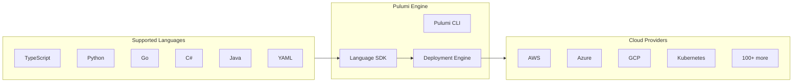
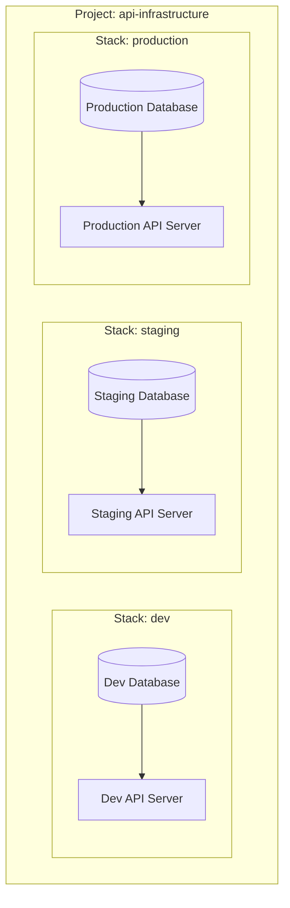
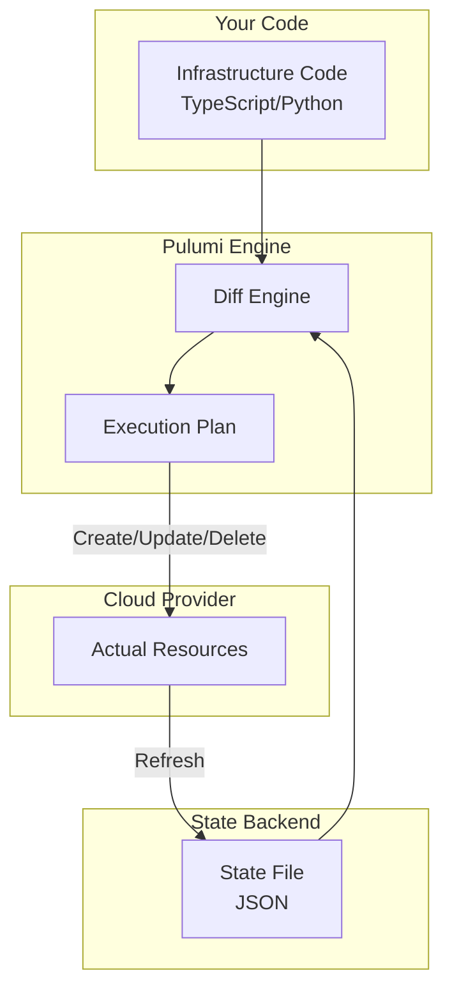
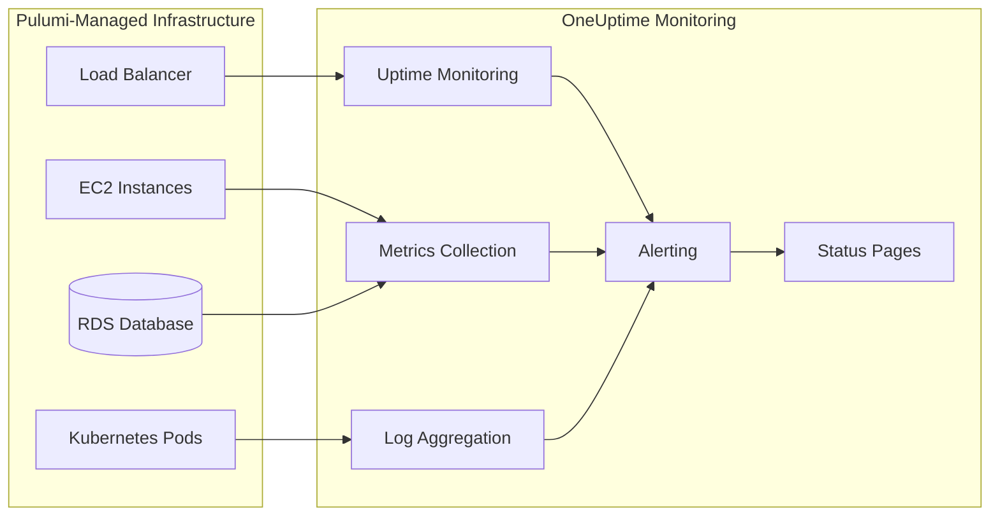

# How to Get Started with Pulumi for Infrastructure as Code

Author: [nawazdhandala](https://www.github.com/nawazdhandala)

Tags: Pulumi, Infrastructure as Code, IaC, DevOps, TypeScript, Python, Cloud, AWS, Kubernetes

Description: A comprehensive guide to getting started with Pulumi for Infrastructure as Code. Learn core concepts, state management, stack configuration, and deploy cloud resources using TypeScript and Python with practical examples.

---

> "The best infrastructure is the infrastructure you can reason about, version, and deploy with the same confidence as your application code." - Pulumi Philosophy

Infrastructure as Code (IaC) has transformed how teams provision and manage cloud resources. While tools like Terraform use domain-specific languages, Pulumi takes a different approach: it lets you define infrastructure using general-purpose programming languages you already know, such as TypeScript, Python, Go, and C#.

This guide walks you through everything you need to get started with Pulumi, from core concepts to deploying real infrastructure with TypeScript and Python.

---

## Table of Contents

1. What is Pulumi?
2. Core Concepts
3. Installation and Setup
4. Your First Pulumi Project (TypeScript)
5. Your First Pulumi Project (Python)
6. State Management
7. Stack Configuration
8. Deploying to AWS
9. Deploying to Kubernetes
10. Best Practices
11. Monitoring Your Infrastructure

---

## 1. What is Pulumi?

Pulumi is an open-source Infrastructure as Code platform that allows you to define, deploy, and manage cloud infrastructure using familiar programming languages. Unlike declarative DSLs, Pulumi gives you the full power of programming constructs: loops, conditionals, functions, classes, and package management.



### Key Benefits

| Feature | Description |
|---------|-------------|
| Familiar Languages | Use TypeScript, Python, Go, C#, Java, or YAML |
| Real Programming | Loops, conditionals, functions, abstractions |
| IDE Support | Autocomplete, type checking, refactoring |
| Package Management | npm, pip, go modules for reusable components |
| Testing | Unit test your infrastructure with standard frameworks |
| Multi-Cloud | Single workflow for AWS, Azure, GCP, Kubernetes |

---

## 2. Core Concepts

Understanding Pulumi's core concepts is essential before diving into code.

### Projects

A Pulumi project is a directory containing your infrastructure code and a `Pulumi.yaml` file that defines project metadata.

```yaml
# Pulumi.yaml - Project configuration file
name: my-infrastructure        # Project name (must be unique within your organization)
runtime: nodejs                # Runtime: nodejs, python, go, dotnet, java
description: My cloud setup    # Human-readable description
```

### Stacks

Stacks are isolated instances of your infrastructure. Common patterns include:
- `dev`, `staging`, `production` for environment separation
- `us-east-1`, `eu-west-1` for regional deployments
- `team-a`, `team-b` for team isolation



### Resources

Resources are the cloud components you create: VMs, databases, buckets, functions, etc. Each resource has:
- A logical name (for Pulumi's tracking)
- Properties that configure the resource
- Outputs that expose resource attributes

### Outputs

Outputs are values exported from your stack that can be:
- Displayed after deployment
- Referenced by other stacks
- Used in CI/CD pipelines

---

## 3. Installation and Setup

### Install the Pulumi CLI

```bash
# macOS (using Homebrew)
brew install pulumi

# Linux (using curl)
curl -fsSL https://get.pulumi.com | sh

# Windows (using Chocolatey)
choco install pulumi

# Verify installation
pulumi version
```

### Configure Cloud Credentials

```bash
# AWS - configure using AWS CLI or environment variables
aws configure
# Or set environment variables:
# export AWS_ACCESS_KEY_ID=<your-access-key>
# export AWS_SECRET_ACCESS_KEY=<your-secret-key>
# export AWS_REGION=us-east-1

# Azure - login using Azure CLI
az login

# GCP - login using gcloud CLI
gcloud auth application-default login
```

### Login to Pulumi Backend

```bash
# Use Pulumi Cloud (free for individuals)
pulumi login

# Or use local filesystem backend (no account needed)
pulumi login --local

# Or use S3/Azure Blob/GCS for team state storage
pulumi login s3://my-pulumi-state-bucket
```

---

## 4. Your First Pulumi Project (TypeScript)

Let's create a simple project that deploys an S3 bucket to AWS.

### Create the Project

```bash
# Create a new directory for your project
mkdir pulumi-demo && cd pulumi-demo

# Initialize a new Pulumi project with AWS and TypeScript
pulumi new aws-typescript

# This creates:
# - Pulumi.yaml (project config)
# - Pulumi.dev.yaml (stack config)
# - index.ts (your infrastructure code)
# - package.json (npm dependencies)
# - tsconfig.json (TypeScript config)
```

### Understand the Generated Code

```typescript
// index.ts - Main infrastructure definition file
import * as pulumi from "@pulumi/pulumi";
import * as aws from "@pulumi/aws";

// Create an S3 bucket
// First argument: logical name used by Pulumi for tracking
// Second argument: configuration options for the resource
const bucket = new aws.s3.Bucket("my-bucket", {
    // Enable website hosting on this bucket
    website: {
        indexDocument: "index.html",
        errorDocument: "error.html",
    },

    // Add tags for resource organization
    tags: {
        Environment: pulumi.getStack(), // Returns current stack name (dev, staging, prod)
        ManagedBy: "Pulumi",
    },
});

// Export the bucket name so it can be accessed after deployment
// This will be displayed in the CLI output and available via `pulumi stack output`
export const bucketName = bucket.id;

// Export the website endpoint for easy access
export const websiteUrl = bucket.websiteEndpoint;
```

### Add More Resources

```typescript
// index.ts - Extended with more resources
import * as pulumi from "@pulumi/pulumi";
import * as aws from "@pulumi/aws";

// Get configuration values from the stack config file
const config = new pulumi.Config();
const environment = config.get("environment") || "dev";

// Create an S3 bucket for static website hosting
const bucket = new aws.s3.Bucket("website-bucket", {
    website: {
        indexDocument: "index.html",
        errorDocument: "error.html",
    },
    tags: {
        Environment: environment,
        ManagedBy: "Pulumi",
    },
});

// Create a bucket policy to allow public read access
// Note: pulumi.interpolate handles async values in template strings
const bucketPolicy = new aws.s3.BucketPolicy("website-bucket-policy", {
    bucket: bucket.id,
    policy: pulumi.interpolate`{
        "Version": "2012-10-17",
        "Statement": [{
            "Effect": "Allow",
            "Principal": "*",
            "Action": "s3:GetObject",
            "Resource": "arn:aws:s3:::${bucket.id}/*"
        }]
    }`,
});

// Upload an index.html file to the bucket
const indexHtml = new aws.s3.BucketObject("index.html", {
    bucket: bucket.id,
    key: "index.html",
    content: `
        <!DOCTYPE html>
        <html>
        <head><title>Hello Pulumi!</title></head>
        <body>
            <h1>Hello from Pulumi!</h1>
            <p>Environment: ${environment}</p>
        </body>
        </html>
    `,
    contentType: "text/html",
});

// Export outputs for use in CI/CD or other stacks
export const bucketName = bucket.id;
export const bucketArn = bucket.arn;
export const websiteUrl = pulumi.interpolate`http://${bucket.websiteEndpoint}`;
```

### Deploy the Stack

```bash
# Preview what will be created (dry run)
pulumi preview

# Deploy the infrastructure
pulumi up

# View the outputs
pulumi stack output

# View detailed stack information
pulumi stack
```

---

## 5. Your First Pulumi Project (Python)

The same infrastructure in Python demonstrates Pulumi's language flexibility.

### Create the Project

```bash
# Create a new directory
mkdir pulumi-python-demo && cd pulumi-python-demo

# Initialize a new Pulumi project with AWS and Python
pulumi new aws-python

# This creates:
# - Pulumi.yaml (project config)
# - Pulumi.dev.yaml (stack config)
# - __main__.py (your infrastructure code)
# - requirements.txt (Python dependencies)
# - venv/ (virtual environment)

# Activate the virtual environment
source venv/bin/activate  # Linux/macOS
# or: venv\Scripts\activate  # Windows
```

### Write the Infrastructure Code

```python
# __main__.py - Main infrastructure definition file
import pulumi
import pulumi_aws as aws

# Get configuration values from stack config
config = pulumi.Config()
environment = config.get("environment") or "dev"

# Create an S3 bucket for static website hosting
# First argument: logical name for Pulumi tracking
# Keyword arguments: resource configuration
bucket = aws.s3.Bucket(
    "website-bucket",
    website=aws.s3.BucketWebsiteArgs(
        index_document="index.html",
        error_document="error.html",
    ),
    tags={
        "Environment": environment,
        "ManagedBy": "Pulumi",
    },
)

# Create a bucket policy for public read access
# Using Output.concat for string interpolation with async values
bucket_policy = aws.s3.BucketPolicy(
    "website-bucket-policy",
    bucket=bucket.id,
    policy=pulumi.Output.json_dumps({
        "Version": "2012-10-17",
        "Statement": [{
            "Effect": "Allow",
            "Principal": "*",
            "Action": "s3:GetObject",
            "Resource": pulumi.Output.concat("arn:aws:s3:::", bucket.id, "/*"),
        }],
    }),
)

# Upload an index.html file
index_html = aws.s3.BucketObject(
    "index.html",
    bucket=bucket.id,
    key="index.html",
    content=f"""
        <!DOCTYPE html>
        <html>
        <head><title>Hello Pulumi!</title></head>
        <body>
            <h1>Hello from Pulumi (Python)!</h1>
            <p>Environment: {environment}</p>
        </body>
        </html>
    """,
    content_type="text/html",
)

# Export outputs - these will be displayed after deployment
# and can be accessed via `pulumi stack output`
pulumi.export("bucket_name", bucket.id)
pulumi.export("bucket_arn", bucket.arn)
pulumi.export("website_url", pulumi.Output.concat("http://", bucket.website_endpoint))
```

### Using Functions and Loops in Python

```python
# __main__.py - Demonstrating programming constructs
import pulumi
import pulumi_aws as aws
from typing import List

# Configuration
config = pulumi.Config()
environments = config.get_object("environments") or ["dev", "staging", "prod"]


def create_environment_bucket(env_name: str) -> aws.s3.Bucket:
    """
    Factory function to create a bucket for a specific environment.
    This demonstrates how you can use functions to create reusable patterns.

    Args:
        env_name: Name of the environment (dev, staging, prod)

    Returns:
        aws.s3.Bucket: The created S3 bucket resource
    """
    return aws.s3.Bucket(
        f"data-bucket-{env_name}",
        # Enable versioning for non-dev environments
        versioning=aws.s3.BucketVersioningArgs(
            enabled=env_name != "dev",
        ),
        # Lifecycle rules to manage storage costs
        lifecycle_rules=[
            aws.s3.BucketLifecycleRuleArgs(
                enabled=True,
                # Move to cheaper storage after 30 days
                transitions=[
                    aws.s3.BucketLifecycleRuleTransitionArgs(
                        days=30,
                        storage_class="STANDARD_IA",
                    ),
                ],
                # Delete old versions after 90 days (non-dev only)
                noncurrent_version_expiration=aws.s3.BucketLifecycleRuleNoncurrentVersionExpirationArgs(
                    days=90,
                ) if env_name != "dev" else None,
            ),
        ],
        tags={
            "Environment": env_name,
            "ManagedBy": "Pulumi",
        },
    )


# Create buckets for all environments using list comprehension
buckets: List[aws.s3.Bucket] = [
    create_environment_bucket(env)
    for env in environments
]

# Export all bucket names as a dictionary
pulumi.export("bucket_names", {
    bucket._name: bucket.id
    for bucket in buckets
})
```

---

## 6. State Management

Pulumi tracks the state of your infrastructure to understand what exists and what needs to change. Understanding state management is crucial for team collaboration.



### State Backend Options

```bash
# Option 1: Pulumi Cloud (recommended for teams)
# - Automatic state locking
# - Encryption at rest
# - Audit history
# - RBAC and team management
pulumi login

# Option 2: Local filesystem (good for learning)
# - State stored in ~/.pulumi/
# - No collaboration features
# - No state locking
pulumi login --local

# Option 3: AWS S3 (self-managed, team-friendly)
# - You manage the bucket
# - State locking via DynamoDB
pulumi login s3://my-pulumi-state-bucket

# Option 4: Azure Blob Storage
pulumi login azblob://my-container

# Option 5: Google Cloud Storage
pulumi login gs://my-pulumi-state-bucket
```

### State Commands

```bash
# View current state
pulumi stack export

# Import existing resources into state
# Useful when adopting Pulumi for existing infrastructure
pulumi import aws:s3/bucket:Bucket my-bucket my-existing-bucket-name

# Refresh state from actual cloud resources
# Detects drift between state and reality
pulumi refresh

# Delete a resource from state (without deleting the actual resource)
# Use with caution - creates orphaned resources
pulumi state delete 'urn:pulumi:dev::project::aws:s3/bucket:Bucket::my-bucket'
```

### Handling State Conflicts

```typescript
// index.ts - Protecting critical resources
import * as pulumi from "@pulumi/pulumi";
import * as aws from "@pulumi/aws";

// Protect resources from accidental deletion
// This prevents `pulumi destroy` from removing this resource
const database = new aws.rds.Instance("production-db", {
    engine: "postgres",
    instanceClass: "db.t3.medium",
    allocatedStorage: 100,
    // ... other config
}, {
    // Resource options
    protect: true,  // Cannot be deleted without first removing protection
});

// Retain resources even if removed from code
// The resource stays in the cloud but is removed from Pulumi state
const legacyBucket = new aws.s3.Bucket("legacy-data", {
    // ... config
}, {
    retainOnDelete: true,  // Keep the bucket when running `pulumi destroy`
});
```

---

## 7. Stack Configuration

Stack configuration allows you to manage environment-specific values securely.

### Setting Configuration Values

```bash
# Set a plain text configuration value
pulumi config set environment production

# Set a secret (encrypted in state)
pulumi config set --secret databasePassword 'super-secret-password'

# Set a structured value (JSON/YAML)
pulumi config set --path 'database.host' 'db.example.com'
pulumi config set --path 'database.port' 5432

# View all configuration
pulumi config

# View configuration including secrets
pulumi config --show-secrets
```

### Stack Configuration File

```yaml
# Pulumi.production.yaml - Production stack configuration
config:
  # Plain values
  myproject:environment: production
  myproject:instanceCount: 3

  # Nested values
  myproject:database:
    host: db.example.com
    port: 5432
    name: myapp

  # Secrets (encrypted)
  myproject:databasePassword:
    secure: AAABAMx...encrypted...

  # AWS provider configuration
  aws:region: us-east-1
```

### Reading Configuration in Code

```typescript
// index.ts - Reading configuration values
import * as pulumi from "@pulumi/pulumi";
import * as aws from "@pulumi/aws";

// Create a config object for your project namespace
const config = new pulumi.Config();

// Read plain values with defaults
const environment = config.get("environment") || "dev";
const instanceCount = config.getNumber("instanceCount") || 1;

// Read required values (throws if not set)
const appName = config.require("appName");

// Read secrets (returns pulumi.Output<string> to prevent logging)
const dbPassword = config.requireSecret("databasePassword");

// Read structured configuration
interface DatabaseConfig {
    host: string;
    port: number;
    name: string;
}
const dbConfig = config.requireObject<DatabaseConfig>("database");

// Use configuration in resources
const instances = [];
for (let i = 0; i < instanceCount; i++) {
    instances.push(new aws.ec2.Instance(`web-server-${i}`, {
        ami: "ami-0c55b159cbfafe1f0",
        instanceType: environment === "production" ? "t3.large" : "t3.micro",
        tags: {
            Name: `${appName}-${environment}-${i}`,
            Environment: environment,
        },
    }));
}

// Export instance IDs
export const instanceIds = instances.map(i => i.id);
```

```python
# __main__.py - Reading configuration values in Python
import pulumi
import pulumi_aws as aws
from dataclasses import dataclass
from typing import Optional

# Create a config object
config = pulumi.Config()

# Read plain values with defaults
environment = config.get("environment") or "dev"
instance_count = config.get_int("instanceCount") or 1

# Read required values
app_name = config.require("appName")

# Read secrets (returns Output[str])
db_password = config.require_secret("databasePassword")

# Read structured configuration using dataclass
@dataclass
class DatabaseConfig:
    host: str
    port: int
    name: str

db_config_dict = config.require_object("database")
db_config = DatabaseConfig(**db_config_dict)

# Use configuration in resources
instances = []
for i in range(instance_count):
    instance = aws.ec2.Instance(
        f"web-server-{i}",
        ami="ami-0c55b159cbfafe1f0",
        instance_type="t3.large" if environment == "production" else "t3.micro",
        tags={
            "Name": f"{app_name}-{environment}-{i}",
            "Environment": environment,
        },
    )
    instances.append(instance)

# Export instance IDs
pulumi.export("instance_ids", [i.id for i in instances])
```

---

## 8. Deploying to AWS

Let's build a more complete AWS infrastructure with VPC, EC2, and RDS.

```typescript
// index.ts - Complete AWS infrastructure example
import * as pulumi from "@pulumi/pulumi";
import * as aws from "@pulumi/aws";
import * as awsx from "@pulumi/awsx";  // Higher-level AWS components

const config = new pulumi.Config();
const environment = config.get("environment") || "dev";

// Create a VPC using the awsx higher-level component
// This automatically creates public/private subnets, NAT gateways, etc.
const vpc = new awsx.ec2.Vpc("main-vpc", {
    cidrBlock: "10.0.0.0/16",
    numberOfAvailabilityZones: 2,
    subnetSpecs: [
        // Public subnets for load balancers
        { type: awsx.ec2.SubnetType.Public, cidrMask: 24 },
        // Private subnets for application servers
        { type: awsx.ec2.SubnetType.Private, cidrMask: 24 },
        // Isolated subnets for databases (no internet access)
        { type: awsx.ec2.SubnetType.Isolated, cidrMask: 24 },
    ],
    tags: { Environment: environment },
});

// Create a security group for the web servers
const webSecurityGroup = new aws.ec2.SecurityGroup("web-sg", {
    vpcId: vpc.vpcId,
    description: "Allow HTTP/HTTPS inbound traffic",
    ingress: [
        {
            protocol: "tcp",
            fromPort: 80,
            toPort: 80,
            cidrBlocks: ["0.0.0.0/0"],
            description: "HTTP from anywhere",
        },
        {
            protocol: "tcp",
            fromPort: 443,
            toPort: 443,
            cidrBlocks: ["0.0.0.0/0"],
            description: "HTTPS from anywhere",
        },
    ],
    egress: [
        {
            protocol: "-1",  // All protocols
            fromPort: 0,
            toPort: 0,
            cidrBlocks: ["0.0.0.0/0"],
            description: "Allow all outbound traffic",
        },
    ],
    tags: { Name: "web-sg", Environment: environment },
});

// Create a security group for the database
const dbSecurityGroup = new aws.ec2.SecurityGroup("db-sg", {
    vpcId: vpc.vpcId,
    description: "Allow PostgreSQL from web servers",
    ingress: [
        {
            protocol: "tcp",
            fromPort: 5432,
            toPort: 5432,
            securityGroups: [webSecurityGroup.id],
            description: "PostgreSQL from web servers",
        },
    ],
    tags: { Name: "db-sg", Environment: environment },
});

// Create a DB subnet group using isolated subnets
const dbSubnetGroup = new aws.rds.SubnetGroup("db-subnet-group", {
    subnetIds: vpc.isolatedSubnetIds,
    tags: { Environment: environment },
});

// Create an RDS PostgreSQL instance
const database = new aws.rds.Instance("app-database", {
    engine: "postgres",
    engineVersion: "15",
    instanceClass: environment === "production" ? "db.t3.medium" : "db.t3.micro",
    allocatedStorage: 20,
    maxAllocatedStorage: 100,  // Enable storage autoscaling

    dbName: "myapp",
    username: "admin",
    password: config.requireSecret("dbPassword"),

    dbSubnetGroupName: dbSubnetGroup.name,
    vpcSecurityGroupIds: [dbSecurityGroup.id],

    // Backup configuration
    backupRetentionPeriod: environment === "production" ? 7 : 1,
    backupWindow: "03:00-04:00",
    maintenanceWindow: "Mon:04:00-Mon:05:00",

    // High availability for production
    multiAz: environment === "production",

    // Prevent accidental deletion in production
    deletionProtection: environment === "production",
    skipFinalSnapshot: environment !== "production",
    finalSnapshotIdentifier: environment === "production"
        ? `${environment}-final-snapshot`
        : undefined,

    tags: { Environment: environment },
}, {
    protect: environment === "production",  // Extra Pulumi protection
});

// Create an Application Load Balancer
const alb = new aws.lb.LoadBalancer("app-alb", {
    loadBalancerType: "application",
    securityGroups: [webSecurityGroup.id],
    subnets: vpc.publicSubnetIds,
    tags: { Environment: environment },
});

// Export important values
export const vpcId = vpc.vpcId;
export const albDnsName = alb.dnsName;
export const dbEndpoint = database.endpoint;
export const dbPort = database.port;
```

---

## 9. Deploying to Kubernetes

Pulumi can also manage Kubernetes resources with full type safety.

```typescript
// index.ts - Kubernetes deployment example
import * as pulumi from "@pulumi/pulumi";
import * as k8s from "@pulumi/kubernetes";

const config = new pulumi.Config();
const appName = config.get("appName") || "my-app";
const replicas = config.getNumber("replicas") || 3;
const imageTag = config.get("imageTag") || "latest";

// Define labels used across resources for consistency
const appLabels = { app: appName };

// Create a Kubernetes Namespace
const namespace = new k8s.core.v1.Namespace("app-namespace", {
    metadata: {
        name: appName,
        labels: appLabels,
    },
});

// Create a ConfigMap for application configuration
const configMap = new k8s.core.v1.ConfigMap("app-config", {
    metadata: {
        name: `${appName}-config`,
        namespace: namespace.metadata.name,
    },
    data: {
        "APP_ENV": pulumi.getStack(),
        "LOG_LEVEL": pulumi.getStack() === "production" ? "info" : "debug",
    },
});

// Create a Secret for sensitive configuration
const secret = new k8s.core.v1.Secret("app-secrets", {
    metadata: {
        name: `${appName}-secrets`,
        namespace: namespace.metadata.name,
    },
    type: "Opaque",
    stringData: {
        "DATABASE_URL": config.requireSecret("databaseUrl"),
        "API_KEY": config.requireSecret("apiKey"),
    },
});

// Create the Deployment
const deployment = new k8s.apps.v1.Deployment("app-deployment", {
    metadata: {
        name: appName,
        namespace: namespace.metadata.name,
        labels: appLabels,
    },
    spec: {
        replicas: replicas,
        selector: { matchLabels: appLabels },
        template: {
            metadata: { labels: appLabels },
            spec: {
                containers: [{
                    name: appName,
                    image: `myregistry/${appName}:${imageTag}`,
                    ports: [{ containerPort: 8080, name: "http" }],

                    // Environment variables from ConfigMap and Secret
                    envFrom: [
                        { configMapRef: { name: configMap.metadata.name } },
                        { secretRef: { name: secret.metadata.name } },
                    ],

                    // Resource limits and requests
                    resources: {
                        requests: { cpu: "100m", memory: "128Mi" },
                        limits: { cpu: "500m", memory: "512Mi" },
                    },

                    // Health checks
                    livenessProbe: {
                        httpGet: { path: "/health", port: "http" },
                        initialDelaySeconds: 10,
                        periodSeconds: 10,
                    },
                    readinessProbe: {
                        httpGet: { path: "/ready", port: "http" },
                        initialDelaySeconds: 5,
                        periodSeconds: 5,
                    },
                }],
            },
        },
    },
});

// Create a Service to expose the deployment
const service = new k8s.core.v1.Service("app-service", {
    metadata: {
        name: appName,
        namespace: namespace.metadata.name,
        labels: appLabels,
    },
    spec: {
        type: "ClusterIP",
        ports: [{ port: 80, targetPort: "http" }],
        selector: appLabels,
    },
});

// Create an Ingress for external access
const ingress = new k8s.networking.v1.Ingress("app-ingress", {
    metadata: {
        name: appName,
        namespace: namespace.metadata.name,
        annotations: {
            "kubernetes.io/ingress.class": "nginx",
            "cert-manager.io/cluster-issuer": "letsencrypt-prod",
        },
    },
    spec: {
        tls: [{
            hosts: [`${appName}.example.com`],
            secretName: `${appName}-tls`,
        }],
        rules: [{
            host: `${appName}.example.com`,
            http: {
                paths: [{
                    path: "/",
                    pathType: "Prefix",
                    backend: {
                        service: {
                            name: service.metadata.name,
                            port: { number: 80 },
                        },
                    },
                }],
            },
        }],
    },
});

// Export useful information
export const namespaceName = namespace.metadata.name;
export const deploymentName = deployment.metadata.name;
export const serviceClusterIP = service.spec.clusterIP;
export const ingressHostname = `${appName}.example.com`;
```

---

## 10. Best Practices

### Project Structure

```
my-pulumi-project/
├── Pulumi.yaml              # Project definition
├── Pulumi.dev.yaml          # Dev stack config
├── Pulumi.staging.yaml      # Staging stack config
├── Pulumi.production.yaml   # Production stack config
├── index.ts                 # Main entry point
├── package.json             # Dependencies
├── tsconfig.json            # TypeScript config
└── src/
    ├── components/          # Reusable Pulumi components
    │   ├── vpc.ts
    │   └── database.ts
    ├── config/              # Configuration handling
    │   └── settings.ts
    └── utils/               # Helper functions
        └── naming.ts
```

### Creating Reusable Components

```typescript
// src/components/webapp.ts - Reusable component example
import * as pulumi from "@pulumi/pulumi";
import * as aws from "@pulumi/aws";

// Define the component's input arguments
export interface WebAppArgs {
    environment: string;
    instanceType?: string;
    minSize?: number;
    maxSize?: number;
    vpcId: pulumi.Input<string>;
    subnetIds: pulumi.Input<pulumi.Input<string>[]>;
}

// Create a ComponentResource for grouping related resources
export class WebApp extends pulumi.ComponentResource {
    public readonly loadBalancerDns: pulumi.Output<string>;
    public readonly targetGroupArn: pulumi.Output<string>;

    constructor(name: string, args: WebAppArgs, opts?: pulumi.ComponentResourceOptions) {
        super("custom:webapp:WebApp", name, {}, opts);

        const defaultOpts = { parent: this };

        // Create security group
        const sg = new aws.ec2.SecurityGroup(`${name}-sg`, {
            vpcId: args.vpcId,
            ingress: [
                { protocol: "tcp", fromPort: 80, toPort: 80, cidrBlocks: ["0.0.0.0/0"] },
            ],
            egress: [
                { protocol: "-1", fromPort: 0, toPort: 0, cidrBlocks: ["0.0.0.0/0"] },
            ],
            tags: { Environment: args.environment },
        }, defaultOpts);

        // Create ALB
        const alb = new aws.lb.LoadBalancer(`${name}-alb`, {
            loadBalancerType: "application",
            securityGroups: [sg.id],
            subnets: args.subnetIds,
            tags: { Environment: args.environment },
        }, defaultOpts);

        // Create target group
        const targetGroup = new aws.lb.TargetGroup(`${name}-tg`, {
            port: 80,
            protocol: "HTTP",
            vpcId: args.vpcId,
            healthCheck: {
                path: "/health",
                healthyThreshold: 2,
                unhealthyThreshold: 3,
            },
            tags: { Environment: args.environment },
        }, defaultOpts);

        // Create listener
        new aws.lb.Listener(`${name}-listener`, {
            loadBalancerArn: alb.arn,
            port: 80,
            defaultActions: [{
                type: "forward",
                targetGroupArn: targetGroup.arn,
            }],
        }, defaultOpts);

        // Set outputs
        this.loadBalancerDns = alb.dnsName;
        this.targetGroupArn = targetGroup.arn;

        // Register outputs for stack exports
        this.registerOutputs({
            loadBalancerDns: this.loadBalancerDns,
            targetGroupArn: this.targetGroupArn,
        });
    }
}
```

### Testing Infrastructure Code

```typescript
// test/webapp.test.ts - Unit testing with Pulumi mocks
import * as pulumi from "@pulumi/pulumi";
import "mocha";
import * as assert from "assert";

// Configure Pulumi mocks before importing resources
pulumi.runtime.setMocks({
    newResource: (args: pulumi.runtime.MockResourceArgs) => {
        // Return mock values for each resource type
        return {
            id: `${args.name}-id`,
            state: {
                ...args.inputs,
                arn: `arn:aws:service:region:account:${args.name}`,
            },
        };
    },
    call: (args: pulumi.runtime.MockCallArgs) => {
        return {};
    },
});

describe("WebApp Component", () => {
    let webapp: typeof import("../src/components/webapp");

    before(async () => {
        webapp = await import("../src/components/webapp");
    });

    it("should create an ALB with correct tags", async () => {
        const app = new webapp.WebApp("test-app", {
            environment: "test",
            vpcId: "vpc-123",
            subnetIds: ["subnet-1", "subnet-2"],
        });

        const dns = await new Promise<string>((resolve) => {
            app.loadBalancerDns.apply(resolve);
        });

        assert.ok(dns.includes("test-app"));
    });
});
```

---

## 11. Monitoring Your Infrastructure

Once your infrastructure is deployed, monitoring becomes crucial. [OneUptime](https://oneuptime.com) provides comprehensive monitoring for your Pulumi-deployed infrastructure.



### Setting Up Monitoring with Pulumi

```typescript
// index.ts - Integrating monitoring with infrastructure
import * as pulumi from "@pulumi/pulumi";
import * as aws from "@pulumi/aws";

const config = new pulumi.Config();
const oneuptimeToken = config.requireSecret("oneuptimeToken");

// Create your application infrastructure
const alb = new aws.lb.LoadBalancer("app-alb", {
    // ... ALB configuration
});

// Create a Lambda function to report metrics to OneUptime
const metricsReporter = new aws.lambda.Function("metrics-reporter", {
    runtime: "nodejs18.x",
    handler: "index.handler",
    code: new pulumi.asset.AssetArchive({
        "index.js": new pulumi.asset.StringAsset(`
            const https = require('https');

            exports.handler = async (event) => {
                // Report custom metrics to OneUptime
                const metrics = {
                    serviceName: 'my-app',
                    metrics: event.metrics,
                    timestamp: new Date().toISOString(),
                };

                // Send to OneUptime OTLP endpoint
                // See OneUptime docs for full integration
                console.log('Reporting metrics:', JSON.stringify(metrics));
                return { statusCode: 200 };
            };
        `),
    }),
    environment: {
        variables: {
            ONEUPTIME_TOKEN: oneuptimeToken,
        },
    },
});

// Set up CloudWatch alarms that can trigger OneUptime alerts
const highLatencyAlarm = new aws.cloudwatch.MetricAlarm("high-latency", {
    comparisonOperator: "GreaterThanThreshold",
    evaluationPeriods: 2,
    metricName: "TargetResponseTime",
    namespace: "AWS/ApplicationELB",
    period: 60,
    statistic: "Average",
    threshold: 1,  // 1 second
    alarmDescription: "ALB response time exceeds 1 second",
    dimensions: {
        LoadBalancer: alb.arnSuffix,
    },
});

// Export the ALB DNS for OneUptime uptime monitoring
export const monitoringEndpoint = pulumi.interpolate`https://${alb.dnsName}/health`;

// Output instructions for OneUptime setup
export const oneuptimeSetup = pulumi.interpolate`
Configure OneUptime uptime monitoring:
1. Add a new HTTP monitor pointing to: https://${alb.dnsName}/health
2. Set check interval to 1 minute
3. Configure alert thresholds for your SLO
4. Set up a status page for transparency

Visit https://oneuptime.com to get started!
`;
```

### What to Monitor

| Resource Type | Key Metrics | OneUptime Feature |
|--------------|-------------|-------------------|
| Load Balancers | Response time, error rate, request count | Uptime Monitoring, Metrics |
| EC2 Instances | CPU, memory, disk, network | Metrics, Alerting |
| RDS Databases | Connections, IOPS, replication lag | Metrics, Alerting |
| Kubernetes Pods | Restart count, resource usage | Logs, Metrics |
| API Endpoints | Availability, latency, status codes | Uptime Monitoring |
| SSL Certificates | Expiration dates | SSL Monitoring |

---

## Summary

| Topic | Key Takeaway |
|-------|--------------|
| Languages | Use TypeScript, Python, Go, C#, Java, or YAML |
| Projects | Container for infrastructure code with Pulumi.yaml |
| Stacks | Isolated instances for dev/staging/production |
| State | Tracked in Pulumi Cloud, S3, or local filesystem |
| Configuration | Stack-specific values with secret encryption |
| Components | Reusable abstractions for common patterns |
| Testing | Unit test infrastructure with mocks |
| Monitoring | Use OneUptime for comprehensive observability |

Pulumi brings software engineering practices to infrastructure management. By using familiar programming languages, you get IDE support, type safety, testing capabilities, and the ability to create powerful abstractions.

Start with a simple project, understand the core concepts, and gradually build more complex infrastructure. Combine Pulumi with [OneUptime](https://oneuptime.com) for complete visibility into your infrastructure's health and performance.

---

**Related Reading:**

- [Introducing the OneUptime Terraform Provider](https://oneuptime.com/blog/post/2025-07-01-introducing-terraform-provider-for-oneuptime/view)
- [The Three Pillars of Observability](https://oneuptime.com/blog/post/2025-08-20-three-pillars-of-observability-logs-metrics-traces/view)
- [What is Site Reliability Engineering?](https://oneuptime.com/blog/post/2025-11-28-what-is-site-reliability-engineering/view)
