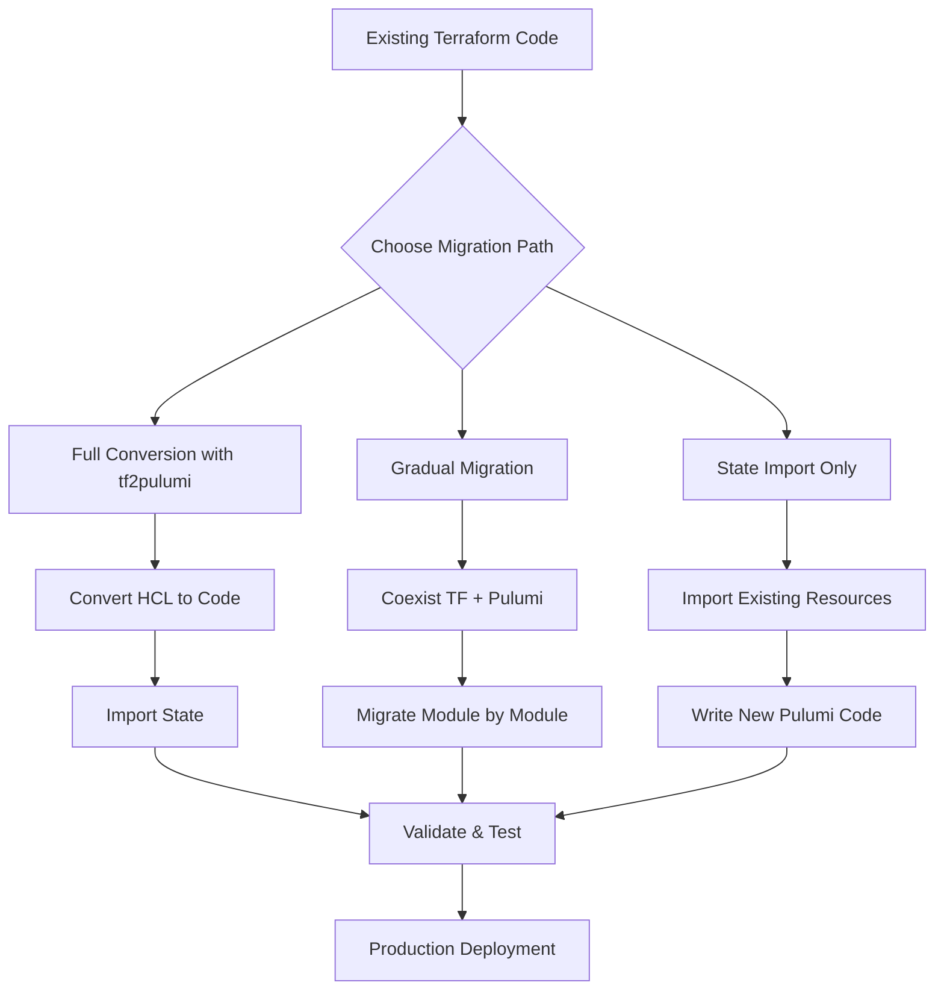
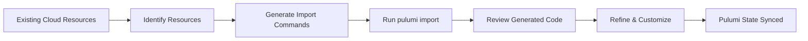
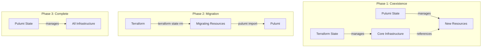
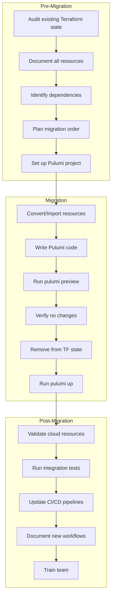

# How to Migrate from Terraform to Pulumi

Author: [nawazdhandala](https://www.github.com/nawazdhandala)

Tags: Infrastructure as Code, Pulumi, Terraform, DevOps, Migration, Cloud Infrastructure

Description: A comprehensive guide to migrating your infrastructure from Terraform to Pulumi, covering tf2pulumi conversion, state import strategies, HCL to code transformation, and gradual migration approaches for production environments.

---

> "The best infrastructure code is the code your team already knows how to write." - Pulumi's philosophy on using general-purpose programming languages for IaC

Terraform revolutionized infrastructure management with its declarative HCL syntax. But as teams scale, many find themselves wanting the full power of programming languages: loops, conditionals, type checking, testing frameworks, and IDE support. Pulumi offers exactly that, letting you define infrastructure in TypeScript, Python, Go, C#, or Java.

This guide walks you through migrating from Terraform to Pulumi without disrupting your production infrastructure.

## Why Migrate to Pulumi?

Before diving into the how, let's understand the why:

**Programming Language Benefits:**
- Use familiar languages (TypeScript, Python, Go, C#, Java)
- Full IDE support with autocomplete and type checking
- Native testing frameworks (Jest, pytest, Go testing)
- Reusable components as real classes and functions
- No new DSL to learn for complex logic

**Operational Improvements:**
- Unified state management with Pulumi Cloud or self-hosted backends
- Built-in secrets management with automatic encryption
- Policy as Code with CrossGuard
- Better drift detection and remediation

## Migration Architecture Overview

Here is the high-level migration flow:



## Method 1: Using tf2pulumi for Automatic Conversion

The `tf2pulumi` tool automatically converts Terraform HCL to Pulumi code in your preferred language.

### Installing tf2pulumi

```bash
# Install Pulumi CLI first (if not already installed)
curl -fsSL https://get.pulumi.com | sh

# Install tf2pulumi
# On macOS with Homebrew
brew install pulumi/tap/tf2pulumi

# On Linux or Windows, download from GitHub releases
# https://github.com/pulumi/tf2pulumi/releases

# Verify installation
tf2pulumi version
```

### Converting a Simple Terraform Project

Let's convert a typical AWS infrastructure project. Here's the original Terraform code:

```hcl
# main.tf - Original Terraform configuration
terraform {
  required_providers {
    aws = {
      source  = "hashicorp/aws"
      version = "~> 5.0"
    }
  }
}

provider "aws" {
  region = var.aws_region
}

# Variables
variable "aws_region" {
  description = "AWS region for resources"
  default     = "us-east-1"
}

variable "environment" {
  description = "Environment name"
  type        = string
}

variable "instance_count" {
  description = "Number of instances to create"
  default     = 2
}

# VPC Configuration
resource "aws_vpc" "main" {
  cidr_block           = "10.0.0.0/16"
  enable_dns_hostnames = true
  enable_dns_support   = true

  tags = {
    Name        = "${var.environment}-vpc"
    Environment = var.environment
    ManagedBy   = "terraform"
  }
}

# Subnets
resource "aws_subnet" "public" {
  count                   = 2
  vpc_id                  = aws_vpc.main.id
  cidr_block              = "10.0.${count.index + 1}.0/24"
  availability_zone       = data.aws_availability_zones.available.names[count.index]
  map_public_ip_on_launch = true

  tags = {
    Name        = "${var.environment}-public-${count.index + 1}"
    Environment = var.environment
  }
}

# Data source for AZs
data "aws_availability_zones" "available" {
  state = "available"
}

# Security Group
resource "aws_security_group" "web" {
  name        = "${var.environment}-web-sg"
  description = "Security group for web servers"
  vpc_id      = aws_vpc.main.id

  ingress {
    from_port   = 80
    to_port     = 80
    protocol    = "tcp"
    cidr_blocks = ["0.0.0.0/0"]
  }

  ingress {
    from_port   = 443
    to_port     = 443
    protocol    = "tcp"
    cidr_blocks = ["0.0.0.0/0"]
  }

  egress {
    from_port   = 0
    to_port     = 0
    protocol    = "-1"
    cidr_blocks = ["0.0.0.0/0"]
  }

  tags = {
    Name        = "${var.environment}-web-sg"
    Environment = var.environment
  }
}

# EC2 Instances
resource "aws_instance" "web" {
  count                  = var.instance_count
  ami                    = data.aws_ami.amazon_linux.id
  instance_type          = "t3.micro"
  subnet_id              = aws_subnet.public[count.index % 2].id
  vpc_security_group_ids = [aws_security_group.web.id]

  tags = {
    Name        = "${var.environment}-web-${count.index + 1}"
    Environment = var.environment
  }
}

# Latest Amazon Linux AMI
data "aws_ami" "amazon_linux" {
  most_recent = true
  owners      = ["amazon"]

  filter {
    name   = "name"
    values = ["amzn2-ami-hvm-*-x86_64-gp2"]
  }
}

# Outputs
output "vpc_id" {
  value = aws_vpc.main.id
}

output "instance_ips" {
  value = aws_instance.web[*].public_ip
}
```

### Running the Conversion

```bash
# Navigate to your Terraform directory
cd /path/to/terraform/project

# Convert to TypeScript (recommended for best type safety)
tf2pulumi --target-language typescript

# Or convert to Python
tf2pulumi --target-language python

# Or convert to Go
tf2pulumi --target-language go

# Or convert to C#
tf2pulumi --target-language csharp
```

### Converted Pulumi Code (TypeScript)

Here's what the converted TypeScript code looks like with added improvements:

```typescript
// index.ts - Converted and enhanced Pulumi code
import * as pulumi from "@pulumi/pulumi";
import * as aws from "@pulumi/aws";

// Configuration - replaces Terraform variables
// Pulumi uses a typed configuration system
const config = new pulumi.Config();
const awsConfig = new pulumi.Config("aws");

// Get configuration values with defaults
const environment = config.require("environment");
const instanceCount = config.getNumber("instanceCount") || 2;
const awsRegion = awsConfig.get("region") || "us-east-1";

// Reusable tagging function - something hard to do in HCL
// This demonstrates the power of using a real programming language
function createTags(name: string, additionalTags?: Record<string, string>): Record<string, string> {
    return {
        Name: `${environment}-${name}`,
        Environment: environment,
        ManagedBy: "pulumi",
        ...additionalTags,
    };
}

// Get available AZs - equivalent to data source
// Pulumi uses async/await patterns for data sources
const availableAzs = aws.getAvailabilityZones({
    state: "available",
});

// VPC Configuration
// Note: Pulumi resources are created as class instances
const mainVpc = new aws.ec2.Vpc("main-vpc", {
    cidrBlock: "10.0.0.0/16",
    enableDnsHostnames: true,
    enableDnsSupport: true,
    tags: createTags("vpc"),
});

// Public Subnets - using real loops instead of count
// This is cleaner and more maintainable than HCL count/for_each
const publicSubnets: aws.ec2.Subnet[] = [];
for (let i = 0; i < 2; i++) {
    const subnet = new aws.ec2.Subnet(`public-subnet-${i + 1}`, {
        vpcId: mainVpc.id,
        cidrBlock: `10.0.${i + 1}.0/24`,
        // Use .then() to handle the async AZ data
        availabilityZone: availableAzs.then(azs => azs.names[i]),
        mapPublicIpOnLaunch: true,
        tags: createTags(`public-${i + 1}`),
    });
    publicSubnets.push(subnet);
}

// Internet Gateway for public subnets
const igw = new aws.ec2.InternetGateway("main-igw", {
    vpcId: mainVpc.id,
    tags: createTags("igw"),
});

// Route Table for public subnets
const publicRouteTable = new aws.ec2.RouteTable("public-rt", {
    vpcId: mainVpc.id,
    routes: [{
        cidrBlock: "0.0.0.0/0",
        gatewayId: igw.id,
    }],
    tags: createTags("public-rt"),
});

// Associate route table with subnets
publicSubnets.forEach((subnet, index) => {
    new aws.ec2.RouteTableAssociation(`public-rta-${index + 1}`, {
        subnetId: subnet.id,
        routeTableId: publicRouteTable.id,
    });
});

// Security Group with typed ingress/egress rules
// Pulumi provides full type checking for all properties
const webSecurityGroup = new aws.ec2.SecurityGroup("web-sg", {
    name: `${environment}-web-sg`,
    description: "Security group for web servers",
    vpcId: mainVpc.id,
    // Ingress rules as an array - cleaner than multiple blocks
    ingress: [
        {
            description: "HTTP",
            fromPort: 80,
            toPort: 80,
            protocol: "tcp",
            cidrBlocks: ["0.0.0.0/0"],
        },
        {
            description: "HTTPS",
            fromPort: 443,
            toPort: 443,
            protocol: "tcp",
            cidrBlocks: ["0.0.0.0/0"],
        },
    ],
    egress: [{
        description: "All outbound",
        fromPort: 0,
        toPort: 0,
        protocol: "-1",
        cidrBlocks: ["0.0.0.0/0"],
    }],
    tags: createTags("web-sg"),
});

// Get the latest Amazon Linux AMI
// Pulumi's getAmi returns a Promise, providing async safety
const amazonLinuxAmi = aws.ec2.getAmi({
    mostRecent: true,
    owners: ["amazon"],
    filters: [{
        name: "name",
        values: ["amzn2-ami-hvm-*-x86_64-gp2"],
    }],
});

// EC2 Instances using a loop
// Real programming constructs make scaling logic trivial
const webInstances: aws.ec2.Instance[] = [];
for (let i = 0; i < instanceCount; i++) {
    const instance = new aws.ec2.Instance(`web-instance-${i + 1}`, {
        ami: amazonLinuxAmi.then(ami => ami.id),
        instanceType: "t3.micro",
        // Distribute across subnets using modulo
        subnetId: publicSubnets[i % publicSubnets.length].id,
        vpcSecurityGroupIds: [webSecurityGroup.id],
        tags: createTags(`web-${i + 1}`),
        // User data script - can use template literals!
        userData: `#!/bin/bash
echo "Hello from instance ${i + 1}"
yum update -y
yum install -y httpd
systemctl start httpd
systemctl enable httpd
echo "<h1>Web Server ${i + 1} - ${environment}</h1>" > /var/www/html/index.html
`,
    });
    webInstances.push(instance);
}

// Exports - equivalent to Terraform outputs
// These are strongly typed and can be used by other stacks
export const vpcId = mainVpc.id;
export const subnetIds = publicSubnets.map(s => s.id);
export const securityGroupId = webSecurityGroup.id;
export const instanceIds = webInstances.map(i => i.id);
export const instancePublicIps = webInstances.map(i => i.publicIp);

// Export a summary object for convenience
export const summary = {
    environment: environment,
    region: awsRegion,
    vpcId: mainVpc.id,
    instanceCount: webInstances.length,
};
```

## Method 2: State Import for Existing Resources

When you want to adopt Pulumi without reconverting all code, you can import existing resources directly.

### State Import Workflow



### Importing Individual Resources

```bash
# Import an existing VPC
# Syntax: pulumi import <type> <name> <cloud-resource-id>
pulumi import aws:ec2/vpc:Vpc main-vpc vpc-0123456789abcdef0

# Import a security group
pulumi import aws:ec2/securityGroup:SecurityGroup web-sg sg-0123456789abcdef0

# Import an EC2 instance
pulumi import aws:ec2/instance:Instance web-1 i-0123456789abcdef0

# Import an S3 bucket
pulumi import aws:s3/bucket:Bucket data-bucket my-data-bucket-name

# Import an RDS instance
pulumi import aws:rds/instance:Instance database my-database-identifier
```

### Bulk Import with Import File

For large infrastructures, create an import file:

```json
{
    "resources": [
        {
            "type": "aws:ec2/vpc:Vpc",
            "name": "main-vpc",
            "id": "vpc-0123456789abcdef0"
        },
        {
            "type": "aws:ec2/subnet:Subnet",
            "name": "public-subnet-1",
            "id": "subnet-0123456789abcdef0"
        },
        {
            "type": "aws:ec2/subnet:Subnet",
            "name": "public-subnet-2",
            "id": "subnet-0123456789abcdef1"
        },
        {
            "type": "aws:ec2/securityGroup:SecurityGroup",
            "name": "web-sg",
            "id": "sg-0123456789abcdef0"
        },
        {
            "type": "aws:ec2/instance:Instance",
            "name": "web-instance-1",
            "id": "i-0123456789abcdef0"
        },
        {
            "type": "aws:ec2/instance:Instance",
            "name": "web-instance-2",
            "id": "i-0123456789abcdef1"
        }
    ]
}
```

```bash
# Run bulk import
pulumi import --file resources.json --generate-code

# The --generate-code flag creates TypeScript/Python code
# for each imported resource automatically
```

### Post-Import Code Refinement

After importing, the generated code will be verbose. Here's how to refine it:

```typescript
// Generated code (verbose)
const webInstance1 = new aws.ec2.Instance("web-instance-1", {
    ami: "ami-0123456789abcdef0",
    associatePublicIpAddress: true,
    availabilityZone: "us-east-1a",
    cpuCoreCount: 1,
    cpuThreadsPerCore: 2,
    disableApiTermination: false,
    ebsOptimized: false,
    // ... many more properties
}, {
    protect: true, // Import adds protection by default
});

// Refined code (clean and maintainable)
// Remove computed/default values, keep only what you control
const webInstance1 = new aws.ec2.Instance("web-instance-1", {
    ami: amazonLinuxAmi.then(ami => ami.id),
    instanceType: "t3.micro",
    subnetId: publicSubnets[0].id,
    vpcSecurityGroupIds: [webSecurityGroup.id],
    tags: createTags("web-1"),
}, {
    // Keep protection during migration, remove after validation
    protect: true,
    // Ignore changes to AMI to prevent unwanted replacements
    ignoreChanges: ["ami"],
});
```

## Method 3: Gradual Migration Strategy

For production environments, a gradual migration minimizes risk.

### Coexistence Architecture



### Step-by-Step Gradual Migration

**Phase 1: Set Up Pulumi Alongside Terraform**

```typescript
// pulumi/index.ts - Reading Terraform outputs
import * as pulumi from "@pulumi/pulumi";
import * as aws from "@pulumi/aws";

// Reference Terraform-managed VPC using stack references or direct lookup
// Option 1: Look up by tag
const existingVpc = aws.ec2.getVpc({
    filters: [{
        name: "tag:ManagedBy",
        values: ["terraform"],
    }],
});

// Option 2: Look up by ID from config
const config = new pulumi.Config();
const tfVpcId = config.require("terraformVpcId");
const existingVpcById = aws.ec2.getVpc({
    id: tfVpcId,
});

// Create new resources in Pulumi that reference TF resources
const newSubnet = new aws.ec2.Subnet("pulumi-managed-subnet", {
    vpcId: existingVpc.then(v => v.id),
    cidrBlock: "10.0.100.0/24",
    tags: {
        Name: "pulumi-managed-subnet",
        ManagedBy: "pulumi",
    },
});
```

**Phase 2: Migrate Resources One by One**

```bash
# In Terraform: Remove resource from state (doesn't delete cloud resource)
cd terraform/
terraform state rm aws_subnet.old_subnet

# In Pulumi: Import the same resource
cd ../pulumi/
pulumi import aws:ec2/subnet:Subnet old-subnet subnet-0123456789abcdef0
```

**Phase 3: Create a Migration Script**

```python
#!/usr/bin/env python3
# migrate_resources.py - Automate resource migration

"""
Migration script to move resources from Terraform to Pulumi.
This script orchestrates the state transfer without affecting
actual cloud resources.
"""

import subprocess
import json
import sys

# Define resources to migrate
# Format: (terraform_address, pulumi_type, pulumi_name, resource_id)
RESOURCES_TO_MIGRATE = [
    ("aws_subnet.public[0]", "aws:ec2/subnet:Subnet", "public-subnet-1", "subnet-abc123"),
    ("aws_subnet.public[1]", "aws:ec2/subnet:Subnet", "public-subnet-2", "subnet-def456"),
    ("aws_security_group.web", "aws:ec2/securityGroup:SecurityGroup", "web-sg", "sg-xyz789"),
]

def remove_from_terraform(tf_address: str) -> bool:
    """Remove resource from Terraform state without destroying it."""
    print(f"Removing {tf_address} from Terraform state...")
    result = subprocess.run(
        ["terraform", "state", "rm", tf_address],
        capture_output=True,
        text=True,
        cwd="./terraform"
    )
    if result.returncode != 0:
        print(f"Error: {result.stderr}")
        return False
    print(f"Successfully removed {tf_address}")
    return True

def import_to_pulumi(pulumi_type: str, pulumi_name: str, resource_id: str) -> bool:
    """Import resource into Pulumi state."""
    print(f"Importing {resource_id} to Pulumi as {pulumi_name}...")
    result = subprocess.run(
        ["pulumi", "import", pulumi_type, pulumi_name, resource_id, "--yes"],
        capture_output=True,
        text=True,
        cwd="./pulumi"
    )
    if result.returncode != 0:
        print(f"Error: {result.stderr}")
        return False
    print(f"Successfully imported {pulumi_name}")
    return True

def migrate_resource(tf_address: str, pulumi_type: str, pulumi_name: str, resource_id: str) -> bool:
    """Migrate a single resource from Terraform to Pulumi."""
    print(f"\n{'='*60}")
    print(f"Migrating: {tf_address} -> {pulumi_name}")
    print(f"{'='*60}")

    # Step 1: Remove from Terraform
    if not remove_from_terraform(tf_address):
        print("Failed to remove from Terraform. Aborting migration for this resource.")
        return False

    # Step 2: Import to Pulumi
    if not import_to_pulumi(pulumi_type, pulumi_name, resource_id):
        print("Failed to import to Pulumi. Resource is now unmanaged!")
        print("To recover, run: terraform import", tf_address, resource_id)
        return False

    return True

def main():
    """Main migration orchestrator."""
    print("Starting Terraform to Pulumi Migration")
    print("="*60)

    # Validate Terraform state
    print("\nValidating Terraform state...")
    result = subprocess.run(
        ["terraform", "state", "list"],
        capture_output=True,
        text=True,
        cwd="./terraform"
    )
    tf_resources = result.stdout.strip().split('\n')

    # Validate Pulumi stack
    print("Validating Pulumi stack...")
    result = subprocess.run(
        ["pulumi", "stack", "--show-urns"],
        capture_output=True,
        text=True,
        cwd="./pulumi"
    )

    # Perform migrations
    successful = 0
    failed = 0

    for tf_addr, pu_type, pu_name, res_id in RESOURCES_TO_MIGRATE:
        if migrate_resource(tf_addr, pu_type, pu_name, res_id):
            successful += 1
        else:
            failed += 1

    # Summary
    print(f"\n{'='*60}")
    print("Migration Summary")
    print(f"{'='*60}")
    print(f"Successful: {successful}")
    print(f"Failed: {failed}")

    return 0 if failed == 0 else 1

if __name__ == "__main__":
    sys.exit(main())
```

## Converting Complex HCL Patterns

### Terraform Modules to Pulumi Component Resources

```typescript
// components/vpc.ts - Reusable VPC component
import * as pulumi from "@pulumi/pulumi";
import * as aws from "@pulumi/aws";

// Define the component's input properties
// This is equivalent to Terraform module variables
export interface VpcComponentArgs {
    cidrBlock: string;
    environment: string;
    publicSubnetCount?: number;
    privateSubnetCount?: number;
    enableNatGateway?: boolean;
}

// Component Resource - equivalent to a Terraform module
// But with full OOP capabilities: inheritance, composition, etc.
export class VpcComponent extends pulumi.ComponentResource {
    // Output properties - equivalent to module outputs
    public readonly vpcId: pulumi.Output<string>;
    public readonly publicSubnetIds: pulumi.Output<string>[];
    public readonly privateSubnetIds: pulumi.Output<string>[];
    public readonly natGatewayId?: pulumi.Output<string>;

    constructor(name: string, args: VpcComponentArgs, opts?: pulumi.ComponentResourceOptions) {
        // Register this component with Pulumi
        super("custom:network:VpcComponent", name, {}, opts);

        // Default values - cleaner than Terraform variable defaults
        const publicSubnetCount = args.publicSubnetCount ?? 2;
        const privateSubnetCount = args.privateSubnetCount ?? 2;
        const enableNatGateway = args.enableNatGateway ?? true;

        // Create the VPC
        const vpc = new aws.ec2.Vpc(`${name}-vpc`, {
            cidrBlock: args.cidrBlock,
            enableDnsHostnames: true,
            enableDnsSupport: true,
            tags: {
                Name: `${args.environment}-vpc`,
                Environment: args.environment,
            },
        }, { parent: this }); // Parent relationship for resource hierarchy

        this.vpcId = vpc.id;

        // Get AZs
        const azs = aws.getAvailabilityZones({ state: "available" });

        // Internet Gateway
        const igw = new aws.ec2.InternetGateway(`${name}-igw`, {
            vpcId: vpc.id,
            tags: { Name: `${args.environment}-igw` },
        }, { parent: this });

        // Public Subnets
        this.publicSubnetIds = [];
        const publicSubnets: aws.ec2.Subnet[] = [];

        for (let i = 0; i < publicSubnetCount; i++) {
            const subnet = new aws.ec2.Subnet(`${name}-public-${i + 1}`, {
                vpcId: vpc.id,
                cidrBlock: this.calculateSubnetCidr(args.cidrBlock, i, "public"),
                availabilityZone: azs.then(a => a.names[i % a.names.length]),
                mapPublicIpOnLaunch: true,
                tags: {
                    Name: `${args.environment}-public-${i + 1}`,
                    Type: "public",
                },
            }, { parent: this });

            publicSubnets.push(subnet);
            this.publicSubnetIds.push(subnet.id);
        }

        // Public Route Table
        const publicRt = new aws.ec2.RouteTable(`${name}-public-rt`, {
            vpcId: vpc.id,
            routes: [{
                cidrBlock: "0.0.0.0/0",
                gatewayId: igw.id,
            }],
            tags: { Name: `${args.environment}-public-rt` },
        }, { parent: this });

        publicSubnets.forEach((subnet, i) => {
            new aws.ec2.RouteTableAssociation(`${name}-public-rta-${i + 1}`, {
                subnetId: subnet.id,
                routeTableId: publicRt.id,
            }, { parent: this });
        });

        // Private Subnets
        this.privateSubnetIds = [];
        const privateSubnets: aws.ec2.Subnet[] = [];

        for (let i = 0; i < privateSubnetCount; i++) {
            const subnet = new aws.ec2.Subnet(`${name}-private-${i + 1}`, {
                vpcId: vpc.id,
                cidrBlock: this.calculateSubnetCidr(args.cidrBlock, i, "private"),
                availabilityZone: azs.then(a => a.names[i % a.names.length]),
                tags: {
                    Name: `${args.environment}-private-${i + 1}`,
                    Type: "private",
                },
            }, { parent: this });

            privateSubnets.push(subnet);
            this.privateSubnetIds.push(subnet.id);
        }

        // NAT Gateway (if enabled)
        if (enableNatGateway && publicSubnets.length > 0) {
            const eip = new aws.ec2.Eip(`${name}-nat-eip`, {
                domain: "vpc",
                tags: { Name: `${args.environment}-nat-eip` },
            }, { parent: this });

            const natGw = new aws.ec2.NatGateway(`${name}-nat`, {
                allocationId: eip.id,
                subnetId: publicSubnets[0].id,
                tags: { Name: `${args.environment}-nat` },
            }, { parent: this });

            this.natGatewayId = natGw.id;

            // Private Route Table with NAT
            const privateRt = new aws.ec2.RouteTable(`${name}-private-rt`, {
                vpcId: vpc.id,
                routes: [{
                    cidrBlock: "0.0.0.0/0",
                    natGatewayId: natGw.id,
                }],
                tags: { Name: `${args.environment}-private-rt` },
            }, { parent: this });

            privateSubnets.forEach((subnet, i) => {
                new aws.ec2.RouteTableAssociation(`${name}-private-rta-${i + 1}`, {
                    subnetId: subnet.id,
                    routeTableId: privateRt.id,
                }, { parent: this });
            });
        }

        // Register outputs
        this.registerOutputs({
            vpcId: this.vpcId,
            publicSubnetIds: this.publicSubnetIds,
            privateSubnetIds: this.privateSubnetIds,
        });
    }

    // Helper method - impossible in Terraform without external tools
    private calculateSubnetCidr(vpcCidr: string, index: number, type: string): string {
        const base = vpcCidr.split('/')[0].split('.');
        const offset = type === "public" ? 0 : 100;
        return `${base[0]}.${base[1]}.${index + offset + 1}.0/24`;
    }
}

// Usage in main program
// index.ts
import { VpcComponent } from "./components/vpc";

const network = new VpcComponent("main", {
    cidrBlock: "10.0.0.0/16",
    environment: "production",
    publicSubnetCount: 3,
    privateSubnetCount: 3,
    enableNatGateway: true,
});

export const vpcId = network.vpcId;
export const publicSubnets = network.publicSubnetIds;
```

### Converting Terraform for_each to TypeScript

```typescript
// Terraform for_each pattern:
// resource "aws_s3_bucket" "buckets" {
//   for_each = toset(["logs", "data", "backups"])
//   bucket   = "${var.environment}-${each.key}"
// }

// Pulumi equivalent using Object.entries and map
const bucketConfigs = {
    logs: { versioning: true, lifecycle: 90 },
    data: { versioning: true, lifecycle: 365 },
    backups: { versioning: true, lifecycle: 730 },
};

// Create buckets from config object
const buckets = Object.entries(bucketConfigs).map(([name, config]) => {
    const bucket = new aws.s3.Bucket(`${name}-bucket`, {
        bucket: `${environment}-${name}-${pulumi.getStack()}`,
        tags: createTags(name),
    });

    // Conditional versioning
    if (config.versioning) {
        new aws.s3.BucketVersioningV2(`${name}-versioning`, {
            bucket: bucket.id,
            versioningConfiguration: {
                status: "Enabled",
            },
        });
    }

    // Lifecycle rules
    new aws.s3.BucketLifecycleConfigurationV2(`${name}-lifecycle`, {
        bucket: bucket.id,
        rules: [{
            id: "expire-old-objects",
            status: "Enabled",
            expiration: {
                days: config.lifecycle,
            },
        }],
    });

    return bucket;
});

// Export all bucket names
export const bucketNames = buckets.map(b => b.bucket);
```

## Testing Your Pulumi Infrastructure

One major advantage of Pulumi is native testing support.

```typescript
// __tests__/infrastructure.test.ts
import * as pulumi from "@pulumi/pulumi";
import "jest";

// Mock Pulumi runtime for unit tests
pulumi.runtime.setMocks({
    newResource: (args: pulumi.runtime.MockResourceArgs): { id: string; state: any } => {
        // Return mock IDs and state for resources
        return {
            id: `${args.name}-id`,
            state: args.inputs,
        };
    },
    call: (args: pulumi.runtime.MockCallArgs) => {
        // Mock data source calls
        if (args.token === "aws:ec2/getAmi:getAmi") {
            return { id: "ami-mock123" };
        }
        if (args.token === "aws:getAvailabilityZones:getAvailabilityZones") {
            return { names: ["us-east-1a", "us-east-1b", "us-east-1c"] };
        }
        return args.inputs;
    },
});

// Import your infrastructure after setting up mocks
import * as infra from "../index";

describe("Infrastructure", () => {
    // Test VPC configuration
    test("VPC has correct CIDR block", async () => {
        const cidr = await infra.vpcCidrBlock;
        expect(cidr).toBe("10.0.0.0/16");
    });

    // Test instance count
    test("correct number of instances created", async () => {
        const ids = await Promise.all(infra.instanceIds);
        expect(ids.length).toBeGreaterThanOrEqual(2);
    });

    // Test security group rules
    test("security group allows HTTP traffic", async () => {
        const ingress = await infra.webSecurityGroupIngress;
        const httpRule = ingress.find((rule: any) => rule.fromPort === 80);
        expect(httpRule).toBeDefined();
        expect(httpRule.cidrBlocks).toContain("0.0.0.0/0");
    });

    // Test tags are applied
    test("all resources have environment tag", async () => {
        const tags = await infra.vpcTags;
        expect(tags.Environment).toBeDefined();
        expect(tags.ManagedBy).toBe("pulumi");
    });
});
```

Run tests with:

```bash
# Run unit tests
npm test

# Run with coverage
npm test -- --coverage
```

## Monitoring Your Migrated Infrastructure

After migration, ensure your infrastructure is properly monitored. [OneUptime](https://oneuptime.com) provides comprehensive observability for your cloud infrastructure:

```typescript
// Example: Create monitors for your Pulumi-managed resources
import * as pulumi from "@pulumi/pulumi";
import * as aws from "@pulumi/aws";

// After creating your infrastructure, set up monitoring endpoints
const alb = new aws.lb.LoadBalancer("web-alb", {
    // ... ALB configuration
});

// Export the ALB DNS for monitoring
export const albEndpoint = pulumi.interpolate`https://${alb.dnsName}/health`;

// Configure OneUptime to monitor this endpoint:
// 1. Go to OneUptime dashboard
// 2. Create a new HTTP monitor
// 3. Set the URL to your ALB health endpoint
// 4. Configure alerts for latency and availability SLOs
```

With OneUptime, you can:
- Monitor infrastructure endpoints created by Pulumi
- Set up SLOs for your migrated resources
- Create status pages for stakeholder communication
- Configure on-call schedules for incident response
- Track metrics and logs from your cloud resources

## Migration Checklist

Use this checklist to track your migration progress:



## Common Migration Pitfalls

| Issue | Symptom | Solution |
|-------|---------|----------|
| State drift | `pulumi preview` shows unexpected changes | Run `pulumi refresh` to sync state |
| Resource replacement | Resources being destroyed/recreated | Use `ignoreChanges` or import with exact properties |
| Missing dependencies | Resources created in wrong order | Use `dependsOn` option explicitly |
| Duplicate resources | Same resource in both TF and Pulumi state | Ensure `terraform state rm` before `pulumi import` |
| Secret exposure | Secrets visible in state | Use `pulumi.secret()` for sensitive values |

## Conclusion

Migrating from Terraform to Pulumi is a journey, not a destination. Start with new projects in Pulumi to build team familiarity, then gradually migrate existing infrastructure using the strategies outlined here.

The key benefits you will gain:
- **Developer productivity**: Use languages your team already knows
- **Better testing**: Native unit and integration testing
- **Type safety**: Catch errors before deployment
- **Reusability**: Build real component libraries
- **Modern tooling**: Full IDE support, linting, and formatting

Remember: the goal is not to migrate everything overnight, but to establish a sustainable path that improves your infrastructure management over time.

---

**Related Reading:**
- [Introducing the OneUptime Terraform Provider](https://oneuptime.com/blog/post/2025-07-01-introducing-terraform-provider-for-oneuptime/view)
- [GitOps with ArgoCD: A Practical Guide](https://oneuptime.com/blog/post/2026-01-06-kubernetes-gitops-argocd/view)
- [Kubernetes is Your Private Cloud](https://oneuptime.com/blog/post/2025-11-12-kubernetes-is-your-private-cloud/view)

*Need help monitoring your infrastructure? [OneUptime](https://oneuptime.com) provides open-source observability and incident management for modern DevOps teams.*
