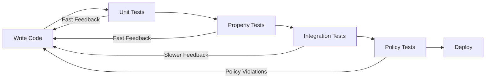
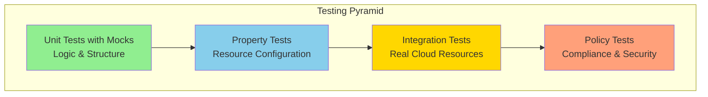
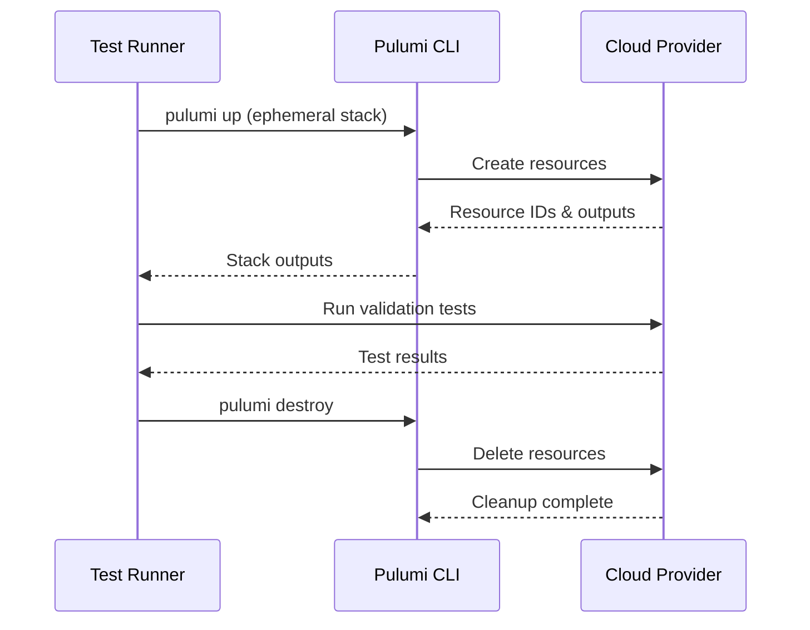
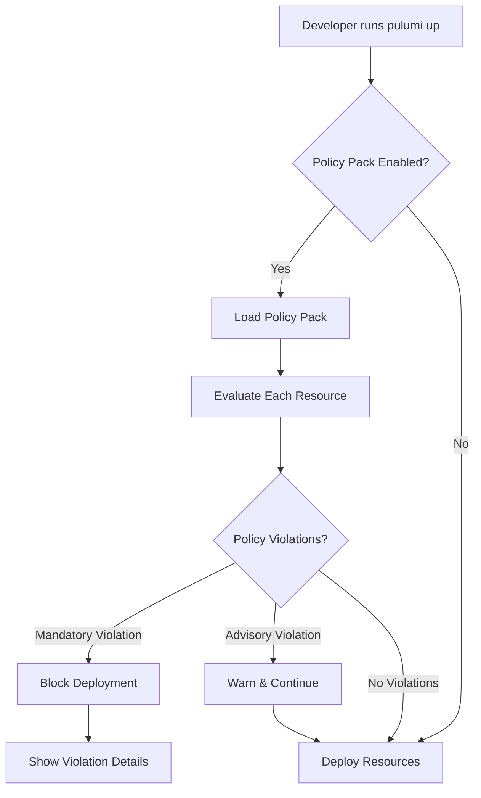
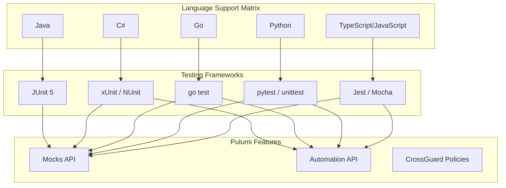
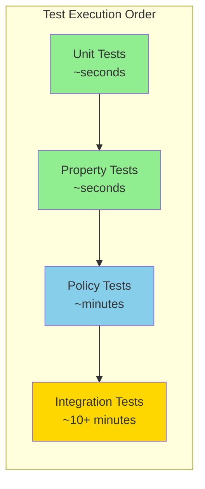

# How to Test Pulumi Programs

Author: [nawazdhandala](https://github.com/nawazdhandala)

Tags: Pulumi, Infrastructure as Code, Testing, DevOps, Unit Testing, Integration Testing, Policy as Code, TypeScript, Python, Go

Description: A comprehensive guide to testing Pulumi infrastructure as code programs, covering unit tests with mocks, property tests, integration tests, and policy as code validation across multiple languages.

---

> "Infrastructure code that isn't tested is just a wish list. The real power of Infrastructure as Code comes when you can refactor with confidence, knowing your tests will catch regressions before they reach production."

## Why Test Infrastructure Code?

Testing infrastructure might seem unnecessary when you can just deploy and see what happens. But production outages from misconfigured resources are expensive. Testing your Pulumi programs provides:

- **Fast feedback loops** - catch errors in seconds, not after a 20-minute deployment
- **Refactoring confidence** - change code knowing tests will catch regressions
- **Documentation** - tests describe expected behavior better than comments
- **Collaboration safety** - team members can contribute without fear of breaking things



## Understanding Pulumi's Testing Pyramid

Pulumi supports multiple testing strategies, each with different trade-offs:



## Unit Testing with Mocks

Unit tests run entirely in memory without any cloud provider calls. Pulumi's mock system intercepts resource creation and returns predictable values.

### TypeScript/JavaScript Unit Tests

```typescript
// __tests__/infrastructure.test.ts
// Unit tests for S3 bucket infrastructure using Pulumi mocks

import * as pulumi from "@pulumi/pulumi";

// IMPORTANT: Set up mocks BEFORE importing your infrastructure code
// This ensures all resource creations are intercepted
pulumi.runtime.setMocks({
    // newResource is called for every resource creation
    // Returns mock values that simulate cloud provider responses
    newResource: (args: pulumi.runtime.MockResourceArgs): { id: string; state: any } => {
        // Generate a predictable ID based on resource name
        const defaultId = `${args.name}-id`;

        // Return state that matches what the real provider would return
        // Include all inputs plus any computed properties
        return {
            id: defaultId,
            state: {
                ...args.inputs,
                // S3 buckets get computed properties like ARN and domain
                arn: `arn:aws:s3:::${args.inputs.bucket || args.name}`,
                bucketDomainName: `${args.inputs.bucket || args.name}.s3.amazonaws.com`,
            },
        };
    },
    // call is invoked for provider function calls (data sources)
    call: (args: pulumi.runtime.MockCallArgs) => {
        return args.inputs;
    },
});

// NOW import the infrastructure code after mocks are configured
import { dataBucket, logBucket, bucketPolicy } from "../index";

describe("S3 Infrastructure", () => {
    // Helper to extract values from Pulumi Outputs
    // Outputs are promises that resolve after apply() completes
    const getOutput = <T>(output: pulumi.Output<T>): Promise<T> => {
        return new Promise((resolve) => output.apply(resolve));
    };

    test("data bucket has versioning enabled", async () => {
        // Verify versioning is configured for data integrity
        const versioning = await getOutput(dataBucket.versioning);
        expect(versioning?.enabled).toBe(true);
    });

    test("data bucket blocks public access", async () => {
        // Security requirement: all buckets must block public access
        const publicAccess = await getOutput(dataBucket.blockPublicAcls);
        expect(publicAccess).toBe(true);
    });

    test("log bucket has lifecycle rules for cost management", async () => {
        // Logs should expire after retention period to control costs
        const lifecycleRules = await getOutput(logBucket.lifecycleRules);
        expect(lifecycleRules).toBeDefined();
        expect(lifecycleRules?.length).toBeGreaterThan(0);

        // Verify expiration is set (not infinite retention)
        const hasExpiration = lifecycleRules?.some(
            (rule: any) => rule.expiration?.days !== undefined
        );
        expect(hasExpiration).toBe(true);
    });

    test("bucket policy follows least privilege", async () => {
        // Parse the policy document to verify permissions
        const policyDoc = await getOutput(bucketPolicy.policy);
        const policy = JSON.parse(policyDoc);

        // Ensure no wildcard principals
        const statements = policy.Statement || [];
        const hasWildcardPrincipal = statements.some(
            (s: any) => s.Principal === "*" && s.Effect === "Allow"
        );
        expect(hasWildcardPrincipal).toBe(false);
    });
});
```

### Python Unit Tests

```python
# test_infrastructure.py
# Unit tests for AWS infrastructure using Pulumi's Python testing framework

import unittest
import pulumi

# Create a mock class that intercepts all resource creation
# This allows tests to run without cloud credentials or API calls
class MyMocks(pulumi.runtime.Mocks):
    def new_resource(self, args: pulumi.runtime.MockResourceArgs):
        """
        Called for every resource creation.
        Returns a tuple of (resource_id, resource_state).

        The state should include:
        - All input properties (args.inputs)
        - Computed properties the provider would add (ARN, ID, etc.)
        """
        # Generate deterministic ID for test assertions
        resource_id = f"{args.name}-mock-id"

        # Build state based on resource type
        state = dict(args.inputs)

        # Add computed properties based on resource type
        if args.typ == "aws:s3/bucket:Bucket":
            bucket_name = args.inputs.get("bucket", args.name)
            state.update({
                "arn": f"arn:aws:s3:::{bucket_name}",
                "bucketDomainName": f"{bucket_name}.s3.amazonaws.com",
                "region": args.inputs.get("region", "us-east-1"),
            })
        elif args.typ == "aws:ec2/instance:Instance":
            state.update({
                "publicIp": "10.0.0.1",  # Mock IP for testing
                "privateIp": "192.168.1.1",
                "instanceState": "running",
            })
        elif args.typ == "aws:rds/instance:Instance":
            state.update({
                "endpoint": f"{args.name}.xxxxx.us-east-1.rds.amazonaws.com",
                "port": args.inputs.get("port", 5432),
            })

        return [resource_id, state]

    def call(self, args: pulumi.runtime.MockCallArgs):
        """
        Called for data source lookups and provider functions.
        Return mock data that tests can rely on.
        """
        # Mock common data source calls
        if args.token == "aws:ec2/getAmi:getAmi":
            return {
                "id": "ami-12345678",
                "architecture": "x86_64",
                "name": "mock-ami",
            }
        elif args.token == "aws:availability_zones:getAvailabilityZones":
            return {
                "names": ["us-east-1a", "us-east-1b", "us-east-1c"],
            }
        return {}


# Initialize mocks BEFORE importing infrastructure
pulumi.runtime.set_mocks(MyMocks())

# Now import the infrastructure module
from infrastructure import (
    web_server,
    database,
    security_group,
    load_balancer,
)


class TestInfrastructure(unittest.TestCase):
    """Test suite for validating infrastructure configuration."""

    @pulumi.runtime.test
    def test_web_server_uses_correct_instance_type(self):
        """Verify web servers use cost-effective instance types."""
        def check_instance_type(instance_type):
            # Allow t3 family for cost optimization
            # Reject expensive instance types in non-prod
            allowed_types = ["t3.micro", "t3.small", "t3.medium"]
            self.assertIn(
                instance_type,
                allowed_types,
                f"Instance type {instance_type} not in allowed list"
            )

        return web_server.instance_type.apply(check_instance_type)

    @pulumi.runtime.test
    def test_database_has_encryption_enabled(self):
        """All databases must have encryption at rest enabled."""
        def check_encryption(storage_encrypted):
            self.assertTrue(
                storage_encrypted,
                "Database storage encryption must be enabled"
            )

        return database.storage_encrypted.apply(check_encryption)

    @pulumi.runtime.test
    def test_database_has_backup_retention(self):
        """Verify backup retention meets compliance requirements."""
        def check_retention(retention_period):
            min_retention = 7  # Minimum 7 days for compliance
            self.assertGreaterEqual(
                retention_period,
                min_retention,
                f"Backup retention {retention_period} days is below minimum {min_retention}"
            )

        return database.backup_retention_period.apply(check_retention)

    @pulumi.runtime.test
    def test_security_group_no_open_ingress(self):
        """Security groups must not allow unrestricted ingress."""
        def check_ingress_rules(ingress):
            for rule in ingress or []:
                # Check for overly permissive CIDR blocks
                cidr_blocks = rule.get("cidr_blocks", [])
                self.assertNotIn(
                    "0.0.0.0/0",
                    cidr_blocks,
                    f"Security group allows unrestricted access on port {rule.get('from_port')}"
                )

        return security_group.ingress.apply(check_ingress_rules)

    @pulumi.runtime.test
    def test_load_balancer_uses_https(self):
        """Load balancers must use HTTPS for external traffic."""
        def check_listener_protocol(listeners):
            for listener in listeners or []:
                if listener.get("port") == 443:
                    self.assertEqual(
                        listener.get("protocol"),
                        "HTTPS",
                        "Port 443 must use HTTPS protocol"
                    )

        return load_balancer.listeners.apply(check_listener_protocol)


if __name__ == "__main__":
    unittest.main()
```

### Go Unit Tests

```go
// infrastructure_test.go
// Unit tests for Pulumi infrastructure using Go's testing package

package main

import (
	"testing"

	"github.com/pulumi/pulumi/sdk/v3/go/common/resource"
	"github.com/pulumi/pulumi/sdk/v3/go/pulumi"
	"github.com/stretchr/testify/assert"
)

// mocks implements the pulumi.MockResourceMonitor interface
// It intercepts all resource creation calls during tests
type mocks struct {
	// Add fields to track created resources if needed
	createdResources []string
}

// NewResource is called whenever a resource is created
// Returns the resource ID and output properties
func (m *mocks) NewResource(args pulumi.MockResourceArgs) (string, resource.PropertyMap, error) {
	// Track resource creation for assertions
	m.createdResources = append(m.createdResources, args.Name)

	// Generate predictable resource ID
	resourceID := args.Name + "-id"

	// Start with input properties
	outputs := args.Inputs.Copy()

	// Add computed properties based on resource type
	switch args.TypeToken {
	case "aws:s3/bucket:Bucket":
		// S3 buckets need ARN and domain name
		bucketName := args.Inputs["bucket"].StringValue()
		if bucketName == "" {
			bucketName = args.Name
		}
		outputs["arn"] = resource.NewStringProperty(
			"arn:aws:s3:::" + bucketName,
		)
		outputs["bucketDomainName"] = resource.NewStringProperty(
			bucketName + ".s3.amazonaws.com",
		)

	case "aws:ec2/instance:Instance":
		// EC2 instances get IP addresses assigned
		outputs["publicIp"] = resource.NewStringProperty("203.0.113.1")
		outputs["privateIp"] = resource.NewStringProperty("10.0.1.50")
		outputs["instanceState"] = resource.NewStringProperty("running")

	case "aws:rds/cluster:Cluster":
		// RDS clusters get endpoints
		outputs["endpoint"] = resource.NewStringProperty(
			args.Name + ".cluster.us-east-1.rds.amazonaws.com",
		)
		outputs["readerEndpoint"] = resource.NewStringProperty(
			args.Name + ".cluster-ro.us-east-1.rds.amazonaws.com",
		)
	}

	return resourceID, outputs, nil
}

// Call handles provider function invocations (data sources)
func (m *mocks) Call(args pulumi.MockCallArgs) (resource.PropertyMap, error) {
	outputs := resource.PropertyMap{}

	switch args.Token {
	case "aws:ec2/getAmi:getAmi":
		// Return mock AMI data
		outputs["id"] = resource.NewStringProperty("ami-0123456789abcdef0")
		outputs["architecture"] = resource.NewStringProperty("x86_64")

	case "aws:availability_zones:getAvailabilityZones":
		// Return mock availability zones
		outputs["names"] = resource.NewArrayProperty([]resource.PropertyValue{
			resource.NewStringProperty("us-east-1a"),
			resource.NewStringProperty("us-east-1b"),
		})
	}

	return outputs, nil
}

// TestS3BucketConfiguration validates S3 bucket settings
func TestS3BucketConfiguration(t *testing.T) {
	// Run infrastructure code with mocks
	err := pulumi.RunErr(func(ctx *pulumi.Context) error {
		// Call your infrastructure function
		infra, err := NewInfrastructure(ctx, "test")
		if err != nil {
			return err
		}

		// Test versioning is enabled
		// Use ApplyT to transform and test Output values
		pulumi.All(infra.DataBucket.Versioning).ApplyT(
			func(args []interface{}) error {
				versioning := args[0].(map[string]interface{})
				assert.True(t, versioning["enabled"].(bool),
					"Data bucket must have versioning enabled")
				return nil
			})

		// Test encryption is configured
		pulumi.All(infra.DataBucket.ServerSideEncryptionConfiguration).ApplyT(
			func(args []interface{}) error {
				encryption := args[0]
				assert.NotNil(t, encryption,
					"Data bucket must have server-side encryption")
				return nil
			})

		return nil
	}, pulumi.WithMocks("project", "stack", &mocks{}))

	assert.NoError(t, err)
}

// TestDatabaseConfiguration validates RDS cluster settings
func TestDatabaseConfiguration(t *testing.T) {
	err := pulumi.RunErr(func(ctx *pulumi.Context) error {
		infra, err := NewInfrastructure(ctx, "test")
		if err != nil {
			return err
		}

		// Verify encryption at rest
		infra.Database.StorageEncrypted.ApplyT(func(encrypted bool) error {
			assert.True(t, encrypted,
				"Database must have storage encryption enabled")
			return nil
		})

		// Verify backup retention
		infra.Database.BackupRetentionPeriod.ApplyT(func(days int) error {
			assert.GreaterOrEqual(t, days, 7,
				"Backup retention must be at least 7 days")
			return nil
		})

		// Verify deletion protection in production
		infra.Database.DeletionProtection.ApplyT(func(protected bool) error {
			// This would be conditional based on stack name in real code
			assert.True(t, protected,
				"Production database must have deletion protection")
			return nil
		})

		return nil
	}, pulumi.WithMocks("project", "prod", &mocks{}))

	assert.NoError(t, err)
}

// TestSecurityGroupRules validates security group configuration
func TestSecurityGroupRules(t *testing.T) {
	err := pulumi.RunErr(func(ctx *pulumi.Context) error {
		infra, err := NewInfrastructure(ctx, "test")
		if err != nil {
			return err
		}

		// Check ingress rules don't allow 0.0.0.0/0
		infra.WebSecurityGroup.Ingress.ApplyT(func(rules []interface{}) error {
			for _, rule := range rules {
				r := rule.(map[string]interface{})
				cidrs := r["cidrBlocks"].([]string)
				for _, cidr := range cidrs {
					assert.NotEqual(t, "0.0.0.0/0", cidr,
						"Security group must not allow unrestricted ingress")
				}
			}
			return nil
		})

		return nil
	}, pulumi.WithMocks("project", "stack", &mocks{}))

	assert.NoError(t, err)
}
```

## Property Testing

Property tests verify that resources have expected configurations without deploying. They're faster than integration tests and catch configuration drift.

```typescript
// property-tests.ts
// Property-based testing for resource configurations
// These tests verify resource properties match requirements

import * as pulumi from "@pulumi/pulumi";
import * as aws from "@pulumi/aws";

// Define a test stack that creates resources for property testing
const testStack = async () => {
    // Set up mocks for property testing
    pulumi.runtime.setMocks({
        newResource: (args) => ({
            id: `${args.name}-id`,
            state: args.inputs,
        }),
        call: (args) => args.inputs,
    });

    // Import and test your infrastructure
    const infra = await import("../index");

    return infra;
};

describe("Resource Property Tests", () => {
    // Property: All S3 buckets must have specific tags
    test("all S3 buckets have required tags", async () => {
        const infra = await testStack();

        // Collect all bucket resources
        const buckets = [
            infra.dataBucket,
            infra.logBucket,
            infra.backupBucket,
        ];

        // Required tags for compliance and cost allocation
        const requiredTags = ["Environment", "Project", "Owner", "CostCenter"];

        for (const bucket of buckets) {
            const tags = await new Promise<Record<string, string>>((resolve) => {
                bucket.tags.apply((t) => resolve(t || {}));
            });

            for (const requiredTag of requiredTags) {
                expect(tags).toHaveProperty(
                    requiredTag,
                    expect.any(String)
                );
            }
        }
    });

    // Property: All EC2 instances must use approved AMIs
    test("EC2 instances use approved AMIs", async () => {
        const infra = await testStack();

        // List of security-approved AMI patterns
        const approvedAmiPatterns = [
            /^ami-[a-f0-9]+$/,  // Valid AMI format
        ];

        // Golden AMI IDs maintained by security team
        const goldenAmis = [
            "ami-0123456789abcdef0",  // Amazon Linux 2
            "ami-fedcba9876543210f",  // Ubuntu 22.04 hardened
        ];

        const instanceAmi = await new Promise<string>((resolve) => {
            infra.webServer.ami.apply(resolve);
        });

        const isApproved = goldenAmis.includes(instanceAmi) ||
            approvedAmiPatterns.some((p) => p.test(instanceAmi));

        expect(isApproved).toBe(true);
    });

    // Property: Database connection strings follow naming convention
    test("database endpoints follow naming convention", async () => {
        const infra = await testStack();

        const endpoint = await new Promise<string>((resolve) => {
            infra.database.endpoint.apply(resolve);
        });

        // Endpoint should include environment and service name
        expect(endpoint).toMatch(/^[\w-]+-db\./);
    });

    // Property: All resources have consistent naming
    test("resource names follow convention", async () => {
        const infra = await testStack();

        // Naming convention: {project}-{environment}-{resource-type}
        const namingPattern = /^myapp-(dev|staging|prod)-[\w-]+$/;

        const resourceNames = [
            await promiseFromOutput(infra.vpc.tags?.Name),
            await promiseFromOutput(infra.dataBucket.bucket),
            await promiseFromOutput(infra.webServer.tags?.Name),
        ];

        for (const name of resourceNames) {
            if (name) {
                expect(name).toMatch(namingPattern);
            }
        }
    });
});

// Helper to convert Pulumi Output to Promise
function promiseFromOutput<T>(output: pulumi.Output<T> | undefined): Promise<T | undefined> {
    if (!output) return Promise.resolve(undefined);
    return new Promise((resolve) => output.apply(resolve));
}
```

## Integration Testing

Integration tests deploy real resources to verify end-to-end behavior. They're slower but catch issues that mocks can't simulate.



### Integration Test Framework

```typescript
// integration.test.ts
// End-to-end integration tests that deploy real resources
// WARNING: These tests create real cloud resources and incur costs

import * as pulumi from "@pulumi/pulumi/automation";
import * as https from "https";
import * as dns from "dns";

// Configuration for test stacks
const projectName = "integration-tests";
const stackName = `test-${Date.now()}`; // Unique stack per test run

// Test timeout - integration tests can take several minutes
jest.setTimeout(600000); // 10 minutes

describe("Infrastructure Integration Tests", () => {
    let stack: pulumi.Stack;
    let outputs: pulumi.OutputMap;

    // Deploy infrastructure before all tests
    beforeAll(async () => {
        console.log(`Creating test stack: ${stackName}`);

        // Create an ephemeral stack for testing
        // Using inline program allows defining infrastructure in test file
        stack = await pulumi.LocalWorkspace.createOrSelectStack({
            projectName,
            stackName,
            // Point to your Pulumi program directory
            workDir: "../",
        });

        // Configure the stack for testing environment
        await stack.setConfig("aws:region", { value: "us-east-1" });
        await stack.setConfig("environment", { value: "test" });
        await stack.setConfig("instanceType", { value: "t3.micro" }); // Cost-effective for tests

        console.log("Deploying test infrastructure...");

        // Deploy and capture outputs
        const upResult = await stack.up({
            onOutput: console.log, // Stream deployment progress
        });

        outputs = upResult.outputs;

        console.log("Infrastructure deployed successfully");
        console.log("Outputs:", JSON.stringify(outputs, null, 2));
    });

    // Clean up after all tests complete
    afterAll(async () => {
        if (stack) {
            console.log("Destroying test infrastructure...");

            await stack.destroy({
                onOutput: console.log,
            });

            // Remove the stack entirely
            await stack.workspace.removeStack(stackName);

            console.log("Cleanup complete");
        }
    });

    test("web server responds to HTTP requests", async () => {
        // Get the deployed load balancer URL
        const albDns = outputs.albDnsName.value as string;
        expect(albDns).toBeDefined();

        // Wait for DNS propagation and health checks
        await sleep(30000); // 30 seconds

        // Make HTTP request to deployed application
        const response = await httpGet(`http://${albDns}/health`);

        expect(response.statusCode).toBe(200);
        expect(response.body).toContain("healthy");
    });

    test("database is reachable from application", async () => {
        // This tests the security group and network configuration
        const dbEndpoint = outputs.dbEndpoint.value as string;
        expect(dbEndpoint).toBeDefined();

        // Verify DNS resolves (database is in VPC)
        const addresses = await resolveDns(dbEndpoint.split(":")[0]);
        expect(addresses.length).toBeGreaterThan(0);

        // Note: Direct database connection test would require
        // a bastion host or VPN - this verifies DNS setup
    });

    test("S3 bucket is accessible with correct permissions", async () => {
        const bucketName = outputs.dataBucketName.value as string;
        expect(bucketName).toBeDefined();

        // Use AWS SDK to verify bucket configuration
        const { S3Client, HeadBucketCommand } = await import("@aws-sdk/client-s3");
        const s3 = new S3Client({ region: "us-east-1" });

        // Verify bucket exists and we have access
        const command = new HeadBucketCommand({ Bucket: bucketName });
        const result = await s3.send(command);

        expect(result.$metadata.httpStatusCode).toBe(200);
    });

    test("CloudWatch alarms are properly configured", async () => {
        const alarmArn = outputs.cpuAlarmArn.value as string;
        expect(alarmArn).toBeDefined();

        const { CloudWatchClient, DescribeAlarmsCommand } = await import(
            "@aws-sdk/client-cloudwatch"
        );
        const cw = new CloudWatchClient({ region: "us-east-1" });

        // Extract alarm name from ARN
        const alarmName = alarmArn.split(":alarm:")[1];

        const command = new DescribeAlarmsCommand({
            AlarmNames: [alarmName],
        });
        const result = await cw.send(command);

        expect(result.MetricAlarms?.length).toBe(1);
        expect(result.MetricAlarms?.[0].ActionsEnabled).toBe(true);
    });

    test("auto-scaling group scales correctly", async () => {
        const asgName = outputs.asgName.value as string;
        expect(asgName).toBeDefined();

        const { AutoScalingClient, DescribeAutoScalingGroupsCommand } = await import(
            "@aws-sdk/client-auto-scaling"
        );
        const asg = new AutoScalingClient({ region: "us-east-1" });

        const command = new DescribeAutoScalingGroupsCommand({
            AutoScalingGroupNames: [asgName],
        });
        const result = await asg.send(command);

        const group = result.AutoScalingGroups?.[0];
        expect(group).toBeDefined();
        expect(group?.MinSize).toBeGreaterThanOrEqual(1);
        expect(group?.MaxSize).toBeGreaterThanOrEqual(group?.MinSize || 0);
        expect(group?.DesiredCapacity).toBeGreaterThanOrEqual(group?.MinSize || 0);
    });
});

// Helper functions
function sleep(ms: number): Promise<void> {
    return new Promise((resolve) => setTimeout(resolve, ms));
}

function httpGet(url: string): Promise<{ statusCode: number; body: string }> {
    return new Promise((resolve, reject) => {
        const client = url.startsWith("https") ? https : require("http");
        client.get(url, (res: any) => {
            let body = "";
            res.on("data", (chunk: string) => (body += chunk));
            res.on("end", () => resolve({ statusCode: res.statusCode, body }));
        }).on("error", reject);
    });
}

function resolveDns(hostname: string): Promise<string[]> {
    return new Promise((resolve, reject) => {
        dns.resolve4(hostname, (err, addresses) => {
            if (err) reject(err);
            else resolve(addresses);
        });
    });
}
```

## Policy as Code Testing

Pulumi CrossGuard enables policy-as-code to enforce compliance rules. Policies run during `pulumi preview` and `pulumi up` to catch violations before deployment.



### Creating Policy Packs

```typescript
// policy/index.ts
// CrossGuard policy pack for enforcing security and compliance standards
// Install: npm install @pulumi/policy

import * as policy from "@pulumi/policy";
import * as aws from "@pulumi/aws";

// Create a new policy pack with multiple policies
const policies = new policy.PolicyPack("security-compliance", {
    policies: [
        // POLICY 1: Enforce S3 bucket encryption
        // Severity: mandatory (blocks deployment if violated)
        {
            name: "s3-bucket-encryption",
            description: "All S3 buckets must have server-side encryption enabled",
            enforcementLevel: "mandatory",
            // validateResource runs for each resource of matching type
            validateResource: policy.validateResourceOfType(
                aws.s3.Bucket,
                (bucket, args, reportViolation) => {
                    // Check if encryption is configured
                    const encryption = bucket.serverSideEncryptionConfiguration;

                    if (!encryption || !encryption.rule) {
                        reportViolation(
                            "S3 bucket must have server-side encryption enabled. " +
                            "Add a serverSideEncryptionConfiguration block with AES256 or aws:kms."
                        );
                    }
                }
            ),
        },

        // POLICY 2: Block public S3 buckets
        {
            name: "s3-no-public-access",
            description: "S3 buckets must block public access",
            enforcementLevel: "mandatory",
            validateResource: policy.validateResourceOfType(
                aws.s3.BucketPublicAccessBlock,
                (block, args, reportViolation) => {
                    // All public access blocks must be true
                    if (!block.blockPublicAcls) {
                        reportViolation("blockPublicAcls must be enabled");
                    }
                    if (!block.blockPublicPolicy) {
                        reportViolation("blockPublicPolicy must be enabled");
                    }
                    if (!block.ignorePublicAcls) {
                        reportViolation("ignorePublicAcls must be enabled");
                    }
                    if (!block.restrictPublicBuckets) {
                        reportViolation("restrictPublicBuckets must be enabled");
                    }
                }
            ),
        },

        // POLICY 3: Enforce RDS encryption
        {
            name: "rds-encryption-required",
            description: "RDS instances must have storage encryption enabled",
            enforcementLevel: "mandatory",
            validateResource: policy.validateResourceOfType(
                aws.rds.Instance,
                (instance, args, reportViolation) => {
                    if (!instance.storageEncrypted) {
                        reportViolation(
                            "RDS instance must have storageEncrypted set to true. " +
                            "This is required for data-at-rest encryption compliance."
                        );
                    }
                }
            ),
        },

        // POLICY 4: Enforce minimum backup retention
        {
            name: "rds-backup-retention",
            description: "RDS instances must have at least 7 days backup retention",
            enforcementLevel: "mandatory",
            validateResource: policy.validateResourceOfType(
                aws.rds.Instance,
                (instance, args, reportViolation) => {
                    const retention = instance.backupRetentionPeriod ?? 0;
                    if (retention < 7) {
                        reportViolation(
                            `Backup retention is ${retention} days. ` +
                            "Minimum required retention is 7 days for compliance."
                        );
                    }
                }
            ),
        },

        // POLICY 5: No unrestricted security group ingress
        {
            name: "security-group-no-unrestricted-ingress",
            description: "Security groups must not allow unrestricted ingress (0.0.0.0/0)",
            enforcementLevel: "mandatory",
            validateResource: policy.validateResourceOfType(
                aws.ec2.SecurityGroup,
                (sg, args, reportViolation) => {
                    const ingress = sg.ingress ?? [];

                    for (const rule of ingress) {
                        const cidrBlocks = rule.cidrBlocks ?? [];
                        const port = rule.fromPort;

                        // Allow 0.0.0.0/0 only for HTTPS (443) and HTTP (80)
                        const allowedOpenPorts = [80, 443];

                        if (cidrBlocks.includes("0.0.0.0/0") &&
                            !allowedOpenPorts.includes(port ?? -1)) {
                            reportViolation(
                                `Security group allows unrestricted access (0.0.0.0/0) ` +
                                `on port ${port}. This is only allowed for ports 80 and 443.`
                            );
                        }
                    }
                }
            ),
        },

        // POLICY 6: Require resource tags (advisory - warns but doesn't block)
        {
            name: "require-cost-tags",
            description: "Resources should have cost allocation tags",
            enforcementLevel: "advisory", // Warns but allows deployment
            validateResource: (args, reportViolation) => {
                // Check if resource supports tags
                const tags = args.props.tags as Record<string, string> | undefined;

                if (args.type.startsWith("aws:") &&
                    !args.type.includes("Policy") &&
                    !args.type.includes("Attachment")) {

                    const requiredTags = ["Environment", "Project", "CostCenter"];

                    for (const tag of requiredTags) {
                        if (!tags?.[tag]) {
                            reportViolation(
                                `Resource is missing recommended tag: ${tag}. ` +
                                "Cost allocation tags help with billing attribution."
                            );
                        }
                    }
                }
            },
        },

        // POLICY 7: Enforce approved instance types
        {
            name: "approved-instance-types",
            description: "EC2 instances must use approved instance types",
            enforcementLevel: "mandatory",
            validateResource: policy.validateResourceOfType(
                aws.ec2.Instance,
                (instance, args, reportViolation) => {
                    // Approved instance types for cost control
                    const approvedTypes = [
                        "t3.micro", "t3.small", "t3.medium", "t3.large",
                        "t3a.micro", "t3a.small", "t3a.medium", "t3a.large",
                        "m5.large", "m5.xlarge",
                        "c5.large", "c5.xlarge",
                    ];

                    if (!approvedTypes.includes(instance.instanceType ?? "")) {
                        reportViolation(
                            `Instance type '${instance.instanceType}' is not approved. ` +
                            `Approved types: ${approvedTypes.join(", ")}`
                        );
                    }
                }
            ),
        },

        // POLICY 8: Stack-level validation
        {
            name: "require-https-endpoints",
            description: "All public endpoints must use HTTPS",
            enforcementLevel: "mandatory",
            // validateStack runs once with access to all resources
            validateStack: (args, reportViolation) => {
                // Find all load balancer listeners
                const listeners = args.resources.filter(
                    (r) => r.type === "aws:elasticloadbalancingv2/listener:Listener"
                );

                for (const listener of listeners) {
                    const props = listener.props;
                    const port = props.port as number;
                    const protocol = props.protocol as string;

                    // External-facing listeners on 443 must use HTTPS
                    if (port === 443 && protocol !== "HTTPS") {
                        reportViolation(
                            `Listener ${listener.name} on port 443 must use HTTPS protocol`
                        );
                    }
                }
            },
        },
    ],
});

export = policies;
```

### Running Policy Tests

```bash
# Run policies during preview
pulumi preview --policy-pack ./policy

# Run policies during deployment
pulumi up --policy-pack ./policy

# Test policy pack against existing stack
pulumi policy validate ./policy --stack dev

# Publish policy pack for organization-wide use
pulumi policy publish ./policy
```

## Test Frameworks by Language

Different languages have their own testing conventions. Here's a summary of the recommended approach for each.



### Framework Quick Reference

| Language | Unit Test Framework | Mock Setup | Integration API |
|----------|---------------------|------------|-----------------|
| TypeScript | Jest, Mocha | `pulumi.runtime.setMocks()` | `@pulumi/pulumi/automation` |
| Python | pytest, unittest | `pulumi.runtime.set_mocks()` | `pulumi.automation` |
| Go | go test | `pulumi.WithMocks()` | `github.com/pulumi/pulumi/sdk/v3/go/auto` |
| C# | xUnit, NUnit | `Pulumi.Deployment.TestAsync()` | `Pulumi.Automation` |
| Java | JUnit 5 | `Mocks` interface | `com.pulumi.automation` |

### C# Example

```csharp
// InfrastructureTests.cs
// Unit tests for Pulumi C# infrastructure

using System.Collections.Immutable;
using System.Threading.Tasks;
using Pulumi;
using Pulumi.Testing;
using Xunit;

namespace Infrastructure.Tests
{
    // Mock implementation for testing
    public class TestMocks : IMocks
    {
        public Task<(string? id, object state)> NewResourceAsync(
            MockResourceArgs args)
        {
            // Return mock state for resources
            var state = args.Inputs;

            // Add computed properties based on type
            if (args.Type == "aws:s3/bucket:Bucket")
            {
                var bucketName = args.Inputs.GetValueOrDefault("bucket")?.ToString()
                    ?? args.Name;
                state = state.Add("arn", $"arn:aws:s3:::{bucketName}");
                state = state.Add("bucketDomainName", $"{bucketName}.s3.amazonaws.com");
            }

            return Task.FromResult<(string?, object)>(
                ($"{args.Name}-id", state)
            );
        }

        public Task<object> CallAsync(MockCallArgs args)
        {
            return Task.FromResult<object>(args.Args);
        }
    }

    public class InfrastructureTests
    {
        [Fact]
        public async Task S3BucketHasVersioningEnabled()
        {
            // Run the stack with mocks
            var resources = await Deployment.TestAsync<MyStack>(
                new TestMocks(),
                new TestOptions { IsPreview = false }
            );

            // Find the S3 bucket resource
            var bucket = resources.OfType<Pulumi.Aws.S3.Bucket>()
                .FirstOrDefault(b => b.GetResourceName() == "data-bucket");

            Assert.NotNull(bucket);

            // Verify versioning is enabled
            var versioning = await bucket.Versioning.GetValueAsync();
            Assert.True(versioning?.Enabled ?? false,
                "S3 bucket must have versioning enabled");
        }

        [Fact]
        public async Task DatabaseHasEncryption()
        {
            var resources = await Deployment.TestAsync<MyStack>(
                new TestMocks(),
                new TestOptions { IsPreview = false }
            );

            var database = resources.OfType<Pulumi.Aws.Rds.Instance>()
                .FirstOrDefault();

            Assert.NotNull(database);

            var encrypted = await database.StorageEncrypted.GetValueAsync();
            Assert.True(encrypted, "Database must have encryption enabled");
        }
    }
}
```

## CI/CD Integration

Integrate Pulumi tests into your CI/CD pipeline for automated validation.

```yaml
# .github/workflows/pulumi-tests.yml
# GitHub Actions workflow for testing Pulumi infrastructure

name: Pulumi Tests

on:
  pull_request:
    branches: [main]
  push:
    branches: [main]

env:
  PULUMI_ACCESS_TOKEN: ${{ secrets.PULUMI_ACCESS_TOKEN }}
  AWS_ACCESS_KEY_ID: ${{ secrets.AWS_ACCESS_KEY_ID }}
  AWS_SECRET_ACCESS_KEY: ${{ secrets.AWS_SECRET_ACCESS_KEY }}

jobs:
  # Job 1: Unit tests (fast, no cloud resources)
  unit-tests:
    name: Unit Tests
    runs-on: ubuntu-latest
    steps:
      - uses: actions/checkout@v4

      - name: Setup Node.js
        uses: actions/setup-node@v4
        with:
          node-version: '20'
          cache: 'npm'

      - name: Install dependencies
        run: npm ci

      - name: Run unit tests
        run: npm test -- --coverage

      - name: Upload coverage report
        uses: codecov/codecov-action@v3
        with:
          files: ./coverage/lcov.info

  # Job 2: Policy validation
  policy-tests:
    name: Policy Validation
    runs-on: ubuntu-latest
    steps:
      - uses: actions/checkout@v4

      - name: Setup Node.js
        uses: actions/setup-node@v4
        with:
          node-version: '20'

      - name: Install Pulumi CLI
        uses: pulumi/setup-pulumi@v2

      - name: Install dependencies
        run: |
          npm ci
          cd policy && npm ci

      - name: Run Pulumi preview with policies
        run: |
          pulumi preview \
            --stack dev \
            --policy-pack ./policy \
            --non-interactive

  # Job 3: Integration tests (only on main branch)
  integration-tests:
    name: Integration Tests
    runs-on: ubuntu-latest
    if: github.ref == 'refs/heads/main'
    needs: [unit-tests, policy-tests]  # Run after fast tests pass
    steps:
      - uses: actions/checkout@v4

      - name: Setup Node.js
        uses: actions/setup-node@v4
        with:
          node-version: '20'

      - name: Install Pulumi CLI
        uses: pulumi/setup-pulumi@v2

      - name: Install dependencies
        run: npm ci

      - name: Run integration tests
        run: npm run test:integration
        env:
          TEST_STACK_NAME: ci-${{ github.run_id }}

      - name: Cleanup on failure
        if: failure()
        run: |
          pulumi destroy --stack ci-${{ github.run_id }} --yes || true
          pulumi stack rm ci-${{ github.run_id }} --yes || true
```

## Best Practices Summary

### Testing Strategy

1. **Start with unit tests** - They're fast and catch most configuration errors
2. **Add property tests** - Verify resource configurations match requirements
3. **Use policy tests** - Enforce security and compliance organization-wide
4. **Run integration tests sparingly** - Reserve for critical paths and pre-production validation

### Mock Design

1. **Keep mocks simple** - Only add computed properties your tests actually need
2. **Use realistic values** - Mock ARNs, IPs, and endpoints that look real
3. **Test edge cases** - What happens when optional properties are undefined?

### Policy Best Practices

1. **Start with advisory** - Introduce new policies as warnings before making them mandatory
2. **Provide helpful messages** - Tell developers how to fix violations, not just what's wrong
3. **Version policy packs** - Treat policies as code with proper versioning

### CI/CD Integration

1. **Fail fast** - Run unit tests first, integration tests only after unit tests pass
2. **Use ephemeral stacks** - Create unique stack names for integration tests
3. **Clean up always** - Use `finally` blocks or CI features to destroy test resources



## Conclusion

Testing Pulumi programs is essential for maintaining reliable infrastructure. By combining unit tests, property tests, integration tests, and policy enforcement, you can catch issues early and deploy with confidence.

The key is finding the right balance: fast unit tests for immediate feedback, property tests for configuration validation, policies for organization-wide compliance, and integration tests for critical path verification.

Start with unit tests today, and gradually build up your testing pyramid as your infrastructure grows in complexity.

---

**Monitor your infrastructure with confidence using [OneUptime](https://oneuptime.com)** - the open-source observability platform that gives you complete visibility into your systems with uptime monitoring, incident management, and status pages.

**Related Reading:**
- [Introducing the OneUptime Terraform Provider](https://oneuptime.com/blog/post/2025-07-01-introducing-terraform-provider-for-oneuptime/view)
- [SRE Best Practices That Actually Move the Needle](https://oneuptime.com/blog/post/2025-11-28-sre-best-practices/view)
- [The Five Stages of SRE Maturity](https://oneuptime.com/blog/post/2025-09-01-the-five-stages-of-sre-maturity/view)
