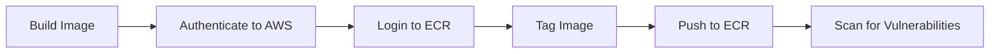

# How to Push to AWS ECR with GitHub Actions

Author: [nawazdhandala](https://www.github.com/nawazdhandala)

Tags: GitHub Actions, AWS ECR, Docker, Container Registry, CI/CD, DevOps

Description: Learn how to build Docker images and push them to Amazon Elastic Container Registry (ECR) using GitHub Actions with proper authentication, caching, and multi-architecture support.

---

Amazon Elastic Container Registry (ECR) is a fully managed Docker container registry that integrates well with other AWS services. This guide shows you how to build and push images to ECR from GitHub Actions.

## ECR Push Workflow Overview

The typical workflow for pushing to ECR:



## Basic ECR Push Workflow

Start with a simple workflow that builds and pushes an image:

```yaml
# .github/workflows/ecr-push.yml
name: Push to ECR

on:
  push:
    branches: [main]
    paths:
      - 'Dockerfile'
      - 'src/**'
      - '.github/workflows/ecr-push.yml'

env:
  AWS_REGION: us-east-1
  ECR_REPOSITORY: my-app

jobs:
  push:
    runs-on: ubuntu-latest
    permissions:
      id-token: write  # Required for OIDC authentication
      contents: read

    steps:
      - uses: actions/checkout@v4

      - name: Configure AWS credentials
        uses: aws-actions/configure-aws-credentials@v4
        with:
          role-to-assume: arn:aws:iam::123456789012:role/GitHubActionsECRPush
          aws-region: ${{ env.AWS_REGION }}

      - name: Login to Amazon ECR
        id: login-ecr
        uses: aws-actions/amazon-ecr-login@v2

      - name: Build and push image
        env:
          ECR_REGISTRY: ${{ steps.login-ecr.outputs.registry }}
          IMAGE_TAG: ${{ github.sha }}
        run: |
          docker build -t $ECR_REGISTRY/$ECR_REPOSITORY:$IMAGE_TAG .
          docker push $ECR_REGISTRY/$ECR_REPOSITORY:$IMAGE_TAG
          docker tag $ECR_REGISTRY/$ECR_REPOSITORY:$IMAGE_TAG $ECR_REGISTRY/$ECR_REPOSITORY:latest
          docker push $ECR_REGISTRY/$ECR_REPOSITORY:latest
```

## Setting Up OIDC Authentication

OIDC authentication is more secure than long-lived credentials. Create an IAM role:

```json
{
  "Version": "2012-10-17",
  "Statement": [
    {
      "Effect": "Allow",
      "Principal": {
        "Federated": "arn:aws:iam::123456789012:oidc-provider/token.actions.githubusercontent.com"
      },
      "Action": "sts:AssumeRoleWithWebIdentity",
      "Condition": {
        "StringEquals": {
          "token.actions.githubusercontent.com:aud": "sts.amazonaws.com"
        },
        "StringLike": {
          "token.actions.githubusercontent.com:sub": "repo:myorg/myrepo:*"
        }
      }
    }
  ]
}
```

Attach this policy to the role:

```json
{
  "Version": "2012-10-17",
  "Statement": [
    {
      "Effect": "Allow",
      "Action": [
        "ecr:GetAuthorizationToken"
      ],
      "Resource": "*"
    },
    {
      "Effect": "Allow",
      "Action": [
        "ecr:BatchCheckLayerAvailability",
        "ecr:GetDownloadUrlForLayer",
        "ecr:BatchGetImage",
        "ecr:PutImage",
        "ecr:InitiateLayerUpload",
        "ecr:UploadLayerPart",
        "ecr:CompleteLayerUpload"
      ],
      "Resource": "arn:aws:ecr:us-east-1:123456789012:repository/my-app"
    }
  ]
}
```

## Using Docker Buildx with ECR

Use buildx for better caching and multi-platform builds:

```yaml
jobs:
  build-push:
    runs-on: ubuntu-latest
    permissions:
      id-token: write
      contents: read

    steps:
      - uses: actions/checkout@v4

      - name: Set up Docker Buildx
        uses: docker/setup-buildx-action@v3

      - name: Configure AWS credentials
        uses: aws-actions/configure-aws-credentials@v4
        with:
          role-to-assume: ${{ secrets.AWS_ROLE_ARN }}
          aws-region: us-east-1

      - name: Login to Amazon ECR
        id: login-ecr
        uses: aws-actions/amazon-ecr-login@v2

      - name: Extract metadata
        id: meta
        uses: docker/metadata-action@v5
        with:
          images: ${{ steps.login-ecr.outputs.registry }}/my-app
          tags: |
            type=sha,prefix=
            type=ref,event=branch
            type=semver,pattern={{version}}
            type=raw,value=latest,enable=${{ github.ref == 'refs/heads/main' }}

      - name: Build and push
        uses: docker/build-push-action@v5
        with:
          context: .
          push: true
          tags: ${{ steps.meta.outputs.tags }}
          labels: ${{ steps.meta.outputs.labels }}
          cache-from: type=gha
          cache-to: type=gha,mode=max
```

## Multi-Architecture Builds

Build images for both AMD64 and ARM64:

```yaml
jobs:
  build-multi-arch:
    runs-on: ubuntu-latest
    permissions:
      id-token: write
      contents: read

    steps:
      - uses: actions/checkout@v4

      - name: Set up QEMU
        uses: docker/setup-qemu-action@v3

      - name: Set up Docker Buildx
        uses: docker/setup-buildx-action@v3

      - name: Configure AWS credentials
        uses: aws-actions/configure-aws-credentials@v4
        with:
          role-to-assume: ${{ secrets.AWS_ROLE_ARN }}
          aws-region: us-east-1

      - name: Login to Amazon ECR
        id: login-ecr
        uses: aws-actions/amazon-ecr-login@v2

      - name: Build and push multi-arch
        uses: docker/build-push-action@v5
        with:
          context: .
          platforms: linux/amd64,linux/arm64
          push: true
          tags: |
            ${{ steps.login-ecr.outputs.registry }}/my-app:${{ github.sha }}
            ${{ steps.login-ecr.outputs.registry }}/my-app:latest
          cache-from: type=gha
          cache-to: type=gha,mode=max
```

## ECR Vulnerability Scanning

Enable scanning and check results:

```yaml
jobs:
  build-scan-push:
    runs-on: ubuntu-latest
    permissions:
      id-token: write
      contents: read

    steps:
      - uses: actions/checkout@v4

      - name: Configure AWS credentials
        uses: aws-actions/configure-aws-credentials@v4
        with:
          role-to-assume: ${{ secrets.AWS_ROLE_ARN }}
          aws-region: us-east-1

      - name: Login to Amazon ECR
        id: login-ecr
        uses: aws-actions/amazon-ecr-login@v2

      - name: Build and push
        env:
          ECR_REGISTRY: ${{ steps.login-ecr.outputs.registry }}
          IMAGE_TAG: ${{ github.sha }}
        run: |
          docker build -t $ECR_REGISTRY/my-app:$IMAGE_TAG .
          docker push $ECR_REGISTRY/my-app:$IMAGE_TAG

      - name: Wait for scan
        run: |
          aws ecr wait image-scan-complete \
            --repository-name my-app \
            --image-id imageTag=${{ github.sha }}

      - name: Check scan results
        run: |
          SCAN_RESULTS=$(aws ecr describe-image-scan-findings \
            --repository-name my-app \
            --image-id imageTag=${{ github.sha }} \
            --query 'imageScanFindings.findingSeverityCounts')

          echo "Scan results: $SCAN_RESULTS"

          # Fail if critical vulnerabilities found
          CRITICAL=$(echo $SCAN_RESULTS | jq -r '.CRITICAL // 0')
          if [ "$CRITICAL" -gt 0 ]; then
            echo "Critical vulnerabilities found!"
            exit 1
          fi
```

## Creating ECR Repository Automatically

Create the repository if it does not exist:

```yaml
jobs:
  ensure-repository:
    runs-on: ubuntu-latest
    permissions:
      id-token: write
      contents: read

    steps:
      - name: Configure AWS credentials
        uses: aws-actions/configure-aws-credentials@v4
        with:
          role-to-assume: ${{ secrets.AWS_ROLE_ARN }}
          aws-region: us-east-1

      - name: Create ECR repository if needed
        run: |
          aws ecr describe-repositories --repository-names my-app 2>/dev/null || \
          aws ecr create-repository \
            --repository-name my-app \
            --image-scanning-configuration scanOnPush=true \
            --encryption-configuration encryptionType=AES256

  build-push:
    needs: ensure-repository
    runs-on: ubuntu-latest
    # ... rest of build job
```

## ECR Lifecycle Policies

Clean up old images automatically:

```yaml
      - name: Set lifecycle policy
        run: |
          aws ecr put-lifecycle-policy \
            --repository-name my-app \
            --lifecycle-policy-text '{
              "rules": [
                {
                  "rulePriority": 1,
                  "description": "Keep last 10 images",
                  "selection": {
                    "tagStatus": "any",
                    "countType": "imageCountMoreThan",
                    "countNumber": 10
                  },
                  "action": {
                    "type": "expire"
                  }
                }
              ]
            }'
```

## Push to Multiple Regions

Replicate images across regions for disaster recovery:

```yaml
jobs:
  build:
    runs-on: ubuntu-latest
    outputs:
      image-digest: ${{ steps.build.outputs.digest }}
    steps:
      - uses: actions/checkout@v4

      - name: Configure AWS credentials
        uses: aws-actions/configure-aws-credentials@v4
        with:
          role-to-assume: ${{ secrets.AWS_ROLE_ARN }}
          aws-region: us-east-1

      - name: Login to Amazon ECR
        id: login-ecr
        uses: aws-actions/amazon-ecr-login@v2

      - name: Build and push
        id: build
        uses: docker/build-push-action@v5
        with:
          context: .
          push: true
          tags: ${{ steps.login-ecr.outputs.registry }}/my-app:${{ github.sha }}

  replicate:
    needs: build
    runs-on: ubuntu-latest
    strategy:
      matrix:
        region: [eu-west-1, ap-southeast-1]
    steps:
      - name: Configure AWS credentials
        uses: aws-actions/configure-aws-credentials@v4
        with:
          role-to-assume: ${{ secrets.AWS_ROLE_ARN }}
          aws-region: ${{ matrix.region }}

      - name: Login to ECR in ${{ matrix.region }}
        id: login-ecr
        uses: aws-actions/amazon-ecr-login@v2

      - name: Pull and push to region
        run: |
          # Pull from primary region
          docker pull 123456789012.dkr.ecr.us-east-1.amazonaws.com/my-app:${{ github.sha }}

          # Tag for secondary region
          docker tag \
            123456789012.dkr.ecr.us-east-1.amazonaws.com/my-app:${{ github.sha }} \
            123456789012.dkr.ecr.${{ matrix.region }}.amazonaws.com/my-app:${{ github.sha }}

          # Push to secondary region
          docker push 123456789012.dkr.ecr.${{ matrix.region }}.amazonaws.com/my-app:${{ github.sha }}
```

## Tagging Strategy

Implement a consistent tagging strategy:

```yaml
      - name: Generate image tags
        id: tags
        run: |
          REGISTRY="${{ steps.login-ecr.outputs.registry }}"
          REPO="my-app"

          # Always tag with commit SHA (immutable)
          TAGS="${REGISTRY}/${REPO}:${{ github.sha }}"

          # Tag with branch name (mutable)
          BRANCH="${GITHUB_REF#refs/heads/}"
          BRANCH="${BRANCH//\//-}"  # Replace slashes with dashes
          TAGS="${TAGS},${REGISTRY}/${REPO}:${BRANCH}"

          # Tag with version if this is a release
          if [[ "$GITHUB_REF" == refs/tags/v* ]]; then
            VERSION="${GITHUB_REF#refs/tags/}"
            TAGS="${TAGS},${REGISTRY}/${REPO}:${VERSION}"
            TAGS="${TAGS},${REGISTRY}/${REPO}:latest"
          fi

          echo "tags=$TAGS" >> $GITHUB_OUTPUT

      - name: Build and push
        uses: docker/build-push-action@v5
        with:
          context: .
          push: true
          tags: ${{ steps.tags.outputs.tags }}
```

## Best Practices

1. **Use OIDC authentication** - Avoid long-lived AWS credentials in GitHub secrets.

2. **Enable image scanning** - Scan images for vulnerabilities on push.

3. **Implement lifecycle policies** - Automatically clean up old images to reduce costs.

4. **Use immutable tags** - Tag with commit SHA for traceability; use mutable tags like `latest` carefully.

5. **Cache layers** - Use GitHub Actions cache or ECR pull-through cache for faster builds.

6. **Multi-arch builds** - Support both AMD64 and ARM64 for flexibility across ECS, EKS, and Lambda.

Pushing to ECR from GitHub Actions gives you a secure, automated path from code to deployable container images.
