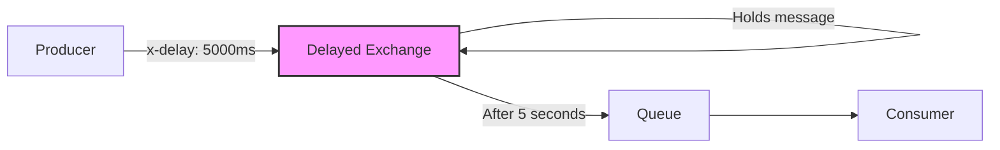
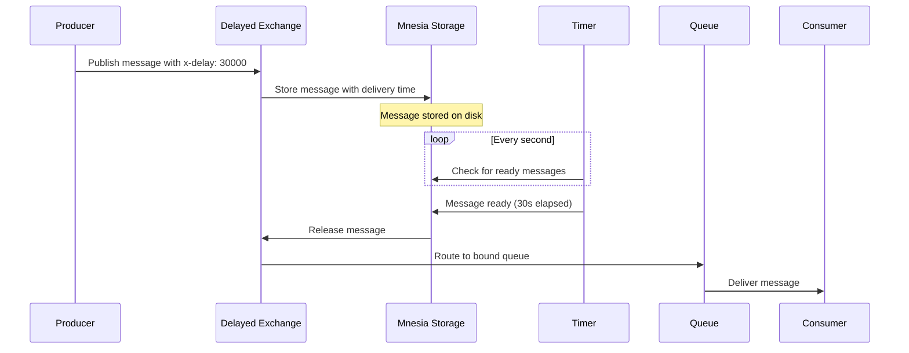
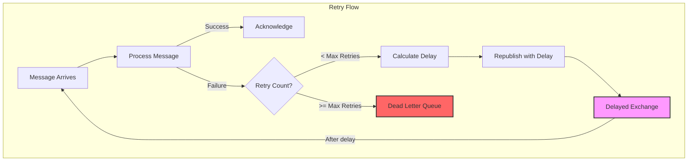
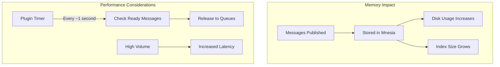
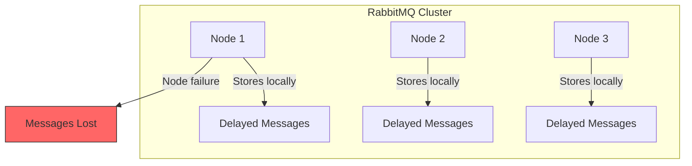

# How to Use RabbitMQ Delayed Message Exchange

Author: [nawazdhandala](https://github.com/nawazdhandala)

Tags: RabbitMQ, Delayed Messages, Message Queues, Scheduling, Distributed Systems, Node.js, Retries

Description: A comprehensive guide to implementing delayed message delivery in RabbitMQ using the delayed message exchange plugin. Learn how to schedule messages, implement retry patterns, set up reminder systems, and understand the limitations and alternatives.

---

> "Time is the most valuable thing a man can spend." - Theophrastus. In distributed systems, timing when messages are delivered can be just as important as the messages themselves.

Message queues typically deliver messages immediately after they are published. However, many real-world scenarios require messages to be delivered after a specific delay: retry mechanisms with exponential backoff, scheduled reminders, rate limiting, or deferred processing. RabbitMQ's delayed message exchange plugin provides an elegant solution for these use cases.

This guide walks you through setting up and using delayed message exchanges, implementing common patterns like retries and scheduled notifications, and understanding when to use alternatives.

---

## Table of Contents

1. What is a Delayed Message Exchange?
2. Installing the Plugin
3. How Delayed Messages Work
4. Basic Setup and Configuration
5. Scheduling Messages with Delays
6. Use Case: Retry with Exponential Backoff
7. Use Case: Scheduled Reminders
8. Use Case: Rate Limiting
9. Limitations of Delayed Message Exchange
10. Alternatives to Delayed Message Exchange
11. Monitoring Delayed Messages
12. Best Practices

---

## 1. What is a Delayed Message Exchange?

A delayed message exchange is a special type of exchange that holds messages for a specified period before routing them to queues. Unlike standard exchanges that route messages immediately, delayed exchanges respect a per-message delay header that determines when the message should be delivered.



The plugin works by storing delayed messages in a Mnesia table (RabbitMQ's internal database) and checking periodically for messages that are ready to be delivered.

---

## 2. Installing the Plugin

The delayed message exchange is not built into RabbitMQ core. You need to install the `rabbitmq_delayed_message_exchange` plugin.

### Enable the Plugin

```bash
# Enable the delayed message exchange plugin
rabbitmq-plugins enable rabbitmq_delayed_message_exchange

# Verify the plugin is enabled
rabbitmq-plugins list | grep delayed

# Expected output:
# [E*] rabbitmq_delayed_message_exchange 3.12.x
```

### Docker Setup

If you're using Docker, you can enable the plugin in your Dockerfile:

```dockerfile
# Dockerfile for RabbitMQ with delayed message exchange
FROM rabbitmq:3.12-management

# Enable the delayed message exchange plugin
RUN rabbitmq-plugins enable --offline rabbitmq_delayed_message_exchange
```

Or use docker-compose:

```yaml
# docker-compose.yml
version: '3.8'
services:
  rabbitmq:
    image: rabbitmq:3.12-management
    ports:
      - "5672:5672"   # AMQP protocol
      - "15672:15672" # Management UI
    environment:
      RABBITMQ_DEFAULT_USER: admin
      RABBITMQ_DEFAULT_PASS: admin
    # Enable the delayed message exchange plugin on startup
    command: >
      bash -c "rabbitmq-plugins enable rabbitmq_delayed_message_exchange &&
               rabbitmq-server"
```

### Kubernetes Deployment

For Kubernetes, you can use a ConfigMap with the enabled plugins:

```yaml
# rabbitmq-configmap.yaml
apiVersion: v1
kind: ConfigMap
metadata:
  name: rabbitmq-config
data:
  # List of plugins to enable, including delayed message exchange
  enabled_plugins: |
    [rabbitmq_management,rabbitmq_delayed_message_exchange].
```

---

## 3. How Delayed Messages Work

Understanding the internal mechanics helps you use the feature effectively and anticipate its behavior.



Key characteristics:

1. **Storage**: Delayed messages are stored in Mnesia, not in the queue. This means they don't count against queue limits until delivered.

2. **Precision**: The plugin checks for ready messages approximately every second, so delays are accurate to within ~1 second.

3. **Persistence**: Delayed messages survive broker restarts if marked as persistent.

4. **Maximum Delay**: The maximum delay is approximately 49 days (2^32-1 milliseconds).

---

## 4. Basic Setup and Configuration

Here's how to set up a delayed message exchange in Node.js using the `amqplib` library.

```typescript
// delayed-exchange-setup.ts
import amqp, { Channel, Connection } from 'amqplib';

// Configuration for our delayed message system
const RABBITMQ_URL = process.env.RABBITMQ_URL || 'amqp://localhost';
const DELAYED_EXCHANGE = 'delayed.exchange';
const WORK_QUEUE = 'work.queue';

/**
 * Creates a delayed message exchange and binds a queue to it.
 * The exchange type 'x-delayed-message' is provided by the plugin.
 */
async function setupDelayedExchange(): Promise<{
  connection: Connection;
  channel: Channel;
}> {
  // Establish connection to RabbitMQ
  const connection = await amqp.connect(RABBITMQ_URL);
  const channel = await connection.createChannel();

  // Declare the delayed exchange
  // The 'x-delayed-message' type is what enables delayed routing
  await channel.assertExchange(DELAYED_EXCHANGE, 'x-delayed-message', {
    durable: true, // Exchange survives broker restart
    arguments: {
      // Specify the underlying exchange type for routing
      // This determines how messages are routed AFTER the delay
      'x-delayed-type': 'direct',
    },
  });

  // Declare the queue that will receive delayed messages
  await channel.assertQueue(WORK_QUEUE, {
    durable: true, // Queue survives broker restart
  });

  // Bind the queue to the exchange with a routing key
  await channel.bindQueue(WORK_QUEUE, DELAYED_EXCHANGE, 'work');

  console.log('Delayed exchange and queue configured successfully');

  return { connection, channel };
}

export { setupDelayedExchange, DELAYED_EXCHANGE, WORK_QUEUE };
```

The `x-delayed-type` argument is crucial. It tells the plugin what type of exchange behavior to use for routing after the delay expires. Common options include:

- `direct`: Route based on exact routing key match
- `topic`: Route based on routing key patterns with wildcards
- `fanout`: Route to all bound queues
- `headers`: Route based on message headers

---

## 5. Scheduling Messages with Delays

Publishing a delayed message is straightforward. You set the `x-delay` header to specify how many milliseconds to wait before delivery.

```typescript
// publish-delayed-message.ts
import { Channel } from 'amqplib';
import { setupDelayedExchange, DELAYED_EXCHANGE } from './delayed-exchange-setup';

/**
 * Represents a task to be processed after a delay.
 */
interface DelayedTask {
  id: string;
  type: string;
  payload: Record<string, unknown>;
  scheduledFor: Date;
}

/**
 * Publishes a message with a specified delay.
 * The message will be held by the exchange and delivered after the delay.
 *
 * @param channel - AMQP channel
 * @param task - The task data to send
 * @param delayMs - Delay in milliseconds before delivery
 */
async function publishDelayedMessage(
  channel: Channel,
  task: DelayedTask,
  delayMs: number
): Promise<void> {
  // Serialize the task to JSON for transmission
  const messageBuffer = Buffer.from(JSON.stringify(task));

  // Publish with the x-delay header
  // This header tells the exchange how long to hold the message
  channel.publish(DELAYED_EXCHANGE, 'work', messageBuffer, {
    persistent: true, // Message survives broker restart
    headers: {
      'x-delay': delayMs, // Delay in milliseconds
    },
    contentType: 'application/json',
    messageId: task.id,
  });

  console.log(
    `Published task ${task.id} with ${delayMs}ms delay. ` +
    `Expected delivery at: ${new Date(Date.now() + delayMs).toISOString()}`
  );
}

/**
 * Convenience function to publish a message for a specific datetime.
 */
async function publishScheduledMessage(
  channel: Channel,
  task: DelayedTask,
  deliveryTime: Date
): Promise<void> {
  // Calculate the delay from now until the target time
  const delayMs = deliveryTime.getTime() - Date.now();

  // Validate the delay is positive and within limits
  if (delayMs <= 0) {
    throw new Error('Delivery time must be in the future');
  }

  // Maximum delay is ~49 days (2^32-1 milliseconds)
  const MAX_DELAY = 2147483647;
  if (delayMs > MAX_DELAY) {
    throw new Error(`Delay exceeds maximum of ${MAX_DELAY}ms (~49 days)`);
  }

  await publishDelayedMessage(channel, task, delayMs);
}

// Example usage demonstrating various delay scenarios
async function main() {
  const { channel, connection } = await setupDelayedExchange();

  // Example 1: Send a message with a 5-second delay
  await publishDelayedMessage(
    channel,
    {
      id: 'task-001',
      type: 'email',
      payload: { to: 'user@example.com', subject: 'Welcome!' },
      scheduledFor: new Date(Date.now() + 5000),
    },
    5000
  );

  // Example 2: Schedule a message for a specific time
  const futureTime = new Date();
  futureTime.setMinutes(futureTime.getMinutes() + 30);

  await publishScheduledMessage(
    channel,
    {
      id: 'task-002',
      type: 'reminder',
      payload: { userId: '12345', message: 'Meeting starts soon' },
      scheduledFor: futureTime,
    },
    futureTime
  );

  // Keep connection open for demonstration
  setTimeout(() => {
    connection.close();
  }, 10000);
}

main().catch(console.error);
```

---

## 6. Use Case: Retry with Exponential Backoff

One of the most common uses for delayed messages is implementing retry logic with exponential backoff. When a message fails to process, you can republish it with an increasing delay.



```typescript
// retry-with-backoff.ts
import amqp, { Channel, ConsumeMessage } from 'amqplib';

// Configuration for retry behavior
const RETRY_CONFIG = {
  maxRetries: 5,           // Maximum number of retry attempts
  baseDelayMs: 1000,       // Starting delay (1 second)
  maxDelayMs: 60000,       // Maximum delay cap (60 seconds)
  backoffMultiplier: 2,    // Exponential backoff factor
};

const DELAYED_EXCHANGE = 'delayed.exchange';
const WORK_QUEUE = 'work.queue';
const DEAD_LETTER_QUEUE = 'dead.letter.queue';

/**
 * Calculates the delay for a given retry attempt using exponential backoff.
 * Formula: min(baseDelay * (multiplier ^ retryCount), maxDelay)
 */
function calculateBackoffDelay(retryCount: number): number {
  const delay = RETRY_CONFIG.baseDelayMs *
    Math.pow(RETRY_CONFIG.backoffMultiplier, retryCount);

  // Add jitter to prevent thundering herd problem
  // Jitter is +/- 10% of the calculated delay
  const jitter = delay * 0.1 * (Math.random() * 2 - 1);

  return Math.min(delay + jitter, RETRY_CONFIG.maxDelayMs);
}

/**
 * Processes a message with automatic retry on failure.
 * Failed messages are republished with exponential backoff.
 */
async function processWithRetry(
  channel: Channel,
  msg: ConsumeMessage
): Promise<void> {
  // Extract retry metadata from message headers
  const headers = msg.properties.headers || {};
  const retryCount = (headers['x-retry-count'] as number) || 0;
  const originalMessageId = headers['x-original-message-id'] ||
    msg.properties.messageId;

  try {
    // Parse and process the message
    const content = JSON.parse(msg.content.toString());
    console.log(`Processing message (attempt ${retryCount + 1}):`, content);

    // Your actual processing logic here
    await processTask(content);

    // Success - acknowledge the message
    channel.ack(msg);
    console.log(`Message ${originalMessageId} processed successfully`);

  } catch (error) {
    console.error(`Processing failed (attempt ${retryCount + 1}):`, error);

    // Check if we should retry
    if (retryCount < RETRY_CONFIG.maxRetries) {
      // Calculate delay for next retry
      const delay = calculateBackoffDelay(retryCount);

      console.log(
        `Scheduling retry ${retryCount + 1} of ${RETRY_CONFIG.maxRetries} ` +
        `in ${delay}ms`
      );

      // Republish with delay and updated retry count
      channel.publish(DELAYED_EXCHANGE, 'work', msg.content, {
        persistent: true,
        headers: {
          'x-delay': delay,
          'x-retry-count': retryCount + 1,
          'x-original-message-id': originalMessageId,
          'x-last-error': (error as Error).message,
          'x-last-attempt': new Date().toISOString(),
        },
        contentType: 'application/json',
      });

      // Acknowledge original message (we've handled it by requeueing)
      channel.ack(msg);

    } else {
      // Max retries exceeded - send to dead letter queue
      console.error(
        `Message ${originalMessageId} exceeded max retries, ` +
        `moving to dead letter queue`
      );

      channel.sendToQueue(DEAD_LETTER_QUEUE, msg.content, {
        persistent: true,
        headers: {
          ...headers,
          'x-final-error': (error as Error).message,
          'x-failed-at': new Date().toISOString(),
          'x-total-attempts': retryCount + 1,
        },
      });

      channel.ack(msg);
    }
  }
}

/**
 * Simulated task processing that randomly fails.
 * Replace with your actual business logic.
 */
async function processTask(content: unknown): Promise<void> {
  // Simulate processing time
  await new Promise(resolve => setTimeout(resolve, 100));

  // Simulate random failures for demonstration
  if (Math.random() < 0.5) {
    throw new Error('Random processing failure');
  }
}

/**
 * Sets up the consumer with retry handling.
 */
async function startConsumer(): Promise<void> {
  const connection = await amqp.connect('amqp://localhost');
  const channel = await connection.createChannel();

  // Set prefetch to 1 to process one message at a time
  // This ensures proper retry sequencing
  await channel.prefetch(1);

  // Set up queues
  await channel.assertQueue(WORK_QUEUE, { durable: true });
  await channel.assertQueue(DEAD_LETTER_QUEUE, { durable: true });

  // Start consuming messages
  channel.consume(WORK_QUEUE, async (msg) => {
    if (msg) {
      await processWithRetry(channel, msg);
    }
  });

  console.log('Consumer started, waiting for messages...');
}

startConsumer().catch(console.error);
```

---

## 7. Use Case: Scheduled Reminders

Delayed messages are perfect for scheduling notifications and reminders to be sent at specific times.

```typescript
// reminder-system.ts
import amqp, { Channel } from 'amqplib';

const DELAYED_EXCHANGE = 'notifications.delayed';
const REMINDER_QUEUE = 'reminders.queue';

/**
 * Represents a scheduled reminder.
 */
interface Reminder {
  id: string;
  userId: string;
  type: 'email' | 'sms' | 'push';
  message: string;
  scheduledTime: Date;
  metadata?: Record<string, unknown>;
}

/**
 * Schedules a reminder to be delivered at a specific time.
 * The reminder will be held by the delayed exchange until the scheduled time.
 */
async function scheduleReminder(
  channel: Channel,
  reminder: Reminder
): Promise<void> {
  const now = Date.now();
  const scheduledTime = reminder.scheduledTime.getTime();

  // Calculate delay in milliseconds
  let delayMs = scheduledTime - now;

  // Handle edge cases for scheduling
  if (delayMs < 0) {
    console.warn(
      `Reminder ${reminder.id} scheduled for past time, ` +
      `delivering immediately`
    );
    delayMs = 0;
  }

  // Maximum delay check (~49 days)
  const MAX_DELAY = 2147483647;
  if (delayMs > MAX_DELAY) {
    // For very long delays, we'll need a different strategy
    // See the "Alternatives" section for handling this
    throw new Error(
      `Reminder scheduled too far in future. ` +
      `Max delay is ~49 days. Consider using a scheduled job system.`
    );
  }

  const messageBuffer = Buffer.from(JSON.stringify(reminder));

  channel.publish(DELAYED_EXCHANGE, 'reminder', messageBuffer, {
    persistent: true,
    headers: {
      'x-delay': delayMs,
    },
    contentType: 'application/json',
    messageId: reminder.id,
    timestamp: now,
  });

  console.log(
    `Reminder ${reminder.id} scheduled for ${reminder.scheduledTime.toISOString()}`
  );
}

/**
 * Processes reminders when they are delivered.
 */
async function processReminder(reminder: Reminder): Promise<void> {
  console.log(`Delivering reminder to user ${reminder.userId}`);

  switch (reminder.type) {
    case 'email':
      await sendEmail(reminder);
      break;
    case 'sms':
      await sendSms(reminder);
      break;
    case 'push':
      await sendPushNotification(reminder);
      break;
  }
}

// Placeholder notification functions
async function sendEmail(reminder: Reminder): Promise<void> {
  console.log(`Sending email reminder: ${reminder.message}`);
}

async function sendSms(reminder: Reminder): Promise<void> {
  console.log(`Sending SMS reminder: ${reminder.message}`);
}

async function sendPushNotification(reminder: Reminder): Promise<void> {
  console.log(`Sending push notification: ${reminder.message}`);
}

/**
 * Example: Schedule appointment reminders.
 * Common pattern for healthcare, salon, or service businesses.
 */
async function scheduleAppointmentReminders(
  channel: Channel,
  appointmentId: string,
  userId: string,
  appointmentTime: Date
): Promise<void> {
  // Schedule a reminder 24 hours before
  const reminder24h: Reminder = {
    id: `${appointmentId}-24h`,
    userId,
    type: 'email',
    message: 'Your appointment is tomorrow. Reply to confirm or reschedule.',
    scheduledTime: new Date(appointmentTime.getTime() - 24 * 60 * 60 * 1000),
  };

  // Schedule a reminder 1 hour before
  const reminder1h: Reminder = {
    id: `${appointmentId}-1h`,
    userId,
    type: 'sms',
    message: 'Your appointment is in 1 hour.',
    scheduledTime: new Date(appointmentTime.getTime() - 60 * 60 * 1000),
  };

  // Schedule a reminder 15 minutes before
  const reminder15m: Reminder = {
    id: `${appointmentId}-15m`,
    userId,
    type: 'push',
    message: 'Your appointment starts in 15 minutes!',
    scheduledTime: new Date(appointmentTime.getTime() - 15 * 60 * 1000),
  };

  // Schedule all reminders
  await Promise.all([
    scheduleReminder(channel, reminder24h),
    scheduleReminder(channel, reminder1h),
    scheduleReminder(channel, reminder15m),
  ]);

  console.log(`Scheduled 3 reminders for appointment ${appointmentId}`);
}

// Example usage
async function main() {
  const connection = await amqp.connect('amqp://localhost');
  const channel = await connection.createChannel();

  // Set up the delayed exchange for notifications
  await channel.assertExchange(DELAYED_EXCHANGE, 'x-delayed-message', {
    durable: true,
    arguments: { 'x-delayed-type': 'direct' },
  });

  await channel.assertQueue(REMINDER_QUEUE, { durable: true });
  await channel.bindQueue(REMINDER_QUEUE, DELAYED_EXCHANGE, 'reminder');

  // Schedule reminders for an appointment tomorrow at 2 PM
  const appointmentTime = new Date();
  appointmentTime.setDate(appointmentTime.getDate() + 1);
  appointmentTime.setHours(14, 0, 0, 0);

  await scheduleAppointmentReminders(
    channel,
    'apt-12345',
    'user-67890',
    appointmentTime
  );

  setTimeout(() => connection.close(), 5000);
}

main().catch(console.error);
```

---

## 8. Use Case: Rate Limiting

Delayed messages can implement rate limiting by spacing out message processing over time.

```typescript
// rate-limiting.ts
import amqp, { Channel, ConsumeMessage } from 'amqplib';

const DELAYED_EXCHANGE = 'rate.limited.exchange';
const RATE_LIMITED_QUEUE = 'api.calls.queue';

/**
 * Configuration for rate limiting.
 */
interface RateLimitConfig {
  maxRequestsPerWindow: number;  // Maximum requests allowed
  windowSizeMs: number;          // Time window in milliseconds
}

// Example: 100 requests per minute
const RATE_LIMIT: RateLimitConfig = {
  maxRequestsPerWindow: 100,
  windowSizeMs: 60000,
};

/**
 * Calculates the delay needed to stay within rate limits.
 * Uses token bucket algorithm principles.
 */
function calculateRateLimitDelay(
  currentQueueDepth: number,
  config: RateLimitConfig
): number {
  // Calculate the interval between requests to stay within limits
  const intervalMs = config.windowSizeMs / config.maxRequestsPerWindow;

  // Delay based on current queue depth
  // This spreads out requests evenly across the time window
  return currentQueueDepth * intervalMs;
}

/**
 * Publishes a rate-limited API call request.
 * Messages are delayed to ensure we don't exceed the rate limit.
 */
async function publishRateLimitedRequest(
  channel: Channel,
  request: { endpoint: string; payload: unknown },
  queuePosition: number
): Promise<void> {
  const delayMs = calculateRateLimitDelay(queuePosition, RATE_LIMIT);

  const messageBuffer = Buffer.from(JSON.stringify(request));

  channel.publish(DELAYED_EXCHANGE, 'api.call', messageBuffer, {
    persistent: true,
    headers: {
      'x-delay': delayMs,
      'x-queue-position': queuePosition,
      'x-scheduled-at': new Date().toISOString(),
    },
    contentType: 'application/json',
  });

  console.log(
    `Request queued at position ${queuePosition}, ` +
    `delay: ${delayMs}ms`
  );
}

/**
 * Batch publish with automatic rate limit spreading.
 */
async function publishBatchWithRateLimiting(
  channel: Channel,
  requests: Array<{ endpoint: string; payload: unknown }>
): Promise<void> {
  console.log(
    `Publishing ${requests.length} requests with rate limiting ` +
    `(${RATE_LIMIT.maxRequestsPerWindow} per ${RATE_LIMIT.windowSizeMs}ms)`
  );

  for (let i = 0; i < requests.length; i++) {
    await publishRateLimitedRequest(channel, requests[i], i);
  }
}

// Example: Bulk API calls spread over time
async function main() {
  const connection = await amqp.connect('amqp://localhost');
  const channel = await connection.createChannel();

  await channel.assertExchange(DELAYED_EXCHANGE, 'x-delayed-message', {
    durable: true,
    arguments: { 'x-delayed-type': 'direct' },
  });

  await channel.assertQueue(RATE_LIMITED_QUEUE, { durable: true });
  await channel.bindQueue(RATE_LIMITED_QUEUE, DELAYED_EXCHANGE, 'api.call');

  // Generate 500 API requests to be rate limited
  const requests = Array.from({ length: 500 }, (_, i) => ({
    endpoint: '/api/users/sync',
    payload: { userId: `user-${i}` },
  }));

  await publishBatchWithRateLimiting(channel, requests);

  setTimeout(() => connection.close(), 5000);
}

main().catch(console.error);
```

---

## 9. Limitations of Delayed Message Exchange

Before adopting delayed message exchanges, understand their constraints:

### 9.1 Maximum Delay

The `x-delay` header is a 32-bit signed integer representing milliseconds. The maximum value is 2,147,483,647 ms (approximately 24.8 days, though some documentation says ~49 days for unsigned interpretation).

```typescript
// Maximum delay constant
const MAX_DELAY_MS = 2147483647; // ~24.8 days

// Validation function
function validateDelay(delayMs: number): void {
  if (delayMs > MAX_DELAY_MS) {
    throw new Error(
      `Delay of ${delayMs}ms exceeds maximum of ${MAX_DELAY_MS}ms. ` +
      `Use a scheduled job system for longer delays.`
    );
  }
}
```

### 9.2 No Per-Message Cancellation

Once a delayed message is published, you cannot cancel it individually. Workarounds include:

```typescript
// Workaround: Include a cancellation check in the consumer
interface CancellableMessage {
  id: string;
  data: unknown;
  cancelToken: string;
}

// Store active cancel tokens (use Redis in production)
const cancelledTokens = new Set<string>();

async function processWithCancellation(msg: CancellableMessage): Promise<void> {
  // Check if this message was cancelled
  if (cancelledTokens.has(msg.cancelToken)) {
    console.log(`Message ${msg.id} was cancelled, skipping`);
    cancelledTokens.delete(msg.cancelToken); // Clean up
    return;
  }

  // Process normally
  await processTask(msg.data);
}

// To cancel a scheduled message, add its token to the set
function cancelScheduledMessage(cancelToken: string): void {
  cancelledTokens.add(cancelToken);
  console.log(`Marked message with token ${cancelToken} for cancellation`);
}
```

### 9.3 Memory and Performance



Key limitations:

1. **Memory Usage**: Delayed messages are stored in Mnesia tables. Large numbers of delayed messages increase memory usage.

2. **Cluster Considerations**: The plugin stores messages on the node that received them. In a cluster, messages are not replicated until delivered.

3. **Timer Precision**: Messages are checked approximately every second. Don't expect millisecond precision.

4. **Ordering**: Messages with the same delay are not guaranteed to be delivered in publish order.

### 9.4 Cluster Behavior



In a cluster, delayed messages are stored only on the node that receives them. If that node fails before the delay expires, the messages are lost (unless using HA queues for the underlying delivery).

---

## 10. Alternatives to Delayed Message Exchange

For scenarios where the delayed message exchange doesn't fit, consider these alternatives:

### 10.1 Dead Letter Exchange with TTL

You can achieve delays using message TTL and dead letter exchanges, without any plugins:

```typescript
// ttl-based-delay.ts
import amqp from 'amqplib';

/**
 * Alternative approach using TTL and dead letter exchanges.
 * No plugin required, works with vanilla RabbitMQ.
 */
async function setupTTLBasedDelay() {
  const connection = await amqp.connect('amqp://localhost');
  const channel = await connection.createChannel();

  // The final destination queue
  await channel.assertQueue('work.queue', { durable: true });

  // Delay queue with TTL - messages "wait" here
  // When TTL expires, messages are dead-lettered to work.queue
  await channel.assertQueue('delay.5s.queue', {
    durable: true,
    arguments: {
      'x-message-ttl': 5000, // Messages expire after 5 seconds
      'x-dead-letter-exchange': '', // Default exchange
      'x-dead-letter-routing-key': 'work.queue', // Route to work queue
    },
  });

  // To delay a message by 5 seconds, publish to the delay queue
  channel.sendToQueue(
    'delay.5s.queue',
    Buffer.from(JSON.stringify({ task: 'example' })),
    { persistent: true }
  );

  console.log('Message will arrive at work.queue after 5 seconds');
}
```

Pros:
- No plugin required
- Works in any RabbitMQ cluster

Cons:
- Need separate queues for each delay duration
- Less flexible than per-message delays

### 10.2 External Scheduler

For delays longer than ~24 days or when you need cancellation:

```typescript
// external-scheduler.ts
import { CronJob } from 'cron';
import amqp from 'amqplib';

interface ScheduledTask {
  id: string;
  executeAt: Date;
  data: unknown;
}

// Store scheduled tasks in a database
// This is a simplified in-memory example
const scheduledTasks: Map<string, ScheduledTask> = new Map();

/**
 * Schedule a task for future execution using a database + cron.
 * Supports arbitrary delays and cancellation.
 */
async function scheduleTask(task: ScheduledTask): Promise<void> {
  // In production, store in PostgreSQL, MongoDB, or Redis
  scheduledTasks.set(task.id, task);
  console.log(`Task ${task.id} scheduled for ${task.executeAt.toISOString()}`);
}

/**
 * Cancel a scheduled task.
 */
function cancelTask(taskId: string): boolean {
  const deleted = scheduledTasks.delete(taskId);
  if (deleted) {
    console.log(`Task ${taskId} cancelled`);
  }
  return deleted;
}

/**
 * Cron job that runs every minute to check for due tasks.
 */
function startScheduler() {
  const job = new CronJob('* * * * *', async () => {
    const now = new Date();

    for (const [id, task] of scheduledTasks) {
      if (task.executeAt <= now) {
        console.log(`Executing task ${id}`);

        // Publish to RabbitMQ for processing
        const connection = await amqp.connect('amqp://localhost');
        const channel = await connection.createChannel();

        channel.sendToQueue(
          'work.queue',
          Buffer.from(JSON.stringify(task.data)),
          { persistent: true }
        );

        scheduledTasks.delete(id);
        await connection.close();
      }
    }
  });

  job.start();
  console.log('Scheduler started, checking for tasks every minute');
}

// Example usage
scheduleTask({
  id: 'task-001',
  executeAt: new Date(Date.now() + 60 * 60 * 1000), // 1 hour from now
  data: { action: 'send-report' },
});

startScheduler();
```

### 10.3 Comparison of Approaches

| Feature | Delayed Exchange | TTL + DLX | External Scheduler |
|---------|------------------|-----------|-------------------|
| Plugin Required | Yes | No | No |
| Per-Message Delay | Yes | No (fixed per queue) | Yes |
| Max Delay | ~24 days | ~24 days | Unlimited |
| Cancellation | No | No | Yes |
| Precision | ~1 second | ~1 second | Depends on cron interval |
| Complexity | Low | Medium | High |
| Best For | Variable short delays | Fixed delay tiers | Long delays, cancellable |

---

## 11. Monitoring Delayed Messages

Effective monitoring is crucial when using delayed messages. You need visibility into how many messages are pending and when they'll be delivered.

### 11.1 RabbitMQ Management API

```typescript
// monitor-delayed-messages.ts
import axios from 'axios';

const RABBITMQ_API = 'http://localhost:15672/api';
const AUTH = { username: 'admin', password: 'admin' };

/**
 * Fetches exchange statistics including delayed message count.
 */
async function getDelayedExchangeStats(exchangeName: string) {
  const response = await axios.get(
    `${RABBITMQ_API}/exchanges/%2f/${exchangeName}`,
    { auth: AUTH }
  );

  console.log('Exchange stats:', response.data);
  return response.data;
}

/**
 * Lists all delayed messages (via message stats).
 * Note: RabbitMQ doesn't expose individual delayed messages via API.
 */
async function monitorDelayedMessages() {
  // Get overall queue stats
  const queuesResponse = await axios.get(`${RABBITMQ_API}/queues`, {
    auth: AUTH,
  });

  for (const queue of queuesResponse.data) {
    console.log(
      `Queue: ${queue.name}, ` +
      `Messages: ${queue.messages}, ` +
      `Ready: ${queue.messages_ready}`
    );
  }
}
```

### 11.2 Custom Metrics with OpenTelemetry

For comprehensive observability, instrument your delayed message system:

```typescript
// delayed-message-metrics.ts
import { metrics } from '@opentelemetry/api';

const meter = metrics.getMeter('delayed-messages');

// Counter for scheduled messages
const scheduledCounter = meter.createCounter('delayed_messages_scheduled', {
  description: 'Number of messages scheduled for delayed delivery',
});

// Histogram for delay durations
const delayHistogram = meter.createHistogram('delayed_messages_delay_ms', {
  description: 'Distribution of message delay durations in milliseconds',
});

// Counter for delivered messages
const deliveredCounter = meter.createCounter('delayed_messages_delivered', {
  description: 'Number of delayed messages delivered',
});

// Gauge for pending messages (requires periodic sampling)
const pendingGauge = meter.createObservableGauge(
  'delayed_messages_pending',
  {
    description: 'Number of messages currently waiting for delivery',
  }
);

/**
 * Records metrics when scheduling a delayed message.
 */
export function recordDelayedMessageScheduled(
  delayMs: number,
  messageType: string
): void {
  scheduledCounter.add(1, { message_type: messageType });
  delayHistogram.record(delayMs, { message_type: messageType });
}

/**
 * Records metrics when a delayed message is delivered.
 */
export function recordDelayedMessageDelivered(
  messageType: string,
  actualDelayMs: number,
  expectedDelayMs: number
): void {
  deliveredCounter.add(1, { message_type: messageType });

  // Track delay accuracy
  const delayDriftMs = actualDelayMs - expectedDelayMs;
  console.log(`Delay drift: ${delayDriftMs}ms`);
}
```

### 11.3 Integrate with OneUptime

For production monitoring of your RabbitMQ delayed message system, integrate with [OneUptime](https://oneuptime.com) to:

- **Track queue depth**: Monitor how many messages are waiting for delayed delivery
- **Alert on failures**: Get notified when messages fail and hit the dead letter queue
- **Visualize message flow**: See traces of messages through your delayed exchange system
- **Set up SLOs**: Define service level objectives for message delivery times

```typescript
// oneuptime-integration.ts
import { OTLPTraceExporter } from '@opentelemetry/exporter-otlp-http';
import { OTLPMetricExporter } from '@opentelemetry/exporter-otlp-http';

// Configure exporters to send telemetry to OneUptime
const traceExporter = new OTLPTraceExporter({
  url: process.env.ONEUPTIME_OTLP_ENDPOINT + '/v1/traces',
  headers: {
    'x-oneuptime-token': process.env.ONEUPTIME_TOKEN!,
  },
});

const metricExporter = new OTLPMetricExporter({
  url: process.env.ONEUPTIME_OTLP_ENDPOINT + '/v1/metrics',
  headers: {
    'x-oneuptime-token': process.env.ONEUPTIME_TOKEN!,
  },
});
```

---

## 12. Best Practices

### 12.1 Message Design

```typescript
// Always include metadata for debugging and monitoring
interface DelayedMessage<T> {
  id: string;                    // Unique identifier
  data: T;                       // Actual payload
  scheduledAt: string;           // ISO timestamp when scheduled
  deliverAt: string;             // ISO timestamp for expected delivery
  delayMs: number;               // Original delay value
  retryCount?: number;           // For retry scenarios
  correlationId?: string;        // For tracing across services
}
```

### 12.2 Error Handling

```typescript
// Always have a dead letter strategy
async function setupWithDeadLetter(channel: Channel) {
  // Dead letter exchange for failed messages
  await channel.assertExchange('dlx', 'direct', { durable: true });
  await channel.assertQueue('failed.messages', { durable: true });
  await channel.bindQueue('failed.messages', 'dlx', 'failed');

  // Main queue with dead letter configuration
  await channel.assertQueue('work.queue', {
    durable: true,
    arguments: {
      'x-dead-letter-exchange': 'dlx',
      'x-dead-letter-routing-key': 'failed',
    },
  });
}
```

### 12.3 Testing Delayed Messages

```typescript
// Use short delays in tests, verify timing within tolerance
describe('Delayed Message Exchange', () => {
  it('should deliver message after delay', async () => {
    const delayMs = 100;
    const tolerance = 50;

    const startTime = Date.now();

    await publishDelayedMessage(channel, testMessage, delayMs);

    // Wait for message
    const received = await waitForMessage(channel, 'test.queue', 500);

    const actualDelay = Date.now() - startTime;

    expect(actualDelay).toBeGreaterThanOrEqual(delayMs);
    expect(actualDelay).toBeLessThan(delayMs + tolerance);
  });
});
```

### 12.4 Capacity Planning

- **Estimate storage**: Each delayed message consumes memory until delivered
- **Plan for bursts**: If you schedule thousands of messages for the same time, they all arrive at once
- **Monitor queue depth**: High pending counts may indicate issues
- **Set TTL on delivered queues**: Prevent unbounded queue growth

---

## Summary

| Use Case | Approach | Key Consideration |
|----------|----------|-------------------|
| Retry with backoff | Republish with increasing x-delay | Cap maximum delay, use dead letter queue |
| Scheduled reminders | Publish with calculated delay | Check maximum delay limit (~24 days) |
| Rate limiting | Spread messages with incremental delays | Calculate intervals based on rate limit |
| Long delays (> 24 days) | External scheduler | Database + cron job |
| Cancellable tasks | External scheduler or consumer-side check | Trade-off between complexity and flexibility |

The RabbitMQ delayed message exchange plugin is a powerful tool for implementing time-based message delivery. It shines for variable, short-to-medium delays without the complexity of additional infrastructure. For longer delays or when you need message cancellation, consider combining it with external scheduling systems.

---

*Need to monitor your RabbitMQ message queues and delayed message delivery? [OneUptime](https://oneuptime.com) provides full-stack observability including queue monitoring, alerting, and distributed tracing to help you understand exactly how your messaging system behaves in production.*

---

### Related Reading

- [RabbitMQ Lazy Queues for Large Messages](/blog/post/2026-01-27-rabbitmq-lazy-queues/view) - Learn about lazy queues for memory-efficient message handling
- [Exactly-Once Processing with Pub/Sub](/blog/post/2026-01-27-pubsub-exactly-once/view) - Patterns for reliable message processing
