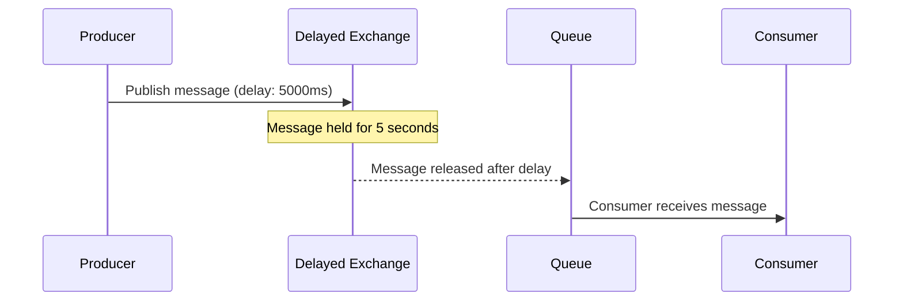
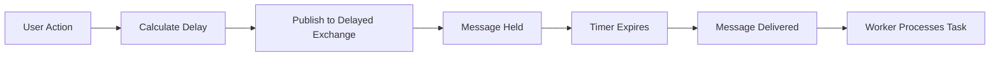
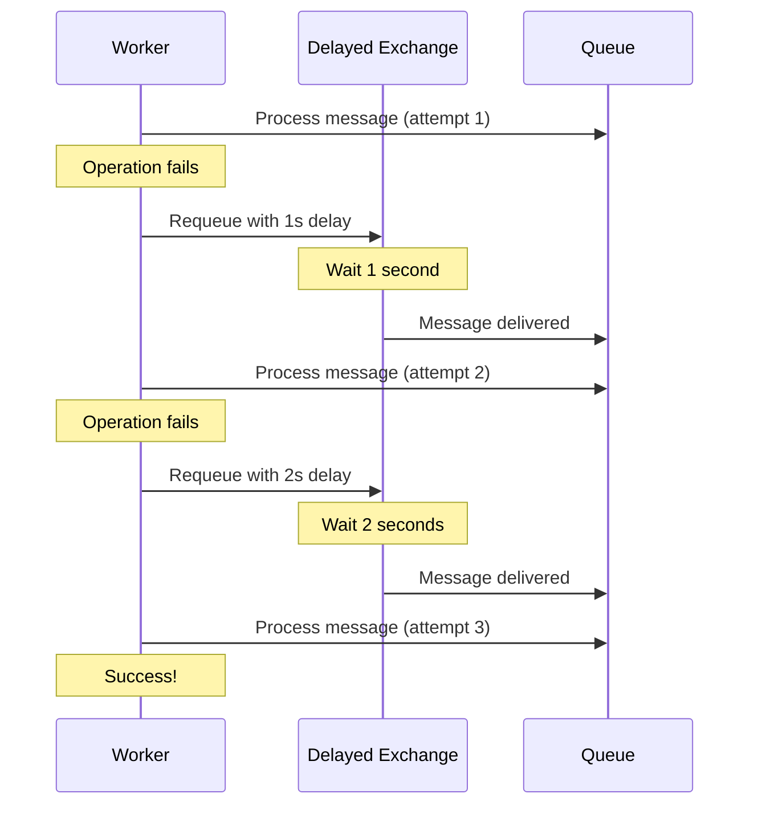
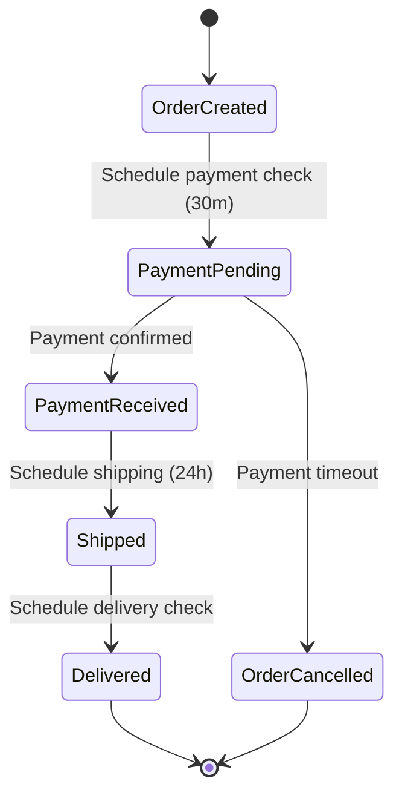
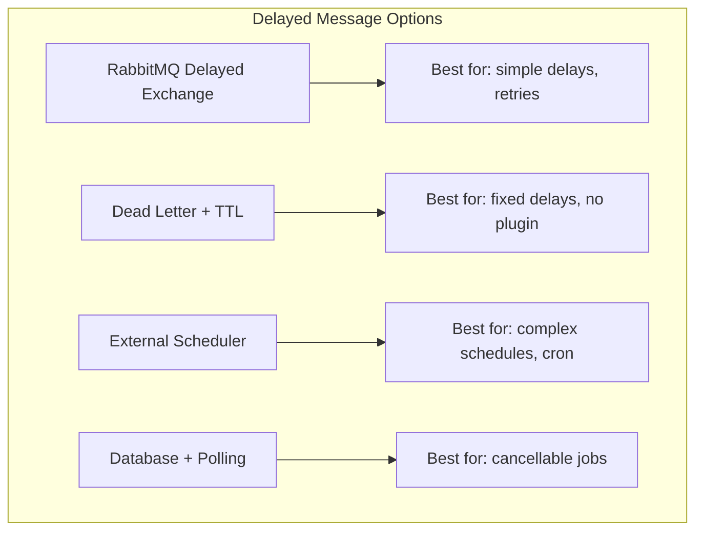

# How to Use RabbitMQ Delayed Message Exchange

By [Nawaz Dhandala](https://github.com/nawazdhandala)

Tags: RabbitMQ, Message Queue, Delayed Messages, Scheduling, Node.js, Python, Distributed Systems, Microservices

Description: A comprehensive guide to implementing delayed message delivery in RabbitMQ using the Delayed Message Exchange plugin, with practical examples for scheduled tasks, retry mechanisms, and workflow orchestration.

---

> **Delayed messages transform RabbitMQ from a simple message broker into a powerful scheduling engine.** Instead of building separate cron jobs or external schedulers, you can embed timing logic directly into your message flow.

When building distributed systems, you often need to delay message processing: sending reminder emails after 24 hours, retrying failed operations with exponential backoff, or scheduling future tasks. RabbitMQ's Delayed Message Exchange plugin provides an elegant solution that keeps all your messaging logic in one place.

This guide covers plugin installation, exchange configuration, message scheduling patterns, real-world use cases, and important limitations to consider.

---

## Table of Contents

1. Understanding Delayed Messages
2. Installing the Delayed Message Plugin
3. Creating a Delayed Exchange
4. Publishing Delayed Messages
5. Consuming Delayed Messages
6. Use Case: Scheduled Tasks
7. Use Case: Retry with Exponential Backoff
8. Use Case: Workflow Orchestration
9. Limitations and Alternatives
10. Best Practices

---

## 1. Understanding Delayed Messages

A delayed message is a message that waits for a specified duration before being routed to its destination queue. Unlike standard RabbitMQ exchanges that route messages immediately, a delayed exchange holds messages internally and releases them after the delay expires.



### How It Works

The Delayed Message Exchange plugin uses Mnesia (Erlang's distributed database) to persist delayed messages. When a message arrives:

1. The plugin reads the `x-delay` header (milliseconds)
2. The message is stored in an internal database
3. A timer schedules delivery after the delay
4. When the delay expires, normal exchange routing takes place

This architecture means delayed messages survive broker restarts (they are persisted to disk).

---

## 2. Installing the Delayed Message Plugin

The Delayed Message Exchange is a community plugin that must be installed separately from RabbitMQ.

### Option A: Docker Installation

```bash
# Pull RabbitMQ with management interface
docker pull rabbitmq:3-management

# Download and enable the plugin
docker run -d \
  --name rabbitmq-delayed \
  -p 5672:5672 \
  -p 15672:15672 \
  rabbitmq:3-management

# Enter the container
docker exec -it rabbitmq-delayed bash

# Download the plugin (check for latest version at https://github.com/rabbitmq/rabbitmq-delayed-message-exchange/releases)
# For RabbitMQ 3.12+
wget https://github.com/rabbitmq/rabbitmq-delayed-message-exchange/releases/download/v3.12.0/rabbitmq_delayed_message_exchange-3.12.0.ez \
  -P /opt/rabbitmq/plugins/

# Enable the plugin
rabbitmq-plugins enable rabbitmq_delayed_message_exchange

# Verify installation
rabbitmq-plugins list | grep delayed
# Output: [E*] rabbitmq_delayed_message_exchange 3.12.0
```

### Option B: Kubernetes with Helm

```yaml
# values.yaml for bitnami/rabbitmq chart
extraPlugins: "rabbitmq_delayed_message_exchange"

# Or using community plugins URL
communityPlugins: "https://github.com/rabbitmq/rabbitmq-delayed-message-exchange/releases/download/v3.12.0/rabbitmq_delayed_message_exchange-3.12.0.ez"
```

```bash
# Install with Helm
helm install rabbitmq bitnami/rabbitmq -f values.yaml
```

### Option C: Manual Installation (Linux)

```bash
# Find your RabbitMQ plugins directory
rabbitmq-plugins directories

# Download the plugin (match your RabbitMQ version)
cd /usr/lib/rabbitmq/plugins/
wget https://github.com/rabbitmq/rabbitmq-delayed-message-exchange/releases/download/v3.12.0/rabbitmq_delayed_message_exchange-3.12.0.ez

# Enable the plugin
sudo rabbitmq-plugins enable rabbitmq_delayed_message_exchange

# Restart RabbitMQ (if required)
sudo systemctl restart rabbitmq-server
```

### Verify Plugin Installation

```bash
# Check enabled plugins
rabbitmq-plugins list --enabled

# Look for this output:
# [E*] rabbitmq_delayed_message_exchange 3.12.0

# Alternatively, check via management API
curl -u guest:guest http://localhost:15672/api/exchanges | jq '.[].type' | grep delayed
# Output: "x-delayed-message"
```

---

## 3. Creating a Delayed Exchange

A delayed exchange wraps another exchange type (direct, topic, fanout, headers) and adds delay functionality.

### Node.js Example (amqplib)

```typescript
// setup-delayed-exchange.ts
import amqp, { Channel, Connection } from 'amqplib';

// Configuration for the delayed exchange
const EXCHANGE_NAME = 'delayed.tasks';
const QUEUE_NAME = 'scheduled-tasks';
const ROUTING_KEY = 'task.scheduled';

async function setupDelayedExchange(): Promise<void> {
  // Connect to RabbitMQ
  const connection: Connection = await amqp.connect('amqp://localhost');
  const channel: Channel = await connection.createChannel();

  // Declare the delayed exchange
  // 'x-delayed-message' is the special exchange type provided by the plugin
  await channel.assertExchange(EXCHANGE_NAME, 'x-delayed-message', {
    durable: true,  // Survive broker restarts
    arguments: {
      // The underlying exchange type for routing
      // Options: 'direct', 'topic', 'fanout', 'headers'
      'x-delayed-type': 'direct'
    }
  });

  console.log(`Delayed exchange '${EXCHANGE_NAME}' created successfully`);

  // Declare the destination queue
  await channel.assertQueue(QUEUE_NAME, {
    durable: true,  // Queue survives restarts
    arguments: {
      // Optional: set message TTL, max length, etc.
      'x-message-ttl': 86400000  // 24 hours max
    }
  });

  console.log(`Queue '${QUEUE_NAME}' created successfully`);

  // Bind the queue to the exchange with a routing key
  await channel.bindQueue(QUEUE_NAME, EXCHANGE_NAME, ROUTING_KEY);

  console.log(`Queue bound to exchange with routing key '${ROUTING_KEY}'`);

  await channel.close();
  await connection.close();
}

// Run the setup
setupDelayedExchange()
  .then(() => console.log('Setup complete'))
  .catch(console.error);
```

### Python Example (pika)

```python
# setup_delayed_exchange.py
import pika
from pika.exchange_type import ExchangeType

# Configuration
EXCHANGE_NAME = 'delayed.tasks'
QUEUE_NAME = 'scheduled-tasks'
ROUTING_KEY = 'task.scheduled'


def setup_delayed_exchange() -> None:
    """Create a delayed message exchange and bind a queue to it."""

    # Establish connection to RabbitMQ
    connection = pika.BlockingConnection(
        pika.ConnectionParameters(host='localhost')
    )
    channel = connection.channel()

    # Declare the delayed exchange
    # Note: 'x-delayed-message' is the exchange type from the plugin
    channel.exchange_declare(
        exchange=EXCHANGE_NAME,
        exchange_type='x-delayed-message',  # Plugin's special exchange type
        durable=True,  # Persist exchange definition
        arguments={
            # The underlying routing behavior
            # Determines how messages are routed AFTER the delay
            'x-delayed-type': 'direct'
        }
    )
    print(f"Delayed exchange '{EXCHANGE_NAME}' created")

    # Declare the destination queue
    channel.queue_declare(
        queue=QUEUE_NAME,
        durable=True,  # Persist queue and messages
        arguments={
            'x-message-ttl': 86400000  # Optional: 24-hour TTL
        }
    )
    print(f"Queue '{QUEUE_NAME}' created")

    # Bind queue to exchange
    channel.queue_bind(
        queue=QUEUE_NAME,
        exchange=EXCHANGE_NAME,
        routing_key=ROUTING_KEY
    )
    print(f"Queue bound with routing key '{ROUTING_KEY}'")

    # Clean up
    channel.close()
    connection.close()


if __name__ == '__main__':
    setup_delayed_exchange()
    print('Setup complete')
```

---

## 4. Publishing Delayed Messages

The delay is specified in the `x-delay` header (in milliseconds). The message will be held for this duration before routing.

### Node.js Publisher

```typescript
// publish-delayed.ts
import amqp, { Channel, Connection } from 'amqplib';

const EXCHANGE_NAME = 'delayed.tasks';
const ROUTING_KEY = 'task.scheduled';

interface ScheduledTask {
  taskId: string;
  action: string;
  payload: Record<string, unknown>;
  scheduledAt: string;
}

/**
 * Publish a message with a specified delay
 * @param delayMs - Delay in milliseconds before the message is delivered
 * @param task - The task payload to schedule
 */
async function publishDelayedMessage(
  delayMs: number,
  task: ScheduledTask
): Promise<void> {
  const connection: Connection = await amqp.connect('amqp://localhost');
  const channel: Channel = await connection.createChannel();

  // The message payload
  const message = Buffer.from(JSON.stringify(task));

  // Publish with the x-delay header
  const published = channel.publish(
    EXCHANGE_NAME,
    ROUTING_KEY,
    message,
    {
      // Message properties
      persistent: true,  // Persist to disk (delivery mode 2)
      contentType: 'application/json',

      // Headers including the delay
      headers: {
        // x-delay: milliseconds to wait before delivery
        // Maximum value: 2^32-1 ms (~49.7 days)
        'x-delay': delayMs
      }
    }
  );

  if (published) {
    console.log(`Message scheduled for delivery in ${delayMs}ms`);
    console.log(`Task ID: ${task.taskId}`);
  } else {
    console.error('Failed to publish message (channel buffer full)');
  }

  await channel.close();
  await connection.close();
}

// Example: Schedule a reminder email in 1 hour
const reminderTask: ScheduledTask = {
  taskId: 'reminder-001',
  action: 'send_reminder_email',
  payload: {
    userId: 'user-123',
    emailType: 'subscription_expiring',
    templateId: 'reminder-v2'
  },
  scheduledAt: new Date().toISOString()
};

// Delay: 1 hour = 3,600,000 milliseconds
publishDelayedMessage(3600000, reminderTask)
  .then(() => console.log('Reminder scheduled'))
  .catch(console.error);
```

### Python Publisher

```python
# publish_delayed.py
import json
import pika
from datetime import datetime
from typing import Any


EXCHANGE_NAME = 'delayed.tasks'
ROUTING_KEY = 'task.scheduled'


def publish_delayed_message(delay_ms: int, task: dict[str, Any]) -> bool:
    """
    Publish a message with a specified delay.

    Args:
        delay_ms: Delay in milliseconds before delivery
        task: The task payload to schedule

    Returns:
        True if message was published successfully
    """
    connection = pika.BlockingConnection(
        pika.ConnectionParameters(host='localhost')
    )
    channel = connection.channel()

    # Serialize the message payload
    message_body = json.dumps(task)

    # Create message properties with the delay header
    properties = pika.BasicProperties(
        delivery_mode=2,  # Persistent message
        content_type='application/json',
        headers={
            # x-delay header specifies the delay in milliseconds
            # Plugin reads this header and holds the message
            'x-delay': delay_ms
        }
    )

    # Publish to the delayed exchange
    channel.basic_publish(
        exchange=EXCHANGE_NAME,
        routing_key=ROUTING_KEY,
        body=message_body,
        properties=properties
    )

    print(f'Message scheduled for delivery in {delay_ms}ms')
    print(f'Task ID: {task["taskId"]}')

    channel.close()
    connection.close()

    return True


if __name__ == '__main__':
    # Example: Schedule an order cancellation check in 30 minutes
    task = {
        'taskId': 'order-check-001',
        'action': 'check_unpaid_order',
        'payload': {
            'orderId': 'order-789',
            'createdAt': datetime.utcnow().isoformat()
        },
        'scheduledAt': datetime.utcnow().isoformat()
    }

    # Delay: 30 minutes = 1,800,000 milliseconds
    publish_delayed_message(1800000, task)
    print('Order check scheduled')
```

---

## 5. Consuming Delayed Messages

Consumers don't need any special handling. From the consumer's perspective, messages arrive like any other message (the delay has already been applied).

### Node.js Consumer

```typescript
// consume-delayed.ts
import amqp, { Channel, Connection, ConsumeMessage } from 'amqplib';

const QUEUE_NAME = 'scheduled-tasks';

interface ScheduledTask {
  taskId: string;
  action: string;
  payload: Record<string, unknown>;
  scheduledAt: string;
}

/**
 * Process a scheduled task
 * Add your business logic here
 */
async function processTask(task: ScheduledTask): Promise<void> {
  console.log(`Processing task: ${task.taskId}`);
  console.log(`Action: ${task.action}`);
  console.log(`Scheduled at: ${task.scheduledAt}`);
  console.log(`Delivered at: ${new Date().toISOString()}`);

  // Route to appropriate handler based on action
  switch (task.action) {
    case 'send_reminder_email':
      await handleReminderEmail(task.payload);
      break;
    case 'check_unpaid_order':
      await handleOrderCheck(task.payload);
      break;
    default:
      console.warn(`Unknown action: ${task.action}`);
  }
}

async function handleReminderEmail(payload: Record<string, unknown>): Promise<void> {
  console.log(`Sending reminder email to user: ${payload.userId}`);
  // Implement email sending logic
}

async function handleOrderCheck(payload: Record<string, unknown>): Promise<void> {
  console.log(`Checking order status: ${payload.orderId}`);
  // Implement order check logic
}

async function startConsumer(): Promise<void> {
  const connection: Connection = await amqp.connect('amqp://localhost');
  const channel: Channel = await connection.createChannel();

  // Prefetch limits concurrent processing
  // Important for delayed messages to prevent overwhelming workers
  await channel.prefetch(10);

  console.log(`Waiting for messages in queue '${QUEUE_NAME}'...`);

  await channel.consume(
    QUEUE_NAME,
    async (msg: ConsumeMessage | null) => {
      if (!msg) return;

      try {
        // Parse the message content
        const task: ScheduledTask = JSON.parse(msg.content.toString());

        // Log original delay for debugging
        const originalDelay = msg.properties.headers?.['x-delay'];
        console.log(`Original delay was: ${originalDelay}ms`);

        // Process the task
        await processTask(task);

        // Acknowledge successful processing
        channel.ack(msg);
        console.log(`Task ${task.taskId} completed and acknowledged`);
      } catch (error) {
        console.error('Error processing message:', error);

        // Reject and requeue for retry
        // Consider implementing dead-letter exchange for poison messages
        channel.nack(msg, false, true);
      }
    },
    {
      // Manual acknowledgment mode
      noAck: false
    }
  );
}

// Start the consumer
startConsumer().catch(console.error);
```

### Python Consumer

```python
# consume_delayed.py
import json
import pika
from datetime import datetime
from typing import Any


QUEUE_NAME = 'scheduled-tasks'


def process_task(task: dict[str, Any]) -> None:
    """
    Process a scheduled task.
    Add your business logic here.
    """
    print(f'Processing task: {task["taskId"]}')
    print(f'Action: {task["action"]}')
    print(f'Scheduled at: {task["scheduledAt"]}')
    print(f'Delivered at: {datetime.utcnow().isoformat()}')

    # Route to appropriate handler
    action = task['action']
    payload = task['payload']

    if action == 'send_reminder_email':
        handle_reminder_email(payload)
    elif action == 'check_unpaid_order':
        handle_order_check(payload)
    else:
        print(f'Warning: Unknown action {action}')


def handle_reminder_email(payload: dict[str, Any]) -> None:
    print(f'Sending reminder email to user: {payload["userId"]}')
    # Implement email sending logic


def handle_order_check(payload: dict[str, Any]) -> None:
    print(f'Checking order status: {payload["orderId"]}')
    # Implement order check logic


def callback(ch, method, properties, body) -> None:
    """
    Message callback handler.
    Called for each message received from the queue.
    """
    try:
        # Parse message content
        task = json.loads(body)

        # Log original delay for debugging
        original_delay = properties.headers.get('x-delay') if properties.headers else None
        print(f'Original delay was: {original_delay}ms')

        # Process the task
        process_task(task)

        # Acknowledge successful processing
        ch.basic_ack(delivery_tag=method.delivery_tag)
        print(f'Task {task["taskId"]} completed and acknowledged')

    except Exception as e:
        print(f'Error processing message: {e}')
        # Reject and requeue for retry
        ch.basic_nack(delivery_tag=method.delivery_tag, requeue=True)


def start_consumer() -> None:
    """Start consuming messages from the scheduled tasks queue."""
    connection = pika.BlockingConnection(
        pika.ConnectionParameters(host='localhost')
    )
    channel = connection.channel()

    # Set prefetch count to limit concurrent processing
    channel.basic_qos(prefetch_count=10)

    print(f'Waiting for messages in queue "{QUEUE_NAME}"...')

    # Start consuming
    channel.basic_consume(
        queue=QUEUE_NAME,
        on_message_callback=callback,
        auto_ack=False  # Manual acknowledgment
    )

    # Block and consume messages
    channel.start_consuming()


if __name__ == '__main__':
    start_consumer()
```

---

## 6. Use Case: Scheduled Tasks

Delayed messages are perfect for scheduling future tasks without external schedulers.



### Example: Trial Expiration Notifications

```typescript
// trial-notifications.ts
import amqp from 'amqplib';

interface TrialNotification {
  userId: string;
  email: string;
  trialEndDate: string;
  notificationType: '7_day_warning' | '1_day_warning' | 'expired';
}

/**
 * Schedule all trial expiration notifications when a user starts a trial
 */
async function scheduleTrialNotifications(
  userId: string,
  email: string,
  trialDays: number = 14
): Promise<void> {
  const connection = await amqp.connect('amqp://localhost');
  const channel = await connection.createChannel();

  const EXCHANGE = 'delayed.notifications';
  const ROUTING_KEY = 'notification.trial';

  // Calculate trial end date
  const trialEndDate = new Date();
  trialEndDate.setDate(trialEndDate.getDate() + trialDays);

  // Schedule 7-day warning (7 days before trial ends)
  const sevenDayWarningDelay = (trialDays - 7) * 24 * 60 * 60 * 1000;
  if (sevenDayWarningDelay > 0) {
    await publishNotification(channel, EXCHANGE, ROUTING_KEY, {
      userId,
      email,
      trialEndDate: trialEndDate.toISOString(),
      notificationType: '7_day_warning'
    }, sevenDayWarningDelay);
    console.log(`7-day warning scheduled for ${sevenDayWarningDelay}ms from now`);
  }

  // Schedule 1-day warning (1 day before trial ends)
  const oneDayWarningDelay = (trialDays - 1) * 24 * 60 * 60 * 1000;
  await publishNotification(channel, EXCHANGE, ROUTING_KEY, {
    userId,
    email,
    trialEndDate: trialEndDate.toISOString(),
    notificationType: '1_day_warning'
  }, oneDayWarningDelay);
  console.log(`1-day warning scheduled for ${oneDayWarningDelay}ms from now`);

  // Schedule expiration notice (exactly when trial ends)
  const expiredDelay = trialDays * 24 * 60 * 60 * 1000;
  await publishNotification(channel, EXCHANGE, ROUTING_KEY, {
    userId,
    email,
    trialEndDate: trialEndDate.toISOString(),
    notificationType: 'expired'
  }, expiredDelay);
  console.log(`Expiration notice scheduled for ${expiredDelay}ms from now`);

  await channel.close();
  await connection.close();
}

async function publishNotification(
  channel: amqp.Channel,
  exchange: string,
  routingKey: string,
  notification: TrialNotification,
  delayMs: number
): Promise<void> {
  channel.publish(
    exchange,
    routingKey,
    Buffer.from(JSON.stringify(notification)),
    {
      persistent: true,
      contentType: 'application/json',
      headers: {
        'x-delay': delayMs,
        // Add metadata for tracking
        'x-scheduled-at': new Date().toISOString(),
        'x-notification-type': notification.notificationType
      }
    }
  );
}

// Usage: When user starts a 14-day trial
scheduleTrialNotifications('user-456', 'user@example.com', 14)
  .then(() => console.log('All trial notifications scheduled'))
  .catch(console.error);
```

---

## 7. Use Case: Retry with Exponential Backoff

When an operation fails, delayed messages enable sophisticated retry logic without blocking.



### Node.js Exponential Backoff Implementation

```typescript
// retry-with-backoff.ts
import amqp, { Channel, ConsumeMessage } from 'amqplib';

const MAIN_QUEUE = 'tasks.main';
const RETRY_EXCHANGE = 'delayed.retry';
const DEAD_LETTER_QUEUE = 'tasks.dead-letter';

// Retry configuration
const MAX_RETRIES = 5;
const BASE_DELAY_MS = 1000;  // 1 second
const MAX_DELAY_MS = 60000;  // 1 minute cap

/**
 * Calculate delay with exponential backoff and jitter
 */
function calculateBackoffDelay(attemptNumber: number): number {
  // Exponential: 1s, 2s, 4s, 8s, 16s...
  const exponentialDelay = BASE_DELAY_MS * Math.pow(2, attemptNumber - 1);

  // Cap at maximum delay
  const cappedDelay = Math.min(exponentialDelay, MAX_DELAY_MS);

  // Add jitter (0-25% random variation) to prevent thundering herd
  const jitter = cappedDelay * Math.random() * 0.25;

  return Math.floor(cappedDelay + jitter);
}

/**
 * Requeue a failed message with exponential backoff
 */
async function requeueWithBackoff(
  channel: Channel,
  originalMsg: ConsumeMessage,
  error: Error
): Promise<void> {
  // Get current attempt count from headers
  const headers = originalMsg.properties.headers || {};
  const currentAttempt = (headers['x-retry-count'] as number) || 0;
  const nextAttempt = currentAttempt + 1;

  if (nextAttempt > MAX_RETRIES) {
    // Max retries exceeded - send to dead letter queue
    console.log(`Max retries (${MAX_RETRIES}) exceeded. Moving to dead letter queue.`);

    channel.sendToQueue(
      DEAD_LETTER_QUEUE,
      originalMsg.content,
      {
        persistent: true,
        headers: {
          ...headers,
          'x-retry-count': currentAttempt,
          'x-final-error': error.message,
          'x-dead-lettered-at': new Date().toISOString()
        }
      }
    );

    // Acknowledge original message
    channel.ack(originalMsg);
    return;
  }

  // Calculate delay for this retry attempt
  const delayMs = calculateBackoffDelay(nextAttempt);
  console.log(`Retry ${nextAttempt}/${MAX_RETRIES} scheduled in ${delayMs}ms`);

  // Publish to delayed exchange for retry
  channel.publish(
    RETRY_EXCHANGE,
    originalMsg.fields.routingKey,
    originalMsg.content,
    {
      persistent: true,
      contentType: originalMsg.properties.contentType,
      headers: {
        ...headers,
        'x-retry-count': nextAttempt,
        'x-delay': delayMs,
        'x-last-error': error.message,
        'x-retry-scheduled-at': new Date().toISOString()
      }
    }
  );

  // Acknowledge original message (it's been requeued)
  channel.ack(originalMsg);
}

/**
 * Process a task with automatic retry on failure
 */
async function processWithRetry(
  channel: Channel,
  msg: ConsumeMessage
): Promise<void> {
  const task = JSON.parse(msg.content.toString());
  const attemptNumber = (msg.properties.headers?.['x-retry-count'] as number) || 1;

  console.log(`Processing task (attempt ${attemptNumber}): ${task.taskId}`);

  try {
    // Simulate work that might fail
    await performTask(task);

    // Success - acknowledge the message
    channel.ack(msg);
    console.log(`Task ${task.taskId} completed successfully`);

  } catch (error) {
    console.error(`Task ${task.taskId} failed:`, error);

    // Requeue with exponential backoff
    await requeueWithBackoff(channel, msg, error as Error);
  }
}

async function performTask(task: any): Promise<void> {
  // Simulate a task that fails 70% of the time
  if (Math.random() < 0.7) {
    throw new Error('Simulated task failure');
  }
  console.log('Task executed successfully');
}

// Consumer setup would bind RETRY_EXCHANGE back to MAIN_QUEUE
// so retried messages return to the same processing queue
```

---

## 8. Use Case: Workflow Orchestration

Delayed messages can implement time-based workflow steps and saga patterns.



### Workflow Orchestration Example

```typescript
// order-workflow.ts
import amqp from 'amqplib';

const WORKFLOW_EXCHANGE = 'delayed.workflow';

interface OrderEvent {
  orderId: string;
  step: string;
  timestamp: string;
  data: Record<string, unknown>;
}

/**
 * Order workflow orchestrator using delayed messages
 */
class OrderWorkflow {
  private channel: amqp.Channel;

  constructor(channel: amqp.Channel) {
    this.channel = channel;
  }

  /**
   * Start the order workflow when an order is created
   */
  async startWorkflow(orderId: string, orderData: Record<string, unknown>): Promise<void> {
    console.log(`Starting workflow for order: ${orderId}`);

    // Step 1: Immediately notify warehouse to prepare
    await this.publishEvent({
      orderId,
      step: 'warehouse.prepare',
      timestamp: new Date().toISOString(),
      data: orderData
    }, 0);  // No delay - immediate

    // Step 2: Check payment status after 30 minutes
    await this.publishEvent({
      orderId,
      step: 'payment.check',
      timestamp: new Date().toISOString(),
      data: { checkType: 'payment_confirmation' }
    }, 30 * 60 * 1000);  // 30 minutes

    // Step 3: Send shipping reminder after 2 hours if not shipped
    await this.publishEvent({
      orderId,
      step: 'shipping.reminder',
      timestamp: new Date().toISOString(),
      data: { reminderType: 'shipping_pending' }
    }, 2 * 60 * 60 * 1000);  // 2 hours

    // Step 4: Request feedback after estimated delivery (3 days)
    await this.publishEvent({
      orderId,
      step: 'feedback.request',
      timestamp: new Date().toISOString(),
      data: { feedbackType: 'delivery_satisfaction' }
    }, 3 * 24 * 60 * 60 * 1000);  // 3 days

    console.log(`Workflow events scheduled for order: ${orderId}`);
  }

  /**
   * Cancel pending workflow steps for an order
   * Note: This requires tracking scheduled message IDs
   */
  async cancelWorkflow(orderId: string): Promise<void> {
    // Publish cancellation event to stop further processing
    await this.publishEvent({
      orderId,
      step: 'workflow.cancelled',
      timestamp: new Date().toISOString(),
      data: { reason: 'order_cancelled' }
    }, 0);

    // Note: Already-scheduled messages cannot be cancelled
    // Consumers must check order status before processing
    console.log(`Cancellation event published for order: ${orderId}`);
  }

  private async publishEvent(event: OrderEvent, delayMs: number): Promise<void> {
    this.channel.publish(
      WORKFLOW_EXCHANGE,
      `order.${event.step}`,
      Buffer.from(JSON.stringify(event)),
      {
        persistent: true,
        contentType: 'application/json',
        headers: {
          'x-delay': delayMs,
          'x-workflow-step': event.step,
          'x-order-id': event.orderId
        }
      }
    );
  }
}

// Workflow step consumer example
async function handleWorkflowStep(msg: amqp.ConsumeMessage, channel: amqp.Channel): Promise<void> {
  const event: OrderEvent = JSON.parse(msg.content.toString());

  // IMPORTANT: Always check current state before acting
  // Scheduled messages cannot be cancelled, so validate relevance
  const currentOrderState = await getOrderState(event.orderId);

  if (currentOrderState === 'cancelled') {
    console.log(`Skipping ${event.step} - order ${event.orderId} was cancelled`);
    channel.ack(msg);
    return;
  }

  switch (event.step) {
    case 'payment.check':
      await checkPaymentStatus(event);
      break;
    case 'shipping.reminder':
      await sendShippingReminder(event);
      break;
    case 'feedback.request':
      await requestFeedback(event);
      break;
  }

  channel.ack(msg);
}

// Placeholder functions
async function getOrderState(orderId: string): Promise<string> {
  return 'active';  // Fetch from database
}
async function checkPaymentStatus(event: OrderEvent): Promise<void> {}
async function sendShippingReminder(event: OrderEvent): Promise<void> {}
async function requestFeedback(event: OrderEvent): Promise<void> {}
```

---

## 9. Limitations and Alternatives

### Plugin Limitations

| Limitation | Details | Workaround |
|------------|---------|------------|
| Maximum delay | ~49.7 days (2^32-1 ms) | Chain multiple delays or use external scheduler |
| No message cancellation | Scheduled messages cannot be recalled | Check validity in consumer before processing |
| Memory usage | Delayed messages held in Mnesia | Monitor memory; limit concurrent delayed messages |
| Cluster behavior | Only one node manages delayed messages | Use quorum queues for better HA |
| Ordering not guaranteed | Messages may arrive slightly out of order | Add sequence numbers if order matters |

### Performance Considerations

```typescript
// Monitor delayed message count via management API
// High counts may indicate backlog issues

async function checkDelayedMessageStats(): Promise<void> {
  const response = await fetch(
    'http://localhost:15672/api/exchanges/%2F/delayed.tasks',
    {
      headers: {
        'Authorization': 'Basic ' + Buffer.from('guest:guest').toString('base64')
      }
    }
  );

  const exchange = await response.json();

  // Check message stats (if available)
  console.log('Exchange stats:', exchange.message_stats);

  // Note: Delayed messages are not visible in queue counts
  // until their delay expires
}
```

### Alternative Approaches



#### Alternative 1: Dead Letter Exchange with TTL (No Plugin Required)

```typescript
// dlx-delay.ts
// Use message TTL + dead letter exchange for delays without the plugin

async function setupDLXDelay(): Promise<void> {
  const connection = await amqp.connect('amqp://localhost');
  const channel = await connection.createChannel();

  // The "parking" queue where messages wait
  await channel.assertQueue('delay.parking.5s', {
    durable: true,
    arguments: {
      'x-message-ttl': 5000,  // Messages expire after 5 seconds
      'x-dead-letter-exchange': '',  // Default exchange
      'x-dead-letter-routing-key': 'tasks.ready'  // Route to final queue
    }
  });

  // The final destination queue
  await channel.assertQueue('tasks.ready', { durable: true });

  // To delay a message: publish to parking queue
  // After TTL expires, it's automatically moved to tasks.ready
  channel.sendToQueue('delay.parking.5s', Buffer.from('delayed message'));

  // Limitation: Fixed delay per queue
  // Need multiple parking queues for different delay durations
}
```

#### Alternative 2: External Scheduler Integration

```typescript
// For complex scheduling needs, consider dedicated tools:
// - Bull/BullMQ (Redis-based, excellent for Node.js)
// - Celery Beat (Python, cron-like scheduling)
// - Temporal.io (workflow orchestration)
// - AWS EventBridge Scheduler

// Example: Bull delayed jobs
import { Queue } from 'bullmq';

const queue = new Queue('tasks', { connection: { host: 'localhost' } });

// Schedule with Bull (supports cron, repeat, delays)
await queue.add('send-email', { userId: '123' }, {
  delay: 3600000,  // 1 hour
  attempts: 3,
  backoff: { type: 'exponential', delay: 1000 }
});
```

---

## 10. Best Practices

### Do's

1. **Set appropriate message TTL**: Prevent unbounded message accumulation
   ```typescript
   // Set max lifetime for delayed messages
   headers: {
     'x-delay': 60000,
     'x-message-ttl': 86400000  // Expire after 24 hours if not processed
   }
   ```

2. **Always check message relevance in consumers**: Messages cannot be cancelled
   ```typescript
   // Before processing, verify the action is still needed
   const isStillValid = await checkIfActionRequired(msg);
   if (!isStillValid) {
     channel.ack(msg);
     return;
   }
   ```

3. **Include metadata for debugging**
   ```typescript
   headers: {
     'x-delay': delayMs,
     'x-scheduled-at': new Date().toISOString(),
     'x-scheduled-by': 'order-service',
     'x-correlation-id': correlationId
   }
   ```

4. **Monitor delayed message backlog**: High numbers may indicate issues
   ```bash
   # Check via CLI
   rabbitmqctl list_queues name messages
   ```

5. **Use durable exchanges and persistent messages**: Survive broker restarts
   ```typescript
   await channel.assertExchange('delayed.tasks', 'x-delayed-message', {
     durable: true,  // Exchange survives restart
     arguments: { 'x-delayed-type': 'direct' }
   });

   channel.publish(exchange, key, content, {
     persistent: true  // Message survives restart
   });
   ```

### Don'ts

1. **Don't use for very long delays** (> 24 hours): Consider external schedulers
2. **Don't assume exact timing**: Delays are minimum, not exact
3. **Don't rely on message ordering**: Add sequence numbers if needed
4. **Don't schedule critical one-time events**: Have fallback mechanisms
5. **Don't ignore memory implications**: Monitor node memory usage

### Summary Checklist

- [ ] Plugin installed and enabled
- [ ] Exchange declared with `x-delayed-message` type
- [ ] `x-delayed-type` argument specifies routing behavior
- [ ] Messages include `x-delay` header in milliseconds
- [ ] Consumers validate message relevance before processing
- [ ] Dead letter queues handle poison messages
- [ ] Monitoring in place for delayed message backlog
- [ ] Retry logic includes exponential backoff with jitter

---

## Conclusion

RabbitMQ's Delayed Message Exchange plugin transforms your message broker into a capable scheduling system. It excels at:

- **Simple delays**: Email reminders, notification scheduling
- **Retry patterns**: Exponential backoff for failed operations
- **Workflow timing**: Step delays in business processes

For complex scheduling (cron expressions, cancellable jobs, long delays), consider complementing RabbitMQ with dedicated schedulers like BullMQ, Celery Beat, or Temporal.

---

*Need to monitor your RabbitMQ delayed message queues and get alerted when backlogs grow? [OneUptime](https://oneuptime.com) provides comprehensive infrastructure monitoring with custom metrics, alerting, and incident management to keep your message queues healthy.*
