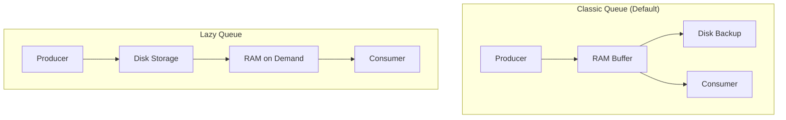
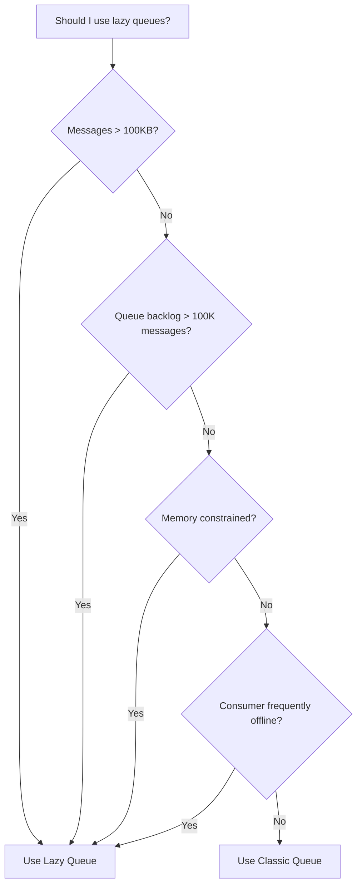
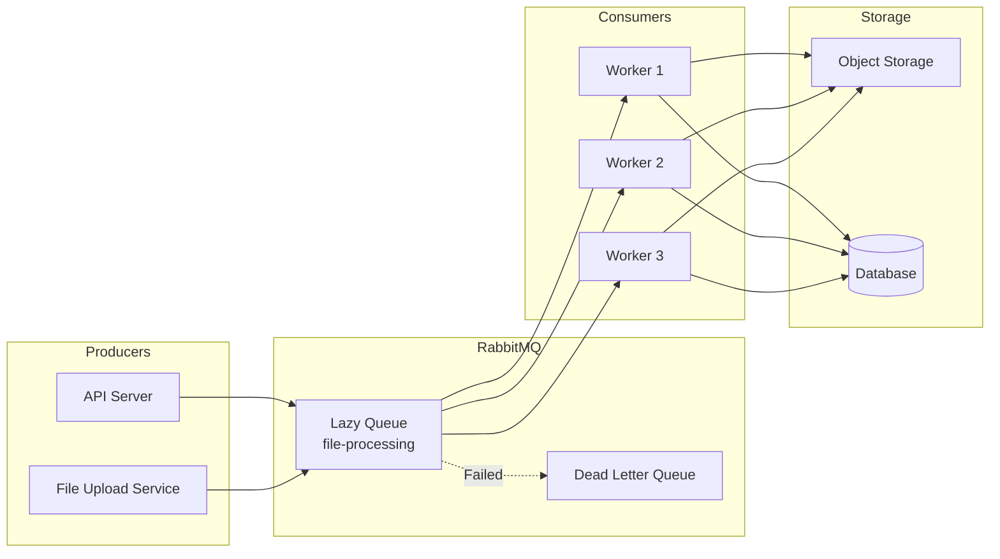

# How to Implement RabbitMQ Lazy Queues for Large Messages

By [Nawaz Dhandala](https://github.com/nawazdhandala)

Tags: RabbitMQ, Message Queues, Performance, Memory Management, DevOps, Microservices

Description: Learn how to implement RabbitMQ lazy queues to handle large messages efficiently by storing them on disk instead of memory, reducing memory pressure and improving system stability.

---

> "The key to performance is elegance, not battalions of special cases." - Jon Bentley

RabbitMQ lazy queues are designed for scenarios where you need to handle very long queues or large messages without overwhelming your server's memory. Unlike classic queues that keep messages in RAM for fast delivery, lazy queues move messages to disk as soon as possible, trading some latency for significantly reduced memory usage.

## Understanding Lazy Queues

Lazy queues were introduced in RabbitMQ 3.6 to address memory pressure issues when dealing with millions of messages or large payloads. In RabbitMQ 3.12+, quorum queues with lazy mode have become the recommended approach for most production workloads.

### How Lazy Queues Work

In classic mode, RabbitMQ keeps messages in memory for fast access. This works well for queues that are consumed quickly, but becomes problematic when:

- Messages accumulate faster than they're consumed
- Individual messages are very large (megabytes)
- You're running many queues on limited hardware

Lazy queues solve this by writing messages directly to disk and only loading them into memory when a consumer requests them.



## Memory vs Disk Trade-offs

Understanding the trade-offs helps you decide when lazy queues are appropriate.

### Memory Usage Comparison

Classic queues can use significant memory, especially with large messages or backlogs.

```javascript
// This example demonstrates the memory impact of different queue modes
// Classic queue: 100,000 messages x 10KB each = ~1GB RAM
// Lazy queue: Same messages = ~100MB RAM (index only)

const amqp = require('amqplib');

async function demonstrateMemoryDifference() {
  const connection = await amqp.connect('amqp://localhost');
  const channel = await connection.createChannel();

  // Large message payload (10KB)
  const largePayload = Buffer.alloc(10 * 1024, 'x');

  // Classic queue - messages stay in RAM
  await channel.assertQueue('classic-queue', {
    durable: true,
    // Default mode keeps messages in memory
  });

  // Lazy queue - messages go directly to disk
  await channel.assertQueue('lazy-queue', {
    durable: true,
    arguments: {
      // Enable lazy mode - messages written to disk immediately
      'x-queue-mode': 'lazy'
    }
  });

  // Publish 100,000 messages to each queue
  const messageCount = 100000;

  console.log(`Publishing ${messageCount} messages (10KB each)...`);

  for (let i = 0; i < messageCount; i++) {
    // Classic queue will accumulate ~1GB in RAM
    channel.sendToQueue('classic-queue', largePayload, { persistent: true });

    // Lazy queue keeps only ~100MB in RAM for indexes
    channel.sendToQueue('lazy-queue', largePayload, { persistent: true });
  }

  await channel.close();
  await connection.close();
}
```

### Performance Characteristics

| Characteristic | Classic Queue | Lazy Queue |
|----------------|---------------|------------|
| **Publish latency** | Lower | Higher (disk write) |
| **Consume latency** | Lower | Higher (disk read) |
| **Memory usage** | High | Low |
| **Message capacity** | Limited by RAM | Limited by disk |
| **Best for** | Fast consumers | Large backlogs |

## When to Use Lazy Queues

Lazy queues are ideal for specific scenarios. Here's a decision framework:



### Ideal Use Cases

```javascript
const amqp = require('amqplib');

async function setupQueuesForUseCases() {
  const connection = await amqp.connect('amqp://localhost');
  const channel = await connection.createChannel();

  // Use Case 1: Large file processing
  // When messages contain images, documents, or binary data
  await channel.assertQueue('file-processing-queue', {
    durable: true,
    arguments: {
      'x-queue-mode': 'lazy',
      // Set message TTL to prevent unbounded growth
      'x-message-ttl': 86400000, // 24 hours
    }
  });

  // Use Case 2: Batch job queues
  // Jobs that accumulate during the day, processed at night
  await channel.assertQueue('batch-job-queue', {
    durable: true,
    arguments: {
      'x-queue-mode': 'lazy',
      // Dead letter queue for failed jobs
      'x-dead-letter-exchange': 'dlx',
      'x-dead-letter-routing-key': 'batch-jobs-failed',
    }
  });

  // Use Case 3: Event sourcing / audit logs
  // Messages retained for long periods, rarely consumed
  await channel.assertQueue('audit-log-queue', {
    durable: true,
    arguments: {
      'x-queue-mode': 'lazy',
      // No TTL - keep forever (or until explicitly consumed)
    }
  });

  // Use Case 4: Intermittent consumers
  // Consumer applications that go offline periodically
  await channel.assertQueue('mobile-sync-queue', {
    durable: true,
    arguments: {
      'x-queue-mode': 'lazy',
      'x-message-ttl': 604800000, // 7 days
    }
  });

  await channel.close();
  await connection.close();
}
```

### When NOT to Use Lazy Queues

```javascript
// Scenarios where classic queues are better:

// 1. Real-time messaging with fast consumers
// Low latency is critical, messages consumed within seconds
await channel.assertQueue('realtime-notifications', {
  durable: true,
  // Classic mode (default) - messages stay in RAM for fast delivery
});

// 2. Short-lived queues
// Temporary queues that exist only during a session
await channel.assertQueue('', {
  exclusive: true,  // Auto-delete when connection closes
  autoDelete: true, // No need for lazy mode - queue is temporary
});

// 3. High-throughput, small messages
// When you need maximum throughput and have sufficient RAM
await channel.assertQueue('metrics-pipeline', {
  durable: true,
  arguments: {
    // Classic mode with memory limits
    'x-max-length': 1000000,        // Cap at 1M messages
    'x-overflow': 'reject-publish', // Reject new messages when full
  }
});
```

## Configuration Options

### Declaring Lazy Queues in Code

```javascript
const amqp = require('amqplib');

async function createLazyQueue() {
  const connection = await amqp.connect('amqp://localhost');
  const channel = await connection.createChannel();

  // Method 1: Using x-queue-mode argument
  // This is the classic lazy queue declaration
  await channel.assertQueue('lazy-queue-v1', {
    durable: true,
    arguments: {
      'x-queue-mode': 'lazy'
    }
  });

  // Method 2: Using policies (recommended for flexibility)
  // Policies can be applied/changed without redeclaring queues
  // Set via rabbitmqctl or HTTP API
  // rabbitmqctl set_policy lazy-queues "^lazy\." '{"queue-mode":"lazy"}' --apply-to queues

  // Method 3: Quorum queues with lazy mode (RabbitMQ 3.12+)
  // Combines replication with lazy storage - recommended for production
  await channel.assertQueue('lazy-quorum-queue', {
    durable: true,
    arguments: {
      'x-queue-type': 'quorum',
      // Quorum queues are lazy by default in 3.12+
      // But you can explicitly set memory limit
      'x-max-in-memory-length': 0,    // Keep 0 messages in memory
      // Or use bytes limit
      'x-max-in-memory-bytes': 0,     // Keep 0 bytes in memory
    }
  });

  await channel.close();
  await connection.close();
}
```

### Using Policies for Dynamic Configuration

Policies allow you to change queue behavior without modifying application code.

```bash
# Apply lazy mode to all queues matching pattern
rabbitmqctl set_policy lazy-pattern \
  "^(batch|archive|backup)\." \
  '{"queue-mode":"lazy"}' \
  --priority 1 \
  --apply-to queues

# Apply lazy mode with additional settings
rabbitmqctl set_policy lazy-with-limits \
  "^lazy\." \
  '{"queue-mode":"lazy","max-length":10000000,"overflow":"reject-publish"}' \
  --priority 2 \
  --apply-to queues

# Remove policy
rabbitmqctl clear_policy lazy-pattern
```

### Python Example with Pika

```python
import pika

def create_lazy_queue():
    """Create a lazy queue using the pika library."""

    # Establish connection to RabbitMQ
    connection = pika.BlockingConnection(
        pika.ConnectionParameters(
            host='localhost',
            port=5672,
            credentials=pika.PlainCredentials('guest', 'guest')
        )
    )
    channel = connection.channel()

    # Declare a lazy queue with custom arguments
    # x-queue-mode: 'lazy' tells RabbitMQ to store messages on disk
    channel.queue_declare(
        queue='lazy-python-queue',
        durable=True,  # Survive broker restart
        arguments={
            'x-queue-mode': 'lazy',
            'x-message-ttl': 86400000,  # 24 hour TTL
            'x-dead-letter-exchange': 'dlx',  # DLX for expired/rejected messages
        }
    )

    # Publish a large message
    large_payload = b'x' * (10 * 1024 * 1024)  # 10MB payload

    channel.basic_publish(
        exchange='',
        routing_key='lazy-python-queue',
        body=large_payload,
        properties=pika.BasicProperties(
            delivery_mode=2,  # Persistent message
            content_type='application/octet-stream',
        )
    )

    print('Published 10MB message to lazy queue')

    connection.close()


def consume_from_lazy_queue():
    """Consume messages with prefetch to control memory usage."""

    connection = pika.BlockingConnection(
        pika.ConnectionParameters(host='localhost')
    )
    channel = connection.channel()

    # Set prefetch count to limit messages loaded into memory
    # Critical for lazy queues with large messages
    channel.basic_qos(prefetch_count=1)

    def callback(ch, method, properties, body):
        print(f'Received message: {len(body)} bytes')
        # Process the message...

        # Acknowledge after processing
        ch.basic_ack(delivery_tag=method.delivery_tag)

    channel.basic_consume(
        queue='lazy-python-queue',
        on_message_callback=callback,
        auto_ack=False  # Manual acknowledgment for reliability
    )

    print('Waiting for messages...')
    channel.start_consuming()
```

## Quorum Queues with Lazy Mode (Recommended)

For RabbitMQ 3.12+, quorum queues with memory limits provide the best of both worlds: replication for high availability and lazy storage for memory efficiency.

```javascript
const amqp = require('amqplib');

async function createQuorumLazyQueue() {
  const connection = await amqp.connect('amqp://localhost');
  const channel = await connection.createChannel();

  // Quorum queue with lazy-like behavior
  // Messages are replicated across nodes AND stored efficiently
  await channel.assertQueue('production-queue', {
    durable: true,
    arguments: {
      // Quorum queue type - replicated for HA
      'x-queue-type': 'quorum',

      // Memory limits for lazy-like behavior
      // Set to 0 for full lazy mode (all messages on disk)
      'x-max-in-memory-length': 100,  // Keep only 100 messages in RAM
      // OR use bytes limit (mutually exclusive with length)
      // 'x-max-in-memory-bytes': 10485760,  // 10MB in memory max

      // Delivery limit before dead-lettering
      'x-delivery-limit': 3,

      // Dead letter configuration
      'x-dead-letter-exchange': 'dlx',
      'x-dead-letter-routing-key': 'failed-messages',
    }
  });

  console.log('Created quorum queue with lazy storage');

  // Publish with publisher confirms for reliability
  await channel.confirmSelect();

  const message = Buffer.from(JSON.stringify({
    orderId: '12345',
    payload: 'x'.repeat(1024 * 1024), // 1MB payload
    timestamp: new Date().toISOString(),
  }));

  channel.sendToQueue('production-queue', message, {
    persistent: true,
    contentType: 'application/json',
  });

  // Wait for confirmation
  await channel.waitForConfirms();
  console.log('Message confirmed by broker');

  await channel.close();
  await connection.close();
}
```

## Architecture Patterns

### Large File Processing Pipeline



### Implementation for File Processing

```javascript
const amqp = require('amqplib');
const { S3Client, PutObjectCommand } = require('@aws-sdk/client-s3');

class FileProcessingPipeline {
  constructor() {
    this.connection = null;
    this.channel = null;
    this.s3 = new S3Client({ region: 'us-east-1' });
  }

  async initialize() {
    // Connect to RabbitMQ cluster
    this.connection = await amqp.connect({
      hostname: process.env.RABBITMQ_HOST,
      port: 5672,
      username: process.env.RABBITMQ_USER,
      password: process.env.RABBITMQ_PASS,
      heartbeat: 60, // Keep connection alive
    });

    this.channel = await this.connection.createChannel();

    // Create exchanges
    await this.channel.assertExchange('files', 'direct', { durable: true });
    await this.channel.assertExchange('dlx', 'direct', { durable: true });

    // Create lazy queue for large file processing
    await this.channel.assertQueue('file-processing', {
      durable: true,
      arguments: {
        'x-queue-mode': 'lazy',
        // Reject oldest messages when queue is full
        'x-max-length': 100000,
        'x-overflow': 'reject-publish-dlx',
        // Dead letter failed messages
        'x-dead-letter-exchange': 'dlx',
        'x-dead-letter-routing-key': 'file-processing-failed',
        // 24 hour TTL for unprocessed files
        'x-message-ttl': 86400000,
      }
    });

    // Bind queue to exchange
    await this.channel.bindQueue('file-processing', 'files', 'process');

    // Create dead letter queue (also lazy for large failed files)
    await this.channel.assertQueue('file-processing-dlq', {
      durable: true,
      arguments: {
        'x-queue-mode': 'lazy',
        'x-message-ttl': 604800000, // 7 days retention for failed messages
      }
    });
    await this.channel.bindQueue('file-processing-dlq', 'dlx', 'file-processing-failed');
  }

  async publishFile(fileBuffer, metadata) {
    // Package file with metadata
    const message = {
      fileData: fileBuffer.toString('base64'),
      metadata: {
        filename: metadata.filename,
        contentType: metadata.contentType,
        uploadedBy: metadata.userId,
        uploadedAt: new Date().toISOString(),
      }
    };

    // Publish to lazy queue
    this.channel.publish(
      'files',
      'process',
      Buffer.from(JSON.stringify(message)),
      {
        persistent: true,
        contentType: 'application/json',
        messageId: metadata.fileId,
        timestamp: Date.now(),
      }
    );
  }

  async startConsumer() {
    // Low prefetch for large messages - process one at a time
    await this.channel.prefetch(1);

    await this.channel.consume('file-processing', async (msg) => {
      if (!msg) return;

      try {
        const { fileData, metadata } = JSON.parse(msg.content.toString());
        const fileBuffer = Buffer.from(fileData, 'base64');

        console.log(`Processing file: ${metadata.filename} (${fileBuffer.length} bytes)`);

        // Upload to S3
        await this.s3.send(new PutObjectCommand({
          Bucket: process.env.S3_BUCKET,
          Key: `processed/${metadata.filename}`,
          Body: fileBuffer,
          ContentType: metadata.contentType,
        }));

        // Acknowledge successful processing
        this.channel.ack(msg);
        console.log(`Successfully processed: ${metadata.filename}`);

      } catch (error) {
        console.error(`Failed to process file:`, error.message);

        // Check retry count from headers
        const retryCount = (msg.properties.headers?.['x-retry-count'] || 0);

        if (retryCount < 3) {
          // Requeue with incremented retry count
          this.channel.nack(msg, false, false);

          // Republish with retry header
          this.channel.publish(
            'files',
            'process',
            msg.content,
            {
              ...msg.properties,
              headers: {
                ...msg.properties.headers,
                'x-retry-count': retryCount + 1,
                'x-last-error': error.message,
              }
            }
          );
        } else {
          // Max retries exceeded - send to DLQ
          this.channel.nack(msg, false, false);
        }
      }
    });

    console.log('File processing consumer started');
  }
}

// Usage
const pipeline = new FileProcessingPipeline();
await pipeline.initialize();
await pipeline.startConsumer();
```

## Monitoring Lazy Queues

Monitoring is essential to ensure your lazy queues are performing optimally. Track these key metrics:

```javascript
const http = require('http');

class RabbitMQMonitor {
  constructor(config) {
    this.host = config.host || 'localhost';
    this.port = config.managementPort || 15672;
    this.auth = Buffer.from(`${config.user}:${config.pass}`).toString('base64');
  }

  async getQueueMetrics(queueName) {
    return new Promise((resolve, reject) => {
      const options = {
        hostname: this.host,
        port: this.port,
        path: `/api/queues/%2F/${queueName}`,
        headers: {
          'Authorization': `Basic ${this.auth}`,
        },
      };

      http.get(options, (res) => {
        let data = '';
        res.on('data', chunk => data += chunk);
        res.on('end', () => resolve(JSON.parse(data)));
      }).on('error', reject);
    });
  }

  async checkLazyQueueHealth(queueName) {
    const metrics = await this.getQueueMetrics(queueName);

    return {
      // Queue identification
      name: metrics.name,
      mode: metrics.arguments?.['x-queue-mode'] || 'default',

      // Message counts
      messages: metrics.messages,
      messagesReady: metrics.messages_ready,
      messagesUnacked: metrics.messages_unacknowledged,

      // Memory metrics (should be low for lazy queues)
      memoryBytes: metrics.memory,
      memoryMB: (metrics.memory / 1024 / 1024).toFixed(2),

      // Disk metrics (important for lazy queues)
      messagesPagedOut: metrics.messages_paged_out,
      messageBytesPaged: metrics.message_bytes_paged_out,

      // Throughput
      publishRate: metrics.message_stats?.publish_details?.rate || 0,
      deliverRate: metrics.message_stats?.deliver_get_details?.rate || 0,
      ackRate: metrics.message_stats?.ack_details?.rate || 0,

      // Consumer info
      consumers: metrics.consumers,

      // Health indicators
      isHealthy: this.evaluateHealth(metrics),
    };
  }

  evaluateHealth(metrics) {
    const issues = [];

    // Check if queue is growing unboundedly
    if (metrics.messages > 1000000) {
      issues.push('Queue has over 1M messages - check consumer capacity');
    }

    // Check consumer count
    if (metrics.consumers === 0 && metrics.messages > 0) {
      issues.push('No consumers attached but messages are queued');
    }

    // Check for unacked message buildup
    if (metrics.messages_unacknowledged > 10000) {
      issues.push('High unacked message count - consumers may be stuck');
    }

    // For lazy queues, memory should be relatively low
    if (metrics.arguments?.['x-queue-mode'] === 'lazy') {
      const memoryPerMessage = metrics.memory / Math.max(metrics.messages, 1);
      if (memoryPerMessage > 1024) { // More than 1KB per message in memory
        issues.push('Lazy queue using more memory than expected');
      }
    }

    return {
      healthy: issues.length === 0,
      issues,
    };
  }
}

// Usage
const monitor = new RabbitMQMonitor({
  host: 'localhost',
  managementPort: 15672,
  user: 'guest',
  pass: 'guest',
});

// Check queue health
const health = await monitor.checkLazyQueueHealth('file-processing');
console.log('Queue Health:', JSON.stringify(health, null, 2));
```

## Integration with OneUptime

For comprehensive monitoring of your RabbitMQ lazy queues in production, integrate with [OneUptime](https://oneuptime.com). OneUptime provides:

- **Queue depth monitoring**: Alert when message backlogs exceed thresholds
- **Consumer health checks**: Detect when consumers go offline
- **Memory usage tracking**: Ensure lazy queues maintain low memory footprint
- **Throughput dashboards**: Visualize publish and consume rates
- **Incident management**: Automatic alerting and on-call notifications when queues are unhealthy

Set up a custom metric monitor to track your lazy queue health and receive alerts before issues impact your users.

## Summary

| Feature | Classic Queue | Lazy Queue | Quorum + Lazy |
|---------|---------------|------------|---------------|
| **Memory usage** | High | Low | Low |
| **Disk usage** | Backup only | Primary storage | Primary + replicated |
| **Latency** | Lowest | Higher | Moderate |
| **Replication** | No | No | Yes (HA) |
| **Best for** | Fast consumers | Large backlogs | Production workloads |

Lazy queues are an essential tool for handling large messages and long backlogs in RabbitMQ. Key takeaways:

1. **Use lazy mode** when messages are large, backlogs are expected, or memory is constrained
2. **Prefer quorum queues** with memory limits in RabbitMQ 3.12+ for production
3. **Set appropriate prefetch** values to control consumer memory usage
4. **Monitor queue depth** and memory usage to catch issues early
5. **Configure dead letter queues** to handle processing failures gracefully
