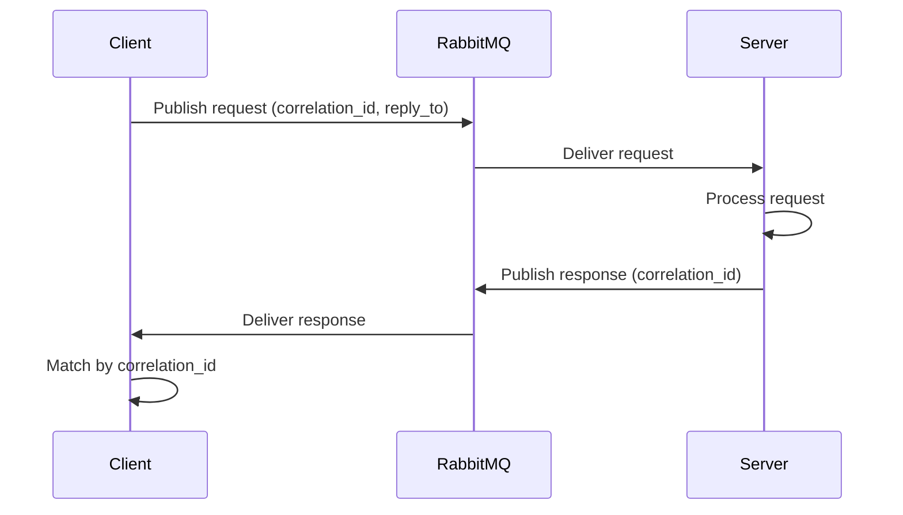
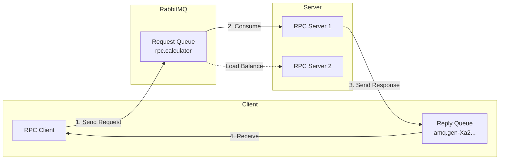
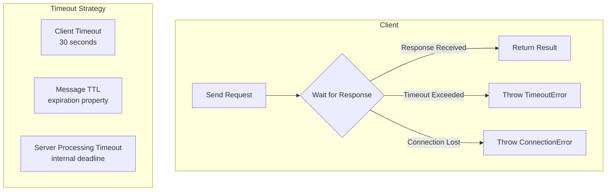
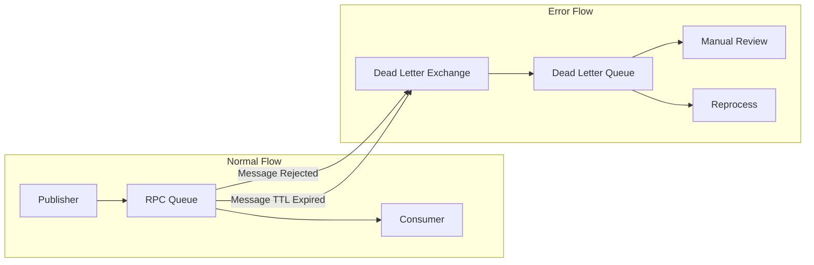
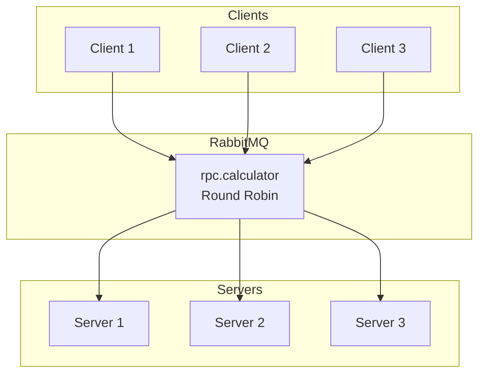

# How to Implement Request-Reply Pattern in RabbitMQ

Author: [nawazdhandala](https://github.com/nawazdhandala)

Tags: RabbitMQ, Message Queue, Request-Reply, RPC, Node.js, TypeScript, Microservices, Distributed Systems

Description: Learn how to implement the request-reply (RPC) pattern in RabbitMQ with correlation IDs, reply-to queues, and timeout handling. Includes complete TypeScript examples for building reliable synchronous-style communication over asynchronous messaging.

---

> "The request-reply pattern brings synchronous semantics to asynchronous messaging, enabling distributed services to communicate as if they were making local function calls while maintaining the resilience and decoupling benefits of message queues."

Message queues excel at asynchronous, fire-and-forget communication. But what happens when you need a response? The request-reply pattern (also known as RPC over messaging) lets you send a message and wait for a reply, combining the reliability of message queues with the familiar request-response model of HTTP.

This guide walks through implementing the request-reply pattern in RabbitMQ with Node.js/TypeScript, covering correlation IDs, reply-to queues, timeout handling, and production-ready patterns.

---

## Table of Contents

1. Understanding the Request-Reply Pattern
2. Core Concepts
3. Basic Implementation
4. Production RPC Client
5. RPC Server Implementation
6. Timeout Handling
7. Error Handling and Dead Letters
8. Scaling Considerations
9. Monitoring with OneUptime
10. Summary

---

## Understanding the Request-Reply Pattern

The request-reply pattern enables synchronous-style communication over asynchronous messaging infrastructure. Unlike traditional HTTP requests, messages flow through a broker, providing:

- **Decoupling**: Client and server don't need direct network connectivity
- **Reliability**: Messages persist if the server is temporarily unavailable
- **Load balancing**: Multiple servers can consume from the same queue
- **Resilience**: Automatic retries and dead-letter handling



---

## Core Concepts

### Correlation ID

A unique identifier that links a request to its response. Without it, clients cannot match incoming responses to their pending requests.

```typescript
// Generate a unique correlation ID for each request
import { randomUUID } from 'crypto';

const correlationId = randomUUID();
// Example: "550e8400-e29b-41d4-a716-446655440000"
```

### Reply-To Queue

A temporary, exclusive queue where the client listens for responses. The client creates this queue and includes its name in the request message properties.

```typescript
// Properties sent with each RPC request
const messageProperties = {
  correlationId: '550e8400-e29b-41d4-a716-446655440000',
  replyTo: 'amq.gen-Xa2...',  // Exclusive reply queue
  contentType: 'application/json',
  expiration: '30000',  // Message TTL in milliseconds
};
```

### Message Flow Architecture



---

## Basic Implementation

Let's start with a minimal working example before building the production version.

### Dependencies

```bash
npm install amqplib uuid
npm install -D @types/amqplib typescript
```

### Simple RPC Client

```typescript
// simple-rpc-client.ts
import amqp, { Connection, Channel, ConsumeMessage } from 'amqplib';
import { randomUUID } from 'crypto';

async function callRpc(
  channel: Channel,
  queue: string,
  message: object
): Promise<object> {
  // Create exclusive reply queue
  // exclusive: true means only this connection can access it
  // autoDelete: true means it's deleted when the connection closes
  const { queue: replyQueue } = await channel.assertQueue('', {
    exclusive: true,
    autoDelete: true,
  });

  const correlationId = randomUUID();

  return new Promise((resolve, reject) => {
    // Set up timeout
    const timeout = setTimeout(() => {
      reject(new Error('RPC timeout'));
    }, 30000);

    // Listen for response
    channel.consume(
      replyQueue,
      (msg: ConsumeMessage | null) => {
        if (!msg) return;

        // Match correlation ID to ensure this is our response
        if (msg.properties.correlationId === correlationId) {
          clearTimeout(timeout);
          const response = JSON.parse(msg.content.toString());
          resolve(response);
        }
      },
      { noAck: true }  // Auto-acknowledge since queue is exclusive
    );

    // Send request with reply-to and correlation ID
    channel.sendToQueue(
      queue,
      Buffer.from(JSON.stringify(message)),
      {
        correlationId,
        replyTo: replyQueue,
        contentType: 'application/json',
      }
    );
  });
}

// Usage
async function main() {
  const connection = await amqp.connect('amqp://localhost');
  const channel = await connection.createChannel();

  // Declare the RPC queue
  await channel.assertQueue('rpc.calculator', { durable: true });

  const result = await callRpc(channel, 'rpc.calculator', {
    operation: 'add',
    a: 5,
    b: 3,
  });

  console.log('Result:', result);  // { result: 8 }

  await channel.close();
  await connection.close();
}

main().catch(console.error);
```

### Simple RPC Server

```typescript
// simple-rpc-server.ts
import amqp, { ConsumeMessage } from 'amqplib';

interface CalculatorRequest {
  operation: 'add' | 'subtract' | 'multiply' | 'divide';
  a: number;
  b: number;
}

function processRequest(request: CalculatorRequest): { result: number } {
  switch (request.operation) {
    case 'add':
      return { result: request.a + request.b };
    case 'subtract':
      return { result: request.a - request.b };
    case 'multiply':
      return { result: request.a * request.b };
    case 'divide':
      if (request.b === 0) throw new Error('Division by zero');
      return { result: request.a / request.b };
    default:
      throw new Error(`Unknown operation: ${request.operation}`);
  }
}

async function startServer() {
  const connection = await amqp.connect('amqp://localhost');
  const channel = await connection.createChannel();

  const queue = 'rpc.calculator';
  await channel.assertQueue(queue, { durable: true });

  // Process one message at a time for fair dispatch
  channel.prefetch(1);

  console.log('RPC Server waiting for requests...');

  channel.consume(queue, async (msg: ConsumeMessage | null) => {
    if (!msg) return;

    const request = JSON.parse(msg.content.toString());
    console.log('Received:', request);

    try {
      const response = processRequest(request);

      // Send response to the reply queue
      // The replyTo property tells us where to send the response
      channel.sendToQueue(
        msg.properties.replyTo,
        Buffer.from(JSON.stringify(response)),
        {
          correlationId: msg.properties.correlationId,
          contentType: 'application/json',
        }
      );

      // Acknowledge the request after successful processing
      channel.ack(msg);
    } catch (error: any) {
      // Send error response
      channel.sendToQueue(
        msg.properties.replyTo,
        Buffer.from(JSON.stringify({ error: error.message })),
        {
          correlationId: msg.properties.correlationId,
          contentType: 'application/json',
        }
      );
      channel.ack(msg);
    }
  });
}

startServer().catch(console.error);
```

---

## Production RPC Client

The basic implementation works but lacks important features for production use. Let's build a robust RPC client class.

```typescript
// rpc-client.ts
import amqp, { Connection, Channel, ConsumeMessage } from 'amqplib';
import { randomUUID } from 'crypto';
import { EventEmitter } from 'events';

interface PendingRequest {
  resolve: (value: any) => void;
  reject: (error: Error) => void;
  timeout: NodeJS.Timeout;
  startTime: number;
}

interface RpcClientOptions {
  url: string;
  defaultTimeout?: number;
  reconnectInterval?: number;
  maxReconnectAttempts?: number;
}

export class RpcClient extends EventEmitter {
  private connection: Connection | null = null;
  private channel: Channel | null = null;
  private replyQueue: string = '';
  private pendingRequests: Map<string, PendingRequest> = new Map();
  private options: Required<RpcClientOptions>;
  private isConnected: boolean = false;
  private reconnectAttempts: number = 0;

  constructor(options: RpcClientOptions) {
    super();
    this.options = {
      defaultTimeout: 30000,
      reconnectInterval: 5000,
      maxReconnectAttempts: 10,
      ...options,
    };
  }

  async connect(): Promise<void> {
    try {
      // Establish connection to RabbitMQ
      this.connection = await amqp.connect(this.options.url);
      this.channel = await this.connection.createChannel();

      // Create exclusive reply queue for this client instance
      // The empty string tells RabbitMQ to generate a unique name
      const { queue } = await this.channel.assertQueue('', {
        exclusive: true,    // Only this connection can use it
        autoDelete: true,   // Delete when connection closes
        durable: false,     // Don't survive broker restart
      });
      this.replyQueue = queue;

      // Start consuming responses from reply queue
      await this.channel.consume(
        this.replyQueue,
        this.handleResponse.bind(this),
        { noAck: true }
      );

      // Set up connection error handling
      this.connection.on('error', this.handleConnectionError.bind(this));
      this.connection.on('close', this.handleConnectionClose.bind(this));

      this.isConnected = true;
      this.reconnectAttempts = 0;
      this.emit('connected');

      console.log(`RPC Client connected, reply queue: ${this.replyQueue}`);
    } catch (error) {
      this.emit('error', error);
      throw error;
    }
  }

  private handleResponse(msg: ConsumeMessage | null): void {
    if (!msg) return;

    const correlationId = msg.properties.correlationId;
    const pending = this.pendingRequests.get(correlationId);

    if (!pending) {
      // Response for unknown request (possibly timed out)
      console.warn(`Received response for unknown correlation ID: ${correlationId}`);
      return;
    }

    // Clear timeout and remove from pending
    clearTimeout(pending.timeout);
    this.pendingRequests.delete(correlationId);

    // Calculate response time for monitoring
    const responseTime = Date.now() - pending.startTime;
    this.emit('response', { correlationId, responseTime });

    try {
      const response = JSON.parse(msg.content.toString());

      // Check if server returned an error
      if (response.error) {
        pending.reject(new Error(response.error));
      } else {
        pending.resolve(response);
      }
    } catch (error) {
      pending.reject(new Error('Failed to parse response'));
    }
  }

  private handleConnectionError(error: Error): void {
    console.error('RabbitMQ connection error:', error.message);
    this.emit('error', error);
  }

  private async handleConnectionClose(): Promise<void> {
    this.isConnected = false;
    this.emit('disconnected');

    // Reject all pending requests
    for (const [correlationId, pending] of this.pendingRequests) {
      clearTimeout(pending.timeout);
      pending.reject(new Error('Connection closed'));
    }
    this.pendingRequests.clear();

    // Attempt reconnection
    if (this.reconnectAttempts < this.options.maxReconnectAttempts) {
      this.reconnectAttempts++;
      console.log(
        `Reconnecting in ${this.options.reconnectInterval}ms ` +
        `(attempt ${this.reconnectAttempts}/${this.options.maxReconnectAttempts})`
      );

      setTimeout(() => this.connect(), this.options.reconnectInterval);
    } else {
      console.error('Max reconnection attempts reached');
      this.emit('maxReconnectAttempts');
    }
  }

  async call<TRequest, TResponse>(
    queue: string,
    request: TRequest,
    options: { timeout?: number; priority?: number } = {}
  ): Promise<TResponse> {
    if (!this.isConnected || !this.channel) {
      throw new Error('RPC Client not connected');
    }

    const correlationId = randomUUID();
    const timeout = options.timeout ?? this.options.defaultTimeout;

    return new Promise<TResponse>((resolve, reject) => {
      // Set up timeout handler
      const timeoutHandle = setTimeout(() => {
        this.pendingRequests.delete(correlationId);
        reject(new Error(`RPC timeout after ${timeout}ms`));
      }, timeout);

      // Store pending request
      this.pendingRequests.set(correlationId, {
        resolve,
        reject,
        timeout: timeoutHandle,
        startTime: Date.now(),
      });

      // Send request to the RPC queue
      this.channel!.sendToQueue(
        queue,
        Buffer.from(JSON.stringify(request)),
        {
          correlationId,
          replyTo: this.replyQueue,
          contentType: 'application/json',
          expiration: timeout.toString(),  // Message TTL
          priority: options.priority,
          persistent: true,  // Survive broker restart
          timestamp: Date.now(),
        }
      );

      this.emit('request', { queue, correlationId });
    });
  }

  async close(): Promise<void> {
    // Reject all pending requests
    for (const [, pending] of this.pendingRequests) {
      clearTimeout(pending.timeout);
      pending.reject(new Error('Client closing'));
    }
    this.pendingRequests.clear();

    if (this.channel) {
      await this.channel.close();
    }
    if (this.connection) {
      await this.connection.close();
    }

    this.isConnected = false;
  }

  // Get number of pending requests (useful for monitoring)
  getPendingCount(): number {
    return this.pendingRequests.size;
  }
}
```

### Using the Production Client

```typescript
// usage.ts
import { RpcClient } from './rpc-client';

interface CalculatorRequest {
  operation: 'add' | 'subtract' | 'multiply' | 'divide';
  a: number;
  b: number;
}

interface CalculatorResponse {
  result: number;
}

async function main() {
  const client = new RpcClient({
    url: 'amqp://localhost',
    defaultTimeout: 10000,
    reconnectInterval: 3000,
    maxReconnectAttempts: 5,
  });

  // Set up event listeners for monitoring
  client.on('connected', () => console.log('Connected to RabbitMQ'));
  client.on('disconnected', () => console.log('Disconnected from RabbitMQ'));
  client.on('request', ({ queue, correlationId }) => {
    console.log(`Request sent to ${queue}: ${correlationId}`);
  });
  client.on('response', ({ correlationId, responseTime }) => {
    console.log(`Response received: ${correlationId} (${responseTime}ms)`);
  });

  await client.connect();

  try {
    // Make RPC calls
    const result = await client.call<CalculatorRequest, CalculatorResponse>(
      'rpc.calculator',
      { operation: 'add', a: 10, b: 20 }
    );
    console.log('10 + 20 =', result.result);  // 30

    // Parallel calls
    const [sum, product] = await Promise.all([
      client.call<CalculatorRequest, CalculatorResponse>(
        'rpc.calculator',
        { operation: 'add', a: 5, b: 3 }
      ),
      client.call<CalculatorRequest, CalculatorResponse>(
        'rpc.calculator',
        { operation: 'multiply', a: 4, b: 7 }
      ),
    ]);
    console.log('5 + 3 =', sum.result);       // 8
    console.log('4 * 7 =', product.result);   // 28

  } finally {
    await client.close();
  }
}

main().catch(console.error);
```

---

## RPC Server Implementation

A production RPC server needs proper error handling, graceful shutdown, and observability.

```typescript
// rpc-server.ts
import amqp, { Connection, Channel, ConsumeMessage } from 'amqplib';
import { EventEmitter } from 'events';

type RequestHandler<TRequest, TResponse> = (
  request: TRequest,
  metadata: { correlationId: string; replyTo: string }
) => Promise<TResponse>;

interface RpcServerOptions {
  url: string;
  queue: string;
  prefetch?: number;
  durable?: boolean;
}

export class RpcServer<TRequest, TResponse> extends EventEmitter {
  private connection: Connection | null = null;
  private channel: Channel | null = null;
  private options: Required<RpcServerOptions>;
  private handler: RequestHandler<TRequest, TResponse>;
  private isShuttingDown: boolean = false;
  private activeRequests: number = 0;

  constructor(
    options: RpcServerOptions,
    handler: RequestHandler<TRequest, TResponse>
  ) {
    super();
    this.options = {
      prefetch: 10,      // Process up to 10 concurrent requests
      durable: true,     // Queue survives broker restart
      ...options,
    };
    this.handler = handler;
  }

  async start(): Promise<void> {
    this.connection = await amqp.connect(this.options.url);
    this.channel = await this.connection.createChannel();

    // Declare the RPC queue
    await this.channel.assertQueue(this.options.queue, {
      durable: this.options.durable,
      arguments: {
        'x-message-ttl': 60000,  // Messages expire after 60s if not consumed
      },
    });

    // Set prefetch to control concurrency
    // This ensures fair distribution across multiple server instances
    await this.channel.prefetch(this.options.prefetch);

    // Start consuming requests
    await this.channel.consume(
      this.options.queue,
      this.handleMessage.bind(this)
    );

    this.connection.on('error', (err) => this.emit('error', err));
    this.connection.on('close', () => this.emit('close'));

    console.log(`RPC Server listening on queue: ${this.options.queue}`);
    this.emit('started');
  }

  private async handleMessage(msg: ConsumeMessage | null): Promise<void> {
    if (!msg || !this.channel) return;

    // Don't accept new requests during shutdown
    if (this.isShuttingDown) {
      // Requeue the message so another server can handle it
      this.channel.nack(msg, false, true);
      return;
    }

    this.activeRequests++;
    const startTime = Date.now();
    const { correlationId, replyTo } = msg.properties;

    this.emit('request', { correlationId, queue: this.options.queue });

    try {
      // Parse and validate request
      const request: TRequest = JSON.parse(msg.content.toString());

      // Call the handler
      const response = await this.handler(request, { correlationId, replyTo });

      // Send successful response
      this.sendResponse(replyTo, correlationId, response);

      // Acknowledge the message
      this.channel.ack(msg);

      const processingTime = Date.now() - startTime;
      this.emit('success', { correlationId, processingTime });

    } catch (error: any) {
      console.error(`Error processing request ${correlationId}:`, error.message);

      // Send error response
      this.sendResponse(replyTo, correlationId, {
        error: error.message,
        code: error.code || 'INTERNAL_ERROR',
      } as any);

      // Acknowledge even on error (we've handled it)
      // Use nack with requeue=false if you want dead-letter handling
      this.channel.ack(msg);

      this.emit('error', { correlationId, error });

    } finally {
      this.activeRequests--;
    }
  }

  private sendResponse(
    replyTo: string,
    correlationId: string,
    response: TResponse | { error: string; code: string }
  ): void {
    if (!this.channel) return;

    this.channel.sendToQueue(
      replyTo,
      Buffer.from(JSON.stringify(response)),
      {
        correlationId,
        contentType: 'application/json',
        timestamp: Date.now(),
      }
    );
  }

  async shutdown(timeout: number = 30000): Promise<void> {
    console.log('RPC Server shutting down...');
    this.isShuttingDown = true;

    // Wait for active requests to complete
    const startTime = Date.now();
    while (this.activeRequests > 0 && Date.now() - startTime < timeout) {
      console.log(`Waiting for ${this.activeRequests} active requests...`);
      await new Promise(r => setTimeout(r, 1000));
    }

    if (this.activeRequests > 0) {
      console.warn(`Forcing shutdown with ${this.activeRequests} active requests`);
    }

    if (this.channel) await this.channel.close();
    if (this.connection) await this.connection.close();

    console.log('RPC Server shut down complete');
    this.emit('shutdown');
  }

  getActiveRequests(): number {
    return this.activeRequests;
  }
}
```

### Using the RPC Server

```typescript
// server-main.ts
import { RpcServer } from './rpc-server';

interface CalculatorRequest {
  operation: 'add' | 'subtract' | 'multiply' | 'divide';
  a: number;
  b: number;
}

interface CalculatorResponse {
  result: number;
}

async function main() {
  const server = new RpcServer<CalculatorRequest, CalculatorResponse>(
    {
      url: 'amqp://localhost',
      queue: 'rpc.calculator',
      prefetch: 10,
    },
    async (request, metadata) => {
      console.log(`Processing ${metadata.correlationId}:`, request);

      // Simulate some processing time
      await new Promise(r => setTimeout(r, 100));

      switch (request.operation) {
        case 'add':
          return { result: request.a + request.b };
        case 'subtract':
          return { result: request.a - request.b };
        case 'multiply':
          return { result: request.a * request.b };
        case 'divide':
          if (request.b === 0) {
            throw new Error('Division by zero');
          }
          return { result: request.a / request.b };
        default:
          throw new Error(`Unknown operation: ${request.operation}`);
      }
    }
  );

  // Event listeners for monitoring
  server.on('started', () => console.log('Server started'));
  server.on('request', ({ correlationId }) => {
    console.log(`Request received: ${correlationId}`);
  });
  server.on('success', ({ correlationId, processingTime }) => {
    console.log(`Request completed: ${correlationId} (${processingTime}ms)`);
  });

  await server.start();

  // Graceful shutdown on SIGTERM/SIGINT
  const shutdown = async () => {
    await server.shutdown(30000);
    process.exit(0);
  };

  process.on('SIGTERM', shutdown);
  process.on('SIGINT', shutdown);
}

main().catch(console.error);
```

---

## Timeout Handling

Proper timeout handling is critical for RPC systems. Without it, a slow or crashed server can cause client resources to leak.



### Multi-Layer Timeout Strategy

```typescript
// timeout-strategies.ts
import amqp, { Channel } from 'amqplib';

// 1. Client-side timeout (JavaScript Promise timeout)
function withTimeout<T>(
  promise: Promise<T>,
  timeoutMs: number,
  operation: string
): Promise<T> {
  return Promise.race([
    promise,
    new Promise<T>((_, reject) =>
      setTimeout(
        () => reject(new Error(`${operation} timed out after ${timeoutMs}ms`)),
        timeoutMs
      )
    ),
  ]);
}

// 2. Message TTL (RabbitMQ-level expiration)
async function sendWithTTL(
  channel: Channel,
  queue: string,
  message: object,
  ttlMs: number
) {
  channel.sendToQueue(
    queue,
    Buffer.from(JSON.stringify(message)),
    {
      expiration: ttlMs.toString(),  // Message expires in queue
      persistent: true,
    }
  );
}

// 3. Server-side processing timeout
async function processWithDeadline<T>(
  handler: () => Promise<T>,
  deadlineMs: number
): Promise<T> {
  const controller = new AbortController();
  const timeout = setTimeout(() => controller.abort(), deadlineMs);

  try {
    // Pass abort signal to cancellable operations
    return await handler();
  } finally {
    clearTimeout(timeout);
  }
}

// Combined usage example
async function robustRpcCall(
  channel: Channel,
  queue: string,
  request: object,
  timeoutMs: number = 30000
): Promise<object> {
  // Layer 1: Set message TTL slightly longer than client timeout
  // This ensures the message is removed if client gives up
  const messageTTL = timeoutMs + 5000;

  // Layer 2: Client timeout wraps the entire call
  return withTimeout(
    callRpc(channel, queue, request, messageTTL),
    timeoutMs,
    `RPC call to ${queue}`
  );
}
```

### Handling Timeout Scenarios

```typescript
// timeout-handling.ts

interface RpcResult<T> {
  success: boolean;
  data?: T;
  error?: {
    code: 'TIMEOUT' | 'CONNECTION_ERROR' | 'SERVER_ERROR' | 'UNKNOWN';
    message: string;
  };
}

async function safeRpcCall<TRequest, TResponse>(
  client: RpcClient,
  queue: string,
  request: TRequest,
  options: { timeout?: number; retries?: number } = {}
): Promise<RpcResult<TResponse>> {
  const { timeout = 30000, retries = 3 } = options;

  for (let attempt = 1; attempt <= retries; attempt++) {
    try {
      const response = await client.call<TRequest, TResponse>(
        queue,
        request,
        { timeout }
      );
      return { success: true, data: response };

    } catch (error: any) {
      const isTimeout = error.message.includes('timeout');
      const isConnection = error.message.includes('connection');

      console.warn(
        `RPC call failed (attempt ${attempt}/${retries}):`,
        error.message
      );

      // Don't retry on non-transient errors
      if (!isTimeout && !isConnection) {
        return {
          success: false,
          error: {
            code: 'SERVER_ERROR',
            message: error.message,
          },
        };
      }

      // Exponential backoff before retry
      if (attempt < retries) {
        const backoff = Math.min(1000 * Math.pow(2, attempt - 1), 10000);
        await new Promise(r => setTimeout(r, backoff));
      }
    }
  }

  return {
    success: false,
    error: {
      code: 'TIMEOUT',
      message: `RPC call failed after ${retries} attempts`,
    },
  };
}
```

---

## Error Handling and Dead Letters

Configure dead-letter exchanges to capture failed messages for debugging and reprocessing.



### Dead Letter Queue Setup

```typescript
// dead-letter-setup.ts
import amqp from 'amqplib';

async function setupQueuesWithDeadLetter(url: string) {
  const connection = await amqp.connect(url);
  const channel = await connection.createChannel();

  // 1. Create dead-letter exchange
  await channel.assertExchange('rpc.dlx', 'direct', { durable: true });

  // 2. Create dead-letter queue
  await channel.assertQueue('rpc.dead-letters', {
    durable: true,
    arguments: {
      // Keep dead letters for 7 days
      'x-message-ttl': 7 * 24 * 60 * 60 * 1000,
    },
  });

  // 3. Bind dead-letter queue to exchange
  await channel.bindQueue('rpc.dead-letters', 'rpc.dlx', 'rpc.calculator');

  // 4. Create main RPC queue with dead-letter configuration
  await channel.assertQueue('rpc.calculator', {
    durable: true,
    arguments: {
      'x-dead-letter-exchange': 'rpc.dlx',
      'x-dead-letter-routing-key': 'rpc.calculator',
      'x-message-ttl': 60000,  // Unprocessed messages expire after 60s
    },
  });

  console.log('Queues configured with dead-letter handling');

  return { connection, channel };
}

// Consumer for dead letters (for monitoring/alerting)
async function monitorDeadLetters(channel: amqp.Channel) {
  await channel.consume('rpc.dead-letters', (msg) => {
    if (!msg) return;

    const content = msg.content.toString();
    const headers = msg.properties.headers || {};

    console.error('Dead letter received:', {
      content,
      reason: headers['x-death']?.[0]?.reason,
      originalQueue: headers['x-death']?.[0]?.queue,
      count: headers['x-death']?.[0]?.count,
      timestamp: new Date().toISOString(),
    });

    // Send alert to monitoring system
    // alertService.sendAlert('RPC Dead Letter', { ... });

    channel.ack(msg);
  });
}
```

---

## Scaling Considerations

### Multiple Server Instances

RabbitMQ automatically load-balances messages across consumers. Run multiple server instances for horizontal scaling.



### Prefetch Configuration

```typescript
// scaling-config.ts

// prefetch = 1: Fair dispatch, each server gets one message at a time
// Good for: Long-running requests, ensuring even distribution
channel.prefetch(1);

// prefetch = N: Each server can work on N messages concurrently
// Good for: Fast requests, maximizing throughput
channel.prefetch(10);

// prefetch = 0: Unlimited prefetch (use with caution)
// Good for: Only when you need maximum throughput and have
//           abundant memory
channel.prefetch(0);
```

### Priority Queues

Handle urgent requests first:

```typescript
// priority-queue.ts

async function setupPriorityQueue(channel: amqp.Channel) {
  // Create queue with priority support
  await channel.assertQueue('rpc.calculator', {
    durable: true,
    arguments: {
      'x-max-priority': 10,  // Support priorities 0-10
    },
  });
}

// Send high-priority request
channel.sendToQueue(
  'rpc.calculator',
  Buffer.from(JSON.stringify(request)),
  {
    correlationId,
    replyTo: replyQueue,
    priority: 9,  // High priority (0-10)
  }
);

// Send normal priority request
channel.sendToQueue(
  'rpc.calculator',
  Buffer.from(JSON.stringify(request)),
  {
    correlationId,
    replyTo: replyQueue,
    priority: 5,  // Normal priority
  }
);
```

---

## Monitoring with OneUptime

Proper observability is essential for production RPC systems. Track these key metrics:

### Key Metrics to Monitor

| Metric | Description | Alert Threshold |
|--------|-------------|-----------------|
| `rpc.request.count` | Total RPC requests | N/A (baseline) |
| `rpc.response.time` | Response latency | p99 > 5s |
| `rpc.timeout.count` | Timeout occurrences | > 1% of requests |
| `rpc.error.count` | Error responses | > 5% of requests |
| `rpc.pending.count` | In-flight requests | > 100 |
| `rpc.queue.depth` | Messages waiting | > 1000 |

### Instrumentation Example

```typescript
// monitoring.ts
import { trace, metrics, SpanKind, SpanStatusCode } from '@opentelemetry/api';

const tracer = trace.getTracer('rpc-client');
const meter = metrics.getMeter('rpc-client');

// Create metrics
const requestCounter = meter.createCounter('rpc.request.count', {
  description: 'Total RPC requests',
});

const responseHistogram = meter.createHistogram('rpc.response.time', {
  description: 'RPC response time in milliseconds',
  unit: 'ms',
});

const errorCounter = meter.createCounter('rpc.error.count', {
  description: 'RPC errors',
});

const pendingGauge = meter.createUpDownCounter('rpc.pending.count', {
  description: 'Pending RPC requests',
});

// Instrumented RPC call
async function instrumentedRpcCall<TRequest, TResponse>(
  client: RpcClient,
  queue: string,
  request: TRequest
): Promise<TResponse> {
  // Start a span for distributed tracing
  return tracer.startActiveSpan(
    `rpc.call ${queue}`,
    { kind: SpanKind.CLIENT },
    async (span) => {
      const startTime = Date.now();

      // Record request
      requestCounter.add(1, { queue });
      pendingGauge.add(1, { queue });

      span.setAttribute('rpc.queue', queue);
      span.setAttribute('rpc.system', 'rabbitmq');

      try {
        const response = await client.call<TRequest, TResponse>(queue, request);

        // Record success metrics
        const duration = Date.now() - startTime;
        responseHistogram.record(duration, { queue, status: 'success' });

        span.setStatus({ code: SpanStatusCode.OK });
        return response;

      } catch (error: any) {
        // Record error metrics
        const duration = Date.now() - startTime;
        responseHistogram.record(duration, { queue, status: 'error' });
        errorCounter.add(1, {
          queue,
          error_type: error.message.includes('timeout') ? 'timeout' : 'error',
        });

        span.setStatus({ code: SpanStatusCode.ERROR, message: error.message });
        span.recordException(error);
        throw error;

      } finally {
        pendingGauge.add(-1, { queue });
        span.end();
      }
    }
  );
}
```

### Connecting to OneUptime

Send your OpenTelemetry data to [OneUptime](https://oneuptime.com) for comprehensive monitoring:

```typescript
// telemetry-setup.ts
import { NodeSDK } from '@opentelemetry/sdk-node';
import { OTLPTraceExporter } from '@opentelemetry/exporter-otlp-http';
import { OTLPMetricExporter } from '@opentelemetry/exporter-otlp-http';
import { PeriodicExportingMetricReader } from '@opentelemetry/sdk-metrics';

const traceExporter = new OTLPTraceExporter({
  url: process.env.ONEUPTIME_OTLP_ENDPOINT + '/v1/traces',
  headers: { 'x-oneuptime-token': process.env.ONEUPTIME_TOKEN },
});

const metricExporter = new OTLPMetricExporter({
  url: process.env.ONEUPTIME_OTLP_ENDPOINT + '/v1/metrics',
  headers: { 'x-oneuptime-token': process.env.ONEUPTIME_TOKEN },
});

const sdk = new NodeSDK({
  traceExporter,
  metricReader: new PeriodicExportingMetricReader({
    exporter: metricExporter,
    exportIntervalMillis: 30000,
  }),
  serviceName: 'rpc-service',
});

sdk.start();
```

With OneUptime, you can:
- Visualize RPC latency distributions
- Set up alerts for timeout spikes
- Trace requests across services
- Correlate RPC failures with infrastructure issues

---

## Summary

| Component | Purpose | Key Configuration |
|-----------|---------|-------------------|
| **Correlation ID** | Links request to response | UUID per request |
| **Reply-To Queue** | Exclusive queue for responses | `exclusive: true` |
| **Message TTL** | Prevents stale messages | `expiration` property |
| **Client Timeout** | Prevents indefinite waiting | Promise.race pattern |
| **Prefetch** | Controls concurrency | 1 for fairness, N for throughput |
| **Dead Letter Queue** | Captures failed messages | `x-dead-letter-exchange` |

The request-reply pattern brings synchronous semantics to message queues while preserving their benefits: decoupling, reliability, and scalability. By implementing proper correlation, timeouts, and error handling, you can build robust RPC systems that gracefully handle failures and scale horizontally.

For production deployments, instrument your RPC layer with [OpenTelemetry](https://oneuptime.com/docs/telemetry/opentelemetry) and monitor with [OneUptime](https://oneuptime.com) to catch issues before they impact users.

---

### See Also

- [What are Traces and Spans in OpenTelemetry](/blog/post/2025-08-27-traces-and-spans-in-opentelemetry/) - Understand distributed tracing for RPC observability
- [How to Build a Graceful Shutdown Handler in Node.js](/blog/post/2026-01-06-nodejs-graceful-shutdown-handler/) - Properly shut down RPC servers
