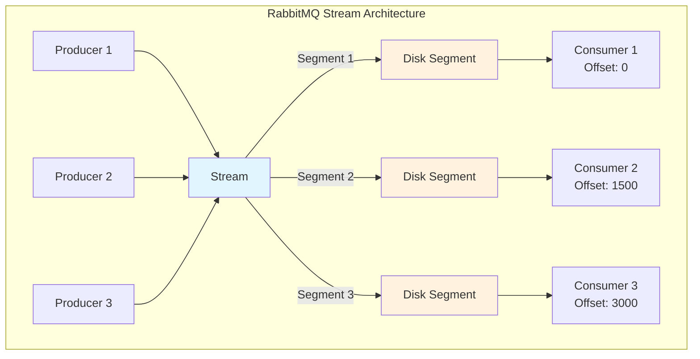
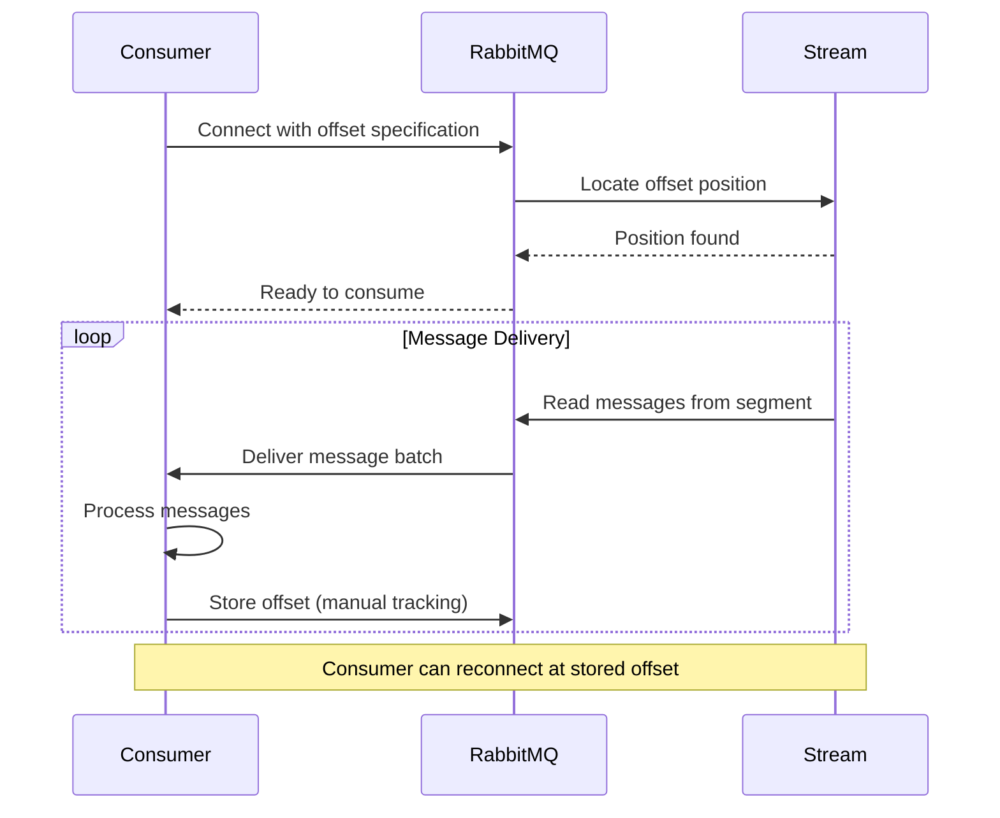
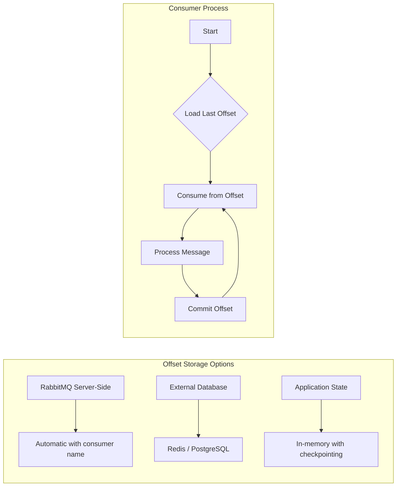
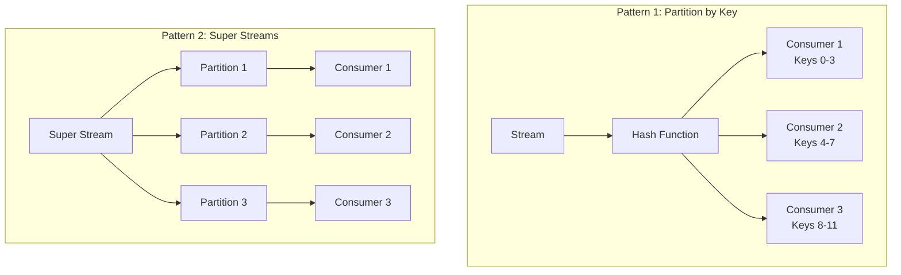
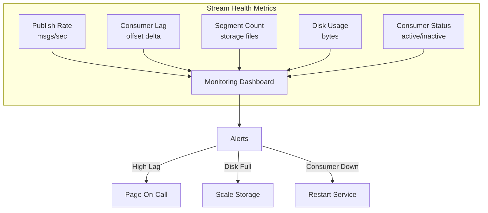

# How to Build RabbitMQ Stream Queues

By [Nawaz Dhandala](https://github.com/nawazdhandala)

Tags: RabbitMQ, Streams, Message Queue, Event Streaming, Offset Tracking, High Throughput, Distributed Systems

Description: A comprehensive guide to building RabbitMQ Stream Queues for high-throughput, replay-capable messaging. Learn the differences between stream and classic queues, offset tracking, large message handling, and consumer patterns.

---

> "Streams are to messaging what databases are to storage - they give you history, replay, and the ability to time-travel through your data."

RabbitMQ Streams, introduced in version 3.9, represent a paradigm shift in message queuing. Unlike classic queues where messages are consumed and deleted, streams persist messages in an append-only log, enabling multiple consumers to read the same messages, replay from any point, and handle massive throughput with minimal memory overhead.

This guide walks through stream queue architecture, implementation patterns, and production-ready code examples that you can adapt for your systems.

---

## Table of Contents

1. Stream Queues vs Classic Queues
2. Stream Architecture Overview
3. Setting Up RabbitMQ Streams
4. Publishing to Streams
5. Consuming from Streams
6. Offset Tracking Strategies
7. Handling Large Messages
8. Stream Consumers and Scaling
9. Retention Policies
10. Monitoring Streams with OneUptime
11. Common Patterns and Best Practices

---

## 1. Stream Queues vs Classic Queues

Understanding when to use streams versus classic queues is crucial for designing effective messaging architectures.

| Feature | Classic Queue | Stream Queue |
|---------|---------------|--------------|
| Message Persistence | Until consumed/acknowledged | Retained based on policy (time/size) |
| Consumer Model | Competing consumers (one message, one consumer) | Non-destructive (multiple consumers read same messages) |
| Replay Capability | No | Yes (from any offset) |
| Memory Usage | Proportional to queue depth | Minimal (messages stored on disk) |
| Throughput | Good (~50K msg/sec) | Excellent (~1M+ msg/sec) |
| Ordering | Per-queue | Strict append-only ordering |
| Use Case | Task distribution, RPC | Event sourcing, audit logs, replay scenarios |

### When to Use Streams

- **Event sourcing**: Replay events to rebuild state
- **Audit logs**: Immutable record of all actions
- **Large fan-out**: Multiple consumers processing the same messages
- **High throughput**: Millions of messages per second
- **Time-travel debugging**: Replay from a specific point in time

### When to Use Classic Queues

- **Task distribution**: Work that should only be processed once
- **RPC patterns**: Request/response workflows
- **Low latency requirements**: Sub-millisecond delivery
- **Simple acknowledgment**: Message deleted after processing

---

## 2. Stream Architecture Overview

RabbitMQ streams use an append-only log structure inspired by Apache Kafka but integrated natively into RabbitMQ.



### Key Components

1. **Segments**: Messages are stored in fixed-size segments on disk
2. **Offsets**: Each message has a unique, monotonically increasing offset
3. **Consumers**: Track their position independently via offsets
4. **Retention**: Configurable by time or total size

---

## 3. Setting Up RabbitMQ Streams

First, ensure the streams plugin is enabled:

```bash
# Enable the stream plugin (required for RabbitMQ < 3.9)
rabbitmq-plugins enable rabbitmq_stream

# Verify the plugin is active
rabbitmq-plugins list | grep stream
```

### Declaring a Stream with Node.js

```javascript
// stream-setup.js
// This script demonstrates how to declare a RabbitMQ stream with retention policies
// using the amqplib library for AMQP 0-9-1 protocol

const amqp = require('amqplib');

async function setupStream() {
    // Connect to RabbitMQ server
    const connection = await amqp.connect('amqp://localhost:5672');
    const channel = await connection.createChannel();

    // Declare a stream queue with specific arguments
    // The 'x-queue-type: stream' argument is what makes this a stream queue
    await channel.assertQueue('events.stream', {
        durable: true,           // Stream survives broker restart
        arguments: {
            'x-queue-type': 'stream',           // This makes it a stream queue
            'x-max-length-bytes': 5000000000,   // 5GB max size
            'x-max-age': '7D',                  // Retain messages for 7 days
            'x-stream-max-segment-size-bytes': 100000000  // 100MB segments
        }
    });

    console.log('Stream queue created successfully');

    await channel.close();
    await connection.close();
}

setupStream().catch(console.error);
```

### Declaring a Stream with Python

```python
# stream_setup.py
# Demonstrates stream queue declaration using pika library
# Note: Stream-specific features require RabbitMQ 3.9+

import pika

def setup_stream():
    # Establish connection to RabbitMQ
    connection = pika.BlockingConnection(
        pika.ConnectionParameters(host='localhost')
    )
    channel = connection.channel()

    # Declare the stream queue with retention policies
    # x-queue-type: stream is the key argument that creates a stream
    channel.queue_declare(
        queue='events.stream',
        durable=True,  # Streams must be durable
        arguments={
            'x-queue-type': 'stream',           # Stream queue type
            'x-max-length-bytes': 5_000_000_000,  # 5GB retention
            'x-max-age': '7D',                   # 7-day retention
            'x-stream-max-segment-size-bytes': 100_000_000  # 100MB segments
        }
    )

    print('Stream queue created successfully')
    connection.close()

if __name__ == '__main__':
    setup_stream()
```

---

## 4. Publishing to Streams

Publishing to streams works similarly to classic queues, but with some important considerations for performance.

### High-Throughput Publisher (Node.js)

```javascript
// stream-publisher.js
// High-performance publisher with batching and confirmation handling
// Designed for throughput while maintaining delivery guarantees

const amqp = require('amqplib');

class StreamPublisher {
    constructor(streamName) {
        this.streamName = streamName;
        this.channel = null;
        this.connection = null;
        // Buffer for batching messages
        this.pendingMessages = [];
        this.batchSize = 100;
        this.flushInterval = 50; // ms
    }

    async connect() {
        // Connect with a higher frame size for better throughput
        this.connection = await amqp.connect('amqp://localhost:5672', {
            frameMax: 0  // No limit on frame size
        });

        // Create a confirm channel for publisher confirms
        // This ensures messages are persisted before acknowledging
        this.channel = await this.connection.createConfirmChannel();

        // Set prefetch for flow control
        await this.channel.prefetch(1000);

        // Start the batch flush timer
        this.startFlushTimer();

        console.log('Publisher connected to stream:', this.streamName);
    }

    // Add message to batch buffer
    async publish(message, options = {}) {
        const content = Buffer.from(JSON.stringify(message));

        this.pendingMessages.push({
            content,
            options: {
                persistent: true,  // Ensure durability
                timestamp: Date.now(),
                ...options
            }
        });

        // Flush if batch size reached
        if (this.pendingMessages.length >= this.batchSize) {
            await this.flush();
        }
    }

    // Flush all pending messages to the stream
    async flush() {
        if (this.pendingMessages.length === 0) return;

        const batch = this.pendingMessages;
        this.pendingMessages = [];

        // Publish all messages in the batch
        for (const msg of batch) {
            this.channel.sendToQueue(
                this.streamName,
                msg.content,
                msg.options
            );
        }

        // Wait for all messages to be confirmed
        await this.channel.waitForConfirms();
        console.log(`Flushed ${batch.length} messages to stream`);
    }

    startFlushTimer() {
        setInterval(() => this.flush(), this.flushInterval);
    }

    async close() {
        await this.flush();  // Flush remaining messages
        await this.channel.close();
        await this.connection.close();
    }
}

// Usage example
async function main() {
    const publisher = new StreamPublisher('events.stream');
    await publisher.connect();

    // Publish 10,000 events
    for (let i = 0; i < 10000; i++) {
        await publisher.publish({
            eventType: 'user.action',
            userId: `user-${i % 100}`,
            action: 'page_view',
            timestamp: new Date().toISOString(),
            metadata: { page: '/dashboard', sessionId: `sess-${i}` }
        });
    }

    await publisher.close();
}

main().catch(console.error);
```

### Publisher with Deduplication (Go)

```go
// stream_publisher.go
// Go publisher with message deduplication using publishing IDs
// This prevents duplicate messages even during network failures

package main

import (
    "context"
    "encoding/json"
    "fmt"
    "log"
    "time"

    "github.com/rabbitmq/rabbitmq-stream-go-client/pkg/amqp"
    "github.com/rabbitmq/rabbitmq-stream-go-client/pkg/stream"
)

// Event represents our domain event structure
type Event struct {
    EventType string                 `json:"eventType"`
    UserID    string                 `json:"userId"`
    Timestamp time.Time              `json:"timestamp"`
    Data      map[string]interface{} `json:"data"`
}

// StreamPublisher wraps the stream producer with deduplication
type StreamPublisher struct {
    producer     *stream.Producer
    env          *stream.Environment
    streamName   string
    // Sequence counter for deduplication
    // Each message gets a unique, monotonic publishing ID
    sequenceNum  int64
}

func NewStreamPublisher(streamName string) (*StreamPublisher, error) {
    // Create stream environment with connection settings
    env, err := stream.NewEnvironment(
        stream.NewEnvironmentOptions().
            SetHost("localhost").
            SetPort(5552).  // Stream protocol port
            SetUser("guest").
            SetPassword("guest"),
    )
    if err != nil {
        return nil, fmt.Errorf("failed to create environment: %w", err)
    }

    // Create stream if it doesn't exist
    // MaxLengthBytes and MaxAge control retention
    err = env.DeclareStream(streamName,
        stream.NewStreamOptions().
            SetMaxLengthBytes(stream.ByteCapacity{}.GB(5)).
            SetMaxAge(7 * 24 * time.Hour),  // 7 days
    )
    if err != nil {
        log.Printf("Stream may already exist: %v", err)
    }

    // Create producer with deduplication enabled
    // The producer name enables server-side deduplication
    producer, err := env.NewProducer(streamName,
        stream.NewProducerOptions().
            SetName("event-publisher-1").  // Required for deduplication
            SetBatchSize(100).
            SetBatchPublishingDelay(50),
    )
    if err != nil {
        return nil, fmt.Errorf("failed to create producer: %w", err)
    }

    return &StreamPublisher{
        producer:   producer,
        env:        env,
        streamName: streamName,
    }, nil
}

// Publish sends an event to the stream with a unique publishing ID
func (p *StreamPublisher) Publish(ctx context.Context, event Event) error {
    // Serialize the event to JSON
    data, err := json.Marshal(event)
    if err != nil {
        return fmt.Errorf("failed to marshal event: %w", err)
    }

    // Increment sequence for deduplication
    // If the same publishing ID is sent twice, RabbitMQ will deduplicate
    p.sequenceNum++

    // Create AMQP message with publishing ID
    msg := amqp.NewMessage(data)
    msg.SetPublishingId(p.sequenceNum)

    // Send with confirmation callback
    err = p.producer.Send(msg)
    if err != nil {
        return fmt.Errorf("failed to send message: %w", err)
    }

    return nil
}

func (p *StreamPublisher) Close() error {
    if err := p.producer.Close(); err != nil {
        return err
    }
    return p.env.Close()
}

func main() {
    publisher, err := NewStreamPublisher("events.stream")
    if err != nil {
        log.Fatal(err)
    }
    defer publisher.Close()

    // Publish sample events
    for i := 0; i < 1000; i++ {
        event := Event{
            EventType: "order.created",
            UserID:    fmt.Sprintf("user-%d", i%50),
            Timestamp: time.Now(),
            Data: map[string]interface{}{
                "orderId": fmt.Sprintf("ord-%d", i),
                "amount":  99.99,
            },
        }

        if err := publisher.Publish(context.Background(), event); err != nil {
            log.Printf("Failed to publish event: %v", err)
        }
    }

    log.Println("Published 1000 events successfully")
}
```

---

## 5. Consuming from Streams

Stream consumers differ significantly from classic queue consumers. They specify where to start reading and maintain their own position.

### Stream Consumer Flow



### Basic Stream Consumer (Node.js)

```javascript
// stream-consumer.js
// Basic stream consumer with offset specification
// Demonstrates different starting positions for stream consumption

const amqp = require('amqplib');

class StreamConsumer {
    constructor(streamName, consumerName) {
        this.streamName = streamName;
        this.consumerName = consumerName;
        this.channel = null;
        this.connection = null;
        this.messageCount = 0;
    }

    async connect() {
        this.connection = await amqp.connect('amqp://localhost:5672');
        this.channel = await this.connection.createChannel();

        // Important: Set QoS for stream consumers
        // This controls how many messages are prefetched
        await this.channel.prefetch(100);
    }

    // Start consuming from a specific offset strategy
    async consume(offsetSpec = 'first') {
        // Convert offset specification to x-stream-offset argument
        // Options: 'first', 'last', 'next', timestamp, or specific offset number
        const args = this.getOffsetArgs(offsetSpec);

        console.log(`Starting consumer "${this.consumerName}" from offset: ${offsetSpec}`);

        // Consume from the stream
        await this.channel.consume(
            this.streamName,
            (msg) => this.handleMessage(msg),
            {
                noAck: false,  // Manual acknowledgment
                arguments: args,
                consumerTag: this.consumerName
            }
        );
    }

    // Convert offset specification to RabbitMQ arguments
    getOffsetArgs(offsetSpec) {
        // 'first': Start from the beginning of the stream
        // 'last': Start from the last chunk in the stream
        // 'next': Start from new messages only (nothing existing)
        // timestamp: Start from messages after this time
        // number: Start from specific offset

        if (offsetSpec === 'first') {
            return { 'x-stream-offset': 'first' };
        } else if (offsetSpec === 'last') {
            return { 'x-stream-offset': 'last' };
        } else if (offsetSpec === 'next') {
            return { 'x-stream-offset': 'next' };
        } else if (offsetSpec instanceof Date) {
            // Timestamp-based offset
            return { 'x-stream-offset': { '!': 'timestamp', value: offsetSpec.getTime() } };
        } else if (typeof offsetSpec === 'number') {
            // Specific offset number
            return { 'x-stream-offset': offsetSpec };
        }

        return { 'x-stream-offset': 'first' };
    }

    handleMessage(msg) {
        if (!msg) return;

        this.messageCount++;

        // Extract the stream offset from message properties
        const offset = msg.properties.headers['x-stream-offset'];
        const content = JSON.parse(msg.content.toString());

        console.log(`[${this.consumerName}] Offset ${offset}:`, content.eventType);

        // Acknowledge the message
        // For streams, this doesn't delete the message, just advances the consumer position
        this.channel.ack(msg);

        // Periodically log progress
        if (this.messageCount % 1000 === 0) {
            console.log(`Processed ${this.messageCount} messages, current offset: ${offset}`);
        }
    }

    async close() {
        await this.channel.close();
        await this.connection.close();
    }
}

// Usage: Multiple consumers reading the same stream
async function main() {
    // Consumer 1: Read from beginning
    const consumer1 = new StreamConsumer('events.stream', 'analytics-consumer');
    await consumer1.connect();
    await consumer1.consume('first');

    // Consumer 2: Read only new messages
    const consumer2 = new StreamConsumer('events.stream', 'realtime-consumer');
    await consumer2.connect();
    await consumer2.consume('next');

    // Consumer 3: Replay from 1 hour ago
    const oneHourAgo = new Date(Date.now() - 60 * 60 * 1000);
    const consumer3 = new StreamConsumer('events.stream', 'replay-consumer');
    await consumer3.connect();
    await consumer3.consume(oneHourAgo);

    console.log('All consumers started');
}

main().catch(console.error);
```

---

## 6. Offset Tracking Strategies

Offset tracking is critical for stream consumers. Unlike classic queues where RabbitMQ tracks consumption, stream consumers must manage their own position.

### Offset Tracking Architecture



### Server-Side Offset Tracking (Recommended)

```javascript
// offset-tracking-server.js
// Uses RabbitMQ's built-in server-side offset tracking
// The server stores the offset associated with the consumer name

const amqp = require('amqplib');

class TrackedStreamConsumer {
    constructor(streamName, consumerName) {
        this.streamName = streamName;
        // Consumer name must be unique per logical consumer
        // RabbitMQ uses this to store and retrieve offsets
        this.consumerName = consumerName;
        this.channel = null;
    }

    async connect() {
        this.connection = await amqp.connect('amqp://localhost:5672');
        this.channel = await this.connection.createChannel();
        await this.channel.prefetch(100);
    }

    async startConsuming() {
        // When using server-side tracking, specify the consumer name
        // RabbitMQ will automatically resume from the last committed offset
        const args = {
            // 'x-stream-offset': 'first' would ignore stored offset
            // Omitting it uses the stored offset, or 'next' if none exists
        };

        await this.channel.consume(
            this.streamName,
            async (msg) => {
                if (!msg) return;

                const offset = msg.properties.headers['x-stream-offset'];
                const content = JSON.parse(msg.content.toString());

                try {
                    // Process the message
                    await this.processMessage(content);

                    // Acknowledge to advance the tracked offset
                    // This commits the offset server-side
                    this.channel.ack(msg);

                } catch (error) {
                    // Negative acknowledgment - message will be redelivered
                    // from this offset on reconnection
                    console.error('Processing failed:', error);
                    this.channel.nack(msg, false, false);
                }
            },
            {
                noAck: false,
                consumerTag: this.consumerName,
                arguments: args
            }
        );

        console.log(`Consumer ${this.consumerName} started with server-side offset tracking`);
    }

    async processMessage(content) {
        // Your business logic here
        console.log('Processing:', content.eventType);
        // Simulate processing time
        await new Promise(r => setTimeout(r, 10));
    }
}

// Usage
async function main() {
    const consumer = new TrackedStreamConsumer('events.stream', 'order-processor-1');
    await consumer.connect();
    await consumer.startConsuming();

    // If this process restarts, it will resume from the last acknowledged offset
}

main().catch(console.error);
```

### External Offset Storage (Redis)

```javascript
// offset-tracking-redis.js
// External offset tracking using Redis for more control and visibility
// Useful when you need to query offsets or coordinate multiple consumers

const amqp = require('amqplib');
const Redis = require('ioredis');

class RedisTrackedConsumer {
    constructor(streamName, consumerGroup, consumerId) {
        this.streamName = streamName;
        this.consumerGroup = consumerGroup;
        this.consumerId = consumerId;
        this.redis = new Redis();
        this.channel = null;
        // Commit offset every N messages for performance
        this.commitInterval = 100;
        this.uncommittedCount = 0;
        this.lastOffset = null;
    }

    // Redis key for storing this consumer's offset
    get offsetKey() {
        return `rabbitmq:stream:${this.streamName}:${this.consumerGroup}:${this.consumerId}:offset`;
    }

    async connect() {
        this.connection = await amqp.connect('amqp://localhost:5672');
        this.channel = await this.connection.createChannel();
        await this.channel.prefetch(200);
    }

    // Load the last committed offset from Redis
    async loadOffset() {
        const stored = await this.redis.get(this.offsetKey);
        if (stored) {
            // Parse the stored offset and add 1 to start from the next message
            return parseInt(stored, 10) + 1;
        }
        return null;  // No stored offset, will use 'first'
    }

    // Commit offset to Redis
    async commitOffset(offset) {
        await this.redis.set(this.offsetKey, offset.toString());
        // Also store metadata for debugging
        await this.redis.hset(
            `rabbitmq:stream:${this.streamName}:${this.consumerGroup}:metadata`,
            this.consumerId,
            JSON.stringify({
                offset,
                timestamp: new Date().toISOString(),
                hostname: require('os').hostname()
            })
        );
    }

    async startConsuming() {
        // Load starting offset from Redis
        const startOffset = await this.loadOffset();

        const args = startOffset
            ? { 'x-stream-offset': startOffset }
            : { 'x-stream-offset': 'first' };

        console.log(`Starting from offset: ${startOffset || 'first'}`);

        await this.channel.consume(
            this.streamName,
            async (msg) => {
                if (!msg) return;

                const offset = msg.properties.headers['x-stream-offset'];

                try {
                    await this.processMessage(msg);
                    this.channel.ack(msg);

                    // Track offset for batched commits
                    this.lastOffset = offset;
                    this.uncommittedCount++;

                    // Commit offset periodically
                    if (this.uncommittedCount >= this.commitInterval) {
                        await this.commitOffset(this.lastOffset);
                        console.log(`Committed offset: ${this.lastOffset}`);
                        this.uncommittedCount = 0;
                    }

                } catch (error) {
                    console.error('Processing error at offset', offset, error);
                    this.channel.nack(msg, false, false);
                }
            },
            { noAck: false, arguments: args }
        );
    }

    async processMessage(msg) {
        const content = JSON.parse(msg.content.toString());
        // Process message...
    }

    // Graceful shutdown - commit final offset
    async close() {
        if (this.lastOffset !== null && this.uncommittedCount > 0) {
            await this.commitOffset(this.lastOffset);
            console.log(`Final offset committed: ${this.lastOffset}`);
        }
        await this.channel.close();
        await this.connection.close();
        await this.redis.quit();
    }
}

// Usage with graceful shutdown
async function main() {
    const consumer = new RedisTrackedConsumer(
        'events.stream',
        'analytics-group',
        'consumer-1'
    );

    await consumer.connect();
    await consumer.startConsuming();

    // Handle graceful shutdown
    process.on('SIGTERM', async () => {
        console.log('Shutting down gracefully...');
        await consumer.close();
        process.exit(0);
    });
}

main().catch(console.error);
```

---

## 7. Handling Large Messages

Streams can handle large messages, but require specific configuration and patterns for optimal performance.

### Large Message Configuration

```javascript
// large-message-config.js
// Configuration for handling messages up to 16MB
// Important: Large messages impact throughput, use sparingly

const amqp = require('amqplib');

async function setupLargeMessageStream() {
    // Connect with larger frame size
    const connection = await amqp.connect('amqp://localhost:5672', {
        // Frame max of 0 means no limit (up to broker max)
        frameMax: 0
    });

    const channel = await connection.createChannel();

    // Declare stream with larger segment size for large messages
    await channel.assertQueue('large-events.stream', {
        durable: true,
        arguments: {
            'x-queue-type': 'stream',
            'x-max-length-bytes': 50000000000,  // 50GB
            'x-max-age': '30D',
            // Larger segments reduce overhead for big messages
            'x-stream-max-segment-size-bytes': 500000000  // 500MB segments
        }
    });

    return { connection, channel };
}
```

### Chunked Large Message Publisher

```javascript
// chunked-publisher.js
// Splits large payloads into chunks for reliable delivery
// Useful when dealing with payloads > 1MB

const amqp = require('amqplib');
const crypto = require('crypto');

class ChunkedPublisher {
    constructor(streamName) {
        this.streamName = streamName;
        this.channel = null;
        // Maximum chunk size (512KB is a good balance)
        this.maxChunkSize = 512 * 1024;
    }

    async connect() {
        this.connection = await amqp.connect('amqp://localhost:5672');
        this.channel = await this.connection.createConfirmChannel();
    }

    // Publish a large payload by splitting into chunks
    async publishLarge(payload, metadata = {}) {
        // Generate a unique message ID for reassembly
        const messageId = crypto.randomUUID();
        const data = Buffer.from(JSON.stringify(payload));
        const totalChunks = Math.ceil(data.length / this.maxChunkSize);

        console.log(`Splitting ${data.length} bytes into ${totalChunks} chunks`);

        // Send each chunk with sequence information
        for (let i = 0; i < totalChunks; i++) {
            const start = i * this.maxChunkSize;
            const end = Math.min(start + this.maxChunkSize, data.length);
            const chunk = data.slice(start, end);

            // Chunk message format includes reassembly metadata
            const chunkMessage = {
                messageId,
                chunkIndex: i,
                totalChunks,
                isLastChunk: i === totalChunks - 1,
                data: chunk.toString('base64'),
                metadata
            };

            this.channel.sendToQueue(
                this.streamName,
                Buffer.from(JSON.stringify(chunkMessage)),
                {
                    persistent: true,
                    headers: {
                        'x-message-id': messageId,
                        'x-chunk-index': i,
                        'x-total-chunks': totalChunks
                    }
                }
            );
        }

        // Wait for all chunks to be confirmed
        await this.channel.waitForConfirms();
        console.log(`Published message ${messageId} in ${totalChunks} chunks`);

        return messageId;
    }
}

// Usage
async function main() {
    const publisher = new ChunkedPublisher('large-events.stream');
    await publisher.connect();

    // Create a large payload (e.g., 5MB)
    const largePayload = {
        type: 'bulk_import',
        records: Array(50000).fill(null).map((_, i) => ({
            id: i,
            name: `Record ${i}`,
            data: 'x'.repeat(100)
        }))
    };

    await publisher.publishLarge(largePayload, { source: 'data-import' });
}

main().catch(console.error);
```

### Chunked Message Consumer

```javascript
// chunked-consumer.js
// Reassembles chunked messages back into complete payloads
// Uses in-memory buffer with timeout for incomplete messages

const amqp = require('amqplib');

class ChunkedConsumer {
    constructor(streamName) {
        this.streamName = streamName;
        // Buffer for in-progress message assembly
        // Map: messageId -> { chunks: [], expectedTotal: n, timeout: timer }
        this.assemblyBuffer = new Map();
        // Timeout for incomplete messages (30 seconds)
        this.assemblyTimeout = 30000;
    }

    async connect() {
        this.connection = await amqp.connect('amqp://localhost:5672');
        this.channel = await this.connection.createChannel();
        await this.channel.prefetch(500);  // Higher prefetch for chunk throughput
    }

    async startConsuming(onComplete) {
        await this.channel.consume(
            this.streamName,
            (msg) => {
                if (!msg) return;

                const chunk = JSON.parse(msg.content.toString());
                this.processChunk(chunk, onComplete);
                this.channel.ack(msg);
            },
            {
                noAck: false,
                arguments: { 'x-stream-offset': 'first' }
            }
        );
    }

    processChunk(chunk, onComplete) {
        const { messageId, chunkIndex, totalChunks, isLastChunk, data } = chunk;

        // Get or create assembly entry
        if (!this.assemblyBuffer.has(messageId)) {
            this.assemblyBuffer.set(messageId, {
                chunks: new Array(totalChunks),
                received: 0,
                expectedTotal: totalChunks,
                metadata: chunk.metadata,
                // Set timeout to clean up incomplete messages
                timeout: setTimeout(() => {
                    console.warn(`Assembly timeout for message ${messageId}`);
                    this.assemblyBuffer.delete(messageId);
                }, this.assemblyTimeout)
            });
        }

        const assembly = this.assemblyBuffer.get(messageId);

        // Store chunk in correct position
        if (!assembly.chunks[chunkIndex]) {
            assembly.chunks[chunkIndex] = Buffer.from(data, 'base64');
            assembly.received++;
        }

        // Check if all chunks received
        if (assembly.received === assembly.expectedTotal) {
            // Clear timeout
            clearTimeout(assembly.timeout);

            // Reassemble the complete message
            const completeData = Buffer.concat(assembly.chunks);
            const payload = JSON.parse(completeData.toString());

            // Clean up
            this.assemblyBuffer.delete(messageId);

            // Deliver complete message
            console.log(`Reassembled message ${messageId}: ${completeData.length} bytes`);
            onComplete(payload, assembly.metadata);
        }
    }
}

// Usage
async function main() {
    const consumer = new ChunkedConsumer('large-events.stream');
    await consumer.connect();

    await consumer.startConsuming((payload, metadata) => {
        console.log('Received complete message:', {
            type: payload.type,
            recordCount: payload.records?.length,
            metadata
        });
    });
}

main().catch(console.error);
```

---

## 8. Stream Consumers and Scaling

Scaling stream consumers requires understanding the non-competing nature of stream consumption.

### Consumer Scaling Patterns



### Single Active Consumer Pattern

```javascript
// single-active-consumer.js
// Ensures only one consumer processes messages at a time
// Useful for ordered processing with automatic failover

const amqp = require('amqplib');

class SingleActiveConsumer {
    constructor(streamName, groupName) {
        this.streamName = streamName;
        this.groupName = groupName;
        this.channel = null;
        this.isActive = false;
    }

    async connect() {
        this.connection = await amqp.connect('amqp://localhost:5672');
        this.channel = await this.connection.createChannel();
        await this.channel.prefetch(100);
    }

    async startConsuming() {
        // Single Active Consumer is enabled via x-single-active-consumer
        // Only one consumer in the group will receive messages
        await this.channel.consume(
            this.streamName,
            (msg) => this.handleMessage(msg),
            {
                noAck: false,
                // Consumer tag should be unique per instance
                consumerTag: `${this.groupName}-${process.pid}`,
                arguments: {
                    'x-stream-offset': 'first',
                    // Enable single active consumer
                    'x-single-active-consumer': true
                }
            }
        );

        console.log(`Consumer ${process.pid} joined group ${this.groupName}`);
    }

    handleMessage(msg) {
        if (!msg) return;

        // Mark as active when first message received
        if (!this.isActive) {
            this.isActive = true;
            console.log(`Consumer ${process.pid} is now ACTIVE`);
        }

        const content = JSON.parse(msg.content.toString());
        console.log(`Processing: ${content.eventType}`);

        this.channel.ack(msg);
    }
}

// Run multiple instances - only one will be active
async function main() {
    const consumer = new SingleActiveConsumer('events.stream', 'processor-group');
    await consumer.connect();
    await consumer.startConsuming();

    console.log(`Consumer ${process.pid} started, waiting for activation...`);
}

main().catch(console.error);
```

### Super Streams for Parallel Processing

```javascript
// super-stream-consumer.js
// Super streams partition data for parallel processing
// Each partition can have its own consumer for scalability

const amqp = require('amqplib');

async function setupSuperStream() {
    const connection = await amqp.connect('amqp://localhost:5672');
    const channel = await connection.createChannel();

    // Super streams are created via management commands or HTTP API
    // This shows the conceptual partition structure
    const partitions = ['events-0', 'events-1', 'events-2'];

    // Declare each partition as a stream
    for (const partition of partitions) {
        await channel.assertQueue(partition, {
            durable: true,
            arguments: {
                'x-queue-type': 'stream',
                'x-max-length-bytes': 2000000000  // 2GB per partition
            }
        });
    }

    // Create exchange for routing
    await channel.assertExchange('events.super', 'direct', { durable: true });

    // Bind partitions
    for (let i = 0; i < partitions.length; i++) {
        await channel.bindQueue(partitions[i], 'events.super', `partition-${i}`);
    }

    return { connection, channel, partitions };
}

class SuperStreamPublisher {
    constructor(exchangeName, partitionCount) {
        this.exchangeName = exchangeName;
        this.partitionCount = partitionCount;
    }

    async connect() {
        this.connection = await amqp.connect('amqp://localhost:5672');
        this.channel = await this.connection.createConfirmChannel();
    }

    // Route message to partition based on key hash
    async publish(message, partitionKey) {
        // Simple hash function for partition assignment
        const partition = this.hashKey(partitionKey) % this.partitionCount;
        const routingKey = `partition-${partition}`;

        this.channel.publish(
            this.exchangeName,
            routingKey,
            Buffer.from(JSON.stringify(message)),
            { persistent: true }
        );

        await this.channel.waitForConfirms();
    }

    hashKey(key) {
        let hash = 0;
        for (let i = 0; i < key.length; i++) {
            hash = ((hash << 5) - hash) + key.charCodeAt(i);
            hash = hash & hash;
        }
        return Math.abs(hash);
    }
}

class SuperStreamConsumer {
    constructor(partitions) {
        this.partitions = partitions;
        this.consumers = [];
    }

    async connect() {
        this.connection = await amqp.connect('amqp://localhost:5672');
    }

    // Start a consumer for each partition
    async startConsuming(handler) {
        for (const partition of this.partitions) {
            const channel = await this.connection.createChannel();
            await channel.prefetch(100);

            await channel.consume(
                partition,
                (msg) => {
                    if (!msg) return;
                    handler(msg, partition);
                    channel.ack(msg);
                },
                {
                    noAck: false,
                    arguments: { 'x-stream-offset': 'first' }
                }
            );

            this.consumers.push(channel);
            console.log(`Started consumer for partition: ${partition}`);
        }
    }
}

// Usage
async function main() {
    // Setup
    const { partitions } = await setupSuperStream();

    // Publish with partition key
    const publisher = new SuperStreamPublisher('events.super', 3);
    await publisher.connect();

    for (let i = 0; i < 1000; i++) {
        await publisher.publish(
            { eventType: 'order.created', orderId: `order-${i}` },
            `user-${i % 100}`  // Partition by user ID
        );
    }

    // Consume from all partitions
    const consumer = new SuperStreamConsumer(partitions);
    await consumer.connect();
    await consumer.startConsuming((msg, partition) => {
        const content = JSON.parse(msg.content.toString());
        console.log(`[${partition}] ${content.eventType}`);
    });
}

main().catch(console.error);
```

---

## 9. Retention Policies

Proper retention configuration balances storage costs with replay capabilities.

### Retention Configuration

```javascript
// retention-config.js
// Different retention strategies for different use cases

async function configureRetention(channel) {
    // Strategy 1: Time-based retention (audit logs)
    await channel.assertQueue('audit.stream', {
        durable: true,
        arguments: {
            'x-queue-type': 'stream',
            'x-max-age': '90D'  // Keep for 90 days (compliance)
        }
    });

    // Strategy 2: Size-based retention (high-volume metrics)
    await channel.assertQueue('metrics.stream', {
        durable: true,
        arguments: {
            'x-queue-type': 'stream',
            'x-max-length-bytes': 10000000000  // 10GB cap
        }
    });

    // Strategy 3: Combined (events with both limits)
    await channel.assertQueue('events.stream', {
        durable: true,
        arguments: {
            'x-queue-type': 'stream',
            'x-max-age': '7D',                  // 7 days max
            'x-max-length-bytes': 5000000000    // OR 5GB max
            // Whichever limit is hit first triggers cleanup
        }
    });

    // Strategy 4: Segment-optimized (large messages)
    await channel.assertQueue('documents.stream', {
        durable: true,
        arguments: {
            'x-queue-type': 'stream',
            'x-max-age': '30D',
            // Larger segments for fewer files
            'x-stream-max-segment-size-bytes': 500000000  // 500MB
        }
    });
}
```

---

## 10. Monitoring Streams with OneUptime

Effective stream monitoring requires tracking throughput, consumer lag, and storage metrics.

### Key Metrics to Monitor



### Prometheus Metrics Exporter

```javascript
// stream-metrics.js
// Exports stream metrics for Prometheus/OneUptime scraping

const amqp = require('amqplib');
const express = require('express');
const client = require('prom-client');

// Define Prometheus metrics
const publishRate = new client.Gauge({
    name: 'rabbitmq_stream_publish_rate',
    help: 'Messages published per second',
    labelNames: ['stream']
});

const consumerLag = new client.Gauge({
    name: 'rabbitmq_stream_consumer_lag',
    help: 'Offset difference between head and consumer position',
    labelNames: ['stream', 'consumer']
});

const streamSize = new client.Gauge({
    name: 'rabbitmq_stream_size_bytes',
    help: 'Total size of stream in bytes',
    labelNames: ['stream']
});

const segmentCount = new client.Gauge({
    name: 'rabbitmq_stream_segments',
    help: 'Number of segments in stream',
    labelNames: ['stream']
});

class StreamMetricsCollector {
    constructor(managementUrl, username, password) {
        this.managementUrl = managementUrl;
        this.auth = Buffer.from(`${username}:${password}`).toString('base64');
    }

    async collectMetrics() {
        try {
            // Fetch queue details from RabbitMQ Management API
            const response = await fetch(`${this.managementUrl}/api/queues`, {
                headers: { 'Authorization': `Basic ${this.auth}` }
            });

            const queues = await response.json();

            for (const queue of queues) {
                // Only process stream queues
                if (queue.arguments?.['x-queue-type'] !== 'stream') continue;

                const streamName = queue.name;

                // Update metrics
                publishRate.set({ stream: streamName }, queue.message_stats?.publish_details?.rate || 0);
                streamSize.set({ stream: streamName }, queue.message_bytes || 0);

                // Calculate consumer lag for each consumer
                if (queue.consumer_details) {
                    for (const consumer of queue.consumer_details) {
                        const lag = (queue.messages || 0) - (consumer.prefetch_count || 0);
                        consumerLag.set(
                            { stream: streamName, consumer: consumer.consumer_tag },
                            Math.max(0, lag)
                        );
                    }
                }
            }
        } catch (error) {
            console.error('Failed to collect metrics:', error);
        }
    }
}

// Start metrics server
async function startMetricsServer() {
    const app = express();
    const collector = new StreamMetricsCollector(
        'http://localhost:15672',
        'guest',
        'guest'
    );

    // Collect metrics every 15 seconds
    setInterval(() => collector.collectMetrics(), 15000);

    // Expose metrics endpoint for Prometheus/OneUptime
    app.get('/metrics', async (req, res) => {
        res.set('Content-Type', client.register.contentType);
        res.send(await client.register.metrics());
    });

    app.listen(9090, () => {
        console.log('Metrics server running on port 9090');
        console.log('Configure OneUptime to scrape http://localhost:9090/metrics');
    });
}

startMetricsServer();
```

### Integrating with OneUptime

[OneUptime](https://oneuptime.com) provides comprehensive monitoring for your RabbitMQ streams. Configure these alerts for production reliability:

1. **Consumer Lag Alert**: Trigger when lag exceeds 10,000 messages
2. **Publish Rate Drop**: Alert on >50% decrease in publish rate
3. **Disk Usage Warning**: Notify at 80% capacity
4. **Consumer Disconnection**: Immediate alert when consumers go offline

```yaml
# oneuptime-alerts.yaml
# Example alert configuration for RabbitMQ streams

alerts:
  - name: High Consumer Lag
    metric: rabbitmq_stream_consumer_lag
    condition: "> 10000"
    duration: 5m
    severity: warning

  - name: Critical Consumer Lag
    metric: rabbitmq_stream_consumer_lag
    condition: "> 100000"
    duration: 2m
    severity: critical

  - name: Stream Disk Usage High
    metric: rabbitmq_stream_size_bytes
    condition: "> 4000000000"  # 4GB
    severity: warning

  - name: No Active Consumers
    metric: rabbitmq_stream_consumer_count
    condition: "== 0"
    duration: 1m
    severity: critical
```

---

## 11. Common Patterns and Best Practices

### Pattern: Event Replay for Debugging

```javascript
// replay-debugger.js
// Replay events from a specific time range for debugging
// Useful for reproducing issues in development/staging

async function replayEvents(streamName, startTime, endTime, handler) {
    const connection = await amqp.connect('amqp://localhost:5672');
    const channel = await connection.createChannel();

    let processedCount = 0;
    let shouldStop = false;

    await channel.consume(
        streamName,
        (msg) => {
            if (!msg || shouldStop) return;

            const timestamp = msg.properties.timestamp;

            // Stop if we've passed the end time
            if (timestamp > endTime.getTime()) {
                shouldStop = true;
                channel.cancel(msg.fields.consumerTag);
                return;
            }

            // Process only messages within time range
            if (timestamp >= startTime.getTime()) {
                const content = JSON.parse(msg.content.toString());
                handler(content, new Date(timestamp));
                processedCount++;
            }

            channel.ack(msg);
        },
        {
            arguments: {
                'x-stream-offset': { '!': 'timestamp', value: startTime.getTime() }
            }
        }
    );

    // Wait for completion
    await new Promise(resolve => {
        const check = setInterval(() => {
            if (shouldStop) {
                clearInterval(check);
                resolve();
            }
        }, 100);
    });

    console.log(`Replayed ${processedCount} events`);
    await connection.close();
}

// Usage: Replay last hour's events
const endTime = new Date();
const startTime = new Date(endTime.getTime() - 60 * 60 * 1000);

replayEvents('events.stream', startTime, endTime, (event, timestamp) => {
    console.log(`[${timestamp.toISOString()}] ${event.eventType}`);
});
```

### Best Practices Summary

| Practice | Recommendation |
|----------|----------------|
| Segment Size | 100-500MB for typical workloads |
| Consumer Prefetch | 100-500 messages for throughput |
| Offset Commits | Batch commits every 100-1000 messages |
| Retention | Set both time AND size limits |
| Message Size | Keep under 1MB; chunk larger payloads |
| Monitoring | Track lag, throughput, and disk usage |
| Consumer Names | Use consistent, descriptive names for tracking |
| Error Handling | Implement dead-letter patterns for failed messages |

---

## Summary

RabbitMQ Streams provide a powerful foundation for building event-driven architectures that require message replay, high throughput, and multiple consumer patterns. Key takeaways:

1. **Use streams for event logs**, classic queues for task distribution
2. **Implement proper offset tracking** to ensure exactly-once processing semantics
3. **Chunk large messages** to maintain reliable delivery
4. **Monitor consumer lag** to detect processing bottlenecks early
5. **Configure retention policies** that balance storage costs with replay needs

Streams transform RabbitMQ from a traditional message broker into a capable event streaming platform, enabling patterns previously requiring dedicated systems like Apache Kafka.

---

*For comprehensive monitoring of your RabbitMQ streams, including consumer lag alerts, throughput dashboards, and automated incident response, check out [OneUptime](https://oneuptime.com) - the open-source observability platform that integrates seamlessly with your message queue infrastructure.*
