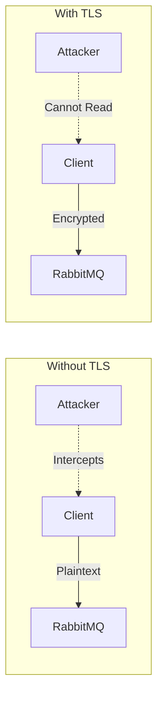
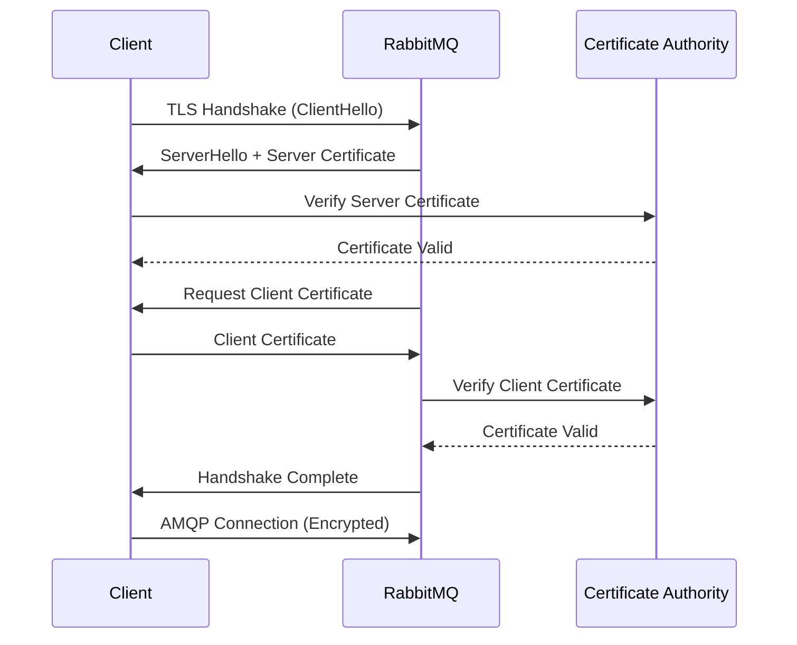
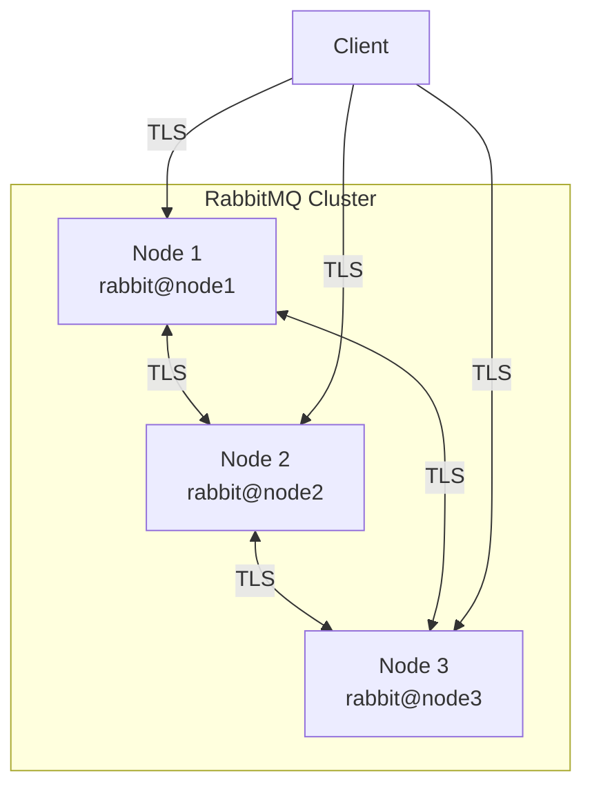
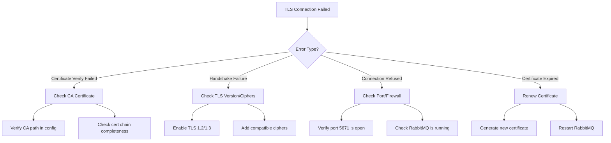

# How to Secure RabbitMQ with TLS

Author: [nawazdhandala](https://www.github.com/nawazdhandala)

Tags: RabbitMQ, TLS, Security, Message Queue, Encryption, Certificates, mTLS, DevOps

Description: A comprehensive guide to securing RabbitMQ with TLS encryption, covering certificate generation, server and client configuration, mutual TLS authentication, certificate rotation strategies, and best practices for production deployments.

---

> In transit encryption is not optional - it's the baseline. Every message passing through your message broker contains data that attackers would love to intercept. TLS is your first line of defense.

## Why TLS for RabbitMQ?

RabbitMQ handles sensitive application data, authentication credentials, and inter-service communication. Without TLS:

- Messages travel in plaintext across your network
- Credentials can be sniffed during authentication
- Man-in-the-middle attacks become trivial
- Compliance requirements (PCI-DSS, HIPAA, SOC2) cannot be met



## Certificate Generation

Before configuring RabbitMQ, you need certificates. For production, use a trusted Certificate Authority. For development and testing, you can create your own CA.

### Creating a Certificate Authority (CA)

```bash
#!/bin/bash
# create-ca.sh
# This script creates a self-signed Certificate Authority for signing server and client certificates

# Create directory structure for the CA
mkdir -p ca/{certs,private,newcerts}
cd ca

# Initialize the certificate database and serial number
touch index.txt
echo 1000 > serial

# Generate the CA private key
# -aes256: Encrypt the key with AES-256 (you'll be prompted for a passphrase)
# 4096: Key size in bits (use at least 2048 for production)
openssl genrsa -aes256 -out private/ca.key.pem 4096
chmod 400 private/ca.key.pem

# Generate the CA certificate
# -x509: Output a self-signed certificate instead of a certificate request
# -days 3650: Certificate valid for 10 years
# -sha256: Use SHA-256 for the certificate signature
openssl req -config openssl.cnf \
    -key private/ca.key.pem \
    -new -x509 -days 3650 -sha256 \
    -extensions v3_ca \
    -out certs/ca.cert.pem \
    -subj "/C=US/ST=California/L=San Francisco/O=MyOrg/OU=IT/CN=MyOrg Root CA"

# Verify the CA certificate
openssl x509 -noout -text -in certs/ca.cert.pem
```

### Generating Server Certificates

```bash
#!/bin/bash
# create-server-cert.sh
# Generates a server certificate for RabbitMQ signed by our CA

SERVER_NAME="${1:-rabbitmq}"
DAYS_VALID="${2:-365}"

# Create server private key
# No encryption (-nodes) for server keys to allow automatic startup
openssl genrsa -out server/${SERVER_NAME}.key.pem 2048
chmod 400 server/${SERVER_NAME}.key.pem

# Create Certificate Signing Request (CSR)
# The CN (Common Name) should match the server hostname
openssl req -new \
    -key server/${SERVER_NAME}.key.pem \
    -out server/${SERVER_NAME}.csr.pem \
    -subj "/C=US/ST=California/L=San Francisco/O=MyOrg/OU=IT/CN=${SERVER_NAME}"

# Create a config file for Subject Alternative Names (SANs)
# SANs are required for modern TLS - CN alone is deprecated
cat > server/${SERVER_NAME}.ext << EOF
authorityKeyIdentifier=keyid,issuer
basicConstraints=CA:FALSE
keyUsage = digitalSignature, keyEncipherment
extendedKeyUsage = serverAuth
subjectAltName = @alt_names

[alt_names]
DNS.1 = ${SERVER_NAME}
DNS.2 = ${SERVER_NAME}.local
DNS.3 = localhost
IP.1 = 127.0.0.1
EOF

# Sign the CSR with our CA to create the server certificate
openssl x509 -req \
    -in server/${SERVER_NAME}.csr.pem \
    -CA ca/certs/ca.cert.pem \
    -CAkey ca/private/ca.key.pem \
    -CAcreateserial \
    -out server/${SERVER_NAME}.cert.pem \
    -days ${DAYS_VALID} \
    -sha256 \
    -extfile server/${SERVER_NAME}.ext

# Verify the certificate
openssl verify -CAfile ca/certs/ca.cert.pem server/${SERVER_NAME}.cert.pem

echo "Server certificate created: server/${SERVER_NAME}.cert.pem"
```

### Generating Client Certificates

```bash
#!/bin/bash
# create-client-cert.sh
# Generates a client certificate for mutual TLS authentication

CLIENT_NAME="${1:-client}"
DAYS_VALID="${2:-365}"

mkdir -p client

# Create client private key
openssl genrsa -out client/${CLIENT_NAME}.key.pem 2048
chmod 400 client/${CLIENT_NAME}.key.pem

# Create Certificate Signing Request
openssl req -new \
    -key client/${CLIENT_NAME}.key.pem \
    -out client/${CLIENT_NAME}.csr.pem \
    -subj "/C=US/ST=California/L=San Francisco/O=MyOrg/OU=IT/CN=${CLIENT_NAME}"

# Create extensions file for client authentication
cat > client/${CLIENT_NAME}.ext << EOF
authorityKeyIdentifier=keyid,issuer
basicConstraints=CA:FALSE
keyUsage = digitalSignature
extendedKeyUsage = clientAuth
EOF

# Sign with CA
openssl x509 -req \
    -in client/${CLIENT_NAME}.csr.pem \
    -CA ca/certs/ca.cert.pem \
    -CAkey ca/private/ca.key.pem \
    -CAcreateserial \
    -out client/${CLIENT_NAME}.cert.pem \
    -days ${DAYS_VALID} \
    -sha256 \
    -extfile client/${CLIENT_NAME}.ext

# Create combined PEM file (some clients need key + cert in one file)
cat client/${CLIENT_NAME}.key.pem client/${CLIENT_NAME}.cert.pem > client/${CLIENT_NAME}.combined.pem

echo "Client certificate created: client/${CLIENT_NAME}.cert.pem"
```

## TLS Configuration in RabbitMQ

RabbitMQ uses an Erlang-style configuration file. Here is how to configure TLS.

### Basic TLS Configuration

```erlang
%% rabbitmq.conf (new-style configuration)
%% This is the recommended configuration format for RabbitMQ 3.7+

%% ===================
%% TLS/SSL Configuration
%% ===================

%% Enable TLS on the default AMQP port (5671 is standard for AMQPS)
listeners.ssl.default = 5671

%% Disable non-TLS connections entirely for security
%% Comment this out if you need to support legacy clients
listeners.tcp = none

%% Path to the CA certificate bundle
%% This is used to verify client certificates when mutual TLS is enabled
ssl_options.cacertfile = /etc/rabbitmq/certs/ca.cert.pem

%% Path to the server certificate
ssl_options.certfile = /etc/rabbitmq/certs/server.cert.pem

%% Path to the server private key
ssl_options.keyfile = /etc/rabbitmq/certs/server.key.pem

%% Require clients to present a valid certificate (mutual TLS)
%% Options: verify_none, verify_peer
ssl_options.verify = verify_peer

%% Fail if client doesn't present a certificate
ssl_options.fail_if_no_peer_cert = true

%% Minimum TLS version - TLS 1.2 is the minimum for security compliance
ssl_options.versions.1 = tlsv1.2
ssl_options.versions.2 = tlsv1.3

%% Cipher suites - only allow strong ciphers
%% These are the recommended ciphers for TLS 1.2
ssl_options.ciphers.1 = ECDHE-ECDSA-AES256-GCM-SHA384
ssl_options.ciphers.2 = ECDHE-RSA-AES256-GCM-SHA384
ssl_options.ciphers.3 = ECDHE-ECDSA-AES128-GCM-SHA256
ssl_options.ciphers.4 = ECDHE-RSA-AES128-GCM-SHA256

%% Honor server cipher order (server chooses the cipher)
ssl_options.honor_cipher_order = true
ssl_options.honor_ecc_order = true
```

### Advanced Configuration with Environment File

```bash
# /etc/rabbitmq/rabbitmq-env.conf
# Environment variables for RabbitMQ startup

# Node name for clustering
RABBITMQ_NODENAME=rabbit@hostname

# Configuration file location
RABBITMQ_CONFIG_FILE=/etc/rabbitmq/rabbitmq

# Enable detailed TLS logging for debugging
RABBITMQ_SERVER_ADDITIONAL_ERL_ARGS="-rabbit ssl_options [{log_level,debug}]"
```

### Docker Compose with TLS

```yaml
# docker-compose.yml
# RabbitMQ with TLS enabled in Docker

version: '3.8'

services:
  rabbitmq:
    image: rabbitmq:3.12-management
    hostname: rabbitmq
    ports:
      # AMQPS (TLS-enabled AMQP)
      - "5671:5671"
      # HTTPS Management UI
      - "15671:15671"
    volumes:
      # Mount certificates
      - ./certs/ca.cert.pem:/etc/rabbitmq/certs/ca.cert.pem:ro
      - ./certs/server.cert.pem:/etc/rabbitmq/certs/server.cert.pem:ro
      - ./certs/server.key.pem:/etc/rabbitmq/certs/server.key.pem:ro
      # Mount configuration
      - ./rabbitmq.conf:/etc/rabbitmq/rabbitmq.conf:ro
    environment:
      # Default user credentials (change in production!)
      RABBITMQ_DEFAULT_USER: admin
      RABBITMQ_DEFAULT_PASS: ${RABBITMQ_PASSWORD}
    healthcheck:
      test: ["CMD", "rabbitmq-diagnostics", "check_port_connectivity"]
      interval: 30s
      timeout: 10s
      retries: 3
```

## Client Certificate Authentication

Mutual TLS (mTLS) provides stronger authentication than username/password by requiring clients to present a valid certificate.



### RabbitMQ Configuration for mTLS

```erlang
%% rabbitmq.conf
%% Configuration for mutual TLS authentication

%% Require client certificates
ssl_options.verify = verify_peer
ssl_options.fail_if_no_peer_cert = true

%% Extract username from certificate CN (Common Name)
%% This allows certificate-based authentication without passwords
auth_mechanisms.1 = EXTERNAL
auth_mechanisms.2 = PLAIN

%% SSL certificate authentication backend
%% Maps certificate CN to RabbitMQ username
ssl_cert_login_from = common_name
```

### Python Client with Certificate Authentication

```python
#!/usr/bin/env python3
"""
rabbitmq_tls_client.py
Demonstrates connecting to RabbitMQ using TLS with client certificate authentication
"""

import ssl
import pika

def create_ssl_context(
    ca_cert_path: str,
    client_cert_path: str,
    client_key_path: str
) -> ssl.SSLContext:
    """
    Create an SSL context for mutual TLS authentication.

    Args:
        ca_cert_path: Path to CA certificate for verifying server
        client_cert_path: Path to client certificate
        client_key_path: Path to client private key

    Returns:
        Configured SSL context
    """
    # Create SSL context with TLS 1.2 minimum
    context = ssl.SSLContext(ssl.PROTOCOL_TLS_CLIENT)

    # Set minimum TLS version for security
    context.minimum_version = ssl.TLSVersion.TLSv1_2

    # Load CA certificate to verify server
    context.load_verify_locations(ca_cert_path)

    # Load client certificate and key for authentication
    context.load_cert_chain(
        certfile=client_cert_path,
        keyfile=client_key_path
    )

    # Verify server certificate
    context.verify_mode = ssl.CERT_REQUIRED
    context.check_hostname = True

    return context


def connect_to_rabbitmq(
    host: str,
    port: int,
    ssl_context: ssl.SSLContext,
    virtual_host: str = "/"
) -> pika.BlockingConnection:
    """
    Establish a TLS connection to RabbitMQ.

    Args:
        host: RabbitMQ server hostname
        port: AMQPS port (typically 5671)
        ssl_context: Configured SSL context
        virtual_host: RabbitMQ virtual host

    Returns:
        Active connection to RabbitMQ
    """
    # SSL options for pika
    ssl_options = pika.SSLOptions(
        context=ssl_context,
        server_hostname=host
    )

    # Connection parameters - note: no credentials needed with EXTERNAL auth
    parameters = pika.ConnectionParameters(
        host=host,
        port=port,
        virtual_host=virtual_host,
        ssl_options=ssl_options,
        # Use EXTERNAL mechanism for certificate authentication
        credentials=pika.credentials.ExternalCredentials()
    )

    return pika.BlockingConnection(parameters)


def main():
    """Example usage of TLS-secured RabbitMQ connection."""

    # Certificate paths
    CA_CERT = "/path/to/ca.cert.pem"
    CLIENT_CERT = "/path/to/client.cert.pem"
    CLIENT_KEY = "/path/to/client.key.pem"

    # Create SSL context
    ssl_context = create_ssl_context(CA_CERT, CLIENT_CERT, CLIENT_KEY)

    # Connect to RabbitMQ
    connection = connect_to_rabbitmq(
        host="rabbitmq.example.com",
        port=5671,
        ssl_context=ssl_context
    )

    # Create channel and publish message
    channel = connection.channel()

    # Declare a queue
    channel.queue_declare(queue='secure_queue', durable=True)

    # Publish a message
    channel.basic_publish(
        exchange='',
        routing_key='secure_queue',
        body='Hello from TLS client!',
        properties=pika.BasicProperties(
            delivery_mode=2  # Persistent message
        )
    )

    print("Message sent successfully over TLS!")

    connection.close()


if __name__ == "__main__":
    main()
```

### Node.js Client with TLS

```javascript
// rabbitmq-tls-client.js
// Node.js client connecting to RabbitMQ with TLS

const amqp = require('amqplib');
const fs = require('fs');
const path = require('path');

/**
 * Create TLS options for RabbitMQ connection
 * @param {string} certsDir - Directory containing certificates
 * @returns {Object} TLS options object
 */
function createTlsOptions(certsDir) {
  return {
    // CA certificate to verify server
    ca: [fs.readFileSync(path.join(certsDir, 'ca.cert.pem'))],

    // Client certificate for authentication
    cert: fs.readFileSync(path.join(certsDir, 'client.cert.pem')),

    // Client private key
    key: fs.readFileSync(path.join(certsDir, 'client.key.pem')),

    // Verify server certificate
    rejectUnauthorized: true,

    // Server hostname for SNI
    servername: 'rabbitmq.example.com'
  };
}

/**
 * Connect to RabbitMQ with TLS and publish a message
 */
async function main() {
  const certsDir = '/path/to/certs';
  const tlsOptions = createTlsOptions(certsDir);

  // Connection URL with amqps:// protocol for TLS
  const connectionUrl = 'amqps://rabbitmq.example.com:5671';

  try {
    // Connect with TLS options
    const connection = await amqp.connect(connectionUrl, {
      ...tlsOptions,
      // Connection timeout
      timeout: 10000
    });

    console.log('Connected to RabbitMQ with TLS');

    // Create channel
    const channel = await connection.createChannel();

    // Declare queue
    const queue = 'secure_queue';
    await channel.assertQueue(queue, { durable: true });

    // Publish message
    const message = Buffer.from('Hello from Node.js TLS client!');
    channel.sendToQueue(queue, message, { persistent: true });

    console.log('Message sent successfully');

    // Clean up
    await channel.close();
    await connection.close();

  } catch (error) {
    console.error('Connection failed:', error.message);
    process.exit(1);
  }
}

main();
```

## Inter-Node TLS

In a RabbitMQ cluster, nodes communicate using the Erlang distribution protocol. This traffic should also be encrypted.



### Inter-Node TLS Configuration

```erlang
%% rabbitmq.conf
%% Inter-node (clustering) TLS configuration

%% Enable TLS for Erlang distribution (inter-node communication)
cluster_formation.peer_discovery_backend = rabbit_peer_discovery_classic_config
cluster_formation.classic_config.nodes.1 = rabbit@node1
cluster_formation.classic_config.nodes.2 = rabbit@node2
cluster_formation.classic_config.nodes.3 = rabbit@node3
```

```erlang
%% inter_node_tls.config
%% Erlang distribution TLS configuration
%% This file configures TLS for node-to-node communication

[
  {server, [
    %% Server certificate for incoming connections from other nodes
    {certfile, "/etc/rabbitmq/certs/inter_node.cert.pem"},
    {keyfile, "/etc/rabbitmq/certs/inter_node.key.pem"},
    {cacertfile, "/etc/rabbitmq/certs/ca.cert.pem"},

    %% Require peer verification
    {verify, verify_peer},
    {fail_if_no_peer_cert, true},

    %% Secure defaults
    {secure_renegotiate, true},
    {reuse_sessions, true}
  ]},

  {client, [
    %% Client certificate for outgoing connections to other nodes
    {certfile, "/etc/rabbitmq/certs/inter_node.cert.pem"},
    {keyfile, "/etc/rabbitmq/certs/inter_node.key.pem"},
    {cacertfile, "/etc/rabbitmq/certs/ca.cert.pem"},

    %% Verify the peer node's certificate
    {verify, verify_peer},

    %% Secure defaults
    {secure_renegotiate, true},
    {reuse_sessions, true}
  ]}
].
```

### Environment Configuration for Inter-Node TLS

```bash
# /etc/rabbitmq/rabbitmq-env.conf
# Enable inter-node TLS

# Tell Erlang to use TLS for distribution
RABBITMQ_SERVER_ADDITIONAL_ERL_ARGS="-proto_dist inet_tls"

# Path to the inter-node TLS configuration
RABBITMQ_CTL_ERL_ARGS="-proto_dist inet_tls -ssl_dist_optfile /etc/rabbitmq/inter_node_tls.config"
RABBITMQ_SERVER_ADDITIONAL_ERL_ARGS="-proto_dist inet_tls -ssl_dist_optfile /etc/rabbitmq/inter_node_tls.config"
```

### Kubernetes StatefulSet with Inter-Node TLS

```yaml
# rabbitmq-statefulset.yaml
# RabbitMQ cluster with inter-node TLS in Kubernetes

apiVersion: apps/v1
kind: StatefulSet
metadata:
  name: rabbitmq
spec:
  serviceName: rabbitmq-headless
  replicas: 3
  selector:
    matchLabels:
      app: rabbitmq
  template:
    metadata:
      labels:
        app: rabbitmq
    spec:
      containers:
        - name: rabbitmq
          image: rabbitmq:3.12-management
          ports:
            - containerPort: 5671
              name: amqps
            - containerPort: 15671
              name: management
            - containerPort: 25672
              name: clustering
          env:
            - name: RABBITMQ_USE_LONGNAME
              value: "true"
            - name: RABBITMQ_NODENAME
              valueFrom:
                fieldRef:
                  fieldPath: metadata.name
          volumeMounts:
            - name: config
              mountPath: /etc/rabbitmq
            - name: certs
              mountPath: /etc/rabbitmq/certs
              readOnly: true
      volumes:
        - name: config
          configMap:
            name: rabbitmq-config
        - name: certs
          secret:
            secretName: rabbitmq-tls-certs
---
# Headless service for cluster discovery
apiVersion: v1
kind: Service
metadata:
  name: rabbitmq-headless
spec:
  clusterIP: None
  selector:
    app: rabbitmq
  ports:
    - port: 5671
      name: amqps
    - port: 25672
      name: clustering
```

## Troubleshooting TLS Issues

TLS configuration problems can be frustrating. Here is a systematic approach to debugging.

### Diagnostic Commands

```bash
#!/bin/bash
# rabbitmq-tls-diagnostics.sh
# Comprehensive TLS diagnostics for RabbitMQ

RABBITMQ_HOST="${1:-localhost}"
RABBITMQ_PORT="${2:-5671}"

echo "=== RabbitMQ TLS Diagnostics ==="
echo "Host: ${RABBITMQ_HOST}:${RABBITMQ_PORT}"
echo

# 1. Check if port is listening
echo "--- Port Connectivity ---"
nc -zv ${RABBITMQ_HOST} ${RABBITMQ_PORT} 2>&1

# 2. Test TLS handshake and show certificate chain
echo -e "\n--- Certificate Chain ---"
echo | openssl s_client -connect ${RABBITMQ_HOST}:${RABBITMQ_PORT} \
    -servername ${RABBITMQ_HOST} \
    -showcerts 2>/dev/null | \
    openssl x509 -noout -subject -issuer -dates

# 3. Check supported TLS versions
echo -e "\n--- Supported TLS Versions ---"
for version in tls1_2 tls1_3; do
    echo -n "${version}: "
    timeout 5 openssl s_client -connect ${RABBITMQ_HOST}:${RABBITMQ_PORT} \
        -${version} </dev/null 2>&1 | grep -q "Cipher is" && echo "Supported" || echo "Not supported"
done

# 4. List supported cipher suites
echo -e "\n--- Supported Ciphers ---"
nmap --script ssl-enum-ciphers -p ${RABBITMQ_PORT} ${RABBITMQ_HOST} 2>/dev/null | \
    grep -A 100 "TLSv1.2:" | head -20

# 5. Verify certificate with CA
echo -e "\n--- Certificate Verification ---"
echo | openssl s_client -connect ${RABBITMQ_HOST}:${RABBITMQ_PORT} \
    -CAfile /path/to/ca.cert.pem 2>&1 | grep "Verify return code"

# 6. Check certificate expiration
echo -e "\n--- Certificate Expiration ---"
echo | openssl s_client -connect ${RABBITMQ_HOST}:${RABBITMQ_PORT} 2>/dev/null | \
    openssl x509 -noout -checkend 2592000 && \
    echo "Certificate valid for at least 30 days" || \
    echo "WARNING: Certificate expires within 30 days!"
```

### Common Issues and Solutions



### RabbitMQ Log Analysis

```bash
#!/bin/bash
# analyze-rabbitmq-tls-logs.sh
# Parse RabbitMQ logs for TLS-related issues

LOG_FILE="${1:-/var/log/rabbitmq/rabbit@$(hostname).log}"

echo "=== TLS-Related Log Entries ==="

# Look for TLS/SSL errors
grep -i -E "(ssl|tls|certificate|handshake)" "${LOG_FILE}" | tail -50

echo -e "\n=== Connection Failures ==="
grep -i "connection_closed_abruptly" "${LOG_FILE}" | tail -20

echo -e "\n=== Authentication Failures ==="
grep -i "authentication.*failed" "${LOG_FILE}" | tail -20
```

### Certificate Validation Script

```bash
#!/bin/bash
# validate-certs.sh
# Validate RabbitMQ certificate configuration

CERT_DIR="${1:-/etc/rabbitmq/certs}"

echo "=== Certificate Validation ==="

# Check CA certificate
echo -e "\n--- CA Certificate ---"
if [ -f "${CERT_DIR}/ca.cert.pem" ]; then
    openssl x509 -in "${CERT_DIR}/ca.cert.pem" -noout -subject -dates
    openssl x509 -in "${CERT_DIR}/ca.cert.pem" -noout -purpose | grep "SSL server CA"
else
    echo "ERROR: CA certificate not found!"
fi

# Check server certificate
echo -e "\n--- Server Certificate ---"
if [ -f "${CERT_DIR}/server.cert.pem" ]; then
    openssl x509 -in "${CERT_DIR}/server.cert.pem" -noout -subject -dates

    # Verify server cert is signed by CA
    echo -n "Signed by CA: "
    openssl verify -CAfile "${CERT_DIR}/ca.cert.pem" "${CERT_DIR}/server.cert.pem" 2>&1

    # Check key matches certificate
    echo -n "Key matches cert: "
    CERT_MOD=$(openssl x509 -in "${CERT_DIR}/server.cert.pem" -noout -modulus | md5sum)
    KEY_MOD=$(openssl rsa -in "${CERT_DIR}/server.key.pem" -noout -modulus 2>/dev/null | md5sum)
    [ "${CERT_MOD}" = "${KEY_MOD}" ] && echo "Yes" || echo "NO - Key mismatch!"
else
    echo "ERROR: Server certificate not found!"
fi

# Check permissions
echo -e "\n--- File Permissions ---"
ls -la ${CERT_DIR}/*.pem 2>/dev/null
echo -e "\nKey files should be 400 or 600, owned by rabbitmq user"
```

### Debugging Client Connections

```python
#!/usr/bin/env python3
"""
debug_tls_connection.py
Detailed TLS connection debugging for RabbitMQ
"""

import ssl
import socket
import sys

def debug_tls_connection(host: str, port: int, ca_cert: str):
    """
    Test TLS connection with detailed error output.
    """
    print(f"Testing TLS connection to {host}:{port}")
    print("-" * 50)

    # Create SSL context
    context = ssl.SSLContext(ssl.PROTOCOL_TLS_CLIENT)
    context.minimum_version = ssl.TLSVersion.TLSv1_2

    # Load CA certificate
    try:
        context.load_verify_locations(ca_cert)
        print(f"[OK] Loaded CA certificate: {ca_cert}")
    except Exception as e:
        print(f"[ERROR] Failed to load CA certificate: {e}")
        return

    context.verify_mode = ssl.CERT_REQUIRED
    context.check_hostname = True

    # Create socket and wrap with TLS
    try:
        sock = socket.create_connection((host, port), timeout=10)
        print(f"[OK] TCP connection established")
    except Exception as e:
        print(f"[ERROR] TCP connection failed: {e}")
        return

    try:
        tls_sock = context.wrap_socket(sock, server_hostname=host)
        print(f"[OK] TLS handshake successful")

        # Print connection details
        print(f"\nConnection Details:")
        print(f"  TLS Version: {tls_sock.version()}")
        print(f"  Cipher: {tls_sock.cipher()}")

        # Print certificate info
        cert = tls_sock.getpeercert()
        print(f"\nServer Certificate:")
        print(f"  Subject: {dict(x[0] for x in cert['subject'])}")
        print(f"  Issuer: {dict(x[0] for x in cert['issuer'])}")
        print(f"  Valid From: {cert['notBefore']}")
        print(f"  Valid Until: {cert['notAfter']}")

        tls_sock.close()

    except ssl.SSLCertVerificationError as e:
        print(f"[ERROR] Certificate verification failed: {e}")
        print("\nPossible causes:")
        print("  - CA certificate doesn't match server certificate issuer")
        print("  - Server certificate has expired")
        print("  - Hostname doesn't match certificate CN or SAN")

    except ssl.SSLError as e:
        print(f"[ERROR] TLS handshake failed: {e}")
        print("\nPossible causes:")
        print("  - TLS version mismatch")
        print("  - No compatible cipher suites")
        print("  - Server requires client certificate")


if __name__ == "__main__":
    if len(sys.argv) < 4:
        print(f"Usage: {sys.argv[0]} <host> <port> <ca_cert>")
        sys.exit(1)

    debug_tls_connection(sys.argv[1], int(sys.argv[2]), sys.argv[3])
```

## Best Practices Summary

When securing RabbitMQ with TLS, follow these guidelines:

| Practice | Recommendation |
|----------|----------------|
| TLS Version | Minimum TLS 1.2, prefer TLS 1.3 |
| Cipher Suites | Use AEAD ciphers (GCM), disable CBC mode |
| Certificate Key Size | RSA 2048-bit minimum, prefer 4096-bit or ECDSA |
| Certificate Validity | 1 year maximum for server certs |
| CA Security | Store CA private key offline, use intermediate CA |
| Client Auth | Use mutual TLS (mTLS) for service-to-service |
| Key Storage | Use secrets management (Vault, K8s Secrets) |
| Monitoring | Alert on certificate expiration 30 days in advance |
| Rotation | Automate certificate renewal with cert-manager |
| Audit | Log all TLS connection failures |

### Security Checklist

- [ ] Disable plaintext AMQP (port 5672) in production
- [ ] Enable TLS for all client connections (port 5671)
- [ ] Enable TLS for management UI (port 15671)
- [ ] Enable inter-node TLS for clusters
- [ ] Use strong cipher suites only
- [ ] Implement certificate rotation automation
- [ ] Monitor certificate expiration
- [ ] Use mutual TLS for service authentication
- [ ] Store private keys securely with proper permissions
- [ ] Regularly audit TLS configuration

---

Securing RabbitMQ with TLS is essential for protecting your message queue infrastructure. Start with server-side TLS to encrypt traffic, then implement mutual TLS for stronger authentication. Monitor your certificates and automate renewal to avoid outages.

For comprehensive monitoring of your RabbitMQ infrastructure and certificate expiration alerts, check out [OneUptime](https://oneuptime.com) - the open-source observability platform that helps you stay on top of your infrastructure security.
