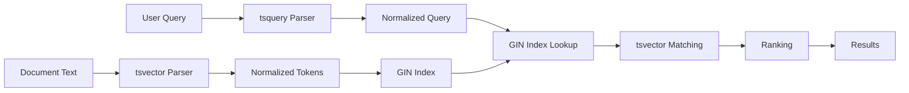
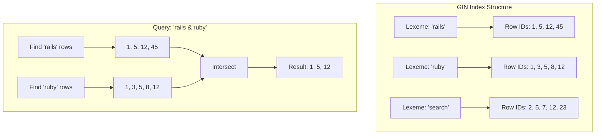
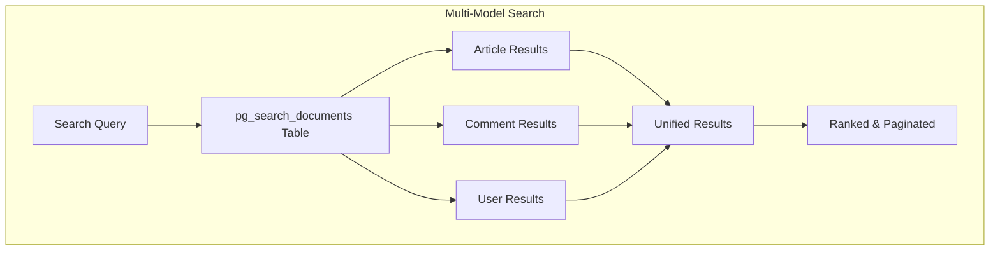
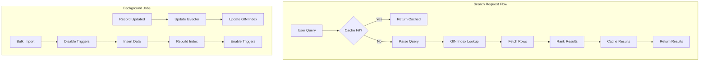

# How to Use Rails with PostgreSQL Full-Text Search

By [Nawaz Dhandala](https://github.com/nawazdhandala)

Tags: Rails, PostgreSQL, Full-Text Search, Ruby, Database, pg_search, Performance, Backend Development

Description: A comprehensive guide to implementing PostgreSQL full-text search in Rails applications using pg_search gem, tsvector, tsquery, GIN indexes, ranking, highlighting, and multi-table search.

---

> "The key to making search feel fast is not just returning the right results - it's returning them in the right order, instantly." - Unknown

Full-text search is a fundamental feature for any application that handles significant amounts of text data. While external search engines like Elasticsearch are powerful, PostgreSQL's built-in full-text search capabilities are often sufficient and eliminate the operational complexity of managing a separate search service. Combined with Rails and the pg_search gem, you can build robust search functionality without leaving your familiar stack.

## Understanding PostgreSQL Full-Text Search

PostgreSQL full-text search works by converting text into a normalized form called a `tsvector` (text search vector), and queries into a `tsquery` (text search query). The search then matches these vectors efficiently using specialized indexes.



### tsvector and tsquery Basics

Before diving into Rails integration, let's understand the core PostgreSQL concepts.

```sql
-- A tsvector is a sorted list of normalized lexemes (words)
SELECT to_tsvector('english', 'The quick brown foxes jumped over the lazy dogs');
-- Returns: 'brown':3 'dog':9 'fox':4 'jump':5 'lazi':8 'quick':2

-- A tsquery is a search query with operators
SELECT to_tsquery('english', 'quick & brown');
-- Returns: 'quick' & 'brown'

-- The @@ operator performs the match
SELECT to_tsvector('english', 'The quick brown fox') @@ to_tsquery('english', 'quick & brown');
-- Returns: true

-- Phrase search with <-> (followed by) operator
SELECT to_tsquery('english', 'quick <-> brown');
-- Returns: 'quick' <-> 'brown'

-- OR and NOT operators
SELECT to_tsquery('english', 'quick | slow');  -- OR
SELECT to_tsquery('english', 'quick & !slow'); -- NOT
```

## Setting Up pg_search

The pg_search gem provides a simple interface to PostgreSQL's full-text search from Rails.

### Installation

```ruby
# Gemfile
gem 'pg_search'
```

```bash
# Install the gem
bundle install
```

### Basic Model Setup

```ruby
# app/models/article.rb
class Article < ApplicationRecord
  # Include pg_search module for search functionality
  include PgSearch::Model

  # Define a search scope that searches across title and body
  # This creates a class method 'search_content' that returns an ActiveRecord relation
  pg_search_scope :search_content,
    against: {
      title: 'A',  # Weight 'A' is highest priority (1.0)
      body: 'B'    # Weight 'B' is second priority (0.4)
    },
    using: {
      tsearch: {
        dictionary: 'english',     # Use English stemming (run -> runs, running)
        prefix: true,              # Enable prefix matching (allow partial words)
        negation: true,            # Enable NOT operator (exclude terms)
        any_word: false,           # Require all words to match (AND behavior)
        normalization: 2           # Normalize by document length
      }
    }
end
```

### Migration for Search Column

For optimal performance, store a pre-computed `tsvector` column in your table.

```ruby
# db/migrate/20260127000001_add_search_vector_to_articles.rb
class AddSearchVectorToArticles < ActiveRecord::Migration[7.1]
  def up
    # Add a tsvector column to store the search vector
    add_column :articles, :search_vector, :tsvector

    # Create a GIN (Generalized Inverted Index) for fast full-text search
    # GIN indexes are optimized for composite values like arrays and tsvectors
    add_index :articles, :search_vector, using: :gin

    # Populate existing records with search vectors
    # setweight() assigns importance: A (1.0), B (0.4), C (0.2), D (0.1)
    execute <<-SQL
      UPDATE articles
      SET search_vector =
        setweight(to_tsvector('english', coalesce(title, '')), 'A') ||
        setweight(to_tsvector('english', coalesce(body, '')), 'B');
    SQL

    # Create a trigger function to automatically update the search vector
    execute <<-SQL
      CREATE OR REPLACE FUNCTION articles_search_vector_update() RETURNS trigger AS $$
      BEGIN
        NEW.search_vector :=
          setweight(to_tsvector('english', coalesce(NEW.title, '')), 'A') ||
          setweight(to_tsvector('english', coalesce(NEW.body, '')), 'B');
        RETURN NEW;
      END
      $$ LANGUAGE plpgsql;
    SQL

    # Attach the trigger to fire on INSERT or UPDATE
    execute <<-SQL
      CREATE TRIGGER articles_search_vector_trigger
        BEFORE INSERT OR UPDATE ON articles
        FOR EACH ROW EXECUTE FUNCTION articles_search_vector_update();
    SQL
  end

  def down
    execute "DROP TRIGGER IF EXISTS articles_search_vector_trigger ON articles;"
    execute "DROP FUNCTION IF EXISTS articles_search_vector_update();"
    remove_index :articles, :search_vector
    remove_column :articles, :search_vector
  end
end
```

### Using the Stored Vector Column

```ruby
# app/models/article.rb
class Article < ApplicationRecord
  include PgSearch::Model

  # Use the pre-computed tsvector column for better performance
  pg_search_scope :search_content,
    against: [:title, :body],
    using: {
      tsearch: {
        dictionary: 'english',
        prefix: true,
        # Use the stored tsvector column instead of computing on-the-fly
        tsvector_column: 'search_vector'
      }
    }
end
```

## GIN Indexes Deep Dive

GIN (Generalized Inverted Index) indexes are crucial for full-text search performance. They work by creating an inverted index mapping each lexeme to the rows containing it.



### Index Creation Options

```ruby
# db/migrate/20260127000002_add_gin_indexes.rb
class AddGinIndexes < ActiveRecord::Migration[7.1]
  def change
    # Standard GIN index on tsvector column
    add_index :articles, :search_vector, using: :gin

    # GIN index with fastupdate disabled for faster reads (slower writes)
    # Use this for read-heavy workloads
    add_index :articles, :search_vector,
      using: :gin,
      name: 'idx_articles_search_fast_read'

    execute <<-SQL
      ALTER INDEX idx_articles_search_fast_read SET (fastupdate = off);
    SQL

    # GIN index on expression (no stored column needed, but slower)
    execute <<-SQL
      CREATE INDEX idx_articles_search_expr ON articles
      USING gin(to_tsvector('english', coalesce(title, '') || ' ' || coalesce(body, '')));
    SQL
  end
end
```

### Monitoring Index Performance

```ruby
# Check index size and usage
class SearchDiagnostics
  def self.index_stats
    # Query PostgreSQL statistics for the GIN index
    sql = <<-SQL
      SELECT
        indexrelname AS index_name,
        pg_size_pretty(pg_relation_size(indexrelid)) AS index_size,
        idx_scan AS index_scans,
        idx_tup_read AS tuples_read,
        idx_tup_fetch AS tuples_fetched
      FROM pg_stat_user_indexes
      WHERE indexrelname LIKE '%search%';
    SQL

    ActiveRecord::Base.connection.execute(sql).to_a
  end

  def self.query_plan(query)
    # Use EXPLAIN ANALYZE to see how PostgreSQL executes the search
    Article.search_content(query).explain
  end
end
```

## Ranking and Relevance

PostgreSQL provides two ranking functions: `ts_rank` and `ts_rank_cd`. The gem uses these automatically, but understanding them helps with tuning.

```ruby
# app/models/article.rb
class Article < ApplicationRecord
  include PgSearch::Model

  # Search with custom ranking configuration
  pg_search_scope :search_ranked,
    against: {
      title: 'A',
      summary: 'B',
      body: 'C',
      tags: 'D'
    },
    using: {
      tsearch: {
        dictionary: 'english',
        prefix: true,
        # Normalization options (can be combined with |):
        # 0 = ignore document length
        # 1 = divide by 1 + log(document length)
        # 2 = divide by document length
        # 4 = divide by mean harmonic distance between extents
        # 8 = divide by number of unique words
        # 16 = divide by 1 + log(unique words)
        # 32 = divide by itself + 1
        normalization: 2 | 4  # Normalize by length and harmonic distance
      }
    },
    # Rank results by relevance
    ranked_by: ':tsearch'
end
```

### Custom Ranking with Raw SQL

```ruby
# app/models/article.rb
class Article < ApplicationRecord
  include PgSearch::Model

  # Custom ranking that boosts recent articles
  pg_search_scope :search_with_recency,
    against: [:title, :body],
    using: {
      tsearch: {
        dictionary: 'english',
        tsvector_column: 'search_vector'
      }
    },
    # Custom ranking formula: combine text relevance with recency
    # ts_rank returns 0-1, we multiply by recency factor
    ranked_by: <<-SQL
      (ts_rank(search_vector, plainto_tsquery('english', :query)) *
       (1.0 / (1 + EXTRACT(days FROM (NOW() - created_at)) / 30.0)))
    SQL

  # Scope that includes the rank in results for display
  def self.search_with_scores(query)
    select(
      'articles.*',
      "ts_rank(search_vector, plainto_tsquery('english', #{connection.quote(query)})) AS search_rank"
    )
    .search_with_recency(query)
  end
end

# Usage in controller
class ArticlesController < ApplicationController
  def search
    @articles = Article.search_with_scores(params[:q])

    # Access rank in view: article.search_rank
  end
end
```

## Search Result Highlighting

Highlighting shows users where their search terms appear in the results.

```ruby
# app/models/article.rb
class Article < ApplicationRecord
  include PgSearch::Model

  pg_search_scope :search_content,
    against: [:title, :body],
    using: {
      tsearch: {
        dictionary: 'english',
        prefix: true,
        tsvector_column: 'search_vector',
        # Enable highlighting
        highlight: {
          start_sel: '<mark>',      # HTML tag to wrap matches
          stop_sel: '</mark>',
          max_words: 35,            # Max words in snippet
          min_words: 15,            # Min words in snippet
          short_word: 3,            # Words shorter than this are always included
          max_fragments: 3          # Number of fragments to return
        }
      }
    }

  # Method to get highlighted snippets
  def self.search_with_highlights(query)
    select(
      'articles.*',
      sanitize_sql([
        "ts_headline('english', body, plainto_tsquery('english', ?), " \
        "'StartSel=<mark>, StopSel=</mark>, MaxWords=35, MinWords=15') AS body_highlighted",
        query
      ])
    )
    .search_content(query)
  end
end

# Usage
results = Article.search_with_highlights('rails search')
results.each do |article|
  puts article.body_highlighted  # Contains <mark>rails</mark> and <mark>search</mark>
end
```

### Highlighting in Views

```erb
<%# app/views/articles/_search_result.html.erb %>
<article class="search-result">
  <h2><%= link_to article.title, article %></h2>

  <%# Use raw/html_safe since we control the highlight tags %>
  <p class="snippet"><%= raw article.body_highlighted %></p>

  <footer>
    <span class="relevance">Relevance: <%= (article.search_rank * 100).round %>%</span>
    <time><%= article.created_at.strftime('%B %d, %Y') %></time>
  </footer>
</article>

<style>
  .search-result mark {
    background-color: #fff3cd;
    padding: 0.1em 0.2em;
    border-radius: 2px;
  }
</style>
```

## Multi-Table Search

One of pg_search's most powerful features is searching across multiple models.



### Setting Up Multi-Table Search

```ruby
# db/migrate/20260127000003_create_pg_search_documents.rb
class CreatePgSearchDocuments < ActiveRecord::Migration[7.1]
  def self.up
    # pg_search uses this polymorphic table to store searchable content
    create_table :pg_search_documents do |t|
      t.text :content           # The searchable text content
      t.belongs_to :searchable, polymorphic: true, index: true
      t.timestamps null: false
    end

    # Add tsvector column and index for performance
    add_column :pg_search_documents, :search_vector, :tsvector
    add_index :pg_search_documents, :search_vector, using: :gin

    # Trigger to auto-update search_vector
    execute <<-SQL
      CREATE TRIGGER pg_search_documents_vector_trigger
        BEFORE INSERT OR UPDATE ON pg_search_documents
        FOR EACH ROW EXECUTE FUNCTION
          tsvector_update_trigger(search_vector, 'pg_catalog.english', content);
    SQL
  end

  def self.down
    execute "DROP TRIGGER IF EXISTS pg_search_documents_vector_trigger ON pg_search_documents;"
    drop_table :pg_search_documents
  end
end
```

### Making Models Searchable

```ruby
# app/models/article.rb
class Article < ApplicationRecord
  include PgSearch::Model

  # Single-model search
  pg_search_scope :search, against: [:title, :body]

  # Multi-model search: add this model to the global search
  multisearchable against: [:title, :body],
    # Only index published articles
    if: :published?,
    # Additional attributes to store for filtering
    additional_attributes: -> (article) {
      {
        # Store author_id for filtering results by author
        author_id: article.author_id
      }
    }

  # Callbacks to keep search index updated
  after_save :update_pg_search_document, if: :published?
  after_destroy :remove_from_pg_search

  private

  def remove_from_pg_search
    PgSearch::Document.where(searchable: self).destroy_all
  end
end

# app/models/comment.rb
class Comment < ApplicationRecord
  include PgSearch::Model

  belongs_to :article
  belongs_to :author, class_name: 'User'

  multisearchable against: [:body],
    if: :approved?,
    additional_attributes: -> (comment) {
      {
        article_id: comment.article_id,
        author_id: comment.author_id
      }
    }
end

# app/models/user.rb
class User < ApplicationRecord
  include PgSearch::Model

  multisearchable against: [:name, :bio],
    if: :profile_public?
end
```

### Performing Multi-Table Search

```ruby
# app/services/global_search_service.rb
class GlobalSearchService
  # Search across all models with pagination and filtering
  def self.search(query, options = {})
    scope = PgSearch.multisearch(query)

    # Filter by specific model types
    if options[:types].present?
      scope = scope.where(searchable_type: options[:types])
    end

    # Filter by date range
    if options[:since].present?
      scope = scope.where('pg_search_documents.created_at > ?', options[:since])
    end

    # Eager load the actual records to avoid N+1 queries
    scope = scope.includes(:searchable)

    # Paginate
    if options[:page].present?
      scope = scope.page(options[:page]).per(options[:per_page] || 20)
    end

    scope
  end

  # Rebuild the entire search index
  def self.rebuild_index!
    # Clear existing documents
    PgSearch::Document.delete_all

    # Rebuild for each searchable model
    [Article, Comment, User].each do |model|
      model.find_each do |record|
        # Only index if the record passes the multisearchable conditions
        if record.respond_to?(:should_multisearch?) && record.should_multisearch?
          record.update_pg_search_document
        end
      end
    end
  end
end

# Usage in controller
class SearchController < ApplicationController
  def index
    @results = GlobalSearchService.search(
      params[:q],
      types: params[:types],       # e.g., ['Article', 'Comment']
      since: params[:since],       # e.g., 1.week.ago
      page: params[:page],
      per_page: 25
    )
  end
end
```

### Search Results View

```erb
<%# app/views/search/index.html.erb %>
<h1>Search Results for "<%= params[:q] %>"</h1>

<%= form_tag search_path, method: :get, class: 'search-filters' do %>
  <%= text_field_tag :q, params[:q], placeholder: 'Search...' %>

  <fieldset>
    <legend>Filter by type:</legend>
    <%= check_box_tag 'types[]', 'Article', params[:types]&.include?('Article') %>
    <%= label_tag 'types_Article', 'Articles' %>
    <%= check_box_tag 'types[]', 'Comment', params[:types]&.include?('Comment') %>
    <%= label_tag 'types_Comment', 'Comments' %>
    <%= check_box_tag 'types[]', 'User', params[:types]&.include?('User') %>
    <%= label_tag 'types_User', 'Users' %>
  </fieldset>

  <%= submit_tag 'Search' %>
<% end %>

<div class="results">
  <% @results.each do |document| %>
    <% searchable = document.searchable %>
    <div class="result result--<%= searchable.class.name.downcase %>">
      <% case searchable %>
      <% when Article %>
        <h3><%= link_to searchable.title, searchable %></h3>
        <p><%= truncate(searchable.body, length: 200) %></p>
      <% when Comment %>
        <h3>Comment on <%= link_to searchable.article.title, searchable.article %></h3>
        <p><%= truncate(searchable.body, length: 200) %></p>
      <% when User %>
        <h3><%= link_to searchable.name, searchable %></h3>
        <p><%= truncate(searchable.bio, length: 200) %></p>
      <% end %>
    </div>
  <% end %>
</div>

<%= paginate @results %>
```

## Advanced Search Features

### Trigram Similarity Search

For fuzzy matching and typo tolerance, combine full-text search with trigram similarity.

```ruby
# Enable pg_trgm extension
# db/migrate/20260127000004_enable_pg_trgm.rb
class EnablePgTrgm < ActiveRecord::Migration[7.1]
  def up
    enable_extension 'pg_trgm'

    # Add GIN trigram index for fuzzy search
    execute <<-SQL
      CREATE INDEX idx_articles_title_trgm ON articles
      USING gin(title gin_trgm_ops);
    SQL
  end

  def down
    execute "DROP INDEX IF EXISTS idx_articles_title_trgm;"
    disable_extension 'pg_trgm'
  end
end
```

```ruby
# app/models/article.rb
class Article < ApplicationRecord
  include PgSearch::Model

  # Combine full-text search with trigram similarity
  pg_search_scope :search_fuzzy,
    against: [:title, :body],
    using: {
      # Full-text search for semantic matching
      tsearch: {
        dictionary: 'english',
        prefix: true,
        tsvector_column: 'search_vector'
      },
      # Trigram similarity for typo tolerance
      trigram: {
        threshold: 0.3,           # Minimum similarity (0-1)
        word_similarity: true     # Compare words individually
      }
    },
    # Rank combines both scores
    ranked_by: ':tsearch + (0.5 * :trigram)'

  # Search with autocomplete suggestions
  pg_search_scope :autocomplete,
    against: :title,
    using: {
      trigram: {
        threshold: 0.1,
        word_similarity: true
      }
    }
end

# Usage
Article.search_fuzzy('raills postgrsql')  # Finds "rails postgresql" despite typos
Article.autocomplete('prog')               # Suggests titles containing "programming"
```

### Search Suggestions

```ruby
# app/services/search_suggestions_service.rb
class SearchSuggestionsService
  # Get autocomplete suggestions based on previous searches or content
  def self.suggest(partial_query, limit: 5)
    return [] if partial_query.blank? || partial_query.length < 2

    # Get title suggestions using trigram similarity
    Article
      .select(:title)
      .where("title % ?", partial_query)  # % is trigram similarity operator
      .order(Arel.sql("title <-> #{Article.connection.quote(partial_query)}"))  # Order by distance
      .limit(limit)
      .pluck(:title)
  end

  # "Did you mean?" suggestions for no-result searches
  def self.did_you_mean(query)
    # Find the most similar existing term
    sql = <<-SQL
      SELECT DISTINCT word
      FROM ts_stat('SELECT search_vector FROM articles')
      WHERE word % ?
      ORDER BY word <-> ?
      LIMIT 3
    SQL

    ActiveRecord::Base.connection.execute(
      ActiveRecord::Base.sanitize_sql([sql, query, query])
    ).map { |row| row['word'] }
  end
end
```

## Performance Optimization

### Search Performance Architecture



### Query Optimization

```ruby
# app/models/concerns/optimized_search.rb
module OptimizedSearch
  extend ActiveSupport::Concern

  class_methods do
    # Search with connection pooling awareness
    def optimized_search(query, options = {})
      # Use read replica for search queries if available
      connection = options[:use_replica] ? ReplicaConnection : ActiveRecord::Base

      connection.connection_pool.with_connection do
        # Set statement timeout to prevent long-running searches
        execute_with_timeout(5.seconds) do
          search_content(query)
            .limit(options[:limit] || 100)
            .select(select_columns(options))
        end
      end
    end

    private

    def execute_with_timeout(timeout)
      ActiveRecord::Base.connection.execute("SET statement_timeout = #{timeout.in_milliseconds}")
      yield
    ensure
      ActiveRecord::Base.connection.execute("SET statement_timeout = 0")
    end

    def select_columns(options)
      columns = ['id', 'title', 'created_at']
      columns << 'body' if options[:include_body]
      columns.join(', ')
    end
  end
end
```

### Caching Search Results

```ruby
# app/services/cached_search_service.rb
class CachedSearchService
  CACHE_TTL = 5.minutes

  def self.search(query, options = {})
    cache_key = build_cache_key(query, options)

    Rails.cache.fetch(cache_key, expires_in: CACHE_TTL) do
      # Perform the actual search
      results = Article.search_content(query)
        .limit(options[:limit] || 50)
        .to_a

      # Return serializable data
      {
        query: query,
        total: results.size,
        results: results.map { |a| serialize_result(a) }
      }
    end
  end

  def self.invalidate_for(article)
    # Clear caches that might contain this article
    # In production, use a more sophisticated invalidation strategy
    Rails.cache.delete_matched("search:*")
  end

  private

  def self.build_cache_key(query, options)
    normalized_query = query.downcase.strip.gsub(/\s+/, ' ')
    "search:#{Digest::MD5.hexdigest(normalized_query)}:#{options.hash}"
  end

  def self.serialize_result(article)
    {
      id: article.id,
      title: article.title,
      excerpt: article.body.truncate(200),
      url: Rails.application.routes.url_helpers.article_path(article)
    }
  end
end
```

### Bulk Indexing

```ruby
# lib/tasks/search.rake
namespace :search do
  desc "Rebuild search vectors for all articles"
  task rebuild: :environment do
    puts "Rebuilding search vectors..."

    # Disable triggers during bulk update for performance
    ActiveRecord::Base.connection.execute(
      "ALTER TABLE articles DISABLE TRIGGER articles_search_vector_trigger;"
    )

    # Process in batches to manage memory
    Article.find_in_batches(batch_size: 1000) do |batch|
      # Use raw SQL for maximum performance
      values = batch.map do |article|
        title_vector = ActiveRecord::Base.connection.quote(
          "setweight(to_tsvector('english', #{ActiveRecord::Base.connection.quote(article.title || '')}), 'A')"
        )
        body_vector = ActiveRecord::Base.connection.quote(
          "setweight(to_tsvector('english', #{ActiveRecord::Base.connection.quote(article.body || '')}), 'B')"
        )

        "(#{article.id}, #{title_vector} || #{body_vector})"
      end

      # Bulk update using UNNEST for efficiency
      ActiveRecord::Base.connection.execute(<<-SQL)
        UPDATE articles
        SET search_vector = data.vector
        FROM (
          SELECT * FROM UNNEST(
            ARRAY[#{batch.map(&:id).join(',')}],
            ARRAY[#{batch.map { |a|
              "setweight(to_tsvector('english', #{ActiveRecord::Base.connection.quote(a.title || '')}), 'A') || " \
              "setweight(to_tsvector('english', #{ActiveRecord::Base.connection.quote(a.body || '')}), 'B')"
            }.join(',')}]
          ) AS data(id, vector)
        ) AS data
        WHERE articles.id = data.id;
      SQL

      print "."
    end

    # Re-enable triggers
    ActiveRecord::Base.connection.execute(
      "ALTER TABLE articles ENABLE TRIGGER articles_search_vector_trigger;"
    )

    # Reindex for optimal query performance
    ActiveRecord::Base.connection.execute("REINDEX INDEX idx_articles_search_vector;")

    puts "\nDone!"
  end

  desc "Analyze search index statistics"
  task stats: :environment do
    stats = ActiveRecord::Base.connection.execute(<<-SQL).first
      SELECT
        COUNT(*) as total_documents,
        pg_size_pretty(pg_relation_size('articles')) as table_size,
        pg_size_pretty(pg_relation_size('idx_articles_search_vector')) as index_size,
        (SELECT COUNT(DISTINCT word) FROM ts_stat('SELECT search_vector FROM articles')) as unique_terms
      FROM articles;
    SQL

    puts "Search Index Statistics:"
    puts "  Total documents: #{stats['total_documents']}"
    puts "  Table size: #{stats['table_size']}"
    puts "  Index size: #{stats['index_size']}"
    puts "  Unique terms: #{stats['unique_terms']}"
  end
end
```

## Monitoring Search Performance

For production applications, monitoring search performance is critical. Track query latency, error rates, and result quality.

```ruby
# app/services/search_metrics_service.rb
class SearchMetricsService
  def self.track_search(query:, duration_ms:, result_count:, user_id: nil)
    # Log for analysis
    Rails.logger.info({
      event: 'search',
      query: query,
      duration_ms: duration_ms,
      result_count: result_count,
      user_id: user_id,
      timestamp: Time.current.iso8601
    }.to_json)

    # Track metrics (integrate with your monitoring solution)
    # StatsD.timing('search.duration', duration_ms)
    # StatsD.histogram('search.results', result_count)
  end

  def self.track_search_click(query:, result_id:, position:, user_id: nil)
    Rails.logger.info({
      event: 'search_click',
      query: query,
      result_id: result_id,
      position: position,
      user_id: user_id,
      timestamp: Time.current.iso8601
    }.to_json)
  end
end
```

For comprehensive application monitoring including search performance, database query latency, and error tracking, consider using [OneUptime](https://oneuptime.com). It provides real-time observability into your Rails application's performance and can alert you when search queries slow down or fail.

## Summary

| Feature | Implementation |
|---------|---------------|
| **Basic Search** | pg_search_scope with tsearch |
| **Stored Vectors** | tsvector column with trigger |
| **Fast Lookups** | GIN index on tsvector |
| **Weighted Fields** | setweight() with A/B/C/D priorities |
| **Ranking** | ts_rank with normalization |
| **Highlighting** | ts_headline for snippets |
| **Multi-Model** | multisearchable with pg_search_documents |
| **Fuzzy Search** | pg_trgm extension with trigram |
| **Performance** | Caching, bulk indexing, timeouts |

PostgreSQL full-text search provides a powerful, integrated solution for search functionality in Rails applications. Combined with the pg_search gem, you get a clean Ruby interface to sophisticated search capabilities without the operational overhead of external search services. For most applications, this approach offers the right balance of features, performance, and simplicity.
