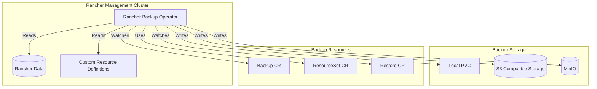
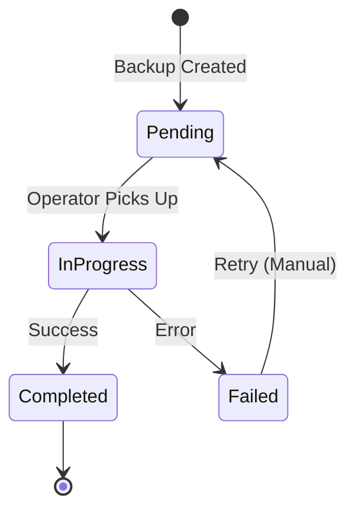
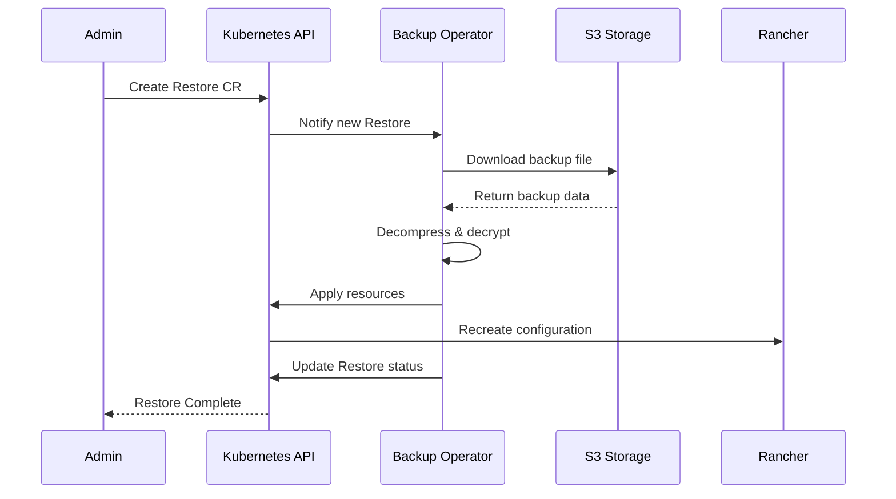
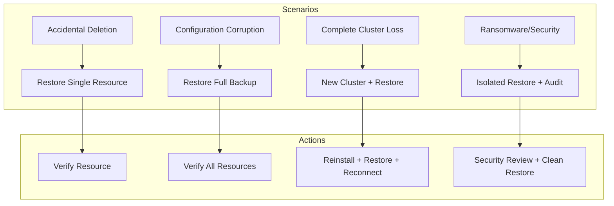

# How to Configure Rancher Backup

By [Nawaz Dhandala](https://github.com/nawazdhandala)

Tags: Rancher, Kubernetes, Backup, Disaster Recovery, S3, DevOps, High Availability

Description: A comprehensive guide to configuring Rancher Backup for protecting your Kubernetes cluster management data, including scheduled backups, S3 storage integration, and disaster recovery procedures.

---

> "Backups are like insurance - you hope you never need them, but when disaster strikes, they're the difference between a minor inconvenience and a catastrophic loss."

Rancher is a powerful multi-cluster Kubernetes management platform that stores critical configuration data - cluster definitions, user permissions, catalogs, and settings. Losing this data means manually recreating your entire management infrastructure. The Rancher Backup Operator provides a native solution for protecting this data with scheduled backups and seamless restore capabilities.

## Understanding Rancher Backup Architecture

Before diving into configuration, let's understand how Rancher Backup works.



The Rancher Backup Operator works by:

1. **Watching** for Backup and Restore custom resources
2. **Collecting** Rancher resources defined in ResourceSets
3. **Compressing** and optionally encrypting the data
4. **Storing** backups to local storage or S3-compatible object storage
5. **Restoring** from backups when needed

## Installing the Rancher Backup Operator

The backup operator is installed via Helm chart from the Rancher charts repository.

### Prerequisites

Before installation, ensure you have:

```bash
# Verify Rancher is running (should return Rancher pods)
kubectl get pods -n cattle-system

# Verify Helm is installed
helm version

# Add the Rancher charts repository
helm repo add rancher-charts https://charts.rancher.io
helm repo update
```

### Install the Operator

```bash
# Create the namespace for backup operator
kubectl create namespace cattle-resources-system

# Install the backup operator chart
# The operator handles backup/restore operations
helm install rancher-backup-crd rancher-charts/rancher-backup-crd \
  -n cattle-resources-system

# Install the operator itself
helm install rancher-backup rancher-charts/rancher-backup \
  -n cattle-resources-system \
  --set persistence.enabled=true \
  --set persistence.size=10Gi
```

### Verify Installation

```bash
# Check that the operator pod is running
kubectl get pods -n cattle-resources-system

# Expected output:
# NAME                              READY   STATUS    RESTARTS   AGE
# rancher-backup-5f4b8c9d6f-xxxxx   1/1     Running   0          2m

# Verify CRDs are installed
kubectl get crd | grep backup

# Expected output:
# backups.resources.cattle.io
# resourcesets.resources.cattle.io
# restores.resources.cattle.io
```

## Configuring Backup Storage

The backup operator supports multiple storage backends. Choose based on your infrastructure and disaster recovery requirements.

### Option 1: Local Persistent Volume

For development or small deployments, local storage works but offers no off-cluster protection.

```yaml
# local-backup.yaml
# Creates a backup stored on the local PersistentVolumeClaim
# WARNING: Not recommended for production - no off-cluster protection
apiVersion: resources.cattle.io/v1
kind: Backup
metadata:
  name: rancher-backup-local
spec:
  # Store backup in the default PVC created during operator installation
  storageLocation:
    s3: null
  # ResourceSet defines what to backup (default includes all Rancher resources)
  resourceSetName: rancher-resource-set
  # Retention policy - keep backups for 7 days
  retentionCount: 7
```

### Option 2: S3-Compatible Storage (Recommended)

For production environments, always use off-cluster storage. This configuration works with AWS S3, MinIO, or any S3-compatible storage.

```yaml
# s3-secret.yaml
# Stores AWS credentials for S3 access
# IMPORTANT: Use IAM roles in production when possible
apiVersion: v1
kind: Secret
metadata:
  name: s3-credentials
  namespace: cattle-resources-system
type: Opaque
stringData:
  # AWS access key with S3 read/write permissions
  accessKey: "YOUR_AWS_ACCESS_KEY"
  # AWS secret key - rotate regularly
  secretKey: "YOUR_AWS_SECRET_KEY"
```

```bash
# Apply the secret
kubectl apply -f s3-secret.yaml
```

```yaml
# s3-backup.yaml
# Creates a backup stored in AWS S3
# Provides off-cluster protection for disaster recovery
apiVersion: resources.cattle.io/v1
kind: Backup
metadata:
  name: rancher-backup-s3
spec:
  storageLocation:
    s3:
      # S3 bucket name - must exist before backup
      bucketName: my-rancher-backups
      # Folder path within the bucket
      folder: rancher
      # AWS region where bucket is located
      region: us-east-1
      # S3 endpoint - leave empty for AWS, set for MinIO/other
      endpoint: ""
      # Reference to the credentials secret
      credentialSecretName: s3-credentials
      credentialSecretNamespace: cattle-resources-system
  # Include all Rancher resources in backup
  resourceSetName: rancher-resource-set
  # Keep the last 30 backups
  retentionCount: 30
```

### Option 3: MinIO (Self-Hosted S3)

For air-gapped environments or when you prefer self-hosted storage.

```yaml
# minio-backup.yaml
# Creates a backup stored in self-hosted MinIO
# Ideal for air-gapped or on-premises environments
apiVersion: resources.cattle.io/v1
kind: Backup
metadata:
  name: rancher-backup-minio
spec:
  storageLocation:
    s3:
      bucketName: rancher-backups
      folder: production
      # MinIO typically doesn't use regions, but field is required
      region: us-east-1
      # MinIO service endpoint - use internal Kubernetes DNS
      endpoint: "minio.minio-system.svc.cluster.local:9000"
      # MinIO may use self-signed certs
      insecureTLSSkipVerify: true
      credentialSecretName: minio-credentials
      credentialSecretNamespace: cattle-resources-system
  resourceSetName: rancher-resource-set
  retentionCount: 30
```

## Creating Scheduled Backups

One-time backups are useful, but automated scheduled backups ensure consistent protection.

### Daily Backup Schedule

```yaml
# scheduled-backup-daily.yaml
# Runs a backup every day at 2:00 AM UTC
# Recommended for most production environments
apiVersion: resources.cattle.io/v1
kind: Backup
metadata:
  name: rancher-daily-backup
spec:
  storageLocation:
    s3:
      bucketName: my-rancher-backups
      folder: daily
      region: us-east-1
      credentialSecretName: s3-credentials
      credentialSecretNamespace: cattle-resources-system
  resourceSetName: rancher-resource-set
  # Cron schedule: minute hour day month weekday
  # This runs at 02:00 UTC every day
  schedule: "0 2 * * *"
  # Keep 30 daily backups (approximately 1 month)
  retentionCount: 30
```

### Hourly Backup for Critical Environments

```yaml
# scheduled-backup-hourly.yaml
# Runs a backup every hour for environments with frequent changes
# Higher storage costs but lower RPO (Recovery Point Objective)
apiVersion: resources.cattle.io/v1
kind: Backup
metadata:
  name: rancher-hourly-backup
spec:
  storageLocation:
    s3:
      bucketName: my-rancher-backups
      folder: hourly
      region: us-east-1
      credentialSecretName: s3-credentials
      credentialSecretNamespace: cattle-resources-system
  resourceSetName: rancher-resource-set
  # Run every hour at minute 0
  schedule: "0 * * * *"
  # Keep 168 hourly backups (7 days worth)
  retentionCount: 168
```

### Weekly Backup for Long-Term Retention

```yaml
# scheduled-backup-weekly.yaml
# Runs a backup every Sunday at 3:00 AM UTC
# Useful for long-term archival and compliance
apiVersion: resources.cattle.io/v1
kind: Backup
metadata:
  name: rancher-weekly-backup
spec:
  storageLocation:
    s3:
      bucketName: my-rancher-backups
      folder: weekly
      region: us-east-1
      credentialSecretName: s3-credentials
      credentialSecretNamespace: cattle-resources-system
  resourceSetName: rancher-resource-set
  # Run at 03:00 UTC every Sunday (day 0)
  schedule: "0 3 * * 0"
  # Keep 52 weekly backups (1 year)
  retentionCount: 52
```

## Backup Encryption

For sensitive environments, encrypt backups at rest using an encryption configuration secret.

```yaml
# encryption-config.yaml
# Defines the encryption key for backup encryption
# CRITICAL: Store this key securely - losing it means losing access to backups
apiVersion: v1
kind: Secret
metadata:
  name: backup-encryption-config
  namespace: cattle-resources-system
type: Opaque
stringData:
  # EncryptionConfiguration follows Kubernetes encryption config format
  encryption-provider-config.yaml: |
    apiVersion: apiserver.config.k8s.io/v1
    kind: EncryptionConfiguration
    resources:
      - resources:
          - secrets
        providers:
          - aescbc:
              keys:
                # Generate with: head -c 32 /dev/urandom | base64
                - name: key1
                  secret: YOUR_BASE64_ENCODED_32_BYTE_KEY
          - identity: {}
```

```yaml
# encrypted-backup.yaml
# Creates an encrypted backup for sensitive environments
# Requires the encryption config secret to restore
apiVersion: resources.cattle.io/v1
kind: Backup
metadata:
  name: rancher-encrypted-backup
spec:
  storageLocation:
    s3:
      bucketName: my-rancher-backups
      folder: encrypted
      region: us-east-1
      credentialSecretName: s3-credentials
      credentialSecretNamespace: cattle-resources-system
  resourceSetName: rancher-resource-set
  # Reference to the encryption configuration secret
  encryptionConfigSecretName: backup-encryption-config
  schedule: "0 2 * * *"
  retentionCount: 30
```

## Monitoring Backup Status

After creating backups, monitor their status to ensure they complete successfully.

```bash
# List all backup resources
kubectl get backups.resources.cattle.io -A

# Check detailed status of a specific backup
kubectl describe backup rancher-daily-backup

# View backup operator logs for troubleshooting
kubectl logs -n cattle-resources-system -l app.kubernetes.io/name=rancher-backup -f

# List completed backup files (check S3 or local storage)
# For S3:
aws s3 ls s3://my-rancher-backups/daily/
```

### Backup Status Flow



## Restore Procedures

When disaster strikes, the restore process brings your Rancher installation back to a known good state.

### Pre-Restore Checklist

Before restoring, complete these steps:

1. **Identify the correct backup** - Choose the backup timestamp to restore
2. **Verify backup integrity** - Ensure the backup file is accessible
3. **Document current state** - Note any changes since the backup
4. **Plan for downtime** - Restore requires Rancher to be temporarily unavailable
5. **Have encryption key ready** - If backups are encrypted

### Restore from S3 Backup

```yaml
# restore.yaml
# Restores Rancher from a specific backup file
# WARNING: This will overwrite current Rancher configuration
apiVersion: resources.cattle.io/v1
kind: Restore
metadata:
  name: rancher-restore
spec:
  # Exact filename of the backup to restore
  # Find this by listing your S3 bucket
  backupFilename: rancher-daily-backup-2026-01-27T02-00-00Z.tar.gz
  storageLocation:
    s3:
      bucketName: my-rancher-backups
      folder: daily
      region: us-east-1
      credentialSecretName: s3-credentials
      credentialSecretNamespace: cattle-resources-system
  # If backup was encrypted, specify the encryption config
  # encryptionConfigSecretName: backup-encryption-config
  # Prune removes resources not in the backup (use with caution)
  prune: false
```

```bash
# Apply the restore resource
kubectl apply -f restore.yaml

# Monitor restore progress
kubectl get restores.resources.cattle.io -w

# Check restore status
kubectl describe restore rancher-restore
```

### Restore Workflow



### Post-Restore Verification

After restore completes, verify your Rancher installation:

```bash
# Check Rancher pods are healthy
kubectl get pods -n cattle-system

# Verify Rancher UI is accessible
kubectl get ingress -n cattle-system

# Check all downstream clusters are connected
kubectl get clusters.management.cattle.io

# Verify user authentication works
# (Login to Rancher UI with your credentials)

# Check catalog apps are present
kubectl get apps -A
```

## Disaster Recovery Strategy

A complete disaster recovery strategy combines backups with documented procedures.

### Recovery Scenarios



### Complete Cluster Recovery Procedure

If you lose the entire Rancher management cluster:

```bash
# 1. Provision new Kubernetes cluster for Rancher
# (Using your preferred method: RKE2, K3s, etc.)

# 2. Install Rancher on the new cluster
helm repo add rancher-latest https://releases.rancher.com/server-charts/latest
helm install rancher rancher-latest/rancher \
  --namespace cattle-system \
  --create-namespace \
  --set hostname=rancher.yourdomain.com \
  --set bootstrapPassword=admin

# 3. Install the backup operator
helm install rancher-backup-crd rancher-charts/rancher-backup-crd \
  -n cattle-resources-system --create-namespace
helm install rancher-backup rancher-charts/rancher-backup \
  -n cattle-resources-system

# 4. Create the S3 credentials secret
kubectl apply -f s3-secret.yaml

# 5. Create and apply the restore resource
kubectl apply -f restore.yaml

# 6. Wait for restore to complete
kubectl get restores.resources.cattle.io -w

# 7. Restart Rancher pods to pick up restored configuration
kubectl rollout restart deployment rancher -n cattle-system
```

## Best Practices

Follow these recommendations for reliable Rancher backups:

### Backup Strategy

1. **Use the 3-2-1 rule**: 3 copies of data, 2 different storage types, 1 off-site
2. **Test restores regularly**: Schedule quarterly restore drills
3. **Document procedures**: Keep runbooks updated and accessible
4. **Monitor backup jobs**: Alert on backup failures immediately
5. **Encrypt sensitive backups**: Always encrypt backups containing secrets

### Storage Recommendations

1. **Enable S3 versioning**: Protect against accidental deletion
2. **Configure lifecycle policies**: Automatically expire old backups
3. **Use separate backup bucket**: Isolate from application data
4. **Enable cross-region replication**: For critical environments
5. **Restrict bucket access**: Limit permissions to backup operator only

### Operational Guidelines

```yaml
# Example S3 bucket policy for backup security
# Apply via AWS Console or Terraform
{
  "Version": "2012-10-17",
  "Statement": [
    {
      "Sid": "DenyDeleteExceptLifecycle",
      "Effect": "Deny",
      "Principal": "*",
      "Action": [
        "s3:DeleteObject",
        "s3:DeleteObjectVersion"
      ],
      "Resource": "arn:aws:s3:::my-rancher-backups/*",
      "Condition": {
        "StringNotEquals": {
          "aws:PrincipalArn": "arn:aws:iam::ACCOUNT:role/S3LifecycleRole"
        }
      }
    }
  ]
}
```

## Monitoring Backups with OneUptime

Automated backups are only valuable if you know they are succeeding. Integrate backup monitoring with [OneUptime](https://oneuptime.com) to get alerted when backups fail.

### Create a Heartbeat Monitor

Set up a heartbeat monitor in OneUptime that expects a ping after each successful backup:

```yaml
# backup-with-heartbeat.yaml
# Backup that notifies OneUptime on completion
apiVersion: resources.cattle.io/v1
kind: Backup
metadata:
  name: rancher-monitored-backup
spec:
  storageLocation:
    s3:
      bucketName: my-rancher-backups
      folder: monitored
      region: us-east-1
      credentialSecretName: s3-credentials
      credentialSecretNamespace: cattle-resources-system
  resourceSetName: rancher-resource-set
  schedule: "0 2 * * *"
  retentionCount: 30
---
# CronJob to ping OneUptime after backup completes
apiVersion: batch/v1
kind: CronJob
metadata:
  name: backup-heartbeat
  namespace: cattle-resources-system
spec:
  # Run 30 minutes after backup starts (adjust based on backup duration)
  schedule: "30 2 * * *"
  jobTemplate:
    spec:
      template:
        spec:
          containers:
          - name: heartbeat
            image: curlimages/curl:latest
            command:
            - /bin/sh
            - -c
            - |
              # Check if backup completed successfully
              BACKUP_STATUS=$(kubectl get backup rancher-monitored-backup -o jsonpath='{.status.conditions[?(@.type=="Ready")].status}')
              if [ "$BACKUP_STATUS" = "True" ]; then
                # Ping OneUptime heartbeat endpoint
                curl -X GET "https://oneuptime.com/heartbeat/YOUR_HEARTBEAT_ID"
                echo "Heartbeat sent successfully"
              else
                echo "Backup not ready, skipping heartbeat"
                exit 1
              fi
          restartPolicy: OnFailure
```

OneUptime will alert you if the heartbeat is not received within the expected interval, indicating a backup failure. This proactive monitoring ensures you discover backup problems before you need to restore.

## Troubleshooting Common Issues

### Backup Fails with Permission Denied

```bash
# Check S3 credentials are correct
kubectl get secret s3-credentials -n cattle-resources-system -o yaml

# Verify IAM permissions include:
# - s3:PutObject
# - s3:GetObject
# - s3:ListBucket
# - s3:DeleteObject (for retention cleanup)

# Test S3 access from a debug pod
kubectl run s3-test --rm -it --image=amazon/aws-cli -- \
  s3 ls s3://my-rancher-backups/
```

### Backup Stuck in Pending State

```bash
# Check operator logs for errors
kubectl logs -n cattle-resources-system -l app.kubernetes.io/name=rancher-backup

# Verify operator has cluster-admin permissions
kubectl get clusterrolebinding | grep rancher-backup

# Restart the operator
kubectl rollout restart deployment rancher-backup -n cattle-resources-system
```

### Restore Fails with Resource Conflicts

```bash
# If restore fails due to existing resources, use prune option
# WARNING: This deletes resources not in the backup

# Or manually delete conflicting resources first
kubectl delete <resource-type> <resource-name>

# Then retry the restore
kubectl delete restore rancher-restore
kubectl apply -f restore.yaml
```

---

Rancher Backup is your safety net against cluster management disasters. Configure it once, test it regularly, and sleep soundly knowing your Rancher configuration is protected. Remember: the best backup strategy is one that you have tested restoring from. Schedule regular restore drills and keep your disaster recovery runbooks current.

For comprehensive infrastructure monitoring including backup job health, explore [OneUptime's observability platform](https://oneuptime.com) to ensure your critical systems stay protected.
