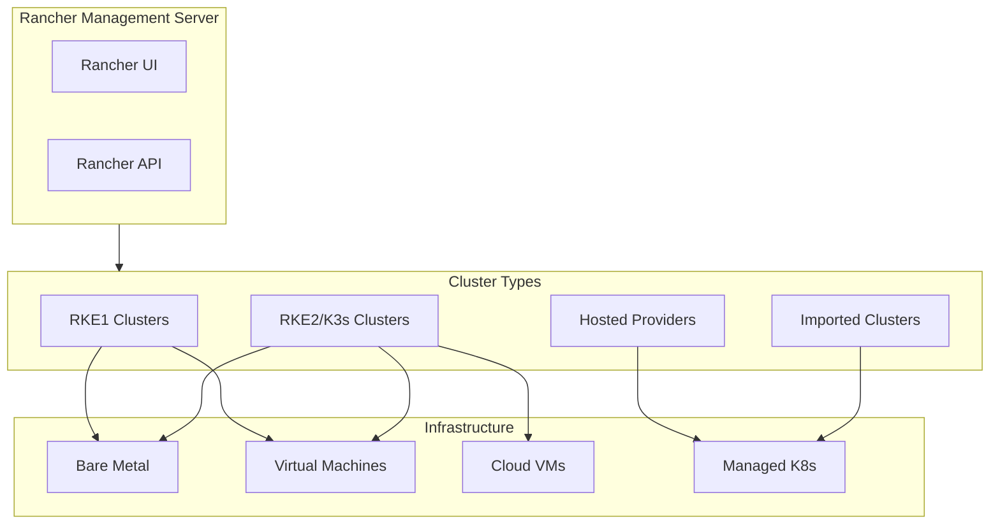
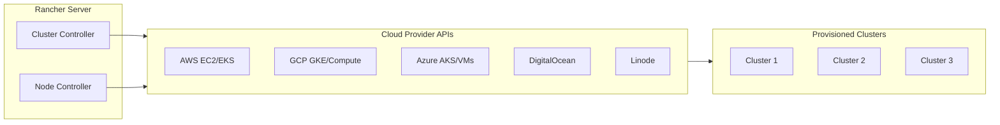
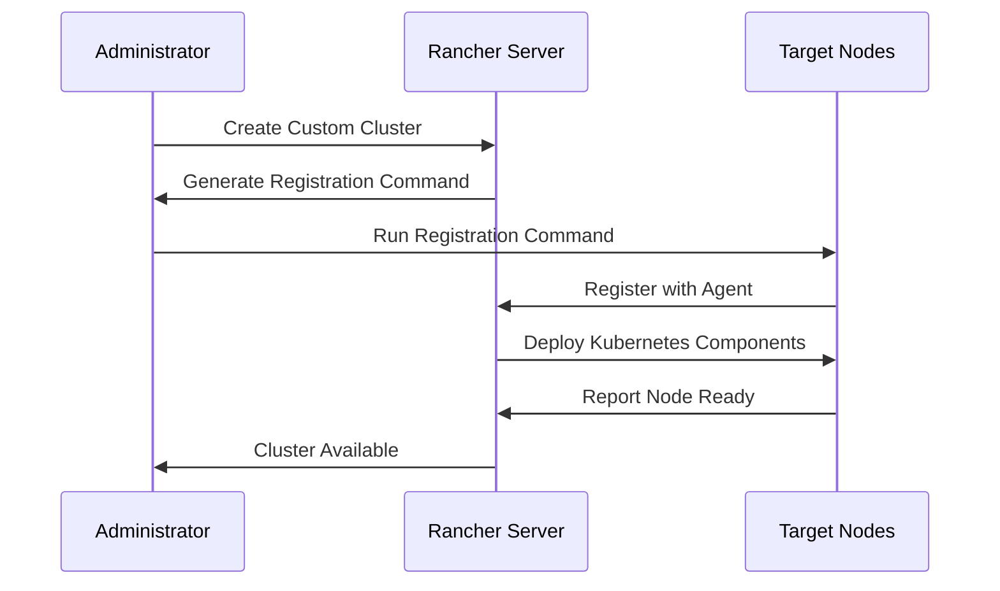
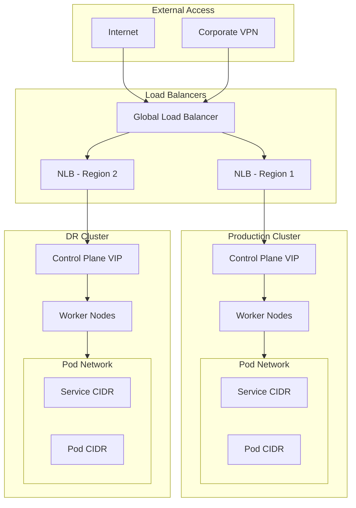

# How to Create Kubernetes Clusters with Rancher

By [Nawaz Dhandala](https://github.com/nawazdhandala)

Tags: Kubernetes, Rancher, RKE, Cloud Provider, Cluster Management, DevOps, Infrastructure, Container Orchestration

Description: A comprehensive guide to creating Kubernetes clusters with Rancher, covering RKE vs imported clusters, cloud provider integration, custom cluster creation, and cluster provisioning strategies.

---

> "The best infrastructure is the one that gets out of your way and lets you focus on building what matters."

Rancher has become one of the most popular multi-cluster Kubernetes management platforms. Whether you are deploying clusters on bare metal, cloud providers, or importing existing clusters, Rancher provides a unified interface to manage them all. This guide walks through the different approaches to creating and managing Kubernetes clusters with Rancher.

## Understanding Rancher Cluster Types

Before diving into cluster creation, it is important to understand the different cluster types Rancher supports.



### Cluster Type Comparison

| Feature | RKE1 | RKE2/K3s | Imported | Hosted Provider |
|---------|------|----------|----------|-----------------|
| Full lifecycle management | Yes | Yes | No | Partial |
| Custom node configuration | Yes | Yes | No | Limited |
| etcd backup/restore | Yes | Yes | No | Provider-dependent |
| Certificate rotation | Yes | Yes | No | Provider-dependent |
| Upgrade control | Full | Full | None | Limited |
| Best for | Production on-prem | Modern deployments | Existing clusters | Cloud-native teams |

## RKE vs RKE2: Choosing Your Distribution

RKE (Rancher Kubernetes Engine) comes in two versions. Understanding when to use each is critical for long-term success.

### RKE1: The Original

RKE1 is Docker-based and has been battle-tested for years.

```yaml
# rke-cluster.yml - RKE1 cluster configuration
# Defines a production-ready 3-node cluster with HA control plane

nodes:
  # Control plane node 1 - runs etcd, controlplane, and worker roles
  - address: 10.0.1.10
    user: ubuntu
    role: [controlplane, etcd, worker]
    ssh_key_path: ~/.ssh/id_rsa
    # Optionally specify Docker version
    docker_socket: /var/run/docker.sock

  # Control plane node 2 - provides HA for etcd and control plane
  - address: 10.0.1.11
    user: ubuntu
    role: [controlplane, etcd, worker]
    ssh_key_path: ~/.ssh/id_rsa

  # Control plane node 3 - third member for etcd quorum
  - address: 10.0.1.12
    user: ubuntu
    role: [controlplane, etcd, worker]
    ssh_key_path: ~/.ssh/id_rsa

# Kubernetes version to deploy
kubernetes_version: v1.28.4-rancher1-1

# Network plugin configuration - Calico for production workloads
network:
  plugin: calico
  options:
    # Use BGP for better performance in large clusters
    calico_cloud_provider: none

# Services configuration for API server, kubelet, etc.
services:
  etcd:
    # Enable automatic etcd snapshots for disaster recovery
    snapshot: true
    retention: "72h"
    creation: "12h"
    backup_config:
      enabled: true
      interval_hours: 12
      retention: 6

  kube-api:
    # Additional API server arguments
    extra_args:
      # Enable audit logging
      audit-log-path: /var/log/kube-audit/audit.log
      audit-log-maxage: "30"
      audit-log-maxbackup: "10"

  kubelet:
    extra_args:
      # Resource reservation for system components
      system-reserved: cpu=200m,memory=512Mi
      kube-reserved: cpu=200m,memory=512Mi
```

Deploy the cluster with RKE CLI:

```bash
# Validate the cluster configuration before deployment
# This checks for syntax errors and connectivity issues
rke config --validate --config rke-cluster.yml

# Deploy the Kubernetes cluster
# This process typically takes 10-15 minutes
rke up --config rke-cluster.yml

# The kubeconfig is generated automatically
export KUBECONFIG=$(pwd)/kube_config_rke-cluster.yml

# Verify cluster health
kubectl get nodes
kubectl get componentstatuses
```

### RKE2: The Security-Focused Successor

RKE2 (also known as RKE Government) uses containerd instead of Docker and includes additional security hardening.

```yaml
# rke2-config.yaml - RKE2 server configuration
# Place this at /etc/rancher/rke2/config.yaml on your server nodes

# Token for joining nodes to the cluster
# Generate with: openssl rand -hex 32
token: your-secure-cluster-token

# TLS SAN for API server certificate
# Include all hostnames and IPs that will access the API
tls-san:
  - rancher.example.com
  - 10.0.1.10
  - 10.0.1.11
  - 10.0.1.12

# CNI plugin - Cilium offers eBPF-based networking
cni: cilium

# Enable secrets encryption at rest
secrets-encryption: true

# Write kubeconfig with appropriate permissions
write-kubeconfig-mode: "0644"

# Disable default components we want to customize
disable:
  - rke2-ingress-nginx  # We will deploy our own ingress

# Profile for CIS benchmark hardening
profile: cis-1.23

# Kubelet arguments for resource management
kubelet-arg:
  - "max-pods=110"
  - "system-reserved=cpu=200m,memory=512Mi"
  - "kube-reserved=cpu=200m,memory=512Mi"

# etcd configuration for high availability
etcd-expose-metrics: true
etcd-snapshot-schedule-cron: "0 */6 * * *"
etcd-snapshot-retention: 10
```

Installation script for RKE2:

```bash
#!/bin/bash
# install-rke2-server.sh
# Installs RKE2 server on the first control plane node

set -euo pipefail

# Download and install RKE2
curl -sfL https://get.rke2.io | sh -

# Create configuration directory
mkdir -p /etc/rancher/rke2

# Copy configuration file (assumes config.yaml is prepared)
cp ./rke2-config.yaml /etc/rancher/rke2/config.yaml

# Enable and start RKE2 server
systemctl enable rke2-server.service
systemctl start rke2-server.service

# Wait for the cluster to be ready
echo "Waiting for cluster to initialize..."
sleep 60

# Configure kubectl
mkdir -p ~/.kube
cp /etc/rancher/rke2/rke2.yaml ~/.kube/config
chmod 600 ~/.kube/config

# Add RKE2 binaries to PATH
export PATH=$PATH:/var/lib/rancher/rke2/bin
echo 'export PATH=$PATH:/var/lib/rancher/rke2/bin' >> ~/.bashrc

# Verify installation
kubectl get nodes
```

For additional server nodes (HA setup):

```yaml
# rke2-agent-config.yaml for additional control plane nodes
# Place at /etc/rancher/rke2/config.yaml

# Join token - must match the server token
token: your-secure-cluster-token

# Address of the first server to join
server: https://10.0.1.10:9345

# This node will be a server (control plane) node
# For worker-only nodes, use the agent installation instead
```

## Cloud Provider Integration

Rancher excels at creating clusters across multiple cloud providers through a unified interface.



### AWS Cloud Provider Configuration

```yaml
# aws-cloud-provider.yaml
# Cloud provider configuration for AWS integration
# Enables dynamic provisioning of EBS volumes and ELBs

apiVersion: v1
kind: ConfigMap
metadata:
  name: cloud-provider-config
  namespace: kube-system
data:
  cloud.conf: |
    [Global]
    # AWS region where the cluster is deployed
    Zone=us-west-2a

    # VPC ID for the cluster - required for proper ENI allocation
    VPC=vpc-0123456789abcdef0

    # Subnet ID for control plane components
    SubnetID=subnet-0123456789abcdef0

    # Disable strict AWS metadata token requirement if needed
    DisableStrictZoneCheck=true

    # Role ARN for the cluster to assume (optional)
    # RoleARN=arn:aws:iam::123456789012:role/KubernetesClusterRole

    [ServiceOverride "ec2"]
    # Use custom endpoint for EC2 if needed (useful for private endpoints)
    # URL=https://ec2.us-west-2.amazonaws.com

    [ServiceOverride "elasticloadbalancing"]
    # Use custom endpoint for ELB if needed
    # URL=https://elasticloadbalancing.us-west-2.amazonaws.com
```

Rancher node template for AWS:

```yaml
# rancher-aws-node-template.yaml
# Defines the EC2 instance configuration for Rancher-managed nodes

apiVersion: management.cattle.io/v3
kind: NodeTemplate
metadata:
  name: aws-production-template
  namespace: fleet-default
spec:
  # Cloud credential reference - created in Rancher UI
  cloudCredentialSecretName: cattle-global-data:cc-abc123

  # Driver-specific configuration for amazonec2
  amazonec2Config:
    # AWS region
    region: us-west-2

    # Availability zone
    zone: a

    # VPC and subnet configuration
    vpcId: vpc-0123456789abcdef0
    subnetId: subnet-0123456789abcdef0

    # Instance configuration
    instanceType: m5.xlarge
    rootSize: "100"  # GB

    # AMI - use latest Ubuntu 22.04 for RKE2
    ami: ami-0123456789abcdef0

    # Security group for the nodes
    securityGroup:
      - k8s-nodes-sg

    # IAM instance profile for AWS integrations
    iamInstanceProfile: K8sNodeInstanceProfile

    # SSH configuration
    sshUser: ubuntu
    sshKeyContents: |
      ssh-rsa AAAAB3NzaC1yc2E... your-public-key

    # Enable detailed CloudWatch monitoring
    monitoring: true

    # Use spot instances for cost savings (optional)
    # requestSpotInstance: true
    # spotPrice: "0.10"

    # Tags for cost allocation and identification
    tags: Environment,Production,Team,Platform
```

### Creating an EKS Cluster via Rancher

```yaml
# rancher-eks-cluster.yaml
# Creates a fully managed EKS cluster through Rancher

apiVersion: management.cattle.io/v3
kind: Cluster
metadata:
  name: production-eks
  namespace: fleet-default
spec:
  # Display name in Rancher UI
  displayName: Production EKS Cluster

  # EKS-specific configuration
  eksConfig:
    # AWS region for the cluster
    region: us-west-2

    # Kubernetes version
    kubernetesVersion: "1.28"

    # Cloud credential for AWS access
    amazonCredentialSecret: cattle-global-data:cc-aws-prod

    # VPC configuration
    subnets:
      - subnet-0123456789abcdef0  # Private subnet AZ-a
      - subnet-0123456789abcdef1  # Private subnet AZ-b
      - subnet-0123456789abcdef2  # Private subnet AZ-c
    securityGroups:
      - sg-0123456789abcdef0

    # Control plane logging
    loggingTypes:
      - api
      - audit
      - authenticator
      - controllerManager
      - scheduler

    # Enable private API endpoint
    privateAccess: true
    publicAccess: true
    publicAccessSources:
      - 10.0.0.0/8  # Restrict to internal networks

    # KMS encryption for secrets
    secretsEncryption: true
    kmsKey: arn:aws:kms:us-west-2:123456789012:key/12345678-1234-1234-1234-123456789012

    # Node groups configuration
    nodeGroups:
      - nodegroupName: general-purpose
        instanceType: m5.xlarge
        desiredSize: 3
        minSize: 2
        maxSize: 10
        diskSize: 100
        # Use EKS-optimized AMI
        imageId: ""  # Empty uses default EKS AMI

        # Labels for node selection
        labels:
          workload-type: general

        # Launch template for custom configuration
        # launchTemplate:
        #   id: lt-0123456789abcdef0
        #   version: 1

      - nodegroupName: memory-optimized
        instanceType: r5.2xlarge
        desiredSize: 2
        minSize: 1
        maxSize: 5
        diskSize: 200
        labels:
          workload-type: memory-intensive
        taints:
          - key: workload-type
            value: memory-intensive
            effect: NoSchedule
```

## Custom Cluster Creation

For maximum control, Rancher allows creating custom clusters where you provide your own infrastructure.



### Step 1: Create the Cluster in Rancher

```yaml
# rancher-custom-cluster.yaml
# Defines a custom cluster where nodes are manually registered

apiVersion: management.cattle.io/v3
kind: Cluster
metadata:
  name: custom-production
  namespace: fleet-default
spec:
  displayName: Custom Production Cluster

  # RKE2 configuration for custom clusters
  rkeConfig:
    # Kubernetes version
    kubernetesVersion: v1.28.4+rke2r1

    # Machine global configuration
    machineGlobalConfig:
      # CNI plugin
      cni: calico

      # Disable default ingress - we deploy our own
      disable:
        - rke2-ingress-nginx

      # Enable secrets encryption
      secrets-encryption: true

      # Audit logging configuration
      kube-apiserver-arg:
        - audit-log-path=/var/log/kube-audit/audit.log
        - audit-log-maxage=30
        - audit-log-maxbackup=10
        - audit-log-maxsize=100

    # etcd configuration
    etcd:
      # Enable automatic snapshots
      snapshotScheduleCron: "0 */6 * * *"
      snapshotRetention: 10

      # S3 backup for disaster recovery
      s3:
        bucket: k8s-etcd-backups
        region: us-west-2
        folder: custom-production
        cloudCredentialSecretName: cattle-global-data:cc-aws-backup

    # Upgrade strategy
    upgradeStrategy:
      controlPlaneDrainOptions:
        enabled: true
        gracePeriod: 60
        timeout: 300
      workerDrainOptions:
        enabled: true
        gracePeriod: 60
        timeout: 300
      controlPlaneConcurrency: "1"
      workerConcurrency: "10%"

    # Machine selector configuration for different node roles
    machineSelectorConfig:
      - config:
          # Configuration for control plane nodes
          kubelet-arg:
            - system-reserved=cpu=500m,memory=1Gi
            - kube-reserved=cpu=500m,memory=1Gi
        machineLabelSelector:
          matchLabels:
            node-role: control-plane

      - config:
          # Configuration for worker nodes
          kubelet-arg:
            - system-reserved=cpu=200m,memory=512Mi
            - kube-reserved=cpu=200m,memory=512Mi
            - max-pods=110
        machineLabelSelector:
          matchLabels:
            node-role: worker
```

### Step 2: Register Nodes

After creating the cluster, Rancher provides a registration command. Here is a script to automate node registration:

```bash
#!/bin/bash
# register-node.sh
# Registers a node with the Rancher-managed custom cluster

set -euo pipefail

# Configuration - replace with your values
RANCHER_URL="https://rancher.example.com"
CLUSTER_ID="c-m-xxxxx"  # From Rancher UI
TOKEN="token-xxxxx:xxxxxxxxxxxx"  # Registration token
NODE_ROLE="${1:-worker}"  # control-plane, etcd, or worker

# Validate node role
case $NODE_ROLE in
  control-plane|etcd|worker|all)
    echo "Registering node with role: $NODE_ROLE"
    ;;
  *)
    echo "Invalid role. Use: control-plane, etcd, worker, or all"
    exit 1
    ;;
esac

# Build role flags
ROLE_FLAGS=""
if [[ "$NODE_ROLE" == "all" ]]; then
  ROLE_FLAGS="--etcd --controlplane --worker"
elif [[ "$NODE_ROLE" == "control-plane" ]]; then
  ROLE_FLAGS="--controlplane --etcd"
else
  ROLE_FLAGS="--$NODE_ROLE"
fi

# Pre-flight checks
echo "Running pre-flight checks..."

# Check if Docker or containerd is available
if command -v docker &> /dev/null; then
  echo "Docker found: $(docker --version)"
elif command -v containerd &> /dev/null; then
  echo "containerd found"
else
  echo "ERROR: Neither Docker nor containerd found. Install container runtime first."
  exit 1
fi

# Check network connectivity to Rancher
if ! curl -sk "$RANCHER_URL/healthz" > /dev/null; then
  echo "ERROR: Cannot reach Rancher server at $RANCHER_URL"
  exit 1
fi

# Check required ports
for port in 6443 9345 10250; do
  if netstat -tuln | grep -q ":$port "; then
    echo "WARNING: Port $port is already in use"
  fi
done

# Add node labels based on hardware characteristics
LABELS="--label node.kubernetes.io/instance-type=$(cat /proc/cpuinfo | grep 'model name' | head -1 | cut -d: -f2 | xargs)"

# Register the node
echo "Registering node with Rancher..."
curl -fsSL "$RANCHER_URL/v3/clusterregistrationtokens/$CLUSTER_ID" \
  -H "Authorization: Bearer $TOKEN" | \
  grep -o 'curl.*' | \
  sed "s/'$//" | \
  bash -s -- $ROLE_FLAGS $LABELS

echo "Node registration initiated. Check Rancher UI for status."
```

### Step 3: Post-Registration Configuration

```yaml
# post-registration-config.yaml
# Apply after nodes are registered and cluster is ready

---
# Priority classes for workload scheduling
apiVersion: scheduling.k8s.io/v1
kind: PriorityClass
metadata:
  name: critical-system
value: 1000000
globalDefault: false
description: "Critical system components that must not be preempted"

---
apiVersion: scheduling.k8s.io/v1
kind: PriorityClass
metadata:
  name: high-priority
value: 100000
globalDefault: false
description: "High priority production workloads"

---
apiVersion: scheduling.k8s.io/v1
kind: PriorityClass
metadata:
  name: default-priority
value: 10000
globalDefault: true
description: "Default priority for standard workloads"

---
# Resource quotas for namespaces
apiVersion: v1
kind: ResourceQuota
metadata:
  name: default-quota
  namespace: production
spec:
  hard:
    requests.cpu: "100"
    requests.memory: 200Gi
    limits.cpu: "200"
    limits.memory: 400Gi
    persistentvolumeclaims: "50"
    services.loadbalancers: "10"

---
# Limit ranges for containers
apiVersion: v1
kind: LimitRange
metadata:
  name: default-limits
  namespace: production
spec:
  limits:
    - default:
        cpu: "1"
        memory: 2Gi
      defaultRequest:
        cpu: 100m
        memory: 256Mi
      type: Container
```

## Cluster Provisioning Best Practices

### Network Architecture



### High Availability Configuration

```yaml
# ha-cluster-config.yaml
# Production-ready HA configuration for Rancher-managed clusters

apiVersion: management.cattle.io/v3
kind: Cluster
metadata:
  name: ha-production
spec:
  displayName: HA Production Cluster

  rkeConfig:
    kubernetesVersion: v1.28.4+rke2r1

    # HA control plane configuration
    controlPlaneConfig:
      # Number of control plane nodes (odd number for etcd quorum)
      # Rancher will distribute across available nodes
      controlPlaneConcurrency: "1"

    machineGlobalConfig:
      cni: cilium

      # API server HA configuration
      tls-san:
        - k8s-api.example.com  # Load balancer DNS
        - 10.0.1.100           # Load balancer VIP

      # Disable cloud controller if managing manually
      disable-cloud-controller: true

      # etcd HA settings
      etcd-expose-metrics: true

    # Separate machine pools for control plane and workers
    machinePools:
      - name: control-plane-pool
        controlPlaneRole: true
        etcdRole: true
        workerRole: false
        quantity: 3  # Always odd number for etcd quorum
        drainBeforeDelete: true
        machineConfigRef:
          kind: Amazonec2Config
          name: cp-machine-config

      - name: worker-pool-general
        controlPlaneRole: false
        etcdRole: false
        workerRole: true
        quantity: 5
        drainBeforeDelete: true
        machineConfigRef:
          kind: Amazonec2Config
          name: worker-machine-config

      - name: worker-pool-compute
        controlPlaneRole: false
        etcdRole: false
        workerRole: true
        quantity: 3
        drainBeforeDelete: true
        labels:
          node-type: compute-optimized
        taints:
          - key: node-type
            value: compute
            effect: NoSchedule
        machineConfigRef:
          kind: Amazonec2Config
          name: compute-machine-config
```

### Importing Existing Clusters

For clusters not provisioned by Rancher, you can import them for unified management.

```bash
#!/bin/bash
# import-cluster.sh
# Imports an existing Kubernetes cluster into Rancher

set -euo pipefail

RANCHER_URL="https://rancher.example.com"
RANCHER_TOKEN="token-xxxxx:xxxxxxxxxxxxxxxxxxxxxxx"
CLUSTER_NAME="imported-gke-prod"

# Create import cluster request
echo "Creating import cluster in Rancher..."
CLUSTER_RESPONSE=$(curl -sk "$RANCHER_URL/v3/clusters" \
  -H "Authorization: Bearer $RANCHER_TOKEN" \
  -H "Content-Type: application/json" \
  -d '{
    "type": "cluster",
    "name": "'"$CLUSTER_NAME"'",
    "description": "Imported GKE Production Cluster",
    "labels": {
      "environment": "production",
      "provider": "gke"
    }
  }')

CLUSTER_ID=$(echo "$CLUSTER_RESPONSE" | jq -r '.id')
echo "Created cluster with ID: $CLUSTER_ID"

# Get the import manifest URL
echo "Fetching import manifest..."
sleep 5  # Wait for registration token

MANIFEST_URL=$(curl -sk "$RANCHER_URL/v3/clusters/$CLUSTER_ID/clusterregistrationtokens" \
  -H "Authorization: Bearer $RANCHER_TOKEN" | \
  jq -r '.data[0].manifestUrl')

echo "Import manifest URL: $MANIFEST_URL"

# Apply the manifest to the target cluster
# Ensure kubectl is configured for the target cluster
echo "Applying import manifest to target cluster..."
kubectl apply -f "$MANIFEST_URL"

echo ""
echo "Cluster import initiated."
echo "The cluster will appear in Rancher once the agent connects."
echo "This typically takes 1-2 minutes."
```

### Agent Configuration for Imported Clusters

```yaml
# cattle-cluster-agent-config.yaml
# Custom configuration for the Rancher agent in imported clusters

apiVersion: v1
kind: ConfigMap
metadata:
  name: cattle-cluster-agent-config
  namespace: cattle-system
data:
  # Agent configuration
  config: |
    # Increase agent memory for large clusters
    CATTLE_AGENT_MEMORY_LIMIT=2Gi

    # Configure agent HTTP proxy if needed
    # HTTP_PROXY=http://proxy.example.com:3128
    # HTTPS_PROXY=http://proxy.example.com:3128
    # NO_PROXY=localhost,127.0.0.1,10.0.0.0/8,.cluster.local

    # Agent logging level
    CATTLE_LOG_LEVEL=info
```

## Monitoring Your Rancher Clusters

Once your clusters are provisioned, monitoring becomes critical. [OneUptime](https://oneuptime.com) provides comprehensive monitoring for Kubernetes clusters managed by Rancher.

```yaml
# oneuptime-integration.yaml
# Deploy OneUptime monitoring agent to Rancher-managed clusters

apiVersion: v1
kind: Namespace
metadata:
  name: oneuptime-monitoring

---
apiVersion: v1
kind: Secret
metadata:
  name: oneuptime-credentials
  namespace: oneuptime-monitoring
type: Opaque
stringData:
  # Your OneUptime API key
  api-key: "your-oneuptime-api-key"
  # OneUptime endpoint
  endpoint: "https://oneuptime.com/api"

---
apiVersion: apps/v1
kind: DaemonSet
metadata:
  name: oneuptime-agent
  namespace: oneuptime-monitoring
spec:
  selector:
    matchLabels:
      app: oneuptime-agent
  template:
    metadata:
      labels:
        app: oneuptime-agent
    spec:
      serviceAccountName: oneuptime-agent
      containers:
        - name: agent
          image: oneuptime/agent:latest
          env:
            - name: ONEUPTIME_API_KEY
              valueFrom:
                secretKeyRef:
                  name: oneuptime-credentials
                  key: api-key
            - name: CLUSTER_NAME
              valueFrom:
                fieldRef:
                  fieldPath: metadata.labels['cluster.x-k8s.io/cluster-name']
          resources:
            limits:
              cpu: 200m
              memory: 256Mi
            requests:
              cpu: 100m
              memory: 128Mi
          volumeMounts:
            - name: proc
              mountPath: /host/proc
              readOnly: true
      volumes:
        - name: proc
          hostPath:
            path: /proc
```

Set up cluster health monitoring:

```yaml
# cluster-health-probe.yaml
# Monitor critical cluster components

apiVersion: oneuptime.com/v1
kind: HealthCheck
metadata:
  name: rancher-cluster-health
  namespace: oneuptime-monitoring
spec:
  # Check API server availability
  checks:
    - name: kubernetes-api
      type: http
      endpoint: https://kubernetes.default.svc/healthz
      interval: 30s
      timeout: 10s

    - name: etcd-health
      type: http
      endpoint: https://localhost:2379/health
      interval: 60s
      timeout: 10s

    - name: coredns
      type: dns
      query: kubernetes.default.svc.cluster.local
      interval: 30s

  alerting:
    # Alert configuration for OneUptime
    escalationPolicy: critical-infrastructure

  notifications:
    slack:
      channel: "#platform-alerts"
    pagerduty:
      routingKey: kubernetes-cluster
```

## Troubleshooting Common Issues

### Cluster Provisioning Failures

```bash
#!/bin/bash
# diagnose-cluster.sh
# Diagnostic script for Rancher cluster provisioning issues

echo "=== Rancher Agent Logs ==="
kubectl -n cattle-system logs -l app=cattle-cluster-agent --tail=100

echo ""
echo "=== Node Conditions ==="
kubectl get nodes -o custom-columns=\
'NAME:.metadata.name,READY:.status.conditions[?(@.type=="Ready")].status,DISK:.status.conditions[?(@.type=="DiskPressure")].status,MEMORY:.status.conditions[?(@.type=="MemoryPressure")].status,PID:.status.conditions[?(@.type=="PIDPressure")].status'

echo ""
echo "=== System Component Status ==="
kubectl -n kube-system get pods --field-selector=status.phase!=Running

echo ""
echo "=== Recent Events ==="
kubectl get events --all-namespaces --sort-by='.lastTimestamp' | tail -20

echo ""
echo "=== etcd Health (if accessible) ==="
kubectl -n kube-system exec -it etcd-$(hostname) -- etcdctl endpoint health 2>/dev/null || echo "etcd not accessible from this node"
```

### Network Connectivity Issues

```yaml
# network-diagnostics.yaml
# Deploy network diagnostic pods

apiVersion: v1
kind: Pod
metadata:
  name: network-debug
  namespace: default
spec:
  containers:
    - name: debug
      image: nicolaka/netshoot
      command: ["sleep", "3600"]
      securityContext:
        capabilities:
          add: ["NET_ADMIN", "SYS_PTRACE"]
  hostNetwork: false
  dnsPolicy: ClusterFirst
```

Run network diagnostics:

```bash
# Test cluster DNS
kubectl exec -it network-debug -- nslookup kubernetes.default

# Test external connectivity
kubectl exec -it network-debug -- curl -I https://rancher.example.com

# Check pod-to-pod connectivity across nodes
kubectl exec -it network-debug -- ping -c 3 <pod-ip-on-different-node>

# Verify service discovery
kubectl exec -it network-debug -- curl -I http://kube-dns.kube-system.svc.cluster.local:9153/metrics
```

## Conclusion

Rancher provides a powerful and flexible platform for creating and managing Kubernetes clusters across any infrastructure. Whether you choose RKE for full control, leverage cloud provider integrations for managed infrastructure, or import existing clusters for unified management, Rancher streamlines the operational complexity of multi-cluster Kubernetes.

Key takeaways:

- **RKE2 is the recommended choice** for new deployments due to its security hardening and containerd runtime
- **Cloud provider integrations** simplify infrastructure provisioning while maintaining Rancher's management benefits
- **Custom clusters** offer maximum flexibility for existing infrastructure or specific requirements
- **Proper monitoring** with tools like [OneUptime](https://oneuptime.com) is essential for maintaining cluster health and reliability

Start with a clear understanding of your requirements, choose the right cluster type, and build automation from day one. Your future self will thank you when scaling to dozens of clusters becomes a routine operation rather than a crisis response.
