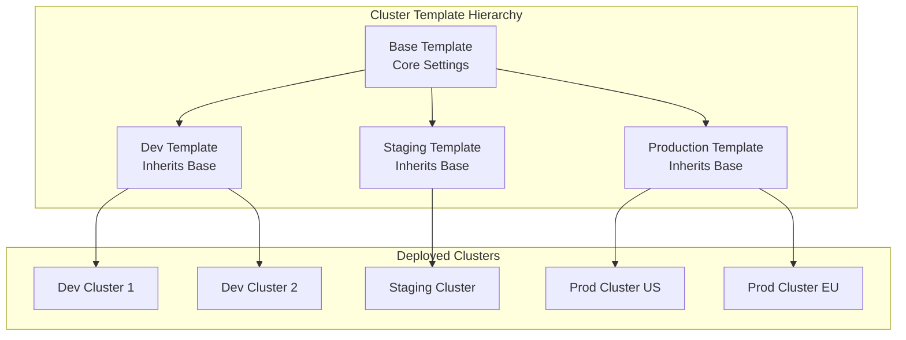
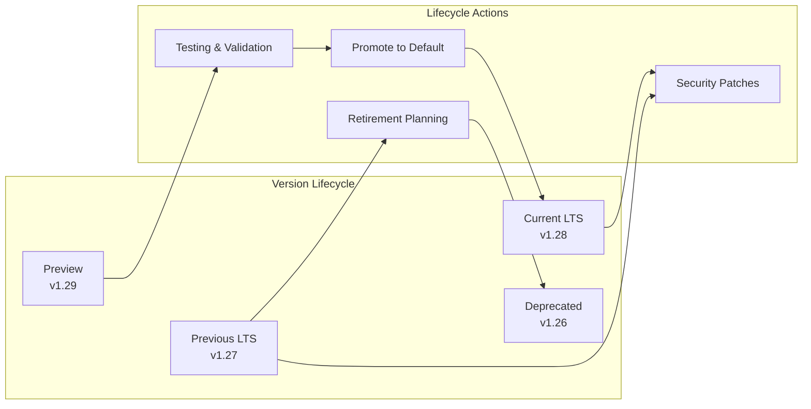
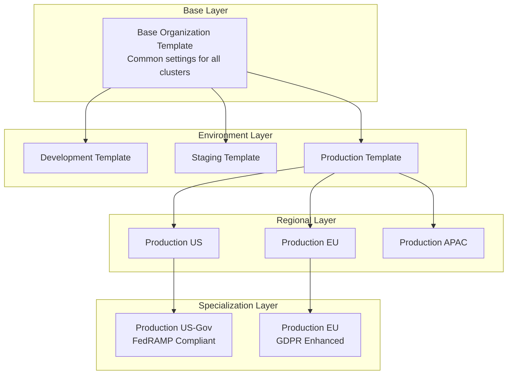
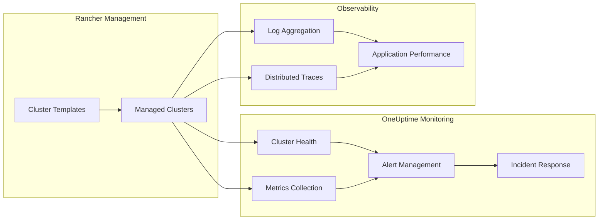

# How to Build Rancher Cluster Templates

By [Nawaz Dhandala](https://github.com/nawazdhandala)

Tags: Rancher, Kubernetes, RKE, Cluster Templates, Infrastructure as Code, DevOps, Version Management

Description: A comprehensive guide to building Rancher Cluster Templates for standardizing Kubernetes deployments across your organization, covering RKE templates, version enforcement, configuration inheritance, and best practices for enterprise-scale cluster management.

---

> "Consistency is the foundation of reliability. In Kubernetes, cluster templates are the blueprint that ensures every environment operates with the same proven configuration."

Rancher Cluster Templates provide a powerful way to standardize Kubernetes cluster configurations across your organization. Instead of manually configuring each cluster and risking configuration drift, templates let you define approved configurations that teams can use as a foundation for their deployments.

## Understanding Rancher Cluster Templates

Cluster Templates in Rancher are reusable configurations that define how Kubernetes clusters should be provisioned. They enforce organizational standards while still allowing flexibility where needed.



### Why Use Cluster Templates?

- **Consistency**: Every cluster follows approved configurations
- **Compliance**: Enforce security and governance requirements
- **Speed**: Teams can spin up clusters quickly without deep Kubernetes expertise
- **Version Control**: Track and audit configuration changes over time
- **Reduced Errors**: Eliminate manual configuration mistakes

## Creating Your First RKE Template

RKE (Rancher Kubernetes Engine) templates define the core Kubernetes configuration. Here is a basic template structure.

```yaml
# base-cluster-template.yaml
# This template defines the foundation for all RKE clusters
# It sets up core components with production-ready defaults

apiVersion: management.cattle.io/v3
kind: ClusterTemplate
metadata:
  name: organization-base-template
  namespace: cattle-global-data
  labels:
    # Labels help organize and filter templates
    team: platform
    environment: all
    compliance: soc2
spec:
  displayName: "Organization Base Template"
  description: "Base template with organizational standards for all clusters"

  # Template revisions allow versioning of configurations
  revisions:
    - name: v1.0.0
      enabled: true
      default: true

      # Cluster configuration begins here
      clusterConfig:
        # Docker root directory - use dedicated disk for container storage
        dockerRootDir: "/var/lib/docker"

        # Enable network policy enforcement
        enableNetworkPolicy: true

        # Local cluster authentication endpoint for high availability
        localClusterAuthEndpoint:
          enabled: true
          fqdn: ""
          caCerts: ""
```

### Defining RKE Configuration

The RKE configuration section controls the Kubernetes cluster setup.

```yaml
# rke-cluster-config.yaml
# Detailed RKE configuration within the cluster template

spec:
  revisions:
    - name: v1.0.0
      clusterConfig:
        rkeConfig:
          # Kubernetes version - pin to specific version for stability
          kubernetesVersion: "v1.28.5-rancher1"

          # Network configuration
          network:
            # Calico provides robust network policies
            plugin: calico
            options:
              # Enable IP-in-IP encapsulation for cross-subnet communication
              calico_ipip_mode: "Always"
              calico_nat_outgoing: "true"
              # MTU setting - adjust based on your network infrastructure
              mtu: "1440"

          # Ingress controller configuration
          ingress:
            provider: nginx
            options:
              # Enable proxy protocol for real client IPs
              use-proxy-protocol: "true"
              # Security headers
              ssl-protocols: "TLSv1.2 TLSv1.3"
              ssl-ciphers: "ECDHE-ECDSA-AES128-GCM-SHA256:ECDHE-RSA-AES128-GCM-SHA256"

          # Services configuration for core Kubernetes components
          services:
            # etcd configuration for cluster state storage
            etcd:
              # Automatic backups to S3-compatible storage
              backupConfig:
                enabled: true
                intervalHours: 6
                retention: 12
                s3BackupConfig:
                  accessKey: ""  # Use secrets management
                  bucketName: "rancher-etcd-backups"
                  endpoint: "s3.amazonaws.com"
                  folder: "cluster-backups"
                  region: "us-east-1"
                  secretKey: ""  # Use secrets management

              # Extra args for etcd tuning
              extraArgs:
                # Increase snapshot count for busy clusters
                snapshot-count: "10000"
                # Heartbeat interval in milliseconds
                heartbeat-interval: "500"
                # Election timeout - should be 10x heartbeat
                election-timeout: "5000"

            # Kube API server configuration
            kubeApi:
              # Audit logging for compliance
              auditLog:
                enabled: true
                maxAge: 30
                maxBackup: 10
                maxSize: 100
                path: "/var/log/kube-audit/audit-log.json"
                format: "json"

              # API server arguments
              extraArgs:
                # Enable RBAC authorization
                authorization-mode: "RBAC,Node"
                # Disable anonymous authentication
                anonymous-auth: "false"
                # Enable admission controllers
                enable-admission-plugins: "NamespaceLifecycle,LimitRanger,ServiceAccount,DefaultStorageClass,DefaultTolerationSeconds,MutatingAdmissionWebhook,ValidatingAdmissionWebhook,ResourceQuota,NodeRestriction,PodSecurityPolicy"
                # Audit policy file
                audit-policy-file: "/etc/kubernetes/audit-policy.yaml"

            # Kubelet configuration
            kubelet:
              extraArgs:
                # Pod eviction thresholds
                eviction-hard: "memory.available<500Mi,nodefs.available<10%,imagefs.available<15%"
                # Maximum pods per node
                max-pods: "110"
                # Image garbage collection
                image-gc-high-threshold: "85"
                image-gc-low-threshold: "80"

            # Kube controller manager
            kubeController:
              extraArgs:
                # Terminated pod garbage collection
                terminated-pod-gc-threshold: "1000"
                # Node monitor settings for faster failure detection
                node-monitor-period: "5s"
                node-monitor-grace-period: "40s"

            # Scheduler configuration
            scheduler:
              extraArgs:
                # Scoring strategy for pod placement
                policy-config-file: "/etc/kubernetes/scheduler-policy.json"
```

## Version Enforcement

One of the most powerful features of cluster templates is enforcing Kubernetes version standards across your organization.

```yaml
# version-enforcement-template.yaml
# Template with strict version controls for production environments

apiVersion: management.cattle.io/v3
kind: ClusterTemplate
metadata:
  name: production-version-controlled
  namespace: cattle-global-data
  annotations:
    # Document the version policy
    cattle.io/version-policy: |
      Production clusters must use LTS Kubernetes versions.
      Upgrades require approval from Platform Team.
spec:
  displayName: "Production - Version Controlled"

  # Members who can use this template
  members:
    - accessType: owner
      groupPrincipalId: "local://g-platform-admins"
    - accessType: read-only
      groupPrincipalId: "local://g-developers"

  revisions:
    # Keep multiple revisions for controlled upgrades
    - name: v1.27-lts
      enabled: true
      default: false
      clusterConfig:
        rkeConfig:
          # Pin to specific patch version
          kubernetesVersion: "v1.27.11-rancher1"

          # Upgrade strategy
          upgradeStrategy:
            # Drain nodes before upgrade
            drain: true
            # Maximum nodes upgrading simultaneously
            maxUnavailableWorker: "10%"
            maxUnavailableControlplane: "1"
            # Drain options
            nodeDrainInput:
              deleteEmptyDirData: true
              disableEviction: false
              force: false
              gracePeriod: 60
              ignoreDaemonSets: true
              timeout: 120

    # Current LTS version
    - name: v1.28-lts
      enabled: true
      default: true  # New clusters use this version
      clusterConfig:
        rkeConfig:
          kubernetesVersion: "v1.28.5-rancher1"
          upgradeStrategy:
            drain: true
            maxUnavailableWorker: "10%"
            maxUnavailableControlplane: "1"

    # Preview version for testing
    - name: v1.29-preview
      enabled: true
      default: false
      clusterConfig:
        rkeConfig:
          kubernetesVersion: "v1.29.2-rancher1"
          upgradeStrategy:
            drain: true
            maxUnavailableWorker: "20%"
            maxUnavailableControlplane: "1"
```

### Version Lifecycle Management



## Standardizing Configurations

Create templates that enforce your organization's security and operational standards.

```yaml
# security-hardened-template.yaml
# Template with comprehensive security hardening

apiVersion: management.cattle.io/v3
kind: ClusterTemplate
metadata:
  name: security-hardened
  namespace: cattle-global-data
  labels:
    security-level: high
    compliance: "pci-dss,hipaa,soc2"
spec:
  displayName: "Security Hardened Cluster"
  description: "Cluster template with CIS benchmark hardening"

  revisions:
    - name: v1.0.0
      enabled: true
      default: true

      clusterConfig:
        # Enable network policies by default
        enableNetworkPolicy: true

        rkeConfig:
          kubernetesVersion: "v1.28.5-rancher1"

          services:
            kubeApi:
              # Pod Security Standards enforcement
              podSecurityConfiguration: |
                apiVersion: pod-security.admission.config.k8s.io/v1
                kind: PodSecurityConfiguration
                defaults:
                  enforce: "restricted"
                  enforce-version: "latest"
                  audit: "restricted"
                  audit-version: "latest"
                  warn: "restricted"
                  warn-version: "latest"
                exemptions:
                  usernames: []
                  runtimeClasses: []
                  namespaces:
                    - kube-system
                    - cattle-system
                    - rancher-operator-system

              extraArgs:
                # Secure API server configuration
                anonymous-auth: "false"
                authorization-mode: "RBAC,Node"

                # TLS configuration
                tls-min-version: "VersionTLS12"
                tls-cipher-suites: "TLS_ECDHE_ECDSA_WITH_AES_128_GCM_SHA256,TLS_ECDHE_RSA_WITH_AES_128_GCM_SHA256,TLS_ECDHE_ECDSA_WITH_AES_256_GCM_SHA384,TLS_ECDHE_RSA_WITH_AES_256_GCM_SHA384"

                # Admission controllers including PodSecurity
                enable-admission-plugins: "NamespaceLifecycle,LimitRanger,ServiceAccount,DefaultStorageClass,ResourceQuota,NodeRestriction,PodSecurity"

                # Service account configuration
                service-account-lookup: "true"

                # Request timeout
                request-timeout: "60s"

                # Profiling disabled for security
                profiling: "false"

            kubelet:
              extraArgs:
                # Protect kernel defaults
                protect-kernel-defaults: "true"

                # Read-only port disabled
                read-only-port: "0"

                # Authentication configuration
                anonymous-auth: "false"

                # Event recording
                event-qps: "5"

                # Certificate rotation
                rotate-certificates: "true"

                # Streaming connection timeout
                streaming-connection-idle-timeout: "5m"

              # Extra binds for CIS compliance
              extraBinds:
                - "/etc/kubernetes/audit-policy.yaml:/etc/kubernetes/audit-policy.yaml:ro"

            kubeController:
              extraArgs:
                # Terminate completed pods
                terminated-pod-gc-threshold: "1000"

                # Profiling disabled
                profiling: "false"

                # Use service account credentials
                use-service-account-credentials: "true"

                # Service account private key
                service-account-private-key-file: "/etc/kubernetes/pki/sa.key"

                # Root CA file
                root-ca-file: "/etc/kubernetes/pki/ca.crt"

            scheduler:
              extraArgs:
                # Profiling disabled
                profiling: "false"

          # Private registry configuration
          privateRegistries:
            - url: "registry.internal.company.com"
              isDefault: true
              # Credentials stored in Rancher secrets
```

### Resource Quotas and Limits

```yaml
# resource-standards-template.yaml
# Define default resource quotas applied to all namespaces

apiVersion: management.cattle.io/v3
kind: ClusterTemplate
metadata:
  name: resource-managed
  namespace: cattle-global-data
spec:
  displayName: "Resource Managed Cluster"

  revisions:
    - name: v1.0.0
      enabled: true
      default: true

      clusterConfig:
        # Default project resource quotas
        defaultPodSecurityPolicyTemplateId: "restricted"

        # Cluster-wide resource quota defaults
        # These are applied via Rancher's project system
        clusterResourceQuota:
          # Limit total cluster resource consumption
          hard:
            # Total CPU across all namespaces
            requests.cpu: "100"
            limits.cpu: "200"
            # Total memory across all namespaces
            requests.memory: "400Gi"
            limits.memory: "800Gi"
            # Total storage
            requests.storage: "10Ti"
            # Pod count
            pods: "5000"
            # Service count
            services: "1000"
            services.loadbalancers: "10"
            services.nodeports: "50"
            # ConfigMap and Secret limits
            configmaps: "2000"
            secrets: "2000"
            # PVC count
            persistentvolumeclaims: "500"

        rkeConfig:
          kubernetesVersion: "v1.28.5-rancher1"

          services:
            kubelet:
              extraArgs:
                # System reserved resources
                system-reserved: "cpu=500m,memory=1Gi,ephemeral-storage=10Gi"
                kube-reserved: "cpu=500m,memory=1Gi,ephemeral-storage=5Gi"
                # Eviction thresholds
                eviction-hard: "memory.available<500Mi,nodefs.available<10%,nodefs.inodesFree<5%,imagefs.available<15%"
                eviction-soft: "memory.available<1Gi,nodefs.available<15%,imagefs.available<20%"
                eviction-soft-grace-period: "memory.available=2m,nodefs.available=2m,imagefs.available=2m"
```

## Template Inheritance

Rancher supports template inheritance through a combination of base templates and overlays. Here is how to structure a multi-environment setup.

```yaml
# base-template.yaml
# Foundation template that other templates inherit from

apiVersion: management.cattle.io/v3
kind: ClusterTemplate
metadata:
  name: base-organization
  namespace: cattle-global-data
  labels:
    template-type: base
spec:
  displayName: "[BASE] Organization Foundation"
  description: "Base template - do not use directly. Other templates inherit from this."

  revisions:
    - name: v1.0.0
      enabled: true
      default: true

      clusterConfig:
        enableNetworkPolicy: true
        localClusterAuthEndpoint:
          enabled: true

        rkeConfig:
          kubernetesVersion: "v1.28.5-rancher1"

          network:
            plugin: calico
            options:
              calico_ipip_mode: "Always"

          services:
            etcd:
              backupConfig:
                enabled: true
                intervalHours: 12
                retention: 6

            kubeApi:
              auditLog:
                enabled: true
                maxAge: 7
                maxBackup: 3
                maxSize: 50
```

```yaml
# development-template.yaml
# Development environment template extending base

apiVersion: management.cattle.io/v3
kind: ClusterTemplate
metadata:
  name: development
  namespace: cattle-global-data
  labels:
    template-type: environment
    environment: development
  annotations:
    # Reference the base template for documentation
    cattle.io/base-template: "base-organization"
spec:
  displayName: "Development Environment"
  description: "Template for development clusters with relaxed resource limits"

  # Allow developers to use this template
  members:
    - accessType: owner
      groupPrincipalId: "local://g-platform-admins"
    - accessType: member
      groupPrincipalId: "local://g-developers"

  revisions:
    - name: v1.0.0
      enabled: true
      default: true

      clusterConfig:
        enableNetworkPolicy: true

        # Questions allow customization when creating clusters
        questions:
          - variable: "clusterName"
            default: "dev-cluster"
            description: "Name for the development cluster"
            type: "string"
            required: true

          - variable: "nodeCount"
            default: "3"
            description: "Number of worker nodes"
            type: "int"
            required: true
            min: 1
            max: 10

          - variable: "instanceType"
            default: "t3.medium"
            description: "EC2 instance type for nodes"
            type: "enum"
            options:
              - "t3.small"
              - "t3.medium"
              - "t3.large"

        rkeConfig:
          kubernetesVersion: "v1.28.5-rancher1"

          # Development-specific: Allow preview versions
          # Uncomment to test newer Kubernetes versions
          # kubernetesVersion: "v1.29.2-rancher1"

          network:
            plugin: calico

          services:
            etcd:
              backupConfig:
                enabled: true
                intervalHours: 24  # Less frequent backups
                retention: 3       # Shorter retention

            kubeApi:
              auditLog:
                enabled: true
                maxAge: 3
                maxBackup: 2
                maxSize: 25

            kubelet:
              extraArgs:
                # Relaxed eviction for development
                eviction-hard: "memory.available<200Mi,nodefs.available<5%"
                max-pods: "150"  # Higher pod density for dev
```

```yaml
# production-template.yaml
# Production environment template with strict controls

apiVersion: management.cattle.io/v3
kind: ClusterTemplate
metadata:
  name: production
  namespace: cattle-global-data
  labels:
    template-type: environment
    environment: production
  annotations:
    cattle.io/base-template: "base-organization"
    cattle.io/requires-approval: "true"
spec:
  displayName: "Production Environment"
  description: "Locked-down template for production clusters"

  # Strict access control
  members:
    - accessType: owner
      groupPrincipalId: "local://g-platform-admins"
    - accessType: read-only
      groupPrincipalId: "local://g-sre-team"

  revisions:
    - name: v1.0.0
      enabled: true
      default: true

      # Locked fields cannot be changed when creating clusters
      locked: true

      clusterConfig:
        enableNetworkPolicy: true

        # Limited customization for production
        questions:
          - variable: "clusterName"
            default: ""
            description: "Production cluster name (requires approval)"
            type: "string"
            required: true

          - variable: "region"
            default: "us-east-1"
            description: "AWS region for deployment"
            type: "enum"
            required: true
            options:
              - "us-east-1"
              - "us-west-2"
              - "eu-west-1"

        rkeConfig:
          # Pinned to LTS version
          kubernetesVersion: "v1.28.5-rancher1"

          network:
            plugin: calico
            options:
              calico_ipip_mode: "Always"
              calico_nat_outgoing: "true"

          services:
            etcd:
              backupConfig:
                enabled: true
                intervalHours: 4   # Frequent backups
                retention: 30      # Long retention
                s3BackupConfig:
                  bucketName: "prod-etcd-backups"
                  region: "us-east-1"

            kubeApi:
              auditLog:
                enabled: true
                maxAge: 90
                maxBackup: 30
                maxSize: 200

              extraArgs:
                anonymous-auth: "false"
                authorization-mode: "RBAC,Node"
                enable-admission-plugins: "NamespaceLifecycle,LimitRanger,ServiceAccount,DefaultStorageClass,ResourceQuota,NodeRestriction,PodSecurity"

            kubelet:
              extraArgs:
                eviction-hard: "memory.available<1Gi,nodefs.available<15%,imagefs.available<20%"
                max-pods: "110"
                protect-kernel-defaults: "true"
```

### Template Inheritance Architecture



## Implementing Templates with Terraform

For infrastructure-as-code workflows, you can manage Rancher cluster templates with Terraform.

```hcl
# main.tf
# Terraform configuration for Rancher cluster templates

terraform {
  required_providers {
    rancher2 = {
      source  = "rancher/rancher2"
      version = "~> 3.0"
    }
  }
}

# Provider configuration
provider "rancher2" {
  api_url    = var.rancher_api_url
  access_key = var.rancher_access_key
  secret_key = var.rancher_secret_key
}

# Base cluster template
resource "rancher2_cluster_template" "base" {
  name        = "organization-base"
  description = "Base template for all clusters in the organization"

  # Template revision with RKE configuration
  template_revisions {
    name    = "v1.0.0"
    default = true
    enabled = true

    cluster_config {
      # RKE configuration
      rke_config {
        kubernetes_version = "v1.28.5-rancher1"

        # Network plugin configuration
        network {
          plugin = "calico"
          options = {
            calico_ipip_mode     = "Always"
            calico_nat_outgoing  = "true"
          }
        }

        # etcd service configuration
        services {
          etcd {
            backup_config {
              enabled        = true
              interval_hours = 12
              retention      = 6
            }
          }

          # API server configuration
          kube_api {
            audit_log {
              enabled    = true
              max_age    = 30
              max_backup = 10
              max_size   = 100
            }

            extra_args = {
              anonymous-auth     = "false"
              authorization-mode = "RBAC,Node"
            }
          }
        }
      }

      enable_network_policy = true
    }
  }
}

# Development template extending base
resource "rancher2_cluster_template" "development" {
  name        = "development-environment"
  description = "Development clusters with relaxed settings"

  # Define who can use this template
  members {
    access_type       = "owner"
    group_principal_id = "local://g-platform-admins"
  }

  members {
    access_type       = "member"
    group_principal_id = "local://g-developers"
  }

  template_revisions {
    name    = "v1.0.0"
    default = true
    enabled = true

    # Questions for customization
    questions {
      variable    = "cluster_name"
      default     = "dev-cluster"
      description = "Name for the development cluster"
      type        = "string"
      required    = true
    }

    questions {
      variable    = "worker_count"
      default     = "3"
      description = "Number of worker nodes (1-10)"
      type        = "int"
      required    = true
    }

    cluster_config {
      rke_config {
        kubernetes_version = "v1.28.5-rancher1"

        network {
          plugin = "calico"
        }

        services {
          etcd {
            backup_config {
              enabled        = true
              interval_hours = 24
              retention      = 3
            }
          }

          kubelet {
            extra_args = {
              max-pods      = "150"
              eviction-hard = "memory.available<200Mi,nodefs.available<5%"
            }
          }
        }
      }

      enable_network_policy = true
    }
  }
}

# Production template with locked settings
resource "rancher2_cluster_template" "production" {
  name        = "production-environment"
  description = "Production clusters with strict security"

  members {
    access_type       = "owner"
    group_principal_id = "local://g-platform-admins"
  }

  template_revisions {
    name    = "v1.0.0"
    default = true
    enabled = true

    cluster_config {
      rke_config {
        kubernetes_version = "v1.28.5-rancher1"

        network {
          plugin = "calico"
          options = {
            calico_ipip_mode = "Always"
          }
        }

        services {
          etcd {
            backup_config {
              enabled        = true
              interval_hours = 4
              retention      = 30

              s3_backup_config {
                bucket_name = "prod-etcd-backups"
                region      = "us-east-1"
                endpoint    = "s3.amazonaws.com"
              }
            }
          }

          kube_api {
            audit_log {
              enabled    = true
              max_age    = 90
              max_backup = 30
              max_size   = 200
            }

            extra_args = {
              anonymous-auth                = "false"
              authorization-mode            = "RBAC,Node"
              enable-admission-plugins      = "NamespaceLifecycle,LimitRanger,ServiceAccount,DefaultStorageClass,ResourceQuota,NodeRestriction,PodSecurity"
              service-account-lookup        = "true"
            }
          }

          kubelet {
            extra_args = {
              protect-kernel-defaults = "true"
              read-only-port         = "0"
              max-pods               = "110"
              eviction-hard          = "memory.available<1Gi,nodefs.available<15%"
            }
          }
        }
      }

      enable_network_policy = true
    }
  }
}
```

### Variables and Outputs

```hcl
# variables.tf
# Input variables for the Terraform configuration

variable "rancher_api_url" {
  description = "URL of the Rancher API endpoint"
  type        = string
}

variable "rancher_access_key" {
  description = "Rancher API access key"
  type        = string
  sensitive   = true
}

variable "rancher_secret_key" {
  description = "Rancher API secret key"
  type        = string
  sensitive   = true
}

variable "kubernetes_version" {
  description = "Default Kubernetes version for templates"
  type        = string
  default     = "v1.28.5-rancher1"
}

variable "backup_s3_bucket" {
  description = "S3 bucket for etcd backups"
  type        = string
  default     = "rancher-etcd-backups"
}

variable "backup_s3_region" {
  description = "AWS region for backup bucket"
  type        = string
  default     = "us-east-1"
}
```

```hcl
# outputs.tf
# Output values for reference

output "base_template_id" {
  description = "ID of the base cluster template"
  value       = rancher2_cluster_template.base.id
}

output "development_template_id" {
  description = "ID of the development cluster template"
  value       = rancher2_cluster_template.development.id
}

output "production_template_id" {
  description = "ID of the production cluster template"
  value       = rancher2_cluster_template.production.id
}

output "template_versions" {
  description = "Map of template names to their default versions"
  value = {
    base        = "v1.0.0"
    development = "v1.0.0"
    production  = "v1.0.0"
  }
}
```

## Template Validation and Testing

Implement CI/CD validation for your cluster templates.

```yaml
# .github/workflows/validate-templates.yaml
# GitHub Actions workflow for template validation

name: Validate Cluster Templates

on:
  pull_request:
    paths:
      - 'cluster-templates/**'
      - 'terraform/**'
  push:
    branches:
      - main
    paths:
      - 'cluster-templates/**'
      - 'terraform/**'

jobs:
  validate-yaml:
    name: Validate YAML Syntax
    runs-on: ubuntu-latest
    steps:
      - uses: actions/checkout@v4

      - name: Install yamllint
        run: pip install yamllint

      - name: Lint YAML files
        run: |
          yamllint -c .yamllint.yaml cluster-templates/

  validate-terraform:
    name: Validate Terraform
    runs-on: ubuntu-latest
    steps:
      - uses: actions/checkout@v4

      - name: Setup Terraform
        uses: hashicorp/setup-terraform@v3
        with:
          terraform_version: 1.6.0

      - name: Terraform Init
        run: terraform init -backend=false
        working-directory: terraform/

      - name: Terraform Validate
        run: terraform validate
        working-directory: terraform/

      - name: Terraform Format Check
        run: terraform fmt -check -recursive
        working-directory: terraform/

  security-scan:
    name: Security Scan
    runs-on: ubuntu-latest
    steps:
      - uses: actions/checkout@v4

      - name: Run Checkov
        uses: bridgecrewio/checkov-action@master
        with:
          directory: cluster-templates/
          framework: kubernetes

      - name: Run Trivy
        uses: aquasecurity/trivy-action@master
        with:
          scan-type: 'config'
          scan-ref: 'cluster-templates/'

  dry-run-test:
    name: Dry Run Test
    runs-on: ubuntu-latest
    needs: [validate-yaml, validate-terraform]
    if: github.event_name == 'pull_request'
    steps:
      - uses: actions/checkout@v4

      - name: Setup Terraform
        uses: hashicorp/setup-terraform@v3

      - name: Terraform Plan
        run: |
          terraform init
          terraform plan -out=tfplan
        working-directory: terraform/
        env:
          TF_VAR_rancher_api_url: ${{ secrets.RANCHER_API_URL }}
          TF_VAR_rancher_access_key: ${{ secrets.RANCHER_ACCESS_KEY }}
          TF_VAR_rancher_secret_key: ${{ secrets.RANCHER_SECRET_KEY }}
```

## Monitoring Your Clusters

Once you have clusters running from templates, monitoring becomes crucial. [OneUptime](https://oneuptime.com) provides comprehensive monitoring for your Rancher-managed Kubernetes clusters.



With OneUptime, you can:

- Monitor cluster health across all environments
- Track Kubernetes-specific metrics (pod status, node health, resource utilization)
- Set up alerts for cluster drift from template specifications
- Correlate application performance with infrastructure changes
- Create status pages for your Kubernetes infrastructure

## Best Practices

### Template Organization

1. **Use clear naming conventions**: `{environment}-{purpose}-{version}`
2. **Document extensively**: Include descriptions and annotations
3. **Version everything**: Use semantic versioning for template revisions
4. **Test before promoting**: Always test templates in non-production first

### Security Considerations

1. **Lock production templates**: Prevent unauthorized modifications
2. **Audit template usage**: Track who creates clusters from which templates
3. **Rotate credentials**: Regularly update any credentials in templates
4. **Review permissions**: Periodically audit template access

### Operational Excellence

1. **Automate validation**: Use CI/CD to validate template changes
2. **Plan upgrades**: Create new revisions before upgrading clusters
3. **Document rollback**: Know how to revert to previous template versions
4. **Monitor compliance**: Verify clusters match their template specifications

---

Rancher Cluster Templates transform Kubernetes cluster management from an art into a science. By codifying your organization's standards into reusable templates, you ensure consistency, accelerate deployments, and reduce operational risk. Start with a solid base template, build environment-specific variations, and let your teams focus on building applications instead of wrestling with cluster configuration.
