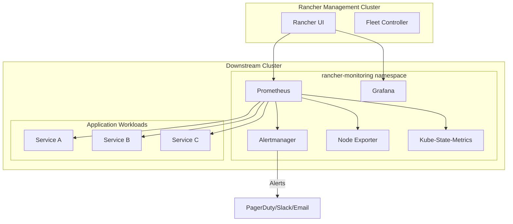
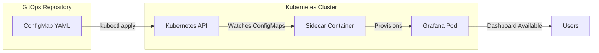
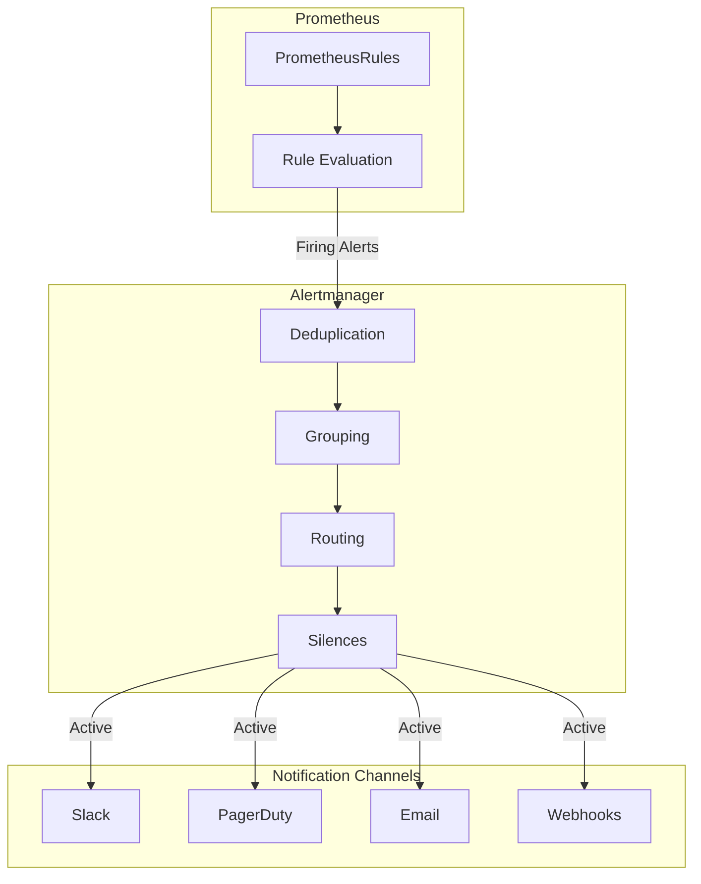
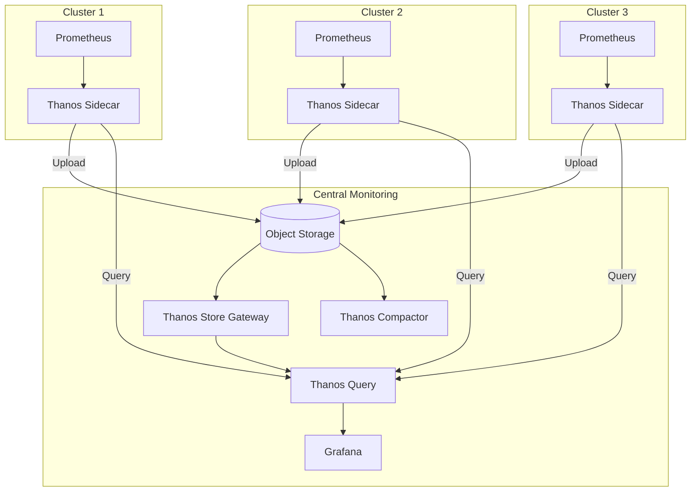

# How to Monitor Clusters with Rancher

Author: [nawazdhandala](https://github.com/nawazdhandala)

Tags: Rancher, Kubernetes, Monitoring, Prometheus, Grafana, Alerting, Observability, DevOps

Description: A comprehensive guide to monitoring Kubernetes clusters with Rancher, covering the built-in monitoring stack, Prometheus integration, Grafana dashboards, and alerting configuration for production-ready observability.

---

> "You cannot improve what you cannot measure." - Peter Drucker

Rancher is more than a Kubernetes management platform-it ships with a powerful monitoring stack that transforms cluster observability from a weekend project into a one-click deployment. This guide walks you through enabling and configuring Rancher's monitoring capabilities, from the bundled Prometheus and Grafana to custom alerts that page your on-call team before users notice.

If you are new to Rancher's multi-cluster management, understand that monitoring is a first-class citizen in the platform. Whether you run RKE2, K3s, or imported EKS clusters, Rancher provides a unified monitoring experience across your fleet.

## Rancher Monitoring Architecture

Before diving into configuration, understand what Rancher deploys when you enable monitoring:



Rancher's monitoring stack is built on the Prometheus Operator pattern, deploying:

- **Prometheus**: Time-series database and scraping engine
- **Alertmanager**: Alert routing and deduplication
- **Grafana**: Visualization and dashboards
- **Node Exporter**: Host-level metrics (CPU, memory, disk, network)
- **Kube-State-Metrics**: Kubernetes object state metrics

## Enabling the Monitoring Stack

The fastest path to cluster observability is through Rancher's UI, but you can also use Helm for GitOps workflows.

### Via Rancher UI

Navigate to your cluster, select **Apps** from the sidebar, and install the **Monitoring** chart from the Rancher charts repository:

```yaml
# Example values to customize the installation
# These can be set during chart installation in the UI

# Prometheus configuration
prometheus:
  # Resource allocation for Prometheus pods
  prometheusSpec:
    # Memory and CPU limits
    resources:
      requests:
        memory: 750Mi
        cpu: 750m
      limits:
        memory: 3000Mi
        cpu: 1000m
    # Retention period for metrics
    retention: 10d
    # Storage configuration
    storageSpec:
      volumeClaimTemplate:
        spec:
          accessModes: ["ReadWriteOnce"]
          resources:
            requests:
              storage: 50Gi

# Grafana configuration
grafana:
  # Enable persistence for dashboards
  persistence:
    enabled: true
    size: 10Gi
  # Default admin credentials (change these!)
  adminPassword: "your-secure-password"
```

### Via Helm CLI

For GitOps or automated deployments, install using Helm:

```bash
# Add the Rancher charts repository
helm repo add rancher-charts https://charts.rancher.io
helm repo update

# Create the namespace
kubectl create namespace cattle-monitoring-system

# Install the monitoring chart with custom values
helm install rancher-monitoring rancher-charts/rancher-monitoring \
  --namespace cattle-monitoring-system \
  --values monitoring-values.yaml \
  --wait
```

Here is a production-ready `monitoring-values.yaml`:

```yaml
# monitoring-values.yaml
# Production configuration for Rancher Monitoring

# Global settings
global:
  # Cattle settings for Rancher integration
  cattle:
    # Enable RBAC for Rancher users
    psp:
      enabled: false  # PSPs are deprecated in K8s 1.25+

# Prometheus configuration
prometheus:
  prometheusSpec:
    # Resource allocation
    resources:
      requests:
        memory: 1Gi
        cpu: 500m
      limits:
        memory: 4Gi
        cpu: 2000m

    # How long to keep metrics
    retention: 15d
    retentionSize: "45GB"

    # Persistent storage
    storageSpec:
      volumeClaimTemplate:
        spec:
          storageClassName: "longhorn"  # Use your storage class
          accessModes: ["ReadWriteOnce"]
          resources:
            requests:
              storage: 50Gi

    # Scrape configuration
    scrapeInterval: 30s
    evaluationInterval: 30s

    # Enable remote write for long-term storage
    # Uncomment to send metrics to external systems
    # remoteWrite:
    #   - url: "https://prometheus-remote.example.com/api/v1/write"
    #     basicAuth:
    #       username:
    #         name: remote-write-secret
    #         key: username
    #       password:
    #         name: remote-write-secret
    #         key: password

# Alertmanager configuration
alertmanager:
  alertmanagerSpec:
    # Resource allocation
    resources:
      requests:
        memory: 100Mi
        cpu: 100m
      limits:
        memory: 500Mi
        cpu: 500m

    # Storage for silences and notification state
    storage:
      volumeClaimTemplate:
        spec:
          storageClassName: "longhorn"
          accessModes: ["ReadWriteOnce"]
          resources:
            requests:
              storage: 5Gi

# Grafana configuration
grafana:
  # Enable persistence
  persistence:
    enabled: true
    storageClassName: "longhorn"
    size: 10Gi

  # Resource allocation
  resources:
    requests:
      memory: 200Mi
      cpu: 100m
    limits:
      memory: 500Mi
      cpu: 500m

  # Additional data sources can be configured here
  additionalDataSources: []

# Node Exporter - runs on every node
nodeExporter:
  resources:
    requests:
      memory: 30Mi
      cpu: 50m
    limits:
      memory: 100Mi
      cpu: 200m

# Kube State Metrics
kubeStateMetrics:
  resources:
    requests:
      memory: 50Mi
      cpu: 50m
    limits:
      memory: 200Mi
      cpu: 200m
```

## Prometheus Integration Deep Dive

Rancher's Prometheus instance uses the Prometheus Operator's custom resources for configuration. This means you define scrape targets declaratively.

### ServiceMonitor for Application Metrics

Create a `ServiceMonitor` to scrape metrics from your applications:

```yaml
# service-monitor.yaml
# Defines how Prometheus should scrape your application metrics

apiVersion: monitoring.coreos.com/v1
kind: ServiceMonitor
metadata:
  name: my-application
  namespace: production
  labels:
    # This label ensures Rancher's Prometheus picks up the monitor
    release: rancher-monitoring
spec:
  # Selector to find the target Service
  selector:
    matchLabels:
      app: my-application

  # Which namespace(s) to look for the Service
  namespaceSelector:
    matchNames:
      - production

  # Endpoint configuration
  endpoints:
    - port: metrics          # Name of the port in your Service
      path: /metrics         # Path to the metrics endpoint
      interval: 30s          # How often to scrape
      scrapeTimeout: 10s     # Timeout for each scrape

      # Optional: Add labels to all metrics from this target
      relabelings:
        - sourceLabels: [__meta_kubernetes_pod_label_version]
          targetLabel: app_version

      # Optional: Drop or modify metrics
      metricRelabelings:
        - sourceLabels: [__name__]
          regex: "go_.*"     # Drop Go runtime metrics
          action: drop
```

Apply the ServiceMonitor:

```bash
# Apply the ServiceMonitor to your cluster
kubectl apply -f service-monitor.yaml

# Verify Prometheus picked it up
# Check the Prometheus UI under Status > Targets
# Or query the API directly:
kubectl port-forward -n cattle-monitoring-system \
  svc/rancher-monitoring-prometheus 9090:9090 &

curl -s http://localhost:9090/api/v1/targets | jq '.data.activeTargets[] | select(.labels.job=="my-application")'
```

### PodMonitor for Sidecar Metrics

When your metrics endpoint is not exposed via a Service, use a `PodMonitor`:

```yaml
# pod-monitor.yaml
# Scrape metrics directly from pods without a Service

apiVersion: monitoring.coreos.com/v1
kind: PodMonitor
metadata:
  name: envoy-sidecars
  namespace: cattle-monitoring-system
  labels:
    release: rancher-monitoring
spec:
  # Selector to find target Pods
  selector:
    matchLabels:
      sidecar: envoy

  # Namespaces to search for Pods
  namespaceSelector:
    any: true  # Search all namespaces

  # Endpoint configuration
  podMetricsEndpoints:
    - port: envoy-admin
      path: /stats/prometheus
      interval: 15s
```

### Custom Scrape Configurations

For targets outside Kubernetes (external databases, legacy systems), use additional scrape configs:

```yaml
# additional-scrape-configs-secret.yaml
# Secret containing additional Prometheus scrape configurations

apiVersion: v1
kind: Secret
metadata:
  name: additional-scrape-configs
  namespace: cattle-monitoring-system
stringData:
  additional-scrape-configs.yaml: |
    # Scrape external PostgreSQL exporter
    - job_name: 'external-postgres'
      static_configs:
        - targets:
          - 'postgres-exporter.database.svc:9187'
          labels:
            environment: 'production'
            database: 'primary'
      metrics_path: /metrics
      scrape_interval: 30s

    # Scrape external Redis cluster
    - job_name: 'external-redis'
      static_configs:
        - targets:
          - 'redis-node-1.example.com:9121'
          - 'redis-node-2.example.com:9121'
          - 'redis-node-3.example.com:9121'
      scrape_interval: 15s

    # Scrape blackbox exporter for endpoint probes
    - job_name: 'blackbox-http'
      metrics_path: /probe
      params:
        module: [http_2xx]
      static_configs:
        - targets:
          - https://api.example.com/health
          - https://web.example.com
      relabel_configs:
        - source_labels: [__address__]
          target_label: __param_target
        - source_labels: [__param_target]
          target_label: instance
        - target_label: __address__
          replacement: blackbox-exporter:9115
```

Reference this secret in your Helm values:

```yaml
# In monitoring-values.yaml
prometheus:
  prometheusSpec:
    additionalScrapeConfigsSecret:
      enabled: true
      name: additional-scrape-configs
      key: additional-scrape-configs.yaml
```

## Grafana Dashboards

Rancher pre-installs essential dashboards, but production environments need custom views.

### Importing Dashboards

Grafana dashboards can be provisioned declaratively using ConfigMaps:

```yaml
# dashboard-configmap.yaml
# ConfigMap containing a Grafana dashboard definition

apiVersion: v1
kind: ConfigMap
metadata:
  name: custom-app-dashboard
  namespace: cattle-monitoring-system
  labels:
    # This label tells Grafana to load the dashboard
    grafana_dashboard: "1"
data:
  custom-app-dashboard.json: |
    {
      "annotations": {
        "list": []
      },
      "title": "Application Overview",
      "uid": "app-overview-001",
      "version": 1,
      "panels": [
        {
          "title": "Request Rate",
          "type": "timeseries",
          "gridPos": { "h": 8, "w": 12, "x": 0, "y": 0 },
          "targets": [
            {
              "expr": "sum(rate(http_requests_total{job=\"my-application\"}[5m])) by (method, status)",
              "legendFormat": "{{method}} - {{status}}"
            }
          ]
        },
        {
          "title": "Response Latency (p99)",
          "type": "timeseries",
          "gridPos": { "h": 8, "w": 12, "x": 12, "y": 0 },
          "targets": [
            {
              "expr": "histogram_quantile(0.99, sum(rate(http_request_duration_seconds_bucket{job=\"my-application\"}[5m])) by (le))",
              "legendFormat": "p99 latency"
            }
          ]
        },
        {
          "title": "Error Rate",
          "type": "stat",
          "gridPos": { "h": 4, "w": 6, "x": 0, "y": 8 },
          "targets": [
            {
              "expr": "sum(rate(http_requests_total{job=\"my-application\",status=~\"5..\"}[5m])) / sum(rate(http_requests_total{job=\"my-application\"}[5m])) * 100",
              "legendFormat": "Error %"
            }
          ],
          "fieldConfig": {
            "defaults": {
              "unit": "percent",
              "thresholds": {
                "mode": "absolute",
                "steps": [
                  { "color": "green", "value": null },
                  { "color": "yellow", "value": 1 },
                  { "color": "red", "value": 5 }
                ]
              }
            }
          }
        }
      ],
      "templating": {
        "list": [
          {
            "name": "namespace",
            "type": "query",
            "query": "label_values(http_requests_total, namespace)",
            "refresh": 2
          }
        ]
      }
    }
```

### Dashboard Provisioning Flow



### Essential Dashboards to Install

Import these community dashboards from Grafana.com for comprehensive coverage:

```bash
# Create a script to import popular dashboards
# import-dashboards.sh

#!/bin/bash

# Set Grafana credentials
GRAFANA_URL="http://localhost:3000"
GRAFANA_USER="admin"
GRAFANA_PASS="your-password"

# Dashboard IDs from grafana.com
DASHBOARDS=(
  "315"    # Kubernetes cluster monitoring
  "6417"   # Kubernetes Pods
  "7249"   # Kubernetes Cluster (by CoreOS)
  "11074"  # Node Exporter Full
  "13332"  # Kube-State-Metrics v2
  "14981"  # NGINX Ingress Controller
)

for DASHBOARD_ID in "${DASHBOARDS[@]}"; do
  echo "Importing dashboard $DASHBOARD_ID..."

  # Download the dashboard JSON
  DASHBOARD_JSON=$(curl -s "https://grafana.com/api/dashboards/$DASHBOARD_ID/revisions/latest/download")

  # Import into Grafana
  curl -X POST "$GRAFANA_URL/api/dashboards/import" \
    -H "Content-Type: application/json" \
    -u "$GRAFANA_USER:$GRAFANA_PASS" \
    -d "{
      \"dashboard\": $DASHBOARD_JSON,
      \"overwrite\": true,
      \"inputs\": [{
        \"name\": \"DS_PROMETHEUS\",
        \"type\": \"datasource\",
        \"pluginId\": \"prometheus\",
        \"value\": \"Prometheus\"
      }]
    }"

  echo "Dashboard $DASHBOARD_ID imported."
done
```

## Alerting Configuration

Alerts are the critical link between metrics and action. Rancher supports both Prometheus-native alerting and its own alert management UI.

### PrometheusRule for Alerts

Define alerts using the `PrometheusRule` custom resource:

```yaml
# prometheus-rules.yaml
# Alert rules for application and cluster health

apiVersion: monitoring.coreos.com/v1
kind: PrometheusRule
metadata:
  name: application-alerts
  namespace: cattle-monitoring-system
  labels:
    # Ensure Rancher's Prometheus picks up these rules
    release: rancher-monitoring
spec:
  groups:
    # Application-level alerts
    - name: application.rules
      rules:
        # High error rate alert
        - alert: HighErrorRate
          expr: |
            sum(rate(http_requests_total{status=~"5.."}[5m])) by (job, namespace)
            /
            sum(rate(http_requests_total[5m])) by (job, namespace)
            > 0.05
          for: 5m
          labels:
            severity: critical
            team: platform
          annotations:
            summary: "High error rate detected in {{ $labels.job }}"
            description: "Error rate is {{ $value | humanizePercentage }} in {{ $labels.namespace }}/{{ $labels.job }}"
            runbook_url: "https://wiki.example.com/runbooks/high-error-rate"

        # Slow response time alert
        - alert: SlowResponseTime
          expr: |
            histogram_quantile(0.99,
              sum(rate(http_request_duration_seconds_bucket[5m])) by (le, job, namespace)
            ) > 2
          for: 10m
          labels:
            severity: warning
            team: platform
          annotations:
            summary: "Slow response times in {{ $labels.job }}"
            description: "p99 latency is {{ $value | humanizeDuration }} in {{ $labels.namespace }}/{{ $labels.job }}"

        # Pod restart alert
        - alert: PodRestartingFrequently
          expr: |
            increase(kube_pod_container_status_restarts_total[1h]) > 5
          for: 5m
          labels:
            severity: warning
            team: platform
          annotations:
            summary: "Pod {{ $labels.pod }} restarting frequently"
            description: "Pod {{ $labels.namespace }}/{{ $labels.pod }} has restarted {{ $value }} times in the last hour"

    # Cluster-level alerts
    - name: cluster.rules
      rules:
        # Node memory pressure
        - alert: NodeMemoryPressure
          expr: |
            (1 - (node_memory_MemAvailable_bytes / node_memory_MemTotal_bytes)) > 0.9
          for: 5m
          labels:
            severity: critical
            team: infrastructure
          annotations:
            summary: "Node {{ $labels.instance }} memory pressure"
            description: "Memory usage is {{ $value | humanizePercentage }} on {{ $labels.instance }}"

        # Node disk pressure
        - alert: NodeDiskPressure
          expr: |
            (1 - (node_filesystem_avail_bytes{fstype!~"tmpfs|overlay"} / node_filesystem_size_bytes{fstype!~"tmpfs|overlay"})) > 0.85
          for: 10m
          labels:
            severity: warning
            team: infrastructure
          annotations:
            summary: "Node {{ $labels.instance }} disk pressure"
            description: "Disk usage is {{ $value | humanizePercentage }} on {{ $labels.instance }} mount {{ $labels.mountpoint }}"

        # Kubernetes API server latency
        - alert: KubernetesAPIServerLatency
          expr: |
            histogram_quantile(0.99,
              sum(rate(apiserver_request_duration_seconds_bucket{verb!~"WATCH|CONNECT"}[5m])) by (le)
            ) > 1
          for: 10m
          labels:
            severity: warning
            team: infrastructure
          annotations:
            summary: "Kubernetes API server latency high"
            description: "p99 API server latency is {{ $value | humanizeDuration }}"
```

### Alertmanager Configuration

Configure how alerts are routed and where notifications are sent:

```yaml
# alertmanager-config-secret.yaml
# Secret containing Alertmanager configuration

apiVersion: v1
kind: Secret
metadata:
  name: alertmanager-rancher-monitoring-alertmanager
  namespace: cattle-monitoring-system
stringData:
  alertmanager.yaml: |
    global:
      # Global settings
      resolve_timeout: 5m

      # SMTP settings for email notifications
      smtp_smarthost: 'smtp.example.com:587'
      smtp_from: 'alertmanager@example.com'
      smtp_auth_username: 'alertmanager@example.com'
      smtp_auth_password: 'your-smtp-password'

      # Slack webhook URL (global default)
      slack_api_url: 'https://hooks.slack.com/services/YOUR/SLACK/WEBHOOK'

    # Notification templates
    templates:
      - '/etc/alertmanager/config/*.tmpl'

    # Route tree for alert routing
    route:
      # Default receiver
      receiver: 'platform-team-slack'

      # Group alerts by these labels
      group_by: ['alertname', 'namespace', 'job']

      # Wait before sending grouped alerts
      group_wait: 30s

      # Wait before sending new alerts in a group
      group_interval: 5m

      # Wait before resending an alert
      repeat_interval: 4h

      # Child routes (more specific matching)
      routes:
        # Critical alerts go to PagerDuty
        - match:
            severity: critical
          receiver: 'pagerduty-critical'
          continue: true  # Also send to default receiver

        # Infrastructure team alerts
        - match:
            team: infrastructure
          receiver: 'infrastructure-team-slack'

        # Silence alerts for staging
        - match:
            namespace: staging
          receiver: 'null'

    # Receivers define where to send notifications
    receivers:
      # Null receiver for silencing
      - name: 'null'

      # Platform team Slack channel
      - name: 'platform-team-slack'
        slack_configs:
          - channel: '#platform-alerts'
            send_resolved: true
            title: '{{ .Status | toUpper }}{{ if eq .Status "firing" }} ({{ .Alerts.Firing | len }}){{ end }}'
            text: |
              {{ range .Alerts }}
              *Alert:* {{ .Annotations.summary }}
              *Severity:* {{ .Labels.severity }}
              *Description:* {{ .Annotations.description }}
              {{ if .Annotations.runbook_url }}*Runbook:* {{ .Annotations.runbook_url }}{{ end }}
              {{ end }}

      # Infrastructure team Slack channel
      - name: 'infrastructure-team-slack'
        slack_configs:
          - channel: '#infrastructure-alerts'
            send_resolved: true

      # PagerDuty for critical alerts
      - name: 'pagerduty-critical'
        pagerduty_configs:
          - service_key: 'your-pagerduty-integration-key'
            severity: critical
            description: '{{ .CommonAnnotations.summary }}'
            details:
              firing: '{{ .Alerts.Firing | len }}'
              resolved: '{{ .Alerts.Resolved | len }}'
              num_alerts: '{{ .Alerts | len }}'

    # Inhibition rules to suppress redundant alerts
    inhibit_rules:
      # If a critical alert fires, suppress warnings for the same alertname
      - source_match:
          severity: 'critical'
        target_match:
          severity: 'warning'
        equal: ['alertname', 'namespace']
```

### Alert Flow Visualization



## Advanced Monitoring Patterns

### Recording Rules for Performance

Recording rules pre-compute frequently used queries:

```yaml
# recording-rules.yaml
# Pre-compute expensive queries for dashboard performance

apiVersion: monitoring.coreos.com/v1
kind: PrometheusRule
metadata:
  name: recording-rules
  namespace: cattle-monitoring-system
  labels:
    release: rancher-monitoring
spec:
  groups:
    - name: recording.rules
      interval: 1m
      rules:
        # Pre-compute request rates by service
        - record: job:http_requests_total:rate5m
          expr: sum(rate(http_requests_total[5m])) by (job, namespace)

        # Pre-compute error rates
        - record: job:http_requests_errors:rate5m
          expr: sum(rate(http_requests_total{status=~"5.."}[5m])) by (job, namespace)

        # Pre-compute error percentage
        - record: job:http_requests_error_percentage:rate5m
          expr: |
            job:http_requests_errors:rate5m / job:http_requests_total:rate5m * 100

        # Pre-compute latency percentiles
        - record: job:http_request_duration_seconds:p99
          expr: |
            histogram_quantile(0.99,
              sum(rate(http_request_duration_seconds_bucket[5m])) by (le, job, namespace)
            )

        - record: job:http_request_duration_seconds:p95
          expr: |
            histogram_quantile(0.95,
              sum(rate(http_request_duration_seconds_bucket[5m])) by (le, job, namespace)
            )

        - record: job:http_request_duration_seconds:p50
          expr: |
            histogram_quantile(0.50,
              sum(rate(http_request_duration_seconds_bucket[5m])) by (le, job, namespace)
            )

        # Cluster resource utilization
        - record: cluster:node_cpu:ratio
          expr: |
            sum(rate(node_cpu_seconds_total{mode!="idle"}[5m]))
            /
            sum(rate(node_cpu_seconds_total[5m]))

        - record: cluster:node_memory:ratio
          expr: |
            1 - sum(node_memory_MemAvailable_bytes) / sum(node_memory_MemTotal_bytes)
```

### Multi-Cluster Monitoring with Thanos

For large deployments, aggregate metrics across clusters using Thanos:



Enable Thanos sidecar in your Rancher monitoring values:

```yaml
# monitoring-values-thanos.yaml
# Enable Thanos sidecar for multi-cluster federation

prometheus:
  prometheusSpec:
    # Add external labels to identify this cluster
    externalLabels:
      cluster: production-us-east
      environment: production

    # Thanos sidecar configuration
    thanos:
      # Docker image for Thanos sidecar
      image: quay.io/thanos/thanos:v0.34.0

      # Object storage configuration
      objectStorageConfig:
        existingSecret:
          name: thanos-objstore-config
          key: objstore.yml

      # Resource allocation
      resources:
        requests:
          memory: 128Mi
          cpu: 100m
        limits:
          memory: 512Mi
          cpu: 500m
```

Create the object storage configuration:

```yaml
# thanos-objstore-secret.yaml
# Secret containing Thanos object storage configuration

apiVersion: v1
kind: Secret
metadata:
  name: thanos-objstore-config
  namespace: cattle-monitoring-system
stringData:
  objstore.yml: |
    type: S3
    config:
      bucket: thanos-metrics-bucket
      endpoint: s3.amazonaws.com
      region: us-east-1
      access_key: YOUR_ACCESS_KEY
      secret_key: YOUR_SECRET_KEY
```

## Integrating with OneUptime

While Rancher provides comprehensive cluster-level monitoring, production environments benefit from a unified observability platform that combines:

- **Uptime monitoring**: External endpoint checks
- **Incident management**: On-call schedules and escalations
- **Status pages**: Public service health communication
- **Log aggregation**: Centralized log analysis
- **Trace correlation**: Request flow visualization

[OneUptime](https://oneuptime.com) provides these capabilities in an open-source, self-hostable package that complements Rancher's built-in monitoring.

### Forwarding Alerts to OneUptime

Configure Alertmanager to send alerts to OneUptime's webhook receiver:

```yaml
# In alertmanager.yaml receivers section
receivers:
  - name: 'oneuptime-webhook'
    webhook_configs:
      - url: 'https://oneuptime.example.com/api/incoming-request/YOUR_MONITOR_ID'
        send_resolved: true
        http_config:
          bearer_token: 'YOUR_API_TOKEN'
```

### Prometheus Remote Write to OneUptime

Send metrics to OneUptime for long-term storage and cross-system correlation:

```yaml
# In monitoring-values.yaml
prometheus:
  prometheusSpec:
    remoteWrite:
      - url: "https://oneuptime.example.com/api/metrics/write"
        bearerToken: "YOUR_ONEUPTIME_API_TOKEN"
        writeRelabelConfigs:
          # Only send essential metrics to reduce volume
          - sourceLabels: [__name__]
            regex: "(http_requests_total|http_request_duration_seconds_bucket|up|kube_pod_status_phase)"
            action: keep
```

## Troubleshooting Common Issues

### Prometheus Not Scraping Targets

Check the ServiceMonitor labels match what Prometheus expects:

```bash
# List all ServiceMonitors
kubectl get servicemonitors -A

# Check Prometheus target discovery
kubectl port-forward -n cattle-monitoring-system svc/rancher-monitoring-prometheus 9090:9090

# Visit http://localhost:9090/targets to see discovered targets

# Check ServiceMonitor selector in Prometheus config
kubectl get prometheus -n cattle-monitoring-system rancher-monitoring-prometheus -o yaml | grep -A 10 serviceMonitorSelector
```

### Alertmanager Not Sending Notifications

Verify configuration and connectivity:

```bash
# Check Alertmanager configuration
kubectl exec -n cattle-monitoring-system \
  $(kubectl get pods -n cattle-monitoring-system -l app.kubernetes.io/name=alertmanager -o name | head -1) \
  -- cat /etc/alertmanager/config/alertmanager.yaml

# Check Alertmanager logs
kubectl logs -n cattle-monitoring-system -l app.kubernetes.io/name=alertmanager --tail=100

# Test alert routing (via amtool)
kubectl exec -it -n cattle-monitoring-system \
  $(kubectl get pods -n cattle-monitoring-system -l app.kubernetes.io/name=alertmanager -o name | head -1) \
  -- amtool config routes show
```

### Grafana Dashboard Not Loading

Check data source configuration:

```bash
# Verify Prometheus data source in Grafana
kubectl port-forward -n cattle-monitoring-system svc/rancher-monitoring-grafana 3000:80

# Login and check Settings > Data Sources > Prometheus
# URL should be: http://rancher-monitoring-prometheus.cattle-monitoring-system:9090
```

## Summary

Rancher transforms Kubernetes monitoring from a manual setup into a managed experience. The key components work together:

1. **Prometheus** scrapes metrics from your workloads and infrastructure
2. **ServiceMonitors and PodMonitors** declaratively define scrape targets
3. **PrometheusRules** define alerts and recording rules
4. **Alertmanager** routes notifications to your team's preferred channels
5. **Grafana** visualizes everything through customizable dashboards

For production deployments, extend the base monitoring with:

- Persistent storage for metrics retention
- Thanos for multi-cluster aggregation
- Custom dashboards for your specific workloads
- Integration with [OneUptime](https://oneuptime.com) for comprehensive observability

Start with Rancher's defaults, then iterate. The monitoring stack is designed to grow with your needs-from a single development cluster to a global fleet of production environments.
