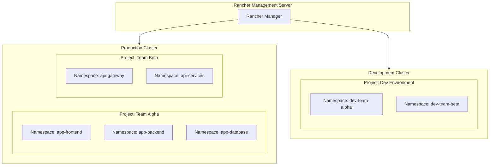
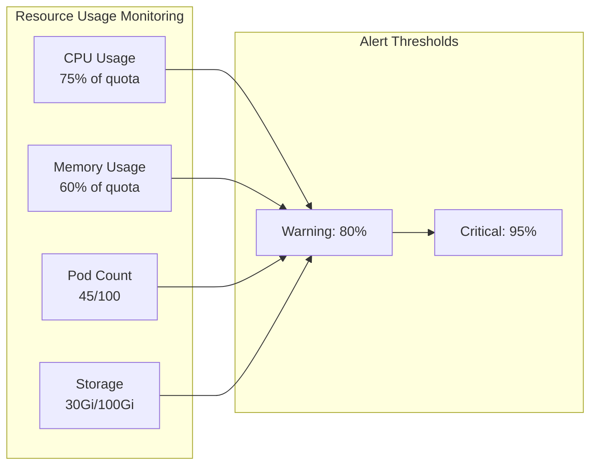
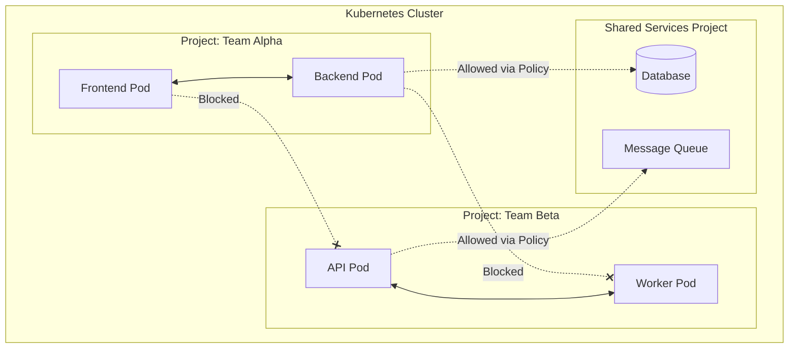
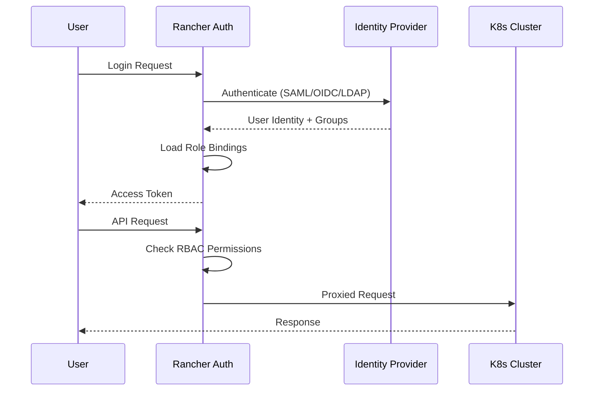
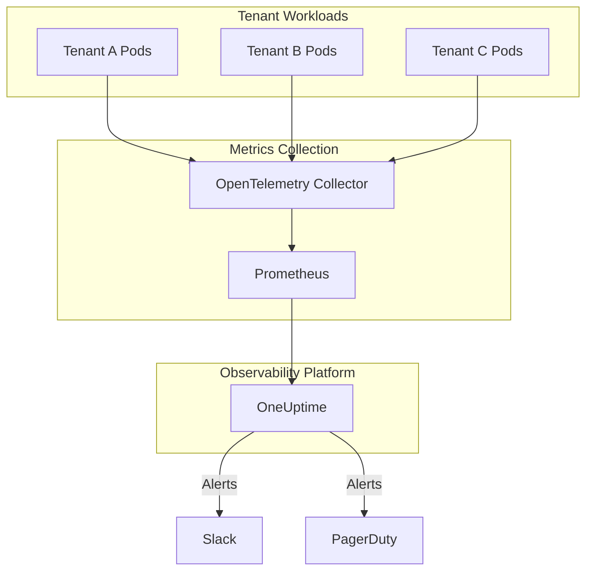

# How to Implement Rancher Multi-Tenancy

By [Nawaz Dhandala](https://github.com/nawazdhandala)

Tags: Kubernetes, Rancher, Multi-Tenancy, DevOps, Security, RBAC, Resource Management

Description: A comprehensive guide to implementing multi-tenancy in Rancher, covering projects and namespaces, resource quotas, network isolation, user management, and best practices for secure, scalable Kubernetes environments.

---

> "Multi-tenancy is not just about sharing resources; it is about creating boundaries that enable teams to work independently while maintaining security and governance at scale." - Kubernetes Community

Multi-tenancy in Rancher allows multiple teams, departments, or customers to share a single Kubernetes cluster while maintaining isolation, security, and resource fairness. This guide walks you through implementing a robust multi-tenant architecture using Rancher's powerful features.

## Understanding Rancher Multi-Tenancy Architecture

Rancher provides a hierarchical structure for organizing resources: Clusters contain Projects, and Projects contain Namespaces. This hierarchy enables fine-grained access control and resource management.



## Projects and Namespaces

Projects are Rancher-specific constructs that group multiple Kubernetes namespaces together. They provide a logical boundary for applying policies, quotas, and access controls.

### Creating a Project

Use the Rancher API or UI to create projects. Here is an example using kubectl with the Rancher CRD:

```yaml
# project.yaml
# Creates a new project in Rancher for Team Alpha
# Projects group namespaces and provide a boundary for RBAC and quotas
apiVersion: management.cattle.io/v3
kind: Project
metadata:
  # Generate a unique name - Rancher will assign the actual ID
  generateName: p-
  # Specify which cluster this project belongs to
  namespace: c-m-xxxxxxxx  # Replace with your cluster ID
spec:
  # Human-readable display name for the project
  displayName: "Team Alpha Production"
  # Optional description for documentation
  description: "Production workloads for Team Alpha"
  # Cluster ID where this project will be created
  clusterName: c-m-xxxxxxxx
  # Enable project network isolation (requires compatible CNI)
  enableProjectMonitoring: true
  # Container default resource limit (applied to pods without limits)
  containerDefaultResourceLimit:
    limitsCpu: "500m"
    limitsMemory: "512Mi"
    requestsCpu: "100m"
    requestsMemory: "128Mi"
```

### Creating Namespaces Within a Project

```yaml
# namespace.yaml
# Creates a namespace that belongs to a specific Rancher project
apiVersion: v1
kind: Namespace
metadata:
  name: team-alpha-frontend
  # Annotations link this namespace to a Rancher project
  annotations:
    # Project ID format: <cluster-id>:<project-id>
    field.cattle.io/projectId: "c-m-xxxxxxxx:p-xxxxx"
  labels:
    # Labels help identify the team and environment
    team: alpha
    environment: production
    # Rancher uses this label internally
    field.cattle.io/projectId: "p-xxxxx"
```

### Namespace Isolation Script

```bash
#!/bin/bash
# create-tenant-namespaces.sh
# Automates the creation of namespaces for a new tenant

# Configuration variables
CLUSTER_ID="c-m-xxxxxxxx"
PROJECT_ID="p-xxxxx"
TENANT_NAME="$1"
ENVIRONMENTS=("dev" "staging" "prod")

# Validate input
if [ -z "$TENANT_NAME" ]; then
    echo "Usage: $0 <tenant-name>"
    exit 1
fi

# Create namespaces for each environment
for ENV in "${ENVIRONMENTS[@]}"; do
    NAMESPACE_NAME="${TENANT_NAME}-${ENV}"

    echo "Creating namespace: $NAMESPACE_NAME"

    # Apply the namespace configuration
    kubectl apply -f - <<EOF
apiVersion: v1
kind: Namespace
metadata:
  name: $NAMESPACE_NAME
  annotations:
    field.cattle.io/projectId: "${CLUSTER_ID}:${PROJECT_ID}"
  labels:
    tenant: $TENANT_NAME
    environment: $ENV
    managed-by: rancher
EOF

done

echo "Namespaces created successfully for tenant: $TENANT_NAME"
```

## Resource Quotas

Resource quotas ensure fair resource distribution among tenants and prevent any single tenant from consuming all cluster resources.

### Project-Level Resource Quotas

```yaml
# project-resource-quota.yaml
# Defines resource limits at the project level
# These limits apply to the sum of all namespaces in the project
apiVersion: management.cattle.io/v3
kind: Project
metadata:
  name: p-team-alpha
  namespace: c-m-xxxxxxxx
spec:
  displayName: "Team Alpha"
  # Resource quota configuration for the entire project
  resourceQuota:
    # Hard limits that cannot be exceeded
    limit:
      # Maximum CPU across all namespaces in this project
      limitsCpu: "8000m"        # 8 CPU cores
      # Maximum memory across all namespaces
      limitsMemory: "16Gi"      # 16 GB RAM
      # Maximum number of pods
      pods: "100"
      # Maximum number of services
      services: "50"
      # Maximum number of secrets
      secrets: "100"
      # Maximum number of ConfigMaps
      configMaps: "100"
      # Maximum persistent volume claims
      persistentVolumeClaims: "20"
      # Maximum number of ReplicationControllers
      replicationControllers: "50"
      # Maximum storage requests
      requestsStorage: "100Gi"
  # Namespace default resource quota
  # Each new namespace gets these defaults unless overridden
  namespaceDefaultResourceQuota:
    limit:
      limitsCpu: "2000m"        # 2 CPU cores per namespace
      limitsMemory: "4Gi"       # 4 GB RAM per namespace
      pods: "25"                # 25 pods per namespace
```

### Namespace-Level Resource Quota

```yaml
# namespace-resource-quota.yaml
# Fine-grained quota for a specific namespace
apiVersion: v1
kind: ResourceQuota
metadata:
  name: team-alpha-frontend-quota
  namespace: team-alpha-frontend
spec:
  hard:
    # Compute resource limits
    requests.cpu: "2"           # Total CPU requests
    requests.memory: "4Gi"      # Total memory requests
    limits.cpu: "4"             # Total CPU limits
    limits.memory: "8Gi"        # Total memory limits

    # Object count limits
    pods: "20"                  # Maximum number of pods
    services: "10"              # Maximum number of services
    services.loadbalancers: "2" # Maximum LoadBalancer services
    services.nodeports: "5"     # Maximum NodePort services

    # Storage limits
    persistentvolumeclaims: "10"
    requests.storage: "50Gi"

    # Other object limits
    secrets: "20"
    configmaps: "20"
    replicationcontrollers: "10"
```

### Limit Ranges for Default Container Resources

```yaml
# limit-range.yaml
# Sets default and maximum resource limits for containers
# Ensures no single container can monopolize namespace resources
apiVersion: v1
kind: LimitRange
metadata:
  name: tenant-limit-range
  namespace: team-alpha-frontend
spec:
  limits:
    # Default limits for containers that don't specify their own
    - type: Container
      default:
        cpu: "500m"             # Default CPU limit
        memory: "512Mi"         # Default memory limit
      defaultRequest:
        cpu: "100m"             # Default CPU request
        memory: "128Mi"         # Default memory request
      max:
        cpu: "2"                # Maximum CPU any container can request
        memory: "4Gi"           # Maximum memory any container can request
      min:
        cpu: "50m"              # Minimum CPU (prevents tiny containers)
        memory: "64Mi"          # Minimum memory

    # Limits for persistent volume claims
    - type: PersistentVolumeClaim
      max:
        storage: "20Gi"         # Maximum PVC size
      min:
        storage: "1Gi"          # Minimum PVC size
```

### Resource Quota Monitoring Dashboard



## Network Isolation

Network policies ensure tenants cannot access each other's workloads, providing crucial security boundaries in a multi-tenant environment.

### Default Deny All Traffic Policy

```yaml
# default-deny-policy.yaml
# Blocks all ingress and egress traffic by default
# This is the foundation of zero-trust networking
apiVersion: networking.k8s.io/v1
kind: NetworkPolicy
metadata:
  name: default-deny-all
  namespace: team-alpha-frontend
spec:
  # Empty podSelector means this applies to ALL pods in the namespace
  podSelector: {}
  policyTypes:
    - Ingress
    - Egress
```

### Allow Intra-Namespace Communication

```yaml
# allow-same-namespace.yaml
# Permits pods within the same namespace to communicate
# Essential for microservices that need to talk to each other
apiVersion: networking.k8s.io/v1
kind: NetworkPolicy
metadata:
  name: allow-same-namespace
  namespace: team-alpha-frontend
spec:
  podSelector: {}
  policyTypes:
    - Ingress
    - Egress
  ingress:
    # Allow traffic from pods in the same namespace
    - from:
        - podSelector: {}
  egress:
    # Allow traffic to pods in the same namespace
    - to:
        - podSelector: {}
```

### Allow DNS Resolution

```yaml
# allow-dns.yaml
# Permits DNS lookups to kube-dns/CoreDNS
# Without this, pods cannot resolve service names
apiVersion: networking.k8s.io/v1
kind: NetworkPolicy
metadata:
  name: allow-dns
  namespace: team-alpha-frontend
spec:
  podSelector: {}
  policyTypes:
    - Egress
  egress:
    # Allow DNS queries to kube-system namespace
    - to:
        - namespaceSelector:
            matchLabels:
              kubernetes.io/metadata.name: kube-system
      ports:
        - protocol: UDP
          port: 53
        - protocol: TCP
          port: 53
```

### Project-Level Network Isolation

Rancher can automatically create network policies for project isolation:

```yaml
# project-network-policy.yaml
# Rancher's project network isolation feature
# Automatically isolates projects from each other
apiVersion: management.cattle.io/v3
kind: Project
metadata:
  name: p-team-alpha
  namespace: c-m-xxxxxxxx
spec:
  displayName: "Team Alpha"
  # Enable automatic network policy generation
  # This creates policies that only allow traffic within the project
  resourceQuota:
    limit:
      limitsCpu: "8000m"
      limitsMemory: "16Gi"
```

### Cross-Project Communication Policy

```yaml
# allow-cross-project.yaml
# Allows specific cross-project communication when needed
# Example: Frontend project accessing shared API gateway
apiVersion: networking.k8s.io/v1
kind: NetworkPolicy
metadata:
  name: allow-api-gateway-access
  namespace: shared-services
spec:
  podSelector:
    matchLabels:
      app: api-gateway
  policyTypes:
    - Ingress
  ingress:
    # Allow traffic from Team Alpha's frontend namespace
    - from:
        - namespaceSelector:
            matchLabels:
              field.cattle.io/projectId: "p-team-alpha"
          podSelector:
            matchLabels:
              app: frontend
      ports:
        - protocol: TCP
          port: 8080
```

### Network Isolation Architecture



## User Management

Rancher provides comprehensive RBAC (Role-Based Access Control) for managing user access across clusters, projects, and namespaces.

### Global Roles

```yaml
# global-role.yaml
# Defines cluster-wide permissions for administrators
apiVersion: management.cattle.io/v3
kind: GlobalRole
metadata:
  name: tenant-admin
spec:
  displayName: "Tenant Administrator"
  description: "Can manage assigned projects and users within those projects"
  # Rules define what actions are permitted
  rules:
    # Allow managing projects
    - apiGroups: ["management.cattle.io"]
      resources: ["projects"]
      verbs: ["get", "list", "watch", "create", "update", "delete"]
    # Allow managing project members
    - apiGroups: ["management.cattle.io"]
      resources: ["projectroletemplatebindings"]
      verbs: ["get", "list", "watch", "create", "update", "delete"]
    # Allow viewing clusters (read-only)
    - apiGroups: ["management.cattle.io"]
      resources: ["clusters"]
      verbs: ["get", "list", "watch"]
```

### Project Role Templates

```yaml
# project-role-template.yaml
# Custom role for project developers
apiVersion: management.cattle.io/v3
kind: RoleTemplate
metadata:
  name: project-developer
spec:
  displayName: "Project Developer"
  description: "Can deploy and manage applications within the project"
  # Context determines where this role can be applied
  context: project
  # Rules specify permitted actions
  rules:
    # Full access to deployments
    - apiGroups: ["apps"]
      resources: ["deployments", "replicasets", "statefulsets", "daemonsets"]
      verbs: ["get", "list", "watch", "create", "update", "patch", "delete"]
    # Full access to core resources
    - apiGroups: [""]
      resources: ["pods", "services", "configmaps", "secrets", "persistentvolumeclaims"]
      verbs: ["get", "list", "watch", "create", "update", "patch", "delete"]
    # Read-only access to events and logs
    - apiGroups: [""]
      resources: ["events", "pods/log"]
      verbs: ["get", "list", "watch"]
    # Access to ingresses
    - apiGroups: ["networking.k8s.io"]
      resources: ["ingresses"]
      verbs: ["get", "list", "watch", "create", "update", "patch", "delete"]
```

### Project Role Bindings

```yaml
# project-role-binding.yaml
# Assigns a user to a project with specific permissions
apiVersion: management.cattle.io/v3
kind: ProjectRoleTemplateBinding
metadata:
  # Generate unique name
  generateName: prtb-
  namespace: p-team-alpha
spec:
  # Reference to the project
  projectName: "c-m-xxxxxxxx:p-team-alpha"
  # Role template to assign
  roleTemplateName: project-developer
  # User or group to bind (choose one)
  # For individual user:
  userPrincipalName: "local://user-xxxxx"
  # For group (from external auth provider):
  # groupPrincipalName: "github_org://myorg/team-alpha-devs"
```

### Authentication Provider Integration

```yaml
# auth-config.yaml
# Example GitHub authentication configuration
apiVersion: management.cattle.io/v3
kind: AuthConfig
metadata:
  name: github
spec:
  enabled: true
  # GitHub organization for access control
  allowedPrincipalIds:
    - "github_org://mycompany"
  # Map GitHub teams to Rancher roles
  # This is typically done via the UI or additional CRDs
```

### User Access Flow



### Namespace-Level RBAC

```yaml
# namespace-rolebinding.yaml
# Fine-grained access control at namespace level
apiVersion: rbac.authorization.k8s.io/v1
kind: RoleBinding
metadata:
  name: team-alpha-developers
  namespace: team-alpha-frontend
subjects:
  # Bind to a group from the identity provider
  - kind: Group
    name: "team-alpha-devs"
    apiGroup: rbac.authorization.k8s.io
roleRef:
  kind: ClusterRole
  name: edit  # Built-in Kubernetes role
  apiGroup: rbac.authorization.k8s.io
---
# Read-only access for QA team
apiVersion: rbac.authorization.k8s.io/v1
kind: RoleBinding
metadata:
  name: team-alpha-qa-viewers
  namespace: team-alpha-frontend
subjects:
  - kind: Group
    name: "qa-team"
    apiGroup: rbac.authorization.k8s.io
roleRef:
  kind: ClusterRole
  name: view  # Built-in read-only role
  apiGroup: rbac.authorization.k8s.io
```

## Complete Multi-Tenancy Setup

Here is a complete example that brings all components together for a new tenant:

```yaml
# complete-tenant-setup.yaml
# Full configuration for onboarding a new tenant
---
# 1. Create the Project
apiVersion: management.cattle.io/v3
kind: Project
metadata:
  generateName: p-
  namespace: c-m-xxxxxxxx
spec:
  displayName: "Acme Corporation"
  description: "Production workloads for Acme Corporation"
  clusterName: c-m-xxxxxxxx
  # Resource quota for the entire project
  resourceQuota:
    limit:
      limitsCpu: "16000m"
      limitsMemory: "32Gi"
      pods: "200"
      services: "100"
      secrets: "200"
      configMaps: "200"
      persistentVolumeClaims: "50"
      requestsStorage: "500Gi"
  # Default quota for each namespace
  namespaceDefaultResourceQuota:
    limit:
      limitsCpu: "4000m"
      limitsMemory: "8Gi"
      pods: "50"
  # Default container resource limits
  containerDefaultResourceLimit:
    limitsCpu: "1000m"
    limitsMemory: "1Gi"
    requestsCpu: "200m"
    requestsMemory: "256Mi"
---
# 2. Create Production Namespace
apiVersion: v1
kind: Namespace
metadata:
  name: acme-production
  labels:
    tenant: acme
    environment: production
---
# 3. Create Staging Namespace
apiVersion: v1
kind: Namespace
metadata:
  name: acme-staging
  labels:
    tenant: acme
    environment: staging
---
# 4. Default Deny Network Policy for Production
apiVersion: networking.k8s.io/v1
kind: NetworkPolicy
metadata:
  name: default-deny-all
  namespace: acme-production
spec:
  podSelector: {}
  policyTypes:
    - Ingress
    - Egress
---
# 5. Allow Same-Namespace Communication
apiVersion: networking.k8s.io/v1
kind: NetworkPolicy
metadata:
  name: allow-same-namespace
  namespace: acme-production
spec:
  podSelector: {}
  policyTypes:
    - Ingress
    - Egress
  ingress:
    - from:
        - podSelector: {}
  egress:
    - to:
        - podSelector: {}
---
# 6. Allow DNS
apiVersion: networking.k8s.io/v1
kind: NetworkPolicy
metadata:
  name: allow-dns
  namespace: acme-production
spec:
  podSelector: {}
  policyTypes:
    - Egress
  egress:
    - to:
        - namespaceSelector:
            matchLabels:
              kubernetes.io/metadata.name: kube-system
      ports:
        - protocol: UDP
          port: 53
        - protocol: TCP
          port: 53
---
# 7. Limit Range
apiVersion: v1
kind: LimitRange
metadata:
  name: resource-limits
  namespace: acme-production
spec:
  limits:
    - type: Container
      default:
        cpu: "500m"
        memory: "512Mi"
      defaultRequest:
        cpu: "100m"
        memory: "128Mi"
      max:
        cpu: "4"
        memory: "8Gi"
      min:
        cpu: "50m"
        memory: "64Mi"
```

### Tenant Onboarding Automation Script

```bash
#!/bin/bash
# onboard-tenant.sh
# Automates complete tenant onboarding process

set -e

# Configuration
TENANT_NAME="$1"
CLUSTER_ID="${2:-c-m-xxxxxxxx}"
CPU_QUOTA="${3:-16000m}"
MEMORY_QUOTA="${4:-32Gi}"

if [ -z "$TENANT_NAME" ]; then
    echo "Usage: $0 <tenant-name> [cluster-id] [cpu-quota] [memory-quota]"
    exit 1
fi

echo "=== Onboarding Tenant: $TENANT_NAME ==="

# Generate project manifest
cat > /tmp/${TENANT_NAME}-project.yaml <<EOF
apiVersion: management.cattle.io/v3
kind: Project
metadata:
  generateName: p-
  namespace: ${CLUSTER_ID}
spec:
  displayName: "${TENANT_NAME}"
  clusterName: ${CLUSTER_ID}
  resourceQuota:
    limit:
      limitsCpu: "${CPU_QUOTA}"
      limitsMemory: "${MEMORY_QUOTA}"
      pods: "200"
EOF

# Create the project
echo "Creating project..."
kubectl apply -f /tmp/${TENANT_NAME}-project.yaml

# Wait for project to be ready
sleep 5

# Get project ID (in real scenario, parse from kubectl output)
PROJECT_ID=$(kubectl get projects.management.cattle.io -n ${CLUSTER_ID} \
    -o jsonpath='{.items[?(@.spec.displayName=="'"${TENANT_NAME}"'")].metadata.name}')

echo "Project created with ID: $PROJECT_ID"

# Create namespaces
for ENV in production staging development; do
    NS_NAME="${TENANT_NAME,,}-${ENV}"  # lowercase
    echo "Creating namespace: $NS_NAME"

    kubectl apply -f - <<EOF
apiVersion: v1
kind: Namespace
metadata:
  name: $NS_NAME
  annotations:
    field.cattle.io/projectId: "${CLUSTER_ID}:${PROJECT_ID}"
  labels:
    tenant: ${TENANT_NAME,,}
    environment: $ENV
EOF

    # Apply network policies
    kubectl apply -f - <<EOF
apiVersion: networking.k8s.io/v1
kind: NetworkPolicy
metadata:
  name: default-deny-all
  namespace: $NS_NAME
spec:
  podSelector: {}
  policyTypes:
    - Ingress
    - Egress
---
apiVersion: networking.k8s.io/v1
kind: NetworkPolicy
metadata:
  name: allow-dns
  namespace: $NS_NAME
spec:
  podSelector: {}
  policyTypes:
    - Egress
  egress:
    - to:
        - namespaceSelector:
            matchLabels:
              kubernetes.io/metadata.name: kube-system
      ports:
        - protocol: UDP
          port: 53
        - protocol: TCP
          port: 53
EOF
done

echo "=== Tenant Onboarding Complete ==="
echo "Project: $TENANT_NAME ($PROJECT_ID)"
echo "Namespaces: ${TENANT_NAME,,}-production, ${TENANT_NAME,,}-staging, ${TENANT_NAME,,}-development"
```

## Monitoring Multi-Tenant Environments

Effective monitoring is critical for managing multi-tenant Kubernetes environments. You need visibility into resource usage, security events, and tenant health.

### Multi-Tenancy Monitoring Architecture



For comprehensive monitoring of your Rancher multi-tenant environment, [OneUptime](https://oneuptime.com) provides unified observability across all tenants. With OneUptime, you can:

- Monitor resource quota utilization per tenant
- Track network policy violations and security events
- Set up alerts for tenant-specific SLOs
- Create tenant-isolated dashboards
- Collect logs, metrics, and traces with OpenTelemetry

## Best Practices Summary

1. **Always start with default-deny network policies** - Add explicit allow rules for required communication paths.

2. **Use project-level resource quotas** - Prevent any single tenant from consuming all cluster resources.

3. **Implement least-privilege RBAC** - Give users only the permissions they need.

4. **Automate tenant onboarding** - Use scripts or GitOps to ensure consistent configuration.

5. **Monitor quota usage proactively** - Alert before tenants hit their limits.

6. **Document tenant boundaries** - Maintain clear documentation of what each tenant can and cannot access.

7. **Regular security audits** - Review RBAC bindings and network policies periodically.

8. **Use namespaces as the isolation boundary** - Each tenant's workloads should run in dedicated namespaces.

---

Multi-tenancy in Rancher enables you to maximize cluster utilization while maintaining security and governance. By combining projects, namespaces, resource quotas, network policies, and RBAC, you can build a robust platform that serves multiple teams or customers from shared infrastructure. Start with strong isolation defaults and relax them only when explicitly needed.
