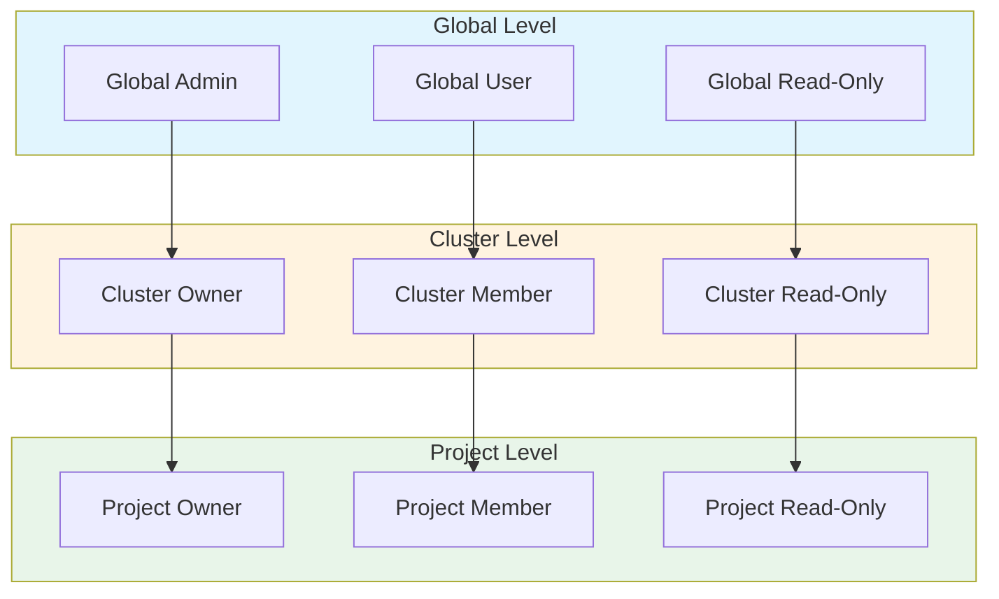
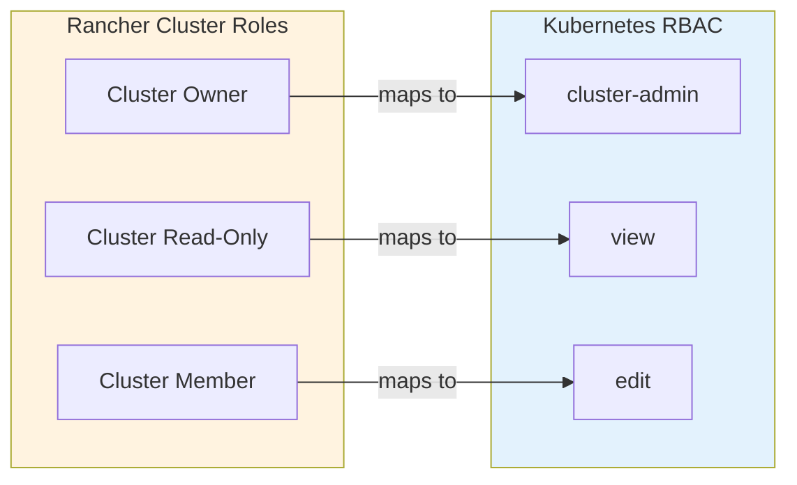
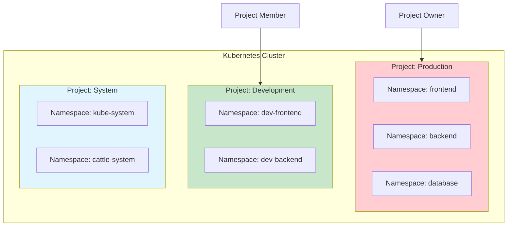
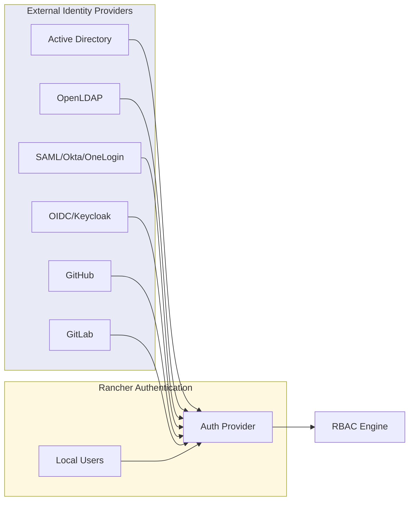
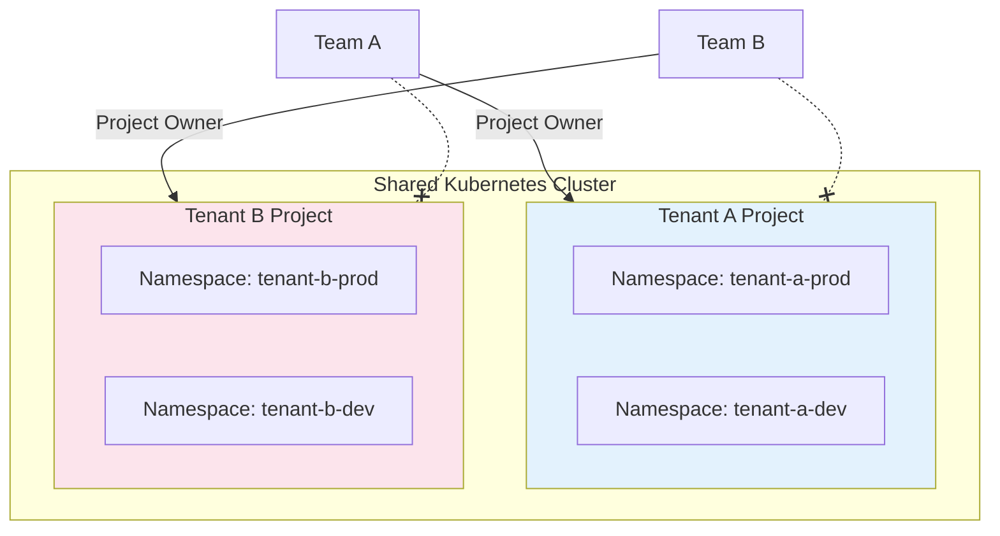

# How to Configure Rancher RBAC

Author: [nawazdhandala](https://www.github.com/nawazdhandala)

Tags: Rancher, RBAC, Kubernetes, Security, Access Control, DevOps, Multi-Cluster

Description: A comprehensive guide to configuring Role-Based Access Control (RBAC) in Rancher, covering global roles, cluster roles, project permissions, custom roles, and user authentication strategies.

---

> "Security is not a product, but a process." - Bruce Schneier

Rancher provides a powerful RBAC system that extends Kubernetes' native RBAC with additional layers for multi-cluster and multi-tenant environments. This guide walks you through configuring RBAC at every level, from global permissions to project-specific access.

## Understanding Rancher's RBAC Hierarchy

Rancher's RBAC operates at three distinct levels, each building upon the next. Understanding this hierarchy is crucial for implementing effective access control.



### Key Concepts

- **Global Roles**: Control access across all Rancher-managed resources
- **Cluster Roles**: Define permissions within a specific Kubernetes cluster
- **Project Roles**: Manage access to namespaces grouped within a project

## Global Roles

Global roles define what users can do across the entire Rancher installation. These are the broadest permissions and should be assigned carefully.

### Built-in Global Roles

Rancher ships with several predefined global roles:

```yaml
# Example: Viewing global roles via kubectl
# Connect to the local (Rancher management) cluster
apiVersion: management.cattle.io/v3
kind: GlobalRole
metadata:
  name: admin
rules:
  # Full administrative access to all Rancher resources
  - apiGroups: ["*"]
    resources: ["*"]
    verbs: ["*"]
---
apiVersion: management.cattle.io/v3
kind: GlobalRole
metadata:
  name: user
rules:
  # Can create new clusters and manage owned resources
  - apiGroups: ["management.cattle.io"]
    resources: ["clusters"]
    verbs: ["create"]
  - apiGroups: ["management.cattle.io"]
    resources: ["templates", "templateversions"]
    verbs: ["get", "list", "watch"]
---
apiVersion: management.cattle.io/v3
kind: GlobalRole
metadata:
  name: user-base
rules:
  # Minimal permissions for authenticated users
  - apiGroups: ["management.cattle.io"]
    resources: ["preferences"]
    verbs: ["*"]
  - apiGroups: ["management.cattle.io"]
    resources: ["settings"]
    verbs: ["get", "list", "watch"]
```

### Assigning Global Roles

You can assign global roles through the Rancher UI or via kubectl:

```yaml
# GlobalRoleBinding: Assign the 'user' global role to a specific user
apiVersion: management.cattle.io/v3
kind: GlobalRoleBinding
metadata:
  # Name follows pattern: grb-<random-id>
  name: grb-user-john
globalRoleName: user
userName: u-xxxx  # Rancher internal user ID
---
# GlobalRoleBinding: Assign global role to a group (from external auth)
apiVersion: management.cattle.io/v3
kind: GlobalRoleBinding
metadata:
  name: grb-devops-team
globalRoleName: user
groupPrincipalName: okta_group://devops-team
```

### Creating Custom Global Roles

For organizations needing fine-grained control, create custom global roles:

```yaml
# Custom Global Role: Cluster Creator
# Allows users to create clusters but not manage global settings
apiVersion: management.cattle.io/v3
kind: GlobalRole
metadata:
  name: cluster-creator
  labels:
    cattle.io/creator: custom
rules:
  # Permission to create and manage their own clusters
  - apiGroups: ["management.cattle.io"]
    resources: ["clusters"]
    verbs: ["create", "get", "list", "watch"]
  # Permission to use cluster templates
  - apiGroups: ["management.cattle.io"]
    resources: ["clustertemplates", "clustertemplaterevisions"]
    verbs: ["get", "list", "watch"]
  # Permission to view node drivers and cloud credentials
  - apiGroups: ["management.cattle.io"]
    resources: ["nodedrivers", "kontainerdrivers"]
    verbs: ["get", "list", "watch"]
  - apiGroups: ["management.cattle.io"]
    resources: ["cloudcredentials"]
    verbs: ["create", "get", "list", "watch", "update", "delete"]
```

## Cluster Roles

Cluster roles define permissions within a specific Kubernetes cluster managed by Rancher. These map closely to Kubernetes' native RBAC but with Rancher-specific extensions.



### Built-in Cluster Roles

```yaml
# Cluster Owner Role
# Full administrative access to the cluster
apiVersion: management.cattle.io/v3
kind: ClusterRoleTemplateBinding
metadata:
  name: crtb-owner-jane
  namespace: c-xxxxx  # Cluster ID namespace
clusterRoleTemplateName: cluster-owner
userPrincipalName: local://u-yyyy
---
# Cluster Member Role
# Can manage workloads and projects, but not cluster-level resources
apiVersion: management.cattle.io/v3
kind: ClusterRoleTemplateBinding
metadata:
  name: crtb-member-team
  namespace: c-xxxxx
clusterRoleTemplateName: cluster-member
groupPrincipalName: ldap_group://cn=developers,ou=groups,dc=company,dc=com
```

### Creating Custom Cluster Roles

Define custom cluster roles for specific use cases:

```yaml
# Custom Cluster Role: Namespace Admin
# Can create and manage namespaces but not cluster-wide resources
apiVersion: management.cattle.io/v3
kind: RoleTemplate
metadata:
  name: namespace-admin
context: cluster  # This is a cluster-level role
rules:
  # Full control over namespaces
  - apiGroups: [""]
    resources: ["namespaces"]
    verbs: ["*"]
  # View cluster-level resources
  - apiGroups: [""]
    resources: ["nodes", "persistentvolumes"]
    verbs: ["get", "list", "watch"]
  # Manage resource quotas
  - apiGroups: [""]
    resources: ["resourcequotas"]
    verbs: ["*"]
  # View storage classes
  - apiGroups: ["storage.k8s.io"]
    resources: ["storageclasses"]
    verbs: ["get", "list", "watch"]
---
# Custom Cluster Role: Security Auditor
# Read-only access to security-relevant resources
apiVersion: management.cattle.io/v3
kind: RoleTemplate
metadata:
  name: security-auditor
context: cluster
rules:
  # View all pods and their security contexts
  - apiGroups: [""]
    resources: ["pods", "pods/log"]
    verbs: ["get", "list", "watch"]
  # View RBAC configuration
  - apiGroups: ["rbac.authorization.k8s.io"]
    resources: ["roles", "rolebindings", "clusterroles", "clusterrolebindings"]
    verbs: ["get", "list", "watch"]
  # View network policies
  - apiGroups: ["networking.k8s.io"]
    resources: ["networkpolicies"]
    verbs: ["get", "list", "watch"]
  # View pod security policies (if enabled)
  - apiGroups: ["policy"]
    resources: ["podsecuritypolicies"]
    verbs: ["get", "list", "watch"]
  # View secrets metadata (not contents)
  - apiGroups: [""]
    resources: ["secrets"]
    verbs: ["list"]
```

## Project-Level Permissions

Projects in Rancher are a collection of namespaces with shared access control. This is where most day-to-day permissions are managed.



### Assigning Project Roles

```yaml
# Project Role Template Binding: Assign project owner
apiVersion: management.cattle.io/v3
kind: ProjectRoleTemplateBinding
metadata:
  name: prtb-owner-alice
  namespace: p-xxxxx  # Project ID namespace
projectName: c-xxxxx:p-xxxxx  # cluster:project format
roleTemplateName: project-owner
userPrincipalName: github_user://12345
---
# Project Role Template Binding: Assign project member to a group
apiVersion: management.cattle.io/v3
kind: ProjectRoleTemplateBinding
metadata:
  name: prtb-member-frontend-team
  namespace: p-xxxxx
projectName: c-xxxxx:p-xxxxx
roleTemplateName: project-member
groupPrincipalName: azure_group://frontend-developers
```

### Custom Project Roles

```yaml
# Custom Project Role: Deployment Manager
# Can manage deployments but not other workload types
apiVersion: management.cattle.io/v3
kind: RoleTemplate
metadata:
  name: deployment-manager
context: project  # This is a project-level role
rules:
  # Full control over deployments
  - apiGroups: ["apps"]
    resources: ["deployments", "deployments/scale"]
    verbs: ["*"]
  # View-only for other workloads
  - apiGroups: ["apps"]
    resources: ["statefulsets", "daemonsets", "replicasets"]
    verbs: ["get", "list", "watch"]
  # Manage ConfigMaps and Secrets for app configuration
  - apiGroups: [""]
    resources: ["configmaps", "secrets"]
    verbs: ["*"]
  # View services and endpoints
  - apiGroups: [""]
    resources: ["services", "endpoints"]
    verbs: ["get", "list", "watch"]
  # View pods and logs for debugging
  - apiGroups: [""]
    resources: ["pods", "pods/log"]
    verbs: ["get", "list", "watch"]
---
# Custom Project Role: Log Viewer
# Read-only access to pods and their logs
apiVersion: management.cattle.io/v3
kind: RoleTemplate
metadata:
  name: log-viewer
context: project
rules:
  # View pods
  - apiGroups: [""]
    resources: ["pods"]
    verbs: ["get", "list", "watch"]
  # Access pod logs
  - apiGroups: [""]
    resources: ["pods/log"]
    verbs: ["get", "list", "watch"]
  # View events for troubleshooting
  - apiGroups: [""]
    resources: ["events"]
    verbs: ["get", "list", "watch"]
```

## User Authentication

Rancher supports multiple authentication providers. Configure these to integrate with your existing identity management system.

### Supported Authentication Providers



### Configuring Active Directory

```yaml
# Active Directory Configuration
# Applied via Rancher UI or API
apiVersion: management.cattle.io/v3
kind: AuthConfig
metadata:
  name: activedirectory
enabled: true
type: activeDirectoryConfig
servers:
  - ldaps://ad.company.com:636
serviceAccountUsername: cn=rancher-svc,ou=service-accounts,dc=company,dc=com
serviceAccountPassword: <encoded-password>
defaultLoginDomain: COMPANY
userSearchBase: ou=users,dc=company,dc=com
userSearchFilter: (objectClass=person)
userLoginAttribute: sAMAccountName
userNameAttribute: name
userMemberAttribute: memberOf
groupSearchBase: ou=groups,dc=company,dc=com
groupSearchFilter: (objectClass=group)
groupNameAttribute: name
groupMemberUserAttribute: distinguishedName
groupMemberMappingAttribute: member
```

### Configuring OIDC (Keycloak Example)

```yaml
# OIDC Configuration for Keycloak
apiVersion: management.cattle.io/v3
kind: AuthConfig
metadata:
  name: oidc
enabled: true
type: oidcConfig
# Keycloak realm endpoint
issuer: https://keycloak.company.com/realms/rancher
clientId: rancher-client
clientSecret: <encoded-secret>
# Rancher callback URL
rancherUrl: https://rancher.company.com
# Scopes to request
scope: openid profile email groups
# Map Keycloak groups to Rancher
groupsClaim: groups
```

### Configuring GitHub Authentication

```yaml
# GitHub Organization Authentication
apiVersion: management.cattle.io/v3
kind: AuthConfig
metadata:
  name: github
enabled: true
type: githubConfig
hostname: github.com  # Or your GitHub Enterprise hostname
clientId: <github-oauth-app-client-id>
clientSecret: <encoded-secret>
# Restrict to specific organizations
allowedOrganizations:
  - your-company-org
# Enable team-based access
allowedTeams:
  - your-company-org:platform-team
  - your-company-org:developers
```

## Advanced RBAC Patterns

### Pattern 1: Environment-Based Access

Separate permissions by environment using projects:

```yaml
# Create role template for production read-only
apiVersion: management.cattle.io/v3
kind: RoleTemplate
metadata:
  name: prod-readonly
context: project
rules:
  - apiGroups: ["*"]
    resources: ["*"]
    verbs: ["get", "list", "watch"]
---
# Create role template for staging full access
apiVersion: management.cattle.io/v3
kind: RoleTemplate
metadata:
  name: staging-admin
context: project
rules:
  - apiGroups: ["*"]
    resources: ["*"]
    verbs: ["*"]
```

### Pattern 2: Multi-Tenant Cluster Isolation



```yaml
# Configure resource quotas per tenant project
apiVersion: management.cattle.io/v3
kind: Project
metadata:
  name: p-tenant-a
  namespace: c-xxxxx
spec:
  displayName: Tenant A
  clusterName: c-xxxxx
  resourceQuota:
    limit:
      # Limit resources available to this tenant
      limitsCpu: "10"
      limitsMemory: "20Gi"
      requestsCpu: "5"
      requestsMemory: "10Gi"
      pods: "100"
      services: "20"
      persistentVolumeClaims: "10"
  namespaceDefaultResourceQuota:
    limit:
      # Default limits for new namespaces in this project
      limitsCpu: "2"
      limitsMemory: "4Gi"
      pods: "20"
```

### Pattern 3: Break-Glass Emergency Access

```yaml
# Emergency Admin Role - for incident response
apiVersion: management.cattle.io/v3
kind: RoleTemplate
metadata:
  name: emergency-admin
  annotations:
    description: "Emergency access for incident response. Usage is audited."
context: cluster
rules:
  - apiGroups: ["*"]
    resources: ["*"]
    verbs: ["*"]
---
# Time-limited binding (manually remove after incident)
apiVersion: management.cattle.io/v3
kind: ClusterRoleTemplateBinding
metadata:
  name: emergency-access-incident-1234
  namespace: c-xxxxx
  annotations:
    incident-id: "1234"
    expires: "2026-01-28T00:00:00Z"
    approved-by: "security-team"
clusterRoleTemplateName: emergency-admin
userPrincipalName: local://u-oncall
```

## Auditing RBAC Configuration

### List All Role Bindings

```bash
#!/bin/bash
# Script to audit RBAC configuration across all clusters

# List global role bindings
echo "=== Global Role Bindings ==="
kubectl get globalrolebindings.management.cattle.io -o custom-columns=\
NAME:.metadata.name,\
ROLE:.globalRoleName,\
USER:.userName,\
GROUP:.groupPrincipalName

# List cluster role bindings for each cluster
echo -e "\n=== Cluster Role Bindings ==="
for cluster in $(kubectl get clusters.management.cattle.io -o jsonpath='{.items[*].metadata.name}'); do
  echo "Cluster: $cluster"
  kubectl get clusterroletemplatebindings.management.cattle.io \
    -n $cluster -o custom-columns=\
NAME:.metadata.name,\
ROLE:.clusterRoleTemplateName,\
USER:.userPrincipalName,\
GROUP:.groupPrincipalName
done

# List project role bindings
echo -e "\n=== Project Role Bindings ==="
for project in $(kubectl get projects.management.cattle.io -A -o jsonpath='{.items[*].metadata.name}'); do
  echo "Project: $project"
  kubectl get projectroletemplatebindings.management.cattle.io \
    -n $project -o custom-columns=\
NAME:.metadata.name,\
ROLE:.roleTemplateName,\
USER:.userPrincipalName,\
GROUP:.groupPrincipalName 2>/dev/null || echo "No bindings found"
done
```

### Enable Audit Logging

Configure Rancher to log all RBAC-related API calls:

```yaml
# Rancher Helm values for audit logging
auditLog:
  level: 2  # 0=off, 1=metadata, 2=request, 3=request+response
  maxAge: 30
  maxBackup: 10
  maxSize: 100
  destination: sidecar  # or 'hostPath'
  # Format: json for machine parsing
  format: json
  # Path if using hostPath
  path: /var/log/rancher/audit
```

## RBAC Best Practices Checklist

- [ ] Use groups from external auth providers instead of individual user bindings
- [ ] Apply principle of least privilege - start with minimal permissions
- [ ] Create custom roles for specific job functions rather than using built-in broad roles
- [ ] Implement project-level isolation for multi-tenant clusters
- [ ] Enable audit logging and regularly review access patterns
- [ ] Document all custom roles with clear descriptions
- [ ] Implement a process for periodic access reviews
- [ ] Use resource quotas alongside RBAC for defense in depth
- [ ] Test role changes in a non-production environment first
- [ ] Maintain an emergency access procedure with proper auditing

## Monitoring RBAC with OneUptime

Effective RBAC configuration is only part of the security story. You need continuous monitoring to detect unauthorized access attempts and configuration drift. [OneUptime](https://oneuptime.com) provides comprehensive observability for your Kubernetes and Rancher infrastructure.

With OneUptime, you can:

- Monitor Rancher API availability and response times
- Set up alerts for authentication failures and unauthorized access attempts
- Track RBAC configuration changes through audit log analysis
- Create dashboards showing access patterns across your clusters
- Receive instant notifications when security-relevant events occur

---

Rancher's RBAC system provides the flexibility to implement sophisticated access control for even the most complex multi-cluster environments. Start with the built-in roles, then gradually create custom roles as your organization's needs become clearer. Remember: it's easier to grant additional permissions than to revoke them after a security incident.
