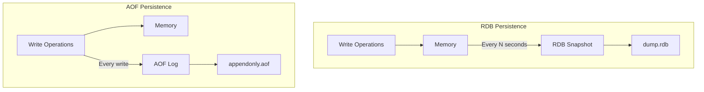
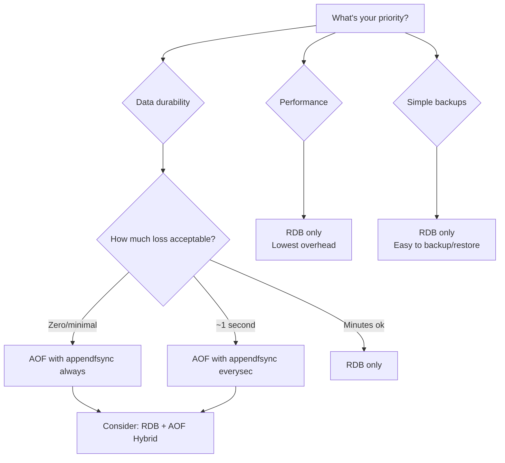

# How to Choose Between RDB and AOF Persistence in Redis

Author: [nawazdhandala](https://www.github.com/nawazdhandala)

Tags: Redis, Persistence, RDB, AOF, Data Durability, DevOps

Description: Learn the differences between Redis RDB snapshots and AOF append-only files to choose the right persistence strategy for your use case. This guide covers configuration, trade-offs, and hybrid approaches.

---

Redis is an in-memory database, but that does not mean your data disappears when the server restarts. Redis offers two persistence mechanisms: RDB (point-in-time snapshots) and AOF (append-only file logging). Choosing between them depends on your durability requirements, performance needs, and recovery time objectives.

## Understanding the Two Approaches

**RDB (Redis Database)**: Creates point-in-time snapshots of your dataset at specified intervals. Think of it like taking a photo of your data every few minutes.

**AOF (Append Only File)**: Logs every write operation to a file. On restart, Redis replays these operations to rebuild the dataset. Think of it like a transaction log.



## RDB Persistence

RDB creates compact, single-file backups perfect for disaster recovery. A background process (fork) creates the snapshot while the main process continues serving requests.

### RDB Configuration

```bash
# redis.conf - RDB settings

# Enable RDB
# Format: save <seconds> <changes>
# Snapshot if at least <changes> keys changed in <seconds>
save 900 1      # Save after 15 min if at least 1 key changed
save 300 10     # Save after 5 min if at least 10 keys changed
save 60 10000   # Save after 1 min if at least 10000 keys changed

# To disable RDB completely:
# save ""

# RDB filename
dbfilename dump.rdb

# Directory for RDB and AOF files
dir /var/lib/redis

# Compress RDB files (recommended)
rdbcompression yes

# Include checksum in RDB files
rdbchecksum yes

# Stop accepting writes if RDB save fails
# Alerts you to disk problems
stop-writes-on-bgsave-error yes
```

### RDB Advantages and Disadvantages

| Advantages | Disadvantages |
|------------|---------------|
| Compact single file | Data loss between snapshots |
| Perfect for backups | Fork can be slow with large datasets |
| Fast restarts | Memory spike during fork (copy-on-write) |
| Low performance impact | Not suitable for minimal data loss requirements |

### Triggering Manual Snapshots

```bash
# Background save (non-blocking)
redis-cli BGSAVE

# Foreground save (blocks all operations)
redis-cli SAVE

# Get last save timestamp
redis-cli LASTSAVE

# Check background save status
redis-cli INFO persistence
```

## AOF Persistence

AOF logs every write command, providing better durability than RDB. You can configure how often the log is synced to disk.

### AOF Configuration

```bash
# redis.conf - AOF settings

# Enable AOF
appendonly yes

# AOF filename
appendfilename "appendonly.aof"

# Fsync policy - how often to sync to disk
# Options:
# - always: Sync after every write (slowest, safest)
# - everysec: Sync every second (good balance)
# - no: Let OS decide when to sync (fastest, least safe)
appendfsync everysec

# Prevent fsync during rewrite (improves performance, slight risk)
no-appendfsync-on-rewrite no

# Auto-rewrite AOF when it grows by this percentage
auto-aof-rewrite-percentage 100

# Minimum size for auto-rewrite
auto-aof-rewrite-min-size 64mb

# Load truncated AOF on startup (vs refusing to start)
aof-load-truncated yes

# Use RDB preamble in AOF for faster rewrites (Redis 4.0+)
aof-use-rdb-preamble yes
```

### AOF Advantages and Disadvantages

| Advantages | Disadvantages |
|------------|---------------|
| Minimal data loss (1 second max) | Larger files than RDB |
| Human-readable log | Slower restarts (replay operations) |
| Automatic rewriting | Higher disk I/O |
| Recovery from partial writes | Can be slower than RDB for writes |

### AOF Rewriting

Over time, AOF files grow large with redundant operations. Redis rewrites the AOF to create a minimal version.

```bash
# Trigger manual AOF rewrite
redis-cli BGREWRITEAOF

# Check AOF status
redis-cli INFO persistence

# Example output:
# aof_enabled:1
# aof_rewrite_in_progress:0
# aof_rewrite_scheduled:0
# aof_last_rewrite_time_sec:2
# aof_current_rewrite_time_sec:-1
# aof_last_bgrewrite_status:ok
# aof_current_size:8234567
# aof_base_size:4567890
```

## Choosing the Right Strategy

Use this decision tree to pick the right approach:



### Common Configurations

**Cache only (no persistence needed)**:
```bash
save ""
appendonly no
```

**Maximum durability**:
```bash
appendonly yes
appendfsync always
# Note: This significantly impacts write performance
```

**Balanced (recommended for most cases)**:
```bash
# RDB for backups
save 900 1
save 300 10
save 60 10000

# AOF for durability
appendonly yes
appendfsync everysec
aof-use-rdb-preamble yes
```

**Performance-focused with some durability**:
```bash
save 900 1
appendonly no
# Accept up to 15 minutes of data loss
```

## Hybrid Approach (Recommended)

Since Redis 4.0, you can use both RDB and AOF together with the RDB preamble feature. The AOF file starts with an RDB snapshot, followed by AOF commands. This gives you fast restarts and good durability.

```bash
# Enable hybrid persistence
appendonly yes
appendfsync everysec
aof-use-rdb-preamble yes

# Keep RDB for backups
save 900 1
save 300 10
save 60 10000
```

Benefits:
- AOF provides durability (max 1 second loss with everysec)
- RDB preamble in AOF enables fast restarts
- Separate RDB files for easy backups

## Monitoring Persistence Health

```javascript
// persistence-monitor.js
// Monitor Redis persistence status
const Redis = require('ioredis');
const redis = new Redis();

async function getPersistenceStatus() {
  const info = await redis.info('persistence');
  const metrics = {};

  // Parse INFO output
  for (const line of info.split('\n')) {
    const [key, value] = line.split(':');
    if (key && value) {
      metrics[key.trim()] = value.trim();
    }
  }

  return {
    // RDB status
    rdb: {
      lastSaveTime: new Date(parseInt(metrics.rdb_last_save_time) * 1000),
      lastSaveStatus: metrics.rdb_last_bgsave_status,
      changesSinceLastSave: parseInt(metrics.rdb_changes_since_last_save),
      inProgress: metrics.rdb_bgsave_in_progress === '1',
    },
    // AOF status
    aof: {
      enabled: metrics.aof_enabled === '1',
      lastRewriteStatus: metrics.aof_last_bgrewrite_status,
      currentSize: parseInt(metrics.aof_current_size),
      baseSize: parseInt(metrics.aof_base_size),
      rewriteInProgress: metrics.aof_rewrite_in_progress === '1',
      pendingFsync: parseInt(metrics.aof_pending_bio_fsync) || 0,
    },
    // General
    loading: metrics.loading === '1',
  };
}

async function checkPersistenceHealth() {
  const status = await getPersistenceStatus();
  const alerts = [];

  // Check RDB health
  if (status.rdb.lastSaveStatus !== 'ok') {
    alerts.push({
      level: 'critical',
      message: `RDB save failed: ${status.rdb.lastSaveStatus}`,
    });
  }

  const timeSinceLastSave = Date.now() - status.rdb.lastSaveTime.getTime();
  if (timeSinceLastSave > 30 * 60 * 1000) { // 30 minutes
    alerts.push({
      level: 'warning',
      message: `No RDB save in ${Math.round(timeSinceLastSave / 60000)} minutes`,
    });
  }

  // Check AOF health
  if (status.aof.enabled) {
    if (status.aof.lastRewriteStatus !== 'ok') {
      alerts.push({
        level: 'warning',
        message: `AOF rewrite failed: ${status.aof.lastRewriteStatus}`,
      });
    }

    // Check if AOF has grown too large
    if (status.aof.baseSize > 0) {
      const growthRatio = status.aof.currentSize / status.aof.baseSize;
      if (growthRatio > 2) {
        alerts.push({
          level: 'info',
          message: `AOF size grown ${growthRatio.toFixed(1)}x, consider manual BGREWRITEAOF`,
        });
      }
    }
  }

  return { status, alerts };
}

module.exports = { getPersistenceStatus, checkPersistenceHealth };
```

## Backup Best Practices

```bash
#!/bin/bash
# backup-redis.sh
# Production Redis backup script

REDIS_DIR="/var/lib/redis"
BACKUP_DIR="/backups/redis"
DATE=$(date +%Y%m%d_%H%M%S)

# Trigger a fresh RDB snapshot
redis-cli BGSAVE

# Wait for save to complete
while [ $(redis-cli LASTSAVE) == $(cat /tmp/last_save 2>/dev/null) ]; do
  sleep 1
done
redis-cli LASTSAVE > /tmp/last_save

# Copy RDB file
cp ${REDIS_DIR}/dump.rdb ${BACKUP_DIR}/dump_${DATE}.rdb

# Copy AOF file if enabled
if [ -f "${REDIS_DIR}/appendonly.aof" ]; then
  cp ${REDIS_DIR}/appendonly.aof ${BACKUP_DIR}/appendonly_${DATE}.aof
fi

# Compress backups
gzip ${BACKUP_DIR}/dump_${DATE}.rdb
gzip ${BACKUP_DIR}/appendonly_${DATE}.aof 2>/dev/null

# Cleanup old backups (keep 7 days)
find ${BACKUP_DIR} -name "*.gz" -mtime +7 -delete

echo "Backup completed: dump_${DATE}.rdb.gz"
```

## Recovery Procedures

```bash
# Restore from RDB
# 1. Stop Redis
sudo systemctl stop redis

# 2. Replace dump.rdb
cp /backups/redis/dump_20260125.rdb /var/lib/redis/dump.rdb
chown redis:redis /var/lib/redis/dump.rdb

# 3. Start Redis
sudo systemctl start redis

# Restore from AOF
# 1. Stop Redis
sudo systemctl stop redis

# 2. Replace AOF file
cp /backups/redis/appendonly_20260125.aof /var/lib/redis/appendonly.aof
chown redis:redis /var/lib/redis/appendonly.aof

# 3. Verify AOF integrity
redis-check-aof --fix /var/lib/redis/appendonly.aof

# 4. Start Redis
sudo systemctl start redis

# Check recovery success
redis-cli DBSIZE
redis-cli INFO persistence
```

## Summary: When to Use What

| Scenario | Recommendation |
|----------|----------------|
| Cache only | No persistence |
| Development | RDB only (simple) |
| Production with recovery needs | RDB + AOF hybrid |
| Financial/critical data | AOF always + RDB backups |
| High-write workload | RDB only or AOF everysec |
| Need point-in-time recovery | RDB with frequent saves |
| Maximum performance | RDB with infrequent saves |

For most production systems, the hybrid approach with `appendfsync everysec` and RDB for backups provides the best balance of durability, performance, and recovery options. You get at most one second of data loss during a crash, fast restarts from the RDB preamble, and easy backup files for disaster recovery.
