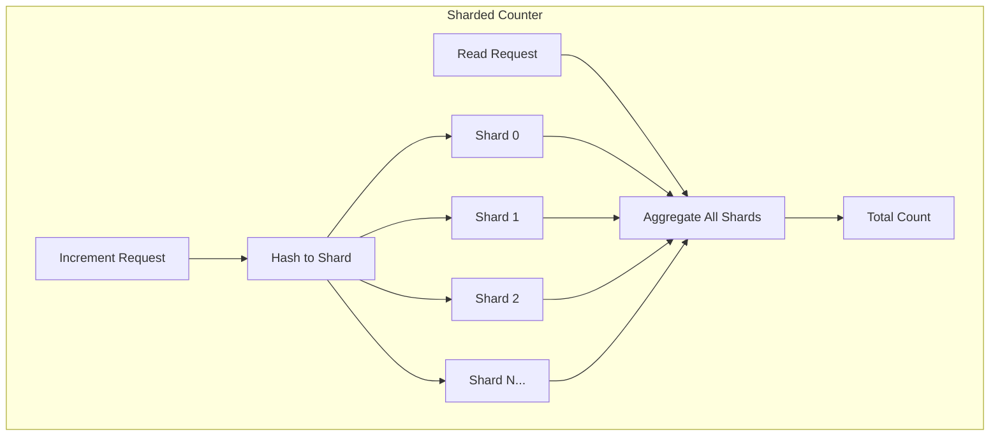

# How to Build Distributed Counters with Redis

Author: [nawazdhandala](https://www.github.com/nawazdhandala)

Tags: Redis, Distributed Counters, INCR, Atomic Operations, Analytics, High Throughput

Description: Learn how to build scalable distributed counters using Redis. This guide covers atomic increment operations, sharded counters for high throughput, time-windowed counters, and techniques for handling counter overflow and persistence.

---

> Counting things at scale is surprisingly complex. Whether you're tracking page views, API calls, or inventory levels, distributed counters must handle concurrent updates from multiple sources while maintaining accuracy. Redis provides the primitives to build counters that scale to millions of increments per second.

Simple counters seem trivial until you need them to work across multiple servers, handle thousands of concurrent updates, and never lose a count. Redis atomic operations and in-memory performance make it ideal for distributed counting, but building production-ready counters requires understanding the patterns and pitfalls.

---

## Basic Atomic Counters

### Redis INCR Family

Redis provides atomic increment operations that are the foundation of all counter patterns:

```python
import redis

r = redis.Redis(host='localhost', port=6379, decode_responses=True)

# Basic increment - atomic, returns new value
count = r.incr('page_views')
print(f"Page views: {count}")

# Increment by specific amount
count = r.incrby('api_calls', 5)
print(f"API calls: {count}")

# Decrement operations
count = r.decr('inventory:item:123')
count = r.decrby('inventory:item:123', 10)

# Float increment for fractional counters
value = r.incrbyfloat('revenue', 19.99)
print(f"Revenue: ${value}")

# Initialize counter if needed (SETNX for conditional set)
r.setnx('new_counter', 0)  # Only sets if key doesn't exist
```

### Thread-Safe Counter Class

```python
import redis
from datetime import datetime

class Counter:
    """
    Basic thread-safe distributed counter using Redis.

    All operations are atomic - safe for concurrent access
    from multiple processes or servers.
    """

    def __init__(self, redis_client: redis.Redis, name: str):
        self.redis = redis_client
        self.key = f"counter:{name}"

    def increment(self, amount: int = 1) -> int:
        """Atomically increment counter and return new value"""
        return self.redis.incrby(self.key, amount)

    def decrement(self, amount: int = 1) -> int:
        """Atomically decrement counter and return new value"""
        return self.redis.decrby(self.key, amount)

    def get(self) -> int:
        """Get current counter value"""
        value = self.redis.get(self.key)
        return int(value) if value else 0

    def reset(self, value: int = 0) -> int:
        """Reset counter to specific value, returns previous value"""
        # GETSET is atomic get-and-set
        previous = self.redis.getset(self.key, value)
        return int(previous) if previous else 0

    def set_if_greater(self, value: int) -> bool:
        """
        Set counter to value only if it's greater than current.
        Useful for tracking maximum values.
        """
        script = """
        local key = KEYS[1]
        local new_value = tonumber(ARGV[1])
        local current = tonumber(redis.call('GET', key) or 0)

        if new_value > current then
            redis.call('SET', key, new_value)
            return 1
        end
        return 0
        """
        return self.redis.eval(script, 1, self.key, value) == 1

# Usage
r = redis.Redis(host='localhost', port=6379, decode_responses=True)

page_counter = Counter(r, 'page_views:homepage')

# Increment from multiple threads/processes safely
new_count = page_counter.increment()
print(f"Current count: {new_count}")

# Get without incrementing
current = page_counter.get()
print(f"Total views: {current}")
```

---

## Sharded Counters for High Throughput

When a single counter becomes a bottleneck, shard across multiple keys:



### Sharded Counter Implementation

```python
import redis
import random
import hashlib

class ShardedCounter:
    """
    High-throughput counter using multiple shards.

    Distributes writes across N Redis keys to reduce contention.
    Reads aggregate all shards for total count.

    Trade-off: Higher write throughput, slightly slower reads.
    """

    def __init__(
        self,
        redis_client: redis.Redis,
        name: str,
        num_shards: int = 16
    ):
        self.redis = redis_client
        self.name = name
        self.num_shards = num_shards
        self.shard_keys = [f"counter:{name}:shard:{i}" for i in range(num_shards)]

    def _get_shard(self, hint: str = None) -> str:
        """
        Select a shard for this operation.

        hint: optional string to consistently route to same shard
              (useful for related operations)
        """
        if hint:
            # Consistent hashing for hint
            hash_value = int(hashlib.md5(hint.encode()).hexdigest(), 16)
            shard_index = hash_value % self.num_shards
        else:
            # Random shard for maximum distribution
            shard_index = random.randint(0, self.num_shards - 1)

        return self.shard_keys[shard_index]

    def increment(self, amount: int = 1, hint: str = None) -> int:
        """
        Increment the counter.

        Returns the value of the incremented shard (not total).
        Use get() for total count.
        """
        shard_key = self._get_shard(hint)
        return self.redis.incrby(shard_key, amount)

    def decrement(self, amount: int = 1, hint: str = None) -> int:
        """Decrement the counter"""
        shard_key = self._get_shard(hint)
        return self.redis.decrby(shard_key, amount)

    def get(self) -> int:
        """
        Get total count across all shards.

        Uses MGET for efficiency - single round trip.
        """
        values = self.redis.mget(self.shard_keys)
        total = sum(int(v) for v in values if v is not None)
        return total

    def get_approximate(self, sample_size: int = 4) -> int:
        """
        Get approximate count by sampling shards.

        Faster than full count, good for high-volume counters
        where exact precision isn't critical.
        """
        sampled_keys = random.sample(self.shard_keys, min(sample_size, self.num_shards))
        values = self.redis.mget(sampled_keys)
        sample_total = sum(int(v) for v in values if v is not None)

        # Extrapolate to full count
        return int(sample_total * self.num_shards / len(sampled_keys))

    def reset(self) -> int:
        """Reset all shards to zero, returns previous total"""
        # Use Lua for atomic reset
        script = """
        local total = 0
        for i, key in ipairs(KEYS) do
            local val = redis.call('GETSET', key, 0)
            if val then
                total = total + tonumber(val)
            end
        end
        return total
        """
        return self.redis.eval(script, len(self.shard_keys), *self.shard_keys)

# Usage
r = redis.Redis(host='localhost', port=6379, decode_responses=True)

# Create counter with 16 shards
api_counter = ShardedCounter(r, 'api_calls', num_shards=16)

# High-volume increments distribute across shards
for _ in range(10000):
    api_counter.increment()

# Get total
print(f"Total API calls: {api_counter.get()}")

# Approximate count (faster for very high volumes)
print(f"Approximate: {api_counter.get_approximate()}")
```

---

## Time-Windowed Counters

Count events within specific time periods:

```python
import redis
import time
from datetime import datetime, timedelta

class TimeWindowCounter:
    """
    Counter that tracks events within sliding or fixed time windows.

    Useful for:
    - Rate limiting (requests per minute)
    - Analytics (page views per hour)
    - Trending detection (activity spikes)
    """

    def __init__(
        self,
        redis_client: redis.Redis,
        name: str,
        window_seconds: int = 3600
    ):
        self.redis = redis_client
        self.name = name
        self.window_seconds = window_seconds

    def _window_key(self, timestamp: float = None) -> str:
        """Get key for the time window containing timestamp"""
        ts = timestamp or time.time()
        window_start = int(ts / self.window_seconds) * self.window_seconds
        return f"counter:{self.name}:window:{window_start}"

    def increment(self, amount: int = 1, timestamp: float = None) -> int:
        """
        Increment counter for the current (or specified) time window.
        """
        key = self._window_key(timestamp)

        # Use pipeline for atomic increment + expire
        pipe = self.redis.pipeline()
        pipe.incrby(key, amount)
        # Set expiry to 2x window to allow for late reads
        pipe.expire(key, self.window_seconds * 2)
        results = pipe.execute()

        return results[0]

    def get_current(self) -> int:
        """Get count for current window"""
        key = self._window_key()
        value = self.redis.get(key)
        return int(value) if value else 0

    def get_window(self, windows_ago: int = 0) -> int:
        """Get count for a specific past window"""
        ts = time.time() - (windows_ago * self.window_seconds)
        key = self._window_key(ts)
        value = self.redis.get(key)
        return int(value) if value else 0

    def get_range(self, num_windows: int = 24) -> list:
        """
        Get counts for the last N windows.
        Returns list of (timestamp, count) tuples.
        """
        now = time.time()
        keys = []
        timestamps = []

        for i in range(num_windows):
            ts = now - (i * self.window_seconds)
            keys.append(self._window_key(ts))
            window_start = int(ts / self.window_seconds) * self.window_seconds
            timestamps.append(window_start)

        values = self.redis.mget(keys)

        return [
            {
                'timestamp': ts,
                'datetime': datetime.fromtimestamp(ts).isoformat(),
                'count': int(v) if v else 0
            }
            for ts, v in zip(timestamps, values)
        ]

    def get_total(self, num_windows: int = 24) -> int:
        """Get total count across last N windows"""
        windows = self.get_range(num_windows)
        return sum(w['count'] for w in windows)

# Usage
r = redis.Redis(host='localhost', port=6379, decode_responses=True)

# Hourly counter
hourly_views = TimeWindowCounter(r, 'page_views:homepage', window_seconds=3600)

# Increment current hour
hourly_views.increment()

# Get last 24 hours
history = hourly_views.get_range(24)
print("Last 24 hours:")
for window in history[:5]:  # First 5
    print(f"  {window['datetime']}: {window['count']} views")

# Minute-level counter for rate limiting
minute_counter = TimeWindowCounter(r, 'api_calls:user:123', window_seconds=60)
```

---

## Multi-Dimensional Counters

Track counts across multiple dimensions:

```python
class MultiDimensionCounter:
    """
    Counter that supports multiple dimensions for analytics.

    Example dimensions: country, browser, page, etc.
    Efficiently stores and queries counts by dimension combinations.
    """

    def __init__(self, redis_client: redis.Redis, name: str):
        self.redis = redis_client
        self.name = name

    def _make_key(self, dimensions: dict) -> str:
        """Create sorted key from dimensions"""
        sorted_dims = sorted(dimensions.items())
        dim_str = ':'.join(f"{k}={v}" for k, v in sorted_dims)
        return f"mdcounter:{self.name}:{dim_str}"

    def increment(self, dimensions: dict, amount: int = 1) -> int:
        """
        Increment counter for specific dimension combination.

        dimensions: dict of dimension_name -> value
        """
        key = self._make_key(dimensions)
        return self.redis.incrby(key, amount)

    def get(self, dimensions: dict) -> int:
        """Get count for specific dimension combination"""
        key = self._make_key(dimensions)
        value = self.redis.get(key)
        return int(value) if value else 0

    def get_by_pattern(self, partial_dimensions: dict) -> dict:
        """
        Get counts for all dimension combinations matching partial dims.

        partial_dimensions: subset of dimensions to match
        """
        # Build pattern from partial dimensions
        sorted_dims = sorted(partial_dimensions.items())
        pattern_parts = [f"{k}={v}" for k, v in sorted_dims]
        pattern = f"mdcounter:{self.name}:*{'*'.join(pattern_parts)}*"

        results = {}
        cursor = 0

        while True:
            cursor, keys = self.redis.scan(cursor, match=pattern, count=100)

            if keys:
                values = self.redis.mget(keys)
                for key, value in zip(keys, values):
                    if value:
                        # Extract dimensions from key
                        dim_part = key.split(':', 2)[2]
                        results[dim_part] = int(value)

            if cursor == 0:
                break

        return results

    def get_top(self, dimension: str, limit: int = 10) -> list:
        """
        Get top values for a specific dimension.

        Uses a sorted set for efficient top-N queries.
        """
        # This requires maintaining a separate sorted set
        ranking_key = f"mdcounter:{self.name}:ranking:{dimension}"

        # Get top values
        top = self.redis.zrevrange(ranking_key, 0, limit - 1, withscores=True)

        return [{'value': item[0], 'count': int(item[1])} for item in top]

    def increment_with_ranking(
        self,
        dimensions: dict,
        ranking_dimension: str,
        amount: int = 1
    ):
        """
        Increment counter and update ranking for specified dimension.

        ranking_dimension: which dimension to track in rankings
        """
        pipe = self.redis.pipeline()

        # Increment main counter
        key = self._make_key(dimensions)
        pipe.incrby(key, amount)

        # Update ranking sorted set
        ranking_key = f"mdcounter:{self.name}:ranking:{ranking_dimension}"
        ranking_value = dimensions[ranking_dimension]
        pipe.zincrby(ranking_key, amount, ranking_value)

        pipe.execute()

# Usage
r = redis.Redis(host='localhost', port=6379, decode_responses=True)

analytics = MultiDimensionCounter(r, 'page_views')

# Track page views with dimensions
analytics.increment_with_ranking(
    dimensions={'page': '/home', 'country': 'US', 'browser': 'Chrome'},
    ranking_dimension='page'
)

analytics.increment_with_ranking(
    dimensions={'page': '/products', 'country': 'UK', 'browser': 'Firefox'},
    ranking_dimension='page'
)

# Get count for specific combination
count = analytics.get({'page': '/home', 'country': 'US', 'browser': 'Chrome'})
print(f"US Chrome /home views: {count}")

# Get top pages
top_pages = analytics.get_top('page', limit=10)
print("Top pages:", top_pages)
```

---

## Handling Counter Persistence

Ensure counters survive Redis restarts:

```python
class PersistentCounter:
    """
    Counter with guaranteed persistence and recovery.

    Uses both fast Redis counter and periodic snapshots
    to ensure no data loss.
    """

    def __init__(
        self,
        redis_client: redis.Redis,
        name: str,
        snapshot_interval: int = 60
    ):
        self.redis = redis_client
        self.name = name
        self.counter_key = f"pcounter:{name}:value"
        self.snapshot_key = f"pcounter:{name}:snapshot"
        self.snapshot_interval = snapshot_interval

        # Recover from snapshot on initialization
        self._recover()

    def _recover(self):
        """Recover counter state from last snapshot if needed"""
        current = self.redis.get(self.counter_key)

        if current is None:
            # Counter doesn't exist, check for snapshot
            snapshot = self.redis.hgetall(self.snapshot_key)

            if snapshot:
                # Restore from snapshot
                value = int(snapshot.get('value', 0))
                self.redis.set(self.counter_key, value)
                print(f"Recovered counter {self.name} from snapshot: {value}")

    def increment(self, amount: int = 1) -> int:
        """Increment with periodic snapshot"""
        new_value = self.redis.incrby(self.counter_key, amount)

        # Check if we should snapshot
        # Use modulo to snapshot every N increments
        if new_value % 1000 == 0:
            self._snapshot(new_value)

        return new_value

    def _snapshot(self, value: int):
        """Save snapshot for recovery"""
        self.redis.hset(self.snapshot_key, mapping={
            'value': value,
            'timestamp': time.time(),
            'name': self.name
        })

    def get(self) -> int:
        """Get current value"""
        value = self.redis.get(self.counter_key)
        return int(value) if value else 0

    def force_snapshot(self):
        """Force immediate snapshot"""
        current = self.get()
        self._snapshot(current)
        return current

# Usage
r = redis.Redis(host='localhost', port=6379, decode_responses=True)

counter = PersistentCounter(r, 'important_events')

# Increment (snapshots automatically)
for _ in range(5000):
    counter.increment()

# Force snapshot before shutdown
counter.force_snapshot()
```

---

## Distributed Unique Counters

Count unique items using HyperLogLog:

```python
class UniqueCounter:
    """
    Count unique items using HyperLogLog.

    Memory efficient: ~12KB per counter regardless of cardinality.
    Trade-off: ~0.81% standard error in counts.
    """

    def __init__(self, redis_client: redis.Redis, name: str):
        self.redis = redis_client
        self.key = f"hll:{name}"

    def add(self, *items) -> int:
        """
        Add items to the unique counter.

        Returns 1 if cardinality changed, 0 otherwise.
        """
        return self.redis.pfadd(self.key, *items)

    def count(self) -> int:
        """Get approximate count of unique items"""
        return self.redis.pfcount(self.key)

    def merge(self, *other_counters):
        """
        Merge multiple counters into this one.

        Useful for combining counts from different time periods
        or data sources.
        """
        other_keys = [c.key for c in other_counters]
        self.redis.pfmerge(self.key, *other_keys)

# Usage
r = redis.Redis(host='localhost', port=6379, decode_responses=True)

# Count unique visitors
unique_visitors = UniqueCounter(r, 'daily_visitors:2026-01-25')

# Add visitor IDs (or any unique identifiers)
unique_visitors.add('user:123', 'user:456', 'user:789')
unique_visitors.add('user:123')  # Duplicate, won't increase count

print(f"Unique visitors: {unique_visitors.count()}")

# Merge daily counters for weekly total
daily_counters = [
    UniqueCounter(r, f'daily_visitors:2026-01-{day}')
    for day in range(20, 26)
]

weekly_total = UniqueCounter(r, 'weekly_visitors:2026-w04')
weekly_total.merge(*daily_counters)
print(f"Weekly unique visitors: {weekly_total.count()}")
```

---

## Monitoring Counter Health

```python
class CounterMonitor:
    """
    Monitor counter health and performance.
    """

    def __init__(self, redis_client: redis.Redis):
        self.redis = redis_client

    def get_counter_stats(self, pattern: str = 'counter:*') -> dict:
        """Get statistics for counters matching pattern"""
        cursor = 0
        counters = []

        while True:
            cursor, keys = self.redis.scan(cursor, match=pattern, count=100)

            for key in keys:
                value = self.redis.get(key)
                ttl = self.redis.ttl(key)

                counters.append({
                    'key': key,
                    'value': int(value) if value else 0,
                    'ttl': ttl
                })

            if cursor == 0:
                break

        # Calculate statistics
        values = [c['value'] for c in counters]

        return {
            'total_counters': len(counters),
            'total_count': sum(values),
            'max_count': max(values) if values else 0,
            'min_count': min(values) if values else 0,
            'avg_count': sum(values) / len(values) if values else 0,
            'counters': counters[:10]  # Sample
        }

# Usage
r = redis.Redis(host='localhost', port=6379, decode_responses=True)
monitor = CounterMonitor(r)

stats = monitor.get_counter_stats('counter:*')
print(f"Total counters: {stats['total_counters']}")
print(f"Combined count: {stats['total_count']}")
```

---

## Conclusion

Distributed counters in Redis provide the building blocks for analytics, rate limiting, and inventory tracking. Key patterns covered:

- **Basic counters**: Atomic INCR for simple counting
- **Sharded counters**: Multiple keys for high throughput
- **Time-windowed counters**: Track counts over time periods
- **Multi-dimensional counters**: Analytics across dimensions
- **Unique counters**: HyperLogLog for cardinality estimation

Choose the pattern that matches your throughput requirements and consistency needs. For most applications, basic counters are sufficient; scale to sharded counters when you hit throughput limits on single keys.

---

*Monitor your distributed counter performance with [OneUptime](https://oneuptime.com). Track increment rates, detect anomalies, and alert on counter thresholds across your Redis instances.*

**Related Reading:**
- [How to Tune Redis for High Write Throughput](https://oneuptime.com/blog/post/2026-01-25-redis-high-write-throughput/view)
- [How to Use Count-Min Sketch in Redis](https://oneuptime.com/blog/post/2026-01-25-redis-count-min-sketch/view)
