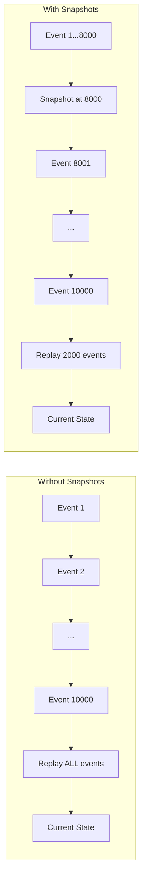

# How to Store Event Sourcing Snapshots in Redis

Author: [nawazdhandala](https://www.github.com/nawazdhandala)

Tags: Redis, Event Sourcing, Snapshots, CQRS, Aggregates, State Management

Description: Learn how to use Redis for storing event sourcing snapshots. This guide covers snapshot strategies, aggregate state reconstruction, snapshot scheduling, and integration with event stores for optimal performance.

---

> Event sourcing stores every state change as an immutable event. While this provides a complete audit trail and enables powerful replay capabilities, reconstructing current state from thousands of events becomes slow. Snapshots capture aggregate state at specific points, allowing fast state recovery by replaying only recent events.

As event streams grow, replaying from the beginning becomes impractical. A 10,000-event stream might take seconds to replay, making read operations unacceptably slow. Snapshots solve this by periodically capturing aggregate state, reducing replay to just the events after the snapshot.

---

## Understanding Event Sourcing Snapshots

### The Problem Snapshots Solve



Snapshots trade storage space for read performance by periodically persisting aggregate state.

---

## Snapshot Storage Implementation

### Basic Snapshot Store

```python
import redis
import json
import time
from typing import Optional, Dict, Any
from dataclasses import dataclass, asdict
from datetime import datetime

@dataclass
class Snapshot:
    """Represents a snapshot of aggregate state"""
    aggregate_id: str
    aggregate_type: str
    version: int
    state: Dict[str, Any]
    timestamp: float
    metadata: Optional[Dict[str, Any]] = None

class RedisSnapshotStore:
    """
    Stores event sourcing snapshots in Redis.

    Key design:
    - snapshot:{aggregate_type}:{aggregate_id} -> latest snapshot
    - snapshot:{aggregate_type}:{aggregate_id}:history -> list of past snapshots
    """

    def __init__(self, redis_client: redis.Redis, retention_count: int = 5):
        self.redis = redis_client
        self.retention_count = retention_count  # Keep N historical snapshots

    def _snapshot_key(self, aggregate_type: str, aggregate_id: str) -> str:
        return f"snapshot:{aggregate_type}:{aggregate_id}"

    def _history_key(self, aggregate_type: str, aggregate_id: str) -> str:
        return f"snapshot:{aggregate_type}:{aggregate_id}:history"

    def save(self, snapshot: Snapshot) -> None:
        """
        Save a new snapshot.

        Stores as latest and adds to history for potential rollback.
        """
        key = self._snapshot_key(snapshot.aggregate_type, snapshot.aggregate_id)
        history_key = self._history_key(snapshot.aggregate_type, snapshot.aggregate_id)

        # Serialize snapshot
        snapshot_data = json.dumps(asdict(snapshot))

        pipe = self.redis.pipeline()

        # Save as latest
        pipe.set(key, snapshot_data)

        # Add to history (newest first)
        pipe.lpush(history_key, snapshot_data)

        # Trim history to retention limit
        pipe.ltrim(history_key, 0, self.retention_count - 1)

        pipe.execute()

    def get_latest(
        self,
        aggregate_type: str,
        aggregate_id: str
    ) -> Optional[Snapshot]:
        """Get the most recent snapshot for an aggregate"""
        key = self._snapshot_key(aggregate_type, aggregate_id)
        data = self.redis.get(key)

        if data:
            snapshot_dict = json.loads(data)
            return Snapshot(**snapshot_dict)
        return None

    def get_at_version(
        self,
        aggregate_type: str,
        aggregate_id: str,
        version: int
    ) -> Optional[Snapshot]:
        """
        Get snapshot at or before a specific version.

        Useful for point-in-time reconstruction.
        """
        history_key = self._history_key(aggregate_type, aggregate_id)
        snapshots = self.redis.lrange(history_key, 0, -1)

        for snapshot_data in snapshots:
            snapshot_dict = json.loads(snapshot_data)
            if snapshot_dict['version'] <= version:
                return Snapshot(**snapshot_dict)

        return None

    def delete(self, aggregate_type: str, aggregate_id: str) -> None:
        """Delete all snapshots for an aggregate"""
        key = self._snapshot_key(aggregate_type, aggregate_id)
        history_key = self._history_key(aggregate_type, aggregate_id)

        self.redis.delete(key, history_key)

    def get_stats(self, aggregate_type: str = None) -> Dict[str, Any]:
        """Get statistics about stored snapshots"""
        pattern = f"snapshot:{aggregate_type or '*'}:*"
        cursor = 0
        count = 0
        total_size = 0

        while True:
            cursor, keys = self.redis.scan(cursor, match=pattern, count=100)

            for key in keys:
                if ':history' not in key:
                    count += 1
                    total_size += self.redis.strlen(key)

            if cursor == 0:
                break

        return {
            'snapshot_count': count,
            'total_size_bytes': total_size,
            'avg_size_bytes': total_size / count if count > 0 else 0
        }

# Usage
r = redis.Redis(host='localhost', port=6379, decode_responses=True)
snapshot_store = RedisSnapshotStore(r, retention_count=5)

# Save a snapshot
snapshot = Snapshot(
    aggregate_id='order-123',
    aggregate_type='Order',
    version=150,
    state={
        'status': 'shipped',
        'items': [{'sku': 'ABC', 'qty': 2}],
        'total': 99.99
    },
    timestamp=time.time(),
    metadata={'source': 'periodic_snapshot'}
)

snapshot_store.save(snapshot)

# Retrieve latest
latest = snapshot_store.get_latest('Order', 'order-123')
print(f"Latest snapshot at version {latest.version}: {latest.state}")
```

---

## Aggregate with Snapshot Support

### Event Sourced Aggregate

```python
from abc import ABC, abstractmethod
from typing import List
import uuid

@dataclass
class Event:
    """Base event class"""
    event_id: str
    aggregate_id: str
    version: int
    timestamp: float
    event_type: str
    data: Dict[str, Any]

class EventSourcedAggregate(ABC):
    """
    Base class for event-sourced aggregates with snapshot support.
    """

    def __init__(self, aggregate_id: str):
        self.aggregate_id = aggregate_id
        self.version = 0
        self._uncommitted_events: List[Event] = []

    @property
    @abstractmethod
    def aggregate_type(self) -> str:
        """Return the aggregate type name"""
        pass

    @abstractmethod
    def apply_event(self, event: Event) -> None:
        """Apply an event to update state"""
        pass

    @abstractmethod
    def get_state(self) -> Dict[str, Any]:
        """Get current state for snapshotting"""
        pass

    @abstractmethod
    def restore_state(self, state: Dict[str, Any]) -> None:
        """Restore state from snapshot"""
        pass

    def load_from_snapshot(self, snapshot: Snapshot) -> None:
        """Initialize aggregate from a snapshot"""
        self.restore_state(snapshot.state)
        self.version = snapshot.version

    def create_snapshot(self) -> Snapshot:
        """Create a snapshot of current state"""
        return Snapshot(
            aggregate_id=self.aggregate_id,
            aggregate_type=self.aggregate_type,
            version=self.version,
            state=self.get_state(),
            timestamp=time.time()
        )

    def apply(self, event: Event) -> None:
        """Apply event and track version"""
        self.apply_event(event)
        self.version = event.version

    def raise_event(self, event_type: str, data: Dict[str, Any]) -> Event:
        """Create and apply a new event"""
        event = Event(
            event_id=str(uuid.uuid4()),
            aggregate_id=self.aggregate_id,
            version=self.version + 1,
            timestamp=time.time(),
            event_type=event_type,
            data=data
        )

        self.apply(event)
        self._uncommitted_events.append(event)
        return event

    def get_uncommitted_events(self) -> List[Event]:
        """Get events not yet persisted"""
        return self._uncommitted_events.copy()

    def clear_uncommitted_events(self) -> None:
        """Clear uncommitted events after persistence"""
        self._uncommitted_events.clear()

class OrderAggregate(EventSourcedAggregate):
    """Example: Order aggregate with snapshot support"""

    def __init__(self, aggregate_id: str):
        super().__init__(aggregate_id)
        self.status = 'draft'
        self.items = []
        self.total = 0.0
        self.customer_id = None

    @property
    def aggregate_type(self) -> str:
        return 'Order'

    def get_state(self) -> Dict[str, Any]:
        """Serialize state for snapshot"""
        return {
            'status': self.status,
            'items': self.items.copy(),
            'total': self.total,
            'customer_id': self.customer_id
        }

    def restore_state(self, state: Dict[str, Any]) -> None:
        """Restore state from snapshot"""
        self.status = state['status']
        self.items = state['items']
        self.total = state['total']
        self.customer_id = state['customer_id']

    def apply_event(self, event: Event) -> None:
        """Apply event to update state"""
        if event.event_type == 'OrderCreated':
            self.customer_id = event.data['customer_id']
            self.status = 'created'

        elif event.event_type == 'ItemAdded':
            self.items.append(event.data['item'])
            self.total += event.data['item']['price'] * event.data['item']['quantity']

        elif event.event_type == 'OrderSubmitted':
            self.status = 'submitted'

        elif event.event_type == 'OrderShipped':
            self.status = 'shipped'

    # Domain methods
    def create(self, customer_id: str) -> None:
        self.raise_event('OrderCreated', {'customer_id': customer_id})

    def add_item(self, sku: str, quantity: int, price: float) -> None:
        self.raise_event('ItemAdded', {
            'item': {'sku': sku, 'quantity': quantity, 'price': price}
        })

    def submit(self) -> None:
        if self.status != 'created':
            raise ValueError("Can only submit created orders")
        self.raise_event('OrderSubmitted', {})

    def ship(self) -> None:
        if self.status != 'submitted':
            raise ValueError("Can only ship submitted orders")
        self.raise_event('OrderShipped', {})
```

---

## Repository with Snapshot Integration

```python
class AggregateRepository:
    """
    Repository that integrates event store with snapshot store.

    Loads aggregates from snapshot + events for optimal performance.
    """

    def __init__(
        self,
        redis_client: redis.Redis,
        snapshot_store: RedisSnapshotStore,
        snapshot_interval: int = 100
    ):
        self.redis = redis_client
        self.snapshot_store = snapshot_store
        self.snapshot_interval = snapshot_interval

    def _events_key(self, aggregate_type: str, aggregate_id: str) -> str:
        return f"events:{aggregate_type}:{aggregate_id}"

    def save(self, aggregate: EventSourcedAggregate) -> None:
        """
        Save aggregate events and potentially create snapshot.
        """
        events = aggregate.get_uncommitted_events()
        if not events:
            return

        events_key = self._events_key(aggregate.aggregate_type, aggregate.aggregate_id)

        pipe = self.redis.pipeline()

        # Append events to stream
        for event in events:
            event_data = json.dumps(asdict(event))
            pipe.rpush(events_key, event_data)

        pipe.execute()
        aggregate.clear_uncommitted_events()

        # Check if snapshot is needed
        if aggregate.version % self.snapshot_interval == 0:
            snapshot = aggregate.create_snapshot()
            self.snapshot_store.save(snapshot)
            print(f"Created snapshot for {aggregate.aggregate_type}:{aggregate.aggregate_id} at version {aggregate.version}")

    def load(
        self,
        aggregate_class: type,
        aggregate_id: str
    ) -> Optional[EventSourcedAggregate]:
        """
        Load aggregate by replaying events from snapshot.
        """
        # Create empty aggregate to get type info
        aggregate = aggregate_class(aggregate_id)

        # Try to load snapshot first
        snapshot = self.snapshot_store.get_latest(
            aggregate.aggregate_type,
            aggregate_id
        )

        start_version = 0

        if snapshot:
            aggregate.load_from_snapshot(snapshot)
            start_version = snapshot.version
            print(f"Loaded from snapshot at version {start_version}")

        # Load events after snapshot
        events_key = self._events_key(aggregate.aggregate_type, aggregate_id)
        events_data = self.redis.lrange(events_key, start_version, -1)

        if not events_data and start_version == 0:
            return None  # Aggregate doesn't exist

        # Replay events
        for event_data in events_data:
            event_dict = json.loads(event_data)
            event = Event(**event_dict)
            aggregate.apply(event)

        print(f"Replayed {len(events_data)} events (total version: {aggregate.version})")

        return aggregate

    def load_at_version(
        self,
        aggregate_class: type,
        aggregate_id: str,
        target_version: int
    ) -> Optional[EventSourcedAggregate]:
        """
        Load aggregate at a specific version (time travel).
        """
        aggregate = aggregate_class(aggregate_id)

        # Find snapshot at or before target version
        snapshot = self.snapshot_store.get_at_version(
            aggregate.aggregate_type,
            aggregate_id,
            target_version
        )

        start_version = 0

        if snapshot:
            aggregate.load_from_snapshot(snapshot)
            start_version = snapshot.version

        # Load events between snapshot and target
        events_key = self._events_key(aggregate.aggregate_type, aggregate_id)
        events_data = self.redis.lrange(events_key, start_version, target_version - 1)

        for event_data in events_data:
            event_dict = json.loads(event_data)
            event = Event(**event_dict)
            aggregate.apply(event)

        return aggregate

# Usage
r = redis.Redis(host='localhost', port=6379, decode_responses=True)
snapshot_store = RedisSnapshotStore(r)
repository = AggregateRepository(r, snapshot_store, snapshot_interval=100)

# Create and save order
order = OrderAggregate('order-456')
order.create('customer-123')
order.add_item('WIDGET-A', 2, 29.99)
order.add_item('GADGET-B', 1, 49.99)

repository.save(order)

# Load order (uses snapshot if available)
loaded_order = repository.load(OrderAggregate, 'order-456')
print(f"Loaded order: status={loaded_order.status}, total={loaded_order.total}")
```

---

## Snapshot Scheduling Strategies

### Periodic Snapshot Worker

```python
import threading
import time

class SnapshotScheduler:
    """
    Background worker that creates snapshots based on various strategies.
    """

    def __init__(
        self,
        redis_client: redis.Redis,
        repository: AggregateRepository,
        aggregate_classes: List[type]
    ):
        self.redis = redis_client
        self.repository = repository
        self.aggregate_classes = {c.__name__: c for c in aggregate_classes}
        self._running = False

    def _get_aggregates_needing_snapshot(self, threshold: int = 100) -> List[tuple]:
        """
        Find aggregates that need snapshots.

        Returns list of (aggregate_type, aggregate_id, events_since_snapshot)
        """
        needs_snapshot = []

        for aggregate_type in self.aggregate_classes:
            # Scan for aggregates of this type
            pattern = f"events:{aggregate_type}:*"
            cursor = 0

            while True:
                cursor, keys = self.redis.scan(cursor, match=pattern, count=100)

                for key in keys:
                    # Extract aggregate_id from key
                    parts = key.split(':')
                    aggregate_id = parts[2]

                    # Get event count
                    event_count = self.redis.llen(key)

                    # Get latest snapshot version
                    snapshot = self.repository.snapshot_store.get_latest(
                        aggregate_type, aggregate_id
                    )
                    snapshot_version = snapshot.version if snapshot else 0

                    events_since = event_count - snapshot_version

                    if events_since >= threshold:
                        needs_snapshot.append((
                            aggregate_type,
                            aggregate_id,
                            events_since
                        ))

                if cursor == 0:
                    break

        return needs_snapshot

    def create_snapshots(self, threshold: int = 100) -> int:
        """
        Create snapshots for aggregates exceeding threshold.

        Returns number of snapshots created.
        """
        aggregates = self._get_aggregates_needing_snapshot(threshold)
        created = 0

        for aggregate_type, aggregate_id, events_since in aggregates:
            try:
                aggregate_class = self.aggregate_classes[aggregate_type]
                aggregate = self.repository.load(aggregate_class, aggregate_id)

                if aggregate:
                    snapshot = aggregate.create_snapshot()
                    self.repository.snapshot_store.save(snapshot)
                    created += 1
                    print(f"Snapshot created: {aggregate_type}:{aggregate_id} at v{aggregate.version}")

            except Exception as e:
                print(f"Error creating snapshot for {aggregate_type}:{aggregate_id}: {e}")

        return created

    def run_periodic(self, interval_seconds: int = 300, threshold: int = 100):
        """Run snapshot creation periodically"""
        self._running = True

        while self._running:
            try:
                created = self.create_snapshots(threshold)
                print(f"Snapshot cycle complete: {created} snapshots created")
            except Exception as e:
                print(f"Snapshot cycle error: {e}")

            time.sleep(interval_seconds)

    def start_background(self, interval_seconds: int = 300):
        """Start scheduler in background thread"""
        thread = threading.Thread(
            target=self.run_periodic,
            args=(interval_seconds,),
            daemon=True
        )
        thread.start()
        return thread

    def stop(self):
        """Stop the scheduler"""
        self._running = False
```

---

## Snapshot Compression

For large aggregate states, compress snapshots:

```python
import zlib
import base64

class CompressedSnapshotStore(RedisSnapshotStore):
    """
    Snapshot store with compression for large states.
    """

    def __init__(
        self,
        redis_client: redis.Redis,
        compression_threshold: int = 1024,
        retention_count: int = 5
    ):
        super().__init__(redis_client, retention_count)
        self.compression_threshold = compression_threshold

    def save(self, snapshot: Snapshot) -> None:
        """Save snapshot with optional compression"""
        snapshot_dict = asdict(snapshot)
        json_data = json.dumps(snapshot_dict)

        # Compress if above threshold
        if len(json_data) > self.compression_threshold:
            compressed = zlib.compress(json_data.encode())
            storage_data = 'z:' + base64.b64encode(compressed).decode()
        else:
            storage_data = 'j:' + json_data

        key = self._snapshot_key(snapshot.aggregate_type, snapshot.aggregate_id)
        history_key = self._history_key(snapshot.aggregate_type, snapshot.aggregate_id)

        pipe = self.redis.pipeline()
        pipe.set(key, storage_data)
        pipe.lpush(history_key, storage_data)
        pipe.ltrim(history_key, 0, self.retention_count - 1)
        pipe.execute()

    def get_latest(
        self,
        aggregate_type: str,
        aggregate_id: str
    ) -> Optional[Snapshot]:
        """Get and decompress latest snapshot"""
        key = self._snapshot_key(aggregate_type, aggregate_id)
        data = self.redis.get(key)

        if not data:
            return None

        # Check for compression marker
        if data.startswith('z:'):
            compressed = base64.b64decode(data[2:])
            json_data = zlib.decompress(compressed).decode()
        else:
            json_data = data[2:]  # Skip 'j:' prefix

        snapshot_dict = json.loads(json_data)
        return Snapshot(**snapshot_dict)
```

---

## Snapshot Cache for Read Models

```python
class SnapshotCache:
    """
    In-memory cache for frequently accessed snapshots.

    Reduces Redis round trips for hot aggregates.
    """

    def __init__(
        self,
        snapshot_store: RedisSnapshotStore,
        max_size: int = 1000,
        ttl_seconds: int = 60
    ):
        self.store = snapshot_store
        self.max_size = max_size
        self.ttl_seconds = ttl_seconds
        self._cache = {}
        self._access_times = {}

    def _cache_key(self, aggregate_type: str, aggregate_id: str) -> str:
        return f"{aggregate_type}:{aggregate_id}"

    def _is_expired(self, key: str) -> bool:
        if key not in self._access_times:
            return True
        return time.time() - self._access_times[key] > self.ttl_seconds

    def _evict_if_needed(self):
        """Evict oldest entries if cache is full"""
        if len(self._cache) >= self.max_size:
            # Sort by access time, remove oldest 10%
            sorted_keys = sorted(
                self._access_times.keys(),
                key=lambda k: self._access_times[k]
            )
            for key in sorted_keys[:len(sorted_keys) // 10]:
                del self._cache[key]
                del self._access_times[key]

    def get(
        self,
        aggregate_type: str,
        aggregate_id: str
    ) -> Optional[Snapshot]:
        """Get snapshot from cache or store"""
        key = self._cache_key(aggregate_type, aggregate_id)

        # Check cache
        if key in self._cache and not self._is_expired(key):
            self._access_times[key] = time.time()
            return self._cache[key]

        # Load from store
        snapshot = self.store.get_latest(aggregate_type, aggregate_id)

        if snapshot:
            self._evict_if_needed()
            self._cache[key] = snapshot
            self._access_times[key] = time.time()

        return snapshot

    def invalidate(self, aggregate_type: str, aggregate_id: str):
        """Invalidate cached snapshot"""
        key = self._cache_key(aggregate_type, aggregate_id)
        self._cache.pop(key, None)
        self._access_times.pop(key, None)
```

---

## Conclusion

Redis provides an excellent storage layer for event sourcing snapshots due to its speed and flexible data structures. Key patterns covered:

- **Basic snapshot storage**: Latest + historical snapshots per aggregate
- **Aggregate integration**: Load from snapshot + replay recent events
- **Scheduling strategies**: Periodic and threshold-based snapshot creation
- **Compression**: Reduce storage for large aggregate states
- **Caching**: In-memory cache for hot aggregates

Snapshots are essential for event sourcing at scale. They enable fast aggregate reconstruction while preserving the full event history for auditing and replay capabilities.

---

*Monitor your event sourcing infrastructure with [OneUptime](https://oneuptime.com). Track snapshot creation rates, replay times, and Redis performance to ensure your event-sourced system runs smoothly.*

**Related Reading:**
- [How to Build Message Queues with Redis Lists](https://oneuptime.com/blog/post/2026-01-26-redis-message-queues-lists/view)
- [How to Build Distributed Counters with Redis](https://oneuptime.com/blog/post/2026-01-27-redis-distributed-counters/view)
