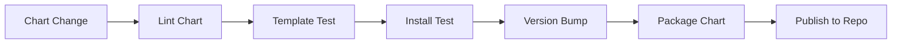

# How to Release Helm Charts with GitHub Actions

Author: [nawazdhandala](https://www.github.com/nawazdhandala)

Tags: GitHub Actions, Helm, Kubernetes, Chart Repository, CI/CD, DevOps

Description: Learn how to automate Helm chart releases with GitHub Actions, including linting, testing, versioning, and publishing to GitHub Pages or OCI registries.

---

Helm charts need the same CI/CD treatment as application code. Linting, testing, versioning, and publishing should all be automated. This guide shows you how to build a complete Helm chart release pipeline.

## Chart Release Workflow

A complete Helm chart pipeline includes these stages:



## Basic Chart Linting

Start by validating chart syntax and best practices:

```yaml
# .github/workflows/helm-lint.yml
name: Lint Helm Charts

on:
  pull_request:
    paths:
      - 'charts/**'
      - '.github/workflows/helm-*.yml'

jobs:
  lint:
    runs-on: ubuntu-latest
    steps:
      - uses: actions/checkout@v4
        with:
          fetch-depth: 0

      - name: Set up Helm
        uses: azure/setup-helm@v4
        with:
          version: v3.14.0

      - name: Add Helm repos
        run: |
          helm repo add bitnami https://charts.bitnami.com/bitnami
          helm repo update

      - name: Lint charts
        run: |
          for chart in charts/*/; do
            echo "Linting $chart"
            helm lint "$chart"
          done

      - name: Run chart-testing lint
        uses: helm/chart-testing-action@v2.6.1

      - name: Run ct lint
        run: ct lint --config ct.yaml
```

Configure chart-testing:

```yaml
# ct.yaml
remote: origin
target-branch: main
chart-dirs:
  - charts
validate-maintainers: false
check-version-increment: true
```

## Template Testing

Validate that templates render correctly with different values:

```yaml
jobs:
  template-test:
    runs-on: ubuntu-latest
    steps:
      - uses: actions/checkout@v4

      - name: Set up Helm
        uses: azure/setup-helm@v4

      - name: Template with default values
        run: |
          for chart in charts/*/; do
            echo "Testing $chart with defaults"
            helm template test "$chart"
          done

      - name: Template with production values
        run: |
          for chart in charts/*/; do
            if [ -f "$chart/ci/production-values.yaml" ]; then
              echo "Testing $chart with production values"
              helm template test "$chart" -f "$chart/ci/production-values.yaml"
            fi
          done

      - name: Template with minimal values
        run: |
          for chart in charts/*/; do
            if [ -f "$chart/ci/minimal-values.yaml" ]; then
              echo "Testing $chart with minimal values"
              helm template test "$chart" -f "$chart/ci/minimal-values.yaml"
            fi
          done
```

## Integration Testing with Kind

Test chart installation on a real Kubernetes cluster:

```yaml
jobs:
  install-test:
    runs-on: ubuntu-latest
    steps:
      - uses: actions/checkout@v4
        with:
          fetch-depth: 0

      - name: Set up Helm
        uses: azure/setup-helm@v4

      - name: Create Kind cluster
        uses: helm/kind-action@v1.9.0
        with:
          cluster_name: chart-testing

      - name: Run chart-testing install
        uses: helm/chart-testing-action@v2.6.1

      - name: Install charts
        run: ct install --config ct.yaml

      # Alternative: Manual installation testing
      - name: Manual install test
        run: |
          helm install test-release charts/my-app \
            --namespace test \
            --create-namespace \
            --wait \
            --timeout 5m

          # Verify deployment
          kubectl get pods -n test
          kubectl wait --for=condition=ready pod -l app.kubernetes.io/name=my-app -n test --timeout=120s

          # Run helm test
          helm test test-release -n test
```

## Publishing to GitHub Pages

Use GitHub Pages as your Helm repository:

```yaml
# .github/workflows/helm-release.yml
name: Release Helm Charts

on:
  push:
    branches: [main]
    paths:
      - 'charts/**'

jobs:
  release:
    runs-on: ubuntu-latest
    permissions:
      contents: write
      pages: write

    steps:
      - uses: actions/checkout@v4
        with:
          fetch-depth: 0

      - name: Configure Git
        run: |
          git config user.name "github-actions[bot]"
          git config user.email "github-actions[bot]@users.noreply.github.com"

      - name: Set up Helm
        uses: azure/setup-helm@v4

      - name: Run chart-releaser
        uses: helm/chart-releaser-action@v1.6.0
        env:
          CR_TOKEN: "${{ secrets.GITHUB_TOKEN }}"
```

This action:
1. Packages charts that have version changes
2. Creates GitHub releases for each chart version
3. Updates the `gh-pages` branch with the index.yaml

## Publishing to OCI Registry

Push charts to an OCI-compatible registry (ECR, GHCR, Docker Hub):

```yaml
jobs:
  release-oci:
    runs-on: ubuntu-latest
    permissions:
      contents: read
      packages: write

    steps:
      - uses: actions/checkout@v4

      - name: Set up Helm
        uses: azure/setup-helm@v4

      - name: Login to GHCR
        run: |
          echo "${{ secrets.GITHUB_TOKEN }}" | helm registry login ghcr.io -u ${{ github.actor }} --password-stdin

      - name: Package and push charts
        run: |
          for chart in charts/*/; do
            CHART_NAME=$(basename "$chart")
            CHART_VERSION=$(yq '.version' "$chart/Chart.yaml")

            echo "Packaging $CHART_NAME version $CHART_VERSION"
            helm package "$chart"

            echo "Pushing to GHCR"
            helm push "${CHART_NAME}-${CHART_VERSION}.tgz" oci://ghcr.io/${{ github.repository_owner }}/charts
          done
```

For AWS ECR:

```yaml
      - name: Configure AWS credentials
        uses: aws-actions/configure-aws-credentials@v4
        with:
          role-to-assume: ${{ secrets.AWS_ROLE_ARN }}
          aws-region: us-east-1

      - name: Login to ECR
        run: |
          aws ecr get-login-password --region us-east-1 | helm registry login --username AWS --password-stdin 123456789012.dkr.ecr.us-east-1.amazonaws.com

      - name: Push to ECR
        run: |
          helm push my-app-1.0.0.tgz oci://123456789012.dkr.ecr.us-east-1.amazonaws.com/charts
```

## Automated Version Bumping

Automatically bump chart versions based on changes:

```yaml
jobs:
  version-bump:
    runs-on: ubuntu-latest
    steps:
      - uses: actions/checkout@v4
        with:
          fetch-depth: 0
          token: ${{ secrets.PAT_TOKEN }}

      - name: Detect changed charts
        id: changes
        run: |
          CHANGED_CHARTS=$(git diff --name-only HEAD~1 | grep "^charts/" | cut -d/ -f2 | sort -u)
          echo "charts=$CHANGED_CHARTS" >> $GITHUB_OUTPUT

      - name: Bump chart versions
        run: |
          for chart in ${{ steps.changes.outputs.charts }}; do
            CHART_PATH="charts/$chart/Chart.yaml"
            if [ -f "$CHART_PATH" ]; then
              # Get current version
              CURRENT=$(yq '.version' "$CHART_PATH")
              # Bump patch version
              NEW=$(echo $CURRENT | awk -F. '{print $1"."$2"."$3+1}')
              # Update Chart.yaml
              yq -i ".version = \"$NEW\"" "$CHART_PATH"
              echo "Bumped $chart from $CURRENT to $NEW"
            fi
          done

      - name: Commit version bumps
        run: |
          git config user.name "github-actions[bot]"
          git config user.email "github-actions[bot]@users.noreply.github.com"
          git add charts/*/Chart.yaml
          git diff --staged --quiet || git commit -m "chore: bump chart versions"
          git push
```

## Chart Documentation Generation

Generate documentation from chart values:

```yaml
jobs:
  docs:
    runs-on: ubuntu-latest
    steps:
      - uses: actions/checkout@v4

      - name: Generate docs
        uses: docker://jnorwood/helm-docs:latest
        with:
          args: --chart-search-root=charts

      - name: Check for changes
        id: changes
        run: |
          git diff --exit-code charts/*/README.md || echo "changed=true" >> $GITHUB_OUTPUT

      - name: Commit docs
        if: steps.changes.outputs.changed == 'true'
        run: |
          git config user.name "github-actions[bot]"
          git config user.email "github-actions[bot]@users.noreply.github.com"
          git add charts/*/README.md
          git commit -m "docs: update chart documentation"
          git push
```

## Multi-Chart Repository

Handle a repository with multiple charts:

```yaml
jobs:
  detect-changes:
    runs-on: ubuntu-latest
    outputs:
      matrix: ${{ steps.set-matrix.outputs.matrix }}
    steps:
      - uses: actions/checkout@v4
        with:
          fetch-depth: 0

      - name: Get changed charts
        id: set-matrix
        run: |
          CHANGED=$(git diff --name-only ${{ github.event.before }} ${{ github.sha }} | \
            grep "^charts/" | cut -d/ -f2 | sort -u | jq -R -s -c 'split("\n")[:-1]')
          echo "matrix={\"chart\":$CHANGED}" >> $GITHUB_OUTPUT

  release-chart:
    needs: detect-changes
    if: needs.detect-changes.outputs.matrix != '{"chart":[]}'
    runs-on: ubuntu-latest
    strategy:
      matrix: ${{ fromJson(needs.detect-changes.outputs.matrix) }}
    steps:
      - uses: actions/checkout@v4

      - name: Set up Helm
        uses: azure/setup-helm@v4

      - name: Lint ${{ matrix.chart }}
        run: helm lint charts/${{ matrix.chart }}

      - name: Package ${{ matrix.chart }}
        run: helm package charts/${{ matrix.chart }}

      - name: Push ${{ matrix.chart }}
        run: |
          CHART_FILE=$(ls ${{ matrix.chart }}-*.tgz)
          helm push $CHART_FILE oci://ghcr.io/${{ github.repository_owner }}/charts
```

## Security Scanning for Charts

Scan charts for security issues:

```yaml
jobs:
  security-scan:
    runs-on: ubuntu-latest
    steps:
      - uses: actions/checkout@v4

      - name: Run Trivy on charts
        uses: aquasecurity/trivy-action@master
        with:
          scan-type: 'config'
          scan-ref: 'charts/'
          format: 'sarif'
          output: 'trivy-results.sarif'

      - name: Upload scan results
        uses: github/codeql-action/upload-sarif@v3
        with:
          sarif_file: 'trivy-results.sarif'

      - name: Run Kubesec
        run: |
          for chart in charts/*/; do
            helm template test "$chart" | kubesec scan -
          done
```

## Best Practices

1. **Version independently** - Each chart should have its own version lifecycle.

2. **Test with multiple values** - Create CI value files that test different configurations.

3. **Use chart-testing** - The ct tool provides comprehensive linting and testing.

4. **Document values** - Use helm-docs to generate README files from values.yaml comments.

5. **Sign your charts** - Use Helm provenance files for supply chain security.

6. **Test upgrades** - Verify that chart upgrades work, not just fresh installs.

7. **Pin dependencies** - Lock dependency versions in Chart.lock.

Automating Helm chart releases ensures your Kubernetes deployments are consistent, tested, and easy to distribute.
