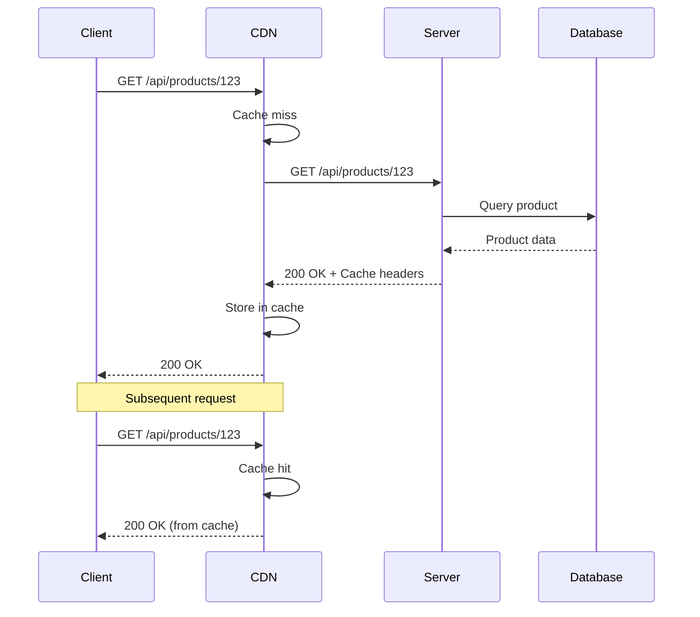
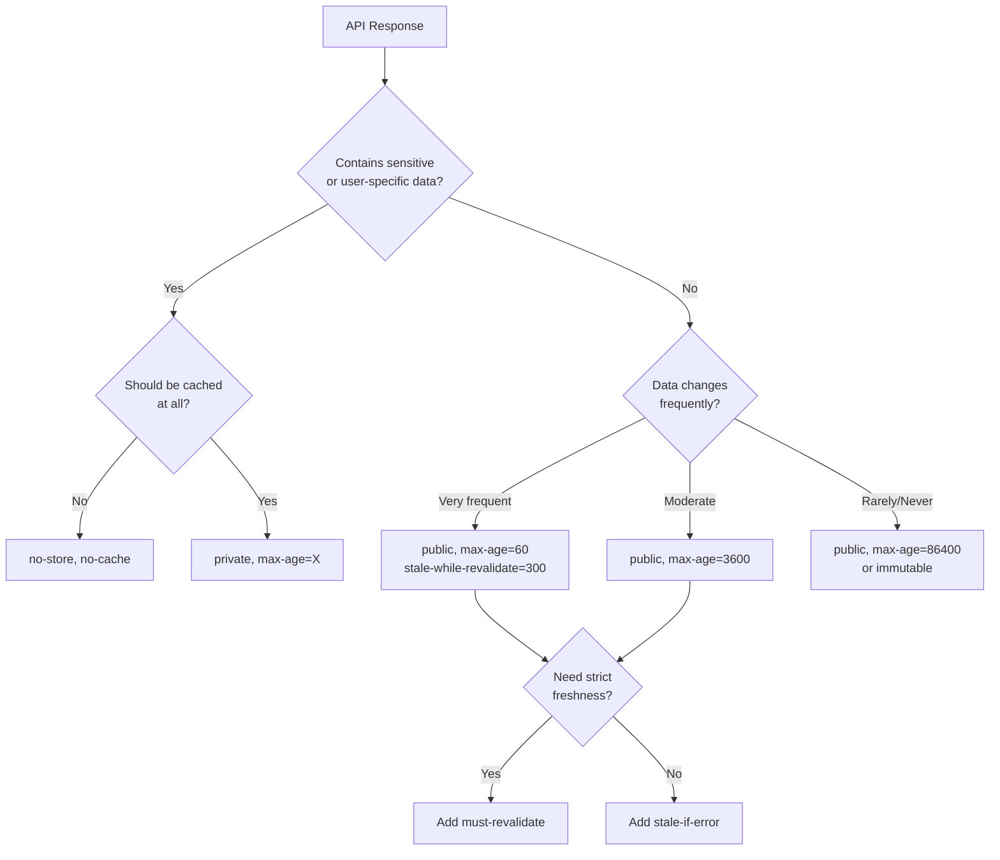
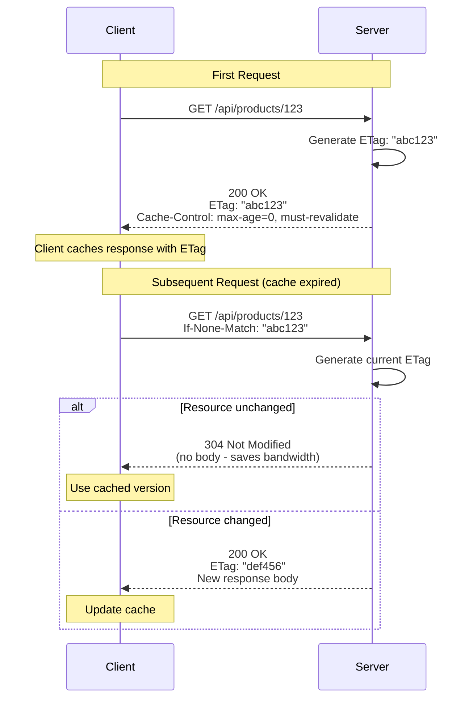
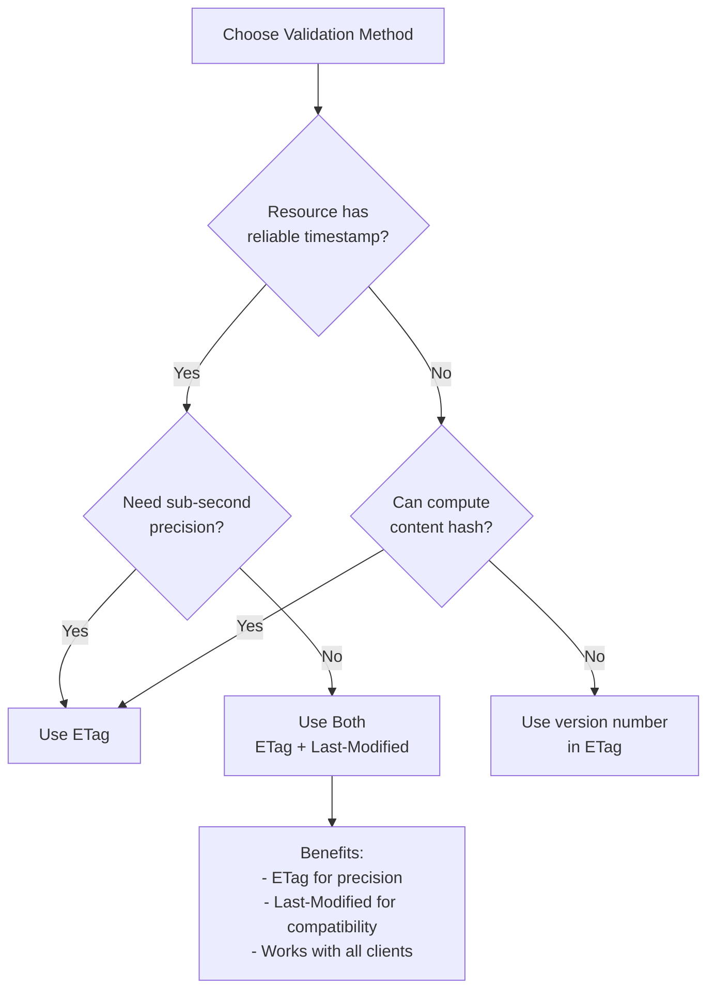
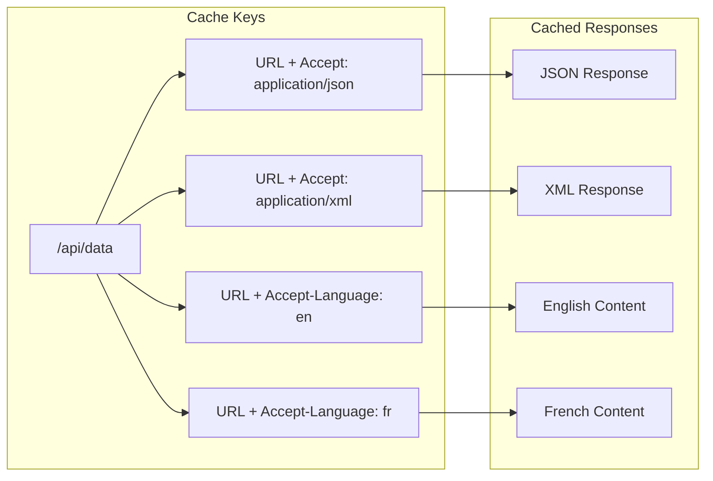
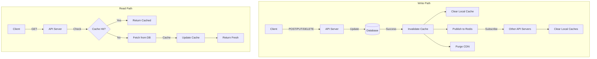

# How to Use HTTP Caching Headers in REST APIs

Author: [nawazdhandala](https://github.com/nawazdhandala)

Tags: REST API, HTTP Caching, Cache-Control, ETag, Performance, Web Development, Backend, DevOps

Description: A comprehensive guide to implementing HTTP caching headers in REST APIs. Learn how to use Cache-Control, ETag, Last-Modified, and Vary headers to improve API performance, reduce server load, and deliver faster responses to clients.

---

> "There are only two hard things in Computer Science: cache invalidation and naming things." - Phil Karlton

HTTP caching is one of the most effective ways to improve REST API performance. When implemented correctly, caching reduces server load, decreases response latency, and saves bandwidth. This guide covers the essential HTTP caching headers and strategies for REST APIs.

## Understanding HTTP Caching

HTTP caching works by storing responses and reusing them for subsequent identical requests. The cache can exist at multiple layers: browser cache, CDN, reverse proxy, or application cache.



### Why Cache REST APIs?

- **Reduced latency**: Cached responses are served instantly without hitting the origin server
- **Lower server load**: Fewer requests reach your application servers
- **Bandwidth savings**: Conditional requests return 304 Not Modified without body
- **Better scalability**: Handle more traffic with the same infrastructure
- **Improved reliability**: Serve stale content when origin is unavailable

## Cache-Control Header

The `Cache-Control` header is the primary mechanism for controlling HTTP caching behavior. It specifies directives that define how, where, and for how long a response can be cached.

### Basic Cache-Control Directives

```javascript
// Express.js middleware for setting Cache-Control headers
const express = require('express');
const app = express();

// Public resource - cacheable by any cache (CDN, browser, proxy)
// max-age=3600 means the response is fresh for 1 hour (3600 seconds)
app.get('/api/products', (req, res) => {
  const products = getProducts();

  res.set('Cache-Control', 'public, max-age=3600');
  res.json(products);
});

// Private resource - only cacheable by the end user's browser
// Prevents CDNs and proxies from caching user-specific data
app.get('/api/users/me/profile', authenticate, (req, res) => {
  const profile = getUserProfile(req.user.id);

  // Private ensures shared caches won't store this
  // max-age=600 allows browser to cache for 10 minutes
  res.set('Cache-Control', 'private, max-age=600');
  res.json(profile);
});

// No caching - for sensitive or frequently changing data
app.get('/api/users/me/notifications', authenticate, (req, res) => {
  const notifications = getNotifications(req.user.id);

  // no-store: Never cache this response anywhere
  // no-cache: Always revalidate with server before using cached version
  res.set('Cache-Control', 'no-store, no-cache, must-revalidate');
  res.json(notifications);
});
```

### Advanced Cache-Control Directives

```javascript
// Stale-while-revalidate: Serve stale content while fetching fresh
// Great for data that can be slightly outdated
app.get('/api/catalog', (req, res) => {
  const catalog = getCatalog();

  // max-age=60: Fresh for 1 minute
  // stale-while-revalidate=300: Serve stale for 5 more minutes while revalidating
  // This provides instant responses while keeping data reasonably fresh
  res.set('Cache-Control', 'public, max-age=60, stale-while-revalidate=300');
  res.json(catalog);
});

// Stale-if-error: Serve stale content if origin fails
// Improves availability during outages
app.get('/api/content', (req, res) => {
  const content = getContent();

  // If the origin is unavailable, serve stale content for up to 1 hour
  res.set('Cache-Control', 'public, max-age=300, stale-if-error=3600');
  res.json(content);
});

// Immutable: Resource will never change (versioned assets)
// Prevents unnecessary revalidation requests
app.get('/api/assets/:version/:filename', (req, res) => {
  const asset = getAsset(req.params.version, req.params.filename);

  // max-age=31536000: Cache for 1 year
  // immutable: Browser won't revalidate even on refresh
  res.set('Cache-Control', 'public, max-age=31536000, immutable');
  res.send(asset);
});

// must-revalidate: Cache must check with origin when stale
// Prevents serving stale content under any circumstances
app.get('/api/inventory', (req, res) => {
  const inventory = getInventory();

  // After max-age expires, cache MUST revalidate before serving
  res.set('Cache-Control', 'public, max-age=60, must-revalidate');
  res.json(inventory);
});
```

### Cache-Control Decision Flow



## ETag and If-None-Match

ETags provide a mechanism for conditional requests. The server generates a unique identifier for each version of a resource. Clients can use this to check if their cached version is still valid.

### Implementing ETag Validation

```javascript
const crypto = require('crypto');

// Generate ETag from content
// Using MD5 hash of the JSON response body
function generateETag(data) {
  const content = JSON.stringify(data);
  // Weak ETags (W/) indicate semantic equivalence, not byte-for-byte
  // Strong ETags (no prefix) indicate byte-for-byte identical
  return `"${crypto.createHash('md5').update(content).digest('hex')}"`;
}

// ETag middleware for conditional GET requests
app.get('/api/products/:id', (req, res) => {
  const product = getProduct(req.params.id);

  if (!product) {
    return res.status(404).json({ error: 'Product not found' });
  }

  // Generate ETag for this version of the resource
  const etag = generateETag(product);
  res.set('ETag', etag);

  // Check if client's cached version matches
  const clientETag = req.get('If-None-Match');

  if (clientETag === etag) {
    // Resource hasn't changed - return 304 with no body
    // This saves bandwidth and processing time
    return res.status(304).end();
  }

  // Resource is new or changed - return full response
  res.set('Cache-Control', 'public, max-age=0, must-revalidate');
  res.json(product);
});

// ETag for collections with version tracking
app.get('/api/products', (req, res) => {
  const products = getProducts();

  // For collections, use a combination of:
  // - Total count
  // - Most recent modification timestamp
  // - Or a version number from your database
  const collectionVersion = getProductsVersion(); // e.g., from DB trigger
  const etag = `"products-v${collectionVersion}"`;

  res.set('ETag', etag);

  if (req.get('If-None-Match') === etag) {
    return res.status(304).end();
  }

  res.set('Cache-Control', 'public, max-age=60');
  res.json(products);
});
```

### ETag Request Flow



### Weak vs Strong ETags

```javascript
// Strong ETag: Byte-for-byte identical
// Use when exact representation matters (file downloads)
function generateStrongETag(buffer) {
  const hash = crypto.createHash('sha256').update(buffer).digest('hex');
  return `"${hash}"`;  // No W/ prefix = strong
}

// Weak ETag: Semantically equivalent
// Use when minor differences are acceptable (JSON with varying whitespace)
function generateWeakETag(data) {
  const normalized = JSON.stringify(data); // Normalizes formatting
  const hash = crypto.createHash('md5').update(normalized).digest('hex');
  return `W/"${hash}"`;  // W/ prefix = weak
}

// Example: API response with weak ETag
app.get('/api/articles/:id', (req, res) => {
  const article = getArticle(req.params.id);

  // Use weak ETag since JSON formatting might vary
  // but semantic content is the same
  const etag = generateWeakETag(article);
  res.set('ETag', etag);

  // Weak comparison: W/"abc" matches W/"abc" or "abc"
  const clientETag = req.get('If-None-Match');
  if (clientETag) {
    // Strip W/ prefix for comparison if present
    const normalizedClient = clientETag.replace(/^W\//, '');
    const normalizedServer = etag.replace(/^W\//, '');

    if (normalizedClient === normalizedServer) {
      return res.status(304).end();
    }
  }

  res.json(article);
});
```

## Last-Modified and If-Modified-Since

The `Last-Modified` header provides time-based cache validation. It's simpler than ETags but less precise - timestamps have second-level granularity.

### Implementing Last-Modified

```javascript
// Basic Last-Modified implementation
app.get('/api/articles/:id', (req, res) => {
  const article = getArticle(req.params.id);

  if (!article) {
    return res.status(404).json({ error: 'Article not found' });
  }

  // Convert database timestamp to HTTP date format
  // Must be in RFC 7231 format: "Tue, 15 Nov 1994 12:45:26 GMT"
  const lastModified = new Date(article.updatedAt).toUTCString();
  res.set('Last-Modified', lastModified);

  // Check If-Modified-Since header from client
  const ifModifiedSince = req.get('If-Modified-Since');

  if (ifModifiedSince) {
    const clientDate = new Date(ifModifiedSince);
    const serverDate = new Date(article.updatedAt);

    // Truncate to seconds for comparison (HTTP dates have second precision)
    if (Math.floor(clientDate.getTime() / 1000) >=
        Math.floor(serverDate.getTime() / 1000)) {
      // Resource hasn't been modified since client's version
      return res.status(304).end();
    }
  }

  res.set('Cache-Control', 'public, max-age=0, must-revalidate');
  res.json(article);
});

// Combined ETag and Last-Modified (recommended)
// Provides both validation mechanisms for maximum compatibility
app.get('/api/posts/:id', (req, res) => {
  const post = getPost(req.params.id);

  if (!post) {
    return res.status(404).json({ error: 'Post not found' });
  }

  const etag = generateETag(post);
  const lastModified = new Date(post.updatedAt).toUTCString();

  res.set('ETag', etag);
  res.set('Last-Modified', lastModified);

  // Check ETag first (more precise), then Last-Modified
  const clientETag = req.get('If-None-Match');
  const ifModifiedSince = req.get('If-Modified-Since');

  // ETag takes precedence if present
  if (clientETag) {
    if (clientETag === etag) {
      return res.status(304).end();
    }
  } else if (ifModifiedSince) {
    const clientDate = new Date(ifModifiedSince);
    const serverDate = new Date(post.updatedAt);

    if (Math.floor(clientDate.getTime() / 1000) >=
        Math.floor(serverDate.getTime() / 1000)) {
      return res.status(304).end();
    }
  }

  res.set('Cache-Control', 'public, max-age=300');
  res.json(post);
});
```

### When to Use ETag vs Last-Modified



## Vary Header

The `Vary` header tells caches that the response varies based on certain request headers. This is crucial for APIs that return different content based on headers like `Accept`, `Accept-Language`, or `Authorization`.

### Implementing Vary Header

```javascript
// Vary by Accept header for content negotiation
// Same URL can return JSON or XML based on Accept header
app.get('/api/data', (req, res) => {
  const data = getData();

  // Tell caches to store separate versions for each Accept value
  res.set('Vary', 'Accept');
  res.set('Cache-Control', 'public, max-age=3600');

  const acceptHeader = req.get('Accept');

  if (acceptHeader && acceptHeader.includes('application/xml')) {
    res.type('application/xml');
    res.send(convertToXml(data));
  } else {
    res.json(data);
  }
});

// Vary by Accept-Encoding for compressed responses
// CDNs need to cache gzip and non-gzip versions separately
app.get('/api/large-data', (req, res) => {
  const data = getLargeData();

  // Multiple Vary headers combined
  res.set('Vary', 'Accept, Accept-Encoding');
  res.set('Cache-Control', 'public, max-age=3600');

  res.json(data);
});

// Vary by Authorization - be careful with this!
// Each unique Authorization header creates a separate cache entry
app.get('/api/personalized-content', authenticate, (req, res) => {
  const content = getPersonalizedContent(req.user.id);

  // This means the cache key includes the Authorization header
  // Usually better to use 'private' instead for user-specific content
  res.set('Vary', 'Authorization');
  res.set('Cache-Control', 'private, max-age=300');

  res.json(content);
});

// Vary by Accept-Language for localized content
app.get('/api/messages', (req, res) => {
  const language = req.get('Accept-Language') || 'en';
  const messages = getMessages(language);

  res.set('Vary', 'Accept-Language');
  res.set('Cache-Control', 'public, max-age=3600');

  res.json(messages);
});
```

### Common Vary Patterns



### Vary Header Best Practices

```javascript
// Middleware to set common Vary headers
function varyMiddleware(req, res, next) {
  // Always vary by Accept-Encoding when using compression
  // This is usually handled by compression middleware

  // Set Vary header based on route configuration
  const routeConfig = getRouteConfig(req.path);

  if (routeConfig.varyHeaders && routeConfig.varyHeaders.length > 0) {
    res.set('Vary', routeConfig.varyHeaders.join(', '));
  }

  next();
}

// Avoid Vary: * - it effectively disables caching
// Instead, list specific headers that affect the response
app.get('/api/dynamic', (req, res) => {
  // BAD: Vary: * means every request is unique
  // res.set('Vary', '*');

  // GOOD: List only headers that actually affect the response
  res.set('Vary', 'Accept, Accept-Language, Authorization');
  res.json(getDynamicContent(req));
});

// Avoid varying on headers with high cardinality
// This creates too many cache entries
app.get('/api/analytics', (req, res) => {
  // BAD: User-Agent has thousands of variations
  // res.set('Vary', 'User-Agent');

  // GOOD: Group by device type in your app logic
  const deviceType = classifyDevice(req.get('User-Agent')); // 'mobile' | 'desktop'
  res.set('X-Device-Type', deviceType);
  res.set('Vary', 'X-Device-Type');

  res.json(getAnalytics(deviceType));
});
```

## Cache Invalidation Strategies

Cache invalidation is challenging because cached content exists in multiple locations outside your control. Here are proven strategies for different scenarios.

### Event-Based Invalidation

```javascript
const Redis = require('ioredis');
const redis = new Redis();

// Pub/Sub for cache invalidation across services
const publisher = new Redis();
const subscriber = new Redis();

// Subscribe to invalidation events
subscriber.subscribe('cache:invalidate', (err, count) => {
  console.log(`Subscribed to ${count} channels`);
});

subscriber.on('message', (channel, message) => {
  const { pattern, keys } = JSON.parse(message);

  // Clear local cache
  if (pattern) {
    localCache.deleteByPattern(pattern);
  }
  if (keys) {
    keys.forEach(key => localCache.delete(key));
  }

  console.log(`Cache invalidated: ${pattern || keys.join(', ')}`);
});

// Invalidate cache when data changes
async function updateProduct(id, data) {
  // Update database
  await db.products.update(id, data);

  // Publish invalidation event
  await publisher.publish('cache:invalidate', JSON.stringify({
    keys: [
      `product:${id}`,
      'products:list',
      `products:category:${data.categoryId}`
    ]
  }));

  // Optionally, purge CDN cache
  await purgeCDN([
    `/api/products/${id}`,
    '/api/products'
  ]);
}

// CDN purge function (example with Cloudflare)
async function purgeCDN(paths) {
  const response = await fetch(
    `https://api.cloudflare.com/client/v4/zones/${ZONE_ID}/purge_cache`,
    {
      method: 'POST',
      headers: {
        'Authorization': `Bearer ${CF_API_TOKEN}`,
        'Content-Type': 'application/json'
      },
      body: JSON.stringify({
        files: paths.map(p => `${BASE_URL}${p}`)
      })
    }
  );

  if (!response.ok) {
    console.error('CDN purge failed:', await response.text());
  }
}
```

### Version-Based URLs

```javascript
// Version in URL path - guarantees fresh content
// When data changes, change the version number
app.get('/api/v1/config/:version', (req, res) => {
  const { version } = req.params;
  const config = getConfig(version);

  // Long cache time since URL changes when content changes
  res.set('Cache-Control', 'public, max-age=31536000, immutable');
  res.json(config);
});

// Redirect latest to versioned URL
app.get('/api/v1/config/latest', (req, res) => {
  const currentVersion = getCurrentConfigVersion();

  // Short cache to allow version updates to propagate
  res.set('Cache-Control', 'public, max-age=60');
  res.redirect(302, `/api/v1/config/${currentVersion}`);
});

// Query parameter versioning for cache busting
// Client includes resource version in request
app.get('/api/resources/:id', (req, res) => {
  const { id } = req.params;
  const { v } = req.query; // Version from client

  const resource = getResource(id);

  if (v && v === resource.version) {
    // Client requested specific version that matches current
    res.set('Cache-Control', 'public, max-age=86400');
  } else {
    // No version or mismatch - short cache
    res.set('Cache-Control', 'public, max-age=60');
  }

  res.json({
    ...resource,
    _cacheVersion: resource.version // Client uses this for next request
  });
});
```

### Cache Invalidation Flow



### Stale-While-Revalidate Pattern

```javascript
const NodeCache = require('node-cache');
const cache = new NodeCache();

// Stale-while-revalidate implementation for server-side cache
async function getWithSWR(key, fetchFn, options = {}) {
  const {
    freshFor = 60,        // Seconds data is considered fresh
    staleFor = 300,       // Additional seconds to serve stale
    lockTimeout = 5000    // Prevent thundering herd
  } = options;

  const cached = cache.get(key);
  const now = Date.now();

  if (cached) {
    const age = (now - cached.timestamp) / 1000;

    if (age < freshFor) {
      // Fresh - return immediately
      return cached.data;
    }

    if (age < freshFor + staleFor) {
      // Stale but within SWR window
      // Return stale immediately, revalidate in background
      revalidateInBackground(key, fetchFn, options);
      return cached.data;
    }
  }

  // No cache or too stale - must fetch
  return fetchAndCache(key, fetchFn, options);
}

async function revalidateInBackground(key, fetchFn, options) {
  const lockKey = `lock:${key}`;

  // Prevent multiple simultaneous revalidations
  if (cache.get(lockKey)) {
    return;
  }

  cache.set(lockKey, true, options.lockTimeout / 1000);

  try {
    const data = await fetchFn();
    cache.set(key, { data, timestamp: Date.now() });
  } catch (error) {
    console.error(`Background revalidation failed for ${key}:`, error);
  } finally {
    cache.del(lockKey);
  }
}

async function fetchAndCache(key, fetchFn, options) {
  const data = await fetchFn();
  cache.set(key, { data, timestamp: Date.now() });
  return data;
}

// Usage in API route
app.get('/api/popular-products', async (req, res) => {
  const products = await getWithSWR(
    'popular-products',
    () => db.products.findPopular(),
    { freshFor: 60, staleFor: 300 }
  );

  // Set HTTP headers to match server cache behavior
  res.set('Cache-Control', 'public, max-age=60, stale-while-revalidate=300');
  res.json(products);
});
```

## Complete Express.js Caching Middleware

Here's a reusable middleware that implements all the caching patterns discussed.

```javascript
const crypto = require('crypto');

// Configuration object for different route patterns
const cacheConfig = {
  // Static reference data - long cache
  '/api/countries': {
    cacheControl: 'public, max-age=86400',
    etag: true,
    lastModified: true,
    vary: ['Accept']
  },

  // Frequently accessed but changes occasionally
  '/api/products': {
    cacheControl: 'public, max-age=300, stale-while-revalidate=600',
    etag: true,
    lastModified: true,
    vary: ['Accept', 'Accept-Language']
  },

  // User-specific data
  '/api/users/*/profile': {
    cacheControl: 'private, max-age=60',
    etag: true,
    vary: ['Authorization']
  },

  // Never cache
  '/api/auth/*': {
    cacheControl: 'no-store, no-cache, must-revalidate'
  },

  // Real-time data
  '/api/notifications': {
    cacheControl: 'no-cache',
    etag: true  // Allows 304 responses
  }
};

// Match URL pattern to config
function getConfigForPath(path) {
  for (const [pattern, config] of Object.entries(cacheConfig)) {
    const regex = new RegExp('^' + pattern.replace(/\*/g, '[^/]+') + '$');
    if (regex.test(path)) {
      return config;
    }
  }
  // Default config
  return { cacheControl: 'public, max-age=60' };
}

// Generate ETag from response body
function generateETag(body) {
  const hash = crypto
    .createHash('md5')
    .update(typeof body === 'string' ? body : JSON.stringify(body))
    .digest('hex');
  return `W/"${hash}"`;
}

// Main caching middleware
function cachingMiddleware(req, res, next) {
  // Only apply to GET and HEAD requests
  if (!['GET', 'HEAD'].includes(req.method)) {
    return next();
  }

  const config = getConfigForPath(req.path);

  // Store original json method
  const originalJson = res.json.bind(res);

  // Override json method to add cache headers
  res.json = function(body) {
    // Set Cache-Control
    if (config.cacheControl) {
      res.set('Cache-Control', config.cacheControl);
    }

    // Set Vary header
    if (config.vary && config.vary.length > 0) {
      res.set('Vary', config.vary.join(', '));
    }

    // Generate and check ETag
    if (config.etag) {
      const etag = generateETag(body);
      res.set('ETag', etag);

      const clientETag = req.get('If-None-Match');
      if (clientETag === etag) {
        return res.status(304).end();
      }
    }

    // Set Last-Modified if body has timestamp
    if (config.lastModified && body && body.updatedAt) {
      const lastModified = new Date(body.updatedAt).toUTCString();
      res.set('Last-Modified', lastModified);

      const ifModifiedSince = req.get('If-Modified-Since');
      if (ifModifiedSince && !req.get('If-None-Match')) {
        const clientDate = new Date(ifModifiedSince);
        const serverDate = new Date(body.updatedAt);

        if (Math.floor(clientDate.getTime() / 1000) >=
            Math.floor(serverDate.getTime() / 1000)) {
          return res.status(304).end();
        }
      }
    }

    // Call original json method
    return originalJson(body);
  };

  next();
}

// Apply middleware
app.use(cachingMiddleware);

// Example routes
app.get('/api/products', (req, res) => {
  const products = getProducts();
  res.json({
    data: products,
    updatedAt: getProductsLastModified()
  });
});

app.get('/api/users/:id/profile', authenticate, (req, res) => {
  const profile = getUserProfile(req.params.id);
  res.json(profile);
});
```

## Monitoring Cache Performance

Track cache effectiveness with metrics and logging.

```javascript
const prometheus = require('prom-client');

// Cache hit/miss metrics
const cacheHits = new prometheus.Counter({
  name: 'api_cache_hits_total',
  help: 'Total number of cache hits (304 responses)',
  labelNames: ['path', 'method']
});

const cacheMisses = new prometheus.Counter({
  name: 'api_cache_misses_total',
  help: 'Total number of cache misses (200 responses)',
  labelNames: ['path', 'method']
});

const cacheBypassTotal = new prometheus.Counter({
  name: 'api_cache_bypass_total',
  help: 'Total requests that bypassed cache',
  labelNames: ['path', 'reason']
});

// Middleware to track cache metrics
function cacheMetricsMiddleware(req, res, next) {
  const originalEnd = res.end;

  res.end = function(...args) {
    const labels = {
      path: req.route?.path || req.path,
      method: req.method
    };

    if (res.statusCode === 304) {
      cacheHits.inc(labels);
    } else if (res.statusCode === 200) {
      cacheMisses.inc(labels);
    }

    // Track cache bypass reasons
    if (req.get('Cache-Control') === 'no-cache') {
      cacheBypassTotal.inc({ path: labels.path, reason: 'client_no_cache' });
    }
    if (req.get('Pragma') === 'no-cache') {
      cacheBypassTotal.inc({ path: labels.path, reason: 'client_pragma' });
    }

    return originalEnd.apply(this, args);
  };

  next();
}

// Expose metrics endpoint
app.get('/metrics', async (req, res) => {
  res.set('Content-Type', prometheus.register.contentType);
  res.send(await prometheus.register.metrics());
});
```

## Summary

| Header | Purpose | When to Use |
|--------|---------|-------------|
| **Cache-Control** | Define caching behavior | Every cacheable response |
| **ETag** | Content-based validation | When content hash is available |
| **Last-Modified** | Time-based validation | When modification time is tracked |
| **Vary** | Cache key variations | When response varies by request headers |

### Key Takeaways

1. **Use Cache-Control** on every response - even `no-store` is explicit
2. **Combine ETag and Last-Modified** for maximum compatibility
3. **Set appropriate Vary headers** for content negotiation
4. **Implement stale-while-revalidate** for better perceived performance
5. **Plan cache invalidation** before building your caching layer
6. **Monitor cache hit rates** to measure effectiveness

Effective HTTP caching can dramatically improve your API performance. Start with conservative cache times, monitor hit rates, and adjust based on your data's update frequency.

For comprehensive monitoring of your API performance, cache hit rates, and response times, check out [OneUptime](https://oneuptime.com) - an open-source observability platform that helps you track and optimize your application's caching effectiveness.
