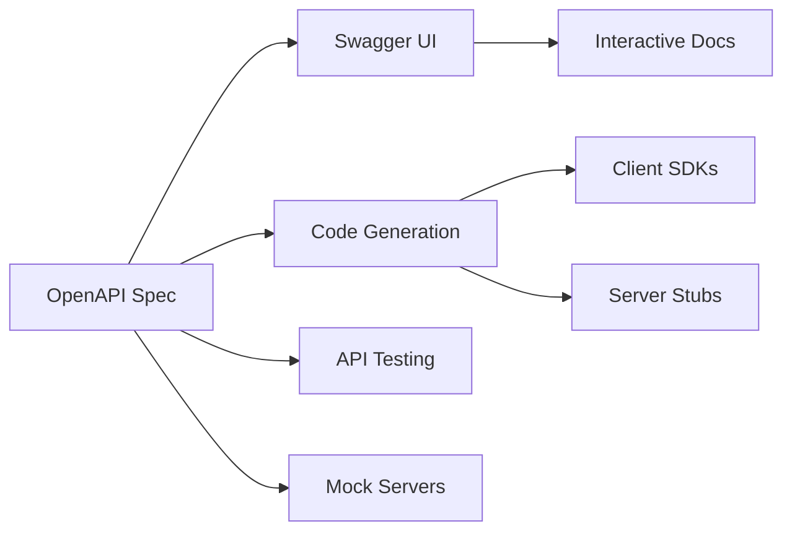
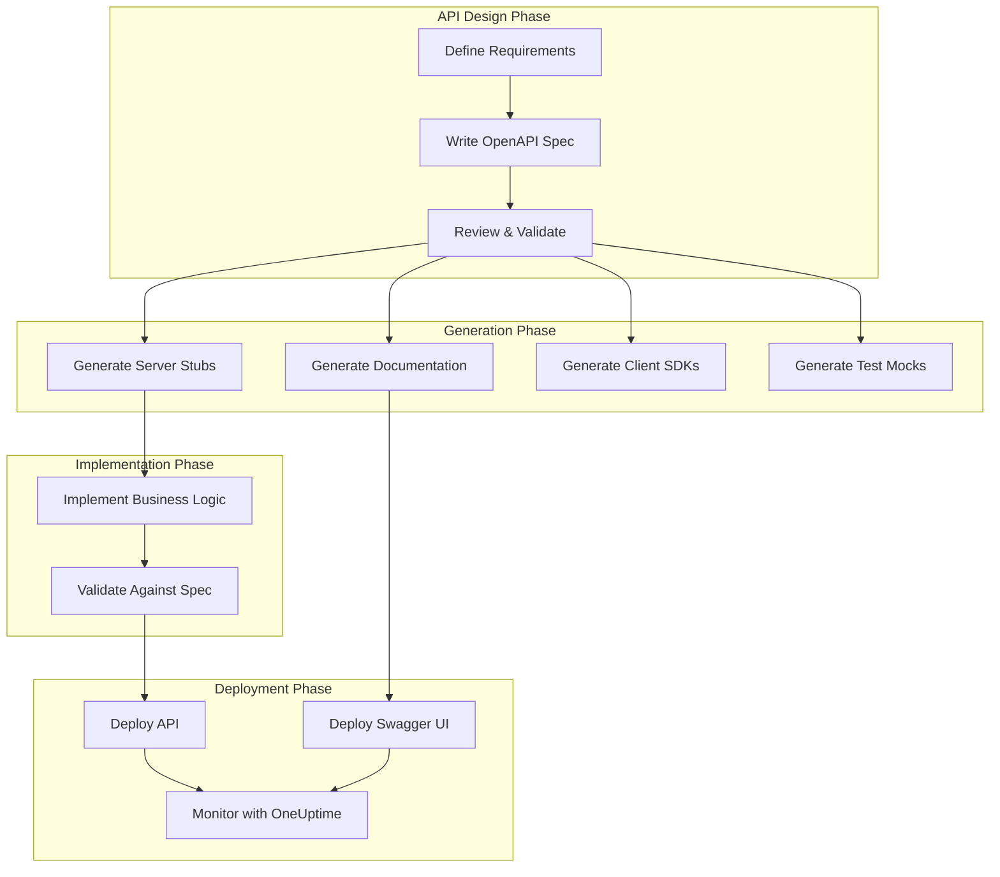
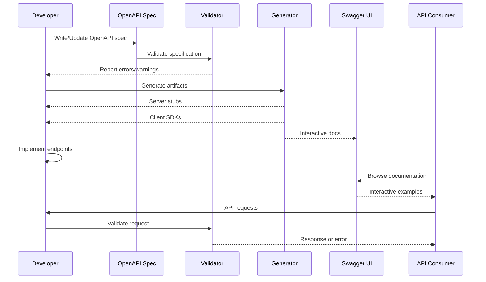

# How to Document REST APIs with OpenAPI

Author: [nawazdhandala](https://github.com/nawazdhandala)

Tags: OpenAPI, REST API, Documentation, Swagger, API Design, Code Generation

Description: Learn how to document REST APIs using the OpenAPI 3.0 specification. This guide covers schema definitions, endpoint documentation, request/response examples, Swagger UI integration, and automated code generation.

---

> "APIs are only as good as their documentation. An API that is easy to understand and well-documented is an API that developers actually want to use."

## Why OpenAPI Matters

OpenAPI (formerly known as Swagger) has become the industry standard for describing REST APIs. It provides a machine-readable format that enables automatic documentation generation, client SDK creation, and API testing. With OpenAPI, your API becomes self-documenting and accessible to developers without requiring them to read through source code.



## Understanding OpenAPI 3.0 Structure

An OpenAPI specification document consists of several key sections that together describe your entire API surface.

```yaml
# openapi.yaml - The root structure of an OpenAPI 3.0 document
openapi: 3.0.3  # OpenAPI version

# API metadata - provides general information about your API
info:
  title: Task Management API
  description: |
    A REST API for managing tasks and projects.
    Supports CRUD operations with authentication.
  version: 1.0.0
  contact:
    name: API Support
    email: support@example.com
    url: https://example.com/support
  license:
    name: MIT
    url: https://opensource.org/licenses/MIT

# Server URLs where the API is hosted
servers:
  - url: https://api.example.com/v1
    description: Production server
  - url: https://staging-api.example.com/v1
    description: Staging server
  - url: http://localhost:3000/v1
    description: Local development

# Tags for grouping related endpoints
tags:
  - name: Tasks
    description: Task management operations
  - name: Projects
    description: Project management operations
  - name: Users
    description: User account operations
```

## Defining Reusable Components

Components allow you to define schemas, parameters, and responses that can be reused across your API specification. This promotes consistency and reduces duplication.

```yaml
# Components section - reusable schemas, parameters, and responses
components:
  # Security schemes define authentication methods
  securitySchemes:
    bearerAuth:
      type: http
      scheme: bearer
      bearerFormat: JWT
      description: JWT token authentication

    apiKey:
      type: apiKey
      in: header
      name: X-API-Key
      description: API key for server-to-server communication

  # Schemas define data models used in requests and responses
  schemas:
    # Task schema - represents a task entity
    Task:
      type: object
      required:
        - title
        - status
      properties:
        id:
          type: string
          format: uuid
          readOnly: true  # Only appears in responses, not requests
          example: "550e8400-e29b-41d4-a716-446655440000"
        title:
          type: string
          minLength: 1
          maxLength: 200
          example: "Implement user authentication"
        description:
          type: string
          maxLength: 2000
          nullable: true
          example: "Add JWT-based authentication to the API"
        status:
          type: string
          enum: [pending, in_progress, completed, cancelled]
          default: pending
          example: "in_progress"
        priority:
          type: integer
          minimum: 1
          maximum: 5
          default: 3
          description: "Priority level from 1 (lowest) to 5 (highest)"
        dueDate:
          type: string
          format: date-time
          nullable: true
          example: "2026-02-15T10:00:00Z"
        assigneeId:
          type: string
          format: uuid
          nullable: true
        tags:
          type: array
          items:
            type: string
          maxItems: 10
          example: ["backend", "security"]
        createdAt:
          type: string
          format: date-time
          readOnly: true
        updatedAt:
          type: string
          format: date-time
          readOnly: true

    # Request body for creating a task (excludes read-only fields)
    TaskCreate:
      type: object
      required:
        - title
      properties:
        title:
          type: string
          minLength: 1
          maxLength: 200
        description:
          type: string
          maxLength: 2000
        status:
          type: string
          enum: [pending, in_progress, completed, cancelled]
          default: pending
        priority:
          type: integer
          minimum: 1
          maximum: 5
          default: 3
        dueDate:
          type: string
          format: date-time
        assigneeId:
          type: string
          format: uuid
        tags:
          type: array
          items:
            type: string
          maxItems: 10

    # Paginated response wrapper
    PaginatedTasks:
      type: object
      properties:
        data:
          type: array
          items:
            $ref: '#/components/schemas/Task'
        pagination:
          $ref: '#/components/schemas/Pagination'

    Pagination:
      type: object
      properties:
        page:
          type: integer
          minimum: 1
          example: 1
        limit:
          type: integer
          minimum: 1
          maximum: 100
          example: 20
        total:
          type: integer
          minimum: 0
          example: 150
        totalPages:
          type: integer
          minimum: 0
          example: 8

    # Standard error response
    Error:
      type: object
      required:
        - code
        - message
      properties:
        code:
          type: string
          example: "VALIDATION_ERROR"
        message:
          type: string
          example: "Invalid input data"
        details:
          type: array
          items:
            type: object
            properties:
              field:
                type: string
              message:
                type: string
```

## Documenting API Endpoints

The paths section defines your API endpoints, their HTTP methods, parameters, request bodies, and responses.

```yaml
# Paths section - defines all API endpoints
paths:
  # Tasks collection endpoint
  /tasks:
    # GET /tasks - List all tasks with filtering and pagination
    get:
      tags:
        - Tasks
      summary: List all tasks
      description: |
        Retrieves a paginated list of tasks with optional filtering.
        Results are sorted by creation date (newest first) by default.
      operationId: listTasks  # Unique identifier for code generation
      security:
        - bearerAuth: []
      parameters:
        # Query parameters for filtering
        - name: status
          in: query
          description: Filter tasks by status
          required: false
          schema:
            type: string
            enum: [pending, in_progress, completed, cancelled]
        - name: priority
          in: query
          description: Filter tasks by minimum priority
          required: false
          schema:
            type: integer
            minimum: 1
            maximum: 5
        - name: assigneeId
          in: query
          description: Filter tasks by assignee
          required: false
          schema:
            type: string
            format: uuid
        - name: search
          in: query
          description: Search in title and description
          required: false
          schema:
            type: string
            minLength: 2
        # Pagination parameters
        - name: page
          in: query
          description: Page number (1-indexed)
          required: false
          schema:
            type: integer
            minimum: 1
            default: 1
        - name: limit
          in: query
          description: Number of items per page
          required: false
          schema:
            type: integer
            minimum: 1
            maximum: 100
            default: 20
        # Sorting parameters
        - name: sortBy
          in: query
          description: Field to sort by
          required: false
          schema:
            type: string
            enum: [createdAt, updatedAt, dueDate, priority]
            default: createdAt
        - name: sortOrder
          in: query
          description: Sort order
          required: false
          schema:
            type: string
            enum: [asc, desc]
            default: desc
      responses:
        '200':
          description: Successfully retrieved tasks
          content:
            application/json:
              schema:
                $ref: '#/components/schemas/PaginatedTasks'
              example:
                data:
                  - id: "550e8400-e29b-41d4-a716-446655440000"
                    title: "Implement user authentication"
                    description: "Add JWT-based authentication"
                    status: "in_progress"
                    priority: 4
                    tags: ["backend", "security"]
                    createdAt: "2026-01-20T10:00:00Z"
                    updatedAt: "2026-01-25T14:30:00Z"
                pagination:
                  page: 1
                  limit: 20
                  total: 150
                  totalPages: 8
        '401':
          description: Unauthorized - Invalid or missing authentication
          content:
            application/json:
              schema:
                $ref: '#/components/schemas/Error'
              example:
                code: "UNAUTHORIZED"
                message: "Invalid or expired token"

    # POST /tasks - Create a new task
    post:
      tags:
        - Tasks
      summary: Create a new task
      description: Creates a new task with the provided details
      operationId: createTask
      security:
        - bearerAuth: []
      requestBody:
        required: true
        content:
          application/json:
            schema:
              $ref: '#/components/schemas/TaskCreate'
            examples:
              minimal:
                summary: Minimal task
                value:
                  title: "Review pull request"
              complete:
                summary: Complete task with all fields
                value:
                  title: "Implement user authentication"
                  description: "Add JWT-based authentication to the API"
                  status: "pending"
                  priority: 4
                  dueDate: "2026-02-15T10:00:00Z"
                  tags: ["backend", "security"]
      responses:
        '201':
          description: Task created successfully
          content:
            application/json:
              schema:
                $ref: '#/components/schemas/Task'
          headers:
            Location:
              description: URL of the created resource
              schema:
                type: string
                format: uri
        '400':
          description: Invalid request body
          content:
            application/json:
              schema:
                $ref: '#/components/schemas/Error'
              example:
                code: "VALIDATION_ERROR"
                message: "Invalid input data"
                details:
                  - field: "title"
                    message: "Title is required"
        '401':
          description: Unauthorized
          content:
            application/json:
              schema:
                $ref: '#/components/schemas/Error'
```

## Documenting Individual Resource Operations

For individual resource operations (GET, PUT, PATCH, DELETE), you define path parameters and specific request/response schemas.

```yaml
  # Single task endpoint
  /tasks/{taskId}:
    # Reusable path parameter
    parameters:
      - name: taskId
        in: path
        description: Unique identifier of the task
        required: true
        schema:
          type: string
          format: uuid

    # GET /tasks/{taskId} - Retrieve a specific task
    get:
      tags:
        - Tasks
      summary: Get a task by ID
      description: Retrieves detailed information about a specific task
      operationId: getTaskById
      security:
        - bearerAuth: []
      responses:
        '200':
          description: Task found
          content:
            application/json:
              schema:
                $ref: '#/components/schemas/Task'
        '404':
          description: Task not found
          content:
            application/json:
              schema:
                $ref: '#/components/schemas/Error'
              example:
                code: "NOT_FOUND"
                message: "Task with the specified ID was not found"

    # PUT /tasks/{taskId} - Full update of a task
    put:
      tags:
        - Tasks
      summary: Update a task (full replacement)
      description: |
        Replaces all task fields with the provided values.
        Use PATCH for partial updates.
      operationId: updateTask
      security:
        - bearerAuth: []
      requestBody:
        required: true
        content:
          application/json:
            schema:
              $ref: '#/components/schemas/TaskCreate'
      responses:
        '200':
          description: Task updated successfully
          content:
            application/json:
              schema:
                $ref: '#/components/schemas/Task'
        '400':
          description: Invalid request body
          content:
            application/json:
              schema:
                $ref: '#/components/schemas/Error'
        '404':
          description: Task not found
          content:
            application/json:
              schema:
                $ref: '#/components/schemas/Error'

    # PATCH /tasks/{taskId} - Partial update of a task
    patch:
      tags:
        - Tasks
      summary: Partially update a task
      description: Updates only the provided fields of a task
      operationId: patchTask
      security:
        - bearerAuth: []
      requestBody:
        required: true
        content:
          application/json:
            schema:
              type: object
              minProperties: 1  # At least one field required
              properties:
                title:
                  type: string
                  minLength: 1
                  maxLength: 200
                description:
                  type: string
                  maxLength: 2000
                status:
                  type: string
                  enum: [pending, in_progress, completed, cancelled]
                priority:
                  type: integer
                  minimum: 1
                  maximum: 5
                dueDate:
                  type: string
                  format: date-time
                tags:
                  type: array
                  items:
                    type: string
            examples:
              updateStatus:
                summary: Update status only
                value:
                  status: "completed"
              updatePriority:
                summary: Update priority and due date
                value:
                  priority: 5
                  dueDate: "2026-02-01T10:00:00Z"
      responses:
        '200':
          description: Task updated successfully
          content:
            application/json:
              schema:
                $ref: '#/components/schemas/Task'
        '400':
          description: Invalid request body
          content:
            application/json:
              schema:
                $ref: '#/components/schemas/Error'
        '404':
          description: Task not found
          content:
            application/json:
              schema:
                $ref: '#/components/schemas/Error'

    # DELETE /tasks/{taskId} - Delete a task
    delete:
      tags:
        - Tasks
      summary: Delete a task
      description: Permanently deletes a task
      operationId: deleteTask
      security:
        - bearerAuth: []
      responses:
        '204':
          description: Task deleted successfully (no content)
        '404':
          description: Task not found
          content:
            application/json:
              schema:
                $ref: '#/components/schemas/Error'
```

## OpenAPI Workflow Visualization

Here is how the OpenAPI specification fits into your development workflow:



## Integrating Swagger UI

Swagger UI provides interactive documentation that allows developers to explore and test your API directly in the browser.

```javascript
// server.js - Express server with Swagger UI integration
const express = require('express');
const swaggerUi = require('swagger-ui-express');
const YAML = require('yamljs');
const path = require('path');

const app = express();

// Load the OpenAPI specification from YAML file
const swaggerDocument = YAML.load(path.join(__dirname, 'openapi.yaml'));

// Swagger UI configuration options
const swaggerOptions = {
  // Customize the Swagger UI appearance
  customCss: '.swagger-ui .topbar { display: none }',
  customSiteTitle: "Task Management API Documentation",

  // Explorer options
  explorer: true,

  // Swagger UI options passed to SwaggerUIBundle
  swaggerOptions: {
    // Persist authorization across page reloads
    persistAuthorization: true,

    // Display request duration in milliseconds
    displayRequestDuration: true,

    // Default models expansion depth (0 = collapsed)
    defaultModelsExpandDepth: 2,

    // Default model expansion depth in responses
    defaultModelExpandDepth: 2,

    // Show extensions (x- fields)
    showExtensions: true,

    // Show common extensions
    showCommonExtensions: true,

    // Try it out enabled by default
    tryItOutEnabled: true,

    // Filter operations by tag
    filter: true,

    // Sort operations alphabetically or by method
    operationsSorter: 'alpha',

    // Sort tags alphabetically
    tagsSorter: 'alpha'
  }
};

// Serve Swagger UI at /docs endpoint
app.use('/docs', swaggerUi.serve, swaggerUi.setup(swaggerDocument, swaggerOptions));

// Serve the raw OpenAPI specification
app.get('/openapi.json', (req, res) => {
  res.json(swaggerDocument);
});

app.get('/openapi.yaml', (req, res) => {
  res.type('text/yaml');
  res.send(YAML.stringify(swaggerDocument, 10, 2));
});

// Your API routes go here
app.use('/v1', require('./routes'));

// Start the server
const PORT = process.env.PORT || 3000;
app.listen(PORT, () => {
  console.log(`API server running on port ${PORT}`);
  console.log(`API documentation available at http://localhost:${PORT}/docs`);
});
```

For a more customized setup, you can serve Swagger UI with a custom HTML template:

```html
<!-- public/docs/index.html - Custom Swagger UI page -->
<!DOCTYPE html>
<html lang="en">
<head>
  <meta charset="UTF-8">
  <meta name="viewport" content="width=device-width, initial-scale=1.0">
  <title>Task Management API - Documentation</title>
  <!-- Load Swagger UI CSS from CDN -->
  <link rel="stylesheet" href="https://unpkg.com/swagger-ui-dist@5/swagger-ui.css">
  <style>
    /* Custom styling */
    body {
      margin: 0;
      padding: 0;
    }
    .swagger-ui .topbar {
      background-color: #1a1a2e;
    }
    .swagger-ui .info .title {
      color: #16213e;
    }
  </style>
</head>
<body>
  <!-- Swagger UI container -->
  <div id="swagger-ui"></div>

  <!-- Load Swagger UI JavaScript from CDN -->
  <script src="https://unpkg.com/swagger-ui-dist@5/swagger-ui-bundle.js"></script>
  <script src="https://unpkg.com/swagger-ui-dist@5/swagger-ui-standalone-preset.js"></script>

  <script>
    // Initialize Swagger UI
    window.onload = function() {
      window.ui = SwaggerUIBundle({
        // URL to your OpenAPI specification
        url: "/openapi.yaml",

        // Mount point
        dom_id: '#swagger-ui',

        // Presets for standard layout
        presets: [
          SwaggerUIBundle.presets.apis,
          SwaggerUIStandalonePreset
        ],

        // Layout configuration
        layout: "StandaloneLayout",

        // Deep linking for shareable URLs
        deepLinking: true,

        // Persist authorization
        persistAuthorization: true,

        // Display options
        displayRequestDuration: true,
        filter: true,
        showExtensions: true,

        // OAuth2 redirect URL for authorization flows
        oauth2RedirectUrl: window.location.origin + "/docs/oauth2-redirect.html"
      });
    };
  </script>
</body>
</html>
```

## Automated Code Generation

One of the most powerful features of OpenAPI is the ability to generate client SDKs and server stubs automatically.

```bash
# Install the OpenAPI Generator CLI
npm install -g @openapitools/openapi-generator-cli

# Generate a TypeScript client SDK
openapi-generator-cli generate \
  -i openapi.yaml \
  -g typescript-fetch \
  -o ./generated/typescript-client \
  --additional-properties=supportsES6=true,npmName=task-api-client

# Generate a Python client SDK
openapi-generator-cli generate \
  -i openapi.yaml \
  -g python \
  -o ./generated/python-client \
  --additional-properties=packageName=task_api_client

# Generate a Go client SDK
openapi-generator-cli generate \
  -i openapi.yaml \
  -g go \
  -o ./generated/go-client \
  --additional-properties=packageName=taskapi

# Generate an Express.js server stub
openapi-generator-cli generate \
  -i openapi.yaml \
  -g nodejs-express-server \
  -o ./generated/express-server
```

Using the generated TypeScript client:

```typescript
// Using the generated TypeScript client
import { Configuration, TasksApi, TaskCreate } from 'task-api-client';

// Configure the API client with authentication
const config = new Configuration({
  basePath: 'https://api.example.com/v1',
  accessToken: 'your-jwt-token',
  // Optional: Add custom headers
  headers: {
    'X-Request-ID': crypto.randomUUID()
  }
});

// Create an instance of the Tasks API
const tasksApi = new TasksApi(config);

// Example: List tasks with filtering
async function listPendingTasks() {
  try {
    const response = await tasksApi.listTasks({
      status: 'pending',
      priority: 3,
      page: 1,
      limit: 10,
      sortBy: 'dueDate',
      sortOrder: 'asc'
    });

    console.log(`Found ${response.pagination.total} pending tasks`);
    response.data.forEach(task => {
      console.log(`- ${task.title} (Priority: ${task.priority})`);
    });

    return response.data;
  } catch (error) {
    console.error('Failed to list tasks:', error);
    throw error;
  }
}

// Example: Create a new task
async function createTask(taskData: TaskCreate) {
  try {
    const newTask = await tasksApi.createTask({
      taskCreate: taskData
    });

    console.log(`Created task: ${newTask.id}`);
    return newTask;
  } catch (error) {
    // Handle validation errors
    if (error.status === 400) {
      console.error('Validation error:', error.body);
    }
    throw error;
  }
}

// Example: Update task status
async function completeTask(taskId: string) {
  try {
    const updatedTask = await tasksApi.patchTask({
      taskId,
      body: { status: 'completed' }
    });

    console.log(`Task ${taskId} marked as completed`);
    return updatedTask;
  } catch (error) {
    if (error.status === 404) {
      console.error('Task not found');
    }
    throw error;
  }
}
```

## Validating Requests Against Your Spec

You can use middleware to automatically validate incoming requests against your OpenAPI specification.

```javascript
// middleware/openapi-validator.js
const OpenApiValidator = require('express-openapi-validator');
const path = require('path');

// Create validation middleware from OpenAPI spec
const validator = OpenApiValidator.middleware({
  // Path to OpenAPI specification
  apiSpec: path.join(__dirname, '../openapi.yaml'),

  // Validate requests
  validateRequests: {
    // Remove unknown query parameters
    removeAdditional: 'failing',
    // Allow unknown formats (for custom formats)
    allowUnknownQueryParameters: false
  },

  // Validate responses (useful in development)
  validateResponses: process.env.NODE_ENV !== 'production',

  // Validate security (check authentication headers)
  validateSecurity: {
    handlers: {
      // JWT bearer token validation
      bearerAuth: async (req, scopes, schema) => {
        const authHeader = req.headers.authorization;
        if (!authHeader || !authHeader.startsWith('Bearer ')) {
          throw { status: 401, message: 'Missing bearer token' };
        }

        const token = authHeader.substring(7);
        try {
          // Verify JWT token (implement your verification logic)
          const decoded = await verifyJWT(token);
          req.user = decoded;
          return true;
        } catch (error) {
          throw { status: 401, message: 'Invalid token' };
        }
      },

      // API key validation
      apiKey: async (req, scopes, schema) => {
        const apiKey = req.headers['x-api-key'];
        if (!apiKey) {
          throw { status: 401, message: 'Missing API key' };
        }

        // Validate API key (implement your validation logic)
        const isValid = await validateApiKey(apiKey);
        if (!isValid) {
          throw { status: 401, message: 'Invalid API key' };
        }
        return true;
      }
    }
  }
});

module.exports = validator;
```

```javascript
// app.js - Using the validator middleware
const express = require('express');
const validator = require('./middleware/openapi-validator');

const app = express();
app.use(express.json());

// Apply OpenAPI validation to all routes
app.use(validator);

// Your API routes
app.use('/v1/tasks', require('./routes/tasks'));

// Error handler for validation errors
app.use((err, req, res, next) => {
  // OpenAPI validation errors have specific structure
  if (err.status && err.errors) {
    return res.status(err.status).json({
      code: 'VALIDATION_ERROR',
      message: err.message,
      details: err.errors.map(e => ({
        field: e.path,
        message: e.message
      }))
    });
  }

  // Handle other errors
  console.error('Unhandled error:', err);
  res.status(500).json({
    code: 'INTERNAL_ERROR',
    message: 'An unexpected error occurred'
  });
});
```

## API Documentation Lifecycle



## Best Practices for OpenAPI Documentation

### 1. Use Meaningful Descriptions

```yaml
# Good: Descriptive and helpful
paths:
  /tasks/{taskId}/comments:
    post:
      summary: Add a comment to a task
      description: |
        Adds a new comment to the specified task. Comments support
        Markdown formatting and can mention other users using @username.

        **Rate limit:** 100 requests per minute per user.

        **Permissions required:** User must have read access to the task.

# Bad: Vague and unhelpful
paths:
  /tasks/{taskId}/comments:
    post:
      summary: Post comment
      description: Posts a comment
```

### 2. Provide Realistic Examples

```yaml
# Include multiple examples for different scenarios
components:
  schemas:
    Task:
      type: object
      example:
        id: "550e8400-e29b-41d4-a716-446655440000"
        title: "Implement user authentication"
        description: "Add JWT-based authentication with refresh tokens"
        status: "in_progress"
        priority: 4
        dueDate: "2026-02-15T10:00:00Z"
        tags: ["backend", "security", "sprint-23"]
        createdAt: "2026-01-20T10:00:00Z"
        updatedAt: "2026-01-25T14:30:00Z"
```

### 3. Document Error Responses Thoroughly

```yaml
# Document all possible error responses
responses:
  '400':
    description: Bad Request - Invalid input
    content:
      application/json:
        schema:
          $ref: '#/components/schemas/Error'
        examples:
          missingField:
            summary: Missing required field
            value:
              code: "VALIDATION_ERROR"
              message: "Missing required field"
              details:
                - field: "title"
                  message: "Title is required"
          invalidFormat:
            summary: Invalid field format
            value:
              code: "VALIDATION_ERROR"
              message: "Invalid field format"
              details:
                - field: "dueDate"
                  message: "Must be a valid ISO 8601 date-time"
```

### 4. Use Consistent Naming Conventions

```yaml
# Use camelCase for property names
properties:
  userId: ...        # Good
  user_id: ...       # Avoid mixing styles

# Use descriptive operation IDs
operationId: listTasks      # Good: verb + noun
operationId: getTasks       # Good
operationId: tasks          # Bad: not descriptive
```

## Monitoring Your API with OneUptime

Once your API is documented and deployed, monitoring its health and performance is critical. [OneUptime](https://oneuptime.com) provides comprehensive API monitoring that works seamlessly with OpenAPI-documented APIs:

- **Endpoint Monitoring**: Monitor each endpoint defined in your OpenAPI spec
- **Response Validation**: Verify responses match your documented schemas
- **Performance Tracking**: Track response times against your SLAs
- **Alerting**: Get notified when endpoints fail or slow down
- **Status Pages**: Keep users informed with public status pages

```yaml
# Example: Define response time expectations in your spec
paths:
  /tasks:
    get:
      x-oneuptime-monitor:
        expectedResponseTime: 200ms
        alertThreshold: 500ms
        checkInterval: 60s
```

## Summary

OpenAPI provides a standardized way to document REST APIs that benefits both API producers and consumers:

| Benefit | Description |
|---------|-------------|
| **Interactive Docs** | Swagger UI enables developers to explore and test APIs |
| **Code Generation** | Automatically generate SDKs in multiple languages |
| **Validation** | Ensure requests and responses match the specification |
| **Consistency** | Reusable components promote API consistency |
| **Discoverability** | Machine-readable format enables tooling integration |

By investing time in comprehensive OpenAPI documentation, you create APIs that are easier to understand, integrate with, and maintain. Combined with proper monitoring through tools like [OneUptime](https://oneuptime.com), you can ensure your APIs remain reliable and performant in production.

---

*Need to monitor your API endpoints? [OneUptime](https://oneuptime.com) provides comprehensive API monitoring with support for custom health checks, performance tracking, and instant alerting.*
