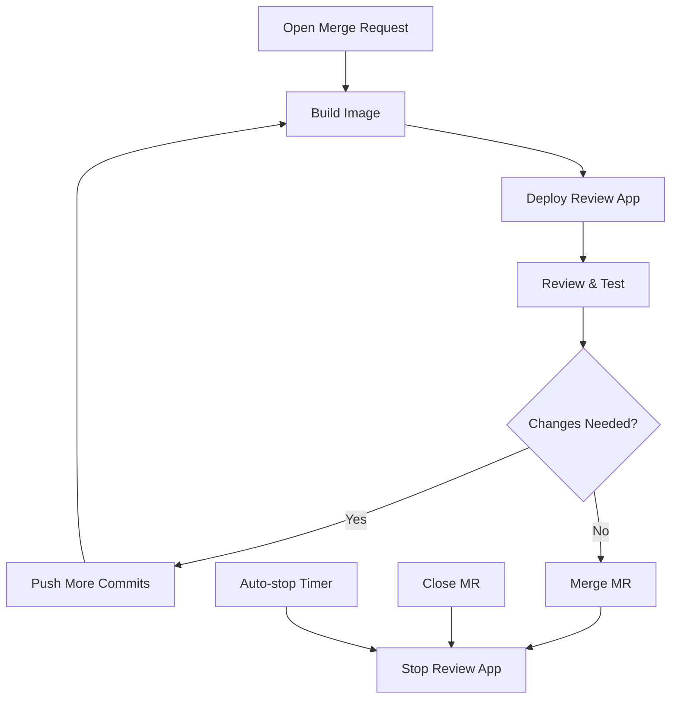

# How to Implement Review Apps in GitLab CI

Author: [nawazdhandala](https://www.github.com/nawazdhandala)

Tags: GitLab CI, Review Apps, Environments, CI/CD, DevOps, Testing

Description: Learn how to implement review apps in GitLab CI to create temporary environments for every merge request, enabling faster code review and testing.

---

Review apps give every merge request its own deployment. Instead of reviewing code in isolation, reviewers can click a link and interact with the actual running application. This transforms code review from theoretical to practical. This guide shows you how to set up review apps that spin up automatically and clean up when no longer needed.

## What Are Review Apps?

A review app is a temporary environment created specifically for a branch or merge request. When you push code, GitLab deploys it to a unique URL. Reviewers test the changes in a real environment. When the merge request is closed, the environment is destroyed.

This pattern works for web applications, APIs, mobile backends, and any deployable system.

## Basic Review App Configuration

Start with a simple review app that deploys on every merge request.

```yaml
stages:
  - build
  - review
  - cleanup

variables:
  APP_NAME: "my-app"

build:
  stage: build
  script:
    - docker build -t $CI_REGISTRY_IMAGE:$CI_COMMIT_SHA .
    - docker push $CI_REGISTRY_IMAGE:$CI_COMMIT_SHA
  only:
    - merge_requests
    - main

deploy-review:
  stage: review
  script:
    # Deploy to review environment
    - ./deploy.sh review-${CI_COMMIT_REF_SLUG}
  environment:
    name: review/${CI_COMMIT_REF_SLUG}
    url: https://${CI_COMMIT_REF_SLUG}.review.example.com
    on_stop: stop-review
    auto_stop_in: 1 week
  rules:
    - if: $CI_MERGE_REQUEST_IID

stop-review:
  stage: cleanup
  script:
    - ./destroy.sh review-${CI_COMMIT_REF_SLUG}
  environment:
    name: review/${CI_COMMIT_REF_SLUG}
    action: stop
  rules:
    - if: $CI_MERGE_REQUEST_IID
      when: manual
  variables:
    GIT_STRATEGY: none
```

The `on_stop` links deployment to cleanup. When the merge request is closed, GitLab can automatically trigger the stop job.

## Review App Flow

Here's the lifecycle of a review app:



## Kubernetes Review Apps

Deploy review apps to Kubernetes for better resource management.

```yaml
variables:
  KUBE_NAMESPACE: "review-apps"

deploy-review:
  stage: review
  image:
    name: bitnami/kubectl:latest
    entrypoint: [""]
  script:
    - export REVIEW_NAME="review-${CI_COMMIT_REF_SLUG}"
    # Create namespace if it doesn't exist
    - kubectl create namespace ${REVIEW_NAME} --dry-run=client -o yaml | kubectl apply -f -
    # Apply manifests with variable substitution
    - |
      cat <<EOF | kubectl apply -f -
      apiVersion: apps/v1
      kind: Deployment
      metadata:
        name: ${REVIEW_NAME}
        namespace: ${REVIEW_NAME}
      spec:
        replicas: 1
        selector:
          matchLabels:
            app: ${REVIEW_NAME}
        template:
          metadata:
            labels:
              app: ${REVIEW_NAME}
          spec:
            containers:
              - name: app
                image: ${CI_REGISTRY_IMAGE}:${CI_COMMIT_SHA}
                ports:
                  - containerPort: 3000
      ---
      apiVersion: v1
      kind: Service
      metadata:
        name: ${REVIEW_NAME}
        namespace: ${REVIEW_NAME}
      spec:
        selector:
          app: ${REVIEW_NAME}
        ports:
          - port: 80
            targetPort: 3000
      ---
      apiVersion: networking.k8s.io/v1
      kind: Ingress
      metadata:
        name: ${REVIEW_NAME}
        namespace: ${REVIEW_NAME}
        annotations:
          cert-manager.io/cluster-issuer: letsencrypt-prod
      spec:
        tls:
          - hosts:
              - ${CI_COMMIT_REF_SLUG}.review.example.com
            secretName: ${REVIEW_NAME}-tls
        rules:
          - host: ${CI_COMMIT_REF_SLUG}.review.example.com
            http:
              paths:
                - path: /
                  pathType: Prefix
                  backend:
                    service:
                      name: ${REVIEW_NAME}
                      port:
                        number: 80
      EOF
    - kubectl -n ${REVIEW_NAME} rollout status deployment/${REVIEW_NAME}
  environment:
    name: review/${CI_COMMIT_REF_SLUG}
    url: https://${CI_COMMIT_REF_SLUG}.review.example.com
    on_stop: stop-review
    auto_stop_in: 1 week
  rules:
    - if: $CI_MERGE_REQUEST_IID

stop-review:
  stage: cleanup
  image:
    name: bitnami/kubectl:latest
    entrypoint: [""]
  script:
    - kubectl delete namespace review-${CI_COMMIT_REF_SLUG} --ignore-not-found
  environment:
    name: review/${CI_COMMIT_REF_SLUG}
    action: stop
  rules:
    - if: $CI_MERGE_REQUEST_IID
      when: manual
  variables:
    GIT_STRATEGY: none
```

## Docker Compose Review Apps

For simpler setups, use Docker Compose on a shared server.

```yaml
deploy-review:
  stage: review
  tags:
    - review-server
  script:
    - export REVIEW_NAME="review-${CI_COMMIT_REF_SLUG}"
    - export REVIEW_PORT=$((10000 + ${CI_MERGE_REQUEST_IID}))
    # Pull the built image
    - docker pull ${CI_REGISTRY_IMAGE}:${CI_COMMIT_SHA}
    # Stop existing deployment if any
    - docker stop ${REVIEW_NAME} || true
    - docker rm ${REVIEW_NAME} || true
    # Start new container
    - |
      docker run -d \
        --name ${REVIEW_NAME} \
        --restart unless-stopped \
        -e NODE_ENV=review \
        -e DATABASE_URL="${REVIEW_DATABASE_URL}" \
        -p ${REVIEW_PORT}:3000 \
        ${CI_REGISTRY_IMAGE}:${CI_COMMIT_SHA}
    # Update nginx config
    - |
      cat > /etc/nginx/sites-available/${REVIEW_NAME}.conf <<EOF
      server {
        listen 80;
        server_name ${CI_COMMIT_REF_SLUG}.review.example.com;
        location / {
          proxy_pass http://localhost:${REVIEW_PORT};
          proxy_set_header Host \$host;
          proxy_set_header X-Real-IP \$remote_addr;
        }
      }
      EOF
    - ln -sf /etc/nginx/sites-available/${REVIEW_NAME}.conf /etc/nginx/sites-enabled/
    - nginx -s reload
  environment:
    name: review/${CI_COMMIT_REF_SLUG}
    url: http://${CI_COMMIT_REF_SLUG}.review.example.com
    on_stop: stop-review
  rules:
    - if: $CI_MERGE_REQUEST_IID

stop-review:
  stage: cleanup
  tags:
    - review-server
  script:
    - export REVIEW_NAME="review-${CI_COMMIT_REF_SLUG}"
    - docker stop ${REVIEW_NAME} || true
    - docker rm ${REVIEW_NAME} || true
    - rm -f /etc/nginx/sites-enabled/${REVIEW_NAME}.conf
    - rm -f /etc/nginx/sites-available/${REVIEW_NAME}.conf
    - nginx -s reload
  environment:
    name: review/${CI_COMMIT_REF_SLUG}
    action: stop
  rules:
    - if: $CI_MERGE_REQUEST_IID
      when: manual
  variables:
    GIT_STRATEGY: none
```

## Review Apps with Databases

Provide isolated databases for each review app.

```yaml
deploy-review:
  stage: review
  script:
    - export REVIEW_NAME="review-${CI_COMMIT_REF_SLUG}"
    # Create review database
    - |
      PGPASSWORD=${POSTGRES_ADMIN_PASSWORD} psql -h ${POSTGRES_HOST} -U admin -c \
        "CREATE DATABASE \"${REVIEW_NAME}\" WITH TEMPLATE staging_template;"
    # Run migrations
    - DATABASE_URL="postgres://user:pass@${POSTGRES_HOST}/${REVIEW_NAME}" npm run migrate
    # Deploy the application
    - ./deploy.sh ${REVIEW_NAME}
  environment:
    name: review/${CI_COMMIT_REF_SLUG}
    url: https://${CI_COMMIT_REF_SLUG}.review.example.com
    on_stop: stop-review

stop-review:
  stage: cleanup
  script:
    - export REVIEW_NAME="review-${CI_COMMIT_REF_SLUG}"
    # Destroy the application
    - ./destroy.sh ${REVIEW_NAME}
    # Drop the database
    - |
      PGPASSWORD=${POSTGRES_ADMIN_PASSWORD} psql -h ${POSTGRES_HOST} -U admin -c \
        "DROP DATABASE IF EXISTS \"${REVIEW_NAME}\";"
  environment:
    name: review/${CI_COMMIT_REF_SLUG}
    action: stop
  variables:
    GIT_STRATEGY: none
```

## Seeding Review Environments

Pre-populate review apps with test data.

```yaml
deploy-review:
  script:
    # Deploy infrastructure
    - ./deploy.sh ${REVIEW_NAME}
    # Seed with test data
    - |
      curl -X POST "https://${CI_COMMIT_REF_SLUG}.review.example.com/api/seed" \
        -H "X-Seed-Token: ${SEED_TOKEN}" \
        -H "Content-Type: application/json" \
        -d '{"scenario": "e2e-testing"}'
```

## Review App URL Strategies

Choose a URL pattern that works for your infrastructure.

**Subdomain-based** (requires wildcard DNS):
```yaml
environment:
  url: https://${CI_COMMIT_REF_SLUG}.review.example.com
```

**Path-based** (simpler DNS):
```yaml
environment:
  url: https://review.example.com/${CI_COMMIT_REF_SLUG}
```

**Port-based** (for internal use):
```yaml
environment:
  url: http://review-server.internal:${REVIEW_PORT}
```

## Automatic E2E Testing

Run tests against review apps before allowing merge.

```yaml
stages:
  - build
  - review
  - test
  - cleanup

deploy-review:
  stage: review
  # ... deployment script

e2e-tests:
  stage: test
  image: cypress/included:latest
  script:
    - npx cypress run --config baseUrl=https://${CI_COMMIT_REF_SLUG}.review.example.com
  needs:
    - deploy-review
  rules:
    - if: $CI_MERGE_REQUEST_IID
  artifacts:
    when: always
    paths:
      - cypress/screenshots/
      - cypress/videos/
```

## Resource Limits

Prevent review apps from consuming too many resources.

```yaml
# Limit concurrent review apps
deploy-review:
  resource_group: review-apps
  script:
    # Check current review app count
    - |
      CURRENT=$(kubectl get namespaces -l type=review-app --no-headers | wc -l)
      if [ ${CURRENT} -ge 10 ]; then
        echo "Too many review apps. Clean up old ones first."
        exit 1
      fi
    - ./deploy.sh
```

## Adding Comments to Merge Requests

Notify reviewers when review apps are ready.

```yaml
deploy-review:
  script:
    - ./deploy.sh ${CI_COMMIT_REF_SLUG}
  after_script:
    # Post comment with review app URL
    - |
      curl --request POST \
        --header "PRIVATE-TOKEN: ${GITLAB_TOKEN}" \
        --header "Content-Type: application/json" \
        --data "{\"body\": \"Review app deployed: https://${CI_COMMIT_REF_SLUG}.review.example.com\"}" \
        "${CI_API_V4_URL}/projects/${CI_PROJECT_ID}/merge_requests/${CI_MERGE_REQUEST_IID}/notes"
```

## Cleaning Up Stale Review Apps

Automatically remove forgotten review apps.

```yaml
cleanup-stale-reviews:
  stage: cleanup
  script:
    # Find review apps older than 7 days
    - |
      kubectl get namespaces -l type=review-app -o json | \
      jq -r '.items[] | select(.metadata.creationTimestamp | fromdateiso8601 < (now - 604800)) | .metadata.name' | \
      while read ns; do
        echo "Deleting stale namespace: $ns"
        kubectl delete namespace $ns
      done
  rules:
    - if: $CI_PIPELINE_SOURCE == "schedule"
```

Schedule this job to run daily for automatic cleanup.

---

Review apps transform code review from guesswork to hands-on testing. Reviewers catch issues that would slip through static analysis. QA can verify fixes before they merge. Product managers can preview features early. Start simple with Docker Compose, then scale to Kubernetes as your team grows. The investment in review apps pays dividends in faster, more confident deployments.
