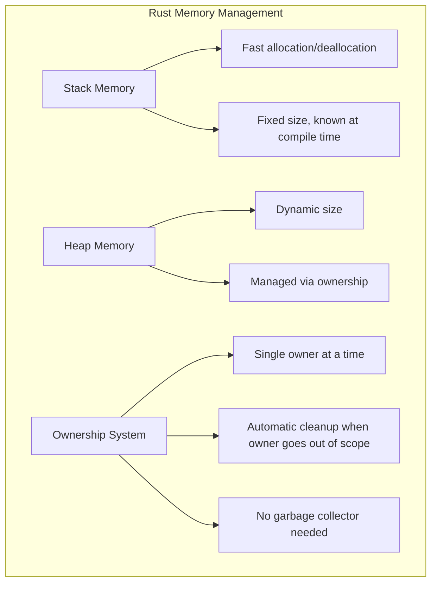
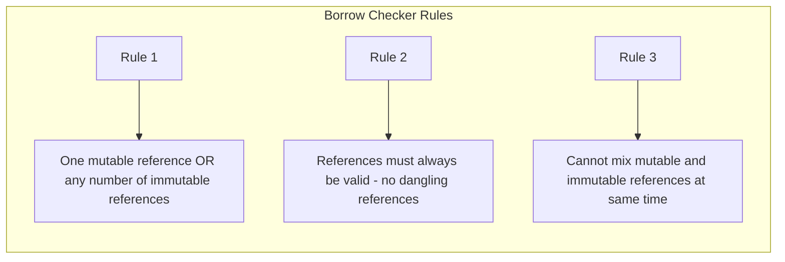
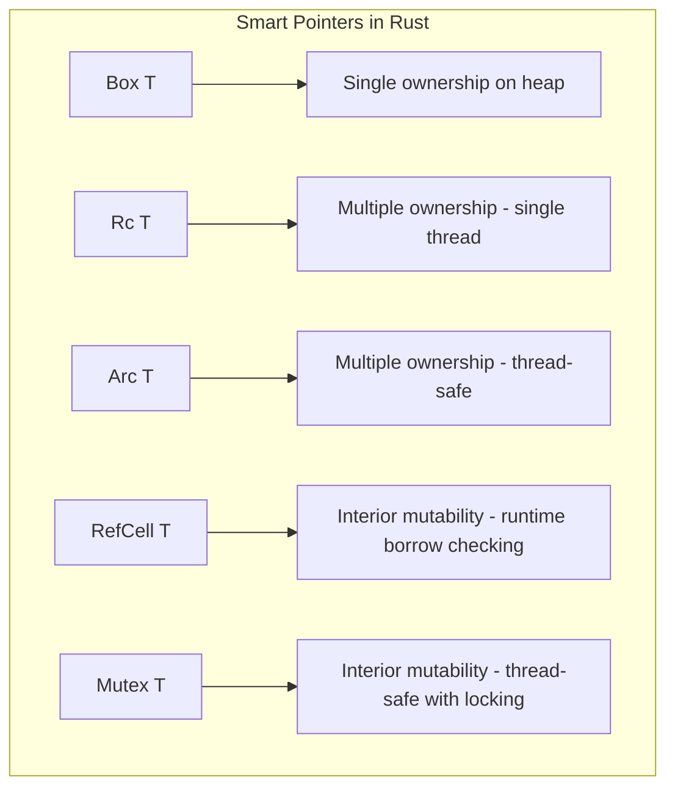
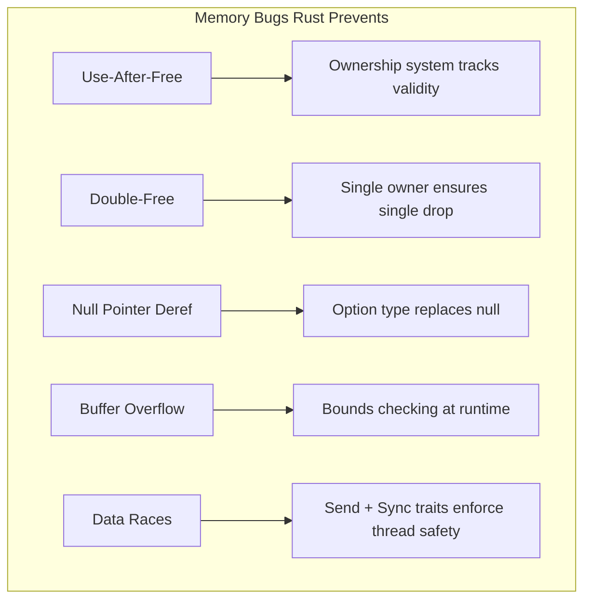
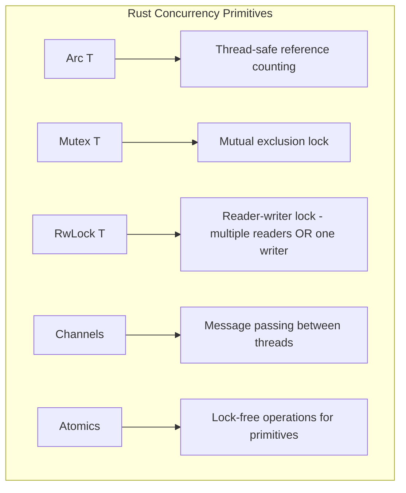
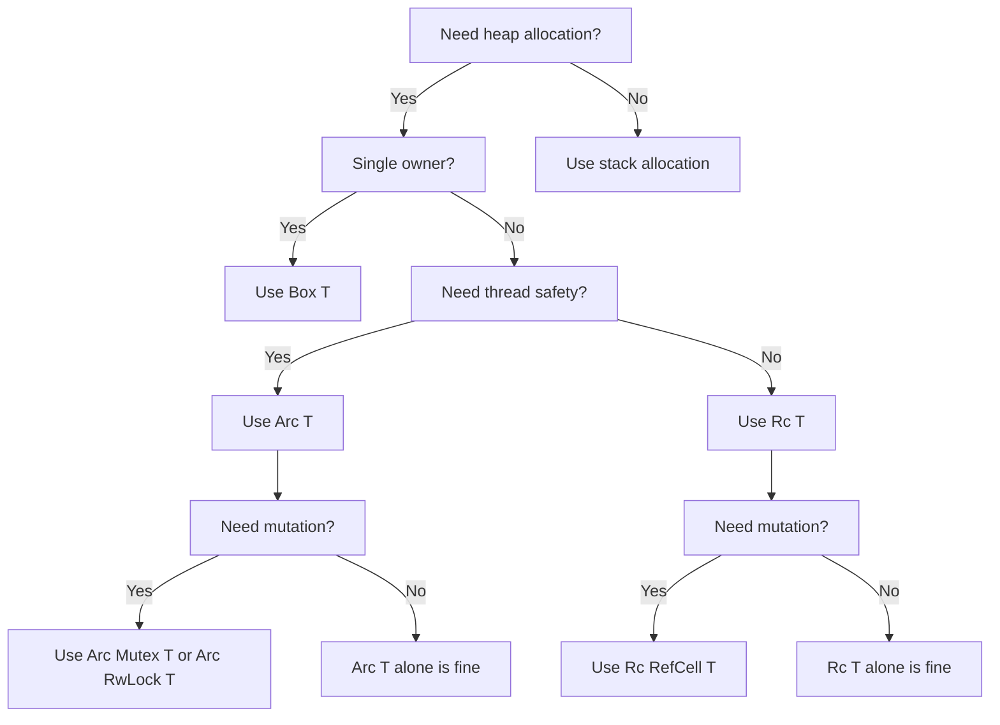

# How to Handle Memory Safety in Rust

By [nawazdhandala](https://github.com/nawazdhandala)

Tags: Rust, Memory Safety, Ownership, Borrowing, Lifetimes, Smart Pointers, Concurrency, Systems Programming

Description: A comprehensive guide to Rust's memory safety guarantees, covering ownership, borrowing, lifetimes, smart pointers, and safe concurrency patterns to write bug-free systems code.

---

> "Memory safety bugs are responsible for approximately 70% of all security vulnerabilities in systems software. Rust eliminates entire classes of these bugs at compile time, not runtime." - Microsoft Security Response Center

Rust's memory safety guarantees are revolutionary. Unlike C and C++ where memory bugs lurk in production for years, Rust catches them before your code even compiles. This guide covers how Rust's ownership system works and how to leverage it for writing safe, concurrent, high-performance code.

## Understanding Rust's Memory Model

Rust manages memory without a garbage collector through a system of ownership rules that the compiler enforces at compile time.



| Memory Type | Characteristics | Use Case |
|-------------|-----------------|----------|
| **Stack** | Fast, LIFO, fixed size | Primitives, references |
| **Heap** | Dynamic, slower, flexible | Strings, vectors, complex types |
| **Static** | Lives entire program | Constants, string literals |

## Ownership and Borrowing

Ownership is Rust's core memory safety mechanism. Every value has exactly one owner, and the value is dropped when its owner goes out of scope.

### Basic Ownership Rules

```rust
// ownership_basics.rs
// Demonstrates Rust's ownership system - the foundation of memory safety

fn main() {
    // s1 owns the String "hello" - memory is allocated on the heap
    let s1 = String::from("hello");

    // Ownership moves from s1 to s2
    // s1 is no longer valid after this line - this prevents double-free
    let s2 = s1;

    // This would cause a compile error - Rust prevents use-after-move:
    // println!("{}", s1); // ERROR: value borrowed here after move

    // s2 is valid and owns the data
    println!("{}", s2); // Works fine: prints "hello"
}

// When a function takes ownership, the caller can no longer use the value
fn take_ownership(s: String) {
    println!("I own: {}", s);
} // s is dropped here, memory is freed automatically (RAII)

fn ownership_transfer() {
    let my_string = String::from("hello");
    take_ownership(my_string);

    // This would fail - my_string was moved into take_ownership
    // println!("{}", my_string); // ERROR: value borrowed after move
}

// For Copy types (integers, booleans, floats), values are copied instead of moved
fn copy_types_example() {
    let x = 5;
    let y = x; // x is copied to stack, not moved - integers implement Copy trait

    // Both x and y are valid because integers are cheap to copy
    println!("x = {}, y = {}", x, y);
}
```

### Clone for Deep Copies

```rust
// clone_example.rs
// When you need to keep the original value, use clone() to create a deep copy

fn main() {
    let s1 = String::from("hello");

    // Clone creates a deep copy of the heap data
    // This allocates new memory and copies the contents
    // Both s1 and s2 own separate copies of the data
    let s2 = s1.clone();

    // Both are valid because they own different allocations
    println!("s1 = {}, s2 = {}", s1, s2);

    // Note: clone() can be expensive for large data structures
    // Prefer borrowing when you don't need ownership
}
```

### Borrowing with References

Instead of transferring ownership, you can borrow values using references:

```rust
// borrowing.rs
// Borrowing allows reading data without taking ownership

fn calculate_length(s: &String) -> usize {
    // s is a reference to a String - we can read but not modify
    // The & indicates an immutable borrow
    s.len()
} // s goes out of scope, but since it doesn't own the String, nothing is dropped

fn main() {
    let s1 = String::from("hello");

    // Pass a reference - s1 still owns the data
    let len = calculate_length(&s1);

    // s1 is still valid because we only borrowed it
    println!("The length of '{}' is {}.", s1, len);

    // Multiple immutable borrows are allowed simultaneously
    let r1 = &s1;
    let r2 = &s1;
    println!("{} and {}", r1, r2); // Works fine - multiple readers allowed
}
```

### Mutable References

```rust
// mutable_borrowing.rs
// Mutable borrowing allows modification through references

fn append_world(s: &mut String) {
    // &mut indicates a mutable borrow - we can modify the borrowed value
    s.push_str(" world");
}

fn main() {
    // Variable must be declared as mutable to allow mutable borrowing
    let mut s = String::from("hello");

    // Pass a mutable reference
    append_world(&mut s);

    println!("{}", s); // Prints: "hello world"
}

// The Borrow Checker enforces strict rules to prevent data races
fn borrow_checker_rules() {
    let mut s = String::from("hello");

    let r1 = &s;     // OK: first immutable borrow
    let r2 = &s;     // OK: second immutable borrow - multiple readers allowed

    // This would fail - can't have mutable borrow while immutable borrows exist
    // let r3 = &mut s; // ERROR: cannot borrow as mutable

    println!("{} and {}", r1, r2);
    // r1 and r2 are no longer used after this point (NLL - Non-Lexical Lifetimes)

    // Now we can create a mutable borrow - previous borrows are no longer active
    let r3 = &mut s; // OK: no other borrows are active
    r3.push_str(" world");
    println!("{}", r3);
}
```



## References and Lifetimes

Lifetimes ensure that references remain valid for as long as they're used. The compiler infers most lifetimes, but sometimes you need to annotate them explicitly.

### Lifetime Annotations

```rust
// lifetimes.rs
// Lifetime annotations tell the compiler how long references should live
// 'a is a lifetime parameter - it's a name for a scope

// This function returns a reference that lives as long as the shorter
// of the two input references
fn longest<'a>(x: &'a str, y: &'a str) -> &'a str {
    // Both x and y must live at least as long as 'a
    // The returned reference also lives for 'a
    if x.len() > y.len() {
        x
    } else {
        y
    }
}

fn main() {
    let string1 = String::from("long string is long");

    {
        let string2 = String::from("xyz");
        // Both strings are valid here
        let result = longest(string1.as_str(), string2.as_str());
        println!("The longest string is: {}", result);
    } // string2 goes out of scope

    // This would fail - result would reference invalid memory:
    // let result;
    // {
    //     let string2 = String::from("xyz");
    //     result = longest(string1.as_str(), string2.as_str());
    // }
    // println!("Longest: {}", result); // ERROR: string2 doesn't live long enough
}
```

### Lifetime Elision Rules

```rust
// lifetime_elision.rs
// Rust applies three elision rules to infer lifetimes automatically

// Rule 1: Each input reference gets its own lifetime
// fn foo(x: &str, y: &str) becomes fn foo<'a, 'b>(x: &'a str, y: &'b str)

// Rule 2: If there's exactly one input lifetime, it's assigned to all outputs
// fn foo(x: &str) -> &str becomes fn foo<'a>(x: &'a str) -> &'a str

// Rule 3: If there's &self or &mut self, the self lifetime is assigned to outputs

// Struct holding a reference needs explicit lifetime annotation
struct ImportantExcerpt<'a> {
    // The struct cannot outlive the reference it holds
    part: &'a str,
}

impl<'a> ImportantExcerpt<'a> {
    // This method returns a reference with the same lifetime as self
    // Lifetime elision Rule 3 applies here
    fn announce_and_return_part(&self, announcement: &str) -> &str {
        println!("Attention please: {}", announcement);
        self.part // Returns reference with lifetime 'a
    }
}

fn main() {
    let novel = String::from("Call me Ishmael. Some years ago...");
    let first_sentence = novel.split('.').next().expect("Could not find a '.'");

    // ImportantExcerpt can only exist while novel exists
    let excerpt = ImportantExcerpt {
        part: first_sentence,
    };

    println!("Excerpt: {}", excerpt.part);
}
```

### The Static Lifetime

```rust
// static_lifetime.rs
// 'static lifetime means the reference lives for the entire program

// String literals have 'static lifetime - they're stored in the binary
let s: &'static str = "I have a static lifetime.";

// Be careful with 'static - it's often not what you want
// This is a common mistake:
fn bad_idea() -> &'static str {
    let s = String::from("hello");
    // &s // ERROR: cannot return reference to local variable
    "Use string literal instead" // This works - it's truly 'static
}

// When 'static is appropriate: global configuration
use std::sync::LazyLock;

static CONFIG: LazyLock<Config> = LazyLock::new(|| {
    Config::load_from_env()
});
```

## Smart Pointers (Box, Rc, RefCell)

Smart pointers provide additional capabilities beyond regular references, like heap allocation, reference counting, and interior mutability.



### Box: Heap Allocation

```rust
// box_example.rs
// Box<T> allocates data on the heap with single ownership

// Use case 1: Types with unknown size at compile time (recursive types)
enum List {
    // Recursive type - needs indirection via Box
    // Without Box, the compiler can't determine the size
    Cons(i32, Box<List>),
    Nil,
}

use List::{Cons, Nil};

fn main() {
    // Create a linked list: 1 -> 2 -> 3 -> Nil
    let list = Cons(1, Box::new(Cons(2, Box::new(Cons(3, Box::new(Nil))))));
    print_list(&list);
}

fn print_list(list: &List) {
    match list {
        Cons(value, next) => {
            print!("{} -> ", value);
            print_list(next);
        }
        Nil => println!("Nil"),
    }
}

// Use case 2: Large data you want on the heap to avoid stack overflow
fn process_large_data() {
    // Without Box: 1MB on the stack (might cause stack overflow)
    // let big_array = [0u8; 1_000_000];

    // With Box: 1MB on the heap, only 8-byte pointer on stack
    let big_array: Box<[u8; 1_000_000]> = Box::new([0u8; 1_000_000]);

    println!("First byte: {}", big_array[0]);
} // Memory freed when big_array goes out of scope

// Use case 3: Trait objects for dynamic dispatch
trait Animal {
    fn speak(&self);
}

struct Dog;
struct Cat;

impl Animal for Dog {
    fn speak(&self) { println!("Woof!"); }
}

impl Animal for Cat {
    fn speak(&self) { println!("Meow!"); }
}

fn animal_sounds() {
    // Vec of trait objects - different concrete types behind Box
    let animals: Vec<Box<dyn Animal>> = vec![
        Box::new(Dog),
        Box::new(Cat),
    ];

    for animal in animals {
        animal.speak(); // Dynamic dispatch at runtime
    }
}
```

### Rc: Reference Counting

```rust
// rc_example.rs
// Rc<T> enables multiple ownership through reference counting
// Use when you need multiple owners in single-threaded code

use std::rc::Rc;

fn main() {
    // Create an Rc-wrapped value - reference count starts at 1
    let data = Rc::new(vec![1, 2, 3]);

    // Clone creates a new reference, NOT a deep copy
    // Reference count: 1 -> 2
    let data_clone1 = Rc::clone(&data);

    // Reference count: 2 -> 3
    let data_clone2 = Rc::clone(&data);

    // All three variables point to the same heap allocation
    println!("Reference count: {}", Rc::strong_count(&data)); // Prints: 3

    // Access data through any reference
    println!("Data: {:?}", data);
    println!("Via clone1: {:?}", data_clone1);
    println!("Via clone2: {:?}", data_clone2);

    // When data_clone2 goes out of scope, count decrements to 2
    drop(data_clone2);
    println!("After drop: {}", Rc::strong_count(&data)); // Prints: 2
} // When all Rc pointers drop, reference count hits 0 and data is deallocated

// Real-world example: Shared configuration across components
struct Config {
    database_url: String,
    max_connections: u32,
}

struct DatabaseConnection {
    config: Rc<Config>,
}

struct CacheConnection {
    config: Rc<Config>,
}

fn shared_config_example() {
    // Config is shared between multiple components without duplication
    let config = Rc::new(Config {
        database_url: String::from("postgres://localhost/mydb"),
        max_connections: 10,
    });

    // Both connections share the same config - no copying
    let db = DatabaseConnection { config: Rc::clone(&config) };
    let cache = CacheConnection { config: Rc::clone(&config) };

    println!("DB URL: {}", db.config.database_url);
    println!("Cache max conn: {}", cache.config.max_connections);
}
```

### RefCell: Interior Mutability

```rust
// refcell_example.rs
// RefCell<T> enables mutation through shared references
// Borrow rules are checked at RUNTIME instead of compile time

use std::cell::RefCell;
use std::rc::Rc;

fn main() {
    let data = RefCell::new(5);

    // borrow() returns an immutable reference (Ref<T>)
    {
        let borrowed = data.borrow();
        println!("Value: {}", *borrowed);
    } // Ref dropped here

    // borrow_mut() returns a mutable reference (RefMut<T>)
    {
        let mut borrowed_mut = data.borrow_mut();
        *borrowed_mut += 1;
    } // RefMut dropped here

    println!("After mutation: {}", data.borrow()); // Prints: 6

    // CAUTION: Runtime panic if borrow rules violated:
    // let r1 = data.borrow();
    // let r2 = data.borrow_mut(); // PANIC: already borrowed
}

// Common pattern: Rc<RefCell<T>> for shared mutable state
#[derive(Debug)]
struct Node {
    value: i32,
    children: RefCell<Vec<Rc<Node>>>, // Mutable list of shared children
}

impl Node {
    fn new(value: i32) -> Rc<Node> {
        Rc::new(Node {
            value,
            children: RefCell::new(vec![]),
        })
    }

    fn add_child(&self, child: Rc<Node>) {
        // Mutate through shared reference using RefCell
        self.children.borrow_mut().push(child);
    }
}

fn tree_example() {
    let root = Node::new(1);
    let child1 = Node::new(2);
    let child2 = Node::new(3);

    // Modify the tree structure through shared references
    root.add_child(Rc::clone(&child1));
    root.add_child(Rc::clone(&child2));

    println!("Root has {} children", root.children.borrow().len());
}

// RefCell is perfect for mock objects in tests
pub trait Messenger {
    fn send(&self, msg: &str);
}

struct MockMessenger {
    // Can't use Vec<String> because send() takes &self (immutable)
    // RefCell allows mutation through &self
    sent_messages: RefCell<Vec<String>>,
}

impl MockMessenger {
    fn new() -> MockMessenger {
        MockMessenger {
            sent_messages: RefCell::new(vec![]),
        }
    }
}

impl Messenger for MockMessenger {
    fn send(&self, msg: &str) {
        // Mutate through &self using RefCell
        self.sent_messages.borrow_mut().push(String::from(msg));
    }
}

#[test]
fn test_messenger() {
    let mock = MockMessenger::new();
    mock.send("Hello");
    mock.send("World");

    assert_eq!(mock.sent_messages.borrow().len(), 2);
}
```

## Avoiding Common Memory Bugs

Rust's compiler prevents entire classes of bugs that plague C and C++ codebases.



### Use-After-Free Prevention

```rust
// use_after_free.rs
// Rust prevents use-after-free at compile time

fn use_after_free_prevented() {
    let reference;

    {
        let data = String::from("hello");
        // reference = &data; // ERROR: `data` does not live long enough
    } // data is freed here

    // If the above compiled, reference would point to freed memory
    // println!("{}", reference); // Would be use-after-free in C/C++
}

// The safe way: ensure data outlives references
fn safe_approach() {
    let data = String::from("hello");
    let reference = &data;

    // data outlives reference - compiler verifies this
    println!("{}", reference);
}

// Another safe pattern: return owned data instead of references
fn create_data() -> String {
    let data = String::from("hello");
    data // Move ownership to caller - no dangling reference possible
}
```

### Double-Free Prevention

```rust
// double_free.rs
// Rust's ownership system prevents double-free

fn double_free_prevented() {
    let s1 = String::from("hello");
    let s2 = s1; // Ownership moves, s1 is invalidated

    // drop(s1); // ERROR: use of moved value - s1 can't be dropped
    drop(s2); // Only s2 can be dropped - memory freed exactly once
}

// With explicit cloning, each copy is independent
fn with_clone() {
    let s1 = String::from("hello");
    let s2 = s1.clone(); // Deep copy - s1 still valid

    drop(s1); // Free s1's memory
    drop(s2); // Free s2's memory (different heap allocation)
    // No double-free because they're different allocations
}
```

### Null Pointer Dereferencing Prevention

```rust
// null_prevention.rs
// Rust has no null - uses Option<T> instead

fn null_prevented() {
    // In C/C++: int* ptr = NULL; *ptr; // Segfault!

    // In Rust: must handle the None case explicitly
    let maybe_value: Option<i32> = Some(5);

    // Can't directly use - must handle None possibility
    match maybe_value {
        Some(value) => println!("Got: {}", value),
        None => println!("No value"),
    }

    // Or use if let for single-case matching
    if let Some(value) = maybe_value {
        println!("Got: {}", value);
    }

    // Or use combinators for ergonomic handling
    let value = maybe_value.unwrap_or(0);
    println!("Value or default: {}", value);
}

// Real-world example: Safe database queries
struct User {
    id: u32,
    name: String,
}

fn find_user(id: u32) -> Option<User> {
    // Simulate database lookup
    if id == 1 {
        Some(User { id: 1, name: String::from("Alice") })
    } else {
        None // Explicit absence, not null
    }
}

fn main() {
    // Must handle the case where user doesn't exist
    match find_user(1) {
        Some(user) => println!("Found: {}", user.name),
        None => println!("User not found"),
    }

    // Chainable operations with Option - no null checks needed
    let name = find_user(1)
        .map(|u| u.name)
        .unwrap_or_else(|| String::from("Unknown"));

    println!("Name: {}", name);
}
```

### Buffer Overflow Prevention

```rust
// buffer_overflow.rs
// Rust checks bounds at runtime, preventing buffer overflows

fn buffer_overflow_prevented() {
    let buffer = vec![1, 2, 3, 4, 5];

    // Safe access - returns Option, no crash
    if let Some(value) = buffer.get(10) {
        println!("Value: {}", value);
    } else {
        println!("Index out of bounds - handled safely");
    }

    // Direct indexing panics on out-of-bounds (controlled crash, not UB!)
    // let value = buffer[10]; // PANIC: index out of bounds
    // Panic is safe - no memory corruption, no security vulnerability

    // Safe iteration - can't go out of bounds
    for value in &buffer {
        println!("{}", value);
    }
}

// Safe slice operations
fn process_slice(data: &[u8]) {
    // get() returns None for out-of-bounds - safe handling
    let first = data.get(0);
    let hundredth = data.get(100);

    println!("First: {:?}, Hundredth: {:?}", first, hundredth);

    // Safe subslicing with get()
    if let Some(subslice) = data.get(0..3) {
        println!("First three bytes: {:?}", subslice);
    }
}
```

## Safe Concurrency Patterns

Rust's type system prevents data races at compile time, making concurrent programming much safer.



### Thread-Safe Shared State with Arc and Mutex

```rust
// arc_mutex.rs
// Arc<Mutex<T>> is the standard pattern for shared mutable state across threads

use std::sync::{Arc, Mutex};
use std::thread;

fn shared_counter() {
    // Arc: Atomic Reference Counting (thread-safe version of Rc)
    // Mutex: Mutual exclusion (ensures only one thread accesses data at a time)
    let counter = Arc::new(Mutex::new(0));
    let mut handles = vec![];

    for _ in 0..10 {
        // Clone Arc to share ownership with thread
        // This increments the atomic reference count
        let counter_clone = Arc::clone(&counter);

        let handle = thread::spawn(move || {
            // lock() blocks until mutex is available
            // Returns MutexGuard which auto-unlocks when dropped (RAII)
            let mut num = counter_clone.lock().unwrap();
            *num += 1;
            // MutexGuard dropped here, lock automatically released
        });

        handles.push(handle);
    }

    // Wait for all threads to complete
    for handle in handles {
        handle.join().unwrap();
    }

    println!("Final count: {}", *counter.lock().unwrap()); // Prints: 10
}

// Without Arc, this wouldn't compile - Rust prevents the bug at compile time
fn wont_compile() {
    let counter = Mutex::new(0);

    // thread::spawn(move || {
    //     let mut num = counter.lock().unwrap();
    //     *num += 1;
    // });
    // ERROR: `counter` moved into closure, can't use in other threads
    // Rust catches the potential data race at compile time
}
```

### RwLock for Read-Heavy Workloads

```rust
// rwlock.rs
// RwLock allows multiple readers OR one writer - better for read-heavy workloads

use std::sync::{Arc, RwLock};
use std::thread;

fn read_write_lock() {
    let data = Arc::new(RwLock::new(vec![1, 2, 3]));
    let mut handles = vec![];

    // Spawn multiple readers - they can read concurrently
    for i in 0..5 {
        let data_clone = Arc::clone(&data);
        handles.push(thread::spawn(move || {
            // read() allows multiple concurrent readers
            let read_guard = data_clone.read().unwrap();
            println!("Reader {}: {:?}", i, *read_guard);
            // RwLockReadGuard dropped, read lock released
        }));
    }

    // Spawn a writer - gets exclusive access
    let data_clone = Arc::clone(&data);
    handles.push(thread::spawn(move || {
        // write() blocks until all readers release and gets exclusive access
        let mut write_guard = data_clone.write().unwrap();
        write_guard.push(4);
        println!("Writer: added 4");
        // RwLockWriteGuard dropped, write lock released
    }));

    for handle in handles {
        handle.join().unwrap();
    }

    println!("Final data: {:?}", *data.read().unwrap());
}
```

### Message Passing with Channels

```rust
// channels.rs
// Channels transfer ownership of values between threads
// "Do not communicate by sharing memory; share memory by communicating"

use std::sync::mpsc; // Multiple Producer, Single Consumer
use std::thread;
use std::time::Duration;

fn channel_example() {
    // Create a channel - tx (transmitter) and rx (receiver)
    let (tx, rx) = mpsc::channel();

    // Spawn a thread that sends messages
    thread::spawn(move || {
        let messages = vec!["hello", "from", "the", "thread"];

        for msg in messages {
            // send() transfers ownership to receiver - no data races possible
            tx.send(String::from(msg)).unwrap();
            thread::sleep(Duration::from_millis(100));
        }
        // tx dropped here, channel closed
    });

    // Receive messages in main thread
    // recv() blocks until message available or channel closed
    for received in rx {
        println!("Got: {}", received);
    }
}

// Multiple producers example
fn multiple_producers() {
    let (tx, rx) = mpsc::channel();

    // Clone the sender for each producer thread
    for i in 0..3 {
        let tx_clone = tx.clone();
        thread::spawn(move || {
            tx_clone.send(format!("Message from thread {}", i)).unwrap();
        });
    }

    // Drop original sender so channel closes when all clones are done
    drop(tx);

    for received in rx {
        println!("Got: {}", received);
    }
}

// Bounded channel with backpressure
fn bounded_channel() {
    // sync_channel with buffer size 2 - blocks when full
    let (tx, rx) = mpsc::sync_channel(2);

    thread::spawn(move || {
        for i in 0..5 {
            println!("Sending {}", i);
            // Blocks when buffer is full - provides backpressure
            tx.send(i).unwrap();
            println!("Sent {}", i);
        }
    });

    thread::sleep(Duration::from_secs(1));

    for received in rx {
        println!("Received: {}", received);
        thread::sleep(Duration::from_millis(200));
    }
}
```

### Atomic Operations for Lock-Free Programming

```rust
// atomics.rs
// Atomics provide lock-free thread-safe operations for primitive types

use std::sync::atomic::{AtomicUsize, AtomicBool, Ordering};
use std::sync::Arc;
use std::thread;

fn atomic_counter() {
    let counter = Arc::new(AtomicUsize::new(0));
    let mut handles = vec![];

    for _ in 0..10 {
        let counter_clone = Arc::clone(&counter);
        handles.push(thread::spawn(move || {
            for _ in 0..1000 {
                // Atomically increment - no lock needed
                counter_clone.fetch_add(1, Ordering::SeqCst);
            }
        }));
    }

    for handle in handles {
        handle.join().unwrap();
    }

    // Thread-safe without any locks
    println!("Final count: {}", counter.load(Ordering::SeqCst)); // 10000
}

// Atomic flag for signaling between threads
fn stop_flag() {
    let running = Arc::new(AtomicBool::new(true));
    let running_clone = Arc::clone(&running);

    let handle = thread::spawn(move || {
        let mut count = 0;
        while running_clone.load(Ordering::SeqCst) {
            count += 1;
            thread::sleep(std::time::Duration::from_millis(10));
        }
        println!("Worker did {} iterations", count);
    });

    // Let worker run for a bit
    thread::sleep(std::time::Duration::from_millis(100));

    // Signal worker to stop - atomic, no lock needed
    running.store(false, Ordering::SeqCst);

    handle.join().unwrap();
}
```

### Send and Sync Traits

```rust
// send_sync.rs
// Send: Safe to transfer ownership between threads
// Sync: Safe to share references between threads

// Most types are Send + Sync automatically
// Rc<T> is NOT Send or Sync (use Arc instead)
// RefCell<T> is NOT Sync (use Mutex or RwLock instead)
// Raw pointers are NOT Send or Sync

use std::sync::Arc;
use std::rc::Rc;

// This compiles - Arc<T> is Send + Sync when T is Send + Sync
fn can_send_arc() {
    let data = Arc::new(vec![1, 2, 3]);
    std::thread::spawn(move || {
        println!("{:?}", data);
    });
}

// This won't compile - Rc is not Send
// fn cannot_send_rc() {
//     let data = Rc::new(vec![1, 2, 3]);
//     std::thread::spawn(move || {
//         println!("{:?}", data);
//     }); // ERROR: Rc<Vec<i32>> cannot be sent between threads safely
// }

// Use Mutex with Arc for thread-safe interior mutability
fn safe_shared_mutation() {
    use std::sync::Mutex;

    let data = Arc::new(Mutex::new(vec![1, 2, 3]));
    let data_clone = Arc::clone(&data);

    std::thread::spawn(move || {
        data_clone.lock().unwrap().push(4);
    }).join().unwrap();

    println!("{:?}", data.lock().unwrap()); // [1, 2, 3, 4]
}
```

## Best Practices Summary

| Category | Best Practice |
|----------|---------------|
| **Ownership** | Prefer borrowing over moving when you need to use data again |
| **Borrowing** | Use immutable references by default; only use `&mut` when modification is needed |
| **Lifetimes** | Let the compiler infer lifetimes; only annotate when required |
| **Smart Pointers** | Use `Box` for heap allocation, `Rc` for shared ownership, `Arc` for threads |
| **Interior Mutability** | Use `RefCell` for single-threaded mutation, `Mutex`/`RwLock` for multi-threaded |
| **Concurrency** | Prefer message passing (channels) over shared state when possible |
| **Error Handling** | Use `Option` for nullable values, `Result` for operations that can fail |
| **Unsafe Code** | Avoid `unsafe` blocks unless absolutely necessary; document invariants clearly |



## Conclusion

Rust's memory safety guarantees come from its ownership system, not a garbage collector. This approach provides:

- **Zero-cost abstractions** - Safety without runtime overhead
- **No null pointer exceptions** - Option type makes absence explicit
- **No data races** - Compiler prevents concurrent mutation bugs
- **Predictable resource management** - RAII with Drop trait ensures cleanup

The borrow checker may feel restrictive at first, but it catches bugs that would be subtle runtime errors or security vulnerabilities in other languages. Once you internalize the ownership model, you'll write safer, more reliable code.

For monitoring your Rust applications in production, [OneUptime](https://oneuptime.com) provides comprehensive observability with support for OpenTelemetry traces, metrics, and logs, helping you track performance and catch issues before they impact users.
