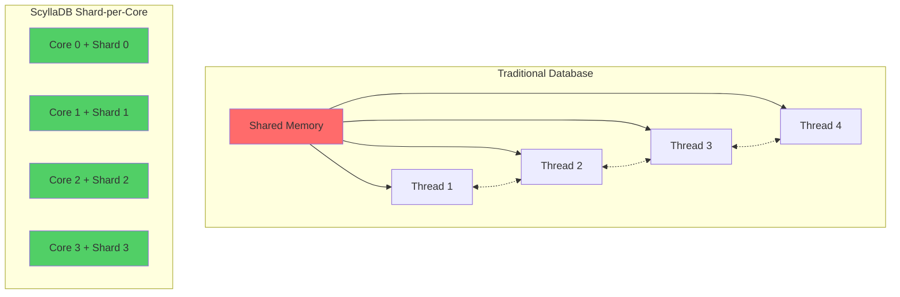
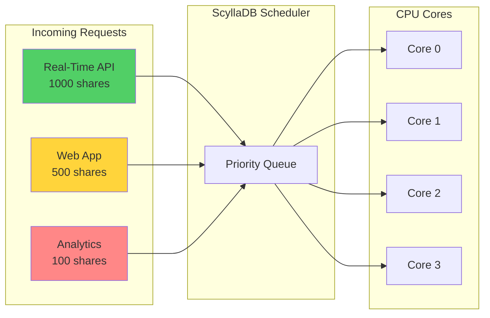
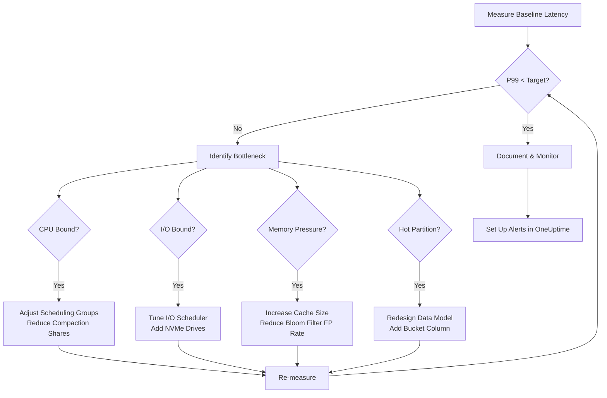

# How to Use ScyllaDB for Low-Latency Workloads

Author: [nawazdhandala](https://www.github.com/nawazdhandala)

Tags: ScyllaDB, Database, Low-Latency, Performance, NoSQL, Cassandra, Real-Time

Description: A practical guide to configuring and tuning ScyllaDB for low-latency workloads. Learn about shard-per-core architecture, workload prioritization, scheduling groups, and latency monitoring techniques to achieve sub-millisecond response times.

---

> "The fastest database is one that never makes a request wait. ScyllaDB's shard-per-core architecture eliminates contention at the foundation, giving you predictable latency even under heavy load."

## Why ScyllaDB for Low-Latency Workloads

ScyllaDB is a drop-in replacement for Apache Cassandra written in C++ that delivers significantly lower latencies by rethinking how databases interact with modern hardware. While Cassandra relies on the JVM and its garbage collector, ScyllaDB takes a different approach: **shard-per-core architecture** that pins each CPU core to its own independent shard of data.

This design eliminates:

- **Garbage collection pauses** - No JVM means no GC-induced latency spikes
- **Lock contention** - Each core operates independently on its shard
- **Context switching overhead** - Threads are pinned to cores
- **Cross-core communication** - Data locality is maintained

The result is tail latencies (p99, p999) that stay tight even during compaction, repair operations, or traffic spikes.



## Understanding Shard-per-Core Architecture

ScyllaDB automatically partitions data across CPU cores. Each core owns a specific range of the token ring and handles all operations for that data independently.

### How Sharding Works

```python
# ScyllaDB uses a consistent hashing algorithm to determine
# which shard (and therefore which CPU core) owns a partition key

# Example: Calculating which shard owns a key
# This is internal to ScyllaDB, but understanding it helps with data modeling

def get_shard_for_key(partition_key: str, num_shards: int) -> int:
    """
    Simplified representation of ScyllaDB's sharding logic.
    The actual implementation uses Murmur3 hash and token ranges.
    """
    # Murmur3 hash produces a 64-bit token
    token = murmur3_hash(partition_key)

    # Token range is divided evenly among shards
    # Each shard owns: total_range / num_shards tokens
    shard = token % num_shards

    return shard

# With 16 CPU cores, you have 16 shards
# Each shard processes ~6.25% of all requests independently
```

### Verifying Shard Distribution

Use `nodetool` to inspect how data is distributed across shards:

```bash
# Check the number of shards (one per core by default)
nodetool info | grep "Native Transport"

# View per-shard statistics
# This helps identify hot shards that may need data model adjustments
nodetool cfstats keyspace_name.table_name

# Check shard-level metrics via the REST API
curl -s http://localhost:10000/storage_service/load_map | jq .
```

## Configuring ScyllaDB for Optimal Latency

### Hardware Recommendations

For low-latency workloads, hardware selection is critical:

```yaml
# scylla.yaml - Hardware-aligned configuration

# CPU Configuration
# -----------------
# Use dedicated cores for ScyllaDB, isolate from OS tasks
# Reserve 1-2 cores for system tasks on the host

# Memory Configuration
# --------------------
# ScyllaDB manages its own memory; avoid swapping at all costs
# Recommend: 2GB per core minimum, 8GB+ per core for large datasets

# Storage Configuration
# ---------------------
# NVMe SSDs are essential for low-latency
# RAID0 for performance, rely on ScyllaDB replication for durability
# Disable filesystem journaling on data directories

# Network Configuration
# --------------------
# 10GbE minimum, 25GbE recommended for cross-datacenter
# Enable jumbo frames (MTU 9000) if network supports it
```

### Critical scylla.yaml Settings

```yaml
# /etc/scylla/scylla.yaml

# Cluster identification
cluster_name: 'low_latency_cluster'
num_tokens: 256  # Vnodes for even distribution

# Network interfaces
listen_address: 10.0.1.10
rpc_address: 10.0.1.10
broadcast_address: 10.0.1.10

# Inter-node encryption for secure low-latency traffic
server_encryption_options:
    internode_encryption: all
    certificate: /etc/scylla/certs/node.crt
    keyfile: /etc/scylla/certs/node.key
    truststore: /etc/scylla/certs/ca.crt

# Compaction settings for latency optimization
# --------------------------------------------
# Use Incremental Compaction Strategy (ICS) for large tables
# It performs smaller, more frequent compactions reducing latency spikes
compaction_static_shares: 100
compaction_throughput_mb_per_sec: 64

# Commitlog settings
# ------------------
# Batch mode: lower latency, data batched before fsync
# Periodic mode: higher throughput, fsync on timer
commitlog_sync: batch
commitlog_sync_batch_window_in_ms: 2

# Memory allocation
# -----------------
# Let ScyllaDB auto-tune, but you can set limits
# This reserves 90% of RAM for ScyllaDB
memory_total: 90%

# Enable metrics endpoint for monitoring
prometheus_port: 9180
```

### CPU and I/O Scheduler Configuration

```bash
#!/bin/bash
# configure_scylla_io.sh
# Run scylla_setup for optimal I/O scheduler configuration

# ScyllaDB's I/O scheduler automatically tunes based on disk capabilities
# Run the setup wizard to benchmark your storage
sudo scylla_setup --no-raid-setup

# Alternatively, manually configure I/O properties
# Create an I/O configuration file based on disk benchmarks
sudo scylla_io_setup --dev /dev/nvme0n1

# The resulting configuration is stored in:
# /etc/scylla.d/io.conf
# Example output:
# SEASTAR_IO="--max-io-requests=128 --num-io-queues=8"

# Verify the I/O scheduler is optimized
cat /etc/scylla.d/io.conf

# For NVMe drives, you should see high queue depths
# --max-io-requests=128 or higher indicates good NVMe utilization
```

## Workload Prioritization

ScyllaDB allows you to prioritize different types of workloads to ensure critical operations maintain low latency even during background tasks.

### Service Level Agreements (SLA)

```cql
-- Create service levels for different workload priorities
-- Higher shares = more CPU time allocated

-- Critical real-time queries (highest priority)
CREATE SERVICE LEVEL realtime WITH shares = 1000;

-- Standard application queries
CREATE SERVICE LEVEL standard WITH shares = 500;

-- Background analytics queries (lowest priority)
CREATE SERVICE LEVEL analytics WITH shares = 100;

-- Attach service levels to roles
CREATE ROLE realtime_app WITH PASSWORD = 'secure_password' AND LOGIN = true;
GRANT realtime TO realtime_app;

CREATE ROLE analytics_app WITH PASSWORD = 'secure_password' AND LOGIN = true;
GRANT analytics TO analytics_app;

-- View service level assignments
LIST ALL SERVICE LEVELS;
SELECT * FROM system_auth.role_attributes;
```

### Workload Prioritization in Action



## Scheduling Groups

Scheduling groups provide fine-grained control over how ScyllaDB allocates CPU time to different internal tasks.

### Understanding Built-in Scheduling Groups

```bash
# ScyllaDB has several internal scheduling groups:
# - main: CQL query processing
# - compaction: Background compaction tasks
# - streaming: Data streaming for repair/bootstrap
# - statement: Statement preparation
# - memtable: Memtable flushes
# - gossip: Cluster communication

# View current scheduling group configuration
curl -s http://localhost:10000/scheduling_groups | jq .
```

### Tuning Scheduling Group Shares

```yaml
# /etc/scylla.d/scheduling.yaml
# Adjust shares to prioritize query processing over background tasks

# Default scheduling group shares (adjust based on workload)
# Higher values = more CPU time

# For latency-sensitive workloads, prioritize main (queries) over compaction
scheduling_groups:
  main:
    shares: 1000      # Query processing - highest priority
  compaction:
    shares: 200       # Compaction - reduced to minimize latency impact
  streaming:
    shares: 200       # Streaming - only during maintenance
  memtable:
    shares: 500       # Memtable flush - important for write path
```

### Monitoring Scheduling Group Performance

```python
# Python script to monitor scheduling group metrics
# Uses ScyllaDB's REST API for real-time insights

import requests
import time
from datetime import datetime

SCYLLA_API = "http://localhost:10000"

def get_scheduling_metrics():
    """
    Fetch scheduling group metrics from ScyllaDB's REST API.
    These metrics help identify if background tasks are impacting query latency.
    """
    metrics = {}

    # Get task queue length per scheduling group
    # High queue lengths indicate the group is CPU-starved
    response = requests.get(f"{SCYLLA_API}/task_manager/tasks")
    if response.ok:
        metrics['task_queues'] = response.json()

    # Get per-shard CPU utilization
    # This shows how evenly load is distributed
    response = requests.get(f"{SCYLLA_API}/reactor/utilization")
    if response.ok:
        metrics['cpu_utilization'] = response.json()

    return metrics

def analyze_latency_impact():
    """
    Check if compaction is impacting query latency.
    Returns recommendations for scheduling adjustments.
    """
    # Get compaction metrics
    response = requests.get(f"{SCYLLA_API}/compaction_manager/metrics")
    compaction_metrics = response.json() if response.ok else {}

    # Get current query latencies
    response = requests.get(f"{SCYLLA_API}/column_family/metrics/read_latency")
    read_latency = response.json() if response.ok else {}

    recommendations = []

    # If p99 latency spikes correlate with compaction activity,
    # reduce compaction shares
    if compaction_metrics.get('pending_tasks', 0) > 10:
        recommendations.append(
            "High compaction backlog detected. "
            "Consider reducing compaction_throughput_mb_per_sec "
            "or adjusting compaction shares."
        )

    return recommendations

if __name__ == "__main__":
    while True:
        metrics = get_scheduling_metrics()
        print(f"[{datetime.now()}] CPU Utilization: {metrics.get('cpu_utilization', 'N/A')}")

        recommendations = analyze_latency_impact()
        for rec in recommendations:
            print(f"  RECOMMENDATION: {rec}")

        time.sleep(10)
```

## Latency Monitoring and Tuning

### Setting Up Prometheus and Grafana

```yaml
# docker-compose.yml for ScyllaDB monitoring stack

version: '3.8'
services:
  prometheus:
    image: prom/prometheus:latest
    volumes:
      - ./prometheus.yml:/etc/prometheus/prometheus.yml
    ports:
      - "9090:9090"
    command:
      - '--config.file=/etc/prometheus/prometheus.yml'
      - '--storage.tsdb.retention.time=30d'

  grafana:
    image: grafana/grafana:latest
    ports:
      - "3000:3000"
    environment:
      - GF_SECURITY_ADMIN_PASSWORD=admin
    volumes:
      - ./grafana/dashboards:/var/lib/grafana/dashboards
      - ./grafana/provisioning:/etc/grafana/provisioning

  # ScyllaDB Monitoring Stack (official)
  scylla-monitoring:
    image: scylladb/scylla-monitoring:latest
    ports:
      - "3001:3000"
    volumes:
      - ./scylla-servers.yml:/etc/scylla.d/prometheus/scylla_servers.yml
```

### Prometheus Configuration for ScyllaDB

```yaml
# prometheus.yml
global:
  scrape_interval: 5s      # Frequent scraping for latency visibility
  evaluation_interval: 5s

scrape_configs:
  - job_name: 'scylla'
    static_configs:
      - targets:
        - 'scylla-node1:9180'
        - 'scylla-node2:9180'
        - 'scylla-node3:9180'
    # Relabel to add cluster and datacenter labels
    relabel_configs:
      - source_labels: [__address__]
        regex: '([^:]+):\d+'
        target_label: instance
```

### Key Latency Metrics to Monitor

```promql
# PromQL queries for ScyllaDB latency monitoring

# P99 read latency by node (microseconds)
# Alert if this exceeds your SLO (e.g., 5ms = 5000us)
histogram_quantile(0.99,
  rate(scylla_storage_proxy_coordinator_read_latency_bucket[5m])
)

# P99 write latency by node
histogram_quantile(0.99,
  rate(scylla_storage_proxy_coordinator_write_latency_bucket[5m])
)

# Compaction pending tasks - high values indicate compaction is falling behind
scylla_compaction_manager_compactions_pending

# Cache hit rate - low hit rates increase latency
scylla_cache_row_hits / (scylla_cache_row_hits + scylla_cache_row_misses)

# Per-shard load imbalance - should be close to equal
stddev(scylla_reactor_utilization) by (instance)

# Scheduling group queue depth - high values indicate CPU starvation
scylla_scheduler_queue_length
```

### Latency Tuning Workflow



### Automated Latency Alerting

```python
# Python script to send latency alerts to OneUptime
# Run as a sidecar or cron job alongside your ScyllaDB cluster

import requests
import os
from datetime import datetime

PROMETHEUS_URL = os.getenv("PROMETHEUS_URL", "http://prometheus:9090")
ONEUPTIME_WEBHOOK = os.getenv("ONEUPTIME_WEBHOOK")
LATENCY_THRESHOLD_US = int(os.getenv("LATENCY_THRESHOLD_US", "5000"))  # 5ms

def check_latency():
    """
    Query Prometheus for P99 latency and alert if threshold exceeded.
    Integrates with OneUptime for incident management.
    """
    query = '''
        histogram_quantile(0.99,
            rate(scylla_storage_proxy_coordinator_read_latency_bucket[5m])
        )
    '''

    response = requests.get(
        f"{PROMETHEUS_URL}/api/v1/query",
        params={"query": query}
    )

    if not response.ok:
        print(f"Failed to query Prometheus: {response.text}")
        return

    results = response.json().get("data", {}).get("result", [])

    for result in results:
        instance = result["metric"].get("instance", "unknown")
        latency_us = float(result["value"][1])

        if latency_us > LATENCY_THRESHOLD_US:
            alert_payload = {
                "title": f"ScyllaDB High Latency Alert - {instance}",
                "description": (
                    f"P99 read latency is {latency_us:.0f}us "
                    f"(threshold: {LATENCY_THRESHOLD_US}us)"
                ),
                "severity": "warning" if latency_us < LATENCY_THRESHOLD_US * 2 else "critical",
                "source": "scylla-latency-monitor",
                "timestamp": datetime.utcnow().isoformat()
            }

            if ONEUPTIME_WEBHOOK:
                requests.post(ONEUPTIME_WEBHOOK, json=alert_payload)

            print(f"ALERT: {alert_payload['description']}")

if __name__ == "__main__":
    check_latency()
```

## Data Modeling for Low Latency

### Avoiding Hot Partitions

Hot partitions are the most common cause of latency spikes in ScyllaDB. They occur when too many requests hit the same partition key.

```cql
-- BAD: Time-series data with date as partition key
-- All writes for today go to ONE shard
CREATE TABLE sensor_data_bad (
    date date,
    sensor_id uuid,
    timestamp timestamp,
    value double,
    PRIMARY KEY ((date), sensor_id, timestamp)
);

-- GOOD: Add a bucket column to distribute load
-- Now writes spread across multiple shards
CREATE TABLE sensor_data_good (
    date date,
    bucket int,           -- 0-15 for 16 buckets
    sensor_id uuid,
    timestamp timestamp,
    value double,
    PRIMARY KEY ((date, bucket), sensor_id, timestamp)
);

-- Application code must hash sensor_id to determine bucket
-- bucket = hash(sensor_id) % 16

-- Even better: Use sensor_id in partition key for true distribution
CREATE TABLE sensor_data_best (
    sensor_id uuid,
    date date,
    timestamp timestamp,
    value double,
    PRIMARY KEY ((sensor_id, date), timestamp)
) WITH CLUSTERING ORDER BY (timestamp DESC);

-- Queries are still efficient if you know the sensor_id
-- SELECT * FROM sensor_data_best
-- WHERE sensor_id = ? AND date = ?
-- ORDER BY timestamp DESC LIMIT 100;
```

### Optimizing Read Patterns

```cql
-- Create a table optimized for your most common query pattern
-- Low-latency reads require partition-local queries

-- Example: User activity feed (most recent first)
CREATE TABLE user_activity (
    user_id uuid,
    activity_date date,
    activity_time timestamp,
    activity_type text,
    details text,
    PRIMARY KEY ((user_id, activity_date), activity_time)
) WITH CLUSTERING ORDER BY (activity_time DESC)
  AND compaction = {
    'class': 'IncrementalCompactionStrategy'  -- Better for time-series
  }
  AND bloom_filter_fp_chance = 0.01           -- Lower = fewer disk reads
  AND caching = {
    'keys': 'ALL',
    'rows_per_partition': '100'               -- Cache recent rows
  };

-- This query hits exactly one partition = predictable low latency
-- SELECT * FROM user_activity
-- WHERE user_id = ? AND activity_date = ?
-- LIMIT 50;
```

## Best Practices Summary

### Configuration Checklist

| Category | Recommendation | Impact on Latency |
|----------|---------------|-------------------|
| **Hardware** | NVMe SSDs, dedicated cores, 10GbE+ network | Foundation for low latency |
| **Sharding** | Ensure even data distribution across shards | Prevents hot spots |
| **Compaction** | Use ICS, limit throughput during peak hours | Reduces latency spikes |
| **Scheduling** | Prioritize query groups over background tasks | Consistent P99 latency |
| **Caching** | Maximize row cache, tune bloom filters | Fewer disk reads |
| **Data Model** | Avoid hot partitions, use bucketing | Even load distribution |
| **Monitoring** | Track P99/P999, alert on anomalies | Catch issues early |

### Operational Best Practices

1. **Benchmark Before Production**: Run realistic load tests with your actual query patterns. Synthetic benchmarks can be misleading.

2. **Monitor Tail Latencies**: P99 and P999 matter more than averages. A 1ms average with 100ms P99 will frustrate users.

3. **Plan for Compaction**: Schedule major compactions during low-traffic windows. Use `nodetool compactionstats` to track progress.

4. **Repair Regularly**: Run incremental repairs weekly to maintain consistency without latency impact.

5. **Test Failure Scenarios**: Simulate node failures and verify latency stays within SLO during recovery.

6. **Use Prepared Statements**: They reduce parsing overhead and improve latency consistency.

```python
# Example: Using prepared statements with the Python driver
from cassandra.cluster import Cluster
from cassandra.query import PreparedStatement

cluster = Cluster(['scylla-node1', 'scylla-node2', 'scylla-node3'])
session = cluster.connect('keyspace_name')

# Prepare the statement once at startup
# This is cached and reused for all executions
prepared = session.prepare(
    "SELECT * FROM user_activity WHERE user_id = ? AND activity_date = ? LIMIT ?"
)

# Execute with bound parameters - no parsing overhead
def get_user_activity(user_id, date, limit=50):
    """
    Fetch user activity with prepared statement.
    Prepared statements provide consistent low latency by avoiding
    repeated query parsing on the server side.
    """
    return session.execute(prepared, [user_id, date, limit])
```

## Integrating with OneUptime

For comprehensive observability of your ScyllaDB cluster, integrate with [OneUptime](https://oneuptime.com) to:

- **Monitor latency metrics** in real-time with customizable dashboards
- **Set up alerts** for P99 latency breaches and capacity thresholds
- **Track incidents** when database issues impact your services
- **Create status pages** to communicate database health to stakeholders
- **Analyze trends** to predict capacity needs before they become problems

OneUptime's open-source observability platform gives you full visibility into your ScyllaDB deployment alongside your application metrics, logs, and traces - all in one place.

## Conclusion

ScyllaDB's shard-per-core architecture provides a solid foundation for low-latency workloads, but achieving consistent sub-millisecond response times requires careful attention to:

1. **Hardware selection** - NVMe storage and dedicated CPU cores
2. **Configuration tuning** - I/O scheduler, compaction, and scheduling groups
3. **Data modeling** - Avoiding hot partitions and optimizing for your query patterns
4. **Monitoring** - Tracking tail latencies and alerting on anomalies

Start with the baseline configuration, measure your actual workload's latency profile, and iterate on the bottlenecks you discover. Low latency is not a destination but a continuous optimization process.
