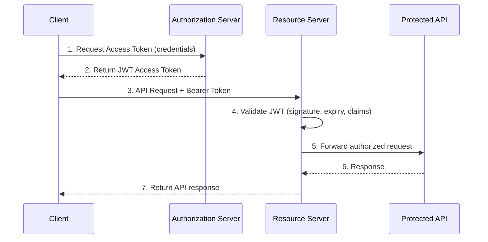
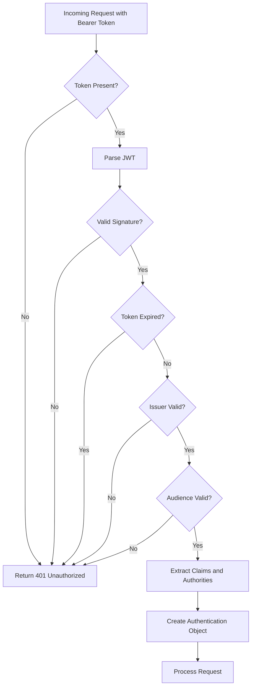

# How to Implement OAuth2 Resource Server in Spring Boot

By [nawazdhandala](https://github.com/nawazdhandala)

Tags: Spring Boot, OAuth2, Security, JWT, Authorization, Java, API Security

Description: A comprehensive guide to implementing OAuth2 Resource Server in Spring Boot, covering JWT token validation, scope-based authorization, custom claim validation, and integration with authorization servers like Keycloak and Auth0.

---

> **Key Insight:** A resource server protects your APIs by validating OAuth2 access tokens. Unlike the authorization server that issues tokens, the resource server only verifies them - making it simpler to implement but critical to get right for API security.

---

## Understanding OAuth2 Resource Server Architecture

Before diving into implementation, let us understand how a resource server fits into the OAuth2 ecosystem.



The resource server acts as a gatekeeper - it never issues tokens but validates every incoming request against the authorization server's public keys.

---

## Project Setup and Dependencies

Start by adding the necessary dependencies to your `pom.xml`:

```xml
<!-- pom.xml -->
<dependencies>
    <!-- Spring Boot Starter Web for REST endpoints -->
    <dependency>
        <groupId>org.springframework.boot</groupId>
        <artifactId>spring-boot-starter-web</artifactId>
    </dependency>

    <!-- OAuth2 Resource Server - the core dependency for JWT validation -->
    <dependency>
        <groupId>org.springframework.boot</groupId>
        <artifactId>spring-boot-starter-oauth2-resource-server</artifactId>
    </dependency>

    <!-- Spring Security - provides the security filter chain -->
    <dependency>
        <groupId>org.springframework.boot</groupId>
        <artifactId>spring-boot-starter-security</artifactId>
    </dependency>

    <!-- Optional: For custom JWT decoding and validation -->
    <dependency>
        <groupId>org.springframework.security</groupId>
        <artifactId>spring-security-oauth2-jose</artifactId>
    </dependency>
</dependencies>
```

For Gradle users:

```groovy
// build.gradle
dependencies {
    // Spring Boot Web Starter
    implementation 'org.springframework.boot:spring-boot-starter-web'

    // OAuth2 Resource Server - handles JWT validation automatically
    implementation 'org.springframework.boot:spring-boot-starter-oauth2-resource-server'

    // Spring Security base
    implementation 'org.springframework.boot:spring-boot-starter-security'
}
```

---

## Configuring Spring Security OAuth2 Resource Server

The most basic configuration requires only specifying your authorization server's issuer URI:

```yaml
# application.yml
spring:
  security:
    oauth2:
      resourceserver:
        jwt:
          # The issuer URI - Spring will automatically fetch the JWK set from
          # {issuer-uri}/.well-known/openid-configuration
          issuer-uri: https://auth.example.com/realms/myapp

          # Alternative: specify the JWK set URI directly if your auth server
          # doesn't support OpenID Connect Discovery
          # jwk-set-uri: https://auth.example.com/realms/myapp/protocol/openid-connect/certs
```

Now create the security configuration class:

```java
// SecurityConfig.java
package com.example.resourceserver.config;

import org.springframework.context.annotation.Bean;
import org.springframework.context.annotation.Configuration;
import org.springframework.security.config.annotation.method.configuration.EnableMethodSecurity;
import org.springframework.security.config.annotation.web.builders.HttpSecurity;
import org.springframework.security.config.annotation.web.configuration.EnableWebSecurity;
import org.springframework.security.config.http.SessionCreationPolicy;
import org.springframework.security.web.SecurityFilterChain;

@Configuration
@EnableWebSecurity
@EnableMethodSecurity  // Enables @PreAuthorize, @PostAuthorize annotations
public class SecurityConfig {

    @Bean
    public SecurityFilterChain securityFilterChain(HttpSecurity http) throws Exception {
        http
            // Disable CSRF - not needed for stateless JWT authentication
            .csrf(csrf -> csrf.disable())

            // Configure session management - stateless for JWT
            .sessionManagement(session ->
                session.sessionCreationPolicy(SessionCreationPolicy.STATELESS)
            )

            // Configure authorization rules
            .authorizeHttpRequests(auth -> auth
                // Public endpoints - no authentication required
                .requestMatchers("/api/public/**", "/health", "/actuator/health").permitAll()

                // Admin endpoints require ADMIN role
                .requestMatchers("/api/admin/**").hasRole("ADMIN")

                // All other endpoints require authentication
                .anyRequest().authenticated()
            )

            // Enable OAuth2 Resource Server with JWT support
            .oauth2ResourceServer(oauth2 -> oauth2
                .jwt(jwt -> jwt
                    // Optional: customize JWT authentication converter
                    // .jwtAuthenticationConverter(jwtAuthenticationConverter())
                )
            );

        return http.build();
    }
}
```

---

## JWT Token Validation

Spring Security automatically validates JWT tokens against several criteria. Here is how the validation flow works:



### Custom JWT Decoder Configuration

For advanced validation scenarios, create a custom JWT decoder:

```java
// JwtConfig.java
package com.example.resourceserver.config;

import org.springframework.beans.factory.annotation.Value;
import org.springframework.context.annotation.Bean;
import org.springframework.context.annotation.Configuration;
import org.springframework.security.oauth2.core.DelegatingOAuth2TokenValidator;
import org.springframework.security.oauth2.core.OAuth2TokenValidator;
import org.springframework.security.oauth2.jwt.*;

import java.util.List;

@Configuration
public class JwtConfig {

    @Value("${spring.security.oauth2.resourceserver.jwt.issuer-uri}")
    private String issuerUri;

    @Value("${app.security.jwt.audience}")
    private String expectedAudience;

    @Bean
    public JwtDecoder jwtDecoder() {
        // Create the default decoder from the issuer URI
        NimbusJwtDecoder jwtDecoder = JwtDecoders.fromIssuerLocation(issuerUri);

        // Build a composite validator with multiple validation rules
        OAuth2TokenValidator<Jwt> validator = new DelegatingOAuth2TokenValidator<>(
            // Validate the issuer claim matches our expected issuer
            JwtValidators.createDefaultWithIssuer(issuerUri),

            // Validate the audience claim contains our API identifier
            new JwtClaimValidator<List<String>>("aud",
                aud -> aud != null && aud.contains(expectedAudience)),

            // Custom validator to ensure token is not used before its 'nbf' claim
            new JwtTimestampValidator()
        );

        jwtDecoder.setJwtValidator(validator);
        return jwtDecoder;
    }
}
```

### Validating Token Claims Programmatically

Sometimes you need to validate claims within your service logic:

```java
// TokenValidationService.java
package com.example.resourceserver.service;

import org.springframework.security.core.context.SecurityContextHolder;
import org.springframework.security.oauth2.jwt.Jwt;
import org.springframework.security.oauth2.server.resource.authentication.JwtAuthenticationToken;
import org.springframework.stereotype.Service;

import java.time.Instant;
import java.util.List;

@Service
public class TokenValidationService {

    /**
     * Retrieves the current JWT from the security context.
     * Returns null if no JWT authentication is present.
     */
    public Jwt getCurrentJwt() {
        var authentication = SecurityContextHolder.getContext().getAuthentication();

        if (authentication instanceof JwtAuthenticationToken jwtAuth) {
            return jwtAuth.getToken();
        }
        return null;
    }

    /**
     * Extracts the subject (user ID) from the current JWT.
     */
    public String getCurrentUserId() {
        Jwt jwt = getCurrentJwt();
        return jwt != null ? jwt.getSubject() : null;
    }

    /**
     * Checks if the token was issued within the last N minutes.
     * Useful for sensitive operations requiring fresh tokens.
     */
    public boolean isTokenFresh(int maxAgeMinutes) {
        Jwt jwt = getCurrentJwt();
        if (jwt == null || jwt.getIssuedAt() == null) {
            return false;
        }

        Instant issuedAt = jwt.getIssuedAt();
        Instant threshold = Instant.now().minusSeconds(maxAgeMinutes * 60L);

        return issuedAt.isAfter(threshold);
    }

    /**
     * Retrieves a custom claim from the JWT.
     * Many authorization servers include custom claims like tenant ID or permissions.
     */
    @SuppressWarnings("unchecked")
    public <T> T getClaim(String claimName, Class<T> claimType) {
        Jwt jwt = getCurrentJwt();
        if (jwt == null) {
            return null;
        }

        Object claim = jwt.getClaim(claimName);
        if (claimType.isInstance(claim)) {
            return (T) claim;
        }
        return null;
    }

    /**
     * Validates that the token contains required scopes.
     */
    public boolean hasRequiredScopes(List<String> requiredScopes) {
        Jwt jwt = getCurrentJwt();
        if (jwt == null) {
            return false;
        }

        // Scopes can be in 'scope' claim (space-separated) or 'scp' claim (array)
        String scopeString = jwt.getClaimAsString("scope");
        List<String> tokenScopes;

        if (scopeString != null) {
            tokenScopes = List.of(scopeString.split(" "));
        } else {
            tokenScopes = jwt.getClaimAsStringList("scp");
        }

        if (tokenScopes == null) {
            return false;
        }

        return tokenScopes.containsAll(requiredScopes);
    }
}
```

---

## Scope-Based Authorization

OAuth2 scopes define what an access token can do. Configure scope-based authorization at both the security filter and method levels.

### Configuring Scope Extraction

Different authorization servers place scopes in different claims. Here is how to handle the common patterns:

```java
// JwtAuthenticationConverterConfig.java
package com.example.resourceserver.config;

import org.springframework.context.annotation.Bean;
import org.springframework.context.annotation.Configuration;
import org.springframework.core.convert.converter.Converter;
import org.springframework.security.authentication.AbstractAuthenticationToken;
import org.springframework.security.core.GrantedAuthority;
import org.springframework.security.core.authority.SimpleGrantedAuthority;
import org.springframework.security.oauth2.jwt.Jwt;
import org.springframework.security.oauth2.server.resource.authentication.JwtAuthenticationConverter;
import org.springframework.security.oauth2.server.resource.authentication.JwtGrantedAuthoritiesConverter;

import java.util.Collection;
import java.util.Collections;
import java.util.List;
import java.util.stream.Collectors;
import java.util.stream.Stream;

@Configuration
public class JwtAuthenticationConverterConfig {

    @Bean
    public Converter<Jwt, AbstractAuthenticationToken> jwtAuthenticationConverter() {
        JwtAuthenticationConverter converter = new JwtAuthenticationConverter();

        // Set our custom authorities converter that combines scopes and roles
        converter.setJwtGrantedAuthoritiesConverter(new CustomGrantedAuthoritiesConverter());

        // Use 'sub' claim as the principal name (default behavior)
        converter.setPrincipalClaimName("sub");

        return converter;
    }

    /**
     * Custom converter that extracts authorities from multiple JWT claims:
     * - Standard 'scope' claim (space-separated string)
     * - Keycloak 'realm_access.roles' claim (nested object)
     * - Auth0 'permissions' claim (array)
     */
    static class CustomGrantedAuthoritiesConverter implements Converter<Jwt, Collection<GrantedAuthority>> {

        private final JwtGrantedAuthoritiesConverter defaultConverter = new JwtGrantedAuthoritiesConverter();

        @Override
        public Collection<GrantedAuthority> convert(Jwt jwt) {
            // Get default authorities from 'scope' claim (prefixed with SCOPE_)
            Collection<GrantedAuthority> defaultAuthorities = defaultConverter.convert(jwt);

            // Extract roles from Keycloak's realm_access claim
            Collection<GrantedAuthority> keycloakRoles = extractKeycloakRoles(jwt);

            // Extract permissions from Auth0's permissions claim
            Collection<GrantedAuthority> auth0Permissions = extractAuth0Permissions(jwt);

            // Combine all authorities into a single collection
            return Stream.of(defaultAuthorities, keycloakRoles, auth0Permissions)
                .flatMap(Collection::stream)
                .collect(Collectors.toSet());
        }

        @SuppressWarnings("unchecked")
        private Collection<GrantedAuthority> extractKeycloakRoles(Jwt jwt) {
            // Keycloak stores roles in: realm_access.roles
            var realmAccess = jwt.getClaimAsMap("realm_access");
            if (realmAccess == null) {
                return Collections.emptyList();
            }

            var roles = (List<String>) realmAccess.get("roles");
            if (roles == null) {
                return Collections.emptyList();
            }

            // Prefix with ROLE_ to work with hasRole() checks
            return roles.stream()
                .map(role -> new SimpleGrantedAuthority("ROLE_" + role.toUpperCase()))
                .collect(Collectors.toList());
        }

        private Collection<GrantedAuthority> extractAuth0Permissions(Jwt jwt) {
            // Auth0 stores permissions in a 'permissions' claim array
            List<String> permissions = jwt.getClaimAsStringList("permissions");
            if (permissions == null) {
                return Collections.emptyList();
            }

            return permissions.stream()
                .map(SimpleGrantedAuthority::new)
                .collect(Collectors.toList());
        }
    }
}
```

### Using Scopes in Security Configuration

```java
// SecurityConfig.java - Extended with scope-based rules
@Bean
public SecurityFilterChain securityFilterChain(HttpSecurity http) throws Exception {
    http
        .csrf(csrf -> csrf.disable())
        .sessionManagement(session ->
            session.sessionCreationPolicy(SessionCreationPolicy.STATELESS)
        )
        .authorizeHttpRequests(auth -> auth
            // Public endpoints
            .requestMatchers("/api/public/**").permitAll()

            // Scope-based authorization using hasAuthority
            // Note: default scope prefix is "SCOPE_"
            .requestMatchers("/api/users/**").hasAuthority("SCOPE_users:read")
            .requestMatchers(HttpMethod.POST, "/api/users/**").hasAuthority("SCOPE_users:write")
            .requestMatchers(HttpMethod.DELETE, "/api/users/**").hasAuthority("SCOPE_users:delete")

            // Require multiple scopes using access expression
            .requestMatchers("/api/reports/**")
                .access(hasScope("reports:read").and(hasScope("analytics:access")))

            // Role-based authorization (from custom claim extraction)
            .requestMatchers("/api/admin/**").hasRole("ADMIN")

            // All other requests require authentication
            .anyRequest().authenticated()
        )
        .oauth2ResourceServer(oauth2 -> oauth2
            .jwt(jwt -> jwt
                .jwtAuthenticationConverter(jwtAuthenticationConverter())
            )
        );

    return http.build();
}

// Helper method for cleaner scope expressions
private static AuthorizationManager<RequestAuthorizationContext> hasScope(String scope) {
    return (authentication, context) -> {
        var auth = authentication.get();
        boolean hasScope = auth.getAuthorities().stream()
            .anyMatch(a -> a.getAuthority().equals("SCOPE_" + scope));
        return new AuthorizationDecision(hasScope);
    };
}
```

### Method-Level Security with Scopes

```java
// UserController.java
package com.example.resourceserver.controller;

import org.springframework.security.access.prepost.PreAuthorize;
import org.springframework.security.core.annotation.AuthenticationPrincipal;
import org.springframework.security.oauth2.jwt.Jwt;
import org.springframework.web.bind.annotation.*;

import java.util.List;
import java.util.Map;

@RestController
@RequestMapping("/api/users")
public class UserController {

    /**
     * List users - requires 'users:read' scope.
     * The #oauth2.hasScope() expression checks the token's scopes.
     */
    @GetMapping
    @PreAuthorize("hasAuthority('SCOPE_users:read')")
    public List<Map<String, Object>> listUsers() {
        // Return list of users
        return List.of(
            Map.of("id", "1", "name", "Alice"),
            Map.of("id", "2", "name", "Bob")
        );
    }

    /**
     * Get current user's profile using the JWT subject claim.
     * @AuthenticationPrincipal injects the JWT automatically.
     */
    @GetMapping("/me")
    @PreAuthorize("isAuthenticated()")
    public Map<String, Object> getCurrentUser(@AuthenticationPrincipal Jwt jwt) {
        return Map.of(
            "id", jwt.getSubject(),
            "email", jwt.getClaimAsString("email"),
            "name", jwt.getClaimAsString("name"),
            "scopes", jwt.getClaimAsString("scope")
        );
    }

    /**
     * Create user - requires 'users:write' scope.
     */
    @PostMapping
    @PreAuthorize("hasAuthority('SCOPE_users:write')")
    public Map<String, Object> createUser(@RequestBody Map<String, String> user) {
        // Create user logic
        return Map.of("id", "3", "name", user.get("name"), "status", "created");
    }

    /**
     * Delete user - requires both 'users:delete' scope AND 'ADMIN' role.
     * Demonstrates combining multiple authorization requirements.
     */
    @DeleteMapping("/{id}")
    @PreAuthorize("hasAuthority('SCOPE_users:delete') and hasRole('ADMIN')")
    public Map<String, String> deleteUser(@PathVariable String id) {
        return Map.of("status", "deleted", "id", id);
    }

    /**
     * Admin-only endpoint with custom SpEL expression.
     * Checks that the JWT was issued within the last 5 minutes (fresh token).
     */
    @PostMapping("/admin/sensitive-operation")
    @PreAuthorize("hasRole('ADMIN') and @tokenValidationService.isTokenFresh(5)")
    public Map<String, String> sensitiveOperation() {
        return Map.of("status", "operation completed");
    }
}
```

---

## Custom Claim Validation

Many applications need to validate custom claims beyond the standard JWT claims. Here is a comprehensive approach:

```java
// CustomClaimValidator.java
package com.example.resourceserver.security;

import org.springframework.security.oauth2.core.OAuth2Error;
import org.springframework.security.oauth2.core.OAuth2TokenValidator;
import org.springframework.security.oauth2.core.OAuth2TokenValidatorResult;
import org.springframework.security.oauth2.jwt.Jwt;

import java.util.List;

/**
 * Validates custom claims in the JWT.
 * This validator can be added to the JWT decoder's validator chain.
 */
public class CustomClaimValidator implements OAuth2TokenValidator<Jwt> {

    private final String requiredTenantId;
    private final List<String> allowedClientIds;

    public CustomClaimValidator(String requiredTenantId, List<String> allowedClientIds) {
        this.requiredTenantId = requiredTenantId;
        this.allowedClientIds = allowedClientIds;
    }

    @Override
    public OAuth2TokenValidatorResult validate(Jwt jwt) {
        // Validate tenant ID claim
        String tenantId = jwt.getClaimAsString("tenant_id");
        if (tenantId == null || !tenantId.equals(requiredTenantId)) {
            OAuth2Error error = new OAuth2Error(
                "invalid_token",
                "Token does not belong to the required tenant",
                null
            );
            return OAuth2TokenValidatorResult.failure(error);
        }

        // Validate client ID (azp claim - authorized party)
        String clientId = jwt.getClaimAsString("azp");
        if (clientId == null) {
            // Fallback to 'client_id' claim used by some providers
            clientId = jwt.getClaimAsString("client_id");
        }

        if (clientId == null || !allowedClientIds.contains(clientId)) {
            OAuth2Error error = new OAuth2Error(
                "invalid_token",
                "Token was issued to an unauthorized client",
                null
            );
            return OAuth2TokenValidatorResult.failure(error);
        }

        // All validations passed
        return OAuth2TokenValidatorResult.success();
    }
}
```

### Multi-Tenant Claim Validation

For SaaS applications with multi-tenancy:

```java
// TenantAwareJwtDecoder.java
package com.example.resourceserver.security;

import jakarta.servlet.http.HttpServletRequest;
import org.springframework.security.oauth2.core.DelegatingOAuth2TokenValidator;
import org.springframework.security.oauth2.core.OAuth2TokenValidator;
import org.springframework.security.oauth2.jwt.*;
import org.springframework.web.context.request.RequestContextHolder;
import org.springframework.web.context.request.ServletRequestAttributes;

import java.util.Map;
import java.util.concurrent.ConcurrentHashMap;

/**
 * A JWT decoder that validates tenant-specific claims.
 * Supports multiple tenants with different authorization servers.
 */
public class TenantAwareJwtDecoder implements JwtDecoder {

    // Cache decoders per tenant to avoid recreating them on every request
    private final Map<String, JwtDecoder> tenantDecoders = new ConcurrentHashMap<>();

    // Mapping of tenant ID to issuer URI
    private final Map<String, String> tenantIssuers;

    public TenantAwareJwtDecoder(Map<String, String> tenantIssuers) {
        this.tenantIssuers = tenantIssuers;
    }

    @Override
    public Jwt decode(String token) throws JwtException {
        // Extract tenant from request header or subdomain
        String tenantId = extractTenantId();

        if (tenantId == null || !tenantIssuers.containsKey(tenantId)) {
            throw new JwtException("Unknown or missing tenant identifier");
        }

        // Get or create decoder for this tenant
        JwtDecoder decoder = tenantDecoders.computeIfAbsent(tenantId, this::createDecoderForTenant);

        // Decode and validate the token
        Jwt jwt = decoder.decode(token);

        // Additional validation: ensure token's tenant claim matches request tenant
        String tokenTenant = jwt.getClaimAsString("tenant_id");
        if (!tenantId.equals(tokenTenant)) {
            throw new JwtException("Token tenant does not match request tenant");
        }

        return jwt;
    }

    private String extractTenantId() {
        ServletRequestAttributes attrs = (ServletRequestAttributes) RequestContextHolder.getRequestAttributes();
        if (attrs == null) {
            return null;
        }

        HttpServletRequest request = attrs.getRequest();

        // Try X-Tenant-ID header first
        String tenantId = request.getHeader("X-Tenant-ID");
        if (tenantId != null) {
            return tenantId;
        }

        // Fallback: extract from subdomain (e.g., tenant1.api.example.com)
        String host = request.getServerName();
        if (host != null && host.contains(".")) {
            return host.split("\\.")[0];
        }

        return null;
    }

    private JwtDecoder createDecoderForTenant(String tenantId) {
        String issuerUri = tenantIssuers.get(tenantId);
        NimbusJwtDecoder decoder = JwtDecoders.fromIssuerLocation(issuerUri);

        // Add tenant-specific validation
        OAuth2TokenValidator<Jwt> validator = new DelegatingOAuth2TokenValidator<>(
            JwtValidators.createDefaultWithIssuer(issuerUri),
            new JwtClaimValidator<String>("tenant_id",
                tid -> tenantId.equals(tid))
        );

        decoder.setJwtValidator(validator);
        return decoder;
    }
}
```

---

## Integration with Authorization Servers

### Keycloak Integration

```yaml
# application-keycloak.yml
spring:
  security:
    oauth2:
      resourceserver:
        jwt:
          # Keycloak issuer URI format
          issuer-uri: https://keycloak.example.com/realms/myapp

# Keycloak-specific configuration
keycloak:
  realm: myapp
  resource: my-api-client
  # Enable if using confidential client for token introspection
  use-resource-role-mappings: true
```

```java
// KeycloakJwtConfig.java
package com.example.resourceserver.config;

import org.springframework.context.annotation.Bean;
import org.springframework.context.annotation.Configuration;
import org.springframework.context.annotation.Profile;
import org.springframework.core.convert.converter.Converter;
import org.springframework.security.authentication.AbstractAuthenticationToken;
import org.springframework.security.core.GrantedAuthority;
import org.springframework.security.core.authority.SimpleGrantedAuthority;
import org.springframework.security.oauth2.jwt.Jwt;
import org.springframework.security.oauth2.server.resource.authentication.JwtAuthenticationConverter;

import java.util.*;
import java.util.stream.Collectors;

@Configuration
@Profile("keycloak")
public class KeycloakJwtConfig {

    @Bean
    public Converter<Jwt, AbstractAuthenticationToken> keycloakJwtAuthenticationConverter() {
        JwtAuthenticationConverter converter = new JwtAuthenticationConverter();
        converter.setJwtGrantedAuthoritiesConverter(new KeycloakGrantedAuthoritiesConverter());
        return converter;
    }

    /**
     * Extracts authorities from Keycloak's JWT structure:
     * - realm_access.roles: realm-level roles
     * - resource_access.{client}.roles: client-specific roles
     */
    static class KeycloakGrantedAuthoritiesConverter implements Converter<Jwt, Collection<GrantedAuthority>> {

        private static final String REALM_ACCESS_CLAIM = "realm_access";
        private static final String RESOURCE_ACCESS_CLAIM = "resource_access";
        private static final String ROLES_KEY = "roles";

        @Override
        @SuppressWarnings("unchecked")
        public Collection<GrantedAuthority> convert(Jwt jwt) {
            Set<GrantedAuthority> authorities = new HashSet<>();

            // Extract realm roles
            Map<String, Object> realmAccess = jwt.getClaimAsMap(REALM_ACCESS_CLAIM);
            if (realmAccess != null && realmAccess.containsKey(ROLES_KEY)) {
                List<String> realmRoles = (List<String>) realmAccess.get(ROLES_KEY);
                realmRoles.forEach(role ->
                    authorities.add(new SimpleGrantedAuthority("ROLE_" + role.toUpperCase()))
                );
            }

            // Extract resource/client roles
            Map<String, Object> resourceAccess = jwt.getClaimAsMap(RESOURCE_ACCESS_CLAIM);
            if (resourceAccess != null) {
                resourceAccess.forEach((clientId, clientRoles) -> {
                    if (clientRoles instanceof Map) {
                        Map<String, Object> clientRolesMap = (Map<String, Object>) clientRoles;
                        if (clientRolesMap.containsKey(ROLES_KEY)) {
                            List<String> roles = (List<String>) clientRolesMap.get(ROLES_KEY);
                            roles.forEach(role ->
                                authorities.add(new SimpleGrantedAuthority(clientId + "_" + role))
                            );
                        }
                    }
                });
            }

            return authorities;
        }
    }
}
```

### Auth0 Integration

```yaml
# application-auth0.yml
spring:
  security:
    oauth2:
      resourceserver:
        jwt:
          # Auth0 issuer URI format (note the trailing slash)
          issuer-uri: https://your-tenant.auth0.com/

          # Auth0 requires audience validation
          audiences: https://api.example.com

auth0:
  # Your Auth0 API identifier
  audience: https://api.example.com
```

```java
// Auth0JwtConfig.java
package com.example.resourceserver.config;

import org.springframework.beans.factory.annotation.Value;
import org.springframework.context.annotation.Bean;
import org.springframework.context.annotation.Configuration;
import org.springframework.context.annotation.Profile;
import org.springframework.security.oauth2.core.DelegatingOAuth2TokenValidator;
import org.springframework.security.oauth2.core.OAuth2TokenValidator;
import org.springframework.security.oauth2.jwt.*;

import java.util.List;

@Configuration
@Profile("auth0")
public class Auth0JwtConfig {

    @Value("${spring.security.oauth2.resourceserver.jwt.issuer-uri}")
    private String issuer;

    @Value("${auth0.audience}")
    private String audience;

    @Bean
    public JwtDecoder auth0JwtDecoder() {
        NimbusJwtDecoder jwtDecoder = JwtDecoders.fromOidcIssuerLocation(issuer);

        // Auth0 requires strict audience validation
        OAuth2TokenValidator<Jwt> audienceValidator = new JwtClaimValidator<List<String>>(
            "aud",
            aud -> aud != null && aud.contains(audience)
        );

        OAuth2TokenValidator<Jwt> withIssuer = JwtValidators.createDefaultWithIssuer(issuer);
        OAuth2TokenValidator<Jwt> withAudience = new DelegatingOAuth2TokenValidator<>(
            withIssuer,
            audienceValidator
        );

        jwtDecoder.setJwtValidator(withAudience);
        return jwtDecoder;
    }
}
```

### Okta Integration

```yaml
# application-okta.yml
spring:
  security:
    oauth2:
      resourceserver:
        jwt:
          issuer-uri: https://your-org.okta.com/oauth2/default

okta:
  oauth2:
    # Okta-specific: groups claim for role mapping
    groups-claim: groups
```

---

## Token Introspection (Opaque Tokens)

For scenarios where you cannot validate JWTs locally (opaque tokens or revocation checking):

```yaml
# application-introspection.yml
spring:
  security:
    oauth2:
      resourceserver:
        # Use opaque token introspection instead of JWT
        opaquetoken:
          introspection-uri: https://auth.example.com/oauth2/introspect
          client-id: resource-server-client
          client-secret: ${INTROSPECTION_CLIENT_SECRET}
```

```java
// OpaqueTokenConfig.java
package com.example.resourceserver.config;

import org.springframework.context.annotation.Bean;
import org.springframework.context.annotation.Configuration;
import org.springframework.context.annotation.Profile;
import org.springframework.security.config.annotation.web.builders.HttpSecurity;
import org.springframework.security.oauth2.server.resource.introspection.OpaqueTokenIntrospector;
import org.springframework.security.oauth2.server.resource.introspection.NimbusOpaqueTokenIntrospector;
import org.springframework.security.web.SecurityFilterChain;

@Configuration
@Profile("opaque")
public class OpaqueTokenConfig {

    @Bean
    public SecurityFilterChain opaqueTokenSecurityFilterChain(HttpSecurity http) throws Exception {
        http
            .authorizeHttpRequests(auth -> auth
                .anyRequest().authenticated()
            )
            // Use opaque token introspection instead of JWT
            .oauth2ResourceServer(oauth2 -> oauth2
                .opaqueToken(opaque -> opaque
                    .introspector(customIntrospector())
                )
            );

        return http.build();
    }

    @Bean
    public OpaqueTokenIntrospector customIntrospector() {
        // Customize introspection if needed
        return new NimbusOpaqueTokenIntrospector(
            "https://auth.example.com/oauth2/introspect",
            "resource-server-client",
            System.getenv("INTROSPECTION_CLIENT_SECRET")
        );
    }
}
```

---

## Error Handling and Responses

Customize error responses for authentication and authorization failures:

```java
// OAuth2ErrorConfig.java
package com.example.resourceserver.config;

import com.fasterxml.jackson.databind.ObjectMapper;
import jakarta.servlet.http.HttpServletRequest;
import jakarta.servlet.http.HttpServletResponse;
import org.springframework.context.annotation.Bean;
import org.springframework.context.annotation.Configuration;
import org.springframework.http.HttpStatus;
import org.springframework.http.MediaType;
import org.springframework.security.access.AccessDeniedException;
import org.springframework.security.core.AuthenticationException;
import org.springframework.security.oauth2.server.resource.web.BearerTokenAuthenticationEntryPoint;
import org.springframework.security.oauth2.server.resource.web.access.BearerTokenAccessDeniedHandler;
import org.springframework.security.web.AuthenticationEntryPoint;
import org.springframework.security.web.access.AccessDeniedHandler;

import java.io.IOException;
import java.time.Instant;
import java.util.Map;

@Configuration
public class OAuth2ErrorConfig {

    private final ObjectMapper objectMapper = new ObjectMapper();

    /**
     * Custom authentication entry point for 401 errors.
     * Returns a structured JSON error response.
     */
    @Bean
    public AuthenticationEntryPoint customAuthenticationEntryPoint() {
        return (request, response, authException) -> {
            // Delegate to default for WWW-Authenticate header
            new BearerTokenAuthenticationEntryPoint().commence(request, response, authException);

            // Override response body with custom JSON
            writeErrorResponse(
                response,
                HttpStatus.UNAUTHORIZED,
                "authentication_error",
                "Invalid or missing access token",
                request.getRequestURI()
            );
        };
    }

    /**
     * Custom access denied handler for 403 errors.
     * Returns detailed information about why access was denied.
     */
    @Bean
    public AccessDeniedHandler customAccessDeniedHandler() {
        return (request, response, accessDeniedException) -> {
            // Delegate to default for standard headers
            new BearerTokenAccessDeniedHandler().handle(request, response, accessDeniedException);

            // Override response body with custom JSON
            writeErrorResponse(
                response,
                HttpStatus.FORBIDDEN,
                "insufficient_scope",
                "The access token does not have the required scope or permissions",
                request.getRequestURI()
            );
        };
    }

    private void writeErrorResponse(
            HttpServletResponse response,
            HttpStatus status,
            String error,
            String message,
            String path) throws IOException {

        response.setStatus(status.value());
        response.setContentType(MediaType.APPLICATION_JSON_VALUE);

        Map<String, Object> errorBody = Map.of(
            "timestamp", Instant.now().toString(),
            "status", status.value(),
            "error", error,
            "message", message,
            "path", path
        );

        objectMapper.writeValue(response.getOutputStream(), errorBody);
    }
}
```

Update the security configuration to use custom error handlers:

```java
// In SecurityConfig.java
@Bean
public SecurityFilterChain securityFilterChain(
        HttpSecurity http,
        AuthenticationEntryPoint authEntryPoint,
        AccessDeniedHandler accessDeniedHandler) throws Exception {

    http
        // ... other configuration ...
        .exceptionHandling(exceptions -> exceptions
            .authenticationEntryPoint(authEntryPoint)
            .accessDeniedHandler(accessDeniedHandler)
        )
        .oauth2ResourceServer(oauth2 -> oauth2
            .authenticationEntryPoint(authEntryPoint)
            .accessDeniedHandler(accessDeniedHandler)
            .jwt(Customizer.withDefaults())
        );

    return http.build();
}
```

---

## Testing OAuth2 Resource Server

Comprehensive testing ensures your security configuration works correctly:

```java
// ResourceServerIntegrationTest.java
package com.example.resourceserver;

import org.junit.jupiter.api.Test;
import org.springframework.beans.factory.annotation.Autowired;
import org.springframework.boot.test.autoconfigure.web.servlet.AutoConfigureMockMvc;
import org.springframework.boot.test.context.SpringBootTest;
import org.springframework.security.test.web.servlet.request.SecurityMockMvcRequestPostProcessors;
import org.springframework.test.web.servlet.MockMvc;

import static org.springframework.security.test.web.servlet.request.SecurityMockMvcRequestPostProcessors.jwt;
import static org.springframework.test.web.servlet.request.MockMvcRequestBuilders.*;
import static org.springframework.test.web.servlet.result.MockMvcResultMatchers.*;

@SpringBootTest
@AutoConfigureMockMvc
class ResourceServerIntegrationTest {

    @Autowired
    private MockMvc mockMvc;

    @Test
    void publicEndpoint_shouldBeAccessibleWithoutToken() throws Exception {
        mockMvc.perform(get("/api/public/health"))
            .andExpect(status().isOk());
    }

    @Test
    void protectedEndpoint_withoutToken_shouldReturn401() throws Exception {
        mockMvc.perform(get("/api/users"))
            .andExpect(status().isUnauthorized())
            .andExpect(header().exists("WWW-Authenticate"));
    }

    @Test
    void protectedEndpoint_withValidToken_shouldReturn200() throws Exception {
        mockMvc.perform(get("/api/users")
            .with(jwt()
                .jwt(jwt -> jwt
                    .subject("user-123")
                    .claim("scope", "users:read")
                )
            ))
            .andExpect(status().isOk());
    }

    @Test
    void protectedEndpoint_withInsufficientScope_shouldReturn403() throws Exception {
        mockMvc.perform(post("/api/users")
            .with(jwt()
                .jwt(jwt -> jwt
                    .subject("user-123")
                    .claim("scope", "users:read")  // Missing users:write scope
                )
            )
            .contentType("application/json")
            .content("{\"name\": \"Test User\"}"))
            .andExpect(status().isForbidden());
    }

    @Test
    void adminEndpoint_withAdminRole_shouldReturn200() throws Exception {
        mockMvc.perform(delete("/api/users/123")
            .with(jwt()
                .jwt(jwt -> jwt
                    .subject("admin-user")
                    .claim("scope", "users:delete")
                )
                .authorities(
                    new SimpleGrantedAuthority("SCOPE_users:delete"),
                    new SimpleGrantedAuthority("ROLE_ADMIN")
                )
            ))
            .andExpect(status().isOk());
    }

    @Test
    void customClaimValidation_withValidTenant_shouldSucceed() throws Exception {
        mockMvc.perform(get("/api/tenant/data")
            .with(jwt()
                .jwt(jwt -> jwt
                    .subject("user-456")
                    .claim("tenant_id", "tenant-abc")
                    .claim("scope", "data:read")
                )
            ))
            .andExpect(status().isOk());
    }
}
```

---

## Best Practices Summary

When implementing OAuth2 Resource Server in Spring Boot, follow these guidelines:

| Practice | Description |
|----------|-------------|
| **Always validate issuer** | Ensure tokens come from your trusted authorization server |
| **Validate audience** | Confirm tokens are intended for your API |
| **Use short-lived tokens** | Minimize the window of token compromise |
| **Implement scope-based authorization** | Use fine-grained scopes rather than broad permissions |
| **Cache JWK sets appropriately** | Balance security with performance |
| **Handle errors gracefully** | Return meaningful error messages without exposing internals |
| **Test security configuration** | Write comprehensive tests for all authorization scenarios |
| **Use HTTPS everywhere** | Never transmit tokens over unencrypted connections |
| **Log security events** | Track authentication failures for security monitoring |
| **Rotate secrets regularly** | Update client secrets and signing keys periodically |

### Common Pitfalls to Avoid

1. **Not validating the audience claim** - Tokens meant for other APIs could be misused
2. **Hardcoding secrets in code** - Use environment variables or secret management
3. **Ignoring token expiration** - Always let Spring Security validate expiry
4. **Over-permissive CORS** - Configure CORS strictly for your frontend origins
5. **Missing rate limiting** - Token validation endpoints can be abused
6. **Not monitoring for anomalies** - Track unusual patterns in token usage

---

## Conclusion

Implementing OAuth2 Resource Server in Spring Boot provides robust API security through standardized token validation. The key components are:

- **JWT validation** against your authorization server's public keys
- **Scope-based authorization** for fine-grained access control
- **Custom claim validation** for business-specific requirements
- **Proper error handling** for security-related failures

By following the patterns in this guide, you can secure your APIs while maintaining compatibility with any OAuth2/OIDC-compliant authorization server.

For monitoring your Spring Boot applications and tracking security metrics, consider using [OneUptime](https://oneuptime.com) - an open-source observability platform that helps you monitor application health, track errors, and set up alerts for security-related events.

---

## Additional Resources

- [Spring Security OAuth2 Resource Server Documentation](https://docs.spring.io/spring-security/reference/servlet/oauth2/resource-server/index.html)
- [OAuth 2.0 RFC 6749](https://datatracker.ietf.org/doc/html/rfc6749)
- [JWT RFC 7519](https://datatracker.ietf.org/doc/html/rfc7519)
- [OpenID Connect Core Specification](https://openid.net/specs/openid-connect-core-1_0.html)
