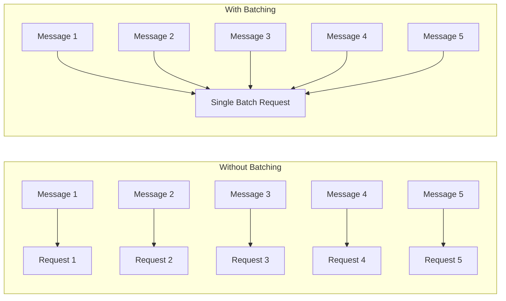
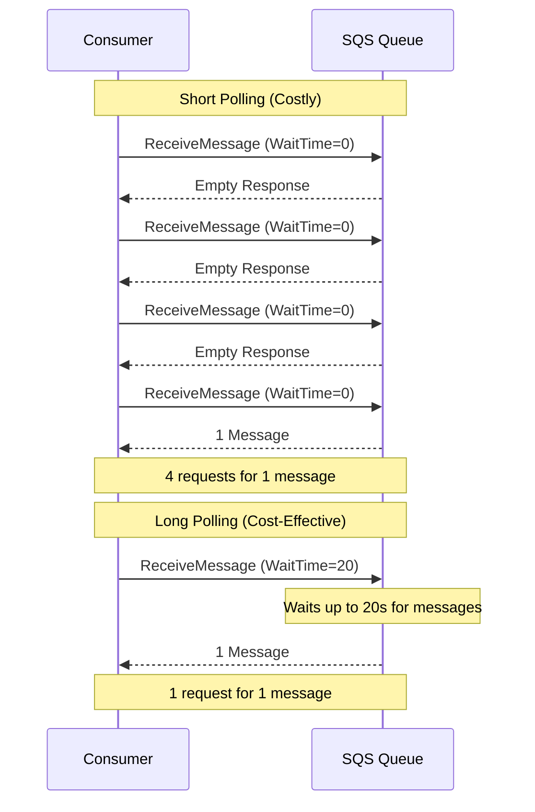
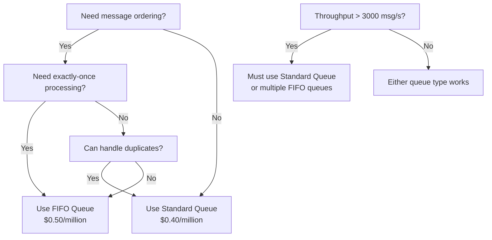
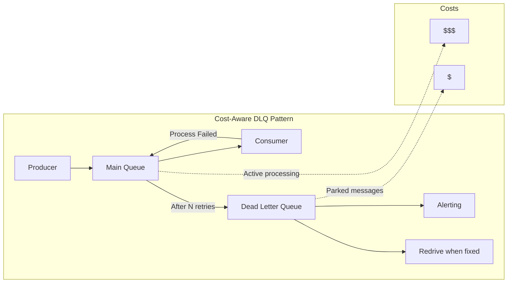
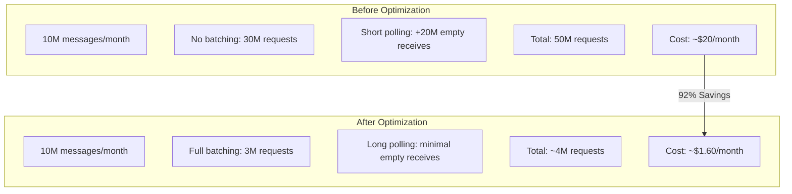

# How to Optimize SQS Costs

Author: [nawazdhandala](https://www.github.com/nawazdhandala)

Tags: AWS, SQS, Cost Optimization, Message Queue, Cloud, FinOps, DevOps, Infrastructure

Description: A practical guide to reducing AWS SQS costs through batching, long polling, queue type selection, and architectural best practices that can cut your messaging bill by 50-90%.

---

> "The best way to save money on SQS is to send fewer requests, not fewer messages."

Amazon Simple Queue Service (SQS) is deceptively simple in its pricing model, yet teams routinely overpay by 2-10x due to suboptimal configurations. This guide walks through the pricing mechanics and hands-on techniques to slash your SQS bill while maintaining (or improving) throughput and reliability.

---

## Understanding SQS Pricing

Before optimizing, you need to understand what you are paying for. SQS charges based on **requests**, not messages. This distinction is critical.

### Pricing Breakdown (as of 2026)

| Component | Standard Queue | FIFO Queue |
|-----------|---------------|------------|
| First 1M requests/month | Free | Free |
| Requests beyond free tier | $0.40 per million | $0.50 per million |
| Data transfer (out to internet) | Standard AWS rates | Standard AWS rates |
| Data transfer (within region) | Free | Free |

### What Counts as a Request?

Each of these API calls counts as one request:

- `SendMessage` / `SendMessageBatch`
- `ReceiveMessage`
- `DeleteMessage` / `DeleteMessageBatch`
- `ChangeMessageVisibility` / `ChangeMessageVisibilityBatch`
- `GetQueueAttributes`
- `SetQueueAttributes`

The key insight: **a batch operation counts as one request**, regardless of how many messages it contains (up to 10).



---

## Strategy 1: Batch Everything

Batching is the single most impactful optimization. SQS allows up to 10 messages per batch operation, effectively reducing your request costs by up to 90%.

### Batch Sending Messages

```python
# sqs_batch_sender.py
# Demonstrates batching messages for cost optimization
# Key insight: 10 messages in 1 batch = 1 request cost (not 10)

import boto3
import json
from typing import List, Dict, Any
from dataclasses import dataclass
from datetime import datetime
import uuid

@dataclass
class Message:
    """Represents a message to be sent to SQS."""
    body: Dict[str, Any]
    message_group_id: str = None  # Required for FIFO queues
    deduplication_id: str = None  # Required for FIFO without content-based dedup

class SQSBatchSender:
    """
    Efficient SQS sender that automatically batches messages.

    Cost savings example:
    - 10,000 messages without batching = 10,000 requests = $0.004
    - 10,000 messages with batching = 1,000 requests = $0.0004
    - Savings: 90%
    """

    MAX_BATCH_SIZE = 10  # SQS maximum batch size
    MAX_MESSAGE_SIZE = 256 * 1024  # 256 KB per message
    MAX_BATCH_PAYLOAD = 256 * 1024  # 256 KB total batch payload

    def __init__(self, queue_url: str, region: str = 'us-east-1'):
        self.sqs = boto3.client('sqs', region_name=region)
        self.queue_url = queue_url
        self.pending_messages: List[Dict] = []
        self.current_batch_size = 0

    def add_message(self, message: Message) -> List[Dict]:
        """
        Add a message to the pending batch.
        Automatically flushes when batch is full.

        Returns: List of failed messages (if any) from flush operations.
        """
        message_body = json.dumps(message.body)
        message_size = len(message_body.encode('utf-8'))

        # Check if message itself exceeds size limit
        if message_size > self.MAX_MESSAGE_SIZE:
            raise ValueError(f"Message exceeds {self.MAX_MESSAGE_SIZE} bytes")

        # Flush if adding this message would exceed limits
        failures = []
        if (len(self.pending_messages) >= self.MAX_BATCH_SIZE or
            self.current_batch_size + message_size > self.MAX_BATCH_PAYLOAD):
            failures = self.flush()

        # Build the entry for this message
        entry = {
            'Id': str(uuid.uuid4()),  # Unique ID within the batch
            'MessageBody': message_body
        }

        # Add FIFO-specific attributes if present
        if message.message_group_id:
            entry['MessageGroupId'] = message.message_group_id
        if message.deduplication_id:
            entry['MessageDeduplicationId'] = message.deduplication_id

        self.pending_messages.append(entry)
        self.current_batch_size += message_size

        return failures

    def flush(self) -> List[Dict]:
        """
        Send all pending messages as a batch.
        Returns: List of failed messages for retry handling.
        """
        if not self.pending_messages:
            return []

        response = self.sqs.send_message_batch(
            QueueUrl=self.queue_url,
            Entries=self.pending_messages
        )

        # Track failures for retry logic
        failures = response.get('Failed', [])

        # Reset batch state
        self.pending_messages = []
        self.current_batch_size = 0

        return failures

    def __enter__(self):
        return self

    def __exit__(self, exc_type, exc_val, exc_tb):
        # Always flush remaining messages on context exit
        self.flush()


# Usage example
def process_orders(orders: List[Dict]):
    """
    Example: Send order events to SQS with automatic batching.
    """
    queue_url = 'https://sqs.us-east-1.amazonaws.com/123456789/orders-queue'

    with SQSBatchSender(queue_url) as sender:
        for order in orders:
            message = Message(
                body={
                    'order_id': order['id'],
                    'customer_id': order['customer_id'],
                    'total': order['total'],
                    'timestamp': datetime.utcnow().isoformat()
                }
            )
            failures = sender.add_message(message)

            if failures:
                # Handle failures - implement retry logic
                print(f"Failed to send {len(failures)} messages")
```

### Batch Receiving and Deleting Messages

```python
# sqs_batch_consumer.py
# Cost-optimized SQS consumer with batch operations

import boto3
from typing import List, Callable, Any
import time

class SQSBatchConsumer:
    """
    Efficient SQS consumer that batches receive and delete operations.

    Key optimizations:
    1. Receives up to 10 messages per request (MaxNumberOfMessages=10)
    2. Uses long polling (WaitTimeSeconds=20) to reduce empty responses
    3. Batches delete operations after successful processing
    """

    def __init__(self, queue_url: str, region: str = 'us-east-1'):
        self.sqs = boto3.client('sqs', region_name=region)
        self.queue_url = queue_url

    def poll_and_process(
        self,
        processor: Callable[[dict], bool],
        max_messages: int = 10,
        wait_time_seconds: int = 20,  # Long polling - crucial for cost savings
        visibility_timeout: int = 30
    ) -> dict:
        """
        Poll for messages and process them with automatic batch deletion.

        Args:
            processor: Function that processes a message, returns True on success
            max_messages: Number of messages to retrieve (1-10)
            wait_time_seconds: Long polling duration (0-20 seconds)
            visibility_timeout: Time before message becomes visible again

        Returns:
            Stats dict with processed, failed, and deleted counts
        """
        stats = {'received': 0, 'processed': 0, 'failed': 0, 'deleted': 0}

        # Receive messages in batch - one request for up to 10 messages
        response = self.sqs.receive_message(
            QueueUrl=self.queue_url,
            MaxNumberOfMessages=max_messages,
            WaitTimeSeconds=wait_time_seconds,  # Long polling
            VisibilityTimeout=visibility_timeout,
            AttributeNames=['All'],
            MessageAttributeNames=['All']
        )

        messages = response.get('Messages', [])
        stats['received'] = len(messages)

        if not messages:
            return stats  # Long polling returned no messages

        # Process messages and collect successful ones for deletion
        to_delete = []

        for message in messages:
            try:
                success = processor(message)
                if success:
                    stats['processed'] += 1
                    to_delete.append({
                        'Id': message['MessageId'],
                        'ReceiptHandle': message['ReceiptHandle']
                    })
                else:
                    stats['failed'] += 1
            except Exception as e:
                stats['failed'] += 1
                print(f"Error processing message {message['MessageId']}: {e}")

        # Batch delete successful messages - one request for up to 10 deletions
        if to_delete:
            delete_response = self.sqs.delete_message_batch(
                QueueUrl=self.queue_url,
                Entries=to_delete
            )
            stats['deleted'] = len(delete_response.get('Successful', []))

        return stats

    def run_consumer_loop(
        self,
        processor: Callable[[dict], bool],
        shutdown_check: Callable[[], bool] = lambda: False
    ):
        """
        Run continuous consumer loop with graceful shutdown support.

        Cost breakdown per iteration:
        - 1 ReceiveMessage request (returns 0-10 messages)
        - 1 DeleteMessageBatch request (if messages processed)
        - Total: 2 requests per batch of up to 10 messages

        Compare to naive approach:
        - 10 ReceiveMessage requests
        - 10 DeleteMessage requests
        - Total: 20 requests for same 10 messages

        Savings: 90%
        """
        while not shutdown_check():
            stats = self.poll_and_process(processor)

            if stats['received'] == 0:
                # Long polling already waited, minimal additional delay needed
                time.sleep(1)


# Usage example
def handle_order(message: dict) -> bool:
    """Process an order message."""
    import json
    body = json.loads(message['Body'])
    print(f"Processing order {body.get('order_id')}")
    # ... actual processing logic ...
    return True  # Return True on success, False on failure

# Run the consumer
consumer = SQSBatchConsumer('https://sqs.us-east-1.amazonaws.com/123456789/orders-queue')
consumer.run_consumer_loop(handle_order)
```

---

## Strategy 2: Long Polling

Long polling is free and can dramatically reduce costs by eliminating empty responses.

### Short Polling vs Long Polling



### Configuring Long Polling

```python
# long_polling_config.py
# Configure long polling at queue level and per-request

import boto3

def configure_queue_long_polling(queue_url: str, wait_time: int = 20):
    """
    Set default long polling at the queue level.

    This applies to all ReceiveMessage calls that don't specify WaitTimeSeconds.
    Maximum wait time is 20 seconds.

    Cost impact example (assuming 1 message arrives every 5 seconds on average):

    Short polling (WaitTimeSeconds=0):
    - Consumer polls every 1 second
    - 60 requests per minute
    - ~12 messages received per minute
    - Cost: 60 requests

    Long polling (WaitTimeSeconds=20):
    - Consumer waits up to 20 seconds
    - Returns immediately when message arrives
    - ~12 messages received per minute
    - Cost: ~12 requests (one per message arrival)

    Savings: 80%
    """
    sqs = boto3.client('sqs')

    sqs.set_queue_attributes(
        QueueUrl=queue_url,
        Attributes={
            'ReceiveMessageWaitTimeSeconds': str(wait_time)
        }
    )
    print(f"Queue configured for {wait_time}s long polling")


def receive_with_long_polling(queue_url: str):
    """
    Receive messages with explicit long polling.

    Use this when you need different wait times for different consumers
    or when the queue default isn't set.
    """
    sqs = boto3.client('sqs')

    response = sqs.receive_message(
        QueueUrl=queue_url,
        MaxNumberOfMessages=10,  # Always request max batch size
        WaitTimeSeconds=20,      # Maximum long polling duration
        VisibilityTimeout=30,
        AttributeNames=['All']
    )

    return response.get('Messages', [])
```

### Cost Impact Calculator

```python
# cost_calculator.py
# Calculate potential savings from SQS optimizations

def calculate_sqs_savings(
    messages_per_month: int,
    current_batch_size: int = 1,
    current_poll_interval_seconds: float = 1,
    avg_message_interval_seconds: float = 5,
    is_fifo: bool = False
):
    """
    Calculate potential cost savings from batching and long polling.

    Args:
        messages_per_month: Total messages processed monthly
        current_batch_size: Current batch size (1 = no batching)
        current_poll_interval_seconds: How often consumer polls
        avg_message_interval_seconds: Average time between messages
        is_fifo: Whether using FIFO queue
    """
    price_per_million = 0.50 if is_fifo else 0.40
    free_tier = 1_000_000

    # Current costs (naive approach)
    current_send_requests = messages_per_month / current_batch_size
    current_receive_requests = (30 * 24 * 3600) / current_poll_interval_seconds  # Polls per month
    current_delete_requests = messages_per_month / current_batch_size
    current_total_requests = current_send_requests + current_receive_requests + current_delete_requests

    # Optimized costs (batching + long polling)
    optimized_batch_size = 10
    optimized_send_requests = messages_per_month / optimized_batch_size
    # With long polling, we only make requests when messages are available
    optimized_receive_requests = messages_per_month / optimized_batch_size
    optimized_delete_requests = messages_per_month / optimized_batch_size
    optimized_total_requests = optimized_send_requests + optimized_receive_requests + optimized_delete_requests

    # Calculate costs
    def calculate_cost(requests):
        billable = max(0, requests - free_tier)
        return (billable / 1_000_000) * price_per_million

    current_cost = calculate_cost(current_total_requests)
    optimized_cost = calculate_cost(optimized_total_requests)
    savings = current_cost - optimized_cost
    savings_percent = (savings / current_cost * 100) if current_cost > 0 else 0

    return {
        'current_requests': current_total_requests,
        'optimized_requests': optimized_total_requests,
        'current_cost': f'${current_cost:.2f}',
        'optimized_cost': f'${optimized_cost:.2f}',
        'monthly_savings': f'${savings:.2f}',
        'savings_percent': f'{savings_percent:.1f}%'
    }


# Example calculation
result = calculate_sqs_savings(
    messages_per_month=10_000_000,  # 10 million messages
    current_batch_size=1,           # No batching currently
    current_poll_interval_seconds=1 # Polling every second
)

print("SQS Cost Optimization Analysis")
print("=" * 40)
for key, value in result.items():
    print(f"{key}: {value}")
```

---

## Strategy 3: Standard vs FIFO Queue Selection

Choosing the right queue type has both cost and architectural implications.

### Feature and Cost Comparison

| Feature | Standard Queue | FIFO Queue |
|---------|---------------|------------|
| Price per million requests | $0.40 | $0.50 |
| Throughput | Unlimited | 300 msg/s (3,000 with batching) |
| Message ordering | Best effort | Guaranteed (within message group) |
| Exactly-once delivery | No (at-least-once) | Yes |
| Deduplication | Not built-in | 5-minute window |

### When to Use Each Queue Type



### FIFO Queue Cost Optimization

```python
# fifo_optimization.py
# Cost-effective patterns for FIFO queues

import boto3
import hashlib
from typing import List, Dict

class FIFOQueueOptimizer:
    """
    Optimize FIFO queue costs through message grouping and deduplication.

    FIFO queues cost 25% more ($0.50 vs $0.40 per million requests),
    but provide ordering and exactly-once delivery.

    Key optimizations:
    1. Use content-based deduplication to avoid generating dedup IDs
    2. Parallelize with message groups for higher throughput
    3. Batch aggressively (batching is even more valuable at $0.50/million)
    """

    def __init__(self, queue_url: str):
        self.sqs = boto3.client('sqs')
        self.queue_url = queue_url

    def send_with_content_dedup(self, messages: List[Dict], message_group_id: str):
        """
        Send messages using content-based deduplication.

        When ContentBasedDeduplication is enabled on the queue,
        SQS generates the deduplication ID from the message body hash.

        This saves you from:
        1. Generating and storing deduplication IDs
        2. Tracking which IDs have been used recently
        """
        entries = []
        for i, msg in enumerate(messages):
            entries.append({
                'Id': str(i),
                'MessageBody': str(msg),
                'MessageGroupId': message_group_id
                # No MessageDeduplicationId needed with content-based dedup
            })

            if len(entries) == 10:
                self.sqs.send_message_batch(QueueUrl=self.queue_url, Entries=entries)
                entries = []

        if entries:
            self.sqs.send_message_batch(QueueUrl=self.queue_url, Entries=entries)

    def create_message_groups_for_parallelism(
        self,
        items: List[Dict],
        partition_key: str
    ) -> Dict[str, List[Dict]]:
        """
        Partition messages into groups for parallel processing.

        FIFO queues process messages in order WITHIN a message group.
        Different message groups can be processed in parallel.

        Example: Orders from different customers can be processed in parallel,
        but orders from the same customer must maintain order.

        Cost impact: No direct cost savings, but enables higher throughput
        which means faster processing and potentially fewer running consumers.
        """
        groups = {}
        for item in items:
            group_id = str(item.get(partition_key, 'default'))
            if group_id not in groups:
                groups[group_id] = []
            groups[group_id].append(item)
        return groups


def setup_fifo_queue_with_content_dedup():
    """
    Create a FIFO queue with content-based deduplication enabled.
    """
    sqs = boto3.client('sqs')

    response = sqs.create_queue(
        QueueName='orders-queue.fifo',  # FIFO queues must end with .fifo
        Attributes={
            'FifoQueue': 'true',
            'ContentBasedDeduplication': 'true',  # Enable content-based dedup
            'DeduplicationScope': 'messageGroup',  # Scope dedup to message groups
            'FifoThroughputLimit': 'perMessageGroupId'  # Higher throughput mode
        }
    )

    return response['QueueUrl']
```

---

## Strategy 4: Architecture Patterns for Cost Reduction

### Pattern 1: Message Aggregation

```python
# message_aggregation.py
# Aggregate multiple events into single messages to reduce request count

import json
from datetime import datetime, timedelta
from typing import List, Dict
import threading
import time

class MessageAggregator:
    """
    Aggregate multiple small events into single SQS messages.

    Use case: High-frequency events like metrics, clicks, or logs
    where individual message ordering doesn't matter.

    Example:
    - 1000 click events per second
    - Without aggregation: 1000 SendMessage requests/second
    - With aggregation (100 events per message): 10 requests/second
    - Savings: 99%
    """

    def __init__(
        self,
        queue_url: str,
        max_events_per_message: int = 100,
        max_wait_seconds: float = 1.0,
        max_message_size_kb: int = 200  # Leave buffer under 256KB limit
    ):
        import boto3
        self.sqs = boto3.client('sqs')
        self.queue_url = queue_url
        self.max_events = max_events_per_message
        self.max_wait = max_wait_seconds
        self.max_size = max_message_size_kb * 1024

        self.buffer: List[Dict] = []
        self.buffer_size = 0
        self.last_flush = datetime.utcnow()
        self.lock = threading.Lock()

        # Start background flush thread
        self.running = True
        self.flush_thread = threading.Thread(target=self._flush_loop)
        self.flush_thread.daemon = True
        self.flush_thread.start()

    def add_event(self, event: Dict):
        """
        Add an event to the buffer.
        Events are automatically flushed when limits are reached.
        """
        event_json = json.dumps(event)
        event_size = len(event_json.encode('utf-8'))

        with self.lock:
            # Check if this event would exceed message size limit
            if self.buffer_size + event_size > self.max_size:
                self._flush_buffer()

            self.buffer.append(event)
            self.buffer_size += event_size

            # Check if we've reached event count limit
            if len(self.buffer) >= self.max_events:
                self._flush_buffer()

    def _flush_buffer(self):
        """Flush the current buffer to SQS."""
        if not self.buffer:
            return

        # Create aggregated message
        aggregated = {
            'event_count': len(self.buffer),
            'aggregated_at': datetime.utcnow().isoformat(),
            'events': self.buffer
        }

        self.sqs.send_message(
            QueueUrl=self.queue_url,
            MessageBody=json.dumps(aggregated)
        )

        self.buffer = []
        self.buffer_size = 0
        self.last_flush = datetime.utcnow()

    def _flush_loop(self):
        """Background thread to flush on time interval."""
        while self.running:
            time.sleep(0.1)

            with self.lock:
                elapsed = (datetime.utcnow() - self.last_flush).total_seconds()
                if elapsed >= self.max_wait and self.buffer:
                    self._flush_buffer()

    def shutdown(self):
        """Gracefully shutdown and flush remaining events."""
        self.running = False
        with self.lock:
            self._flush_buffer()


# Usage for high-frequency events
aggregator = MessageAggregator(
    queue_url='https://sqs.us-east-1.amazonaws.com/123456789/events-queue',
    max_events_per_message=100,
    max_wait_seconds=1.0
)

# Add events - they're automatically batched
for i in range(1000):
    aggregator.add_event({
        'type': 'page_view',
        'page': '/product/123',
        'timestamp': datetime.utcnow().isoformat()
    })
```

### Pattern 2: Dead Letter Queue Cost Management



```python
# dlq_management.py
# Cost-effective dead letter queue management

import boto3
from typing import Optional

def create_queue_with_dlq(
    queue_name: str,
    dlq_name: str,
    max_receive_count: int = 3,
    is_fifo: bool = False
) -> dict:
    """
    Create a queue with an associated dead letter queue.

    Cost optimization principles:
    1. Set appropriate maxReceiveCount to avoid endless retries
    2. Monitor DLQ depth - messages there still cost on receive
    3. Regularly process or purge DLQ messages
    4. Use DLQ redrive to reprocess after fixes (one-time cost)
    """
    sqs = boto3.client('sqs')

    suffix = '.fifo' if is_fifo else ''

    # Create the dead letter queue first
    dlq_response = sqs.create_queue(
        QueueName=f'{dlq_name}{suffix}',
        Attributes={
            'MessageRetentionPeriod': '1209600',  # 14 days max
            **(({'FifoQueue': 'true'} if is_fifo else {}))
        }
    )
    dlq_url = dlq_response['QueueUrl']

    # Get DLQ ARN
    dlq_attrs = sqs.get_queue_attributes(
        QueueUrl=dlq_url,
        AttributeNames=['QueueArn']
    )
    dlq_arn = dlq_attrs['Attributes']['QueueArn']

    # Create main queue with DLQ redrive policy
    import json
    redrive_policy = {
        'deadLetterTargetArn': dlq_arn,
        'maxReceiveCount': str(max_receive_count)  # Retries before DLQ
    }

    main_response = sqs.create_queue(
        QueueName=f'{queue_name}{suffix}',
        Attributes={
            'RedrivePolicy': json.dumps(redrive_policy),
            'VisibilityTimeout': '30',
            'ReceiveMessageWaitTimeSeconds': '20',  # Long polling by default
            **(({'FifoQueue': 'true'} if is_fifo else {}))
        }
    )

    return {
        'main_queue_url': main_response['QueueUrl'],
        'dlq_url': dlq_url,
        'dlq_arn': dlq_arn
    }


def redrive_dlq_messages(source_dlq_url: str, destination_queue_url: str):
    """
    Redrive messages from DLQ back to main queue.

    Use this after fixing the root cause of failures.

    Cost note: This creates new SendMessage requests to the destination
    and DeleteMessage requests from the DLQ. Use batching!
    """
    sqs = boto3.client('sqs')

    # Start the redrive task
    response = sqs.start_message_move_task(
        SourceArn=get_queue_arn(source_dlq_url),
        DestinationArn=get_queue_arn(destination_queue_url)
    )

    return response['TaskHandle']


def get_queue_arn(queue_url: str) -> str:
    """Get the ARN for a queue URL."""
    sqs = boto3.client('sqs')
    response = sqs.get_queue_attributes(
        QueueUrl=queue_url,
        AttributeNames=['QueueArn']
    )
    return response['Attributes']['QueueArn']
```

---

## Monitoring SQS Costs

Understanding your current usage is essential for optimization. Here is how to monitor and track SQS costs effectively.

### CloudWatch Metrics to Watch

```python
# sqs_monitoring.py
# Monitor SQS metrics for cost optimization insights

import boto3
from datetime import datetime, timedelta

def get_sqs_cost_metrics(queue_name: str, hours: int = 24):
    """
    Retrieve SQS metrics that indicate cost patterns.

    Key metrics for cost optimization:
    - NumberOfMessagesSent: Tracks send request volume
    - NumberOfMessagesReceived: Tracks receive request volume
    - NumberOfMessagesDeleted: Tracks delete request volume
    - NumberOfEmptyReceives: High numbers indicate short polling waste
    - ApproximateNumberOfMessagesVisible: Queue depth
    """
    cloudwatch = boto3.client('cloudwatch')

    end_time = datetime.utcnow()
    start_time = end_time - timedelta(hours=hours)

    metrics = [
        'NumberOfMessagesSent',
        'NumberOfMessagesReceived',
        'NumberOfMessagesDeleted',
        'NumberOfEmptyReceives',
        'ApproximateNumberOfMessagesVisible'
    ]

    results = {}

    for metric_name in metrics:
        response = cloudwatch.get_metric_statistics(
            Namespace='AWS/SQS',
            MetricName=metric_name,
            Dimensions=[
                {'Name': 'QueueName', 'Value': queue_name}
            ],
            StartTime=start_time,
            EndTime=end_time,
            Period=3600,  # Hourly
            Statistics=['Sum', 'Average']
        )

        total = sum(dp['Sum'] for dp in response['Datapoints'])
        results[metric_name] = {
            'total': total,
            'datapoints': response['Datapoints']
        }

    # Calculate cost indicators
    total_requests = (
        results['NumberOfMessagesSent']['total'] +
        results['NumberOfMessagesReceived']['total'] +
        results['NumberOfMessagesDeleted']['total']
    )

    empty_receive_ratio = (
        results['NumberOfEmptyReceives']['total'] /
        results['NumberOfMessagesReceived']['total']
        if results['NumberOfMessagesReceived']['total'] > 0 else 0
    )

    return {
        'metrics': results,
        'total_requests': total_requests,
        'empty_receive_ratio': empty_receive_ratio,
        'optimization_hints': generate_hints(results, empty_receive_ratio)
    }


def generate_hints(metrics: dict, empty_receive_ratio: float) -> list:
    """Generate optimization hints based on metrics."""
    hints = []

    if empty_receive_ratio > 0.5:
        hints.append(
            f"High empty receive ratio ({empty_receive_ratio:.1%}). "
            "Enable long polling (WaitTimeSeconds=20) to reduce costs."
        )

    sent = metrics['NumberOfMessagesSent']['total']
    if sent > 1000000:  # More than 1M messages
        hints.append(
            f"High message volume ({sent:,.0f}). "
            "Ensure batching is enabled for up to 90% cost reduction."
        )

    return hints
```

### Setting Up Cost Alerts

Use [OneUptime](https://oneuptime.com) to monitor your SQS queues and set up alerts for unusual patterns that might indicate cost issues:

- **Alert on high empty receive rates**: Indicates short polling is being used
- **Alert on queue depth spikes**: May indicate processing issues leading to retry storms
- **Alert on DLQ message count**: Failed messages still cost money to store and poll
- **Monitor request counts**: Track against your budget thresholds

---

## Summary: SQS Cost Optimization Checklist

| Optimization | Potential Savings | Implementation Effort |
|-------------|-------------------|----------------------|
| Batch sending (10 msgs/batch) | Up to 90% | Low |
| Batch receiving (10 msgs/request) | Up to 90% | Low |
| Batch deleting (10 msgs/batch) | Up to 90% | Low |
| Long polling (20 seconds) | 50-90% | Very Low |
| Message aggregation | 90-99% | Medium |
| Standard vs FIFO selection | 20% | Low |
| DLQ management | Variable | Medium |

### Quick Wins

1. **Enable long polling immediately**: Set `ReceiveMessageWaitTimeSeconds=20` on all queues
2. **Always request maximum batch size**: Set `MaxNumberOfMessages=10` on all receives
3. **Use batch APIs**: Replace `SendMessage` with `SendMessageBatch`, etc.
4. **Review queue types**: Switch FIFO to Standard where ordering is not strictly required

### Before and After Example



---

**Related Reading:**

- [How to Optimize Spot Instance Usage](https://oneuptime.com/blog/post/2026-01-27-spot-instance-optimization/view)
- [Datadog Dollars: Why Your Monitoring Bill Is Breaking the Bank](https://oneuptime.com/blog/post/2025-02-01-datadog-dollars-why-monitoring-is-breaking-the-bank/view)
- [How moving from AWS to Bare-Metal saved us $230,000 /yr](https://oneuptime.com/blog/post/2023-10-30-moving-from-aws-to-bare-metal/view)

---

Monitor your SQS queues and cloud infrastructure costs with [OneUptime](https://oneuptime.com) - the open-source observability platform that helps you track metrics, set up alerts, and optimize your cloud spending.
