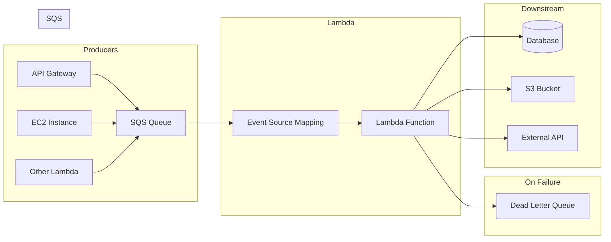
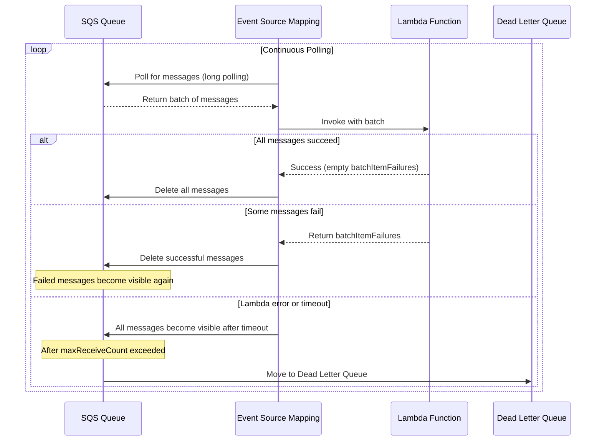
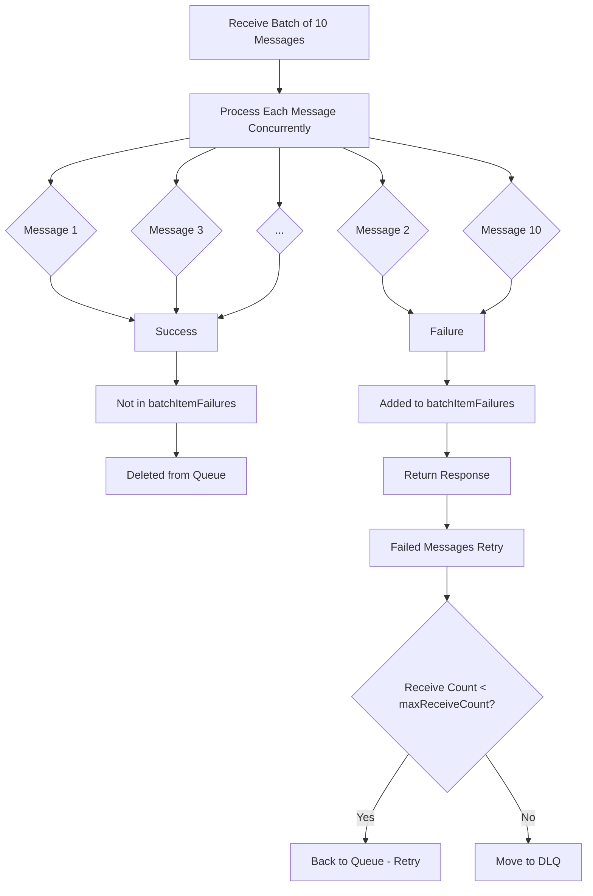
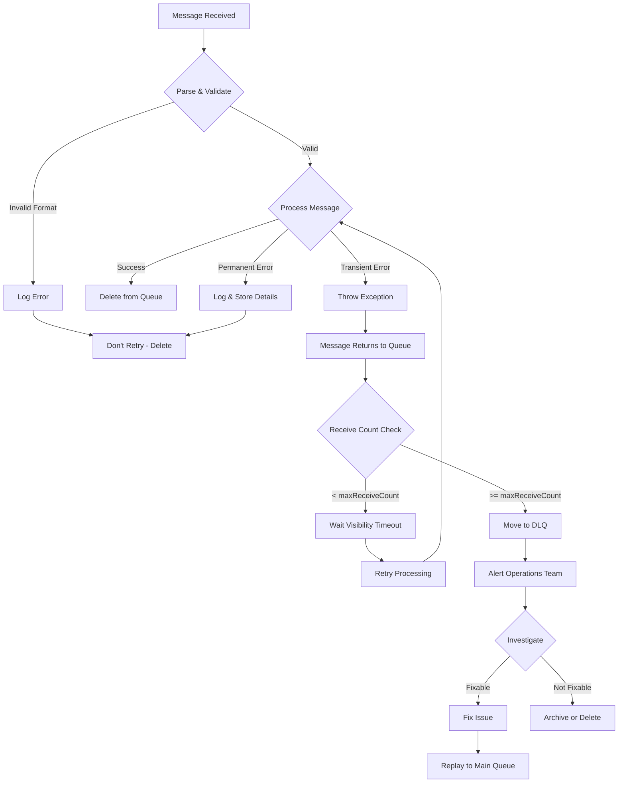
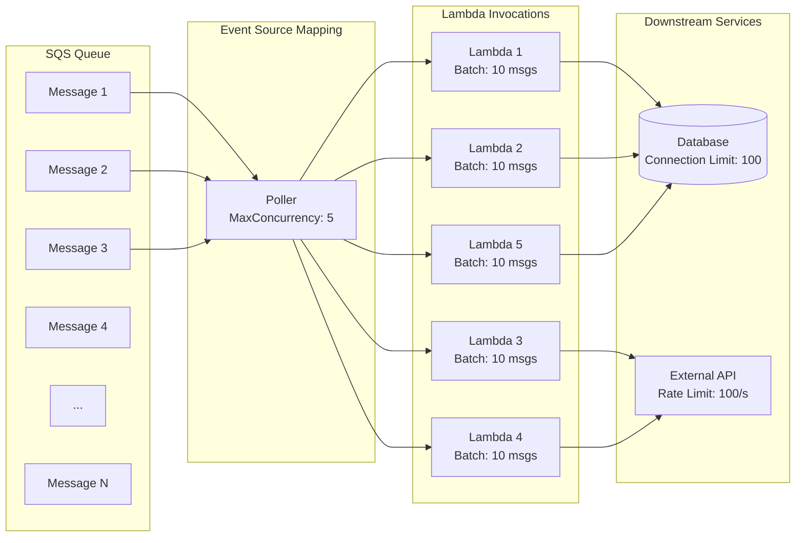
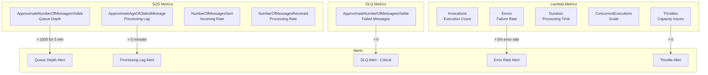

# How to Use SQS with Lambda

Author: [nawazdhandala](https://www.github.com/nawazdhandala)

Tags: AWS, SQS, Lambda, Serverless, Event-Driven Architecture, Message Queues, Node.js, Python

Description: A comprehensive guide to integrating Amazon SQS with AWS Lambda, covering event source mapping, batch processing, error handling with dead-letter queues, and concurrency control for building reliable, scalable serverless applications.

---

> "Message queues are the backbone of resilient distributed systems. SQS with Lambda transforms asynchronous processing from a challenge into an elegantly simple pattern."

Amazon Simple Queue Service (SQS) paired with AWS Lambda creates a powerful, serverless event-driven architecture. Messages flow into SQS, Lambda automatically polls and processes them, and you pay only for what you use. No servers to manage, no polling infrastructure to maintain.

This guide walks through everything you need to know: from basic setup to production-ready patterns including batch processing, error handling, dead-letter queues, and concurrency control.

---

## Table of Contents

1. Architecture Overview
2. Creating an SQS Queue
3. Event Source Mapping
4. Lambda Handler Basics
5. Batch Processing
6. Error Handling and DLQ
7. Concurrency Control
8. Monitoring with OneUptime
9. Best Practices

---

## Architecture Overview

Before diving into code, let's understand how SQS and Lambda work together.



Key components:

| Component | Role |
|-----------|------|
| SQS Queue | Buffer that holds messages until processed |
| Event Source Mapping | AWS-managed poller that invokes Lambda with batches |
| Lambda Function | Your code that processes each message |
| Dead Letter Queue | Catches messages that fail repeatedly |

The event source mapping is critical - it's the bridge between SQS and Lambda. AWS manages the polling, batching, and retry logic for you.

---

## Creating an SQS Queue

First, create your SQS queue. You can use Standard or FIFO queues with Lambda.

### Using AWS CLI

```bash
# Create a standard queue with recommended settings for Lambda integration
# VisibilityTimeout should be 6x your Lambda timeout to prevent duplicate processing
aws sqs create-queue \
    --queue-name order-processing-queue \
    --attributes '{
        "VisibilityTimeout": "900",
        "MessageRetentionPeriod": "1209600",
        "ReceiveMessageWaitTimeSeconds": "20"
    }'

# Create a dead-letter queue for failed messages
# Messages that exceed maxReceiveCount will be moved here
aws sqs create-queue \
    --queue-name order-processing-dlq \
    --attributes '{
        "MessageRetentionPeriod": "1209600"
    }'
```

### Using Terraform

```hcl
# main.tf - SQS Queue with Dead Letter Queue configuration

# Dead Letter Queue - catches messages that fail processing
resource "aws_sqs_queue" "order_dlq" {
  name                      = "order-processing-dlq"
  message_retention_seconds = 1209600  # 14 days retention for investigation

  tags = {
    Environment = "production"
    Purpose     = "dead-letter-queue"
  }
}

# Main processing queue
resource "aws_sqs_queue" "order_queue" {
  name                       = "order-processing-queue"
  visibility_timeout_seconds = 900  # 6x Lambda timeout (recommended)
  message_retention_seconds  = 1209600  # 14 days
  receive_wait_time_seconds  = 20  # Long polling enabled

  # Configure dead-letter queue redrive policy
  # After maxReceiveCount failures, messages move to DLQ
  redrive_policy = jsonencode({
    deadLetterTargetArn = aws_sqs_queue.order_dlq.arn
    maxReceiveCount     = 3  # Send to DLQ after 3 failures
  })

  tags = {
    Environment = "production"
    Purpose     = "order-processing"
  }
}

# Output queue URLs for reference
output "queue_url" {
  value = aws_sqs_queue.order_queue.url
}

output "dlq_url" {
  value = aws_sqs_queue.order_dlq.url
}
```

### Important Queue Settings

| Setting | Recommendation | Why |
|---------|---------------|-----|
| VisibilityTimeout | 6x Lambda timeout | Prevents duplicate processing during retries |
| MessageRetentionPeriod | 14 days (max) | Gives time to investigate failed messages |
| ReceiveMessageWaitTimeSeconds | 20 seconds | Enables long polling, reduces costs |
| maxReceiveCount | 3-5 | Balance between retries and DLQ routing |

---

## Event Source Mapping

The event source mapping connects SQS to Lambda. It handles polling, batching, and invocation automatically.

### Using AWS CLI

```bash
# Create event source mapping between SQS and Lambda
# This tells AWS to poll the queue and invoke your function
aws lambda create-event-source-mapping \
    --function-name order-processor \
    --event-source-arn arn:aws:sqs:us-east-1:123456789012:order-processing-queue \
    --batch-size 10 \
    --maximum-batching-window-in-seconds 5 \
    --function-response-types ReportBatchItemFailures
```

### Using Terraform

```hcl
# lambda.tf - Lambda function and event source mapping

# IAM role for Lambda execution
resource "aws_iam_role" "lambda_role" {
  name = "order-processor-role"

  assume_role_policy = jsonencode({
    Version = "2012-10-17"
    Statement = [{
      Action = "sts:AssumeRole"
      Effect = "Allow"
      Principal = {
        Service = "lambda.amazonaws.com"
      }
    }]
  })
}

# Policy allowing Lambda to read from SQS and write logs
resource "aws_iam_role_policy" "sqs_policy" {
  name = "sqs-access"
  role = aws_iam_role.lambda_role.id

  policy = jsonencode({
    Version = "2012-10-17"
    Statement = [
      {
        Effect = "Allow"
        Action = [
          "sqs:ReceiveMessage",
          "sqs:DeleteMessage",
          "sqs:GetQueueAttributes"
        ]
        Resource = aws_sqs_queue.order_queue.arn
      },
      {
        Effect = "Allow"
        Action = [
          "logs:CreateLogGroup",
          "logs:CreateLogStream",
          "logs:PutLogEvents"
        ]
        Resource = "arn:aws:logs:*:*:*"
      }
    ]
  })
}

# Lambda function definition
resource "aws_lambda_function" "order_processor" {
  filename         = "order_processor.zip"
  function_name    = "order-processor"
  role            = aws_iam_role.lambda_role.arn
  handler         = "index.handler"
  runtime         = "nodejs20.x"
  timeout         = 150  # Visibility timeout should be 6x this value
  memory_size     = 256

  environment {
    variables = {
      LOG_LEVEL = "INFO"
    }
  }
}

# Event source mapping - the bridge between SQS and Lambda
resource "aws_lambda_event_source_mapping" "sqs_trigger" {
  event_source_arn = aws_sqs_queue.order_queue.arn
  function_name    = aws_lambda_function.order_processor.arn

  # Batch configuration - tune based on your workload
  batch_size                         = 10   # Max messages per invocation
  maximum_batching_window_in_seconds = 5    # Wait up to 5s to fill batch

  # Enable partial batch failure reporting
  # This allows successful messages to be deleted while failed ones retry
  function_response_types = ["ReportBatchItemFailures"]

  # Scaling configuration - protect downstream services
  scaling_config {
    maximum_concurrency = 10  # Limit concurrent Lambda invocations
  }
}
```

### Event Source Mapping Flow



---

## Lambda Handler Basics

Here's how to write a Lambda function that processes SQS messages.

### Node.js Handler

```javascript
// index.js - Basic SQS Lambda handler in Node.js

/**
 * Process SQS messages from the order queue.
 * Each record in event.Records is an individual SQS message.
 *
 * @param {Object} event - SQS event containing Records array
 * @param {Object} context - Lambda context with runtime information
 */
export const handler = async (event, context) => {
    console.log(`Processing ${event.Records.length} messages`);

    // Process each message in the batch
    for (const record of event.Records) {
        // Parse the message body - SQS always delivers as string
        const message = JSON.parse(record.body);

        // Extract useful metadata for logging and debugging
        const messageId = record.messageId;
        const receiveCount = record.attributes.ApproximateReceiveCount;

        console.log(`Processing message ${messageId}, attempt ${receiveCount}`);

        try {
            // Your business logic here
            await processOrder(message);

            console.log(`Successfully processed message ${messageId}`);
        } catch (error) {
            console.error(`Failed to process message ${messageId}:`, error);
            // Re-throw to let Lambda handle the retry
            throw error;
        }
    }

    // Return nothing = all messages processed successfully
    // AWS will delete them from the queue
    return { statusCode: 200 };
};

/**
 * Example business logic for processing an order.
 * In production, this might validate, persist, and trigger downstream actions.
 */
async function processOrder(order) {
    // Validate the order structure
    if (!order.orderId || !order.items) {
        throw new Error('Invalid order format: missing orderId or items');
    }

    // Process the order (e.g., save to database, call APIs)
    console.log(`Processing order ${order.orderId} with ${order.items.length} items`);

    // Simulate async work
    await new Promise(resolve => setTimeout(resolve, 100));

    return { success: true, orderId: order.orderId };
}
```

### Python Handler

```python
# handler.py - Basic SQS Lambda handler in Python

import json
import logging

# Configure structured logging
logger = logging.getLogger()
logger.setLevel(logging.INFO)


def handler(event, context):
    """
    Process SQS messages from the order queue.

    Args:
        event: SQS event containing Records list
        context: Lambda context object with runtime info

    Returns:
        dict: Response indicating processing status
    """
    logger.info(f"Processing {len(event['Records'])} messages")

    for record in event['Records']:
        # Parse the message body from JSON string
        message = json.loads(record['body'])

        # Extract metadata for debugging
        message_id = record['messageId']
        receive_count = record['attributes']['ApproximateReceiveCount']

        logger.info(f"Processing message {message_id}, attempt {receive_count}")

        try:
            # Your business logic here
            process_order(message)
            logger.info(f"Successfully processed message {message_id}")

        except Exception as e:
            logger.error(f"Failed to process message {message_id}: {str(e)}")
            # Re-raise to trigger retry mechanism
            raise

    return {'statusCode': 200}


def process_order(order: dict) -> dict:
    """
    Example business logic for processing an order.

    Args:
        order: Order data dictionary from SQS message

    Returns:
        dict: Processing result

    Raises:
        ValueError: If order structure is invalid
    """
    # Validate the order structure
    if 'orderId' not in order or 'items' not in order:
        raise ValueError('Invalid order format: missing orderId or items')

    logger.info(f"Processing order {order['orderId']} with {len(order['items'])} items")

    # Your processing logic here
    # e.g., save to DynamoDB, call external APIs, etc.

    return {'success': True, 'orderId': order['orderId']}
```

### SQS Event Structure

Understanding the event structure is crucial for proper message handling:

```json
{
  "Records": [
    {
      "messageId": "059f36b4-87a3-44ab-83d2-661975830a7d",
      "receiptHandle": "AQEBwJnKyrHigUMZj6rYigCgxlaS3SLy...",
      "body": "{\"orderId\": \"ORD-123\", \"items\": [...]}",
      "attributes": {
        "ApproximateReceiveCount": "1",
        "SentTimestamp": "1706367876543",
        "SenderId": "AIDAIENQZJOLO23YVJ4VO",
        "ApproximateFirstReceiveTimestamp": "1706367876544"
      },
      "messageAttributes": {},
      "md5OfBody": "e4e68fb7bd0e697a0ae8f1bb342846b3",
      "eventSource": "aws:sqs",
      "eventSourceARN": "arn:aws:sqs:us-east-1:123456789012:order-queue",
      "awsRegion": "us-east-1"
    }
  ]
}
```

---

## Batch Processing

Processing messages in batches improves efficiency but requires careful handling of partial failures.

### Batch Processing with Partial Failure Reporting

```javascript
// index.js - Batch processing with partial failure reporting

/**
 * Process SQS messages with partial batch failure reporting.
 * This allows successfully processed messages to be deleted while
 * failed messages are returned to the queue for retry.
 */
export const handler = async (event, context) => {
    console.log(`Processing batch of ${event.Records.length} messages`);

    // Track failed message IDs for partial batch failure reporting
    const batchItemFailures = [];

    // Process messages concurrently for better performance
    const results = await Promise.allSettled(
        event.Records.map(async (record) => {
            const messageId = record.messageId;

            try {
                const message = JSON.parse(record.body);
                await processMessage(message, record);
                console.log(`Success: ${messageId}`);
                return { messageId, success: true };
            } catch (error) {
                console.error(`Failed: ${messageId}`, error.message);
                // Add to failures list - this message will be retried
                batchItemFailures.push({
                    itemIdentifier: messageId
                });
                return { messageId, success: false, error: error.message };
            }
        })
    );

    // Log batch results summary
    const succeeded = results.filter(r => r.value?.success).length;
    const failed = batchItemFailures.length;
    console.log(`Batch complete: ${succeeded} succeeded, ${failed} failed`);

    // Return failures so AWS knows which messages to retry
    // Messages NOT in this list will be deleted from the queue
    return {
        batchItemFailures
    };
};

/**
 * Process a single message with idempotency checks.
 * Idempotency ensures safe retry behavior.
 */
async function processMessage(message, record) {
    const messageId = record.messageId;
    const receiveCount = parseInt(record.attributes.ApproximateReceiveCount);

    // Log retry attempts for debugging
    if (receiveCount > 1) {
        console.log(`Retry attempt ${receiveCount} for message ${messageId}`);
    }

    // Validate message format early
    if (!message.orderId) {
        throw new Error('Missing orderId in message');
    }

    // Implement idempotency - check if already processed
    const alreadyProcessed = await checkIdempotency(messageId);
    if (alreadyProcessed) {
        console.log(`Message ${messageId} already processed, skipping`);
        return;
    }

    // Process the message
    await doBusinessLogic(message);

    // Mark as processed for idempotency
    await markProcessed(messageId);
}

/**
 * Check if message was already processed.
 * Use DynamoDB or Redis for production.
 */
async function checkIdempotency(messageId) {
    // In production: check DynamoDB/Redis for processed message IDs
    // Return true if message was already processed
    return false;
}

/**
 * Mark message as processed with TTL.
 */
async function markProcessed(messageId) {
    // Store the message ID with TTL matching your retention period
    // This prevents reprocessing if the same message is delivered again
}

async function doBusinessLogic(message) {
    console.log(`Processing order: ${message.orderId}`);
    // Your actual business logic here
}
```

### Batch Processing Flow



### Python Batch Processing

```python
# handler.py - Batch processing with partial failures in Python

import json
import logging
from concurrent.futures import ThreadPoolExecutor, as_completed

logger = logging.getLogger()
logger.setLevel(logging.INFO)


def handler(event, context):
    """
    Process SQS batch with partial failure reporting.
    Successfully processed messages are deleted; failed ones retry.
    """
    records = event['Records']
    logger.info(f"Processing batch of {len(records)} messages")

    batch_item_failures = []

    # Process messages concurrently using ThreadPoolExecutor
    with ThreadPoolExecutor(max_workers=10) as executor:
        # Submit all tasks
        future_to_record = {
            executor.submit(process_record, record): record
            for record in records
        }

        # Collect results as they complete
        for future in as_completed(future_to_record):
            record = future_to_record[future]
            message_id = record['messageId']

            try:
                future.result()
                logger.info(f"Success: {message_id}")
            except Exception as e:
                logger.error(f"Failed: {message_id} - {str(e)}")
                batch_item_failures.append({
                    'itemIdentifier': message_id
                })

    succeeded = len(records) - len(batch_item_failures)
    logger.info(f"Batch complete: {succeeded} succeeded, {len(batch_item_failures)} failed")

    # Return failures for retry
    return {'batchItemFailures': batch_item_failures}


def process_record(record: dict) -> None:
    """
    Process a single SQS record.
    Raises exception on failure for retry handling.
    """
    message_id = record['messageId']
    receive_count = int(record['attributes']['ApproximateReceiveCount'])

    if receive_count > 1:
        logger.warning(f"Retry attempt {receive_count} for {message_id}")

    # Parse and validate
    message = json.loads(record['body'])

    if 'orderId' not in message:
        raise ValueError('Missing orderId in message')

    # Process the message
    process_order(message)


def process_order(order: dict) -> None:
    """Your business logic here."""
    logger.info(f"Processing order: {order['orderId']}")
    # Implement actual processing
```

---

## Error Handling and DLQ

Proper error handling ensures messages aren't lost and provides visibility into failures.

### Error Handling Strategy



### Implementing Error Classification

```javascript
// errors.js - Custom error classes for classification

/**
 * Transient errors - will be retried automatically.
 * Examples: network timeouts, rate limits, service unavailable
 */
export class TransientError extends Error {
    constructor(message, cause) {
        super(message);
        this.name = 'TransientError';
        this.retryable = true;
        this.cause = cause;
    }
}

/**
 * Permanent errors - should not be retried.
 * Examples: invalid data, business rule violations, missing required fields
 */
export class PermanentError extends Error {
    constructor(message, cause) {
        super(message);
        this.name = 'PermanentError';
        this.retryable = false;
        this.cause = cause;
    }
}
```

```javascript
// handler.js - Using error classification

import { TransientError, PermanentError } from './errors.js';

export const handler = async (event) => {
    const batchItemFailures = [];

    for (const record of event.Records) {
        const messageId = record.messageId;
        const receiveCount = parseInt(record.attributes.ApproximateReceiveCount);

        try {
            const message = JSON.parse(record.body);
            await processWithErrorClassification(message, receiveCount);

        } catch (error) {
            if (error instanceof PermanentError) {
                // Don't retry - log and let message be deleted
                console.error(`Permanent failure for ${messageId}:`, error.message);

                // Optionally send to a "poison pill" queue for analysis
                await sendToPoisonQueue(record, error);

                // Don't add to batchItemFailures - message will be deleted

            } else if (error instanceof TransientError) {
                // Allow retry by adding to failures
                console.warn(`Transient failure for ${messageId}:`, error.message);
                batchItemFailures.push({ itemIdentifier: messageId });

            } else {
                // Unknown error - treat as transient, allow retry
                console.error(`Unknown error for ${messageId}:`, error);
                batchItemFailures.push({ itemIdentifier: messageId });
            }
        }
    }

    return { batchItemFailures };
};

async function processWithErrorClassification(message, receiveCount) {
    // Validate message structure - permanent failure if invalid
    if (!message.orderId) {
        throw new PermanentError('Invalid message: missing orderId');
    }

    if (!message.items || message.items.length === 0) {
        throw new PermanentError('Invalid message: no items in order');
    }

    try {
        // Call external service
        await callExternalAPI(message);
    } catch (error) {
        // Classify based on error type
        if (error.code === 'ETIMEDOUT' || error.statusCode === 503) {
            throw new TransientError('Service temporarily unavailable', error);
        }
        if (error.statusCode === 429) {
            throw new TransientError('Rate limited, will retry', error);
        }
        if (error.statusCode === 400) {
            throw new PermanentError('Invalid request to external service', error);
        }
        throw error;
    }
}

async function sendToPoisonQueue(record, error) {
    // Send to a separate queue for manual investigation
    // Include original message and error details
}

async function callExternalAPI(message) {
    // Your external API call
}
```

### DLQ Processing Lambda

Create a separate Lambda to monitor and process DLQ messages:

```javascript
// dlq-processor.js - Process dead letter queue messages

import { SQSClient, SendMessageCommand } from '@aws-sdk/client-sqs';

const sqs = new SQSClient({});
const MAIN_QUEUE_URL = process.env.MAIN_QUEUE_URL;

/**
 * Process DLQ messages - analyze, alert, and optionally replay.
 * This function handles messages that failed all retry attempts.
 */
export const handler = async (event) => {
    console.log(`Processing ${event.Records.length} DLQ messages`);

    for (const record of event.Records) {
        const messageId = record.messageId;
        const originalMessage = JSON.parse(record.body);
        const receiveCount = record.attributes.ApproximateReceiveCount;

        console.log(`Analyzing DLQ message ${messageId}`);
        console.log(`Original receive count: ${receiveCount}`);
        console.log(`Message content:`, JSON.stringify(originalMessage, null, 2));

        // Analyze the failure and determine if it's fixable
        const analysis = analyzeFailure(originalMessage, record);

        if (analysis.canReplay) {
            // Fix the message if needed and replay
            const fixedMessage = analysis.fixedMessage || originalMessage;
            await replayMessage(fixedMessage, messageId);
            console.log(`Replayed message ${messageId}: ${analysis.reason}`);
        } else {
            // Log for manual investigation and send alert
            console.error(`Cannot auto-fix message ${messageId}:`, analysis.reason);
            await sendAlert(messageId, originalMessage, analysis);
        }
    }

    return { statusCode: 200 };
};

/**
 * Analyze why the message failed and if it can be auto-fixed.
 */
function analyzeFailure(message, record) {
    // Check if it's a data format issue we can fix
    if (!message.orderId && message.order_id) {
        return {
            canReplay: true,
            fixedMessage: { ...message, orderId: message.order_id },
            reason: 'Fixed field name: order_id -> orderId'
        };
    }

    // Check if it was a transient issue that might succeed now
    const sentTimestamp = parseInt(record.attributes.SentTimestamp);
    const ageInHours = (Date.now() - sentTimestamp) / (1000 * 60 * 60);

    if (ageInHours < 24) {
        return {
            canReplay: true,
            reason: 'Recent message, attempting replay after transient failure'
        };
    }

    return {
        canReplay: false,
        reason: 'Message too old or has unfixable data format'
    };
}

/**
 * Replay a message back to the main queue.
 */
async function replayMessage(message, originalMessageId) {
    await sqs.send(new SendMessageCommand({
        QueueUrl: MAIN_QUEUE_URL,
        MessageBody: JSON.stringify(message),
        MessageAttributes: {
            'ReplayedFrom': {
                DataType: 'String',
                StringValue: originalMessageId
            },
            'ReplayedAt': {
                DataType: 'String',
                StringValue: new Date().toISOString()
            }
        }
    }));
}

/**
 * Send alert to operations team for manual investigation.
 */
async function sendAlert(messageId, message, analysis) {
    // Send to your alerting system (OneUptime, PagerDuty, Slack, etc.)
    console.error('ALERT: DLQ message requires manual intervention', {
        messageId,
        message,
        analysis,
        action: 'Investigate root cause and manually replay or discard'
    });
}
```

---

## Concurrency Control

Managing concurrency prevents overwhelming downstream systems and controls costs.

### Lambda Concurrency Settings



### Configuring Concurrency with Terraform

```hcl
# terraform - Concurrency control configuration

# Event source mapping with maximum concurrency
resource "aws_lambda_event_source_mapping" "sqs_trigger" {
  event_source_arn = aws_sqs_queue.order_queue.arn
  function_name    = aws_lambda_function.order_processor.arn

  # Batch configuration
  batch_size                         = 10
  maximum_batching_window_in_seconds = 5

  function_response_types = ["ReportBatchItemFailures"]

  # CONCURRENCY CONTROL
  # Limits how many Lambda instances can run simultaneously for this trigger
  # This protects downstream services from being overwhelmed
  scaling_config {
    maximum_concurrency = 10  # Max 10 concurrent invocations
  }
}

# Additionally, set reserved concurrency on the Lambda function
# This guarantees capacity and sets an upper limit
resource "aws_lambda_function" "order_processor" {
  function_name = "order-processor"
  # ... other config ...

  # Reserve capacity and limit maximum concurrent executions
  # Set slightly higher than ESM limit for headroom
  reserved_concurrent_executions = 15
}
```

### Rate Limiting for Downstream Services

```javascript
// rate-limiter.js - Protect downstream services from overload

/**
 * Simple token bucket rate limiter for downstream API calls.
 * Prevents overwhelming external services during high throughput.
 */
class RateLimiter {
    constructor(maxTokens, refillRate) {
        this.maxTokens = maxTokens;      // Maximum burst capacity
        this.tokens = maxTokens;          // Current available tokens
        this.refillRate = refillRate;     // Tokens added per second
        this.lastRefill = Date.now();
    }

    async acquire() {
        this.refill();

        if (this.tokens > 0) {
            this.tokens--;
            return true;
        }

        // Wait for next token to become available
        const waitTime = (1 / this.refillRate) * 1000;
        await new Promise(resolve => setTimeout(resolve, waitTime));
        return this.acquire();
    }

    refill() {
        const now = Date.now();
        const elapsed = (now - this.lastRefill) / 1000;
        this.tokens = Math.min(
            this.maxTokens,
            this.tokens + elapsed * this.refillRate
        );
        this.lastRefill = now;
    }
}

// Create rate limiter: 100 burst capacity, 50 requests/second sustained
const rateLimiter = new RateLimiter(100, 50);

export const handler = async (event) => {
    const batchItemFailures = [];

    for (const record of event.Records) {
        try {
            // Wait for rate limit token before calling downstream
            await rateLimiter.acquire();

            const message = JSON.parse(record.body);
            await processMessage(message);

        } catch (error) {
            console.error(`Failed ${record.messageId}:`, error);
            batchItemFailures.push({ itemIdentifier: record.messageId });
        }
    }

    return { batchItemFailures };
};
```

### Concurrency Trade-offs

| Setting | Low Value | High Value |
|---------|-----------|------------|
| batch_size | Lower latency per message | Higher throughput, fewer invocations |
| maximum_batching_window | Lower latency | Larger batches, better cost efficiency |
| maximum_concurrency | Protects downstream, slower queue drain | Faster processing, more downstream load |
| reserved_concurrent_executions | Protects other Lambda functions | Dedicated capacity for this workload |

---

## Monitoring with OneUptime

Effective monitoring is essential for production SQS-Lambda architectures. [OneUptime](https://oneuptime.com) provides comprehensive observability for your serverless applications.

### Key Metrics to Monitor



### OpenTelemetry Instrumentation

```javascript
// telemetry.js - OpenTelemetry setup for SQS Lambda

import { NodeSDK } from '@opentelemetry/sdk-node';
import { OTLPTraceExporter } from '@opentelemetry/exporter-trace-otlp-http';
import { OTLPMetricExporter } from '@opentelemetry/exporter-metrics-otlp-http';
import { PeriodicExportingMetricReader } from '@opentelemetry/sdk-metrics';
import { Resource } from '@opentelemetry/resources';
import { SemanticResourceAttributes } from '@opentelemetry/semantic-conventions';
import { AwsLambdaInstrumentation } from '@opentelemetry/instrumentation-aws-lambda';
import { AwsInstrumentation } from '@opentelemetry/instrumentation-aws-sdk';

// Configure OTLP exporter to send telemetry to OneUptime
const traceExporter = new OTLPTraceExporter({
    url: process.env.ONEUPTIME_OTLP_ENDPOINT || 'https://otlp.oneuptime.com/v1/traces',
    headers: {
        'x-oneuptime-token': process.env.ONEUPTIME_OTLP_TOKEN
    }
});

const metricExporter = new OTLPMetricExporter({
    url: process.env.ONEUPTIME_OTLP_ENDPOINT?.replace('/traces', '/metrics')
        || 'https://otlp.oneuptime.com/v1/metrics',
    headers: {
        'x-oneuptime-token': process.env.ONEUPTIME_OTLP_TOKEN
    }
});

export const sdk = new NodeSDK({
    resource: new Resource({
        [SemanticResourceAttributes.SERVICE_NAME]: 'order-processor',
        [SemanticResourceAttributes.SERVICE_VERSION]: '1.0.0',
        [SemanticResourceAttributes.DEPLOYMENT_ENVIRONMENT]: process.env.STAGE || 'dev'
    }),
    traceExporter,
    metricReader: new PeriodicExportingMetricReader({
        exporter: metricExporter,
        exportIntervalMillis: 10000
    }),
    instrumentations: [
        new AwsLambdaInstrumentation(),
        new AwsInstrumentation()
    ]
});

sdk.start();

// Ensure telemetry is flushed before Lambda freezes
export async function flushTelemetry() {
    await sdk.shutdown();
}
```

### Custom Business Metrics

```javascript
// metrics.js - Custom business metrics for SQS processing

import { metrics } from '@opentelemetry/api';

const meter = metrics.getMeter('order-processor');

// Counter for processed messages
const messagesProcessed = meter.createCounter('sqs.messages.processed', {
    description: 'Number of SQS messages successfully processed'
});

// Counter for failed messages
const messagesFailed = meter.createCounter('sqs.messages.failed', {
    description: 'Number of SQS messages that failed processing'
});

// Histogram for processing duration
const processingDuration = meter.createHistogram('sqs.message.duration_ms', {
    description: 'Time to process a single message in milliseconds',
    unit: 'ms'
});

// Histogram for batch sizes
const batchSize = meter.createHistogram('sqs.batch.size', {
    description: 'Number of messages in each batch'
});

export { messagesProcessed, messagesFailed, processingDuration, batchSize };
```

```javascript
// handler.js - Recording custom metrics

import { messagesProcessed, messagesFailed, processingDuration, batchSize } from './metrics.js';
import { flushTelemetry } from './telemetry.js';

export const handler = async (event, context) => {
    // Record batch size for throughput analysis
    batchSize.record(event.Records.length, {
        'queue.name': 'order-processing-queue'
    });

    const batchItemFailures = [];

    for (const record of event.Records) {
        const startTime = Date.now();

        try {
            const message = JSON.parse(record.body);
            await processMessage(message);

            // Record success metrics with dimensions
            messagesProcessed.add(1, {
                'queue.name': 'order-processing-queue',
                'message.type': message.type || 'order'
            });

        } catch (error) {
            // Record failure metrics with error classification
            messagesFailed.add(1, {
                'queue.name': 'order-processing-queue',
                'error.type': error.name || 'UnknownError'
            });
            batchItemFailures.push({ itemIdentifier: record.messageId });

        } finally {
            // Record processing duration for latency analysis
            processingDuration.record(Date.now() - startTime, {
                'queue.name': 'order-processing-queue'
            });
        }
    }

    // Flush telemetry before Lambda freezes
    await flushTelemetry();

    return { batchItemFailures };
};
```

---

## Best Practices

### Summary of Key Recommendations

| Category | Best Practice | Implementation |
|----------|---------------|----------------|
| Queue Config | Visibility timeout = 6x Lambda timeout | Prevents duplicate processing |
| Queue Config | Enable long polling (20 seconds) | Reduces API calls and costs |
| Queue Config | Configure DLQ with maxReceiveCount 3-5 | Captures failed messages |
| Lambda | Enable partial batch failure reporting | `function_response_types = ["ReportBatchItemFailures"]` |
| Lambda | Implement idempotent processing | Store processed message IDs |
| Lambda | Classify errors (transient vs permanent) | Retry only retryable errors |
| Concurrency | Set maximum_concurrency on ESM | Protect downstream services |
| Concurrency | Use rate limiting in code | Prevent API overload |
| Monitoring | Alert on DLQ depth > 0 | Immediate notification of failures |
| Monitoring | Alert on queue age > 5 minutes | Detect processing lag |
| Monitoring | Track error rates and latency | Enable proactive debugging |

### Production Checklist

```markdown
## SQS Configuration
- [ ] Visibility timeout = 6x Lambda timeout
- [ ] Long polling enabled (20 seconds)
- [ ] DLQ configured with redrive policy
- [ ] Message retention period set appropriately
- [ ] Encryption at rest enabled (if required)

## Lambda Configuration
- [ ] Appropriate memory allocation for workload
- [ ] Timeout set with margin (< visibility timeout / 6)
- [ ] Partial batch failure reporting enabled
- [ ] Error classification implemented
- [ ] Idempotency handling in place

## Event Source Mapping
- [ ] Batch size tuned for workload characteristics
- [ ] Batching window configured for latency requirements
- [ ] Maximum concurrency set to protect downstream
- [ ] ReportBatchItemFailures in function_response_types

## Monitoring & Alerting
- [ ] CloudWatch alarms for queue depth
- [ ] DLQ monitoring with critical alerts
- [ ] Processing lag (oldest message age) monitoring
- [ ] OpenTelemetry traces configured
- [ ] Custom business metrics implemented

## Error Handling
- [ ] DLQ processor Lambda deployed
- [ ] Alerting on DLQ messages configured
- [ ] Message replay mechanism tested
- [ ] Poison pill handling implemented
```

---

## Conclusion

SQS with Lambda provides a robust, scalable foundation for event-driven architectures. The key to success lies in proper configuration:

1. **Event Source Mapping** - The bridge that handles polling and batching automatically
2. **Batch Processing** - Use partial failure reporting for efficiency and reliability
3. **Error Handling** - Classify errors and route to DLQ appropriately
4. **Concurrency Control** - Protect downstream systems and manage costs
5. **Monitoring** - Track queue depth, processing lag, and error rates

By following these patterns, you can build reliable message processing pipelines that scale automatically and handle failures gracefully.

---

*Need comprehensive monitoring for your SQS-Lambda architecture? [OneUptime](https://oneuptime.com) provides end-to-end observability with traces, metrics, and logs - all correlated for faster debugging. Set up alerting for your queues, Lambda functions, and downstream services in one unified platform.*
