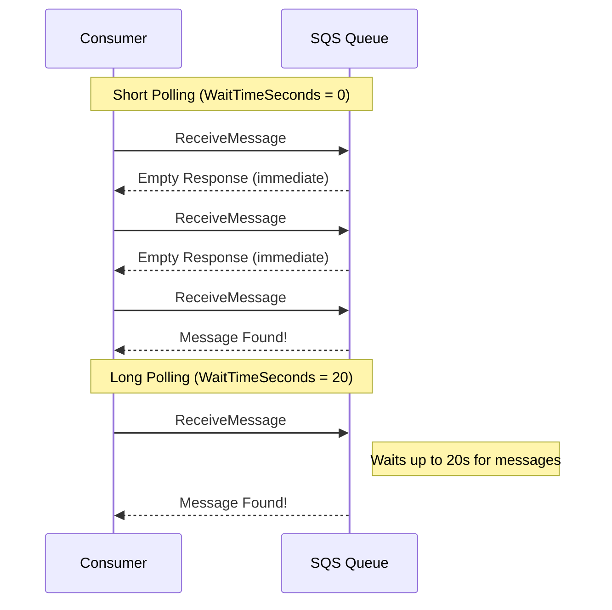
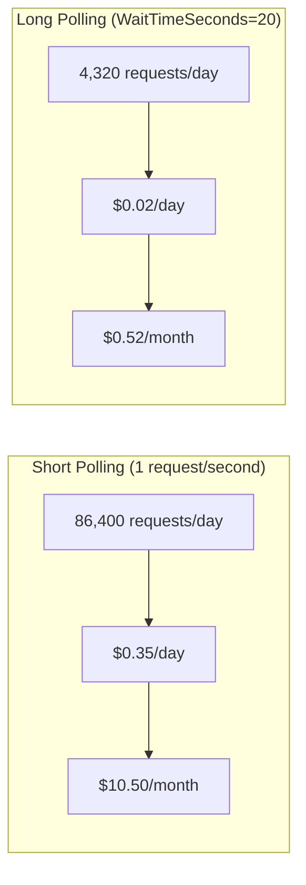
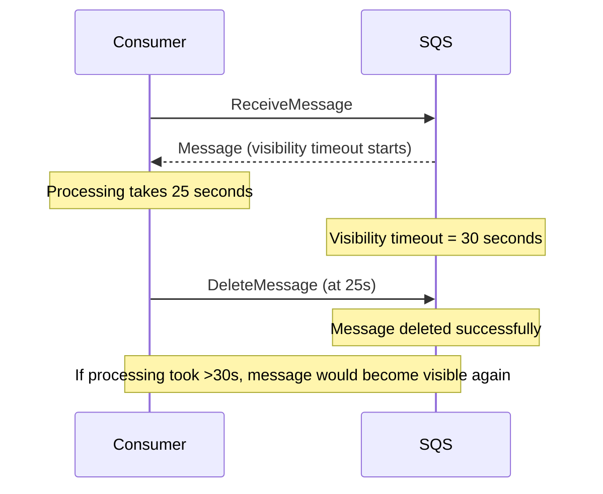
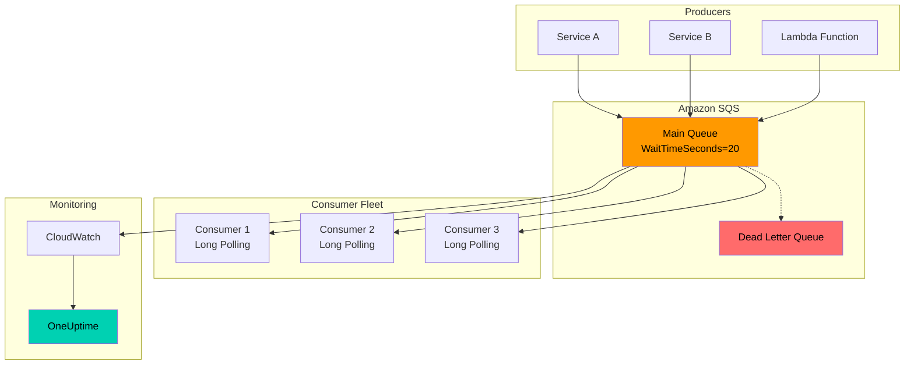

# How to Implement Long Polling in SQS

By [Nawaz Dhandala](https://github.com/nawazdhandala)

Tags: AWS, SQS, Long Polling, Message Queue, Cost Optimization, Distributed Systems, Cloud Architecture

Description: A comprehensive guide to implementing long polling in Amazon SQS to reduce costs, decrease latency, and improve message processing efficiency in your distributed systems.

---

> "The best request is the one you never have to make." - AWS Well-Architected Framework

Amazon Simple Queue Service (SQS) is a fully managed message queuing service that enables you to decouple and scale microservices, distributed systems, and serverless applications. One of the most impactful optimizations you can make when working with SQS is implementing long polling. This guide covers everything you need to know about long polling, from the basics to production-ready implementations.

---

## Understanding Short Polling vs Long Polling

Before diving into implementation, it is essential to understand the fundamental difference between short polling and long polling in SQS.

### Short Polling (Default Behavior)

With short polling, SQS samples only a subset of its servers (based on a weighted random distribution) and returns messages from those servers immediately. If no messages are available, the response is returned immediately with an empty result.

### Long Polling

Long polling queries all SQS servers and waits until a message arrives in the queue or the long poll timeout expires. This approach significantly reduces the number of empty responses and API calls.



---

## Key Benefits of Long Polling

| Aspect | Short Polling | Long Polling |
|--------|---------------|--------------|
| Empty Responses | High frequency | Virtually eliminated |
| API Costs | Higher (more requests) | Lower (fewer requests) |
| Latency | Variable | Consistent |
| CPU Usage | Higher (constant polling) | Lower (waiting) |
| Server Coverage | Subset of servers | All servers |

---

## Configuring WaitTimeSeconds

The `WaitTimeSeconds` parameter is the key to enabling long polling. It determines how long (in seconds) a ReceiveMessage call will wait for a message to arrive before returning.

### Valid Values

- **0**: Short polling (default)
- **1-20**: Long polling (20 seconds is the maximum)

### Queue-Level Configuration (Recommended)

Setting `ReceiveMessageWaitTimeSeconds` at the queue level applies long polling to all consumers by default.

```typescript
// AWS SDK v3 - Creating a queue with long polling enabled
import { SQSClient, CreateQueueCommand } from "@aws-sdk/client-sqs";

const sqsClient = new SQSClient({ region: "us-east-1" });

async function createQueueWithLongPolling(queueName: string): Promise<string> {
  const command = new CreateQueueCommand({
    QueueName: queueName,
    Attributes: {
      // Enable long polling at the queue level
      // All consumers will use 20-second long polling by default
      ReceiveMessageWaitTimeSeconds: "20",

      // Other recommended settings
      VisibilityTimeout: "30",
      MessageRetentionPeriod: "345600", // 4 days
    },
  });

  const response = await sqsClient.send(command);
  console.log(`Queue created: ${response.QueueUrl}`);
  return response.QueueUrl!;
}
```

### Request-Level Configuration

You can also specify `WaitTimeSeconds` on individual ReceiveMessage requests, which overrides the queue-level setting.

```typescript
// AWS SDK v3 - Receiving messages with long polling
import { SQSClient, ReceiveMessageCommand } from "@aws-sdk/client-sqs";

const sqsClient = new SQSClient({ region: "us-east-1" });

async function receiveMessagesWithLongPolling(queueUrl: string) {
  const command = new ReceiveMessageCommand({
    QueueUrl: queueUrl,

    // Long polling: wait up to 20 seconds for messages
    WaitTimeSeconds: 20,

    // Receive up to 10 messages at once (max allowed)
    MaxNumberOfMessages: 10,

    // Include message attributes if needed
    MessageAttributeNames: ["All"],

    // Include system attributes
    AttributeNames: ["All"],
  });

  const response = await sqsClient.send(command);

  if (response.Messages && response.Messages.length > 0) {
    console.log(`Received ${response.Messages.length} messages`);
    return response.Messages;
  }

  console.log("No messages received within timeout period");
  return [];
}
```

---

## Production-Ready Consumer Implementation

Here is a robust consumer implementation with proper error handling, graceful shutdown, and monitoring hooks.

```typescript
// Production SQS Long Polling Consumer
import {
  SQSClient,
  ReceiveMessageCommand,
  DeleteMessageCommand,
  Message,
} from "@aws-sdk/client-sqs";

interface ConsumerConfig {
  queueUrl: string;
  region: string;
  waitTimeSeconds: number;
  maxMessages: number;
  visibilityTimeout: number;
  pollingIntervalOnError: number;
}

class SQSLongPollingConsumer {
  private client: SQSClient;
  private config: ConsumerConfig;
  private isRunning: boolean = false;
  private messageHandler: (message: Message) => Promise<void>;

  constructor(
    config: ConsumerConfig,
    handler: (message: Message) => Promise<void>
  ) {
    this.config = config;
    this.messageHandler = handler;
    this.client = new SQSClient({ region: config.region });
  }

  // Start the consumer with continuous long polling
  async start(): Promise<void> {
    this.isRunning = true;
    console.log("Starting SQS long polling consumer...");

    while (this.isRunning) {
      try {
        await this.poll();
      } catch (error) {
        console.error("Polling error:", error);
        // Wait before retrying on error to prevent tight loop
        await this.sleep(this.config.pollingIntervalOnError);
      }
    }

    console.log("Consumer stopped gracefully");
  }

  // Stop the consumer gracefully
  stop(): void {
    console.log("Stopping consumer...");
    this.isRunning = false;
  }

  // Perform a single long poll and process messages
  private async poll(): Promise<void> {
    const command = new ReceiveMessageCommand({
      QueueUrl: this.config.queueUrl,
      WaitTimeSeconds: this.config.waitTimeSeconds,
      MaxNumberOfMessages: this.config.maxMessages,
      VisibilityTimeout: this.config.visibilityTimeout,
      AttributeNames: ["All"],
      MessageAttributeNames: ["All"],
    });

    const startTime = Date.now();
    const response = await this.client.send(command);
    const pollDuration = Date.now() - startTime;

    // Log polling metrics for monitoring
    console.log(`Poll completed in ${pollDuration}ms`);

    if (!response.Messages || response.Messages.length === 0) {
      // Long poll returned no messages - this is normal
      return;
    }

    console.log(`Processing ${response.Messages.length} messages`);

    // Process messages concurrently
    await Promise.all(
      response.Messages.map((message) => this.processMessage(message))
    );
  }

  // Process a single message with error handling
  private async processMessage(message: Message): Promise<void> {
    try {
      // Call the user-provided handler
      await this.messageHandler(message);

      // Delete the message after successful processing
      await this.deleteMessage(message.ReceiptHandle!);
      console.log(`Message ${message.MessageId} processed and deleted`);
    } catch (error) {
      // Message will become visible again after visibility timeout
      console.error(`Failed to process message ${message.MessageId}:`, error);
    }
  }

  // Delete a processed message from the queue
  private async deleteMessage(receiptHandle: string): Promise<void> {
    const command = new DeleteMessageCommand({
      QueueUrl: this.config.queueUrl,
      ReceiptHandle: receiptHandle,
    });
    await this.client.send(command);
  }

  private sleep(ms: number): Promise<void> {
    return new Promise((resolve) => setTimeout(resolve, ms));
  }
}

// Usage example
async function main() {
  const consumer = new SQSLongPollingConsumer(
    {
      queueUrl: process.env.SQS_QUEUE_URL!,
      region: "us-east-1",
      waitTimeSeconds: 20,    // Maximum long polling duration
      maxMessages: 10,         // Batch size
      visibilityTimeout: 30,   // Time to process before retry
      pollingIntervalOnError: 5000, // 5 seconds
    },
    async (message) => {
      // Your message processing logic here
      console.log("Processing:", message.Body);
      // Simulate work
      await new Promise((r) => setTimeout(r, 100));
    }
  );

  // Handle graceful shutdown
  process.on("SIGINT", () => consumer.stop());
  process.on("SIGTERM", () => consumer.stop());

  await consumer.start();
}

main().catch(console.error);
```

---

## Cost Optimization with Long Polling

Long polling can significantly reduce your SQS costs by minimizing the number of API requests.

### Cost Comparison



### Calculating Your Savings

```typescript
// Cost calculation utility for SQS polling strategies
interface CostEstimate {
  requestsPerDay: number;
  costPerDay: number;
  costPerMonth: number;
  savings: number;
}

function calculateSQSCosts(
  messagesPerDay: number,
  avgPollingIntervalSeconds: number,
  waitTimeSeconds: number = 0
): CostEstimate {
  // SQS pricing: $0.40 per million requests (first 1M free)
  const pricePerMillion = 0.40;
  const secondsPerDay = 86400;

  // Calculate requests needed
  let requestsPerDay: number;

  if (waitTimeSeconds === 0) {
    // Short polling: continuous requests
    requestsPerDay = secondsPerDay / avgPollingIntervalSeconds;
  } else {
    // Long polling: fewer requests due to waiting
    // Each request covers waitTimeSeconds worth of time
    requestsPerDay = secondsPerDay / waitTimeSeconds;
  }

  // Add requests for actual messages (need to receive them)
  requestsPerDay += messagesPerDay / 10; // 10 messages per batch

  const costPerDay = (requestsPerDay / 1_000_000) * pricePerMillion;
  const costPerMonth = costPerDay * 30;

  return {
    requestsPerDay: Math.round(requestsPerDay),
    costPerDay: Math.round(costPerDay * 100) / 100,
    costPerMonth: Math.round(costPerMonth * 100) / 100,
    savings: 0, // Calculate separately
  };
}

// Compare short polling vs long polling
function compareCosts(messagesPerDay: number) {
  const shortPolling = calculateSQSCosts(messagesPerDay, 1, 0);
  const longPolling = calculateSQSCosts(messagesPerDay, 20, 20);

  const monthlySavings = shortPolling.costPerMonth - longPolling.costPerMonth;
  const percentSavings = (monthlySavings / shortPolling.costPerMonth) * 100;

  console.log("=== SQS Cost Comparison ===");
  console.log(`\nShort Polling (1 req/sec):`);
  console.log(`  Requests/day: ${shortPolling.requestsPerDay.toLocaleString()}`);
  console.log(`  Cost/month: $${shortPolling.costPerMonth}`);

  console.log(`\nLong Polling (20s wait):`);
  console.log(`  Requests/day: ${longPolling.requestsPerDay.toLocaleString()}`);
  console.log(`  Cost/month: $${longPolling.costPerMonth}`);

  console.log(`\nSavings: $${monthlySavings.toFixed(2)}/month (${percentSavings.toFixed(1)}%)`);
}

// Example: 10,000 messages per day
compareCosts(10000);
```

---

## Best Practices

### 1. Always Use Maximum Wait Time

Set `WaitTimeSeconds` to 20 (the maximum) for optimal cost savings and reduced empty responses.

```typescript
// Recommended configuration
const config = {
  WaitTimeSeconds: 20,  // Always use maximum
  MaxNumberOfMessages: 10,  // Batch for efficiency
};
```

### 2. Set Long Polling at Queue Level

Configure it at the queue level to ensure all consumers benefit, even if they forget to specify it.

```typescript
// Terraform example for queue-level configuration
/*
resource "aws_sqs_queue" "main" {
  name                       = "my-queue"
  receive_wait_time_seconds  = 20  # Queue-level long polling
  visibility_timeout_seconds = 30
  message_retention_seconds  = 345600
}
*/
```

### 3. Handle Graceful Shutdown

Ensure your consumer can shut down cleanly without losing messages.

```typescript
// Graceful shutdown pattern
class GracefulConsumer {
  private isShuttingDown = false;
  private activeProcessing = 0;

  async shutdown(): Promise<void> {
    this.isShuttingDown = true;

    // Wait for in-flight messages to complete
    while (this.activeProcessing > 0) {
      console.log(`Waiting for ${this.activeProcessing} messages to complete...`);
      await new Promise(r => setTimeout(r, 1000));
    }

    console.log("Shutdown complete");
  }

  async processMessage(message: Message): Promise<void> {
    this.activeProcessing++;
    try {
      // Process message
      await this.handleMessage(message);
    } finally {
      this.activeProcessing--;
    }
  }

  private async handleMessage(message: Message): Promise<void> {
    // Implementation
  }
}
```

### 4. Use Appropriate Visibility Timeout

Set visibility timeout longer than your expected processing time to avoid duplicate processing.



### 5. Monitor Queue Metrics

Track these CloudWatch metrics to ensure healthy queue operation:

- `ApproximateNumberOfMessagesVisible`: Messages waiting to be processed
- `ApproximateAgeOfOldestMessage`: Latency indicator
- `NumberOfEmptyReceives`: Should be low with long polling
- `NumberOfMessagesReceived`: Throughput indicator

```typescript
// CloudWatch alarm for monitoring
/*
resource "aws_cloudwatch_metric_alarm" "queue_age" {
  alarm_name          = "sqs-message-age-high"
  comparison_operator = "GreaterThanThreshold"
  evaluation_periods  = 2
  metric_name         = "ApproximateAgeOfOldestMessage"
  namespace           = "AWS/SQS"
  period              = 300
  statistic           = "Maximum"
  threshold           = 300  # 5 minutes
  alarm_description   = "Messages are waiting too long in queue"

  dimensions = {
    QueueName = aws_sqs_queue.main.name
  }
}
*/
```

---

## Common Pitfalls to Avoid

### 1. Not Setting Proper Timeouts

Ensure your HTTP client timeout is longer than `WaitTimeSeconds`.

```typescript
// Configure SDK with appropriate timeout
import { SQSClient } from "@aws-sdk/client-sqs";
import { NodeHttpHandler } from "@smithy/node-http-handler";

const client = new SQSClient({
  region: "us-east-1",
  requestHandler: new NodeHttpHandler({
    // Connection timeout should exceed WaitTimeSeconds
    connectionTimeout: 25000,  // 25 seconds
    requestTimeout: 25000,     // 25 seconds
  }),
});
```

### 2. Ignoring Dead Letter Queues

Always configure a DLQ for messages that fail processing.

```typescript
// Queue with Dead Letter Queue configuration
import { CreateQueueCommand } from "@aws-sdk/client-sqs";

const createQueueWithDLQ = async (
  mainQueueName: string,
  dlqArn: string
) => {
  const command = new CreateQueueCommand({
    QueueName: mainQueueName,
    Attributes: {
      ReceiveMessageWaitTimeSeconds: "20",
      VisibilityTimeout: "30",
      // Configure DLQ
      RedrivePolicy: JSON.stringify({
        deadLetterTargetArn: dlqArn,
        maxReceiveCount: "3",  // Move to DLQ after 3 failures
      }),
    },
  });

  return await sqsClient.send(command);
};
```

### 3. Processing Messages Synchronously

Process batched messages concurrently for better throughput.

```typescript
// Bad: Sequential processing
for (const message of messages) {
  await processMessage(message);  // Slow!
}

// Good: Concurrent processing
await Promise.all(
  messages.map(message => processMessage(message))
);

// Better: Controlled concurrency with a limit
import pLimit from 'p-limit';

const limit = pLimit(5);  // Max 5 concurrent
await Promise.all(
  messages.map(message => limit(() => processMessage(message)))
);
```

---

## Architecture Overview

Here is how long polling fits into a typical microservices architecture:



---

## Monitoring Your SQS Queues with OneUptime

Proper monitoring is essential for maintaining healthy queue-based systems. [OneUptime](https://oneuptime.com) provides comprehensive observability for your SQS infrastructure, including:

- **Real-time queue metrics**: Track message counts, processing latency, and throughput
- **Custom alerting**: Get notified when queues back up or processing slows down
- **Distributed tracing**: Follow messages through your entire system
- **Incident management**: Coordinate responses when issues arise

Connect your AWS CloudWatch metrics to OneUptime to get a unified view of your queue health alongside your application metrics, logs, and traces.

---

## Summary

Long polling in SQS is a simple but powerful optimization that offers:

1. **Cost Reduction**: Up to 95% fewer API requests
2. **Lower Latency**: Messages are delivered faster
3. **Reduced Load**: Less CPU and network usage
4. **Better Reliability**: All SQS servers are queried

The implementation is straightforward - just set `WaitTimeSeconds` to 20 at the queue level or in your ReceiveMessage calls. Combined with proper error handling, graceful shutdown, and monitoring, you will have a robust message processing system.

---

## Related Resources

- [AWS SQS Long Polling Documentation](https://docs.aws.amazon.com/AWSSimpleQueueService/latest/SQSDeveloperGuide/sqs-long-polling.html)
- [AWS SDK for JavaScript v3](https://docs.aws.amazon.com/AWSJavaScriptSDK/v3/latest/clients/client-sqs/)
- [SQS Best Practices](https://docs.aws.amazon.com/AWSSimpleQueueService/latest/SQSDeveloperGuide/sqs-best-practices.html)
