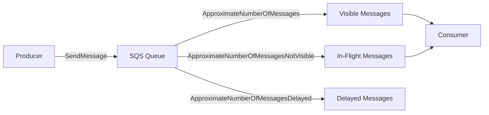
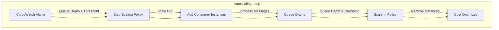
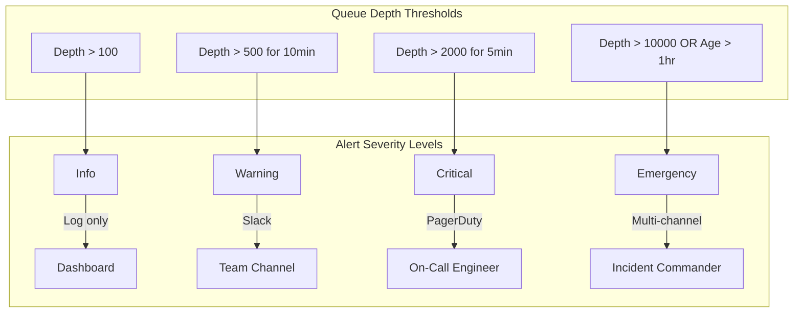

# How to Monitor SQS Queue Depth

Author: [nawazdhandala](https://github.com/nawazdhandala)

Tags: AWS, SQS, CloudWatch, Monitoring, Autoscaling, Observability, DevOps, Queue Management

Description: A comprehensive guide to monitoring Amazon SQS queue depth using CloudWatch metrics, setting up alarms, creating custom dashboards, implementing autoscaling based on queue depth, and building effective alerting strategies for reliable message processing.

---

> "Queue depth is the canary in your distributed system's coal mine. When messages pile up faster than they drain, something upstream is broken or something downstream is drowning."

Amazon Simple Queue Service (SQS) is the backbone of countless event-driven architectures. Whether you're processing orders, ingesting IoT telemetry, or coordinating microservices, the health of your queues directly impacts system reliability. Queue depth, the number of messages waiting to be processed, is the single most important metric for understanding whether your consumers can keep pace with your producers.

This guide walks through everything you need to monitor SQS effectively: from native CloudWatch metrics to custom dashboards, autoscaling policies, and alerting strategies that actually wake the right people at the right time.

---

## Understanding SQS Queue Depth Metrics

Before diving into implementation, let's clarify what AWS actually measures. SQS exposes several metrics through CloudWatch, but three matter most for queue depth monitoring:



| Metric | What It Measures | Why It Matters |
|--------|------------------|----------------|
| `ApproximateNumberOfMessages` | Messages visible and available for retrieval | Primary indicator of backlog |
| `ApproximateNumberOfMessagesNotVisible` | Messages being processed but not yet deleted | Shows consumer concurrency |
| `ApproximateNumberOfMessagesDelayed` | Messages in delay period | Important for scheduled workloads |

The word "Approximate" is intentional. SQS is distributed, and counts are eventually consistent. For monitoring purposes, this is fine; you care about trends, not exact counts.

---

## CloudWatch Metrics for SQS

AWS automatically publishes SQS metrics to CloudWatch every five minutes (or one minute for detailed monitoring). Here's how to query them programmatically.

### Fetching Queue Depth with AWS CLI

```bash
# Get the approximate number of visible messages in the queue
# This is the primary "queue depth" metric most teams track

aws cloudwatch get-metric-statistics \
  --namespace AWS/SQS \
  --metric-name ApproximateNumberOfMessages \
  --dimensions Name=QueueName,Value=my-order-processing-queue \
  --start-time $(date -u -d '1 hour ago' +%Y-%m-%dT%H:%M:%SZ) \
  --end-time $(date -u +%Y-%m-%dT%H:%M:%SZ) \
  --period 300 \
  --statistics Average Maximum
```

### Fetching Metrics with Python (Boto3)

```python
"""
Retrieve SQS queue depth metrics from CloudWatch.

This script fetches the ApproximateNumberOfMessages metric
for a specified queue and calculates statistics over a time window.
"""

import boto3
from datetime import datetime, timedelta

def get_queue_depth_metrics(queue_name: str, hours: int = 1) -> dict:
    """
    Fetch queue depth metrics from CloudWatch.

    Args:
        queue_name: The name of the SQS queue (not the URL)
        hours: How many hours of data to retrieve

    Returns:
        Dictionary containing metric datapoints with timestamps
    """
    cloudwatch = boto3.client('cloudwatch')

    end_time = datetime.utcnow()
    start_time = end_time - timedelta(hours=hours)

    # Query the primary queue depth metric
    response = cloudwatch.get_metric_statistics(
        Namespace='AWS/SQS',
        MetricName='ApproximateNumberOfMessages',
        Dimensions=[
            {
                'Name': 'QueueName',
                'Value': queue_name
            }
        ],
        StartTime=start_time,
        EndTime=end_time,
        Period=300,  # 5-minute intervals
        Statistics=['Average', 'Maximum', 'Minimum']
    )

    return {
        'queue_name': queue_name,
        'datapoints': sorted(
            response['Datapoints'],
            key=lambda x: x['Timestamp']
        )
    }


def get_all_queue_metrics(queue_name: str) -> dict:
    """
    Fetch all three queue depth related metrics at once.

    This gives a complete picture of queue health:
    - Visible messages (backlog)
    - In-flight messages (processing)
    - Delayed messages (scheduled)
    """
    cloudwatch = boto3.client('cloudwatch')

    metrics = [
        'ApproximateNumberOfMessages',
        'ApproximateNumberOfMessagesNotVisible',
        'ApproximateNumberOfMessagesDelayed'
    ]

    results = {}

    for metric in metrics:
        response = cloudwatch.get_metric_statistics(
            Namespace='AWS/SQS',
            MetricName=metric,
            Dimensions=[{'Name': 'QueueName', 'Value': queue_name}],
            StartTime=datetime.utcnow() - timedelta(hours=1),
            EndTime=datetime.utcnow(),
            Period=60,  # 1-minute granularity
            Statistics=['Average']
        )
        results[metric] = response['Datapoints']

    return results


if __name__ == '__main__':
    # Example usage
    metrics = get_queue_depth_metrics('my-order-processing-queue')

    for datapoint in metrics['datapoints']:
        print(f"{datapoint['Timestamp']}: "
              f"Avg={datapoint['Average']:.0f}, "
              f"Max={datapoint['Maximum']:.0f}")
```

---

## Setting Up Queue Depth Alarms

Alarms are the foundation of proactive monitoring. A well-configured alarm catches backlog before it becomes an outage.

### Basic CloudWatch Alarm with AWS CLI

```bash
# Create an alarm that triggers when queue depth exceeds 1000 messages
# for 3 consecutive 5-minute periods (15 minutes sustained)

aws cloudwatch put-metric-alarm \
  --alarm-name "OrderQueue-HighDepth" \
  --alarm-description "Order processing queue backlog is growing" \
  --namespace AWS/SQS \
  --metric-name ApproximateNumberOfMessages \
  --dimensions Name=QueueName,Value=order-processing-queue \
  --statistic Average \
  --period 300 \
  --threshold 1000 \
  --comparison-operator GreaterThanThreshold \
  --evaluation-periods 3 \
  --alarm-actions arn:aws:sns:us-east-1:123456789012:ops-alerts \
  --ok-actions arn:aws:sns:us-east-1:123456789012:ops-alerts \
  --treat-missing-data notBreaching
```

### Terraform Configuration for Queue Depth Alarms

```hcl
# terraform/sqs_monitoring.tf
#
# This module creates a comprehensive set of alarms for SQS queue monitoring.
# It includes both warning and critical thresholds, plus alarms for message age.

resource "aws_cloudwatch_metric_alarm" "queue_depth_warning" {
  alarm_name          = "${var.queue_name}-depth-warning"
  alarm_description   = "Queue depth exceeds warning threshold"
  comparison_operator = "GreaterThanThreshold"
  evaluation_periods  = 2
  metric_name         = "ApproximateNumberOfMessages"
  namespace           = "AWS/SQS"
  period              = 300
  statistic           = "Average"
  threshold           = var.warning_threshold  # e.g., 500 messages

  dimensions = {
    QueueName = var.queue_name
  }

  alarm_actions = [var.warning_sns_topic_arn]
  ok_actions    = [var.warning_sns_topic_arn]

  # Don't alarm if the metric is missing (queue might be empty)
  treat_missing_data = "notBreaching"

  tags = {
    Environment = var.environment
    Service     = var.service_name
  }
}

resource "aws_cloudwatch_metric_alarm" "queue_depth_critical" {
  alarm_name          = "${var.queue_name}-depth-critical"
  alarm_description   = "Queue depth exceeds critical threshold - immediate action required"
  comparison_operator = "GreaterThanThreshold"
  evaluation_periods  = 2
  metric_name         = "ApproximateNumberOfMessages"
  namespace           = "AWS/SQS"
  period              = 60  # Check every minute for critical alerts
  statistic           = "Maximum"
  threshold           = var.critical_threshold  # e.g., 5000 messages

  dimensions = {
    QueueName = var.queue_name
  }

  alarm_actions = [var.critical_sns_topic_arn]
  ok_actions    = [var.critical_sns_topic_arn]

  treat_missing_data = "notBreaching"

  tags = {
    Environment = var.environment
    Service     = var.service_name
  }
}

# Alarm for old messages - indicates consumers are failing or stuck
resource "aws_cloudwatch_metric_alarm" "oldest_message_age" {
  alarm_name          = "${var.queue_name}-message-age"
  alarm_description   = "Messages are sitting in queue too long"
  comparison_operator = "GreaterThanThreshold"
  evaluation_periods  = 1
  metric_name         = "ApproximateAgeOfOldestMessage"
  namespace           = "AWS/SQS"
  period              = 300
  statistic           = "Maximum"
  threshold           = var.max_message_age_seconds  # e.g., 3600 (1 hour)

  dimensions = {
    QueueName = var.queue_name
  }

  alarm_actions = [var.warning_sns_topic_arn]
  ok_actions    = [var.warning_sns_topic_arn]

  treat_missing_data = "notBreaching"

  tags = {
    Environment = var.environment
    Service     = var.service_name
  }
}
```

### CloudFormation Template

```yaml
# cloudformation/sqs-alarms.yaml
#
# Creates SQS queue with comprehensive monitoring alarms.
# Deploy with: aws cloudformation deploy --template-file sqs-alarms.yaml --stack-name sqs-monitoring

AWSTemplateFormatVersion: '2010-09-09'
Description: SQS Queue with depth monitoring alarms

Parameters:
  QueueName:
    Type: String
    Description: Name of the SQS queue to monitor

  WarningThreshold:
    Type: Number
    Default: 500
    Description: Queue depth warning threshold

  CriticalThreshold:
    Type: Number
    Default: 5000
    Description: Queue depth critical threshold

  AlertEmail:
    Type: String
    Description: Email address for alarm notifications

Resources:
  # SNS Topic for alarm notifications
  AlertTopic:
    Type: AWS::SNS::Topic
    Properties:
      TopicName: !Sub "${QueueName}-alerts"
      Subscription:
        - Protocol: email
          Endpoint: !Ref AlertEmail

  # Warning alarm - queue depth is elevated
  QueueDepthWarningAlarm:
    Type: AWS::CloudWatch::Alarm
    Properties:
      AlarmName: !Sub "${QueueName}-depth-warning"
      AlarmDescription: Queue depth exceeds warning threshold
      Namespace: AWS/SQS
      MetricName: ApproximateNumberOfMessages
      Dimensions:
        - Name: QueueName
          Value: !Ref QueueName
      Statistic: Average
      Period: 300
      EvaluationPeriods: 2
      Threshold: !Ref WarningThreshold
      ComparisonOperator: GreaterThanThreshold
      AlarmActions:
        - !Ref AlertTopic
      OKActions:
        - !Ref AlertTopic
      TreatMissingData: notBreaching

  # Critical alarm - queue depth requires immediate attention
  QueueDepthCriticalAlarm:
    Type: AWS::CloudWatch::Alarm
    Properties:
      AlarmName: !Sub "${QueueName}-depth-critical"
      AlarmDescription: Queue depth critical - immediate action required
      Namespace: AWS/SQS
      MetricName: ApproximateNumberOfMessages
      Dimensions:
        - Name: QueueName
          Value: !Ref QueueName
      Statistic: Maximum
      Period: 60
      EvaluationPeriods: 2
      Threshold: !Ref CriticalThreshold
      ComparisonOperator: GreaterThanThreshold
      AlarmActions:
        - !Ref AlertTopic
      OKActions:
        - !Ref AlertTopic
      TreatMissingData: notBreaching

Outputs:
  AlertTopicArn:
    Description: ARN of the SNS topic for alerts
    Value: !Ref AlertTopic
```

---

## Custom Metrics and Dashboards

CloudWatch's built-in metrics tell you what's in the queue. Custom metrics tell you how fast you're processing and whether you're keeping up.

### Publishing Custom Processing Metrics

```python
"""
Custom SQS consumer metrics for CloudWatch.

This module publishes metrics about message processing performance:
- Processing rate (messages per second)
- Processing latency (how long each message takes)
- Error rate (percentage of failed messages)
"""

import boto3
import time
from datetime import datetime
from typing import Optional
from dataclasses import dataclass, field
from contextlib import contextmanager


@dataclass
class ProcessingMetrics:
    """Accumulates metrics for batch publishing to CloudWatch."""

    messages_processed: int = 0
    messages_failed: int = 0
    total_processing_time_ms: float = 0

    # Track individual processing times for percentile calculations
    processing_times: list = field(default_factory=list)

    def record_success(self, processing_time_ms: float):
        """Record a successfully processed message."""
        self.messages_processed += 1
        self.total_processing_time_ms += processing_time_ms
        self.processing_times.append(processing_time_ms)

    def record_failure(self, processing_time_ms: float):
        """Record a failed message processing attempt."""
        self.messages_failed += 1
        self.total_processing_time_ms += processing_time_ms
        self.processing_times.append(processing_time_ms)

    @property
    def avg_processing_time_ms(self) -> float:
        """Calculate average processing time."""
        total = self.messages_processed + self.messages_failed
        if total == 0:
            return 0
        return self.total_processing_time_ms / total

    @property
    def error_rate(self) -> float:
        """Calculate error rate as a percentage."""
        total = self.messages_processed + self.messages_failed
        if total == 0:
            return 0
        return (self.messages_failed / total) * 100

    @property
    def p99_processing_time_ms(self) -> float:
        """Calculate 99th percentile processing time."""
        if not self.processing_times:
            return 0
        sorted_times = sorted(self.processing_times)
        index = int(len(sorted_times) * 0.99)
        return sorted_times[min(index, len(sorted_times) - 1)]


class SQSMetricsPublisher:
    """
    Publishes custom SQS processing metrics to CloudWatch.

    Usage:
        publisher = SQSMetricsPublisher('my-queue', 'my-service')

        with publisher.track_processing():
            process_message(message)

        # Periodically flush metrics
        publisher.publish_metrics()
    """

    def __init__(
        self,
        queue_name: str,
        service_name: str,
        namespace: str = 'Custom/SQS'
    ):
        self.queue_name = queue_name
        self.service_name = service_name
        self.namespace = namespace
        self.cloudwatch = boto3.client('cloudwatch')
        self.metrics = ProcessingMetrics()
        self._start_time: Optional[float] = None

    @contextmanager
    def track_processing(self):
        """
        Context manager to track message processing time.

        Automatically records success or failure based on whether
        an exception is raised.
        """
        start = time.time()
        try:
            yield
            elapsed_ms = (time.time() - start) * 1000
            self.metrics.record_success(elapsed_ms)
        except Exception:
            elapsed_ms = (time.time() - start) * 1000
            self.metrics.record_failure(elapsed_ms)
            raise

    def publish_metrics(self):
        """
        Publish accumulated metrics to CloudWatch and reset counters.

        Call this periodically (e.g., every minute) to send metrics.
        """
        if self.metrics.messages_processed == 0 and self.metrics.messages_failed == 0:
            return  # Nothing to publish

        timestamp = datetime.utcnow()

        # Build the list of metrics to publish
        metric_data = [
            {
                'MetricName': 'MessagesProcessed',
                'Value': self.metrics.messages_processed,
                'Unit': 'Count',
                'Timestamp': timestamp,
                'Dimensions': self._get_dimensions()
            },
            {
                'MetricName': 'MessagesFailed',
                'Value': self.metrics.messages_failed,
                'Unit': 'Count',
                'Timestamp': timestamp,
                'Dimensions': self._get_dimensions()
            },
            {
                'MetricName': 'ProcessingLatencyAvg',
                'Value': self.metrics.avg_processing_time_ms,
                'Unit': 'Milliseconds',
                'Timestamp': timestamp,
                'Dimensions': self._get_dimensions()
            },
            {
                'MetricName': 'ProcessingLatencyP99',
                'Value': self.metrics.p99_processing_time_ms,
                'Unit': 'Milliseconds',
                'Timestamp': timestamp,
                'Dimensions': self._get_dimensions()
            },
            {
                'MetricName': 'ErrorRate',
                'Value': self.metrics.error_rate,
                'Unit': 'Percent',
                'Timestamp': timestamp,
                'Dimensions': self._get_dimensions()
            }
        ]

        # Publish to CloudWatch
        self.cloudwatch.put_metric_data(
            Namespace=self.namespace,
            MetricData=metric_data
        )

        # Reset metrics for next period
        self.metrics = ProcessingMetrics()

    def _get_dimensions(self) -> list:
        """Return CloudWatch dimensions for this queue."""
        return [
            {'Name': 'QueueName', 'Value': self.queue_name},
            {'Name': 'ServiceName', 'Value': self.service_name}
        ]
```

### CloudWatch Dashboard Definition

```json
{
  "widgets": [
    {
      "type": "text",
      "x": 0,
      "y": 0,
      "width": 24,
      "height": 1,
      "properties": {
        "markdown": "# SQS Queue Monitoring Dashboard\nReal-time visibility into queue health and processing performance"
      }
    },
    {
      "type": "metric",
      "x": 0,
      "y": 1,
      "width": 12,
      "height": 6,
      "properties": {
        "title": "Queue Depth Over Time",
        "view": "timeSeries",
        "stacked": false,
        "metrics": [
          ["AWS/SQS", "ApproximateNumberOfMessages", "QueueName", "order-processing-queue", {"label": "Visible Messages", "color": "#2ca02c"}],
          ["AWS/SQS", "ApproximateNumberOfMessagesNotVisible", "QueueName", "order-processing-queue", {"label": "In-Flight", "color": "#ff7f0e"}],
          ["AWS/SQS", "ApproximateNumberOfMessagesDelayed", "QueueName", "order-processing-queue", {"label": "Delayed", "color": "#1f77b4"}]
        ],
        "region": "us-east-1",
        "period": 60,
        "stat": "Average",
        "annotations": {
          "horizontal": [
            {"label": "Warning", "value": 500, "color": "#ff9900"},
            {"label": "Critical", "value": 5000, "color": "#d13212"}
          ]
        }
      }
    },
    {
      "type": "metric",
      "x": 12,
      "y": 1,
      "width": 12,
      "height": 6,
      "properties": {
        "title": "Message Age",
        "view": "timeSeries",
        "metrics": [
          ["AWS/SQS", "ApproximateAgeOfOldestMessage", "QueueName", "order-processing-queue", {"label": "Oldest Message Age (seconds)"}]
        ],
        "region": "us-east-1",
        "period": 60,
        "stat": "Maximum"
      }
    },
    {
      "type": "metric",
      "x": 0,
      "y": 7,
      "width": 8,
      "height": 6,
      "properties": {
        "title": "Processing Rate",
        "view": "timeSeries",
        "metrics": [
          ["Custom/SQS", "MessagesProcessed", "QueueName", "order-processing-queue", "ServiceName", "order-service", {"label": "Processed/min", "stat": "Sum"}],
          ["Custom/SQS", "MessagesFailed", "QueueName", "order-processing-queue", "ServiceName", "order-service", {"label": "Failed/min", "stat": "Sum", "color": "#d13212"}]
        ],
        "region": "us-east-1",
        "period": 60
      }
    },
    {
      "type": "metric",
      "x": 8,
      "y": 7,
      "width": 8,
      "height": 6,
      "properties": {
        "title": "Processing Latency",
        "view": "timeSeries",
        "metrics": [
          ["Custom/SQS", "ProcessingLatencyAvg", "QueueName", "order-processing-queue", "ServiceName", "order-service", {"label": "Average (ms)"}],
          ["Custom/SQS", "ProcessingLatencyP99", "QueueName", "order-processing-queue", "ServiceName", "order-service", {"label": "P99 (ms)", "color": "#ff7f0e"}]
        ],
        "region": "us-east-1",
        "period": 60
      }
    },
    {
      "type": "metric",
      "x": 16,
      "y": 7,
      "width": 8,
      "height": 6,
      "properties": {
        "title": "Error Rate",
        "view": "timeSeries",
        "metrics": [
          ["Custom/SQS", "ErrorRate", "QueueName", "order-processing-queue", "ServiceName", "order-service", {"label": "Error %", "color": "#d13212"}]
        ],
        "region": "us-east-1",
        "period": 60,
        "annotations": {
          "horizontal": [
            {"label": "SLO", "value": 1, "color": "#ff9900"}
          ]
        }
      }
    },
    {
      "type": "alarm",
      "x": 0,
      "y": 13,
      "width": 24,
      "height": 3,
      "properties": {
        "title": "Alarm Status",
        "alarms": [
          "arn:aws:cloudwatch:us-east-1:123456789012:alarm:order-processing-queue-depth-warning",
          "arn:aws:cloudwatch:us-east-1:123456789012:alarm:order-processing-queue-depth-critical",
          "arn:aws:cloudwatch:us-east-1:123456789012:alarm:order-processing-queue-message-age"
        ]
      }
    }
  ]
}
```

### Creating the Dashboard with Terraform

```hcl
# terraform/sqs_dashboard.tf
#
# Creates a CloudWatch dashboard for SQS queue monitoring.
# The dashboard shows queue depth, processing metrics, and alarm status.

resource "aws_cloudwatch_dashboard" "sqs_monitoring" {
  dashboard_name = "${var.environment}-sqs-monitoring"

  dashboard_body = jsonencode({
    widgets = [
      # Title widget
      {
        type   = "text"
        x      = 0
        y      = 0
        width  = 24
        height = 1
        properties = {
          markdown = "# ${var.environment} SQS Queue Monitoring"
        }
      },

      # Queue depth graph
      {
        type   = "metric"
        x      = 0
        y      = 1
        width  = 12
        height = 6
        properties = {
          title   = "Queue Depth"
          view    = "timeSeries"
          stacked = false
          region  = var.aws_region
          period  = 60
          metrics = [
            for queue in var.queue_names : [
              "AWS/SQS",
              "ApproximateNumberOfMessages",
              "QueueName",
              queue
            ]
          ]
        }
      },

      # In-flight messages
      {
        type   = "metric"
        x      = 12
        y      = 1
        width  = 12
        height = 6
        properties = {
          title   = "In-Flight Messages"
          view    = "timeSeries"
          region  = var.aws_region
          period  = 60
          metrics = [
            for queue in var.queue_names : [
              "AWS/SQS",
              "ApproximateNumberOfMessagesNotVisible",
              "QueueName",
              queue
            ]
          ]
        }
      }
    ]
  })
}
```

---

## Autoscaling Based on Queue Depth

The most powerful use of queue depth monitoring is driving autoscaling. When messages pile up, add consumers. When the queue drains, scale down to save costs.



### ECS Service Autoscaling with Queue Depth

```hcl
# terraform/ecs_autoscaling.tf
#
# Configures ECS service autoscaling based on SQS queue depth.
# This pattern works for any containerized consumer service.

# Register the ECS service as a scalable target
resource "aws_appautoscaling_target" "ecs_consumer" {
  max_capacity       = var.max_consumers
  min_capacity       = var.min_consumers
  resource_id        = "service/${var.ecs_cluster_name}/${var.ecs_service_name}"
  scalable_dimension = "ecs:service:DesiredCount"
  service_namespace  = "ecs"
}

# Scale out when queue depth increases
resource "aws_appautoscaling_policy" "scale_out" {
  name               = "${var.ecs_service_name}-scale-out"
  policy_type        = "StepScaling"
  resource_id        = aws_appautoscaling_target.ecs_consumer.resource_id
  scalable_dimension = aws_appautoscaling_target.ecs_consumer.scalable_dimension
  service_namespace  = aws_appautoscaling_target.ecs_consumer.service_namespace

  step_scaling_policy_configuration {
    adjustment_type         = "ChangeInCapacity"
    cooldown                = 60  # Wait 60 seconds between scaling actions
    metric_aggregation_type = "Average"

    # Scale up gradually based on severity
    step_adjustment {
      # Queue depth 100-500: add 1 instance
      metric_interval_lower_bound = 0
      metric_interval_upper_bound = 400
      scaling_adjustment          = 1
    }

    step_adjustment {
      # Queue depth 500-1000: add 2 instances
      metric_interval_lower_bound = 400
      metric_interval_upper_bound = 900
      scaling_adjustment          = 2
    }

    step_adjustment {
      # Queue depth > 1000: add 4 instances
      metric_interval_lower_bound = 900
      scaling_adjustment          = 4
    }
  }
}

# Scale in when queue empties
resource "aws_appautoscaling_policy" "scale_in" {
  name               = "${var.ecs_service_name}-scale-in"
  policy_type        = "StepScaling"
  resource_id        = aws_appautoscaling_target.ecs_consumer.resource_id
  scalable_dimension = aws_appautoscaling_target.ecs_consumer.scalable_dimension
  service_namespace  = aws_appautoscaling_target.ecs_consumer.service_namespace

  step_scaling_policy_configuration {
    adjustment_type         = "ChangeInCapacity"
    cooldown                = 300  # Wait 5 minutes before scaling in
    metric_aggregation_type = "Average"

    step_adjustment {
      # Queue depth < 100: remove 1 instance
      metric_interval_upper_bound = 0
      scaling_adjustment          = -1
    }
  }
}

# Alarm to trigger scale out
resource "aws_cloudwatch_metric_alarm" "queue_depth_high" {
  alarm_name          = "${var.queue_name}-depth-high-autoscale"
  comparison_operator = "GreaterThanThreshold"
  evaluation_periods  = 1
  metric_name         = "ApproximateNumberOfMessages"
  namespace           = "AWS/SQS"
  period              = 60
  statistic           = "Average"
  threshold           = 100

  dimensions = {
    QueueName = var.queue_name
  }

  alarm_actions = [aws_appautoscaling_policy.scale_out.arn]
}

# Alarm to trigger scale in
resource "aws_cloudwatch_metric_alarm" "queue_depth_low" {
  alarm_name          = "${var.queue_name}-depth-low-autoscale"
  comparison_operator = "LessThanThreshold"
  evaluation_periods  = 5  # Must be low for 5 minutes to scale in
  metric_name         = "ApproximateNumberOfMessages"
  namespace           = "AWS/SQS"
  period              = 60
  statistic           = "Average"
  threshold           = 100

  dimensions = {
    QueueName = var.queue_name
  }

  alarm_actions = [aws_appautoscaling_policy.scale_in.arn]
}
```

### Target Tracking Scaling (Simpler Alternative)

```hcl
# terraform/target_tracking.tf
#
# Target tracking automatically adjusts capacity to maintain
# a target queue depth per consumer. Simpler than step scaling.

resource "aws_appautoscaling_policy" "target_tracking" {
  name               = "${var.ecs_service_name}-target-tracking"
  policy_type        = "TargetTrackingScaling"
  resource_id        = aws_appautoscaling_target.ecs_consumer.resource_id
  scalable_dimension = aws_appautoscaling_target.ecs_consumer.scalable_dimension
  service_namespace  = aws_appautoscaling_target.ecs_consumer.service_namespace

  target_tracking_scaling_policy_configuration {
    # Custom metric: messages per consumer
    # Target: 100 messages per consumer instance
    customized_metric_specification {
      metric_name = "ApproximateNumberOfMessages"
      namespace   = "AWS/SQS"
      statistic   = "Average"

      dimensions {
        name  = "QueueName"
        value = var.queue_name
      }
    }

    target_value       = 100  # Target messages per instance
    scale_in_cooldown  = 300
    scale_out_cooldown = 60
  }
}
```

### Lambda Concurrency Scaling

```python
"""
Lambda function that adjusts its own reserved concurrency based on queue depth.

For Lambda consumers, you can't use traditional autoscaling. Instead, this
function monitors its source queue and adjusts reserved concurrency dynamically.
"""

import boto3
import os
import math

# Configuration from environment variables
QUEUE_URL = os.environ['SQS_QUEUE_URL']
FUNCTION_NAME = os.environ['AWS_LAMBDA_FUNCTION_NAME']
MIN_CONCURRENCY = int(os.environ.get('MIN_CONCURRENCY', '5'))
MAX_CONCURRENCY = int(os.environ.get('MAX_CONCURRENCY', '100'))
MESSAGES_PER_INSTANCE = int(os.environ.get('MESSAGES_PER_INSTANCE', '50'))

sqs = boto3.client('sqs')
lambda_client = boto3.client('lambda')


def calculate_desired_concurrency(queue_depth: int) -> int:
    """
    Calculate desired concurrency based on queue depth.

    Formula: ceil(queue_depth / messages_per_instance)
    Clamped between min and max concurrency limits.
    """
    if queue_depth == 0:
        return MIN_CONCURRENCY

    desired = math.ceil(queue_depth / MESSAGES_PER_INSTANCE)
    return max(MIN_CONCURRENCY, min(desired, MAX_CONCURRENCY))


def get_queue_depth() -> int:
    """Get current approximate message count from SQS."""
    response = sqs.get_queue_attributes(
        QueueUrl=QUEUE_URL,
        AttributeNames=['ApproximateNumberOfMessages']
    )
    return int(response['Attributes']['ApproximateNumberOfMessages'])


def update_concurrency(concurrency: int):
    """Update the Lambda function's reserved concurrency."""
    lambda_client.put_function_concurrency(
        FunctionName=FUNCTION_NAME,
        ReservedConcurrentExecutions=concurrency
    )
    print(f"Updated concurrency to {concurrency}")


def handler(event, context):
    """
    Lambda handler - called periodically by CloudWatch Events.

    Schedule this to run every minute:
    aws events put-rule --name adjust-lambda-concurrency --schedule-expression "rate(1 minute)"
    """
    queue_depth = get_queue_depth()
    desired_concurrency = calculate_desired_concurrency(queue_depth)

    # Get current concurrency
    try:
        response = lambda_client.get_function_concurrency(
            FunctionName=FUNCTION_NAME
        )
        current = response.get('ReservedConcurrentExecutions', 0)
    except lambda_client.exceptions.ResourceNotFoundException:
        current = 0

    # Only update if different
    if current != desired_concurrency:
        update_concurrency(desired_concurrency)
        return {
            'queue_depth': queue_depth,
            'previous_concurrency': current,
            'new_concurrency': desired_concurrency
        }

    return {
        'queue_depth': queue_depth,
        'concurrency': current,
        'message': 'No change needed'
    }
```

---

## Alerting Strategies

Good alerting is about signal, not noise. Here's how to design alerts that wake people only when action is needed.



### Multi-Tier Alert Configuration

```python
"""
SQS alerting configuration with multiple severity levels.

This module defines alert thresholds and routing for different
severity levels. Use with AWS SNS topics for routing.
"""

from dataclasses import dataclass
from typing import List, Optional
from enum import Enum


class AlertSeverity(Enum):
    """Alert severity levels with escalation paths."""
    INFO = "info"           # Log only, no notification
    WARNING = "warning"     # Slack channel notification
    CRITICAL = "critical"   # PagerDuty, pages on-call
    EMERGENCY = "emergency" # Multi-channel, incident commander


@dataclass
class AlertThreshold:
    """
    Defines when to trigger an alert based on queue metrics.

    Attributes:
        name: Human-readable alert name
        severity: Alert severity level
        metric: CloudWatch metric name
        threshold: Value that triggers the alert
        duration_minutes: How long condition must persist
        comparison: greater_than or less_than
    """
    name: str
    severity: AlertSeverity
    metric: str
    threshold: float
    duration_minutes: int
    comparison: str = "greater_than"

    def to_cloudwatch_alarm(self, queue_name: str, sns_topics: dict) -> dict:
        """Convert to CloudWatch alarm configuration."""
        comparison_map = {
            "greater_than": "GreaterThanThreshold",
            "less_than": "LessThanThreshold",
            "greater_or_equal": "GreaterThanOrEqualToThreshold"
        }

        return {
            "AlarmName": f"{queue_name}-{self.name}",
            "AlarmDescription": f"{self.severity.value.upper()}: {self.name}",
            "MetricName": self.metric,
            "Namespace": "AWS/SQS",
            "Dimensions": [{"Name": "QueueName", "Value": queue_name}],
            "Statistic": "Average",
            "Period": 60,
            "EvaluationPeriods": self.duration_minutes,
            "Threshold": self.threshold,
            "ComparisonOperator": comparison_map[self.comparison],
            "AlarmActions": [sns_topics[self.severity]],
            "OKActions": [sns_topics[self.severity]],
            "TreatMissingData": "notBreaching"
        }


# Standard alert configuration for production queues
STANDARD_ALERTS: List[AlertThreshold] = [
    # Info: Queue has messages (normal operation)
    AlertThreshold(
        name="queue-has-messages",
        severity=AlertSeverity.INFO,
        metric="ApproximateNumberOfMessages",
        threshold=1,
        duration_minutes=1
    ),

    # Warning: Queue depth elevated
    AlertThreshold(
        name="queue-depth-elevated",
        severity=AlertSeverity.WARNING,
        metric="ApproximateNumberOfMessages",
        threshold=500,
        duration_minutes=10
    ),

    # Warning: Messages getting old
    AlertThreshold(
        name="message-age-warning",
        severity=AlertSeverity.WARNING,
        metric="ApproximateAgeOfOldestMessage",
        threshold=1800,  # 30 minutes
        duration_minutes=5
    ),

    # Critical: Significant backlog
    AlertThreshold(
        name="queue-depth-critical",
        severity=AlertSeverity.CRITICAL,
        metric="ApproximateNumberOfMessages",
        threshold=2000,
        duration_minutes=5
    ),

    # Critical: Messages very old
    AlertThreshold(
        name="message-age-critical",
        severity=AlertSeverity.CRITICAL,
        metric="ApproximateAgeOfOldestMessage",
        threshold=3600,  # 1 hour
        duration_minutes=1
    ),

    # Emergency: Massive backlog
    AlertThreshold(
        name="queue-depth-emergency",
        severity=AlertSeverity.EMERGENCY,
        metric="ApproximateNumberOfMessages",
        threshold=10000,
        duration_minutes=2
    ),
]


def generate_all_alarms(
    queue_name: str,
    sns_topics: dict,
    custom_thresholds: Optional[List[AlertThreshold]] = None
) -> List[dict]:
    """
    Generate CloudWatch alarm configurations for a queue.

    Args:
        queue_name: Name of the SQS queue
        sns_topics: Dict mapping AlertSeverity to SNS topic ARNs
        custom_thresholds: Optional custom thresholds to use instead

    Returns:
        List of CloudWatch alarm configurations
    """
    thresholds = custom_thresholds or STANDARD_ALERTS
    return [t.to_cloudwatch_alarm(queue_name, sns_topics) for t in thresholds]
```

### Dead Letter Queue Monitoring

```hcl
# terraform/dlq_monitoring.tf
#
# Dead Letter Queues require special attention. Any message in a DLQ
# represents a processing failure that needs investigation.

resource "aws_cloudwatch_metric_alarm" "dlq_not_empty" {
  alarm_name          = "${var.dlq_name}-not-empty"
  alarm_description   = "CRITICAL: Dead letter queue has messages - processing failures detected"
  comparison_operator = "GreaterThanThreshold"
  evaluation_periods  = 1
  metric_name         = "ApproximateNumberOfMessages"
  namespace           = "AWS/SQS"
  period              = 60
  statistic           = "Sum"
  threshold           = 0  # Alert on ANY message in DLQ

  dimensions = {
    QueueName = var.dlq_name
  }

  # DLQ alerts should always page someone
  alarm_actions = [var.critical_sns_topic_arn]
  ok_actions    = [var.critical_sns_topic_arn]

  treat_missing_data = "notBreaching"

  tags = {
    AlertType = "DeadLetterQueue"
    Severity  = "Critical"
  }
}

# Also alert if DLQ is growing (multiple failures)
resource "aws_cloudwatch_metric_alarm" "dlq_growing" {
  alarm_name          = "${var.dlq_name}-growing"
  alarm_description   = "EMERGENCY: Dead letter queue is growing rapidly"
  comparison_operator = "GreaterThanThreshold"
  evaluation_periods  = 3
  metric_name         = "NumberOfMessagesReceived"
  namespace           = "AWS/SQS"
  period              = 60
  statistic           = "Sum"
  threshold           = 10  # More than 10 failures per minute

  dimensions = {
    QueueName = var.dlq_name
  }

  alarm_actions = [var.emergency_sns_topic_arn]
  ok_actions    = [var.emergency_sns_topic_arn]

  treat_missing_data = "notBreaching"
}
```

---

## Integrating with OneUptime

OneUptime provides a unified observability platform that can aggregate SQS metrics alongside your application metrics, logs, and traces. Here's how to integrate.

### Sending Custom Metrics to OneUptime

```python
"""
Send SQS queue metrics to OneUptime for unified observability.

OneUptime accepts metrics via its telemetry API, allowing you to
correlate queue health with application performance.
"""

import requests
from datetime import datetime
from typing import Dict, Any

ONEUPTIME_ENDPOINT = "https://oneuptime.com/api/telemetry/metrics"
ONEUPTIME_API_KEY = "your-api-key"  # Store in secrets manager


def send_queue_metrics_to_oneuptime(
    queue_name: str,
    metrics: Dict[str, Any]
) -> bool:
    """
    Send SQS queue metrics to OneUptime.

    Args:
        queue_name: Name of the SQS queue
        metrics: Dictionary of metric values

    Returns:
        True if successful, False otherwise
    """
    payload = {
        "timestamp": datetime.utcnow().isoformat(),
        "service": "sqs-monitoring",
        "resource": queue_name,
        "metrics": [
            {
                "name": "sqs.queue.depth",
                "value": metrics.get("ApproximateNumberOfMessages", 0),
                "unit": "count",
                "tags": {"queue": queue_name}
            },
            {
                "name": "sqs.queue.in_flight",
                "value": metrics.get("ApproximateNumberOfMessagesNotVisible", 0),
                "unit": "count",
                "tags": {"queue": queue_name}
            },
            {
                "name": "sqs.message.age",
                "value": metrics.get("ApproximateAgeOfOldestMessage", 0),
                "unit": "seconds",
                "tags": {"queue": queue_name}
            }
        ]
    }

    try:
        response = requests.post(
            ONEUPTIME_ENDPOINT,
            json=payload,
            headers={
                "Authorization": f"Bearer {ONEUPTIME_API_KEY}",
                "Content-Type": "application/json"
            },
            timeout=5
        )
        return response.status_code == 200
    except requests.RequestException as e:
        print(f"Failed to send metrics to OneUptime: {e}")
        return False
```

---

## Best Practices Summary

After years of running production SQS workloads, these practices consistently prevent incidents:

### 1. Establish Baselines First

Before setting thresholds, observe your queue for at least a week. Understand normal patterns:
- Daily traffic peaks
- Batch job schedules
- Seasonal variations

Set thresholds relative to your baseline, not arbitrary round numbers.

### 2. Alert on Rate of Change, Not Just Absolute Values

A queue with 1000 messages that's draining is healthy. A queue with 100 messages that's growing is a problem. Use CloudWatch Math expressions to alert on rate of change:

```
RATE(METRICS("ApproximateNumberOfMessages")) > 10  # Growing by 10 msg/min
```

### 3. Monitor the Full Pipeline

Queue depth alone doesn't tell the whole story. Also monitor:
- Producer send rate
- Consumer processing rate
- Error rates and DLQ growth
- End-to-end latency (message age)

### 4. Design for Zero Messages

Your ideal state is an empty queue. Design alerts that celebrate when you achieve it, and investigate when you can't.

### 5. Test Your Alerts

Regularly verify that alerts fire and route correctly. Include alert testing in your chaos engineering practice.

### 6. Document Response Procedures

Every alert should link to a runbook explaining:
- What the alert means
- How to investigate
- Common causes and fixes
- Escalation paths

---

## Conclusion

SQS queue depth monitoring is foundational to reliable event-driven systems. The techniques covered here, from basic CloudWatch alarms to sophisticated autoscaling policies, give you the tools to keep your consumers in sync with your producers.

Start simple: add basic depth alarms, create a dashboard, and observe. As you learn your system's patterns, add custom metrics, autoscaling, and sophisticated alerting. The goal isn't perfect monitoring from day one; it's continuous improvement based on production experience.

For a unified observability platform that brings together your SQS metrics, application logs, traces, and uptime monitoring, explore [OneUptime](https://oneuptime.com). It's the open-source alternative to fragmented monitoring stacks.

**Related Reading:**

- [Three Pillars of Observability: Logs, Metrics, and Traces](https://oneuptime.com/blog/post/2025-08-20-three-pillars-of-observability-logs-metrics-traces/view)
- [What is OpenTelemetry Collector and Why Use One](https://oneuptime.com/blog/post/2025-09-18-what-is-opentelemetry-collector-and-why-use-one/view)
- [SRE Metrics to Track](https://oneuptime.com/blog/post/2025-11-28-sre-metrics-to-track/view)
