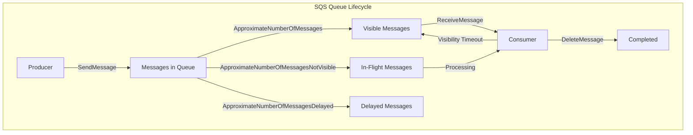
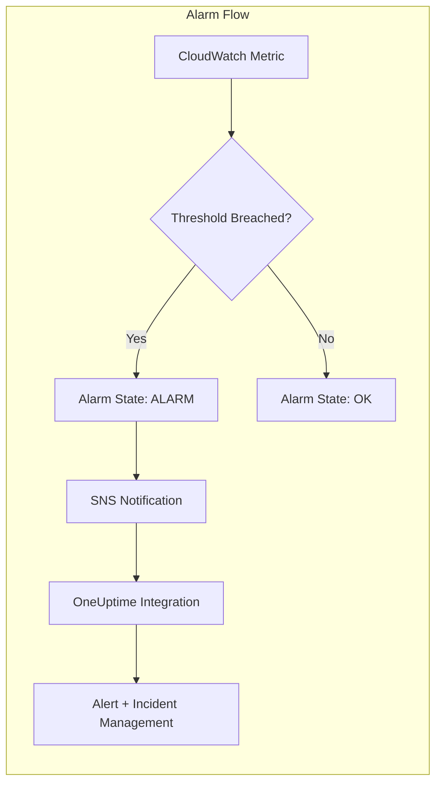
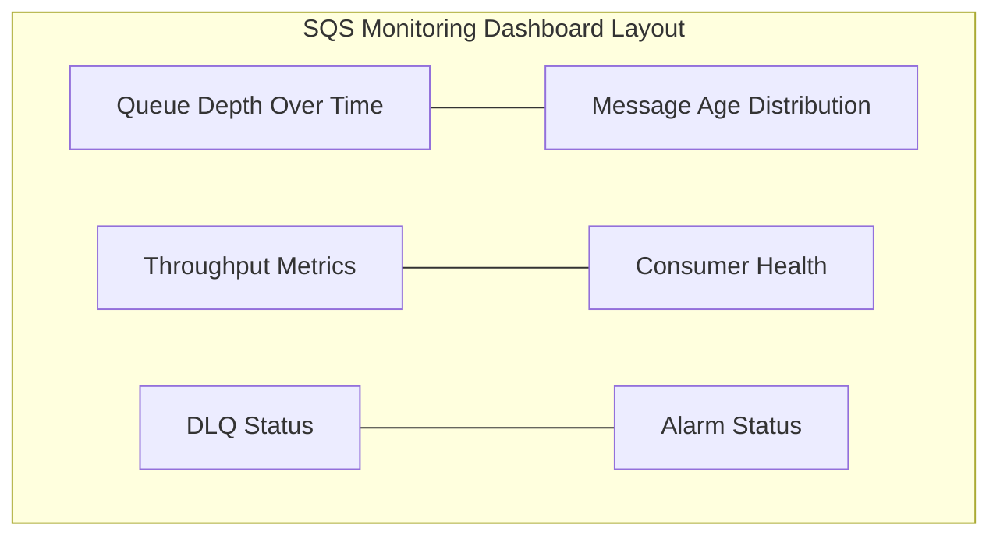
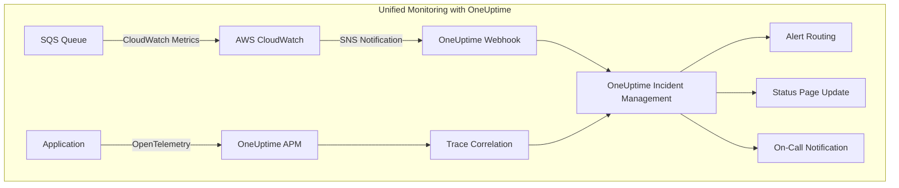
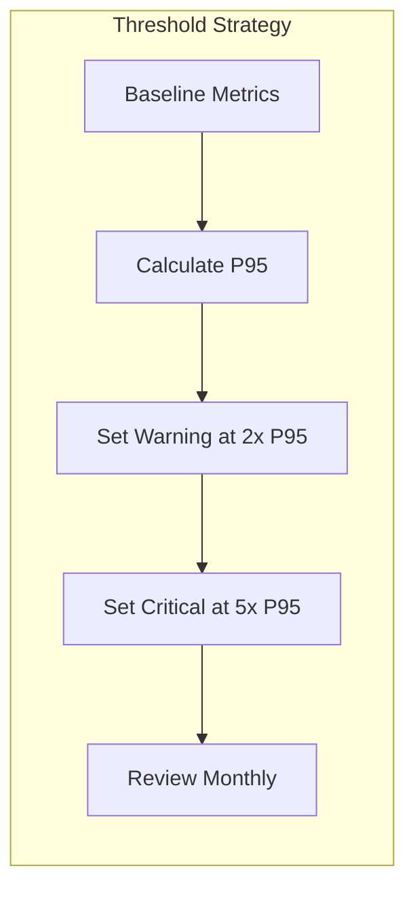

# How to Monitor SQS Queue Depth

By [Nawaz Dhandala](https://github.com/nawazdhandala)

Tags: AWS, SQS, CloudWatch, Monitoring, Queue Depth, Observability, Alarms, DevOps

Description: A comprehensive guide to monitoring Amazon SQS queue depth using CloudWatch metrics, alarms, and dashboards. Learn how to track queue depth, age of oldest message, and set up proactive alerting to prevent message processing bottlenecks.

---

> "A queue is like a waiting room. If people are waiting too long, something is wrong with the service." - Anonymous SRE

## Introduction

Amazon Simple Queue Service (SQS) is a cornerstone of distributed systems, enabling decoupled communication between services. However, without proper monitoring, a growing queue can silently indicate processing failures, consumer bottlenecks, or upstream traffic spikes that could cascade into larger system issues.

In this guide, we will explore how to monitor SQS queue depth effectively using CloudWatch metrics, create meaningful alarms, and build dashboards that give you real-time visibility into your queue health.

## Understanding SQS Metrics

Before diving into monitoring, let's understand the key metrics that CloudWatch provides for SQS queues.



### Key CloudWatch Metrics for SQS

| Metric | Description | Why It Matters |
|--------|-------------|----------------|
| `ApproximateNumberOfMessagesVisible` | Messages available for retrieval | Primary queue depth indicator |
| `ApproximateNumberOfMessagesNotVisible` | Messages being processed | Tracks in-flight work |
| `ApproximateNumberOfMessagesDelayed` | Messages in delay period | Important for delay queues |
| `ApproximateAgeOfOldestMessage` | Age of the oldest message (seconds) | Critical for SLA compliance |
| `NumberOfMessagesSent` | Messages added to the queue | Tracks producer activity |
| `NumberOfMessagesReceived` | Messages retrieved by consumers | Tracks consumer activity |
| `NumberOfMessagesDeleted` | Messages successfully processed | Indicates throughput |

## Monitoring Queue Depth with CloudWatch

### Using AWS CLI to Query Metrics

The AWS CLI provides a quick way to check queue depth metrics.

```bash
#!/bin/bash
# get-sqs-metrics.sh
# Retrieves current SQS queue metrics using CloudWatch

# Define the queue name - replace with your actual queue name
QUEUE_NAME="my-application-queue"
REGION="us-east-1"

# Calculate time range for the query
# We query the last 5 minutes to get the most recent data point
END_TIME=$(date -u +"%Y-%m-%dT%H:%M:%SZ")
START_TIME=$(date -u -d "5 minutes ago" +"%Y-%m-%dT%H:%M:%SZ")

# Query ApproximateNumberOfMessagesVisible (queue depth)
# This metric shows messages waiting to be processed
aws cloudwatch get-metric-statistics \
    --namespace "AWS/SQS" \
    --metric-name "ApproximateNumberOfMessagesVisible" \
    --dimensions Name=QueueName,Value="${QUEUE_NAME}" \
    --start-time "${START_TIME}" \
    --end-time "${END_TIME}" \
    --period 60 \
    --statistics Average \
    --region "${REGION}"

# Query ApproximateAgeOfOldestMessage
# This tells us how long messages have been waiting
aws cloudwatch get-metric-statistics \
    --namespace "AWS/SQS" \
    --metric-name "ApproximateAgeOfOldestMessage" \
    --dimensions Name=QueueName,Value="${QUEUE_NAME}" \
    --start-time "${START_TIME}" \
    --end-time "${END_TIME}" \
    --period 60 \
    --statistics Maximum \
    --region "${REGION}"
```

### Using Python (Boto3) for Programmatic Access

```python
# sqs_metrics.py
# A comprehensive module for retrieving and analyzing SQS metrics

import boto3
from datetime import datetime, timedelta
from typing import Dict, List, Optional
import json

class SQSMetricsCollector:
    """
    Collects and analyzes SQS queue metrics from CloudWatch.

    This class provides methods to retrieve queue depth, message age,
    and throughput metrics for monitoring and alerting purposes.
    """

    def __init__(self, region: str = 'us-east-1'):
        """
        Initialize the metrics collector with AWS clients.

        Args:
            region: AWS region where the SQS queue resides
        """
        self.cloudwatch = boto3.client('cloudwatch', region_name=region)
        self.sqs = boto3.client('sqs', region_name=region)
        self.region = region

    def get_queue_depth(
        self,
        queue_name: str,
        period_minutes: int = 5
    ) -> Dict[str, float]:
        """
        Retrieve current queue depth metrics.

        Args:
            queue_name: Name of the SQS queue
            period_minutes: Time window for metric calculation

        Returns:
            Dictionary containing visible, not_visible, and delayed message counts
        """
        end_time = datetime.utcnow()
        start_time = end_time - timedelta(minutes=period_minutes)

        # Define the metrics we want to retrieve
        # Each metric provides different visibility into queue state
        metrics_to_fetch = [
            'ApproximateNumberOfMessagesVisible',      # Waiting to be processed
            'ApproximateNumberOfMessagesNotVisible',   # Currently being processed
            'ApproximateNumberOfMessagesDelayed'       # In delay period
        ]

        results = {}

        for metric_name in metrics_to_fetch:
            response = self.cloudwatch.get_metric_statistics(
                Namespace='AWS/SQS',
                MetricName=metric_name,
                Dimensions=[
                    {
                        'Name': 'QueueName',
                        'Value': queue_name
                    }
                ],
                StartTime=start_time,
                EndTime=end_time,
                Period=60,  # 1-minute granularity
                Statistics=['Average', 'Maximum']
            )

            # Extract the most recent data point
            if response['Datapoints']:
                # Sort by timestamp to get the latest
                latest = sorted(
                    response['Datapoints'],
                    key=lambda x: x['Timestamp']
                )[-1]
                results[metric_name] = {
                    'average': latest['Average'],
                    'maximum': latest['Maximum'],
                    'timestamp': latest['Timestamp'].isoformat()
                }
            else:
                results[metric_name] = {
                    'average': 0,
                    'maximum': 0,
                    'timestamp': None
                }

        return results

    def get_oldest_message_age(
        self,
        queue_name: str,
        period_minutes: int = 5
    ) -> Optional[int]:
        """
        Get the age of the oldest message in the queue.

        This is critical for SLA monitoring - if messages are getting
        too old, it indicates consumer lag or processing issues.

        Args:
            queue_name: Name of the SQS queue
            period_minutes: Time window for metric calculation

        Returns:
            Age in seconds of the oldest message, or None if no data
        """
        end_time = datetime.utcnow()
        start_time = end_time - timedelta(minutes=period_minutes)

        response = self.cloudwatch.get_metric_statistics(
            Namespace='AWS/SQS',
            MetricName='ApproximateAgeOfOldestMessage',
            Dimensions=[
                {
                    'Name': 'QueueName',
                    'Value': queue_name
                }
            ],
            StartTime=start_time,
            EndTime=end_time,
            Period=60,
            Statistics=['Maximum']  # We want the worst case
        )

        if response['Datapoints']:
            # Return the maximum age observed
            return max(dp['Maximum'] for dp in response['Datapoints'])
        return None

    def get_throughput_metrics(
        self,
        queue_name: str,
        period_minutes: int = 60
    ) -> Dict[str, float]:
        """
        Calculate message throughput (sent, received, deleted).

        Useful for capacity planning and understanding traffic patterns.

        Args:
            queue_name: Name of the SQS queue
            period_minutes: Time window for throughput calculation

        Returns:
            Dictionary with messages_sent, messages_received, messages_deleted
        """
        end_time = datetime.utcnow()
        start_time = end_time - timedelta(minutes=period_minutes)

        throughput_metrics = [
            'NumberOfMessagesSent',
            'NumberOfMessagesReceived',
            'NumberOfMessagesDeleted'
        ]

        results = {}

        for metric_name in throughput_metrics:
            response = self.cloudwatch.get_metric_statistics(
                Namespace='AWS/SQS',
                MetricName=metric_name,
                Dimensions=[
                    {
                        'Name': 'QueueName',
                        'Value': queue_name
                    }
                ],
                StartTime=start_time,
                EndTime=end_time,
                Period=period_minutes * 60,  # Aggregate over entire period
                Statistics=['Sum']
            )

            if response['Datapoints']:
                results[metric_name] = response['Datapoints'][0]['Sum']
            else:
                results[metric_name] = 0

        return results


# Example usage demonstrating the metrics collection
if __name__ == '__main__':
    collector = SQSMetricsCollector(region='us-east-1')

    queue_name = 'my-application-queue'

    # Get current queue depth
    depth = collector.get_queue_depth(queue_name)
    print(f"Queue Depth Metrics:\n{json.dumps(depth, indent=2, default=str)}")

    # Get oldest message age
    age = collector.get_oldest_message_age(queue_name)
    print(f"\nOldest Message Age: {age} seconds")

    # Get throughput for the last hour
    throughput = collector.get_throughput_metrics(queue_name)
    print(f"\nThroughput (last hour):\n{json.dumps(throughput, indent=2)}")
```

## Setting Up CloudWatch Alarms

Alarms are essential for proactive monitoring. Let's create alarms for the most critical SQS metrics.



### Creating Alarms with AWS CLI

```bash
#!/bin/bash
# create-sqs-alarms.sh
# Creates CloudWatch alarms for SQS queue monitoring

QUEUE_NAME="my-application-queue"
SNS_TOPIC_ARN="arn:aws:sns:us-east-1:123456789012:sqs-alerts"
REGION="us-east-1"

# Alarm 1: Queue Depth Threshold
# Triggers when more than 1000 messages are waiting
# This indicates consumers cannot keep up with producers
aws cloudwatch put-metric-alarm \
    --alarm-name "${QUEUE_NAME}-high-queue-depth" \
    --alarm-description "Alert when queue depth exceeds 1000 messages" \
    --namespace "AWS/SQS" \
    --metric-name "ApproximateNumberOfMessagesVisible" \
    --dimensions Name=QueueName,Value="${QUEUE_NAME}" \
    --statistic Average \
    --period 300 \
    --threshold 1000 \
    --comparison-operator GreaterThanThreshold \
    --evaluation-periods 2 \
    --alarm-actions "${SNS_TOPIC_ARN}" \
    --ok-actions "${SNS_TOPIC_ARN}" \
    --region "${REGION}"

# Alarm 2: Age of Oldest Message
# Triggers when messages are older than 5 minutes (300 seconds)
# Critical for time-sensitive processing requirements
aws cloudwatch put-metric-alarm \
    --alarm-name "${QUEUE_NAME}-old-messages" \
    --alarm-description "Alert when oldest message exceeds 5 minutes" \
    --namespace "AWS/SQS" \
    --metric-name "ApproximateAgeOfOldestMessage" \
    --dimensions Name=QueueName,Value="${QUEUE_NAME}" \
    --statistic Maximum \
    --period 60 \
    --threshold 300 \
    --comparison-operator GreaterThanThreshold \
    --evaluation-periods 3 \
    --alarm-actions "${SNS_TOPIC_ARN}" \
    --ok-actions "${SNS_TOPIC_ARN}" \
    --region "${REGION}"

# Alarm 3: Dead Letter Queue Depth
# Any messages in DLQ indicate processing failures
# Should trigger immediate investigation
aws cloudwatch put-metric-alarm \
    --alarm-name "${QUEUE_NAME}-dlq-not-empty" \
    --alarm-description "Alert when DLQ has any messages" \
    --namespace "AWS/SQS" \
    --metric-name "ApproximateNumberOfMessagesVisible" \
    --dimensions Name=QueueName,Value="${QUEUE_NAME}-dlq" \
    --statistic Sum \
    --period 60 \
    --threshold 0 \
    --comparison-operator GreaterThanThreshold \
    --evaluation-periods 1 \
    --alarm-actions "${SNS_TOPIC_ARN}" \
    --treat-missing-data "notBreaching" \
    --region "${REGION}"

# Alarm 4: Zero Throughput Detection
# Triggers when no messages are being processed
# Could indicate consumer failures or network issues
aws cloudwatch put-metric-alarm \
    --alarm-name "${QUEUE_NAME}-no-throughput" \
    --alarm-description "Alert when no messages processed for 10 minutes" \
    --namespace "AWS/SQS" \
    --metric-name "NumberOfMessagesDeleted" \
    --dimensions Name=QueueName,Value="${QUEUE_NAME}" \
    --statistic Sum \
    --period 600 \
    --threshold 1 \
    --comparison-operator LessThanThreshold \
    --evaluation-periods 1 \
    --alarm-actions "${SNS_TOPIC_ARN}" \
    --treat-missing-data "breaching" \
    --region "${REGION}"

echo "All alarms created successfully!"
```

### Creating Alarms with CloudFormation

```yaml
# sqs-monitoring-stack.yaml
# CloudFormation template for SQS monitoring infrastructure

AWSTemplateFormatVersion: '2010-09-09'
Description: 'SQS Queue Monitoring with CloudWatch Alarms'

Parameters:
  QueueName:
    Type: String
    Description: Name of the SQS queue to monitor
    Default: my-application-queue

  AlertEmailAddress:
    Type: String
    Description: Email address for alarm notifications

  QueueDepthThreshold:
    Type: Number
    Description: Maximum acceptable queue depth
    Default: 1000

  MaxMessageAgeSeconds:
    Type: Number
    Description: Maximum acceptable message age in seconds
    Default: 300

Resources:
  # SNS Topic for alarm notifications
  # This topic receives all alarm state changes
  AlertTopic:
    Type: AWS::SNS::Topic
    Properties:
      TopicName: !Sub '${QueueName}-alerts'
      DisplayName: SQS Queue Alerts

  # Email subscription for the alert topic
  AlertEmailSubscription:
    Type: AWS::SNS::Subscription
    Properties:
      TopicArn: !Ref AlertTopic
      Protocol: email
      Endpoint: !Ref AlertEmailAddress

  # Alarm: High Queue Depth
  # Monitors for message backlog indicating consumer issues
  HighQueueDepthAlarm:
    Type: AWS::CloudWatch::Alarm
    Properties:
      AlarmName: !Sub '${QueueName}-high-queue-depth'
      AlarmDescription: !Sub 'Queue depth exceeds ${QueueDepthThreshold} messages'
      Namespace: AWS/SQS
      MetricName: ApproximateNumberOfMessagesVisible
      Dimensions:
        - Name: QueueName
          Value: !Ref QueueName
      Statistic: Average
      Period: 300
      EvaluationPeriods: 2
      Threshold: !Ref QueueDepthThreshold
      ComparisonOperator: GreaterThanThreshold
      AlarmActions:
        - !Ref AlertTopic
      OKActions:
        - !Ref AlertTopic
      TreatMissingData: notBreaching

  # Alarm: Old Messages
  # Ensures messages are processed within SLA requirements
  OldMessagesAlarm:
    Type: AWS::CloudWatch::Alarm
    Properties:
      AlarmName: !Sub '${QueueName}-old-messages'
      AlarmDescription: !Sub 'Messages older than ${MaxMessageAgeSeconds} seconds'
      Namespace: AWS/SQS
      MetricName: ApproximateAgeOfOldestMessage
      Dimensions:
        - Name: QueueName
          Value: !Ref QueueName
      Statistic: Maximum
      Period: 60
      EvaluationPeriods: 3
      Threshold: !Ref MaxMessageAgeSeconds
      ComparisonOperator: GreaterThanThreshold
      AlarmActions:
        - !Ref AlertTopic
      OKActions:
        - !Ref AlertTopic
      TreatMissingData: notBreaching

  # Alarm: Dead Letter Queue
  # Any message in DLQ requires immediate attention
  DLQAlarm:
    Type: AWS::CloudWatch::Alarm
    Properties:
      AlarmName: !Sub '${QueueName}-dlq-messages'
      AlarmDescription: 'Dead letter queue has messages requiring investigation'
      Namespace: AWS/SQS
      MetricName: ApproximateNumberOfMessagesVisible
      Dimensions:
        - Name: QueueName
          Value: !Sub '${QueueName}-dlq'
      Statistic: Sum
      Period: 60
      EvaluationPeriods: 1
      Threshold: 0
      ComparisonOperator: GreaterThanThreshold
      AlarmActions:
        - !Ref AlertTopic
      TreatMissingData: notBreaching

Outputs:
  AlertTopicArn:
    Description: ARN of the SNS topic for alerts
    Value: !Ref AlertTopic
    Export:
      Name: !Sub '${AWS::StackName}-AlertTopicArn'
```

## Creating a CloudWatch Dashboard

A well-designed dashboard provides at-a-glance visibility into queue health.



### Dashboard Definition with AWS CLI

```bash
#!/bin/bash
# create-sqs-dashboard.sh
# Creates a comprehensive CloudWatch dashboard for SQS monitoring

QUEUE_NAME="my-application-queue"
DASHBOARD_NAME="SQS-Queue-Monitoring"
REGION="us-east-1"

# Define the dashboard body as JSON
# This layout provides comprehensive visibility into queue health
DASHBOARD_BODY=$(cat << 'EOF'
{
    "widgets": [
        {
            "type": "metric",
            "x": 0,
            "y": 0,
            "width": 12,
            "height": 6,
            "properties": {
                "title": "Queue Depth Over Time",
                "view": "timeSeries",
                "stacked": false,
                "region": "us-east-1",
                "metrics": [
                    ["AWS/SQS", "ApproximateNumberOfMessagesVisible", "QueueName", "QUEUE_NAME_PLACEHOLDER", {"label": "Visible Messages", "color": "#1f77b4"}],
                    [".", "ApproximateNumberOfMessagesNotVisible", ".", ".", {"label": "In-Flight Messages", "color": "#ff7f0e"}],
                    [".", "ApproximateNumberOfMessagesDelayed", ".", ".", {"label": "Delayed Messages", "color": "#2ca02c"}]
                ],
                "period": 60,
                "stat": "Average"
            }
        },
        {
            "type": "metric",
            "x": 12,
            "y": 0,
            "width": 12,
            "height": 6,
            "properties": {
                "title": "Age of Oldest Message",
                "view": "timeSeries",
                "region": "us-east-1",
                "metrics": [
                    ["AWS/SQS", "ApproximateAgeOfOldestMessage", "QueueName", "QUEUE_NAME_PLACEHOLDER", {"label": "Age (seconds)", "color": "#d62728"}]
                ],
                "period": 60,
                "stat": "Maximum",
                "annotations": {
                    "horizontal": [
                        {"value": 300, "label": "5 min SLA", "color": "#ff9900"}
                    ]
                }
            }
        },
        {
            "type": "metric",
            "x": 0,
            "y": 6,
            "width": 8,
            "height": 6,
            "properties": {
                "title": "Message Throughput",
                "view": "timeSeries",
                "region": "us-east-1",
                "metrics": [
                    ["AWS/SQS", "NumberOfMessagesSent", "QueueName", "QUEUE_NAME_PLACEHOLDER", {"label": "Sent", "color": "#1f77b4"}],
                    [".", "NumberOfMessagesReceived", ".", ".", {"label": "Received", "color": "#ff7f0e"}],
                    [".", "NumberOfMessagesDeleted", ".", ".", {"label": "Deleted", "color": "#2ca02c"}]
                ],
                "period": 60,
                "stat": "Sum"
            }
        },
        {
            "type": "metric",
            "x": 8,
            "y": 6,
            "width": 8,
            "height": 6,
            "properties": {
                "title": "Empty Receives (Consumer Polling)",
                "view": "timeSeries",
                "region": "us-east-1",
                "metrics": [
                    ["AWS/SQS", "NumberOfEmptyReceives", "QueueName", "QUEUE_NAME_PLACEHOLDER", {"label": "Empty Receives", "color": "#9467bd"}]
                ],
                "period": 60,
                "stat": "Sum"
            }
        },
        {
            "type": "metric",
            "x": 16,
            "y": 6,
            "width": 8,
            "height": 6,
            "properties": {
                "title": "Dead Letter Queue Depth",
                "view": "timeSeries",
                "region": "us-east-1",
                "metrics": [
                    ["AWS/SQS", "ApproximateNumberOfMessagesVisible", "QueueName", "QUEUE_NAME_PLACEHOLDER-dlq", {"label": "DLQ Messages", "color": "#d62728"}]
                ],
                "period": 60,
                "stat": "Average"
            }
        },
        {
            "type": "metric",
            "x": 0,
            "y": 12,
            "width": 6,
            "height": 4,
            "properties": {
                "title": "Current Queue Depth",
                "view": "singleValue",
                "region": "us-east-1",
                "metrics": [
                    ["AWS/SQS", "ApproximateNumberOfMessagesVisible", "QueueName", "QUEUE_NAME_PLACEHOLDER"]
                ],
                "period": 60,
                "stat": "Average"
            }
        },
        {
            "type": "metric",
            "x": 6,
            "y": 12,
            "width": 6,
            "height": 4,
            "properties": {
                "title": "Current Message Age",
                "view": "singleValue",
                "region": "us-east-1",
                "metrics": [
                    ["AWS/SQS", "ApproximateAgeOfOldestMessage", "QueueName", "QUEUE_NAME_PLACEHOLDER"]
                ],
                "period": 60,
                "stat": "Maximum"
            }
        },
        {
            "type": "metric",
            "x": 12,
            "y": 12,
            "width": 6,
            "height": 4,
            "properties": {
                "title": "Messages/Minute (Sent)",
                "view": "singleValue",
                "region": "us-east-1",
                "metrics": [
                    ["AWS/SQS", "NumberOfMessagesSent", "QueueName", "QUEUE_NAME_PLACEHOLDER"]
                ],
                "period": 60,
                "stat": "Sum"
            }
        },
        {
            "type": "metric",
            "x": 18,
            "y": 12,
            "width": 6,
            "height": 4,
            "properties": {
                "title": "DLQ Count",
                "view": "singleValue",
                "region": "us-east-1",
                "metrics": [
                    ["AWS/SQS", "ApproximateNumberOfMessagesVisible", "QueueName", "QUEUE_NAME_PLACEHOLDER-dlq"]
                ],
                "period": 60,
                "stat": "Average"
            }
        }
    ]
}
EOF
)

# Replace placeholder with actual queue name
DASHBOARD_BODY=$(echo "$DASHBOARD_BODY" | sed "s/QUEUE_NAME_PLACEHOLDER/${QUEUE_NAME}/g")

# Create the dashboard
aws cloudwatch put-dashboard \
    --dashboard-name "${DASHBOARD_NAME}" \
    --dashboard-body "${DASHBOARD_BODY}" \
    --region "${REGION}"

echo "Dashboard '${DASHBOARD_NAME}' created successfully!"
echo "View at: https://${REGION}.console.aws.amazon.com/cloudwatch/home?region=${REGION}#dashboards:name=${DASHBOARD_NAME}"
```

## Using Terraform for Infrastructure as Code

For production environments, managing monitoring infrastructure with Terraform ensures consistency and version control.

```hcl
# sqs-monitoring.tf
# Terraform configuration for SQS monitoring infrastructure

terraform {
  required_providers {
    aws = {
      source  = "hashicorp/aws"
      version = "~> 5.0"
    }
  }
}

# Variables for customization
variable "queue_name" {
  description = "Name of the SQS queue to monitor"
  type        = string
}

variable "environment" {
  description = "Environment name (dev, staging, prod)"
  type        = string
  default     = "prod"
}

variable "queue_depth_threshold" {
  description = "Threshold for queue depth alarm"
  type        = number
  default     = 1000
}

variable "max_message_age_seconds" {
  description = "Maximum acceptable message age in seconds"
  type        = number
  default     = 300
}

variable "alert_email" {
  description = "Email address for alarm notifications"
  type        = string
}

# SNS Topic for alerts
# Central notification hub for all SQS-related alarms
resource "aws_sns_topic" "sqs_alerts" {
  name         = "${var.queue_name}-alerts"
  display_name = "SQS Alerts for ${var.queue_name}"

  tags = {
    Environment = var.environment
    Service     = "sqs-monitoring"
  }
}

# Email subscription for the alert topic
resource "aws_sns_topic_subscription" "email_alert" {
  topic_arn = aws_sns_topic.sqs_alerts.arn
  protocol  = "email"
  endpoint  = var.alert_email
}

# Alarm: High Queue Depth
# Triggers when messages are backing up in the queue
resource "aws_cloudwatch_metric_alarm" "high_queue_depth" {
  alarm_name          = "${var.queue_name}-high-queue-depth"
  comparison_operator = "GreaterThanThreshold"
  evaluation_periods  = 2
  metric_name         = "ApproximateNumberOfMessagesVisible"
  namespace           = "AWS/SQS"
  period              = 300
  statistic           = "Average"
  threshold           = var.queue_depth_threshold
  alarm_description   = "Queue depth exceeds ${var.queue_depth_threshold} messages"

  dimensions = {
    QueueName = var.queue_name
  }

  alarm_actions = [aws_sns_topic.sqs_alerts.arn]
  ok_actions    = [aws_sns_topic.sqs_alerts.arn]

  treat_missing_data = "notBreaching"

  tags = {
    Environment = var.environment
    AlertType   = "queue-depth"
  }
}

# Alarm: Old Messages
# Ensures messages don't exceed SLA processing time
resource "aws_cloudwatch_metric_alarm" "old_messages" {
  alarm_name          = "${var.queue_name}-old-messages"
  comparison_operator = "GreaterThanThreshold"
  evaluation_periods  = 3
  metric_name         = "ApproximateAgeOfOldestMessage"
  namespace           = "AWS/SQS"
  period              = 60
  statistic           = "Maximum"
  threshold           = var.max_message_age_seconds
  alarm_description   = "Messages older than ${var.max_message_age_seconds} seconds"

  dimensions = {
    QueueName = var.queue_name
  }

  alarm_actions = [aws_sns_topic.sqs_alerts.arn]
  ok_actions    = [aws_sns_topic.sqs_alerts.arn]

  treat_missing_data = "notBreaching"

  tags = {
    Environment = var.environment
    AlertType   = "message-age"
  }
}

# Alarm: Dead Letter Queue
# Any message in DLQ indicates a processing failure
resource "aws_cloudwatch_metric_alarm" "dlq_not_empty" {
  alarm_name          = "${var.queue_name}-dlq-not-empty"
  comparison_operator = "GreaterThanThreshold"
  evaluation_periods  = 1
  metric_name         = "ApproximateNumberOfMessagesVisible"
  namespace           = "AWS/SQS"
  period              = 60
  statistic           = "Sum"
  threshold           = 0
  alarm_description   = "Dead letter queue has messages requiring investigation"

  dimensions = {
    QueueName = "${var.queue_name}-dlq"
  }

  alarm_actions = [aws_sns_topic.sqs_alerts.arn]

  treat_missing_data = "notBreaching"

  tags = {
    Environment = var.environment
    AlertType   = "dlq"
  }
}

# CloudWatch Dashboard
# Provides visual overview of queue health
resource "aws_cloudwatch_dashboard" "sqs_monitoring" {
  dashboard_name = "${var.queue_name}-monitoring"

  dashboard_body = jsonencode({
    widgets = [
      {
        type   = "metric"
        x      = 0
        y      = 0
        width  = 12
        height = 6
        properties = {
          title   = "Queue Depth Over Time"
          view    = "timeSeries"
          stacked = false
          metrics = [
            ["AWS/SQS", "ApproximateNumberOfMessagesVisible", "QueueName", var.queue_name],
            [".", "ApproximateNumberOfMessagesNotVisible", ".", "."],
            [".", "ApproximateNumberOfMessagesDelayed", ".", "."]
          ]
          period = 60
          stat   = "Average"
        }
      },
      {
        type   = "metric"
        x      = 12
        y      = 0
        width  = 12
        height = 6
        properties = {
          title = "Age of Oldest Message"
          view  = "timeSeries"
          metrics = [
            ["AWS/SQS", "ApproximateAgeOfOldestMessage", "QueueName", var.queue_name]
          ]
          period = 60
          stat   = "Maximum"
          annotations = {
            horizontal = [
              {
                value = var.max_message_age_seconds
                label = "SLA Threshold"
                color = "#ff9900"
              }
            ]
          }
        }
      },
      {
        type   = "metric"
        x      = 0
        y      = 6
        width  = 12
        height = 6
        properties = {
          title = "Message Throughput"
          view  = "timeSeries"
          metrics = [
            ["AWS/SQS", "NumberOfMessagesSent", "QueueName", var.queue_name],
            [".", "NumberOfMessagesReceived", ".", "."],
            [".", "NumberOfMessagesDeleted", ".", "."]
          ]
          period = 60
          stat   = "Sum"
        }
      },
      {
        type   = "metric"
        x      = 12
        y      = 6
        width  = 12
        height = 6
        properties = {
          title = "Dead Letter Queue"
          view  = "timeSeries"
          metrics = [
            ["AWS/SQS", "ApproximateNumberOfMessagesVisible", "QueueName", "${var.queue_name}-dlq"]
          ]
          period = 60
          stat   = "Average"
        }
      }
    ]
  })
}

# Outputs for reference
output "sns_topic_arn" {
  description = "ARN of the SNS topic for alerts"
  value       = aws_sns_topic.sqs_alerts.arn
}

output "dashboard_url" {
  description = "URL to the CloudWatch dashboard"
  value       = "https://console.aws.amazon.com/cloudwatch/home?region=${data.aws_region.current.name}#dashboards:name=${aws_cloudwatch_dashboard.sqs_monitoring.dashboard_name}"
}

data "aws_region" "current" {}
```

## Integrating with OneUptime

While CloudWatch provides excellent native AWS monitoring, integrating with [OneUptime](https://oneuptime.com) gives you a unified observability platform that correlates SQS metrics with your application traces, logs, and other infrastructure metrics.



### Setting Up SNS to OneUptime Integration

```python
# oneuptime_sqs_integration.py
# Webhook handler for forwarding SQS alerts to OneUptime

import json
import requests
from typing import Dict, Any

class OneUptimeIntegration:
    """
    Integrates AWS SQS CloudWatch alarms with OneUptime.

    This class handles SNS notifications and forwards them to
    OneUptime for unified incident management.
    """

    def __init__(self, oneuptime_api_key: str, project_id: str):
        """
        Initialize the OneUptime integration.

        Args:
            oneuptime_api_key: Your OneUptime API key
            project_id: Your OneUptime project ID
        """
        self.api_key = oneuptime_api_key
        self.project_id = project_id
        self.base_url = "https://oneuptime.com/api"

    def process_cloudwatch_alarm(self, sns_message: Dict[str, Any]) -> Dict[str, Any]:
        """
        Process a CloudWatch alarm notification from SNS.

        Args:
            sns_message: The parsed SNS message containing alarm details

        Returns:
            Response from OneUptime API
        """
        # Parse the CloudWatch alarm message
        alarm_name = sns_message.get('AlarmName', 'Unknown Alarm')
        alarm_state = sns_message.get('NewStateValue', 'UNKNOWN')
        alarm_reason = sns_message.get('NewStateReason', 'No reason provided')
        alarm_description = sns_message.get('AlarmDescription', '')
        timestamp = sns_message.get('StateChangeTime', '')

        # Extract queue name from dimensions
        trigger = sns_message.get('Trigger', {})
        dimensions = trigger.get('Dimensions', [])
        queue_name = next(
            (d['value'] for d in dimensions if d['name'] == 'QueueName'),
            'Unknown Queue'
        )

        # Determine severity based on alarm type
        severity = self._determine_severity(alarm_name, alarm_state)

        # Create incident in OneUptime
        if alarm_state == 'ALARM':
            return self._create_incident(
                title=f"SQS Alert: {alarm_name}",
                description=f"""
Queue: {queue_name}
State: {alarm_state}
Reason: {alarm_reason}
Description: {alarm_description}
Time: {timestamp}
                """.strip(),
                severity=severity
            )
        elif alarm_state == 'OK':
            return self._resolve_incident(alarm_name)

        return {'status': 'ignored', 'state': alarm_state}

    def _determine_severity(self, alarm_name: str, state: str) -> str:
        """
        Determine incident severity based on alarm characteristics.
        """
        if state != 'ALARM':
            return 'low'

        # DLQ alerts are critical - indicates message processing failures
        if 'dlq' in alarm_name.lower():
            return 'critical'

        # Old message alerts are high - SLA at risk
        if 'old-message' in alarm_name.lower() or 'age' in alarm_name.lower():
            return 'high'

        # Queue depth alerts are medium by default
        return 'medium'

    def _create_incident(
        self,
        title: str,
        description: str,
        severity: str
    ) -> Dict[str, Any]:
        """
        Create an incident in OneUptime.
        """
        response = requests.post(
            f"{self.base_url}/incident/{self.project_id}",
            headers={
                'Authorization': f'Bearer {self.api_key}',
                'Content-Type': 'application/json'
            },
            json={
                'title': title,
                'description': description,
                'severity': severity,
                'source': 'aws-cloudwatch-sqs'
            }
        )
        return response.json()

    def _resolve_incident(self, alarm_name: str) -> Dict[str, Any]:
        """
        Resolve an existing incident in OneUptime.
        """
        # Search for open incident with matching alarm name
        # and mark it as resolved
        response = requests.post(
            f"{self.base_url}/incident/{self.project_id}/resolve",
            headers={
                'Authorization': f'Bearer {self.api_key}',
                'Content-Type': 'application/json'
            },
            json={
                'search': alarm_name,
                'resolution_note': 'Alarm returned to OK state'
            }
        )
        return response.json()


# AWS Lambda handler for SNS notifications
def lambda_handler(event, context):
    """
    AWS Lambda function to process SNS notifications from CloudWatch alarms.

    Deploy this as a Lambda function and subscribe it to your
    CloudWatch alarm SNS topic.
    """
    import os

    # Initialize OneUptime integration
    integration = OneUptimeIntegration(
        oneuptime_api_key=os.environ['ONEUPTIME_API_KEY'],
        project_id=os.environ['ONEUPTIME_PROJECT_ID']
    )

    results = []

    for record in event.get('Records', []):
        # Parse SNS message
        sns_message = json.loads(record['Sns']['Message'])

        # Process the alarm
        result = integration.process_cloudwatch_alarm(sns_message)
        results.append(result)

    return {
        'statusCode': 200,
        'body': json.dumps(results)
    }
```

## Best Practices for SQS Monitoring

### 1. Set Appropriate Thresholds



### 2. Monitor the Full Message Lifecycle

```python
# complete_sqs_monitor.py
# Comprehensive monitoring covering all stages of message processing

from dataclasses import dataclass
from typing import Optional
from datetime import datetime, timedelta
import boto3

@dataclass
class QueueHealthReport:
    """
    Comprehensive health report for an SQS queue.
    """
    queue_name: str
    timestamp: datetime

    # Queue depth metrics
    visible_messages: int
    in_flight_messages: int
    delayed_messages: int
    total_messages: int

    # Age metrics
    oldest_message_age_seconds: Optional[int]

    # Throughput metrics (per minute)
    messages_sent_per_minute: float
    messages_received_per_minute: float
    messages_deleted_per_minute: float

    # Health indicators
    is_healthy: bool
    health_issues: list

    def to_dict(self) -> dict:
        return {
            'queue_name': self.queue_name,
            'timestamp': self.timestamp.isoformat(),
            'depth': {
                'visible': self.visible_messages,
                'in_flight': self.in_flight_messages,
                'delayed': self.delayed_messages,
                'total': self.total_messages
            },
            'oldest_message_age_seconds': self.oldest_message_age_seconds,
            'throughput_per_minute': {
                'sent': self.messages_sent_per_minute,
                'received': self.messages_received_per_minute,
                'deleted': self.messages_deleted_per_minute
            },
            'is_healthy': self.is_healthy,
            'health_issues': self.health_issues
        }


class ComprehensiveSQSMonitor:
    """
    Monitors all aspects of SQS queue health.
    """

    def __init__(
        self,
        region: str = 'us-east-1',
        max_queue_depth: int = 1000,
        max_message_age_seconds: int = 300,
        min_throughput_per_minute: float = 1.0
    ):
        self.cloudwatch = boto3.client('cloudwatch', region_name=region)
        self.max_queue_depth = max_queue_depth
        self.max_message_age_seconds = max_message_age_seconds
        self.min_throughput = min_throughput_per_minute

    def get_health_report(self, queue_name: str) -> QueueHealthReport:
        """
        Generate a comprehensive health report for the specified queue.
        """
        now = datetime.utcnow()
        issues = []

        # Fetch all metrics
        depth_metrics = self._get_depth_metrics(queue_name)
        age = self._get_oldest_message_age(queue_name)
        throughput = self._get_throughput_metrics(queue_name)

        # Calculate totals
        visible = depth_metrics.get('visible', 0)
        in_flight = depth_metrics.get('in_flight', 0)
        delayed = depth_metrics.get('delayed', 0)
        total = visible + in_flight + delayed

        # Check for health issues
        if visible > self.max_queue_depth:
            issues.append(f"Queue depth ({visible}) exceeds threshold ({self.max_queue_depth})")

        if age and age > self.max_message_age_seconds:
            issues.append(f"Oldest message age ({age}s) exceeds threshold ({self.max_message_age_seconds}s)")

        deleted_rate = throughput.get('deleted', 0)
        if visible > 0 and deleted_rate < self.min_throughput:
            issues.append(f"Low processing throughput ({deleted_rate:.2f}/min) with pending messages")

        # Consumer health check: high empty receives indicate over-polling
        # or under-utilized consumers

        return QueueHealthReport(
            queue_name=queue_name,
            timestamp=now,
            visible_messages=visible,
            in_flight_messages=in_flight,
            delayed_messages=delayed,
            total_messages=total,
            oldest_message_age_seconds=age,
            messages_sent_per_minute=throughput.get('sent', 0),
            messages_received_per_minute=throughput.get('received', 0),
            messages_deleted_per_minute=throughput.get('deleted', 0),
            is_healthy=len(issues) == 0,
            health_issues=issues
        )

    def _get_depth_metrics(self, queue_name: str) -> dict:
        """Fetch queue depth metrics."""
        metrics = {}
        metric_map = {
            'ApproximateNumberOfMessagesVisible': 'visible',
            'ApproximateNumberOfMessagesNotVisible': 'in_flight',
            'ApproximateNumberOfMessagesDelayed': 'delayed'
        }

        for metric_name, key in metric_map.items():
            value = self._get_metric_value(queue_name, metric_name, 'Average')
            metrics[key] = int(value) if value else 0

        return metrics

    def _get_oldest_message_age(self, queue_name: str) -> Optional[int]:
        """Fetch the age of the oldest message."""
        value = self._get_metric_value(
            queue_name,
            'ApproximateAgeOfOldestMessage',
            'Maximum'
        )
        return int(value) if value else None

    def _get_throughput_metrics(self, queue_name: str) -> dict:
        """Fetch throughput metrics (messages per minute)."""
        metrics = {}
        metric_map = {
            'NumberOfMessagesSent': 'sent',
            'NumberOfMessagesReceived': 'received',
            'NumberOfMessagesDeleted': 'deleted'
        }

        for metric_name, key in metric_map.items():
            value = self._get_metric_value(queue_name, metric_name, 'Sum')
            # Convert to per-minute rate (we query 5 minutes of data)
            metrics[key] = (value / 5) if value else 0

        return metrics

    def _get_metric_value(
        self,
        queue_name: str,
        metric_name: str,
        statistic: str
    ) -> Optional[float]:
        """Helper to fetch a single metric value."""
        end_time = datetime.utcnow()
        start_time = end_time - timedelta(minutes=5)

        response = self.cloudwatch.get_metric_statistics(
            Namespace='AWS/SQS',
            MetricName=metric_name,
            Dimensions=[{'Name': 'QueueName', 'Value': queue_name}],
            StartTime=start_time,
            EndTime=end_time,
            Period=300,
            Statistics=[statistic]
        )

        if response['Datapoints']:
            return response['Datapoints'][0][statistic]
        return None


# Example usage
if __name__ == '__main__':
    monitor = ComprehensiveSQSMonitor(
        max_queue_depth=500,
        max_message_age_seconds=180
    )

    report = monitor.get_health_report('my-application-queue')

    print(f"Queue: {report.queue_name}")
    print(f"Healthy: {report.is_healthy}")
    print(f"Total Messages: {report.total_messages}")
    print(f"Oldest Message: {report.oldest_message_age_seconds}s")

    if report.health_issues:
        print("\nIssues Found:")
        for issue in report.health_issues:
            print(f"  - {issue}")
```

## Summary

Effective SQS queue monitoring requires attention to three key areas:

1. **Queue Depth**: Track `ApproximateNumberOfMessagesVisible` to detect message backlog before it becomes critical.

2. **Message Age**: Monitor `ApproximateAgeOfOldestMessage` to ensure messages are processed within your SLA requirements.

3. **Dead Letter Queue**: Any messages in your DLQ indicate processing failures that need immediate investigation.

By combining CloudWatch metrics, well-tuned alarms, and comprehensive dashboards, you can maintain visibility into your queue health and respond to issues before they impact your users.

For a unified observability experience that correlates your SQS metrics with application traces and logs, consider integrating with [OneUptime](https://oneuptime.com). With OneUptime, you get:

- Unified incident management for all your infrastructure
- Correlation between queue metrics and application performance
- Customizable alerting and on-call rotation
- Public and private status pages

Start monitoring your SQS queues today and never be surprised by a growing message backlog again.

---

**Related Reading:**

- [Three Pillars of Observability: Logs, Metrics & Traces](https://oneuptime.com/blog/post/2025-08-20-three-pillars-of-observability-logs-metrics-traces/view)
- [SRE Best Practices](https://oneuptime.com/blog/post/2025-11-28-sre-best-practices/view)
- [What is OpenTelemetry Collector and Why Use One](https://oneuptime.com/blog/post/2025-09-18-what-is-opentelemetry-collector-and-why-use-one/view)
