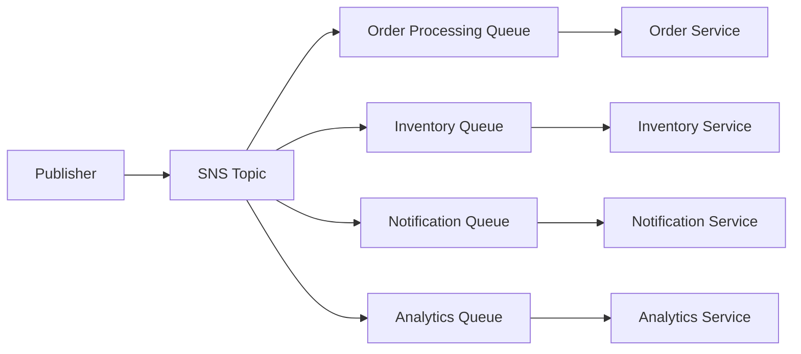
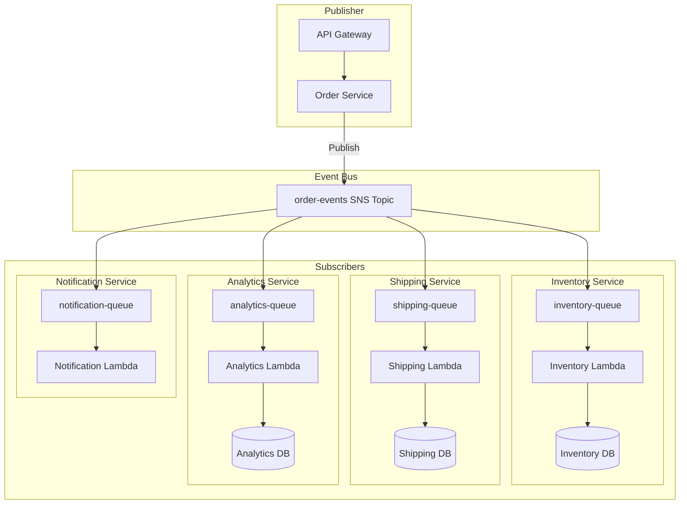
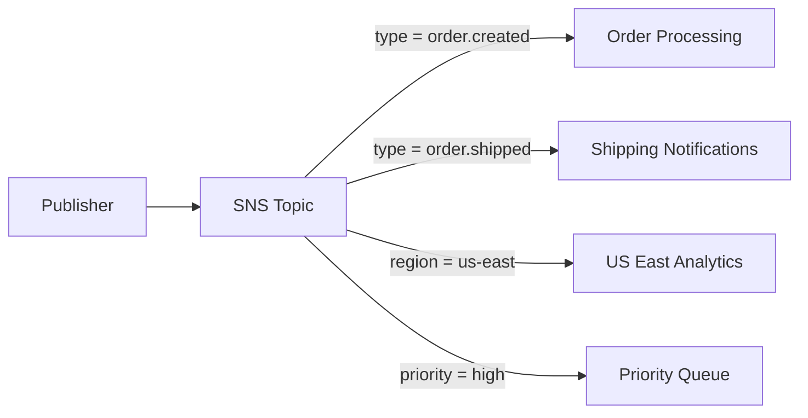
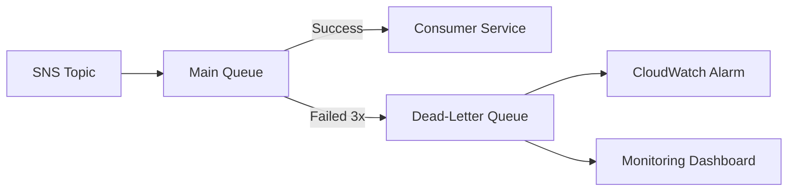
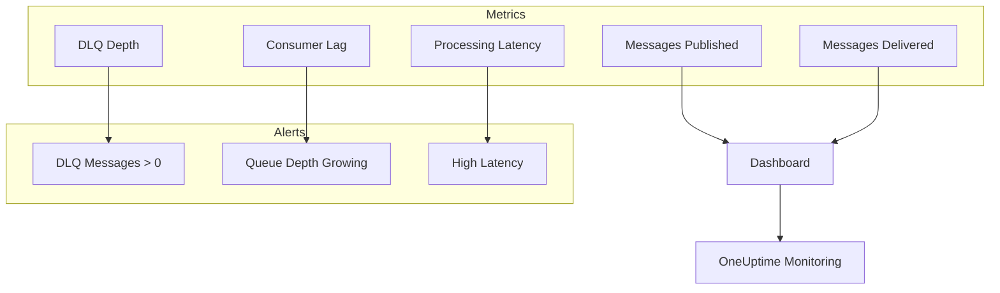

# How to Use SQS with SNS for Fan-Out

Author: [nawazdhandala](https://www.github.com/nawazdhandala)

Tags: AWS, SQS, SNS, Fan-Out, Messaging, Microservices, Event-Driven Architecture, DevOps

Description: Learn how to implement the fan-out pattern using AWS SNS and SQS for scalable event-driven architectures, including message filtering, dead-letter queues, and monitoring best practices.

---

> "The fan-out pattern is the backbone of scalable event-driven systems - one event, many subscribers, zero coupling." - Werner Vogels

When building distributed systems, you often need to broadcast a single event to multiple consumers. The fan-out pattern using AWS SNS (Simple Notification Service) and SQS (Simple Queue Service) provides a robust, scalable solution for this challenge. This guide walks you through implementing fan-out architectures with production-ready configurations.

## Understanding the Fan-Out Pattern

The fan-out pattern allows a single message published to SNS to be delivered to multiple SQS queues simultaneously. Each queue processes the message independently, enabling decoupled, parallel processing.



### Key Benefits

- **Decoupling**: Publishers don't need to know about subscribers
- **Scalability**: Each consumer scales independently
- **Reliability**: Messages are durably stored in queues
- **Flexibility**: Add or remove subscribers without changing the publisher

## Setting Up SNS to SQS Subscriptions

### Creating the SNS Topic

First, create an SNS topic that will receive messages from publishers.

```javascript
// createTopic.js
// Creates an SNS topic for order events
// This topic will be the central hub for all order-related messages

const { SNSClient, CreateTopicCommand } = require('@aws-sdk/client-sns');

// Initialize the SNS client with your AWS region
const snsClient = new SNSClient({ region: 'us-east-1' });

async function createOrderEventsTopic() {
  // Create the topic with a descriptive name
  const command = new CreateTopicCommand({
    Name: 'order-events',
    // Tags help with cost allocation and organization
    Tags: [
      { Key: 'Environment', Value: 'production' },
      { Key: 'Service', Value: 'orders' },
    ],
    // Enable server-side encryption for security
    Attributes: {
      KmsMasterKeyId: 'alias/aws/sns',
    },
  });

  const response = await snsClient.send(command);
  console.log('Topic ARN:', response.TopicArn);
  return response.TopicArn;
}

createOrderEventsTopic();
```

### Creating SQS Queues

Create multiple SQS queues that will subscribe to the SNS topic. Each queue serves a different purpose.

```javascript
// createQueues.js
// Creates SQS queues for different downstream services
// Each queue processes messages independently for its specific use case

const { SQSClient, CreateQueueCommand, GetQueueAttributesCommand } = require('@aws-sdk/client-sqs');

// Initialize SQS client
const sqsClient = new SQSClient({ region: 'us-east-1' });

async function createQueue(queueName, options = {}) {
  // Create the main queue with configurable settings
  const createCommand = new CreateQueueCommand({
    QueueName: queueName,
    Attributes: {
      // How long messages are invisible after being received (seconds)
      VisibilityTimeout: options.visibilityTimeout || '300',
      // How long messages stay in queue before deletion (seconds)
      MessageRetentionPeriod: options.retentionPeriod || '1209600', // 14 days
      // Long polling reduces empty responses and costs
      ReceiveMessageWaitTimeSeconds: '20',
      // Enable server-side encryption
      SseEnabled: 'true',
    },
  });

  const response = await sqsClient.send(createCommand);

  // Get the queue ARN for SNS subscription
  const attrCommand = new GetQueueAttributesCommand({
    QueueUrl: response.QueueUrl,
    AttributeNames: ['QueueArn'],
  });

  const attrResponse = await sqsClient.send(attrCommand);

  return {
    queueUrl: response.QueueUrl,
    queueArn: attrResponse.Attributes.QueueArn,
  };
}

async function setupFanOutQueues() {
  // Create queues for different services
  const queues = {
    // Order processing needs longer visibility for complex operations
    orderProcessing: await createQueue('order-processing-queue', {
      visibilityTimeout: '600',
    }),
    // Inventory updates should be fast
    inventory: await createQueue('inventory-update-queue', {
      visibilityTimeout: '60',
    }),
    // Notifications are fire-and-forget
    notifications: await createQueue('customer-notification-queue', {
      visibilityTimeout: '30',
    }),
    // Analytics can tolerate longer retention
    analytics: await createQueue('analytics-events-queue', {
      retentionPeriod: '604800', // 7 days
    }),
  };

  console.log('Created queues:', queues);
  return queues;
}

setupFanOutQueues();
```

### Subscribing Queues to the Topic

Subscribe each SQS queue to the SNS topic. You must also set up the proper IAM policies.

```javascript
// subscribeQueues.js
// Subscribes SQS queues to SNS topic and configures permissions
// This establishes the fan-out relationship between SNS and multiple SQS queues

const { SNSClient, SubscribeCommand } = require('@aws-sdk/client-sns');
const { SQSClient, SetQueueAttributesCommand } = require('@aws-sdk/client-sqs');

const snsClient = new SNSClient({ region: 'us-east-1' });
const sqsClient = new SQSClient({ region: 'us-east-1' });

async function allowSnsToSendToSqs(queueUrl, queueArn, topicArn) {
  // IAM policy allowing SNS to send messages to this queue
  // Without this policy, SNS subscription will fail silently
  const policy = {
    Version: '2012-10-17',
    Statement: [
      {
        Sid: 'AllowSNSMessages',
        Effect: 'Allow',
        Principal: {
          Service: 'sns.amazonaws.com',
        },
        Action: 'sqs:SendMessage',
        Resource: queueArn,
        // Restrict to only allow messages from our specific topic
        Condition: {
          ArnEquals: {
            'aws:SourceArn': topicArn,
          },
        },
      },
    ],
  };

  const command = new SetQueueAttributesCommand({
    QueueUrl: queueUrl,
    Attributes: {
      Policy: JSON.stringify(policy),
    },
  });

  await sqsClient.send(command);
}

async function subscribeQueueToTopic(topicArn, queueArn, queueUrl) {
  // First, set up permissions so SNS can send to this queue
  await allowSnsToSendToSqs(queueUrl, queueArn, topicArn);

  // Then create the subscription
  const command = new SubscribeCommand({
    TopicArn: topicArn,
    Protocol: 'sqs',
    Endpoint: queueArn,
    // Enable raw message delivery to skip SNS envelope wrapper
    Attributes: {
      RawMessageDelivery: 'true',
    },
  });

  const response = await snsClient.send(command);
  console.log('Subscription ARN:', response.SubscriptionArn);
  return response.SubscriptionArn;
}

// Example: Subscribe all queues to the topic
async function setupSubscriptions(topicArn, queues) {
  for (const [name, queue] of Object.entries(queues)) {
    console.log(`Subscribing ${name} queue to topic...`);
    await subscribeQueueToTopic(topicArn, queue.queueArn, queue.queueUrl);
  }
}
```

## Fan-Out Pattern Architecture

Here is a complete view of how the fan-out pattern works in a microservices architecture.



## Message Filtering

SNS message filtering allows each subscription to receive only the messages it cares about. This reduces costs and processing overhead.



### Setting Up Filter Policies

```javascript
// filterPolicies.js
// Configure SNS filter policies to route messages to specific queues
// Filters are evaluated against message attributes, not the message body

const { SNSClient, SetSubscriptionAttributesCommand } = require('@aws-sdk/client-sns');

const snsClient = new SNSClient({ region: 'us-east-1' });

async function setFilterPolicy(subscriptionArn, filterPolicy) {
  // Filter policy is a JSON object that matches against message attributes
  // Only messages matching the policy are delivered to this subscription
  const command = new SetSubscriptionAttributesCommand({
    SubscriptionArn: subscriptionArn,
    AttributeName: 'FilterPolicy',
    AttributeValue: JSON.stringify(filterPolicy),
  });

  await snsClient.send(command);
  console.log('Filter policy set:', filterPolicy);
}

// Example filter policies for different use cases
const filterPolicies = {
  // Only receive order.created and order.updated events
  orderProcessing: {
    eventType: ['order.created', 'order.updated'],
  },

  // Only receive events for shipped orders
  shippingNotifications: {
    eventType: ['order.shipped'],
  },

  // Only receive high-priority events
  priorityQueue: {
    priority: ['high', 'critical'],
  },

  // Receive events from specific regions
  usEastAnalytics: {
    region: ['us-east-1', 'us-east-2'],
  },

  // Complex filter: high-value orders from premium customers
  // Both conditions must match (AND logic)
  vipOrders: {
    customerTier: ['premium', 'enterprise'],
    orderValue: [{ numeric: ['>=', 1000] }],
  },

  // Exclude certain event types using anything-but operator
  generalQueue: {
    eventType: [{ 'anything-but': ['internal.debug', 'internal.test'] }],
  },
};

// Apply filter to a subscription
await setFilterPolicy(orderProcessingSubscriptionArn, filterPolicies.orderProcessing);
```

### Publishing Messages with Attributes

When publishing messages, include attributes that match your filter policies.

```javascript
// publishWithAttributes.js
// Publish messages with attributes for filtering
// Attributes determine which subscribers receive each message

const { SNSClient, PublishCommand } = require('@aws-sdk/client-sns');

const snsClient = new SNSClient({ region: 'us-east-1' });

async function publishOrderEvent(topicArn, orderEvent) {
  const command = new PublishCommand({
    TopicArn: topicArn,
    // The actual message payload - this is what subscribers will process
    Message: JSON.stringify(orderEvent),
    // Attributes used for filtering - these don't appear in the message body
    // but are used by SNS to route messages to the right subscribers
    MessageAttributes: {
      eventType: {
        DataType: 'String',
        StringValue: orderEvent.type,
      },
      priority: {
        DataType: 'String',
        StringValue: orderEvent.priority || 'normal',
      },
      region: {
        DataType: 'String',
        StringValue: orderEvent.region,
      },
      customerTier: {
        DataType: 'String',
        StringValue: orderEvent.customerTier,
      },
      // Numeric attributes enable range-based filtering
      orderValue: {
        DataType: 'Number',
        StringValue: String(orderEvent.total),
      },
    },
  });

  const response = await snsClient.send(command);
  console.log('Message ID:', response.MessageId);
  return response.MessageId;
}

// Example: Publish different events that route to different queues
async function publishExamples(topicArn) {
  // This goes to order processing and priority queues
  // because eventType matches and priority is high
  await publishOrderEvent(topicArn, {
    type: 'order.created',
    orderId: 'ORD-12345',
    customerId: 'CUST-789',
    customerTier: 'premium',
    total: 2500,
    region: 'us-east-1',
    priority: 'high',
    items: [
      { sku: 'PROD-001', quantity: 2 },
      { sku: 'PROD-002', quantity: 1 },
    ],
  });

  // This goes only to shipping notifications queue
  // because eventType is order.shipped
  await publishOrderEvent(topicArn, {
    type: 'order.shipped',
    orderId: 'ORD-12345',
    trackingNumber: '1Z999AA10123456784',
    carrier: 'UPS',
    region: 'us-east-1',
    priority: 'normal',
  });
}
```

## Dead-Letter Queues

Dead-letter queues (DLQs) capture messages that fail processing after multiple retries. This prevents message loss and enables debugging.



### Configuring DLQ for SQS

```javascript
// deadLetterQueues.js
// Set up dead-letter queues for failed message handling
// DLQs are essential for debugging and preventing message loss

const { SQSClient, CreateQueueCommand, SetQueueAttributesCommand, GetQueueAttributesCommand } = require('@aws-sdk/client-sqs');

const sqsClient = new SQSClient({ region: 'us-east-1' });

async function createQueueWithDLQ(queueName) {
  // Step 1: Create the dead-letter queue first
  // This must exist before we can reference it in the redrive policy
  const dlqCommand = new CreateQueueCommand({
    QueueName: `${queueName}-dlq`,
    Attributes: {
      // Keep failed messages for 14 days for analysis
      // This gives your team time to investigate and fix issues
      MessageRetentionPeriod: '1209600',
      // Encrypt sensitive data at rest
      SseEnabled: 'true',
    },
  });

  const dlqResponse = await sqsClient.send(dlqCommand);

  // Get DLQ ARN - we need this for the redrive policy
  const dlqAttrCommand = new GetQueueAttributesCommand({
    QueueUrl: dlqResponse.QueueUrl,
    AttributeNames: ['QueueArn'],
  });
  const dlqAttrResponse = await sqsClient.send(dlqAttrCommand);
  const dlqArn = dlqAttrResponse.Attributes.QueueArn;

  // Step 2: Create the main queue with redrive policy pointing to DLQ
  const mainQueueCommand = new CreateQueueCommand({
    QueueName: queueName,
    Attributes: {
      VisibilityTimeout: '300',
      MessageRetentionPeriod: '1209600',
      ReceiveMessageWaitTimeSeconds: '20',
      SseEnabled: 'true',
      // Redrive policy: send to DLQ after maxReceiveCount failed attempts
      // Each time a message becomes visible again counts as a receive
      RedrivePolicy: JSON.stringify({
        deadLetterTargetArn: dlqArn,
        maxReceiveCount: 3, // Number of retries before sending to DLQ
      }),
    },
  });

  const mainResponse = await sqsClient.send(mainQueueCommand);

  console.log('Main queue URL:', mainResponse.QueueUrl);
  console.log('DLQ URL:', dlqResponse.QueueUrl);

  return {
    mainQueueUrl: mainResponse.QueueUrl,
    dlqUrl: dlqResponse.QueueUrl,
    dlqArn: dlqArn,
  };
}

// Create queues with DLQ support for all fan-out subscribers
async function setupQueuesWithDLQ() {
  const queues = {
    orderProcessing: await createQueueWithDLQ('order-processing'),
    inventory: await createQueueWithDLQ('inventory-updates'),
    notifications: await createQueueWithDLQ('notifications'),
  };

  return queues;
}
```

### Processing Messages with Retry Logic

```javascript
// messageProcessor.js
// Robust message processor with error handling and retry support
// Messages that fail repeatedly are sent to DLQ automatically by SQS

const { SQSClient, ReceiveMessageCommand, DeleteMessageCommand, ChangeMessageVisibilityCommand } = require('@aws-sdk/client-sqs');

const sqsClient = new SQSClient({ region: 'us-east-1' });

async function processMessages(queueUrl, handler) {
  // Continuous polling loop for processing messages
  while (true) {
    try {
      // Long poll for messages (up to 20 seconds)
      // This is more efficient than short polling
      const receiveCommand = new ReceiveMessageCommand({
        QueueUrl: queueUrl,
        MaxNumberOfMessages: 10, // Process up to 10 messages at once
        WaitTimeSeconds: 20, // Long polling reduces API calls and costs
        AttributeNames: ['ApproximateReceiveCount'], // Track retry count
        MessageAttributeNames: ['All'], // Get all message attributes
      });

      const response = await sqsClient.send(receiveCommand);

      if (!response.Messages || response.Messages.length === 0) {
        continue; // No messages, keep polling
      }

      // Process each message
      for (const message of response.Messages) {
        const receiveCount = parseInt(message.Attributes?.ApproximateReceiveCount || '1');

        try {
          console.log(`Processing message (attempt ${receiveCount}):`, message.MessageId);

          // Parse and handle the message using the provided handler
          const body = JSON.parse(message.Body);
          await handler(body, message.MessageAttributes);

          // Delete message on success - this removes it from the queue
          await sqsClient.send(new DeleteMessageCommand({
            QueueUrl: queueUrl,
            ReceiptHandle: message.ReceiptHandle,
          }));

          console.log('Message processed successfully:', message.MessageId);
        } catch (error) {
          console.error(`Failed to process message (attempt ${receiveCount}):`, error.message);

          // If this is the last retry, log additional info before it goes to DLQ
          if (receiveCount >= 3) {
            console.error('Message will be sent to DLQ:', {
              messageId: message.MessageId,
              body: message.Body,
              error: error.message,
            });
          } else {
            // Extend visibility timeout for retry with exponential backoff
            // This gives more time between retries for transient issues to resolve
            const newVisibility = Math.min(300 * receiveCount, 900);
            await sqsClient.send(new ChangeMessageVisibilityCommand({
              QueueUrl: queueUrl,
              ReceiptHandle: message.ReceiptHandle,
              VisibilityTimeout: newVisibility,
            }));
          }
        }
      }
    } catch (error) {
      console.error('Error receiving messages:', error);
      // Wait before retrying on connection errors
      await new Promise(resolve => setTimeout(resolve, 5000));
    }
  }
}

// Example handler for order events
async function handleOrderEvent(event, attributes) {
  switch (event.type) {
    case 'order.created':
      await processNewOrder(event);
      break;
    case 'order.updated':
      await updateOrder(event);
      break;
    default:
      throw new Error(`Unknown event type: ${event.type}`);
  }
}

// Start processing
processMessages(orderProcessingQueueUrl, handleOrderEvent);
```

### Monitoring DLQ with CloudWatch Alarms

```javascript
// dlqAlarms.js
// Set up CloudWatch alarms for DLQ monitoring
// Alerts your team when messages fail processing

const { CloudWatchClient, PutMetricAlarmCommand } = require('@aws-sdk/client-cloudwatch');

const cloudWatchClient = new CloudWatchClient({ region: 'us-east-1' });

async function createDLQAlarm(queueName, snsAlertTopicArn) {
  const command = new PutMetricAlarmCommand({
    AlarmName: `${queueName}-dlq-messages`,
    AlarmDescription: `Alert when messages appear in ${queueName} DLQ`,
    // Monitor the number of visible messages in the DLQ
    MetricName: 'ApproximateNumberOfMessagesVisible',
    Namespace: 'AWS/SQS',
    Dimensions: [
      {
        Name: 'QueueName',
        Value: `${queueName}-dlq`,
      },
    ],
    Statistic: 'Sum',
    Period: 60, // Check every minute
    EvaluationPeriods: 1, // Alert after 1 evaluation period
    Threshold: 1, // Alert if any messages in DLQ
    ComparisonOperator: 'GreaterThanOrEqualToThreshold',
    ActionsEnabled: true,
    AlarmActions: [snsAlertTopicArn], // Send alert to SNS topic
    TreatMissingData: 'notBreaching',
  });

  await cloudWatchClient.send(command);
  console.log(`Created DLQ alarm for ${queueName}`);
}

// Create alarms for all DLQs in your fan-out architecture
async function setupDLQAlarms(alertTopicArn) {
  const queues = ['order-processing', 'inventory-updates', 'notifications'];

  for (const queue of queues) {
    await createDLQAlarm(queue, alertTopicArn);
  }
}
```

## Complete Terraform Configuration

Here is a complete Terraform configuration for deploying the fan-out pattern.

```hcl
# main.tf
# Complete SNS/SQS fan-out infrastructure
# Deploy with: terraform init && terraform apply

terraform {
  required_providers {
    aws = {
      source  = "hashicorp/aws"
      version = "~> 5.0"
    }
  }
}

provider "aws" {
  region = "us-east-1"
}

# SNS Topic - the central message hub for all order events
resource "aws_sns_topic" "order_events" {
  name              = "order-events"
  kms_master_key_id = "alias/aws/sns"

  tags = {
    Environment = "production"
    Service     = "orders"
  }
}

# Dead-letter queue for order processing
resource "aws_sqs_queue" "order_processing_dlq" {
  name                      = "order-processing-dlq"
  message_retention_seconds = 1209600 # 14 days
  sqs_managed_sse_enabled   = true

  tags = {
    Environment = "production"
    Type        = "dlq"
  }
}

# Main order processing queue with DLQ
resource "aws_sqs_queue" "order_processing" {
  name                       = "order-processing"
  visibility_timeout_seconds = 300
  message_retention_seconds  = 1209600
  receive_wait_time_seconds  = 20
  sqs_managed_sse_enabled    = true

  redrive_policy = jsonencode({
    deadLetterTargetArn = aws_sqs_queue.order_processing_dlq.arn
    maxReceiveCount     = 3
  })

  tags = {
    Environment = "production"
    Service     = "order-processor"
  }
}

# Allow SNS to send to order processing queue
resource "aws_sqs_queue_policy" "order_processing_policy" {
  queue_url = aws_sqs_queue.order_processing.id

  policy = jsonencode({
    Version = "2012-10-17"
    Statement = [
      {
        Sid       = "AllowSNS"
        Effect    = "Allow"
        Principal = { Service = "sns.amazonaws.com" }
        Action    = "sqs:SendMessage"
        Resource  = aws_sqs_queue.order_processing.arn
        Condition = {
          ArnEquals = {
            "aws:SourceArn" = aws_sns_topic.order_events.arn
          }
        }
      }
    ]
  })
}

# Subscribe order processing queue to SNS with filter
resource "aws_sns_topic_subscription" "order_processing" {
  topic_arn            = aws_sns_topic.order_events.arn
  protocol             = "sqs"
  endpoint             = aws_sqs_queue.order_processing.arn
  raw_message_delivery = true

  # Only receive order.created and order.updated events
  filter_policy = jsonencode({
    eventType = ["order.created", "order.updated"]
  })
}

# Notifications queue (similar pattern)
resource "aws_sqs_queue" "notifications_dlq" {
  name                      = "notifications-dlq"
  message_retention_seconds = 1209600
  sqs_managed_sse_enabled   = true
}

resource "aws_sqs_queue" "notifications" {
  name                       = "notifications"
  visibility_timeout_seconds = 60
  message_retention_seconds  = 86400 # 1 day
  receive_wait_time_seconds  = 20
  sqs_managed_sse_enabled    = true

  redrive_policy = jsonencode({
    deadLetterTargetArn = aws_sqs_queue.notifications_dlq.arn
    maxReceiveCount     = 3
  })
}

resource "aws_sqs_queue_policy" "notifications_policy" {
  queue_url = aws_sqs_queue.notifications.id

  policy = jsonencode({
    Version = "2012-10-17"
    Statement = [
      {
        Sid       = "AllowSNS"
        Effect    = "Allow"
        Principal = { Service = "sns.amazonaws.com" }
        Action    = "sqs:SendMessage"
        Resource  = aws_sqs_queue.notifications.arn
        Condition = {
          ArnEquals = {
            "aws:SourceArn" = aws_sns_topic.order_events.arn
          }
        }
      }
    ]
  })
}

resource "aws_sns_topic_subscription" "notifications" {
  topic_arn            = aws_sns_topic.order_events.arn
  protocol             = "sqs"
  endpoint             = aws_sqs_queue.notifications.arn
  raw_message_delivery = true

  # Receive shipped and delivered events for customer notifications
  filter_policy = jsonencode({
    eventType = ["order.shipped", "order.delivered"]
  })
}

# CloudWatch alarm for DLQ monitoring
resource "aws_cloudwatch_metric_alarm" "order_processing_dlq_alarm" {
  alarm_name          = "order-processing-dlq-messages"
  comparison_operator = "GreaterThanOrEqualToThreshold"
  evaluation_periods  = 1
  metric_name         = "ApproximateNumberOfMessagesVisible"
  namespace           = "AWS/SQS"
  period              = 60
  statistic           = "Sum"
  threshold           = 1
  alarm_description   = "Messages in order processing DLQ"

  dimensions = {
    QueueName = aws_sqs_queue.order_processing_dlq.name
  }

  # Add alarm actions as needed
  # alarm_actions = [aws_sns_topic.alerts.arn]
}

# Outputs for application configuration
output "sns_topic_arn" {
  value = aws_sns_topic.order_events.arn
}

output "order_processing_queue_url" {
  value = aws_sqs_queue.order_processing.url
}

output "notifications_queue_url" {
  value = aws_sqs_queue.notifications.url
}
```

## Testing the Fan-Out Setup

```javascript
// test-fanout.js
// End-to-end test for the fan-out configuration
// Verifies messages flow correctly through the system

const { SNSClient, PublishCommand } = require('@aws-sdk/client-sns');
const { SQSClient, ReceiveMessageCommand, DeleteMessageCommand, PurgeQueueCommand } = require('@aws-sdk/client-sqs');

const snsClient = new SNSClient({ region: 'us-east-1' });
const sqsClient = new SQSClient({ region: 'us-east-1' });

const TOPIC_ARN = process.env.SNS_TOPIC_ARN;
const QUEUES = {
  orderProcessing: process.env.ORDER_PROCESSING_QUEUE_URL,
  notifications: process.env.NOTIFICATIONS_QUEUE_URL,
};

async function purgeQueues() {
  // Clear queues before testing to ensure clean state
  for (const [name, url] of Object.entries(QUEUES)) {
    try {
      await sqsClient.send(new PurgeQueueCommand({ QueueUrl: url }));
      console.log(`Purged ${name} queue`);
    } catch (error) {
      // PurgeQueue has a 60-second cooldown between calls
      console.log(`Could not purge ${name}:`, error.message);
    }
  }
  // Wait for purge to complete
  await new Promise(resolve => setTimeout(resolve, 5000));
}

async function publishTestEvent(eventType) {
  const event = {
    type: eventType,
    orderId: `TEST-${Date.now()}`,
    timestamp: new Date().toISOString(),
  };

  await snsClient.send(new PublishCommand({
    TopicArn: TOPIC_ARN,
    Message: JSON.stringify(event),
    MessageAttributes: {
      eventType: { DataType: 'String', StringValue: eventType },
    },
  }));

  console.log(`Published ${eventType} event:`, event.orderId);
  return event.orderId;
}

async function checkQueue(queueUrl, expectedOrderId, timeout = 30000) {
  const startTime = Date.now();

  while (Date.now() - startTime < timeout) {
    const response = await sqsClient.send(new ReceiveMessageCommand({
      QueueUrl: queueUrl,
      WaitTimeSeconds: 5,
      MaxNumberOfMessages: 10,
    }));

    if (response.Messages) {
      for (const message of response.Messages) {
        const body = JSON.parse(message.Body);
        if (body.orderId === expectedOrderId) {
          // Clean up the message after verification
          await sqsClient.send(new DeleteMessageCommand({
            QueueUrl: queueUrl,
            ReceiptHandle: message.ReceiptHandle,
          }));
          return true;
        }
      }
    }
  }

  return false;
}

async function runTests() {
  console.log('Starting fan-out tests...\n');

  // Test 1: order.created should go to orderProcessing only
  console.log('Test 1: order.created event routing');
  const orderId1 = await publishTestEvent('order.created');

  const inOrderProcessing = await checkQueue(QUEUES.orderProcessing, orderId1);
  const inNotifications = await checkQueue(QUEUES.notifications, orderId1, 5000);

  console.log(`  Order Processing queue: ${inOrderProcessing ? 'RECEIVED' : 'NOT RECEIVED'}`);
  console.log(`  Notifications queue: ${inNotifications ? 'RECEIVED (unexpected!)' : 'NOT RECEIVED (expected)'}`);
  console.log(`  Result: ${inOrderProcessing && !inNotifications ? 'PASS' : 'FAIL'}\n`);

  // Test 2: order.shipped should go to notifications only
  console.log('Test 2: order.shipped event routing');
  const orderId2 = await publishTestEvent('order.shipped');

  const inOrderProcessing2 = await checkQueue(QUEUES.orderProcessing, orderId2, 5000);
  const inNotifications2 = await checkQueue(QUEUES.notifications, orderId2);

  console.log(`  Order Processing queue: ${inOrderProcessing2 ? 'RECEIVED (unexpected!)' : 'NOT RECEIVED (expected)'}`);
  console.log(`  Notifications queue: ${inNotifications2 ? 'RECEIVED' : 'NOT RECEIVED'}`);
  console.log(`  Result: ${!inOrderProcessing2 && inNotifications2 ? 'PASS' : 'FAIL'}\n`);

  console.log('Tests completed!');
}

runTests().catch(console.error);
```

## Monitoring Your Fan-Out Architecture

Monitoring is crucial for production fan-out systems. Track these key metrics.



For comprehensive monitoring of your SNS/SQS fan-out architecture, consider using [OneUptime](https://oneuptime.com). OneUptime provides:

- **Real-time metrics visualization** for queue depths, message rates, and processing latency
- **Intelligent alerting** with customizable thresholds and escalation policies
- **Dead-letter queue monitoring** with automatic incident creation
- **Distributed tracing** to follow messages through your entire pipeline
- **Status pages** to communicate system health to stakeholders

## Best Practices

### Message Design

```javascript
// Good message structure for fan-out systems
const goodMessage = {
  // Unique identifier for idempotency checks
  messageId: 'msg-uuid-12345',
  // Event type for routing via filter policies
  type: 'order.created',
  // ISO timestamp for ordering and debugging
  timestamp: '2026-01-27T10:30:00Z',
  // Version for schema evolution
  version: '1.0',
  // Actual payload
  data: {
    orderId: 'ORD-12345',
    customerId: 'CUST-789',
    items: [...],
  },
  // Metadata for tracing and debugging
  metadata: {
    correlationId: 'req-uuid-67890',
    source: 'checkout-service',
  },
};
```

### Error Handling Checklist

1. **Always configure DLQs** - Never lose messages
2. **Set appropriate visibility timeouts** - Match your processing time
3. **Implement idempotent handlers** - Messages may be delivered more than once
4. **Monitor DLQ depth** - Alert on any messages in DLQ
5. **Log correlation IDs** - Enable end-to-end tracing
6. **Test failure scenarios** - Verify DLQ routing works

### Cost Optimization

- Use **message filtering** to reduce unnecessary deliveries
- Enable **long polling** (20 seconds) to reduce API calls
- Use **batch operations** when possible
- Consider **FIFO queues** only when ordering is required (higher cost)

## Summary

| Component | Purpose |
|-----------|---------|
| **SNS Topic** | Central message hub for publishing |
| **SQS Queues** | Durable storage for each consumer |
| **Filter Policies** | Route messages to relevant queues |
| **Dead-Letter Queues** | Capture failed messages |
| **CloudWatch Alarms** | Alert on processing failures |

The SNS/SQS fan-out pattern provides a robust foundation for event-driven architectures. By combining message filtering, dead-letter queues, and proper monitoring, you can build scalable systems that gracefully handle failures and grow with your needs.
