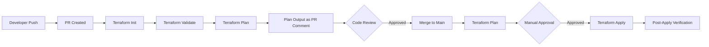
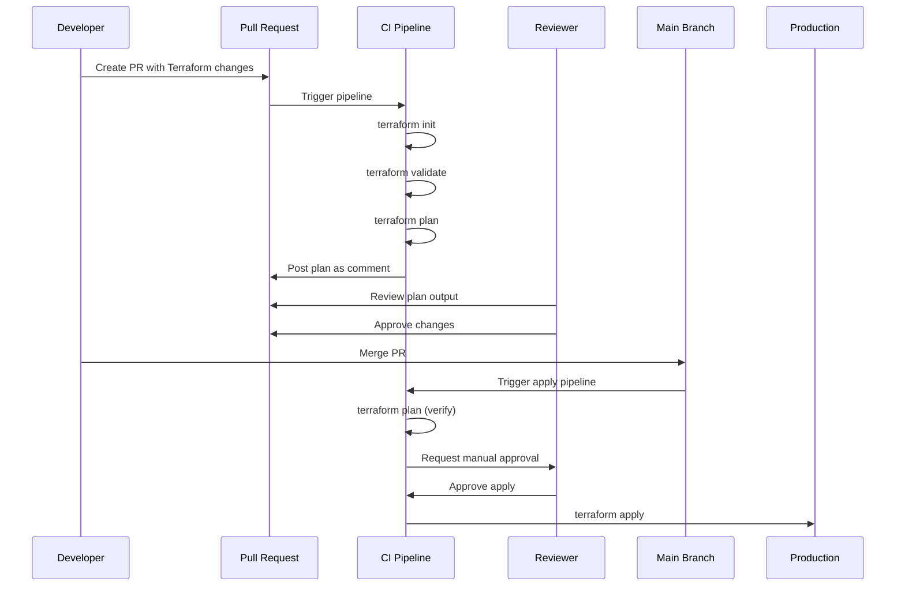
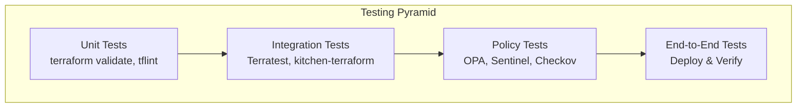
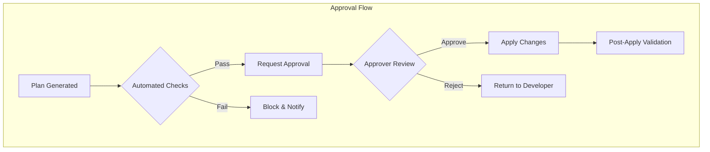
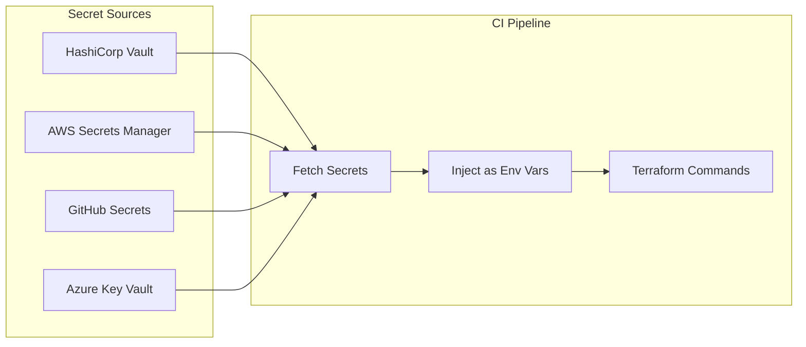

# How to Implement Terraform CI/CD Pipelines

By [Nawaz Dhandala](https://github.com/nawazdhandala)

Tags: Terraform, CI/CD, Infrastructure as Code, DevOps, Automation, GitOps, GitHub Actions, GitLab CI

Description: A comprehensive guide to implementing Terraform CI/CD pipelines with plan and apply stages, pull request workflows, approval gates, and state management best practices for reliable infrastructure automation.

---

> "Infrastructure as code is only as good as the pipeline that delivers it. Without proper CI/CD, you're just writing scripts with extra steps." - HashiCorp Best Practices

## Why Terraform CI/CD Pipelines Matter

Manual Terraform executions introduce risk. Engineers running `terraform apply` from their laptops can lead to:

- **Inconsistent state**: Different versions of Terraform or providers across team members
- **Audit gaps**: No clear record of who changed what and when
- **Human error**: Accidental applies to production without proper review
- **Security risks**: Credentials stored locally instead of secure vaults

CI/CD pipelines solve these problems by providing a controlled, auditable, and repeatable process for infrastructure changes.

## Pipeline Architecture Overview

Before diving into implementation, let's understand the typical flow of a Terraform CI/CD pipeline.



## Plan and Apply Stages

The foundation of any Terraform pipeline is separating the plan and apply stages. This separation enables review before changes are made.

### GitHub Actions Implementation

```yaml
# .github/workflows/terraform.yml
# This workflow runs on pull requests and pushes to main
# PR events trigger plan-only, main branch triggers plan + apply

name: Terraform CI/CD

on:
  pull_request:
    branches: [main]
    paths:
      - 'terraform/**'  # Only trigger when terraform files change
  push:
    branches: [main]
    paths:
      - 'terraform/**'

# Ensure only one workflow runs at a time to prevent state conflicts
concurrency:
  group: terraform-${{ github.ref }}
  cancel-in-progress: false

env:
  TF_VERSION: '1.7.0'
  TF_WORKING_DIR: 'terraform'

jobs:
  # Plan stage runs on both PR and push events
  plan:
    name: Terraform Plan
    runs-on: ubuntu-latest
    outputs:
      # Export plan exit code for downstream jobs
      plan_exitcode: ${{ steps.plan.outputs.exitcode }}

    steps:
      - name: Checkout Repository
        uses: actions/checkout@v4

      - name: Setup Terraform
        uses: hashicorp/setup-terraform@v3
        with:
          terraform_version: ${{ env.TF_VERSION }}
          # Enable wrapper to capture output
          terraform_wrapper: true

      - name: Terraform Init
        id: init
        working-directory: ${{ env.TF_WORKING_DIR }}
        run: |
          # Initialize with backend configuration
          # -input=false prevents interactive prompts in CI
          terraform init -input=false -backend=true
        env:
          # AWS credentials for S3 backend
          AWS_ACCESS_KEY_ID: ${{ secrets.AWS_ACCESS_KEY_ID }}
          AWS_SECRET_ACCESS_KEY: ${{ secrets.AWS_SECRET_ACCESS_KEY }}

      - name: Terraform Validate
        id: validate
        working-directory: ${{ env.TF_WORKING_DIR }}
        run: |
          # Validate configuration syntax and internal consistency
          terraform validate -no-color

      - name: Terraform Plan
        id: plan
        working-directory: ${{ env.TF_WORKING_DIR }}
        # continue-on-error allows capturing the exit code
        continue-on-error: true
        run: |
          # Generate plan and save to file for apply stage
          # -detailed-exitcode returns:
          #   0 = no changes
          #   1 = error
          #   2 = changes present
          terraform plan \
            -input=false \
            -detailed-exitcode \
            -out=tfplan \
            -no-color
        env:
          AWS_ACCESS_KEY_ID: ${{ secrets.AWS_ACCESS_KEY_ID }}
          AWS_SECRET_ACCESS_KEY: ${{ secrets.AWS_SECRET_ACCESS_KEY }}

      - name: Upload Plan Artifact
        uses: actions/upload-artifact@v4
        with:
          name: terraform-plan
          path: ${{ env.TF_WORKING_DIR }}/tfplan
          retention-days: 5

      # Post plan output as PR comment for easy review
      - name: Comment Plan on PR
        if: github.event_name == 'pull_request'
        uses: actions/github-script@v7
        with:
          script: |
            const output = `#### Terraform Plan Results

            | Step | Status |
            |------|--------|
            | Init | ${{ steps.init.outcome }} |
            | Validate | ${{ steps.validate.outcome }} |
            | Plan | ${{ steps.plan.outcome }} |

            <details><summary>Show Plan Output</summary>

            \`\`\`terraform
            ${{ steps.plan.outputs.stdout }}
            \`\`\`

            </details>

            *Pusher: @${{ github.actor }}, Action: \`${{ github.event_name }}\`*`;

            github.rest.issues.createComment({
              issue_number: context.issue.number,
              owner: context.repo.owner,
              repo: context.repo.repo,
              body: output
            });

  # Apply stage only runs on main branch after merge
  apply:
    name: Terraform Apply
    needs: plan
    runs-on: ubuntu-latest
    # Only run on main branch, not on PRs
    if: github.ref == 'refs/heads/main' && github.event_name == 'push'
    # Require manual approval via GitHub Environment
    environment:
      name: production
      url: https://console.aws.amazon.com

    steps:
      - name: Checkout Repository
        uses: actions/checkout@v4

      - name: Setup Terraform
        uses: hashicorp/setup-terraform@v3
        with:
          terraform_version: ${{ env.TF_VERSION }}

      - name: Download Plan Artifact
        uses: actions/download-artifact@v4
        with:
          name: terraform-plan
          path: ${{ env.TF_WORKING_DIR }}

      - name: Terraform Init
        working-directory: ${{ env.TF_WORKING_DIR }}
        run: terraform init -input=false
        env:
          AWS_ACCESS_KEY_ID: ${{ secrets.AWS_ACCESS_KEY_ID }}
          AWS_SECRET_ACCESS_KEY: ${{ secrets.AWS_SECRET_ACCESS_KEY }}

      - name: Terraform Apply
        working-directory: ${{ env.TF_WORKING_DIR }}
        run: |
          # Apply the saved plan file
          # This ensures we apply exactly what was reviewed
          terraform apply -input=false -auto-approve tfplan
        env:
          AWS_ACCESS_KEY_ID: ${{ secrets.AWS_ACCESS_KEY_ID }}
          AWS_SECRET_ACCESS_KEY: ${{ secrets.AWS_SECRET_ACCESS_KEY }}
```

### GitLab CI Implementation

```yaml
# .gitlab-ci.yml
# GitLab CI/CD pipeline for Terraform with manual approval gates

stages:
  - validate
  - plan
  - apply

# Default settings for all jobs
default:
  image: hashicorp/terraform:1.7.0
  # Cache Terraform providers and modules
  cache:
    key: terraform-cache
    paths:
      - .terraform/

# Variables available to all jobs
variables:
  TF_ROOT: ${CI_PROJECT_DIR}/terraform
  TF_STATE_NAME: default

# Template for Terraform initialization
.terraform_init: &terraform_init
  before_script:
    - cd ${TF_ROOT}
    # Initialize with GitLab-managed state backend
    - |
      terraform init \
        -backend-config="address=${CI_API_V4_URL}/projects/${CI_PROJECT_ID}/terraform/state/${TF_STATE_NAME}" \
        -backend-config="lock_address=${CI_API_V4_URL}/projects/${CI_PROJECT_ID}/terraform/state/${TF_STATE_NAME}/lock" \
        -backend-config="unlock_address=${CI_API_V4_URL}/projects/${CI_PROJECT_ID}/terraform/state/${TF_STATE_NAME}/lock" \
        -backend-config="username=gitlab-ci-token" \
        -backend-config="password=${CI_JOB_TOKEN}" \
        -backend-config="lock_method=POST" \
        -backend-config="unlock_method=DELETE" \
        -backend-config="retry_wait_min=5"

# Validate Terraform configuration
validate:
  stage: validate
  <<: *terraform_init
  script:
    - terraform validate
    - terraform fmt -check -recursive
  rules:
    # Run on merge requests and main branch
    - if: $CI_MERGE_REQUEST_IID
    - if: $CI_COMMIT_BRANCH == $CI_DEFAULT_BRANCH

# Generate and display plan
plan:
  stage: plan
  <<: *terraform_init
  script:
    # Create plan and save as artifact
    - terraform plan -out=plan.tfplan
    # Generate human-readable plan for review
    - terraform show -no-color plan.tfplan > plan.txt
  artifacts:
    name: terraform-plan
    paths:
      - ${TF_ROOT}/plan.tfplan
      - ${TF_ROOT}/plan.txt
    expire_in: 1 week
    # Expose plan in merge request
    reports:
      terraform: ${TF_ROOT}/plan.json
  rules:
    - if: $CI_MERGE_REQUEST_IID
    - if: $CI_COMMIT_BRANCH == $CI_DEFAULT_BRANCH

# Apply changes with manual approval
apply:
  stage: apply
  <<: *terraform_init
  script:
    - terraform apply -input=false plan.tfplan
  dependencies:
    - plan
  rules:
    # Only run on main branch after merge
    - if: $CI_COMMIT_BRANCH == $CI_DEFAULT_BRANCH
      # Require manual trigger for production safety
      when: manual
  # Protect against accidental triggers
  allow_failure: false
```

## PR-Based Workflows

Pull request workflows enable code review for infrastructure changes, catching issues before they reach production.



### Atlantis for Advanced PR Workflows

Atlantis is a popular tool for Terraform pull request automation that provides a more sophisticated workflow.

```yaml
# atlantis.yaml
# Atlantis server-side configuration for multi-environment workflows

version: 3
automerge: false
delete_source_branch_on_merge: true

# Define multiple projects for different environments
projects:
  - name: infrastructure-dev
    dir: terraform/environments/dev
    workspace: dev
    terraform_version: v1.7.0
    # Automatically plan when these files change
    autoplan:
      when_modified:
        - "*.tf"
        - "*.tfvars"
        - "../modules/**/*.tf"
      enabled: true
    # Apply requires explicit comment
    apply_requirements:
      - approved
      - mergeable

  - name: infrastructure-staging
    dir: terraform/environments/staging
    workspace: staging
    terraform_version: v1.7.0
    autoplan:
      when_modified:
        - "*.tf"
        - "*.tfvars"
        - "../modules/**/*.tf"
      enabled: true
    apply_requirements:
      - approved
      - mergeable

  - name: infrastructure-prod
    dir: terraform/environments/prod
    workspace: prod
    terraform_version: v1.7.0
    autoplan:
      when_modified:
        - "*.tf"
        - "*.tfvars"
        - "../modules/**/*.tf"
      enabled: true
    # Production requires additional approvals
    apply_requirements:
      - approved
      - mergeable
      # Require at least 2 approvals for production
    workflow: production

# Custom workflow for production with extra checks
workflows:
  production:
    plan:
      steps:
        - init
        - plan:
            extra_args:
              - "-var-file=prod.tfvars"
    apply:
      steps:
        # Run policy checks before apply
        - run: |
            echo "Running compliance checks..."
            # Add OPA/Sentinel policy checks here
        - apply
```

### Using PR Comments for Terraform Commands

```yaml
# .github/workflows/atlantis-style.yml
# Respond to PR comments like "terraform plan" or "terraform apply"

name: Terraform PR Commands

on:
  issue_comment:
    types: [created]

jobs:
  terraform-command:
    # Only run on PR comments, not issue comments
    if: github.event.issue.pull_request && contains(github.event.comment.body, 'terraform')
    runs-on: ubuntu-latest

    steps:
      - name: Check User Permission
        id: permission
        uses: actions/github-script@v7
        with:
          script: |
            // Verify commenter has write access
            const { data: permission } = await github.rest.repos.getCollaboratorPermissionLevel({
              owner: context.repo.owner,
              repo: context.repo.repo,
              username: context.actor
            });

            const allowed = ['admin', 'write'].includes(permission.permission);
            core.setOutput('allowed', allowed);

            if (!allowed) {
              core.setFailed('User does not have permission to run Terraform commands');
            }

      - name: Get PR Branch
        if: steps.permission.outputs.allowed == 'true'
        id: pr
        uses: actions/github-script@v7
        with:
          script: |
            const { data: pr } = await github.rest.pulls.get({
              owner: context.repo.owner,
              repo: context.repo.repo,
              pull_number: context.issue.number
            });
            core.setOutput('ref', pr.head.ref);
            core.setOutput('sha', pr.head.sha);

      - name: Checkout PR Branch
        if: steps.permission.outputs.allowed == 'true'
        uses: actions/checkout@v4
        with:
          ref: ${{ steps.pr.outputs.ref }}

      - name: Setup Terraform
        if: steps.permission.outputs.allowed == 'true'
        uses: hashicorp/setup-terraform@v3

      - name: Parse Command
        if: steps.permission.outputs.allowed == 'true'
        id: command
        run: |
          COMMENT="${{ github.event.comment.body }}"

          # Extract terraform command from comment
          if [[ "$COMMENT" == *"terraform plan"* ]]; then
            echo "command=plan" >> $GITHUB_OUTPUT
          elif [[ "$COMMENT" == *"terraform apply"* ]]; then
            echo "command=apply" >> $GITHUB_OUTPUT
          else
            echo "command=none" >> $GITHUB_OUTPUT
          fi

      - name: Terraform Init
        if: steps.command.outputs.command != 'none'
        working-directory: terraform
        run: terraform init
        env:
          AWS_ACCESS_KEY_ID: ${{ secrets.AWS_ACCESS_KEY_ID }}
          AWS_SECRET_ACCESS_KEY: ${{ secrets.AWS_SECRET_ACCESS_KEY }}

      - name: Terraform Plan
        if: steps.command.outputs.command == 'plan'
        id: plan
        working-directory: terraform
        run: terraform plan -no-color
        env:
          AWS_ACCESS_KEY_ID: ${{ secrets.AWS_ACCESS_KEY_ID }}
          AWS_SECRET_ACCESS_KEY: ${{ secrets.AWS_SECRET_ACCESS_KEY }}

      - name: Post Plan Result
        if: steps.command.outputs.command == 'plan'
        uses: actions/github-script@v7
        with:
          script: |
            const output = `### Terraform Plan Result

            \`\`\`
            ${{ steps.plan.outputs.stdout }}
            \`\`\`

            Comment \`terraform apply\` to apply these changes.`;

            github.rest.issues.createComment({
              issue_number: context.issue.number,
              owner: context.repo.owner,
              repo: context.repo.repo,
              body: output
            });
```

## Automated Testing

Testing infrastructure code is crucial for catching issues before they impact production.



### Static Analysis with tflint and Checkov

```yaml
# .github/workflows/terraform-tests.yml
# Comprehensive testing pipeline for Terraform

name: Terraform Tests

on:
  pull_request:
    paths:
      - 'terraform/**'

jobs:
  static-analysis:
    name: Static Analysis
    runs-on: ubuntu-latest

    steps:
      - name: Checkout
        uses: actions/checkout@v4

      # Terraform native validation
      - name: Setup Terraform
        uses: hashicorp/setup-terraform@v3

      - name: Terraform Format Check
        run: terraform fmt -check -recursive terraform/

      - name: Terraform Init
        working-directory: terraform
        run: terraform init -backend=false

      - name: Terraform Validate
        working-directory: terraform
        run: terraform validate

      # TFLint for Terraform-specific linting
      - name: Setup TFLint
        uses: terraform-linters/setup-tflint@v4
        with:
          tflint_version: v0.50.0

      - name: Init TFLint
        run: tflint --init
        working-directory: terraform
        env:
          GITHUB_TOKEN: ${{ secrets.GITHUB_TOKEN }}

      - name: Run TFLint
        run: tflint --recursive --format=compact
        working-directory: terraform

      # Checkov for security and compliance
      - name: Run Checkov
        uses: bridgecrewio/checkov-action@v12
        with:
          directory: terraform/
          # Skip specific checks if needed
          skip_check: CKV_AWS_79,CKV_AWS_144
          # Output format for PR comment
          output_format: cli,sarif
          output_file_path: console,results.sarif
          # Fail on high and critical
          soft_fail: false

      - name: Upload SARIF
        if: always()
        uses: github/codeql-action/upload-sarif@v3
        with:
          sarif_file: results.sarif

  # Integration tests using Terratest
  integration-tests:
    name: Integration Tests
    runs-on: ubuntu-latest
    needs: static-analysis

    steps:
      - name: Checkout
        uses: actions/checkout@v4

      - name: Setup Go
        uses: actions/setup-go@v5
        with:
          go-version: '1.21'

      - name: Setup Terraform
        uses: hashicorp/setup-terraform@v3
        with:
          terraform_wrapper: false

      - name: Run Terratest
        working-directory: terraform/tests
        run: |
          go mod download
          go test -v -timeout 30m ./...
        env:
          AWS_ACCESS_KEY_ID: ${{ secrets.AWS_ACCESS_KEY_ID }}
          AWS_SECRET_ACCESS_KEY: ${{ secrets.AWS_SECRET_ACCESS_KEY }}
          AWS_REGION: us-east-1
```

### Terratest Example

```go
// terraform/tests/vpc_test.go
// Integration test for VPC module using Terratest

package test

import (
	"testing"
	"time"

	"github.com/gruntwork-io/terratest/modules/aws"
	"github.com/gruntwork-io/terratest/modules/terraform"
	"github.com/stretchr/testify/assert"
	"github.com/stretchr/testify/require"
)

// TestVPCModule validates the VPC module creates expected resources
func TestVPCModule(t *testing.T) {
	t.Parallel()

	// Use a unique name to avoid conflicts with parallel tests
	uniqueID := random.UniqueId()
	awsRegion := "us-east-1"

	// Configure Terraform options
	terraformOptions := terraform.WithDefaultRetryableErrors(t, &terraform.Options{
		// Path to the Terraform code to test
		TerraformDir: "../modules/vpc",

		// Variables to pass to Terraform
		Vars: map[string]interface{}{
			"vpc_name":           fmt.Sprintf("test-vpc-%s", uniqueID),
			"cidr_block":         "10.0.0.0/16",
			"availability_zones": []string{"us-east-1a", "us-east-1b"},
			"enable_nat_gateway": true,
			"tags": map[string]string{
				"Environment": "test",
				"ManagedBy":   "terratest",
			},
		},

		// Environment variables for AWS provider
		EnvVars: map[string]string{
			"AWS_DEFAULT_REGION": awsRegion,
		},
	})

	// Clean up resources after test completes
	defer terraform.Destroy(t, terraformOptions)

	// Deploy the infrastructure
	terraform.InitAndApply(t, terraformOptions)

	// Retrieve outputs
	vpcID := terraform.Output(t, terraformOptions, "vpc_id")
	publicSubnetIDs := terraform.OutputList(t, terraformOptions, "public_subnet_ids")
	privateSubnetIDs := terraform.OutputList(t, terraformOptions, "private_subnet_ids")

	// Validate VPC was created
	require.NotEmpty(t, vpcID, "VPC ID should not be empty")

	// Verify VPC exists in AWS
	vpc := aws.GetVpcById(t, vpcID, awsRegion)
	assert.Equal(t, "10.0.0.0/16", *vpc.CidrBlock)

	// Verify correct number of subnets
	assert.Len(t, publicSubnetIDs, 2, "Should have 2 public subnets")
	assert.Len(t, privateSubnetIDs, 2, "Should have 2 private subnets")

	// Verify subnets have correct tags
	for _, subnetID := range publicSubnetIDs {
		subnet := aws.GetSubnetById(t, subnetID, awsRegion)
		assert.Contains(t, aws.GetTagsForSubnet(t, subnetID, awsRegion), "public")
	}
}

// TestVPCConnectivity validates network connectivity
func TestVPCConnectivity(t *testing.T) {
	t.Parallel()

	// Deploy test infrastructure
	terraformOptions := &terraform.Options{
		TerraformDir: "../modules/vpc",
		Vars: map[string]interface{}{
			"vpc_name":           "connectivity-test",
			"cidr_block":         "10.1.0.0/16",
			"enable_nat_gateway": true,
		},
	}

	defer terraform.Destroy(t, terraformOptions)
	terraform.InitAndApply(t, terraformOptions)

	// Test that NAT Gateway allows outbound connectivity
	// This would typically involve deploying a test EC2 instance
	// and verifying it can reach the internet
}
```

### Policy as Code with OPA

```rego
# terraform/policies/security.rego
# Open Policy Agent rules for Terraform security compliance

package terraform.security

import future.keywords.in
import future.keywords.every

# Deny resources without required tags
deny[msg] {
    resource := input.resource_changes[_]
    resource.change.actions[_] == "create"

    # Check for required tags
    required_tags := {"Environment", "Owner", "Project"}
    provided_tags := {tag | tag := resource.change.after.tags[_]}
    missing := required_tags - provided_tags

    count(missing) > 0

    msg := sprintf(
        "Resource '%s' is missing required tags: %v",
        [resource.address, missing]
    )
}

# Deny public S3 buckets
deny[msg] {
    resource := input.resource_changes[_]
    resource.type == "aws_s3_bucket"
    resource.change.actions[_] == "create"

    # Check for public access settings
    acl := resource.change.after.acl
    acl == "public-read"

    msg := sprintf(
        "S3 bucket '%s' has public-read ACL which is not allowed",
        [resource.address]
    )
}

# Deny unencrypted RDS instances
deny[msg] {
    resource := input.resource_changes[_]
    resource.type == "aws_db_instance"
    resource.change.actions[_] == "create"

    not resource.change.after.storage_encrypted

    msg := sprintf(
        "RDS instance '%s' must have encryption enabled",
        [resource.address]
    )
}

# Deny overly permissive security groups
deny[msg] {
    resource := input.resource_changes[_]
    resource.type == "aws_security_group_rule"
    resource.change.actions[_] == "create"

    resource.change.after.type == "ingress"
    resource.change.after.cidr_blocks[_] == "0.0.0.0/0"
    resource.change.after.from_port == 0
    resource.change.after.to_port == 65535

    msg := sprintf(
        "Security group rule '%s' allows all traffic from anywhere",
        [resource.address]
    )
}

# Require specific instance types for cost control
deny[msg] {
    resource := input.resource_changes[_]
    resource.type == "aws_instance"
    resource.change.actions[_] == "create"

    # Define allowed instance types
    allowed_types := {
        "t3.micro", "t3.small", "t3.medium",
        "t3a.micro", "t3a.small", "t3a.medium"
    }

    instance_type := resource.change.after.instance_type
    not instance_type in allowed_types

    msg := sprintf(
        "Instance '%s' uses type '%s' which is not in allowed list: %v",
        [resource.address, instance_type, allowed_types]
    )
}
```

### Running OPA Policy Checks in CI

```yaml
# .github/workflows/policy-check.yml
# Policy validation using Open Policy Agent

name: Policy Check

on:
  pull_request:
    paths:
      - 'terraform/**'

jobs:
  policy-check:
    name: OPA Policy Check
    runs-on: ubuntu-latest

    steps:
      - name: Checkout
        uses: actions/checkout@v4

      - name: Setup Terraform
        uses: hashicorp/setup-terraform@v3

      - name: Setup OPA
        uses: open-policy-agent/setup-opa@v2
        with:
          version: latest

      - name: Terraform Init
        working-directory: terraform
        run: terraform init

      - name: Generate Plan JSON
        working-directory: terraform
        run: |
          # Generate plan and convert to JSON for OPA
          terraform plan -out=tfplan
          terraform show -json tfplan > tfplan.json
        env:
          AWS_ACCESS_KEY_ID: ${{ secrets.AWS_ACCESS_KEY_ID }}
          AWS_SECRET_ACCESS_KEY: ${{ secrets.AWS_SECRET_ACCESS_KEY }}

      - name: Evaluate Policies
        run: |
          # Run OPA evaluation against the plan
          opa eval \
            --input terraform/tfplan.json \
            --data terraform/policies/ \
            --format pretty \
            'data.terraform.security.deny'

          # Fail if any denies are present
          DENIES=$(opa eval \
            --input terraform/tfplan.json \
            --data terraform/policies/ \
            --format json \
            'data.terraform.security.deny' | jq '.result | length')

          if [ "$DENIES" -gt 0 ]; then
            echo "Policy violations found!"
            exit 1
          fi
```

## Approval Gates

Implementing approval gates ensures human oversight before infrastructure changes reach production.



### GitHub Environments for Approval Gates

```yaml
# .github/workflows/terraform-with-approvals.yml
# Multi-environment deployment with approval gates

name: Terraform Deploy

on:
  push:
    branches: [main]
    paths:
      - 'terraform/**'

jobs:
  plan-dev:
    name: Plan Development
    runs-on: ubuntu-latest
    outputs:
      has_changes: ${{ steps.plan.outputs.has_changes }}
    steps:
      - uses: actions/checkout@v4
      - uses: hashicorp/setup-terraform@v3

      - name: Terraform Plan Dev
        id: plan
        working-directory: terraform/environments/dev
        run: |
          terraform init
          terraform plan -detailed-exitcode -out=tfplan || exit_code=$?

          # Check if there are changes (exit code 2)
          if [ "$exit_code" == "2" ]; then
            echo "has_changes=true" >> $GITHUB_OUTPUT
          else
            echo "has_changes=false" >> $GITHUB_OUTPUT
          fi

      - uses: actions/upload-artifact@v4
        with:
          name: plan-dev
          path: terraform/environments/dev/tfplan

  deploy-dev:
    name: Deploy Development
    needs: plan-dev
    if: needs.plan-dev.outputs.has_changes == 'true'
    runs-on: ubuntu-latest
    # Development environment - auto-approve
    environment:
      name: development
    steps:
      - uses: actions/checkout@v4
      - uses: hashicorp/setup-terraform@v3
      - uses: actions/download-artifact@v4
        with:
          name: plan-dev
          path: terraform/environments/dev

      - name: Apply Dev
        working-directory: terraform/environments/dev
        run: |
          terraform init
          terraform apply -auto-approve tfplan

  plan-staging:
    name: Plan Staging
    needs: deploy-dev
    runs-on: ubuntu-latest
    outputs:
      has_changes: ${{ steps.plan.outputs.has_changes }}
    steps:
      - uses: actions/checkout@v4
      - uses: hashicorp/setup-terraform@v3

      - name: Terraform Plan Staging
        id: plan
        working-directory: terraform/environments/staging
        run: |
          terraform init
          terraform plan -detailed-exitcode -out=tfplan || exit_code=$?
          if [ "$exit_code" == "2" ]; then
            echo "has_changes=true" >> $GITHUB_OUTPUT
          else
            echo "has_changes=false" >> $GITHUB_OUTPUT
          fi

      - uses: actions/upload-artifact@v4
        with:
          name: plan-staging
          path: terraform/environments/staging/tfplan

  deploy-staging:
    name: Deploy Staging
    needs: plan-staging
    if: needs.plan-staging.outputs.has_changes == 'true'
    runs-on: ubuntu-latest
    # Staging requires manual approval
    environment:
      name: staging
      url: https://staging.example.com
    steps:
      - uses: actions/checkout@v4
      - uses: hashicorp/setup-terraform@v3
      - uses: actions/download-artifact@v4
        with:
          name: plan-staging
          path: terraform/environments/staging

      - name: Apply Staging
        working-directory: terraform/environments/staging
        run: |
          terraform init
          terraform apply -auto-approve tfplan

  plan-production:
    name: Plan Production
    needs: deploy-staging
    runs-on: ubuntu-latest
    outputs:
      has_changes: ${{ steps.plan.outputs.has_changes }}
    steps:
      - uses: actions/checkout@v4
      - uses: hashicorp/setup-terraform@v3

      - name: Terraform Plan Production
        id: plan
        working-directory: terraform/environments/prod
        run: |
          terraform init
          terraform plan -detailed-exitcode -out=tfplan || exit_code=$?
          if [ "$exit_code" == "2" ]; then
            echo "has_changes=true" >> $GITHUB_OUTPUT
          else
            echo "has_changes=false" >> $GITHUB_OUTPUT
          fi

      - uses: actions/upload-artifact@v4
        with:
          name: plan-prod
          path: terraform/environments/prod/tfplan

  deploy-production:
    name: Deploy Production
    needs: plan-production
    if: needs.plan-production.outputs.has_changes == 'true'
    runs-on: ubuntu-latest
    # Production requires approval from specific team
    environment:
      name: production
      url: https://example.com
    steps:
      - uses: actions/checkout@v4
      - uses: hashicorp/setup-terraform@v3
      - uses: actions/download-artifact@v4
        with:
          name: plan-prod
          path: terraform/environments/prod

      - name: Apply Production
        working-directory: terraform/environments/prod
        run: |
          terraform init
          terraform apply -auto-approve tfplan

      # Notify on successful deployment
      - name: Notify Slack
        uses: slackapi/slack-github-action@v1
        with:
          payload: |
            {
              "text": "Production deployment completed successfully",
              "blocks": [
                {
                  "type": "section",
                  "text": {
                    "type": "mrkdwn",
                    "text": "*Production Deployment Complete*\nCommit: ${{ github.sha }}\nActor: ${{ github.actor }}"
                  }
                }
              ]
            }
        env:
          SLACK_WEBHOOK_URL: ${{ secrets.SLACK_WEBHOOK_URL }}
```

## Secret Management in CI

Handling secrets securely is critical for Terraform pipelines. Never store credentials in code or plain environment variables.



### HashiCorp Vault Integration

```yaml
# .github/workflows/terraform-vault.yml
# Terraform pipeline with HashiCorp Vault for secrets

name: Terraform with Vault

on:
  push:
    branches: [main]

jobs:
  deploy:
    runs-on: ubuntu-latest
    # Permissions required for OIDC authentication
    permissions:
      contents: read
      id-token: write

    steps:
      - name: Checkout
        uses: actions/checkout@v4

      # Authenticate to Vault using JWT/OIDC
      - name: Authenticate to Vault
        id: vault
        uses: hashicorp/vault-action@v3
        with:
          url: https://vault.example.com
          method: jwt
          role: github-actions-terraform
          # Secrets to retrieve from Vault
          secrets: |
            secret/data/terraform/aws AWS_ACCESS_KEY_ID ;
            secret/data/terraform/aws AWS_SECRET_ACCESS_KEY ;
            secret/data/terraform/database DB_PASSWORD ;
            secret/data/terraform/api API_KEY

      - name: Setup Terraform
        uses: hashicorp/setup-terraform@v3

      - name: Terraform Init
        working-directory: terraform
        run: terraform init
        env:
          # Use secrets from Vault
          AWS_ACCESS_KEY_ID: ${{ steps.vault.outputs.AWS_ACCESS_KEY_ID }}
          AWS_SECRET_ACCESS_KEY: ${{ steps.vault.outputs.AWS_SECRET_ACCESS_KEY }}

      - name: Terraform Apply
        working-directory: terraform
        run: terraform apply -auto-approve
        env:
          AWS_ACCESS_KEY_ID: ${{ steps.vault.outputs.AWS_ACCESS_KEY_ID }}
          AWS_SECRET_ACCESS_KEY: ${{ steps.vault.outputs.AWS_SECRET_ACCESS_KEY }}
          # Pass secrets as Terraform variables
          TF_VAR_db_password: ${{ steps.vault.outputs.DB_PASSWORD }}
          TF_VAR_api_key: ${{ steps.vault.outputs.API_KEY }}
```

### AWS OIDC Authentication (No Long-Lived Credentials)

```yaml
# .github/workflows/terraform-aws-oidc.yml
# Use OIDC for keyless AWS authentication

name: Terraform AWS OIDC

on:
  push:
    branches: [main]

# Required permissions for OIDC
permissions:
  id-token: write
  contents: read

jobs:
  deploy:
    runs-on: ubuntu-latest

    steps:
      - name: Checkout
        uses: actions/checkout@v4

      # Configure AWS credentials using OIDC
      # No access keys stored in GitHub secrets!
      - name: Configure AWS Credentials
        uses: aws-actions/configure-aws-credentials@v4
        with:
          # ARN of the IAM role to assume
          role-to-assume: arn:aws:iam::123456789012:role/github-actions-terraform
          # Session duration
          role-duration-seconds: 3600
          # AWS region
          aws-region: us-east-1

      - name: Setup Terraform
        uses: hashicorp/setup-terraform@v3

      - name: Terraform Init
        working-directory: terraform
        run: terraform init

      - name: Terraform Plan
        working-directory: terraform
        run: terraform plan -out=tfplan

      - name: Terraform Apply
        working-directory: terraform
        run: terraform apply -auto-approve tfplan
```

### Terraform Cloud/Enterprise for Secret Management

```hcl
# terraform/backend.tf
# Use Terraform Cloud for state and secrets management

terraform {
  # Terraform Cloud backend configuration
  cloud {
    organization = "my-organization"

    workspaces {
      # Use tags to manage multiple environments
      tags = ["infrastructure", "aws"]
    }
  }

  required_providers {
    aws = {
      source  = "hashicorp/aws"
      version = "~> 5.0"
    }
  }
}

# AWS provider - credentials managed in Terraform Cloud
# Set AWS_ACCESS_KEY_ID and AWS_SECRET_ACCESS_KEY as
# workspace variables marked as sensitive
provider "aws" {
  region = var.aws_region

  default_tags {
    tags = {
      Environment = var.environment
      ManagedBy   = "terraform"
      Workspace   = terraform.workspace
    }
  }
}
```

```yaml
# .github/workflows/terraform-cloud.yml
# Trigger Terraform Cloud runs via API

name: Terraform Cloud

on:
  push:
    branches: [main]
    paths:
      - 'terraform/**'

jobs:
  trigger-run:
    runs-on: ubuntu-latest

    steps:
      - name: Checkout
        uses: actions/checkout@v4

      # Use Terraform CLI with Terraform Cloud
      - name: Setup Terraform
        uses: hashicorp/setup-terraform@v3
        with:
          cli_config_credentials_token: ${{ secrets.TF_API_TOKEN }}

      - name: Terraform Init
        working-directory: terraform
        run: terraform init

      - name: Terraform Plan
        working-directory: terraform
        run: terraform plan
        # Plan runs in Terraform Cloud, results shown in GitHub

      - name: Terraform Apply
        working-directory: terraform
        run: terraform apply -auto-approve
        # Apply runs in Terraform Cloud with its managed credentials
```

### Environment-Specific Secret Injection

```yaml
# .github/workflows/terraform-env-secrets.yml
# Different secrets per environment

name: Terraform Multi-Environment

on:
  workflow_dispatch:
    inputs:
      environment:
        description: 'Environment to deploy'
        required: true
        type: choice
        options:
          - dev
          - staging
          - prod

jobs:
  deploy:
    runs-on: ubuntu-latest
    environment: ${{ github.event.inputs.environment }}

    steps:
      - name: Checkout
        uses: actions/checkout@v4

      - name: Setup Terraform
        uses: hashicorp/setup-terraform@v3

      # Secrets are environment-specific in GitHub
      # Each environment has its own AWS_ACCESS_KEY_ID, etc.
      - name: Terraform Init
        working-directory: terraform/environments/${{ github.event.inputs.environment }}
        run: terraform init
        env:
          AWS_ACCESS_KEY_ID: ${{ secrets.AWS_ACCESS_KEY_ID }}
          AWS_SECRET_ACCESS_KEY: ${{ secrets.AWS_SECRET_ACCESS_KEY }}

      - name: Terraform Apply
        working-directory: terraform/environments/${{ github.event.inputs.environment }}
        run: |
          terraform apply \
            -var-file="${{ github.event.inputs.environment }}.tfvars" \
            -auto-approve
        env:
          AWS_ACCESS_KEY_ID: ${{ secrets.AWS_ACCESS_KEY_ID }}
          AWS_SECRET_ACCESS_KEY: ${{ secrets.AWS_SECRET_ACCESS_KEY }}
          # Environment-specific secrets
          TF_VAR_database_password: ${{ secrets.DATABASE_PASSWORD }}
          TF_VAR_api_secret: ${{ secrets.API_SECRET }}
```

## Best Practices Summary

Implementing a production-ready Terraform CI/CD pipeline requires attention to several key areas:

### Pipeline Design

- **Separate plan and apply stages**: Always review plans before applying
- **Use PR-based workflows**: Require code review for infrastructure changes
- **Implement environment progression**: dev -> staging -> production
- **Add approval gates**: Require human approval for production changes

### Testing and Validation

- **Run static analysis**: Use terraform validate, tflint, and security scanners
- **Implement policy as code**: Use OPA, Sentinel, or Checkov for compliance
- **Write integration tests**: Use Terratest for critical infrastructure
- **Test in lower environments first**: Validate changes before production

### Security

- **Never store credentials in code**: Use secret managers or OIDC
- **Use short-lived credentials**: Prefer OIDC over long-lived access keys
- **Implement least privilege**: Give CI/CD only necessary permissions
- **Audit all changes**: Log who changed what and when

### State Management

- **Use remote state**: S3, GCS, Azure Blob, or Terraform Cloud
- **Enable state locking**: Prevent concurrent modifications
- **Encrypt state at rest**: State may contain sensitive data
- **Backup state regularly**: Enable versioning on state storage

### Operational Excellence

- **Version pin everything**: Terraform, providers, and modules
- **Use consistent formatting**: terraform fmt in CI
- **Document changes**: Meaningful commit messages and PR descriptions
- **Monitor pipeline health**: Track success rates and durations

## Monitor Your Terraform Pipelines with OneUptime

While implementing Terraform CI/CD pipelines, visibility into pipeline health and infrastructure changes is crucial. [OneUptime](https://oneuptime.com) provides comprehensive monitoring capabilities:

- **Pipeline Monitoring**: Track CI/CD pipeline success rates and durations
- **Infrastructure Alerts**: Get notified when Terraform deployments fail
- **Change Tracking**: Correlate infrastructure changes with incidents
- **Custom Dashboards**: Visualize deployment frequency and error rates

With OneUptime's [Terraform Provider](https://oneuptime.com/blog/post/2025-07-01-introducing-terraform-provider-for-oneuptime/view), you can even manage your monitoring infrastructure as code alongside your application infrastructure.

---

*Have questions about Terraform CI/CD pipelines? [Join the OneUptime community](https://oneuptime.com/support) or [check out our documentation](https://oneuptime.com/docs) to get started with infrastructure monitoring.*

**Related Reading:**

- [Introducing the OneUptime Terraform Provider](https://oneuptime.com/blog/post/2025-07-01-introducing-terraform-provider-for-oneuptime/view)
- [Kubernetes GitOps with ArgoCD](https://oneuptime.com/blog/post/2026-01-06-kubernetes-gitops-argocd/view)
- [The Five Stages of SRE Maturity](https://oneuptime.com/blog/post/2025-09-01-the-five-stages-of-sre-maturity/view)
